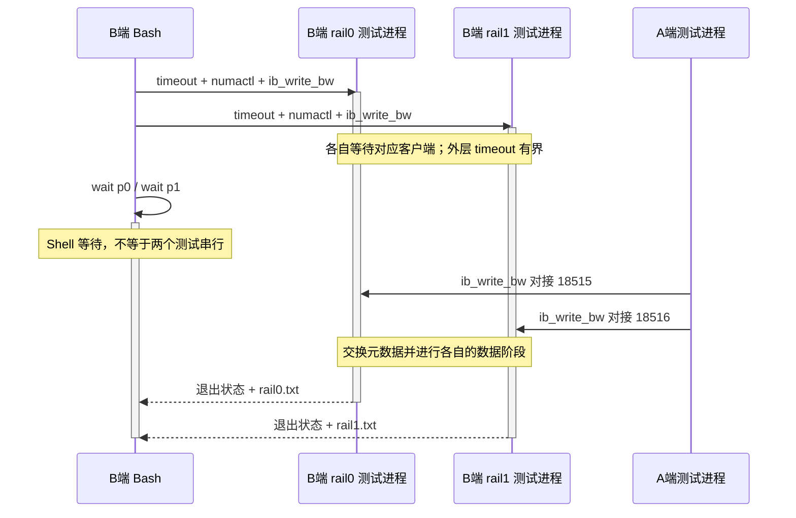
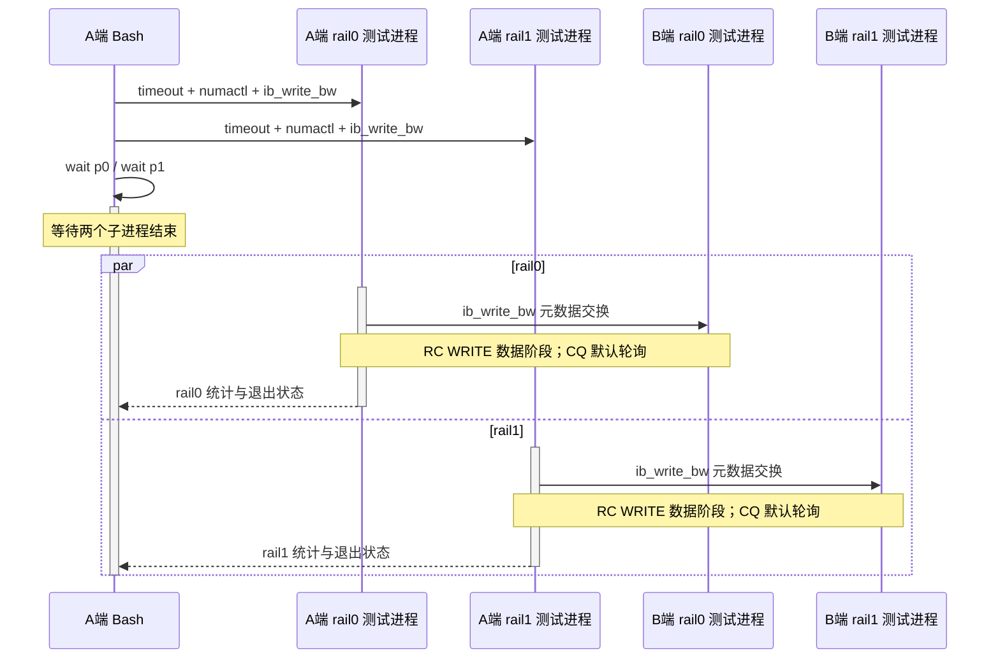

---
tags:
  - 高性能存储
  - RDMA与RoCE
  - NUMA
  - 性能调优
aliases:
  - RDMA Multi-Rail
  - RDMA 拓扑感知与多网卡
阅读次数: 0
核验日期: 2026-09-11
---
# 4.25 RDMA Multi-Rail 与拓扑感知：NUMA、PCIe Root、Multi-NIC、路径选择与负载均衡

> **两张 NIC 只是两个候选入口。Multi-Rail 真正要解决的是：任务分给谁、数据放在哪里、经过哪些共享资源、什么时候才算整体完成。**

本篇以“两台主机、每台两个硬件 RDMA 端点”为基本模型，打通主机拓扑、verbs 资源、路径选择和实验归因。先具备 [[4.2 Verbs 编程模型]]、[[4.4 内存注册与零拷贝]] 的基础；线程与 QP/CQ 的所有权模型可参照 [[4.18 多线程下 QP 使用模型]]。

> [!info] 来源与适用边界
> 本次未能取得本项目 Sources 中可读的教材文件，没有引用未读教材。下文使用官方手册、上游项目文档和明确标注的推导。UCX master 文档、NCCL 页面本次显示的 2.31.2、SPDK 在线文档均不代表用户已安装版本；参数须先核对本机帮助。本文没有在真实双 NIC/GPU/交换机环境上压测，所有性能数字都是算例。

## 1. 六个常被混用的概念

本文把 rail 定义为软件能够选择的一条通信通路：本地设备/端口及资源 → 网络路径 → 远端设备/端口及资源。它可以和物理隔离的网络平面一一对应，也可能在中间重新汇聚；**“多 rail”与“故障域独立”是两个要分别验证的属性**。

| 概念 | 主要解决的问题 | 不自动保证什么 |
|---|---|---|
| Multi-QP | 增加并发、分离队列/流、分担提交与完成处理 | 多 QP 可能全部属于同一 NIC |
| Multi-port / Multi-NIC | 提供多个物理或逻辑端点 | 双口卡可能共享 PCIe、芯片和供电故障域 |
| LAG / bonding | 将若干链路按驱动/交换配置组合为逻辑接口 | 普通 Ethernet bonding 不等于 verbs 跨 NIC 条带化 |
| ECMP | 网络层在等价路径间分配流量 | 不替应用选择本地 MR/PD/NIC；单流不保证铺满所有链路 |
| Multi-Rail striping | 通信库/应用把工作分到多条通路 | 不自动提供跨 QP 顺序、应用提交或故障重放 |
| Multipath / failover | 维护可选择的多路径，故障时切换或按策略分流 | 多路径可用不等于当前处于 active-active |

此表是工程分类，而不是某家产品的统一术语规范。硬件支持的 RoCE LAG、adaptive routing、多端口资源共享等机制有自己的约束；需要按型号与版本验证，不能从 `ip link` 出现一个 bond 就推断应用已经聚合带宽。

## 2. 把拓扑画到 CPU、内存和 PCIe 上，而不是只画网线

![[图片/SVG/8_4_4_25_1.svg|900]]

两条线看起来独立，仍可能共用一个 PCIe switch 上联、一个 Root Complex、一组内存通道、同一交换上联或同一接收 GPU。图中绿色表示较短的局部路径，红色表示额外跨域路径；颜色不代表某种平台必定支持或不支持 P2P。

先为**每一端主机**建立下面的映射，不假定 A 的 `mlx5_0` 与 B 的 `mlx5_0` 必然接在同一 rail：

| 工作单元 | 要记录的映射 |
|---|---|
| 提交/完成线程 | 逻辑 CPU、NUMA node、是否共享核心、CQ 轮询或事件模式 |
| Host buffer | 分配/首次触碰位置、内存策略、实际驻留节点、注册生命周期 |
| RDMA endpoint | HCA、port、netdev、GID 类型/值/索引、PCI BDF |
| PCIe 路径 | endpoint、每级 bridge/switch、Root、实际链路速率与宽度 |
| Fabric | Leaf 端口、上联、独立平面/共享链路、QoS profile |
| 远端 buffer / GPU | 对应 NIC、内存节点或 GPU PCIe 路径、访问权限与完成规则 |

### 2.1 NUMA 本地性与 PCIe P2P 是不同的问题

CPU 与 NIC 接近，通常减少提交、完成处理或访问远端内存的额外路径；GPU 与 NIC 的 P2P，则还涉及 PCIe bridge、Root、路由、IOMMU/ACS 和平台支持。**同一 NUMA node 不足以证明同一 PCIe Root，也不足以证明 GPUDirect RDMA 可用。**

NVIDIA GPUDirect RDMA 文档将 PCIe switches-only、经过单个 CPU/IOH、跨 CPU 互连等路径区分讨论，并说明硬件平台限制与数据访问方向会影响可用性和效率。判断最终落在真实平台的可用性测试和性能测试，而不是一张拓扑标签表。[^G1]

不要为“跑快一点”直接在生产机器全局关闭 ACS/IOMMU。隔离、安全、多租户及平台支持要求与性能目标要一起评估，采用厂商认可的配置，再验证实际 P2P 路径。

## 3. 聚合带宽的上限来自最窄的共享资源

对同一方向、同一统计口径，先建立一个用于排查的上界模型：

$$
B_{effective}\le\min\left(
\sum_i B_{rail,i},\ B_{shared\ PCIe},\ B_{memory},
B_{GPU/target},\ B_{CPU\ completion},\ B_{shared\ Fabric}
\right).
$$

这是**瓶颈预算模型**，不意味着每个变量都能独立达到峰值，也不意味着测得一个瓶颈后其余项不会变化。发送方向的 NIC DMA read 与接收方向的 DMA write，可能受到不同限制。

### 3.1 一个不能靠加 NIC 解决的算例

假定某共同上联工作在 PCIe 4.0 ×16，并以 16 GT/s、128/130 编码效率估算，**单向编码后理论上界**为：

$$
16\times10^9\times16\times\frac{128}{130}\div8
\approx31.5\ GB/s.
$$

这里尚未扣除 TLP、DLLP 等开销，更不是应用实际带宽。若两条 200 Gb/s 网络通路的**同方向大块 payload**都必须经过这一条上联，网络线速之和相当于 50 GB/s，不能期望仅靠它们得到 50 GB/s 的端到端有效吞吐。该计算采用的链路速率/编码是假设输入；现场必须读取实际协商状态，而不是套用网卡广告参数。

如果 GPU 与 NIC 的数据在同一个 PCIe switch 内部走可用 P2P 路径，数据可能不经过所假设的上联；那么上面的瓶颈模型就要改。**先证明数据经过这条边，才把它列为公共瓶颈。**

同样，双向结果相加会让数字变大，但不能拿“TX+RX 总和”去证明某一方向突破了它的上界。

## 4. Linux 上怎样核对真实拓扑

### 4.1 第一轮只读发现

这组查询用于建立设备表，不修改 CPU/网络设置。`lspci -D -t` 保留 PCI domain 并显示树形层级；`numactl --hardware` 显示节点与 CPU。PCI 设备通过 sysfs 的 BDF 目录暴露属性，具体文件以本机内核为准。[^P1][^N1]

```bash
uname -r
rdma link show
ibv_devinfo
numactl --hardware
lspci -D -t
```

不要用“系统有两个 NUMA node”替代实际设备映射。也不要把 NIC 型号相同、设备号相邻当成物理连接方式相同。

### 4.2 HCA 到 BDF、NUMA 和链路状态

下面只查询一个指定设备，避免把网卡编号误当 BDF。`numa_node=-1` 或属性缺失时，把本地性标为未知，再用平台资料和拓扑核实，不能自动当作 node 0。

```bash
set -euo pipefail
DEV=mlx5_0
SYS="$(readlink -f "/sys/class/infiniband/$DEV/device")"
[ -d "$SYS" ] || { printf 'Device not found\n' >&2; exit 1; }
BDF="${SYS##*/}"
printf 'HCA=%s BDF=%s\n' "$DEV" "$BDF"
if [ -r "$SYS/numa_node" ]; then cat "$SYS/numa_node"; fi
if [ -r "$SYS/local_cpulist" ]; then cat "$SYS/local_cpulist"; fi
lspci -s "$BDF" -vv
```

在输出中区分 `LnkCap`（能力）和 `LnkSta`（当前协商结果）；还要沿 `lspci -t` 检查经过的上游 bridge。只看 endpoint 是 ×16，不代表上游每一级都有同样宽度。某些字段读取受权限限制，应保存限制信息而不是猜测。

GPU 主机再查询 `nvidia-smi topo -m` 并与 BDF 对齐。这是拓扑线索，不是 GPUDirect 成功证明；实际传输测试要明确 buffer 在 Host 还是 GPU memory、使用哪种注册路径，并排除经 Host staging 的情况。[^G1]

### 4.3 CPU 绑核、内存放置与 MR 注册的顺序

对于常规预分配的 Host buffer，一种可控的实验顺序是：**设置 CPU/内存策略 → 在目标策略下分配并触碰内存 → 注册 MR → 开始测量**。只把线程搬到另一个节点，并不会自动把已经分配和注册的数据变成本地内存。ODP、显式迁移、容器 cpuset 等情况需要另行验证，不能套用同一个简单模型。

`numactl --physcpubind` 约束逻辑 CPU，`--membind` 约束内存节点；节点内存不足或 cpuset 不允许时可能失败。把这种失败当作配置证据，不要悄悄删除 `--membind` 后仍声称做了同样的 NUMA 实验。[^N1]

应用若忙轮询 CQ，关键成本在提交/完成线程及其访问路径；调整 RSS/RPS 或 IRQ affinity 不会自动把这个用户态轮询线程搬到正确节点。使用 CQ event 模式时再把中断和唤醒链一起纳入观测。默认 perftest 的 CQ 行为是 polling，`-e` 才启用 event 方式。[^T1]

## 5. Multi-NIC 对 verbs 资源意味着什么

`ibv_create_qp()` 创建的 QP 关联一个 PD；MR 也通过 `ibv_reg_mr()` 注册到 PD。对于独立 HCA，应用通常要分别管理 device context、PD、CQ、QP 和 MR/key；不能把一个设备上的 key 当成全局通用令牌。[^V1][^V2]

| 对象 | 在多 rail 设计里应该明确的内容 |
|---|---|
| Device context / PD | 属于哪个设备、保护域与释放顺序 |
| QP / CQ | 绑定的端口/地址路径、完成由哪个线程处理 |
| Local MR / lkey | 这段 buffer 经哪个 PD 注册，供哪个 QP 引用 |
| Remote addr / rkey | 对应远端哪个注册对象、地址范围和连接 epoch |
| 应用请求 | 被分成哪些 chunk，分发到哪个 rail，完成数与失败状态 |

同一段 Host 虚拟内存需要由多个独立 HCA 访问时，通常要为各自 PD 建立合法注册，并分别交换远端访问元数据；不能只复制一个 `rkey` 字段。有些设备的多个端口共享同一个 context/PD，或者支持专用资源共享扩展，这不等于“每个端口都必须新建完全独立 PD”，也不等于“所有网卡都可共享 MR”。

key 的撤销、旧连接引用和重建之后的使用边界，接到 [[4.12 rkey lkey 生命周期]]；提交与清理线程间的资源所有权，接到 [[4.18 多线程下 QP 使用模型]]。

### 5.1 选择远端 IP 不等于证明选中了某张 NIC

经典 verbs 程序可能用 TCP 交换 QP/GID/MR 元数据，再让硬件 QP 执行数据传输。此时命令最后的服务器 IP 可能主要用于控制连接；数据路径还要由本地 HCA/port/GID 与交换后的远端路径决定。`rdma_cm` 又有自己的地址解析和设备关联流程，不能把两个模式混着解释。[^T1]

验证实际选择时要保留：程序打印的本地/远端设备和 GID、QP 信息、被选中 netdev 的计数，以及对端和交换端口对应的字节增长。对于同一网卡多个地址或 GID index 的场景，尤其不能只看一条 `ip route`。

## 6. 跨 rail 完成：最快一条不能替最慢一条宣布成功

![[图片/SVG/8_4_4_25_2.svg|900]]

设一个逻辑消息被拆成 `chunk[0]` 和 `chunk[1]`，分别经过 QP0/QP1。两个 chunk 写入不同范围，以便独立跟踪。**QP0 上的某次完成不是 QP1 的完成屏障。** 基本顺序边界参见 [[4.13 RDMA 操作顺序性]]；fence 的适用条件参见 [[4.14 Fence 与内存可见性]]。

为便于教学，可先选择最保守的模型：每个 chunk 使用可追踪的完成记录；只有所有 chunk 的所需完成条件满足，发送者才发送带 `request_id/epoch` 的逻辑提交消息。若任何 chunk 报错，该请求进入“未完成/结果待确认”，不能只把缺失 chunk 数减到零就算成功。

这仍然需要区分三层语义：

| 层次 | 在回答什么 | 还不能替代什么 |
|---|---|---|
| 传输完成 | 某条操作满足所选 transport/API 的完成条件 | 所有其他 QP 已完成、远端业务已接受 |
| 应用发布/确认 | 接收者按协议确认片段完整，并允许消费者使用 | GPU 并发内核的可见性或存储持久化 |
| 消费/持久化 | 目标执行环境按自身规则读到了数据或完成落盘 | 其他执行环境未建立的顺序 |

GPU memory 还要遵守 GPUDirect RDMA 与 CUDA 的同步/可见性约定；一个 NIC CQE 或 CPU `std::atomic_thread_fence` 不能凭空替代 GPU 侧要求。普通 Host memory 模型也不能在开启 relaxed ordering 等选项后不加验证地照搬。[^G1][^V2]

实际通信库可能通过自己的 flush、fence、控制消息或协议状态机实现上述条件，而不是采用“每片一次 CQE”的低效教学方式。先证明正确，再用 unsignaled/batching 优化；相关性能手段见 [[4.15 Signaled Unsignaled WR]] 与 [[4.16 Inline Batching 与 Doorbell 优化]]。

### 6.1 故障切换不等于搬走一条在途 QP

新请求可以选择健康 rail；旧 QP 上的未确认操作不能通过“换 NIC 指针”直接迁移。要记录未完成请求、旧 epoch、可能已到达远端的片段，以及哪些操作可以重放。幂等写入、原子增量和涉及业务副作用的请求，重试规则并不相同。

可用性的验收至少包含：检测时间、切换时间、重试量、重复副作用、旧 key 是否仍被引用、恢复 rail 是否正确重新注册/握手。实现细节回到 [[4.19 RDMA 故障恢复与连接重建]]，不要用成功建立新 QP 代替请求一致性验证。

## 7. 负载均衡：先决定分配粒度，再决定权重

| 分配粒度 | 适用倾向 | 代价与风险 |
|---|---|---|
| 按进程/rank/线程 | 多工作单元、强调局部性和简单资源所有权 | 单个工作单元可能仍只用一条 rail |
| 按流/连接 | 大量相对独立流，可保留单流顺序 | 大流大小不均或 hash 碰撞造成失衡 |
| 按消息/I/O | 请求之间独立，适合队列感知选择 | 需处理大小差异、排队和失败重试 |
| 按 chunk 条带化 | 大消息，单条 rail 已成为主要瓶颈 | 合并、跨 QP 完成与慢 rail 尾部等待 |

不能把“轮询分发相同数量的请求”当成“分配了相同字节”，也不能把“相同字节”当成“相同完成时间”。例如一个 rail 接到少量大请求，另一个接到很多小请求，包率与字节率的瓶颈就不同。

**一个简化的静态权重推导：** 若大消息总量为 M、两条独立 rail 的稳定有效速率为 `b0/b1`，忽略启动及排队成本，要让两条通路接近同时完成，应取 `m0/m1≈b0/b1`，而不是总是 50/50。这里的 `b` 应来自可比条件下的实测，不是网卡标称线速。

**尾延迟边界：** 条带化的消息完成时间近似由最慢片段决定：`T_message≈max(T_chunk,i)+T_join`。rail1 出现拥塞时，继续等分可能反而拖慢整体。因此动态调度需要结合在途字节、近期服务速率、NUMA 代价和故障状态；还要设置滞回，避免瞬时波动造成反复切换。

对于小消息，多轨建立、分片和汇合成本可能高于传输收益。判断应画消息尺寸与延迟/吞吐的交叉点，而不是设置一个“所有消息都双 rail”的总开关。

## 8. UCX、NCCL 与 SPDK：同样多路径，不是同一种策略

### 8.1 UCX：设备候选集合与 Rendezvous rail 上限分开看

UCX 文档说明其多轨选择会考虑网络速度、PCIe 带宽与 NUMA，并支持对大消息分片。`UCX_NET_DEVICES` 约束候选设备；`UCX_MAX_RNDV_RAILS` 约束 Rendezvous 使用的 rail 数量上限。设置为 2 不是“每个消息一定用两条”的证据。[^U1]

以下片段先查看本机支持，再设置**当前 shell 后续启动进程**的环境；它不启动作业、不修改系统 NIC 配置。先以单 rail 作对照，再改成 2。设备名由各节点自己的拓扑表生成。

```bash
ucx_info -v
ucx_info -d
ucx_info -cf
export UCX_NET_DEVICES=mlx5_0:1,mlx5_1:1
export UCX_MAX_RNDV_RAILS=2
export UCX_LOG_LEVEL=info
```

用已确认支持 UCX 的测试程序/应用启动并收集所选设备和协议；协议 v2 环境可以按本机支持启用 `UCX_PROTO_INFO=y` 观察不同消息区间。环境变量必须传到每个相关 worker，仅设置启动节点的 shell 可能不够。GPU 应用不要为“强制 RDMA”随意把 `UCX_TLS` 限制到不含 GPU 支持的集合。[^U1]

### 8.2 NCCL：选择哪些 HCA，与是否允许跨 rail 配对是两个问题

本次核对的 NCCL 2.31.2 文档中，`NCCL_IB_HCA` 用于指定 RDMA HCA；以 `=` 开头可精确匹配名称，避免 `mlx5_1` 前缀误匹配 `mlx5_10`。`NCCL_CROSS_NIC` 影响 ring/tree 跨节点的 NIC 配对，**不是 Multi-Rail 开关**。[^L1]

```bash
export NCCL_IB_HCA='=mlx5_0:1,mlx5_1:1'
export NCCL_DEBUG=INFO
# 只有确认 rail-optimized 拓扑后，才为对照组设置：
# export NCCL_CROSS_NIC=0
```

这里仅设置候选与日志；没有启动 collective。`CROSS_NIC=0` 倾向在对应 NIC/rail 上通信，`1` 允许跨 NIC，`2` 在文档中表示尽量保留同 NIC、必要时允许更优选择。需要与平台的 rail-optimized 或共享 Fabric 拓扑匹配，而不是机械认为 0 最快。`NCCL_SOCKET_IFNAME` 不是这组 RDMA HCA 选择参数的替代品。[^L1]

真正验收应跑目标消息区间的 collective，把拓扑/设备选择日志、两条 NIC 的 payload 方向和 collective 完成时间一起保存。两块 GPU 的编号顺序、两张 NIC 的名字顺序，不是跨节点物理 rail 对应关系的证明。

### 8.3 NVMe-oF / SPDK：多路径要看 active policy 与 ANA

SPDK 文档区分 failover 与 multipath：前者在切换时连接备用路径，后者为各路径保持连接，再依据 active-passive / active-active 策略选择。active-active 可按 round-robin 或最小 queue depth 分配 I/O，并受 ANA 状态影响。[^S1]

因此，“同一 namespace 出现两条路径”不能证明双 NIC 同时承载业务，也不表示每条 NVMe 命令都会拆到两条 NIC。应逐路径观察 I/O、在途量、ANA、重试和实际网络字节；再检查目标控制器、后端盘或共享 PCIe 是否已成为瓶颈。这是 I/O 级路径选择，不应与通信库的大消息分片混成一个概念。

## 9. 实验闭环：先测主机容量，再测应用分流

![[图片/SVG/8_4_4_25_3.svg|900]]

先做阶段 A：两个独立 perftest 流并行，验证两条路径同时工作时主机/网络能达到多少容量。再做阶段 B：用一个真实 UCX/NCCL/存储工作负载验证它是否利用了这些容量。**阶段 A 成功不能代替阶段 B。** perftest 是合成微基准，并不模拟完整业务。[^T1]

### 9.1 实验前填写两端各自的 rail 表

| 字段 | rail0 | rail1 |
|---|---|---|
| 本端 HCA / port / netdev | 现场填写 | 现场填写 |
| 本端 CPU / 内存节点 | 现场填写 | 现场填写 |
| 本端 GID index / GID 类型 / 对应 IP | 现场填写 | 现场填写 |
| 对端 HCA / port / netdev / GID | 现场填写 | 现场填写 |
| 经过的 PCIe / Fabric 公共边 | 现场填写 | 现场填写 |
| 测试 QoS、MTU、设备/软件版本 | 现场填写 | 现场填写 |

确认使用 **RoCEv2** 的 GID 项，且与目标 netdev、地址和路由场景相符。`show_gids` 是否可用取决于安装环境；也可查询 `/sys/class/infiniband/<dev>/ports/<port>/gids/` 及 `gid_attrs/types/`、`gid_attrs/ndevs/`。索引是各机器本地的，**不能要求两端恰好同一个数字**。

运行前查 `ib_write_bw --help` 与 `ib_write_bw -V`，固定 RC、消息尺寸、QP 数、TX depth、CQ moderation、MTU、统计单位和 QoS。下面省略平台特定 QoS 参数，前提是隔离实验环境已有经确认、能正确分类该测试流量的 profile；不拿默认分类未知的命令直接压生产网络。

### 9.2 参数准备：每台主机独立填写，不从对端复制 GID index

在两端各自的 Bash 中设置下面变量。CPU/节点是**示例拓扑**，必须先按 §4 改为本机真实值；GID 不提供猜测默认值，未设置时会明确拒绝继续。

```bash
DEV0=mlx5_0; PORT0=1; CPU0=2;  NODE0=0
DEV1=mlx5_1; PORT1=1; CPU1=34; NODE1=1
: "${GID0:?先将本机 rail0 的 RoCEv2 GID 索引赋给 GID0}"
: "${GID1:?先将本机 rail1 的 RoCEv2 GID 索引赋给 GID1}"
LOG="$(mktemp -d "${TMPDIR:-/tmp}/multi-rail.XXXXXX")"
printf 'Logs: %s\n' "$LOG"
```

使用独立目录是为了避免多次运行覆盖结果。后面的命令会产生测试流量，只能在许可的实验环境执行。设备名、端口号、GID、CPU/NUMA 允许两端不同；消息尺寸、时长、连接类型和同一对测试的控制端口等协议参数必须匹配。[^T1]

### 9.3 在 B 端先启动两个监听进程

在已经完成参数准备的 B 端运行。外层 `timeout` 限制等待连接和运行的总时长，避免把一个无人连接的测试一直留在机器上；`-D 30` 是测试的数据阶段时长。两个 TCP 控制端口分别使用 18515/18516，它们不是 RoCE UDP 数据目的端口。[^T1]

```bash
set -uo pipefail
timeout -k 5s 120s numactl --physcpubind="$CPU0" --membind="$NODE0" \
  ib_write_bw -d "$DEV0" -i "$PORT0" -x "$GID0" -p 18515 \
  -c RC -s 65536 -q 1 -t 128 -D 30 > "$LOG/rail0.txt" 2>&1 &
p0=$!
timeout -k 5s 120s numactl --physcpubind="$CPU1" --membind="$NODE1" \
  ib_write_bw -d "$DEV1" -i "$PORT1" -x "$GID1" -p 18516 \
  -c RC -s 65536 -q 1 -t 128 -D 30 > "$LOG/rail1.txt" 2>&1 &
p1=$!
rc=0
wait "$p0" || rc=1
wait "$p1" || rc=1
printf 'status=%s; inspect %s\n' "$rc" "$LOG"
```



两次 `wait` 是依次回收状态，不会把已经通过 `&` 启动的进程串行化。这里不用会在第一条 `wait` 失败后提前退出的写法，以便收齐另一条 rail 的结果；非零状态仍须检查对应日志。

### 9.4 在 A 端并行发起测试

A 端使用自己填写的参数。先将 `PEER0/PEER1` 设为 B 端实验地址；下列文档地址必须替换，不能原样使用。选择这两个 IP 仍需配合 HCA/GID/对端打印信息和字节计数验证路径。

```bash
set -uo pipefail
PEER0=192.0.2.10      # 文档示例：替换为 B 端实际实验地址
PEER1=198.51.100.10   # 文档示例：替换为 B 端实际实验地址
timeout -k 5s 120s numactl --physcpubind="$CPU0" --membind="$NODE0" \
  ib_write_bw -d "$DEV0" -i "$PORT0" -x "$GID0" -p 18515 \
  -c RC -s 65536 -q 1 -t 128 -D 30 "$PEER0" > "$LOG/rail0.txt" 2>&1 &
p0=$!
timeout -k 5s 120s numactl --physcpubind="$CPU1" --membind="$NODE1" \
  ib_write_bw -d "$DEV1" -i "$PORT1" -x "$GID1" -p 18516 \
  -c RC -s 65536 -q 1 -t 128 -D 30 "$PEER1" > "$LOG/rail1.txt" 2>&1 &
p1=$!
rc=0
wait "$p0" || rc=1
wait "$p1" || rc=1
printf 'status=%s; inspect %s\n' "$rc" "$LOG"
```



图中特意区分 Shell 等子进程与测试进程轮询 CQ：它们是两种不同的等待。两条流启动仍会有偏差；不要仅因为都使用 `-D 30` 就假定统计窗口完全一致。

### 9.5 基线、并行、反例与应用验证

| 组别 | 运行方法 | 要回答的问题 |
|---|---|---|
| A0 | 只运行 rail0 那一对命令 | rail0 独立能力是多少？ |
| A1 | 只运行 rail1 那一对命令 | rail1 是否本来就弱？ |
| A01 | 两对同时运行 | 是否存在明显共享瓶颈？ |
| A-NUMA | 保持同 NIC/网络，单独改变 CPU/内存策略 | 本地性对不同方向影响多大？ |
| A-QP | 保持其他条件，扫描 QP 数 | 提高单 NIC 并发是否已能达到同样收益？ |
| B-app | 单个真实应用工作负载，比较 1/2 rails | 通信库是否真正分流，整体完成是否受益？ |
| B-failure | 仅在批准的测试环境制造一条路径不可用 | 检测、重试、恢复和业务正确性是否满足目标？ |

做 RDMA READ 对照时，发起端与大块数据方向相反，端口 TX/RX 与内存读写方向要重新标注。需要 p99 时，增加明确报告单次请求/消息完成分布的测量，不能从一个带宽均值推导 p99。perftest 延迟测试的报告口径也要按其方法说明解释。[^T1]

## 10. 怎样量化收益，又不把不同口径相加

令 `b0`、`b1` 是单独运行时同一方向的有效吞吐，`b01` 是并行组在共同稳态窗口内的总有效吞吐：

$$
S=\frac{b_{01}}{\max(b_0,b_1)},\qquad
\eta=\frac{b_{01}}{b_0+b_1}.
$$

`S` 是相对最快单 rail 的提升；`η` 描述保留了多少两条独立基线之和。**两者没有适用于所有平台的统一合格线。** QP 数、消息尺寸、应用协议、共享资源和测量噪声都影响解释。

假设单独测试为 22 与 21 GB/s，并行总和为 29 GB/s，则 `S≈1.32`、`η≈0.67`。这组**教学数字**说明增加路径确实有收益但未接近两条独立能力之和；它只能提示检查共享路径，不能仅凭结果确认“PCIe 瓶颈”。

同时核对两种字节口径：应用成功完成的 payload 与每个物理端口的 TX/RX。端口字节可能包含协议开销或重传，且某些 netdev 字段不含硬件 RDMA；具体选择与窗口处理见 [[4.24 RoCE Fabric 故障诊断：PFC Storm、Pause Propagation、ECN与CNP、丢包与拥塞定位]]。

记录工具输出里的单位。不要把 MiB/s 当 MB/s，也不要混合单向/双向结果；并行启动偏差明显时，不能简单相加两个不同时间窗口的均值。严格结果应在同步或已确认重叠的稳定区间按同口径字节计算。

### 10.1 一张诊断表，把“没有翻倍”拆开

| 结果组合 | 先查什么 | 不要马上做什么 |
|---|---|---|
| 两条单测都好，同时跑总量受限 | PCIe/内存/Fabric 公共边、目标吸收能力 | 直接再加两张 NIC |
| 其中一条单测就差 | 链路协商、NUMA、QoS、该路径物理错误 | 将所有任务平均分给它 |
| 两条 NIC 都忙，应用完成时间无改善 | 慢片段等待、序列化点、Host staging、同步成本 | 只截取端口字节证明优化成功 |
| 候选列表有两条，只有一条传数据 | 实际协议/设备选择、消息尺寸、路径状态 | 把环境变量截图当执行证据 |
| 吞吐提高但 p99/重试变差 | 排队、动态分流震荡、跨 QP 汇合、故障策略 | 只按平均吞吐宣布成功 |
| 切换后 QP 恢复但业务结果错误 | 请求 epoch、幂等与旧 key/片段 | 靠增加 retry 次数掩盖一致性问题 |

## 11. 实验产出和自测标准

一份能支撑工程讨论的产出，应包含：两端真实拓扑表、所有版本与启动参数、单 rail 和双 rail 的共同口径结果、每个端口实际字节、至少一次 NUMA/共享路径反例，以及真实应用的分流与正确性验证。硬件不足时可以先完成拓扑调查与协议设计，但要明确“未验证聚合带宽”，不能用模拟数字填结果表。

**双口卡就是两条独立 rail 吗？** 它可以提供两个可选端口，但共享 PCIe/芯片/电源等故障域，需要分别核验带宽和可靠性。

**增加 QP 为何不等于增加 NIC？** QP 仍属于具体设备资源；调高 `-q` 不会自动跨设备建立另一套数据路径。

**为什么绑核之后可能没变快？** buffer 位置、PCIe 共享资源、远端吸收或网络出口仍可能限制路径；只控制一个变量不能保证整体突破。

**为什么不能把最后一个 chunk 的 CQE 当成全消息成功？** 多个 QP 没有由提交先后自然形成的全局完成顺序，必须跟踪所需的每条完成条件与应用提交。

**为什么 UCX/NCCL/SPDK 不能套同一张参数表？** 它们分别可能按消息协议、collective 拓扑、I/O 路径及 ANA 策略决策，候选设备列表不是共同的调度算法。

## 参考资料与核验范围

访问核验日期：2026-09-11。下面链接用于支撑 API/参数语义；模型、实验矩阵及算例为本文的工程推导，不冒充厂商实测。

[^P1]: Linux Kernel Documentation，[Accessing PCI device resources through sysfs](https://docs.kernel.org/PCI/sysfs-pci.html)。用于 PCI BDF/sysfs 与设备属性发现。
[^N1]: numactl 上游手册，[numactl(8)](https://man7.org/linux/man-pages/man8/numactl.8.html)。核对 CPU 与内存策略及其限制；man7 为手册镜像。
[^V1]: rdma-core 上游手册，[ibv_create_qp(3)](https://man7.org/linux/man-pages/man3/ibv_create_qp.3.html)。核对 QP、PD、CQ 关联。
[^V2]: rdma-core 上游手册，[ibv_reg_mr(3)](https://man7.org/linux/man-pages/man3/ibv_reg_mr.3.html)。核对 MR 与 PD、lkey/rkey、访问与 relaxed ordering 语义；不将 MR key 解释为跨设备全局句柄。
[^G1]: NVIDIA，[GPUDirect RDMA](https://docs.nvidia.com/cuda/gpudirect-rdma/index.html)，PCIe 拓扑与 Synchronization and Memory Ordering 相关章节。用于 P2P 路径限制与 GPU 可见性边界；现场仍需按 GPU/驱动/平台核验。
[^U1]: OpenUCX，[Frequently Asked Questions](https://openucx.readthedocs.io/en/master/faq.html)，Selecting networks and transports、Multi-rail、Introspection。核对设备约束、Rendezvous rail 参数、配置与协议显示；master 文档不是固定部署版本。
[^L1]: NVIDIA，[NCCL Environment Variables](https://docs.nvidia.com/deeplearning/nccl/user-guide/docs/env.html)，本次页面显示 **2.31.2**。核对 `NCCL_IB_HCA`、`NCCL_CROSS_NIC`；不假定旧版本具有全部同样选项。
[^S1]: SPDK，[NVMe Multipath](https://spdk.io/doc/nvme_multipath.html)。核对 failover/multipath、active-active/active-passive、ANA 与 I/O path 选择。
[^T1]: linux-rdma/perftest，[README](https://github.com/linux-rdma/perftest/blob/master/README)。核对合成微基准定位、控制连接、`-d/-i/-x/-p/-q/-D/-e` 和测量口径。本次读取文件 blob SHA：`d6ecf2c19f88963024f4df1b6fde18f8470f42cb`；执行仍以已安装二进制 `--help` 为准。
