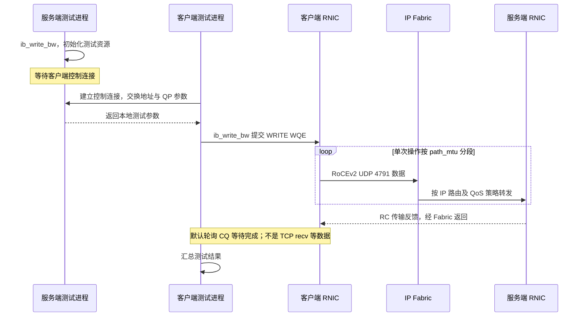

---
tags:
  - 高性能存储
  - RDMA与RoCE
  - 网络协议
  - RoCEv2
aliases:
  - RoCEv2 报文与地址体系
  - RoCEv2 Packet and Addressing
status: 草稿
核查日期: 2026-09-11
---

# RoCEv2 报文与地址体系：Ethernet、VLAN、IP、UDP、BTH、GID、Traffic Class 与 MTU

> 看懂一个 RoCEv2 包，要能分别回答：下一跳是谁，目的主机是谁，交给哪个 QP，访问哪块注册内存，沿途按什么业务类别处理，以及这一包究竟有多大。它们不是同一个地址，也不是同一个“优先级”。

[[4.6 RoCE 与 InfiniBand]] 给出承载关系；本篇把报文字段、Linux 地址对象和 verbs 参数逐项对应。QP 的状态转换沿用 [[4.3 QP WQE CQ 状态机]]，不重复完整建链代码。至于线上标记怎样映射成交换机队列，交给同批笔记 [[4.27 RoCE QoS 工程：PCP、DSCP、Priority Queue、PFC Priority 与 ECN Queue Mapping]]。

**范围与证据**：以普通 Ethernet 上的 RoCEv2、RC 单播、无隧道、单层或无 VLAN 标签为主。链路/IP 基础来自项目教材；RoCE、GID 和驱动行为用 NVIDIA DOCA 3.4.0 文档及 Linux **v6.12** 源码补充；实验参数核对 perftest 固定提交。这里不是针对某一款 RNIC 的固件配置手册，也不覆盖所有厂商扩展。所有数值例子均为演算，未冒充真实抓包或 RNIC 实测。

## 1. 先分开五套标识

| 要解决的问题 | 对象或字段 | 谁使用它 | 不要混成什么 |
| --- | --- | --- | --- |
| 这一跳把帧交给谁 | Ethernet Destination MAC | 链路设备、L2 转发 | 不一定是最终远端 RNIC 的 MAC |
| 跨 IP 网络去哪里 | IPv4/IPv6 目的地址 | 路由器、目的主机 | 不是远端虚拟地址 |
| 本地选哪个 RDMA 地址上下文 | RDMA device、port、GID value/type、netdev、GID index | 应用、RDMA core、驱动 | GID index 不是线上字段 |
| 目的端交给哪个传输上下文 | BTH Destination QPN | 目的 RNIC | UDP 4791 不负责区分所有 QP |
| 执行哪一次远端内存操作 | RETH 中的地址、rkey、长度等 | RNIC 的传输及内存保护逻辑 | rkey 不是路由地址，也不是加密密钥 |

QoS 还有另一组标识：VLAN PCP、IP DSCP/ECN、设备内部 TC/PG/Queue。它们决定处理方式，不决定远端内存权限。内存权限和 key 的寿命仍应按 [[4.12 rkey lkey 生命周期]] 管理。

这张表是排障顺序，而非严格的芯片流水线图：先证明包能到正确的链路和主机，再确认 QP 和内存访问，最后把性能问题落到具体服务类别上。[^tcpip][^roce][^rxe-hdr]

## 2. 线上封装：不要在 IPv6 后面再加一个 GRH

![[图片/SVG/8_4_4_26_1.svg|900]]

图上半部是封装顺序，下半部是 BTH 的三个 32-bit 字。**方框宽度按教学排版，不代表所有字段的实际字节比例；长度以标签为准。**

### 2.1 常见 RC 数据报文的组成

| 部分 | 长度 | 作用与边界 |
| --- | ---: | --- |
| Ethernet MAC Header | 14 B | 目的 MAC 6 B、源 MAC 6 B、EtherType 2 B；不含 VLAN |
| 可选 802.1Q 标签 | 每层 4 B | 单标签包含 TPID 和 TCI；有标签时内层 EtherType 仍标识 IP |
| IPv4 Header / IPv6 Base Header | 20 B / 40 B | IPv4 数字以无 options 为前提，IPv6 数字不含 extension headers |
| UDP Header | 8 B | 目的端口 4791，源端口可用于流熵 |
| BTH | 12 B | opcode、目的 QPN、PSN、控制位等 |
| opcode 对应的扩展头 | 可变 | 如 RETH、AETH、Immediate Data；不是每包全部都有 |
| Data 与传输层 Pad | 可变 | Pad Count 描述 0–3 B 的传输填充 |
| ICRC | 4 B | RoCE 端到端完整性检查的一部分 |
| Ethernet FCS | 4 B | 当前 Ethernet 帧的链路完整性检查 |

Ethernet 的 preamble/SFD 和帧间隙影响线速占用，但不计入通常从 Destination MAC 到 FCS 的帧长度，也不属于 IP MTU。小帧还可能有以太网最小帧填充；本篇的大数据包算例不触及该下限。[^tcpip][^ipv6][^rxe-hdr]

**RoCEv2 的 IP 头就是这里的网络层头。** verbs 结构体里名为 `grh` 的参数组织方式，不意味着线上变成 `IPv6 + 另一份 IB GRH + UDP`。RoCEv2 也不携带用于普通 InfiniBand 子网 LID 转发的 LRH。对照时应区分“API 的字段名”“ICRC 计算中的虚拟输入”和“实际发出的字节”。[^roce][^rxe-crc]

### 2.2 Ethernet、VLAN 和 IP 的类型标识

无 VLAN 时，MAC Header 的 EtherType 可以直接为 IPv4 的 `0x0800` 或 IPv6 的 `0x86DD`。使用常见 802.1Q C-tag 时，外层先遇到 `0x8100`，然后是 TCI，再读取标识 IP 的 EtherType。**RoCEv1 的 `0x8915` 不是 RoCEv2 的 IP EtherType。**[^tcpip][^roce]

单标签的实际字节顺序为 `DA(6) | SA(6) | TPID(2) | TCI(2) | 内层EtherType(2)`；表中的“MAC Header 14 B + 标签4 B”是长度拆账，不能误画成重复两次TPID。单个 TCI 为 16 bit，分成 PCP 3 bit、DEI 1 bit、VID 12 bit。VID 和 PCP 解决不同问题：前者参与 VLAN 归属，后者是优先级标记。VID=0 的 priority-tagged 帧与“完全没有 VLAN 标签”的帧不同：前者仍可承载 PCP，后者没有可供解析的 PCP 字段。[^tcpip]

教材对标记编码与设备处理策略进行了区分。本篇也不把 PCP 数字大小当作所有设备上的固定调度顺序，更不把某个 VLAN 天然视为“无损网”。优先级到队列的映射需要另外配置。

### 2.3 不同操作为什么看起来不一样

| RC 报文场景 | 要找的主要头部 | 读包时的关键判断 |
| --- | --- | --- |
| WRITE First / WRITE Only | BTH + RETH | RETH 给出远端地址、rkey 和操作长度 |
| 多包 WRITE 的 Middle / Last | BTH；按 opcode 决定额外字段 | 不应要求每个分段重复携带 RETH |
| READ Request | BTH + RETH | 请求远端读取，不携带等量的目标数据 |
| READ Response | BTH；部分响应 opcode 带 AETH | 大数据方向与 READ 请求方向相反 |
| ACK / NAK | BTH + AETH 等 | 是传输反馈，不是数据搬运的等长回包 |
| SEND | BTH；按 opcode 决定额外字段 | 接收缓冲来自对端接收队列，不用 WRITE 的 RETH 模型解释 |

这是 RC 的阅读索引，不是覆盖 UD/XRC 等所有传输类型的完整 opcode 表。RETH 为 16 B：64-bit 地址、32-bit rkey、32-bit 长度；AETH 为 4 B。需要按位实现解码器时，必须再按具体 opcode 和规范核对整个头部组合。[^rxe-hdr][^rxe-opcode]

## 3. BTH：IP 把包送到主机，QPN 才把包交给 QP

BTH 最容易混淆的三个字段是 **opcode、Destination QPN、PSN**。

**opcode** 标识传输操作及其分段角色。例如，大 WRITE 的第一段和中间段并不具有相同的扩展头布局。抓包时先读 opcode，再解释紧随其后的字节，不能先假定“BTH 后面就是远端地址”。

**Destination QPN** 的有效 QP 编号部分为 24 bit。它由目的 RNIC 用于查找 QP 上下文。普通 RC BTH 中没有再放一个对称的 24-bit Source QPN 字段；对端关系保存在连接上下文中，其他传输类型可以有不同扩展头。

**PSN** 为 24 bit 的包序号，不是 TCP 字节序号，也不是应用事务 ID。包的 ACK、重试和有序接收不能直接代替应用的请求去重或崩溃恢复协议。传输错误处理见 [[4.17 Retry RNR 与 Timeout]]，应用恢复边界见 [[4.19 RDMA 故障恢复与连接重建]]。[^rxe-hdr]

BTH 还含 P_Key、Pad Count、AckReq 等字段。图中将部分字节合并标为“控制/保留”，是为了突出查 QP 和排序所需字段，不表示那些位都可以任意填写。**IP ECN 的 CE 标记与 BTH 中可能出现的拥塞相关位不是同一组 bit。** RoCEv2 常见 ECN/CNP 路径应先检查外层 IP ECN，而不是把 InfiniBand 头部术语直接搬过来。

## 4. GID 与路由：一个本地表项，关联一组线上行为

![[图片/SVG/8_4_4_26_2.svg|900]]

图左强调本地选择必须同时匹配多个属性；图右显示经路由转发时，**L2 目的地址逐跳改变，而目的 IP 仍指向最终接收端**。图中的地址是文档示例，不代表现有机器。

### 4.1 GID 的 128 bit 不等于“必走 IPv6”

Linux RoCE GID 表项要至少按下面这个元组理解：

```text
(RDMA device, RDMA port, GID index,
 GID value, GID type, associated netdev)
```

RoCEv2 的 IPv4 地址可表现为 IPv4-mapped IPv6 格式的 GID。例如 `192.0.2.10` 可以在 GID 表里显示为 `::ffff:192.0.2.10`。这是 GID 的表示和映射方式，**并不把线上报文变成 IPv6**。原生 IPv6 地址对应另一类表项。[^roce]

同一个 GID value 可以对应不同的 RoCE 类型；不同 IP、VLAN netdev 也可以带来不同表项。因此“找到第一个非零 GID”不够，“找到第一个 v2 GID”也未必够：它可能属于错误的端口、地址族、VLAN 或源地址。

### 4.2 GID index 是本地槽位，不是连接双方共同的编号

A 的 `gid_index=3` 与 B 的 `gid_index=3` 没有身份相等的含义。双方可以分别使用索引 3 和 7，只要各自选中的地址及传输类型符合连接需要。

索引也不应当作持久配置 ID。添加 IP、创建 VLAN、驱动初始化或其他地址配置变化后，应重新枚举并验证。保存实验记录时，既要保存 index，也要保存 **value、type、port 和 netdev**，这样才能知道“今天的 3”是不是“昨天的 3”。[^roce][^gid-api]

### 4.3 经路由时，谁负责求下一跳

对普通 IP 转发而言，发送端先按目的 IP 选择路由、出接口和源地址，然后用 ARP（IPv4）或邻居发现（IPv6）解析本链路下一跳。远端不在本地子网时，Ethernet 目的 MAC 通常是网关/路由接口的 MAC，不是最终主机的 MAC。

随后每个路由跳重新构造相应 L2 封装，并更新 TTL/Hop Limit；在本篇不含 NAT/隧道的模型中，目的 IP 不随每跳更换。VLAN 标签可能随接口封装被添加、删除或改变，不能拿第一跳的 PCP/VID 推断每条上联的线上字节。[^tcpip-ip][^ipv6]

RDMA CM 可以帮助解析地址和路由；手工 verbs 建链则需要应用提供一致的地址向量和对端参数。`ibv_modify_qp()` 把 QP 改到 RTR，并不意味着它会自动扫描整个 Fabric 的 PMTU，或替应用与远端协商所有值。具体 CM 生命周期见 [[4.11 RDMA CM 与连接建立]]。[^roce][^modify-qp]

**IPv6 link-local 地址**还带有接口作用域，不应当作为任意跨三层 Fabric 的全局可达地址使用。多端口、多 VLAN 场景必须把地址和接口一起记录，不能只复制一个 `fe80::...` 字符串。

## 5. UDP 4791：识别 RoCEv2，不代表“普通 UDP Socket”

RoCEv2 使用 UDP 封装，其目的端口为 **4791**。RNIC 在该封装中承载 RDMA 传输语义；应用仍通过 verbs/对应库提交工作，而不是给一个绑定 4791 的普通 UDP socket 直接传 rkey 和地址。RC 的可靠性属于 RNIC 的 RDMA 传输实现，并不是 UDP 自己增加了 ACK 和重传。[^roce]

UDP 源端口可提供 ECMP/LAG 哈希所需的熵。普通五元组哈希交换机可以在不理解 BTH 的情况下，把不同流分到不同路径。但应保留三个边界：

- 源端口不是 QPN 的完整、全局唯一编码；不能由一个 16-bit 端口反推出所有 24-bit QPN。
- 多个 QP 不保证一一对应不同路径。源端口生成规则、哈希字段、seed 和碰撞都影响分布。
- 常规按流哈希以保持流内路径稳定为目标；重路由、链路故障以及特殊负载均衡功能仍可能改变路径。不能把“常见按流分配”写成“任何时候绝不乱序”。

这是从封装和哈希模型得到的工程判断。要验证负载分布，应同时观察真实 UDP 源端口与各条上联计数，而不是只数应用建了多少个 QP。

另外，perftest 的 `-p 18515` 是实验控制连接的端口参数，不是把 RoCEv2 数据的 UDP 目的端口从 4791 改成 18515。**控制面能连通和 RDMA 数据面能连通必须分开验证。**[^perftest]

## 6. Traffic Class：先问它是一个字节，还是一个队列类别

![[图片/SVG/8_4_4_26_3.svg|900]]

图把报文中的 8 bit 与设备内部编号放在不同区域。CE 只改变 ECN 两位；图中 DSCP 26 的业务身份并没有变成另一个 DSCP。

### 6.1 三种经常同名的 TC

| 名称 | 实际含义 | 典型值或对象 |
| --- | --- | --- |
| IPv6 Traffic Class；IPv4 DS field / 历史 TOS 字节 | 线上 8 bit，由 DSCP 和 ECN 构成 | `0x6a`，十进制 106 |
| verbs `grh.traffic_class` | 地址向量中的流量类别参数，用于相应网络头部；最终行为还受实现和策略影响 | 8-bit 参数，不是“队列 106” |
| NIC/交换机内部 Traffic Class | 设备本地的分类、调度或队列类别；厂商命名可能不同 | TC3、TC6；范围依设备能力 |

**SL、PCP、DSCP 和内部 TC 不存在一套放诸所有栈皆准的相等关系。** DOCA 3.4.0 描述的 RDMA-CM TOS 路径涉及 Linux priority 与 netdev 的映射，而 NIC 还有自己的 UP→TC 映射。不要把网上某个历史环境中的右移公式当作通用 API 契约。[^roce][^nic-qos]

### 6.2 DSCP/ECN 的准确算术

IP 的八位字节可写为：[^rfc-ds][^rfc-ecn]

$$
\mathrm{tc8}=(\mathrm{DSCP}\ll 2)\;|\;\mathrm{ECN}
$$

$$
\mathrm{DSCP}=\mathrm{tc8}\gg 2,\qquad
\mathrm{ECN}=\mathrm{tc8}\;\&\;3
$$

| ECN 两位 | 名称 | 本篇的读法 |
| --- | --- | --- |
| `00` | Not-ECT | 不声明为 ECN-capable |
| `01` | ECT(1) | ECN-capable 编码；具体使用由传输方案决定 |
| `10` | ECT(0) | 本篇教学例子的发送编码 |
| `11` | CE | 路径上出现了显式拥塞标记 |

取 **DSCP=26** 作为教学策略值：`26<<2=104`。因此 Not-ECT 为104，ECT(0)为106，CE为107。反过来，往一个要求完整字节的字段直接填26，得到的是 **DSCP=6、ECN=2**，不是 DSCP26。

这里的算术只说明编码。把完整字节设置为106，**不等于**已经启用正确的 NIC 拥塞控制、不等于它进入了无损队列，也不等于所有厂商都会原样保留应用设置。仍需抓包、读取 QoS 映射和检查设备配置。

下面的 Python 3 片段只做离线位运算，不读写设备。先检查范围，是为了避免溢出或负数被悄悄当作有效配置；`remark_dscp()` 保留低两位，避免 DSCP 重标记时清除 CE。

```python
# Python 3；纯计算，无设备依赖。
def tc_byte(dscp: int, ecn: int) -> int:
    if not 0 <= dscp <= 63 or not 0 <= ecn <= 3:
        raise ValueError("DSCP must be 0..63; ECN must be 0..3")
    return (dscp << 2) | ecn


def remark_dscp(old_tc: int, new_dscp: int) -> int:
    if not 0 <= old_tc <= 255:
        raise ValueError("Traffic Class byte must be 0..255")
    return tc_byte(new_dscp, old_tc & 0b11)


assert tc_byte(26, 2) == 106
assert tc_byte(26, 3) == 107
assert (26 >> 2, 26 & 3) == (6, 2)
assert remark_dscp(107, 48) == 195  # 改 DSCP，保留已有 CE。
print("DSCP/ECN arithmetic checks passed")
```

这不是驱动配置程序，也没有模拟 ECN 的拥塞判决。它只是把“标记”和“分类”的位边界固定下来。

## 7. ICRC、FCS 与 UDP Checksum 不是一回事

FCS 检查当前 Ethernet 帧；ICRC 服务于 RoCE 的端到端完整性；UDP Checksum 是 UDP 头里的另一个字段。抓包工具是否显示它们、是否在抓取位置前后才由硬件填入，需要分别判断。

一个直接的问题是：路由器修改 TTL，交换机把 ECT 改成 CE，为什么不必重做整份 RDMA ICRC？Linux v6.12 的 RXE 实现在计算 ICRC 时，会先对若干可变头字段作规范化处理，例如 IPv4 TTL/TOS/Header Checksum、IPv6 相关流量类别及 Hop Limit 字段、UDP Checksum，再继续计算传输头与数据。**这解释了为何不能对“抓到的所有头字节”直接套普通 CRC 并期待得到 ICRC。**[^rxe-crc]

该说明来自一个明确版本的实现，不代表可以随意修改任意字段；尤其地址、传输头和数据的完整性约束不能由“ECN 可以改”推导成“所有东西都可以改”。本篇不展开完整 ICRC 算法，也不把普通 IPv4/IPv6 UDP checksum 规则未经核对直接套成所有 RoCE RNIC 的行为。

CRC 也不是加密或身份认证。它不能替代租户隔离、访问控制或安全边界设计。

## 8. MTU：必须同时记四本账

![[图片/SVG/8_4_4_26_4.svg|900]]

图左是长度预算，右侧是大操作被拆成多个传输包。**RDMA 分段不是把一个超大 IP 数据报交给路由器做 IP 分片。**

### 8.1 四个容易同名的长度

| 层面 | 示例 | 包含什么；不代表什么 |
| --- | --- | --- |
| 应用操作长度 | 一次 WRITE 64 KiB | 整次操作的数据量；可以大于一个网络包 |
| QP `path_mtu` | `IBV_MTU_1024`、`IBV_MTU_4096` | RDMA 传输包的数据载荷上限语义；不是整个 Ethernet 帧 |
| Linux netdev MTU / 路径 IP MTU | 1500、9000 | 通常限制 IP 包长度；包括 IP/UDP/RDMA 头，不包括 Ethernet Header/FCS |
| 交换机最大帧长度或 L2 MTU | 平台定义 | 是否含标签、FCS、其他封装必须查具体平台口径 |

路径 IP MTU 是所走路径的限制，不是仅由本机 `ip link` 决定。多路径、反向路径和故障后的路径可能有不同限制。教材对 PMTU 的非对称性已有说明；将它用于 Fabric 验收的推论是：**验证所有可能承载该业务的路径，而不是只 ping 一次。**[^tcpip-mtu]

### 8.2 把一个 WRITE 包算清楚

假设 **RC WRITE Only，IPv4 无 options，无隧道，单 VLAN，数据已经 4 B 对齐**。RETH只出现一次，且无 Immediate Data：

$$
L_{IP}=20+8+12+16+D+P+4=60+D+P
$$

$$
L_{MAC\to FCS}=14+4+L_{IP}+4=L_{IP}+22
$$

其中 $D$ 是数据字节数，$P$ 是 0–3 B 传输 Pad。改为无 extension header 的 IPv6，$L_{IP}$ 多20 B；去掉 VLAN，帧长少4 B。[^rxe-hdr][^rxe-opcode][^tcpip]

| 数据 D | IP 版本 | IP 包长度 | 单 VLAN、含 FCS 的帧长度 |
| ---: | --- | ---: | ---: |
| 1024 B | IPv4 | 1084 B | 1106 B |
| 4096 B | IPv4 | 4156 B | 4178 B |
| 4096 B | IPv6 | 4176 B | 4198 B |

这些是**指定 opcode 和封装下的逐字段演算**。它们不是“设置设备 MTU 就填表中数字”的操作建议。一个通用驱动需要给它支持的其他操作和头部留空间；交换机也可能使用不同的 L2 长度口径。

若估算串行化时间，在该 Ethernet 模型下还需另加 preamble/SFD 的8 B，以及相当于12 B传输时间的帧间隙；实际 PHY 的编码/FEC 口径另算。不要把这些加到 IP MTU，也不要把 perftest 的应用有效带宽当作线上所有字节的线速。

### 8.3 为什么 MTU1500 常见 RDMA1024，而不是1440

上面特定 IPv4 WRITE Only 的纯字节上限是 `1500-60=1440`。但是经典 verbs `ibv_mtu` 采用离散枚举 **256、512、1024、2048、4096**，不是从0到1440任意选择。还要满足本地设备支持与协议头预算，所以常见结果是1024，而不是1440。[^mtu-helper]

Linux v6.12 的 `iboe_get_mtu()` 正是“扣除协议预算，再选不超过余额的最大枚举值”的实现例子。它为可能使用的头部保留空间，不只按本篇 WRITE Only 算例扣60 B。引用这个 helper 是解释枚举选择方式，不是保证每个驱动都经过完全相同的代码路径。

**MTU9000 是承载 RDMA4096 的常见充裕配置，不是逻辑上的必要条件。** 比4096稍大的 IP MTU在满足所有所需头部预算、设备能力和路径限制时也可能足够；具体阈值不能只靠本表承诺。`active_mtu` 反映的是本地端口报告值，不能独自证明每条跨 Fabric 路径都能承载它。

### 8.4 大操作与故障时的边界

在本篇常规 RC 模型下，一次64 KiB WRITE、每包最大数据4096 B，需要16个数据分段。第一段带RETH，中间段不重复整套远端描述；还会有协议反馈，不能把16当作链路上双向全部包数。

过小的远端路径 MTU可能表现为大数据失败、小数据正常。不要假定 RNIC 会像普通 TCP 栈那样，自动完成所有 ICMP反馈、PMTUD、分片与重组补救。应用/CM选择、驱动实现及硬件能力共同决定实际行为。验收时应从双方都支持的小 `path_mtu` 建立基线，再逐级增加，出现失败时回到路径证据，而不是首先加大重试次数。

## 9. 从 Linux 读出真实地址，不猜 GID index

### 9.1 先确认普通网络与 RDMA 端口的关联

以下为 Linux 只读检查。接口名、地址和设备名必须替换为测试环境值；示例地址来自文档保留网段，不能原样当作现场地址。

```bash
# 查看接口、IP、VLAN 归属；不要只检查物理口而漏掉 VLAN netdev。
ip -br address
ip -d link show dev enp65s0f0
ip route get 192.0.2.20 from 192.0.2.10
ip neigh show dev enp65s0f0

# 对照 RDMA device / port 与 netdev；字段可随工具版本变化。
rdma link show
ibv_devinfo -d mlx5_0 -i 1
ib_write_bw --version
ib_write_bw --help
```

`ip route get` 证明普通路由查询的选择，不能单独证明应用随后选中了同一 RDMA 地址上下文。`ibv_devinfo` 的 `link_layer: Ethernet` 也只证明端口的链路类型；还需检查选中的 GID type。上述命令是观察入口，字段和可用命令以本机 iproute2、rdma-core 版本为准。[^iproute][^perftest]

### 9.2 枚举 sysfs 的三张关联表

下面的 Bash 脚本可单独保存执行。只读 `gids`、`gid_attrs/types` 和 `gid_attrs/ndevs`，不写 sysfs、不改驱动。脚本故意不替用户选“第一个 v2”，因为缺少目标源 IP、接口和地址族时，自动选中并不可靠。

```bash
#!/usr/bin/env bash
set -euo pipefail
shopt -s nullglob
DEV=${DEV:-mlx5_0}
PORT=${PORT:-1}
BASE="/sys/class/infiniband/$DEV/ports/$PORT"
[[ -d "$BASE/gids" ]] || { echo "GID table not found: $BASE" >&2; exit 1; }
printf '%-6s %-40s %-15s %s\n' INDEX GID TYPE NETDEV
for file in "$BASE"/gids/*; do
    index=${file##*/}
    gid=$(cat "$file")
    type_file="$BASE/gid_attrs/types/$index"
    ndev_file="$BASE/gid_attrs/ndevs/$index"
    type=unavailable
    ndev=unavailable
    if [[ -r "$type_file" ]]; then type=$(cat "$type_file"); fi
    if [[ -r "$ndev_file" ]]; then ndev=$(cat "$ndev_file"); fi
    printf '%-6s %-40s %-15s %s\n' "$index" "$gid" "$type" "$ndev"
done
```

输出中的 `unavailable` 意味着当前接口/版本没有提供或不能读取该项，不等于“自动当作 RoCEv2”。遇到 GID 全零、netdev 不符、地址已被删除等情况，应先消除地址不确定性再建 QP。官方文档给出了这三组 sysfs 路径。[^roce]

使用 C/C++ 查询时，`ibv_query_gid_ex()` 可以取得 value、index、port、type、关联 ifindex。**它失败时返回 errno 值；不要把所有 verbs 函数都假定成返回-1再读取全局 errno。** 实际代码应核对每个API自身的错误契约；`ENODATA` 等空槽情况也不能与其他失败一律无日志吞掉。[^gid-api]

### 9.3 verbs 参数对应表

| 参数 | 本篇中的责任 | 检查方法 |
| --- | --- | --- |
| `port_num` | 使用本地哪个 RDMA port | 与 netdev、PCIe设备和链路状态一起确认 |
| `sgid_index` | 选本地 GID 表项 | 对照 value/type/netdev，不照抄对端 index |
| `dgid` | 对端地址表示 | 地址族和 RoCE模式要与目标路径匹配 |
| `dest_qp_num` | 对端 QP 标识 | 来自当前连接的参数交换，不复用过期 QP |
| `grh.traffic_class` | 网络头部的流量类别参数 | 分解DSCP/ECN，线上验证是否被覆盖 |
| `flow_label` | 对应流标签参数 | 不能代替 QPN、rkey；是否用于哈希看设备 |
| `hop_limit` | 允许的跳数预算 | 不因直连测试通过就假定跨路由仍足够 |
| `path_mtu` | QP采用的RDMA MTU枚举 | 同时满足双方、封装预算与路径限制 |

这些是参数的职责，不是一份完整的 `ibv_modify_qp()` attribute mask。实际代码还要按 QP 类型和状态设置规范要求的其他字段。[^modify-qp][^perftest]

## 10. 最小验证实验：区分“请求的值”和“线上的值”

### 10.1 一对主机的固定参数模板

**适用条件**：隔离或获准测试的 Linux/RNIC 环境，双方同一 perftest 版本，已经验证正确的 IPv4 RoCEv2 GID；这里不使用 `-R`，走手工 verbs QP 的测试模式。`--tclass` 与 `-R -T/--tos` 的配置入口不要混用。选用较保守的 `-m 1024`，把“整个操作64 KiB”和“每个分段1024 B”明确分开。[^perftest]

```bash
# 两端各自填写本地值。运行前先用上节的表核对 GID。
DEV=mlx5_0
PORT=1
GID_INDEX=3                 # 示例槽位；不是默认正确答案。
PEER=192.0.2.20             # 客户端使用的测试服务端地址。
ARGS=(-d "$DEV" -i "$PORT" -x "$GID_INDEX" -m 1024
      -s 65536 -q 1 -D 10 --tclass=106 --report_gbits)

# 服务端终端先运行这一行，等待客户端连接：
ib_write_bw "${ARGS[@]}"

# 客户端另一台主机：先独立设置 DEV/PORT/GID_INDEX/ARGS，再运行：
# ib_write_bw "${ARGS[@]}" "$PEER"
```



时序图省略了完整的 QP 状态转换，强调**服务端等控制连接、客户端轮询完成和 RNIC 传输数据是不同的等待/执行路径**。控制连接中交换的 MTU能力，也不意味着交换了每条 Fabric 路径的完整限制。

本次核查的 perftest 参数源码支持 `--tclass`，并把该参数用于地址向量的 `traffic_class`；现场仍应以 `--help` 和实际版本为准。NIC全局覆盖、CM路径和QoS设置都可能使线上结果不同，106只是本实验的请求值，不是预先保证的抓包结果。测试会产生流量，不应在未经许可的生产端口直接运行。

### 10.2 分四轮，只改变一个变量

| 轮次 | 变化 | 应记录的证据 | 不能得出的结论 |
| --- | --- | --- | --- |
| 地址轮 | 确定一个源IP、GID type、netdev组合 | GID三表、路由、实际收发端口 | ping成功不等于选中了这个组合 |
| 编码轮 | tclass104/106；保持DSCP26 | DSCP始终26，ECN是否如请求 | 没有拥塞时看不到CE，不代表ECN坏了 |
| MTU轮 | 双方支持时1024→2048→4096 | 实际分段长度、错误、路径计数 | 只看吞吐不能定位MTU问题 |
| 方向轮 | 交换发送方；必要时换已知路径 | 双向封装、反向反馈、每跳端口计数 | 正向通不保证反向配置相同 |

这里只列预期要观察的维度，不给虚构的吞吐、延迟或“正确输出截图”。更完整的性能基线沿用 [[4.9 ibv_perftest 基准实验]]。

### 10.3 抓包的可见性边界

普通主机 `tcpdump` 不一定能看见硬件卸载的 RoCE 数据流。优先使用交换机镜像、TAP 或厂商支持的硬件抓包手段，并确认采集点、VLAN offload、FCS保留策略和镜像带宽。镜像口丢包不等于生产端口丢包；镜像副本也不是内部队列编号的直接证据。[^roce]

对已经捕获的报文，先看 EtherType/标签，再看IP协议号、UDP目的4791、BTHopcode/QPN/PSN。**只按UDP4791过滤不会包含链路级PFC帧**；CNP与普通RDMA数据也不能仅靠共同的UDP端口就判成同一QoS类别。

IPv4 `ping -M do -s 1472` 可作为1500 B IP包的一个路径探测例子（无IP options，ICMP头8 B），但只覆盖该次ICMP流所走路径，不验证RDMA的GID、QP、QoS或所有ECMP成员。它是辅助证据，不是RoCE验收的终点。[^ping][^tcpip-mtu]

## 11. 常见误区的快速反证

| 误区 | 为什么不成立 | 应补的证据 |
| --- | --- | --- |
| GID显示128bit，所以线上一定IPv6 | IPv4-mapped GID可承载IPv4地址语义 | 实际IP version与GID type |
| 两端必须使用相同gid_index | index是各自主机本地槽位 | 双方value/type/netdev |
| DSCP26就往所有TC字段填26 | 完整字节、DSCP、内部TC是不同命名空间 | 参数说明与逐位解码 |
| RDMA4096必须Ethernet9000 | 所需条件是头部预算、能力和路径均足够 | 精确长度口径和硬件报告 |
| 把netdev改9000就自动改变所有QP | 已有QP及应用设置有独立生命周期 | 重查QP实际属性和连接策略 |
| RDMAWRITE每包都有RETH | 分段角色由opcode决定 | First/Middle/Last的头部组合 |
| UDP4791通了就能任意写远端内存 | 还需有效QP、MR、rkey和权限 | WC状态及远端保护语义 |
| tcpdump没包就是RNIC没发包 | 硬件卸载可绕过普通抓包路径 | TAP/镜像与硬件计数交叉验证 |
| ECN改位会必然破坏ICRC | ICRC有对可变字段的特殊处理 | 规范与明确版本实现 |

表中的后果是排查方向，不是“一种现象只对应一个根因”的诊断捷径。

## 12. 复盘题

**题1：本地GID是 `::ffff:192.0.2.10`，远端在另一个子网。线上的目标MAC是谁？**

通常是本链路下一跳的MAC；线上可以是IPv4，最终目的IP仍是远端IP。必须分别确认GID映射、路由和邻居解析。

**题2：抓到Traffic Class=107，是否说明进入“队列107”？**

不是。`107>>2=26`，`107&3=3`，表示DSCP26与CE；内部队列需要查分类及TC→Queue映射。

**题3：一次64 KiB WRITE、path_mtu4096，是否只需一个UDP包？**

不是。本篇普通RC模型下需要16个数据分段；每个分段有自己的协议头，反馈包另算。

**题4：为什么GID枚举函数不能只返回第一个RoCEv2表项？**

它还可能选错源IP、地址族、端口或VLAN netdev。正确选择依赖应用的绑定意图，而非表项的排列顺序。

**题5：轻载小消息通过，大消息失败，最先把timeout改大是否合理？**

证据不足。应先核对分段长度、双方path_mtu、跨路径IP/L2限制，再区分丢包、权限、资源和其他错误。超时增大不能修复错误的报文长度预算。

## 参考资料与版本边界

下列教材支持基础模型；Linux源码和厂商文档补充教材未覆盖的RoCE实现。Linux v6.12和Cumulus/DOCA的指定版本是核查基线，不宣称为所有环境的最新或唯一实现。数字算例、实验矩阵和排查顺序是基于这些资料组织的工程推导。

[^tcpip]: Kevin R. Fall、W. Richard Stevens，*TCP/IP Illustrated, Volume 1: The Protocols*，第2版，Pearson，2012。项目Sources实际阅读§3.2.3（印刷页89–91；PDF页128–130），涉及VLAN、优先级标记及Ethernet开销。教材中的旧`vconfig`示例未作为当前配置命令照搬。
[^tcpip-ip]: 同上，§4.1–4.2.1，实际阅读印刷页166–168（PDF页205–207），区分同子网直接交付与经路由器到达远端；IPv6邻居发现另参照RFC4861的地址解析与下一跳模型。https://www.rfc-editor.org/rfc/rfc4861.html
[^tcpip-mtu]: 同上，§3.8“MTU and Path MTU”，印刷页148（PDF页187），实际阅读。重点是链路MTU、路径最小值及方向/路径变化；普通IP分片描述不被当作RNIC必然支持的补救机制。
[^roce]: NVIDIA，*DOCA 3.4.0 — RDMA over Converged Ethernet*，重点阅读RoCEv2、GID Table、GID Table in sysfs、Type Of Service、Force DSCP；访问2026-09-11。https://networking-docs.nvidia.com/doca/archive/3-4-0/rdma-over-converged-ethernet
[^nic-qos]: NVIDIA，*DOCA 3.4.0 — Ethernet QoS*，UP/TC映射、DCBX与mlnx_qos；访问2026-09-11。https://networking-docs.nvidia.com/doca/archive/3-4-0/ethernet-qos
[^rfc-ds]: IETF RFC2474，*Definition of the Differentiated Services Field (DS Field) in the IPv4 and IPv6 Headers*，§3。https://www.rfc-editor.org/rfc/rfc2474.html
[^rfc-ecn]: IETF RFC3168，*The Addition of Explicit Congestion Notification (ECN) to IP*，§5。用于IP字段编码，不把其TCP反馈机制当作RoCE CNP。https://www.rfc-editor.org/rfc/rfc3168.html
[^ipv6]: IETF RFC8200，*Internet Protocol, Version 6 (IPv6) Specification*，§3基本头及§4扩展头。https://www.rfc-editor.org/rfc/rfc8200.html
[^rxe-hdr]: Linux **v6.12**，`drivers/infiniband/sw/rxe/rxe_hdr.h`，BTH、RETH、AETH等布局。RXE用于核对公开实现，不代表硬件RNIC性能或全部功能。https://github.com/torvalds/linux/blob/v6.12/drivers/infiniband/sw/rxe/rxe_hdr.h
[^rxe-opcode]: Linux **v6.12**，`drivers/infiniband/sw/rxe/rxe_opcode.c`，各opcode的头部组合与偏移。https://github.com/torvalds/linux/blob/v6.12/drivers/infiniband/sw/rxe/rxe_opcode.c
[^rxe-crc]: Linux **v6.12**，`drivers/infiniband/sw/rxe/rxe_icrc.c`，尤其`rxe_icrc_hdr()`。https://github.com/torvalds/linux/blob/v6.12/drivers/infiniband/sw/rxe/rxe_icrc.c
[^mtu-helper]: Linux **v6.12**，`include/rdma/ib_addr.h`，`iboe_get_mtu()`。https://github.com/torvalds/linux/blob/v6.12/include/rdma/ib_addr.h
[^gid-api]: rdma-core，`ibv_query_gid_ex(3)`，表项字段与错误返回约定；访问2026-09-11。https://man7.org/linux/man-pages/man3/ibv_query_gid_ex.3.html
[^modify-qp]: rdma-core，`ibv_modify_qp(3)`，QP属性、状态相关attribute mask与返回约定；访问2026-09-11。https://man7.org/linux/man-pages/man3/ibv_modify_qp.3.html
[^perftest]: linux-rdma/perftest，核对提交 **b513a77278c8061ca6c4dcd1a95d08801c6e7623** 的`src/perftest_parameters.c`与`src/perftest_resources.c`。`--tclass`、`-T/--tos`、`-R`、`-m`等不能只凭历史README猜测。https://github.com/linux-rdma/perftest/tree/b513a77278c8061ca6c4dcd1a95d08801c6e7623
[^iproute]: iproute2手册，`ip-address(8)`、`ip-link(8)`、`ip-route(8)`、`ip-neighbour(8)`；访问2026-09-11。https://man7.org/linux/man-pages/man8/ip.8.html
[^ping]: iputils，`ping(8)`，`-M`与`-s`选项；访问2026-09-11。https://man7.org/linux/man-pages/man8/ping.8.html
