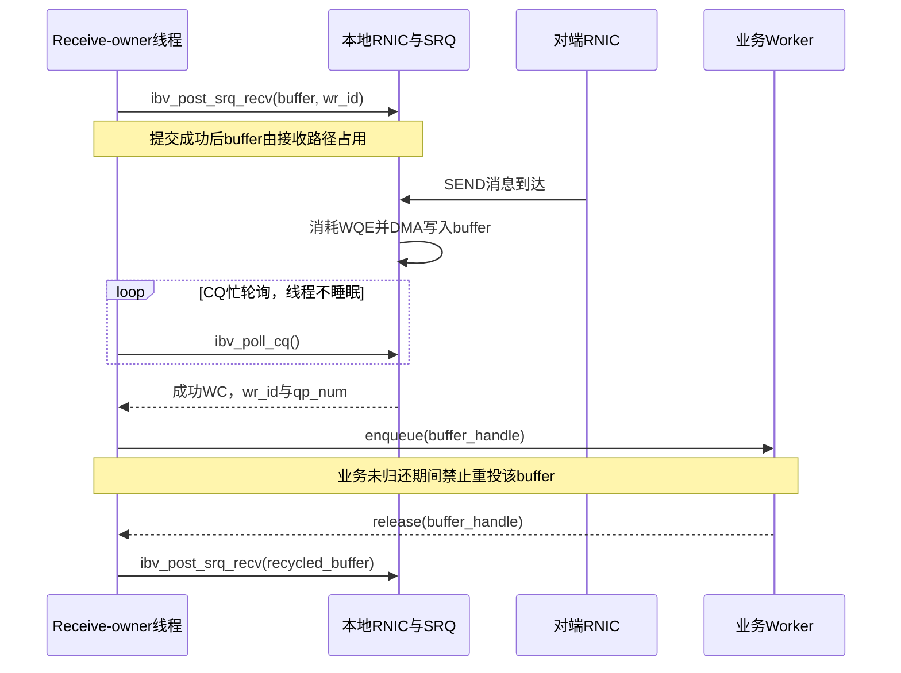

---
tags:
  - 高性能存储
  - RDMA与RoCE
  - 连接扩展
aliases:
  - RDMA 大规模连接
  - QP 资源成本与 SRQ
created: 2026-09-11
---

# RDMA 大规模连接：QP 资源成本、SRQ、连接扩展与 RNIC Cache

> 一台主机“能创建多少 QP”，与“多少条连接同时活跃时仍满足 P99”，是两个问题。还有第三个问题：发生故障后，控制面能否在恢复窗口内重新建立这些连接。大规模连接设计需要同时给这三个问题记账。

[[4.18 多线程下 QP 使用模型]]解决提交者和完成处理者的归属；本篇接着讨论把同一种模型放大到数百个节点、数千条连接之后的资源代价。QP、CQ、MR 的基本角色沿用[[4.2 Verbs 编程模型]]，不再逐个介绍 API。

**适用范围。** 以 Linux、libibverbs、RC 和 RoCEv2 为主；普通 SRQ 与 XRC SRQ 分开讨论。DC 属于设备/provider 扩展，不是任意 RNIC 都有的替代品。文中的数字均为容量计算或实验设计，不是实测硬件参数。

**资料边界。** 教材提供 Cache、局部性与性能分析方法；verbs 手册提供对象语义；论文提供特定硬件上的实验经验。本文推导的连接预算、共享池容量和排查顺序标为工程模型，不能当作厂商保证。[^arch][^perf][^fasst]

## 1. 先分开三种规模上限

![[图片/SVG/8_4_4_28_1.svg|900]]

图中把主机内存、RNIC 缓存和控制面并排展开。QP 对象创建成功，只说明本次资源分配成功；它没有替你测试活动工作集，也没有预留重连时的 CPU 和连接管理能力。

| 上限 | 真正要问的问题 | 观测量 | 不能替代它的指标 |
|---|---|---|---|
| 分配上限 | 此进程、此 function 还能创建多少对象？ | 创建成功数、失败原因、实际 cap、内存/配额 | 设备公布的 `max_qp` |
| 稳态上限 | 指定访问分布下能维持多少活动 QP？ | 吞吐、P99、CPU、PCIe、活跃集合 | 已建立连接总数 |
| 变化速率上限 | 每秒能建立、销毁、恢复多少连接？ | 建连率、建连延迟分布、重试队列 | 稳态 RDMA 带宽 |

例如，很多连接已经进入 RTS，但每秒只访问少数热点连接，可能没有明显的活动上下文压力；反过来，总连接数不多，但所有线程同步切换目标、CQ 回收停顿，也可能先出现长尾。不能从单一 `QP count` 反推整个系统的状态。

`ibv_query_device()` 返回的是设备能力边界，不是当前空闲资源清单。固件限制、PF/VF 配额、其他进程、内核资源和锁页限制都可能让本次分配更早失败。[^query]

## 2. 连接数怎么算：先声明拓扑，再写公式

### 2.1 RC 连接对与本地 QP 对象不是同一个数

假设有 $N$ 个节点，每一对不同节点之间有 $k$ 对 RC QP，双向通信复用这一对 QP，不再按方向重复计数。则：

$$
Q_{\text{local}}=k(N-1)
$$

$$
Q_{\text{cluster}}=Nk(N-1),\qquad
C_{\text{pairs}}=\frac{Nk(N-1)}{2}
$$

这里 $Q_{\text{cluster}}$ 是两端本地对象总数，$C_{\text{pairs}}$ 是关联的 QP 对数。一个 RC QP 对端关系固定；“把连接池里的一个 RC QP 随时拿去向另一个 peer 发包”不是普通 RC 的工作方式。[^createqp]

若采用“每个本地 worker × 每个 peer × 每条 rail 一条连接”的模型，$k=T\times R$。**这不是所有线程拓扑的统一公式**：两端 worker 全互联可能引入 $T^2$ 项；共享 QP、单向专用连接、稀疏通信图又会改变计数。

**教学算例：** $N=256$、$T=8$、$R=2$，上述模型下：

$$
Q_{\text{local}}=8\times2\times255=4080
$$

整个集群有 $1,044,480$ 个本地 QP 对象，对应 $522,240$ 对连接。这只是对象数，不是“需要这么多份独立 CQ”或“每个对象永久占据片上 SRAM”。

### 2.2 一张连接表至少保存四种计数

| 名称 | 本篇定义 | 用途 |
|---|---|---|
| `allocated_qps` | 已创建且未销毁的本地 QP | 分配预算 |
| `ready_qps` | 处于指定可用状态的 QP；测试中通常记录 RTS | 健康和建连进度 |
| `active_qps(window)` | 测量窗口内实际有目标操作的 QP | 活动工作集 |
| `inflight_wr` | 已成功提交、尚未完成回收的 WR | 并发窗口和排队 |

需要再保存 `peer_count`、每 peer 的连接数、线程数和 rail 数。一个 QP 不等于一个应用请求，也不自动等于一条独立 ECMP 路径。多个 QP 可能仍落在同一组网络散列结果上；路径分布要从设备配置与实际链路负载确认。

## 3. QP 的成本不只有一块“上下文”

### 3.1 主机侧与 RNIC 侧分两本账

| 资源 | 主要记账位置 | 随什么增长 | 可共享之处与代价 |
|---|---|---|---|
| SQ/RQ 的 WQE 存储 | 常见实现位于主机内存，由 provider 管理 | QP 数、队列深度、SGE、inline 配置 | RQ 可改 SRQ；SQ 仍有自己的提交与顺序状态 |
| 接收 payload buffer | 注册的主机内存，或受支持的设备内存 | 待接收数量、单槽大小、应用持有量 | 共享池节省预留，但会扩大资源争用范围 |
| CQ 与 CQE 存储 | 常见实现位于主机内存 | CQ 数、容量、回收间隔 | 多 QP 共用 CQ；完成处理和故障范围随之耦合 |
| MR 与地址转换元数据 | 软件管理对象、设备侧转换与保护状态 | 注册布局、页粒度、访问工作集 | 同一 PD 中合理复用 MR；不等于跨设备复用 key |
| QP 传输状态 | 设备实现的上下文及其后备/缓存体系 | 连接数、活动模式、传输类型 | 普通 SRQ 不消除每个 RC QP 的连接状态 |
| 拥塞、重试和调度状态 | RNIC，具体实现相关 | 活跃传输、未完成操作 | 不是用户能用一个通用字段精确查询的固定费用 |
| 建连与业务状态 | 应用、librdmacm、内核控制面 | peer、连接代次、待处理请求 | 池化能摊销建连，但不消灭生命周期管理 |

“QP 占 $X$ 字节”必须回答：测的是哪一列、哪个 provider、什么队列配置、是否包含接收 buffer、是否包含 CQ。`sizeof(ibv_qp)` 只是用户可见结构体大小，不能作为全部成本。QP/SRQ 创建时还可能把请求容量向上取整，预算应记录返回的实际能力。[^createqp][^createsrq]

### 3.2 一个可用的主机内存估算式

下面是**工程估算模型**，不是 libibverbs ABI：

$$
M_{\text{host}}\approx
\sum_q(D_{sq,q}S_{wqe,q}+D_{rq,q}S_{rqe,q})
+\sum_c D_{cq,c}S_{cqe,c}
+M_{\text{payload}}+M_{\text{metadata}}+M_{\text{alignment}}
$$

$S$ 代表 provider 实际布局占用，不能用一个通用常数代入。使用 SRQ 时，把各 QP 私有 RQ 项换成各 SRQ 的共享队列项，**不要既计私有 RQ 又计共享 RQ**。

为了测增量，在隔离环境中固定 payload 池和共享 CQ，再分批创建相同配置的 QP，观察进程、内核和设备资源变化。RSS、锁页量、对象统计覆盖面不同；任何单个数都不能当作 RNIC SRAM 使用量。MR 生命周期与 key 的归属见[[4.12 rkey lkey 生命周期]]。

### 3.3 接收 buffer 往往比描述符更值得先算

**教学算例，只比较预投递 payload 容量：**

- 4096 个 QP，各预投递 128 个 4 KiB 接收槽：$4096\times128\times4096=2$ GiB。
- 改为所有这些 QP 共用一个 8192 槽 SRQ：$8192\times4096=32$ MiB。

两者相差 64 倍，**并不意味着整体内存或吞吐也改善 64 倍**。共享方案减少的是“为每条空闲连接分别预留接收槽”；如果所有连接同时突发，8192 个槽可能迅速耗尽。应用正在处理的已完成 buffer、空闲备用槽和描述符还要另计。

## 4. RNIC Cache：已创建数量与热点工作集的差别

### 4.1 缓存里到底是什么

在讨论 RNIC Cache 时，应明确是 QP context cache、地址转换/保护元数据缓存，还是 WQE/CQE 相关缓存。它不是“网卡替应用缓存远端数据”的同义词。

一些 RNIC 将大量上下文的后备状态放在主机内存，并在片上缓存活跃部分；未命中可能增加设备访问主机内存的开销。FaSST 对这种连接状态与缓存压力的讨论，来自论文当时的设备和负载。它支持“活动上下文会影响扩展性”的问题意识，**不支持把某个旧设备的 QP 拐点复制到新 RNIC**。[^fasst]

教材的 3C 模型可帮助提出假设：首次触碰产生冷启动代价；工作集超出容量产生容量压力；映射与访问交错可能产生冲突。教材同时提醒，命中率不是完整的性能指标。这里借用的是分析方法，**没有断言 RNIC 采用与 CPU Cache 相同的组相联、替换或一致性协议**。[^arch]

### 4.2 哪些变量比连接总数更接近原因

![[图片/SVG/8_4_4_28_2.svg|900]]

图中三种负载分配同样多的 QP，但触碰集合和复用距离不同。格子与时间条表示访问模式，不表示一款网卡的真实缓存槽数。

| 变量 | 为什么要固定或单独扫描 |
|---|---|
| 活跃 QP 数 | 决定短时间内要触碰多少传输上下文 |
| 每 QP 连续操作数 | 影响上下文复用；也会改变突发与公平性 |
| 访问分布 | 均匀、热点、阶段性换热点，不是同一负载 |
| MR/page 工作集 | 同时扩张时，会把上下文压力与转换压力混在一起 |
| 总 outstanding | 增加 QP 时若保持每 QP 深度不变，总并发也变了 |
| CPU/NUMA 与 CQ 回收 | 软件调度、远程内存和缓存跳动同样能制造拐点 |

因此，“QP 增加之后 P99 上升”最多是一个现象。只有控制其他变量，并结合 provider 可用的设备指标、PCIe 流量和软件 profile，才能逐步增强“上下文缓存压力”的解释。没有公开的 hit/miss 计数器时，应写成**推断**，而非“已经测到 cache miss”。

### 4.3 两组容易混淆的扫描

**扫描 A：固定每 QP 深度。** 令 $A$ 为活动 QP 数，$D$ 为每 QP 未完成上限，则总窗口约为 $A D$。这组实验回答“扩大并行度后的系统表现”，不能单独隔离 Cache。

**扫描 B：固定总窗口。** 总窗口为 $I$，在 $A$ 个活跃 QP 间分配，平均每 QP 约 $I/A$。这组更接近隔离上下文数量，但必须保证 $I\geq A$，并说明余数分配和补发策略。需要更多“已创建但不活跃的 QP”时，另设 `allocated_qps`，不要硬把每 QP outstanding 降成零后还称全部活跃。

## 5. SRQ 共享的是接收 WQE，不是全部连接资源

![[图片/SVG/8_4_4_28_3.svg|900]]

左边每条连接的槽位被单独预留；右边连接保留自己的传输状态，但从共享池消耗接收 WQE。图下方还保留“应用持有”的区域，因为完成产生之后，buffer 不一定已经可重用。

### 5.1 接收队列究竟被什么操作消耗

以下针对普通 RC、经典接收语义；多包接收等专用扩展另行核验。[^postrecv][^guide]

| 远端操作 | 消耗接收 WQE？ | payload 放在哪里 |
|---|---|---|
| SEND / SEND_WITH_IMM | 是，按接收消息使用 WQE，不是每个网络分段一个 | 被取走的接收 WQE 的 SGE 指定区域 |
| RDMA WRITE_WITH_IMM | 是，用于接收端通知/完成 | RDMA 远端地址和 rkey 指定区域，不是通知 WQE 的 SGE |
| 普通 RDMA WRITE | 否 | 远端地址和 rkey 指定区域 |
| RDMA READ | 否 | 请求方的本地目标内存；响应方读取其被授权区域 |
| RDMA Atomic | 否 | 在远端授权地址执行；返回值写入请求方指定区域 |

因此，一个只做普通 one-sided READ/WRITE 的数据面，未必能从 SRQ 中获得明显收益；需要先判断它的控制消息是否大量使用 SEND，或者数据完成是否依赖 WRITE_WITH_IMM。

“WRITE_WITH_IMM 需要 WQE”与“WRITE payload 写进那个接收 buffer”是不同命题。混淆二者，会把内存布局和通知槽预算都算错。

### 5.2 SRQ 没有替你共享哪些东西

普通 SRQ 不合并各个 RC QP 的 SQ、PSN/重试状态、对端关系，也不为所有关联 QP 强制指定同一个 CQ。接收完成仍由关联 QP 的接收 CQ 进入应用；`wr_id` 可以标识 buffer，成功完成中的 `qp_num` 可参与来源分发。错误完成中不要假设所有字段都有效。[^createqp][^poll]

本篇的实现基线是：在同一设备和明确的 PD 归属下组织 QP、SRQ 与接收 MR，再按租户、NUMA 或 worker 分组。多块 RNIC 需要各自的资源和注册关系，不能直接复用另一设备发出的 `lkey`。跨进程和 XRC 的共享方式不套用普通 SRQ 模型。

## 6. SRQ 容量、补充与生命周期

### 6.1 容量取决于回收延迟，而不只取决于连接数

把 $L_{refill}$ 定义为一个接收槽被消耗后，经过 CQ 观察、业务处理或替换、重新投递，恢复到可用接收能力所需的时间。工程上可先估：

$$
D_{srq}\gtrsim \lambda_{recv,peak} L_{refill}+B_{burst}+M_{reserve}
$$

单位必须是“接收消息数”和“秒”；不能把包速率直接代入，因为一个 SEND 可分成多个包。这个式子用于预算起点，实际要测 refill 长尾和相关突发，不是无条件保证。

**教学算例：** 聚合 2 Mmsg/s、50 μs 的回收间隔只对应 100 个消息槽，但若还有 1000 个相关突发，100 槽显然不够。若 50 μs 只是平均值，线程停顿时仍会暴露容量缺口。把 SRQ 从 100 增到 1100 也没有解决任意长停顿，需要 admission control 和恢复策略配合。

### 6.2 一块 buffer 的所有权只有一份

推荐把 receive-owner 线程作为 SRQ 投递和 buffer 状态转换的唯一负责人。其他 worker 完成业务处理后，归还 buffer handle；不要在 CQ 刚出队时立即复用仍被业务线程读取的区域。



时序图揭示的关键不是“CQE 来了”，而是 **CQ 完成与应用释放之间仍有一段占用期**。后台投递线程安全，不代表应用的 buffer 生命周期自动安全。[^postrecv]

### 6.3 正常补货与低水位告警分开

正常路径应根据已完成/已归还 buffer 持续补充，不要只等 `IBV_EVENT_SRQ_LIMIT_REACHED`。设置 `srq_limit` 是给低水位异步事件置备；这不是每消费一个 WQE 都通知一次的机制。事件处理后应按 API 规则重新置备，不能把一次 armed 当成永久订阅。[^modifysrq]

实践上的分工是：CQ 驱动日常回收，低水位事件提示容量或调度风险，定期健康检查发现事件处理线程本身卡住。事件对象要及时 `ibv_ack_async_event()`；它确认的是事件已处理，不是归还接收 buffer。[^async]

接收到通知时池可能已经继续减少，因此低水位要为**事件投递、线程唤醒/排队、buffer 准备和重新投递**留下余量。若操作系统调度延迟不可控，不能指望一个很低的门限及时兜底。

### 6.4 批量投递失败不能“全部退回池”

`ibv_post_srq_recv()` 处理 WR 链表，失败时 `bad_wr` 指向第一条未成功投递的 WR；此前已经成功的部分仍受接收路径占用。[^postrecv]

正确的应用记账是：成功前缀转 `POSTED`，失败项及之后的未投递项仍归应用。重试未投递的部分，不能重复投递成功前缀，也不能把成功前缀的 buffer 交给业务重新写入。

接口错误语义也不要混写：`ibv_modify_srq()` 失败返回 errno 值；另一些 librdmacm 接口使用 `-1` 并设置 `errno`。封装前逐个查手册，不能用同一个“所有返回负数才失败”的模板。

### 6.5 错误路径与销毁顺序

先禁止新业务和重连拿到旧连接代次，再处理未完成请求、错误 WC 和异步事件。普通 SRQ 上尚未被取走的 WQE 不是某个 QP 的私有 RQ；**不能假设销毁一个 QP 会把共享池中所有 WQE 都逐条 flush 给它的 CQ**。

资源依赖的收口顺序应满足：关联 QP 先脱离/销毁，SRQ 才能销毁；仍可能被 DMA 使用的 MR 和 buffer 不能先释放；CQ、PD、context 在依赖者清理后释放。`ibv_destroy_srq()` 会因仍有关联 QP 而失败。失败的销毁操作也不能被当作成功释放。[^createsrq]

完整的“未知结果请求如何重放、连接代次如何区分”沿用[[4.19 RDMA 故障恢复与连接重建]]，本篇不把资源清理误写成业务 exactly-once 保证。

## 7. 共享池的代价：容量、隔离与公平性

共享 SRQ 容量不是每个 peer 的保留额度。一个热点或失控 peer 可以消耗大部分接收槽，让其他连接遇到接收资源不足。RC 下的 RNR 是接收资源语义，不应直接当作交换机拥塞，见[[4.17 Retry RNR 与 Timeout]]。

| 组织方式 | 好处 | 需要额外管理的代价 |
|---|---|---|
| 整个服务一个 SRQ | 空闲预留少 | 全局争用、跨 NUMA、较大受影响范围 |
| 每 NUMA / worker 分片 SRQ | 改善本地性，缩小协调范围 | 分片间空闲容量可能不均 |
| 按租户/业务等级分 SRQ | 故障与配额隔离更清晰 | 预留增加，实例数增加 |
| 私有 RQ | 每连接预算清楚 | 大量空闲连接下浪费预投递容量 |

**工程推论：** 需要同时限制业务 in-flight、per-peer credit 和共享池可用量。仅把 SRQ 做大不解决恶意或失控生产者；仅限制每 peer 的平均速率也不能消除同步突发。对于通知和控制消息，还应避免它们与大 payload 的生命周期耦合，以免耗尽池后连归还 credit 的消息也送不进来。

不能凭“驱动函数是线程安全的”推导应用不需要同步。buffer freelist、未完成计数、credit 发放与 worker 归还都仍有自己的并发协议。

## 8. 连接扩展方案：每个方案省掉的是不同资源

| 方案 | 主要减少的成本 | 保留或新增的成本 | 适用判断 |
|---|---|---|---|
| 每 peer 有界 RC 连接池 | 无限制的每请求/每线程连接膨胀 | 排队与连接复用调度；peer 关联仍固定 | 先评估的基线方案 |
| 按需建连 + 有界预热 | 稀疏图的闲置连接 | 首次请求延迟、抖动与集中重连 | 需要明确冷路径 SLO |
| RC + 普通 SRQ | 私有 RQ 与接收槽预留 | RC QP 状态、SQ 仍在 | 大量接收侧连接、稀疏活跃 |
| 多 QP 共用 CQ | CQ 对象数、部分轮询管理 | demux、拥塞/故障耦合 | 完成稀疏或每 owner 集中回收 |
| XRC | 特定拓扑下可共享的接收侧连接资源 | 扩展对象、XRCD 与部署能力约束 | 需端到端支持并测收益 |
| DC / DCI 池 + DCT | 减少逐 peer 常驻连接状态的需求 | 动态目标切换、DCI 调度与竞争 | 明确支持的 provider/硬件 |
| UD + 应用协议 | 避开逐 peer RC 连接状态 | 分片、可靠性、重传、拥塞/流控由上层负责 | 不能只比较 QP 数而忽略协议成本 |

SRQ 与 XRC 不是同义词；DC 也不是“把 RC 的类型字段改一下就完成迁移”。NVIDIA 的 DC 文档描述的是 mlx5 扩展，使用 DCI/DCT 及对应创建流程；旧 `ibv_exp_*` 示例不能不加说明地移植到现代 rdma-core。[^xrc][^dc]

FaSST 的 datagram-based RPC 路线是一项系统设计选择，而不是“所有 one-sided 服务都应该切到 UD”的通用结论。研究复现时要固定操作语义和业务协议，不能省掉上层工作后只拿微基准对比。[^fasst]

## 9. 控制面扩展：启动和恢复也是负载

大规模部署常常在启动、扩容、故障恢复阶段同时执行设备查询、地址解析、资源创建、注册和握手。若每个 worker 同时预建所有 peer，稳态中闲置的连接也会形成启动尖峰。

**工程设计建议：** 为每设备设置有界建连并发；按批预热；失败重试使用退避和抖动；先恢复关键 peer，再恢复冷连接。连接表用 generation 区分旧连接，避免迟到事件作用于新对象。日志记录 `create`、`resolve`、`connect`、`ready` 各阶段的时间，而不是只记一次总超时。

相关的 CM 事件和地址/路由解析语义见[[4.11 RDMA CM 与连接建立]]。不要把应用连接队列耗时归进 RNIC 传输延迟，也不要在降级时同时启动无限重连和无限业务重放。

## 10. 可复现的容量调查与对照实验

### 10.1 先做只读盘点

以下命令在 Linux 上只读取状态；`rdma` 资源视图受内核/provider 和权限影响，不支持时保留错误，不能记成资源数零。`ibv_devinfo` 的能力值不是空闲计数。[^query][^rdmatool]

```bash
# 硬件/软件身份与资源能力
uname -r
rdma -V
ibv_devinfo -v
rdma link show
ulimit -l
```

`ulimit -l` 只是当前 shell 的限制。服务管理器、容器或不同用户启动的进程，需要检查那个实际进程的 limits；不要用当前 shell 结果代表所有进程。

```bash
# 实验前后分别保存；不能据此反推 RNIC 片上缓存字节数
rdma resource show qp
rdma resource show cq
rdma resource show srq
rdma resource show mr
```

创建、建立与活跃要由应用自己的连接表补充。资源列表更适合核对泄漏、对象归属及增量，而不是代替整个性能模型。

### 10.2 三阶段实验，不把变量一起扩大

| 阶段 | 只主动改变 | 固定项 | 主要输出 |
|---|---|---|---|
| 对象容量 | allocated QP，分批小步增量 | SQ/RQ cap、CQ、MR、负载为空 | 成功数、错误码、创建时间、内存增量 |
| 活动集合 | 活跃 QP、热点分布、复用距离 | allocated QP、总 outstanding、MR 工作集 | goodput、P99、CPU 与设备证据 |
| 恢复能力 | 待重建连接数、并发上限 | 节点和软件配置 | 建连率、恢复时间、业务失败率 |

再做 SRQ 与私有 RQ 对照，分别报告预投递容量、应用持有 buffer、最低可用槽、RNR 和 refill 延迟。两者同样的“每连接深度”并不是同样的内存预算，要明确比较是等内存、等最大突发，还是等平均负载。

活动集合实验的分阶段矩阵见[[4.30 RoCE Benchmark Matrix：Message Size、QP 数、Flow 数、Incast、NUMA、Multi-Rail、PFC、ECN 与 P99]]；不能证明的 RNIC 内部行为应由[[4.29 RDMA Fabric Telemetry：NIC Counter、Switch Counter、Queue Occupancy、PFC Pause、ECN Mark、CNP 与 Drop Counter]]中的证据边界约束。

## 11. 常见误判与复习

| 说法 | 更准确的表达 |
|---|---|
| `max_qp` 很大，因此百万活动连接没有问题 | 它是能力上限，不是稳定吞吐/P99 承诺 |
| QP 多到某个固定数量一定 cache thrash | 拐点取决于硬件、工作集与访问模式，需要受控测量 |
| SRQ 降低了 RC 连接数 | 普通 SRQ 共享接收 WQE，不消除 RC 连接状态 |
| 收到 CQE 就可以把 buffer 再投递 | 还要确认业务读取者已释放 |
| 批量 post 失败，把所有 WR 退回池 | 成功前缀已经投递；处理 `bad_wr` 边界 |
| 增加 QP 的结果更快，所以多 QP 必然更好 | 总 outstanding、并行 CPU 和路径分布可能同时改变 |

**自测。** 4096 条已建立连接中仅 32 条活跃，为什么仍可能因为扩展失败？答：分配额度、队列/缓冲预留或控制面创建成本仍随已创建数量增长。

**自测。** 增加 SRQ 深度后 RNR 减少，但 P99 变差，是否矛盾？答：不矛盾。此前被拒绝/重试的流量可能进入更长的业务排队；应同时比较成功率、offered load、buffer 占用和端到端延迟，而不是只看 RNR。

**自测。** 怎样增强“RNIC context cache 是瓶颈”的论据？答：在相同 allocated QP、总 outstanding 和 MR 工作集下改变活动集合与复用距离，确认软件回收与网络排队没有先成为瓶颈，再结合设备特定观测；缺少直接指标时保留推断措辞。

## 参考资料

[^arch]: John L. Hennessy、David A. Patterson，*Computer Architecture: A Quantitative Approach*，第 6 版，§2.1 “Basics of Memory Hierarchies”，印刷页 81–82。本项目教材正文用于局部性、3C 与测量边界，不用于断言 RNIC 的实现参数。
[^perf]: Brendan Gregg，*Systems Performance: Enterprise and the Cloud*，第 2 版，§2.5.18 “Cache Tuning”、§12.3.2 “Active Benchmarking”、§12.3.7 “Ramping Load”。本项目 PDF 为重排版，以章节定位。
[^query]: rdma-core，[`ibv_query_device(3)`](https://man7.org/linux/man-pages/man3/ibv_query_device.3.html)，设备能力与资源边界。核验日期：2026-09-11。
[^createqp]: rdma-core，[`ibv_create_qp(3)`](https://man7.org/linux/man-pages/man3/ibv_create_qp.3.html)，QP 创建、实际 cap 与关联 SRQ 时的接收参数。核验日期：2026-09-11。
[^createsrq]: rdma-core，[`ibv_create_srq(3)` / `ibv_destroy_srq(3)`](https://man7.org/linux/man-pages/man3/ibv_create_srq.3.html)，创建能力与销毁依赖。核验日期：2026-09-11。
[^postrecv]: rdma-core，[`ibv_post_srq_recv(3)`](https://man7.org/linux/man-pages/man3/ibv_post_srq_recv.3.html)，链表失败边界和接收缓冲生命周期。核验日期：2026-09-11。
[^modifysrq]: rdma-core，[`ibv_modify_srq(3)`](https://man7.org/linux/man-pages/man3/ibv_modify_srq.3.html)，低水位置备、返回值与可选 resize 能力。核验日期：2026-09-11。
[^poll]: rdma-core，[`ibv_poll_cq(3)`](https://man7.org/linux/man-pages/man3/ibv_poll_cq.3.html)，WC 字段和错误完成的有效字段。核验日期：2026-09-11。
[^async]: rdma-core，[`ibv_get_async_event(3)`](https://man7.org/linux/man-pages/man3/ibv_get_async_event.3.html)，异步事件与确认。核验日期：2026-09-11。
[^guide]: NVIDIA，[*RDMA-aware Networks Programming Guide*，DOCA 3.5.0 归档](https://networking-docs.nvidia.com/doca/archive/3-5-0/rdma-aware-networks-programming-guide)，Queue Pair、Send/Receive 与 RDMA 操作。本篇采用经典 verbs 语义，不把 DOCA 版本当作本机 rdma-core 版本。核验日期：2026-09-11。
[^xrc]: rdma-core，[`ibv_create_srq_ex(3)`](https://man7.org/linux/man-pages/man3/ibv_create_srq_ex.3.html)，扩展 SRQ 与 XRC 相关字段。核验日期：2026-09-11。
[^dc]: NVIDIA，[*Dynamically Connected QPs*，DOCA 3.5.0 归档](https://networking-docs.nvidia.com/doca/archive/3-5-0/dynamically-connected-qps)，DCI/DCT 与 mlx5 扩展。核验日期：2026-09-11。
[^fasst]: Anuj Kalia、Michael Kaminsky、David G. Andersen，[*FaSST: Fast, Scalable and Simple Distributed Transactions with Two-Sided (RDMA) Datagram RPCs*](https://www.usenix.org/system/files/conference/osdi16/osdi16-kalia.pdf)，OSDI 2016，§3.2–3.3。论文硬件、负载与结论保留在其历史范围内。
[^rdmatool]: iproute2，[`rdma-resource(8)`](https://man7.org/linux/man-pages/man8/rdma-resource.8.html)，RDMA 资源视图；具体对象显示能力受内核与驱动影响。核验日期：2026-09-11。
