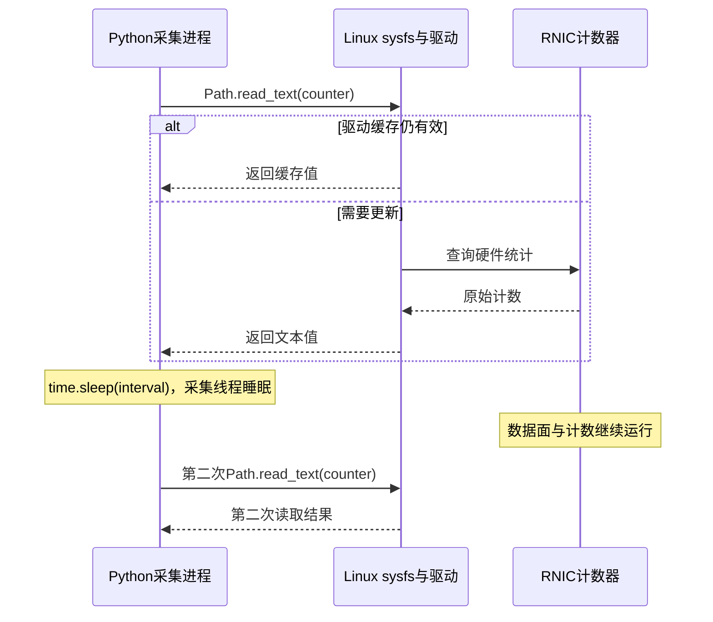

---
tags:
  - 高性能存储
  - RDMA与RoCE
  - 可观测性
aliases:
  - RDMA Fabric Telemetry
  - RoCE 指标口径与采集
created: 2026-09-11
---

# RDMA Fabric Telemetry：NIC Counter、Switch Counter、Queue Occupancy、PFC Pause、ECN Mark、CNP 与 Drop Counter

> Telemetry 的第一步不是把计数器画成曲线，而是确定每个读数的观察位置、统计对象、方向、单位、时间窗口和重置边界。没有这些信息，曲线越多，越容易把“接收了 PAUSE”“发送了 CNP”和“真的发生丢包”混为同一件事。

本篇在[[4.7 PFC ECN 与 DCQCN]]的信号机制之上建立**可采集、可解释、可关联的指标模型**。它不是交换机配置手册，也不把一个厂商的字段名当成整个 RoCE 生态的统一接口。

**适用范围。** 通用部分讨论 Linux 主机与 RoCEv2 Fabric 的观测方法；字段例子明确采用 Linux 6.12 的 mlx5 文档、NVIDIA DOCA 2.10 Telemetry 文档和 Cumulus Linux 5.9。不同固件、ASIC、PF/VF 和软件版本未必暴露相同字段。本文不建议在生产故障中直接清空计数器或修改 PFC/ECN 配置。

**教材与实现分工。** 《Systems Performance》第 2 版提供累积计数、速率、观测开销和交叉验证方法；《Computer Networks》第 6 版提供遥测粒度与采集成本的讨论。具体 mlx5 字段和 ASIC histogram 行为以固定版本官方文档为准。[^perf][^networks]

## 1. 沿着一条真实的数据方向布置观察点

![[图片/SVG/8_4_4_29_1.svg|900]]

图中假定数据从 A 向 B 流动。数据、PFC 和 CNP 是三条不同的观察路径：数据沿转发路径走；PFC 作用于一条相邻链路；CNP 由通知端反馈给相应发送端。返回路径可能不与正向路径完全相同。

每次关联数据，应先建立以下映射：

```text
host / PCI BDF / PF或VF / RDMA device / port / netdev / GID
    ↕ 物理连接与配置快照
switch / physical port / LAG成员 / ingress PG / egress TC
    ↕ 时间窗口与运行标识
application / run_id / peer / connection generation / operation kind
```

这是**关联键设计示意**，不是一个可执行命令，也不意味着所有字段都适合长期成为监控标签。QPN、rkey 等敏感或高变动标识一般只放受控诊断记录，不全量导出到长期时序数据库。

需要先判断谁是真正的数据发送方。RDMA READ 的请求从发起端发出，但大块 READ response 由响应端发回；不能把 API 调用方固定称为拥塞反馈中的数据发送端。

## 2. 为每个指标建立一份“口径合同”

《Systems Performance》把原始计数器、统计量、监控指标区分开来。下面把这个方法具体化为 RDMA 的采集合同。[^perf]

| 字段 | 必须回答的问题 | 示例或反例 |
|---|---|---|
| `scope` | 是整个物理口、function、vport、QP，还是队列？ | PF 的物理口统计不能直接代表某个 VF |
| `direction` | 相对哪个设备的 RX/TX？ | RX PAUSE 是本端收到了停止发送的请求 |
| `unit` | bytes、4-byte units、packets、μs、cells、ticks？ | `port_xmit_data` 不直接按 bytes 使用 |
| `kind` | counter、gauge、watermark、histogram、event？ | 当前队列占用不做 counter rate |
| `population` | 哪些包/操作会进入分子和分母？ | RoCE CE 包 / 所有以太网包不是纯 RoCE 标记率 |
| `reset_epoch` | 何时归零、重建或切换统计对象？ | 重载驱动后不跨断点算差 |
| `freshness` | 硬件更新、驱动缓存、采集和导出的间隔？ | 更快读 sysfs 不一定拿到更新的硬件值 |
| `coverage` | 缺失、权限不足、超时，还是合法的零？ | `unsupported` 不能填 0 |

建议把原始值和合同同时保留，归一化只在理解单位之后发生。设备升级时重新核对字段，而不是继续沿用旧 exporter 的映射表。

### 2.1 五种数据类型不能共用一套运算

| 类型 | 例子 | 正确处理 | 常见误用 |
|---|---|---|---|
| 累积 counter | 字节数、包数、CNP 数 | 同一 epoch 内差分，再除真实时间 | 直接比较开机以来绝对值 |
| gauge | 当前 queue occupancy、最近一秒百分比 | 对齐采样时刻；明确内部统计窗口 | 再取 rate 得到无意义结果 |
| watermark | 上次清除以来最大占用 | 同时保存 reset 时间与最大值 | `新最大值−旧最大值` 当作队列增长 |
| histogram | 一段时间内队列深度的桶计数 | 保留桶边界、采样权重与窗口 | 把采样次数当成业务包数 |
| event | link down、watchdog、CQ error | 保存开始/结束、原因与时间误差 | 只保留事件总数丢掉时序 |

如果 histogram 桶是**累积计数**，需在同一 epoch 内先差分；若设备每个导出窗口给独立桶，则直接使用该窗口，不再差一次。名字里有 `counter` 不能代替类型合同。

## 3. NIC Counter：netdev、vport 与物理口不是同一个层级

Linux 6.12 mlx5 文档区分软件 ring/netdev、vport、physical port 和 priority port。vport 与物理口统计能够覆盖软件 ring 不一定经过的 RDMA 流量；physical port 又可能聚合多个 function。[^mlx5]

| 观察层 | 通常适合回答 | 不能据此断言 |
|---|---|---|
| 软件 ring / netdev | Linux 网络栈路径处理了多少流量 | 软件 RX 没增长，所以 RNIC 没收到 RDMA |
| RDMA function / vport | 特定功能或 RDMA 对象集合的传输活动 | 它就是整条物理链路全部流量 |
| Physical port | 线侧吞吐、链路错误、PFC 等 | 每个 VF 的贡献都能单独解释 |
| Per-priority | 某个链路优先级的数据与暂停 | 该优先级一定就是某一个 egress queue |
| Device / PCIe | 主机接口压力和设备内部问题 | 一定是交换机网络在丢包 |

应先看数据经过哪个计数点，再选择计数器。不能把同一批流量在 `netdev + vport + physical` 三层的字节数相加当总量，也不能把“总计”与“加速路径子集”再相加。

### 3.1 Linux 的三个只读入口

以下设备名仅示例；先用 `rdma link show` 和 sysfs 映射确认实际对象。命令失败、权限不足或字段缺失，都需要随采集结果保存。[^sysfs][^mlx5]

```bash
# 先确认 RDMA 设备与网络接口，不要靠 mlx5_0 的编号猜物理位置
rdma link show
ibv_devinfo -v
ip -s -s link show dev enp65s0f0
ethtool -i enp65s0f0
ethtool -S enp65s0f0
```

`ethtool -i` 用于保存驱动、固件和总线身份；`-S` 才是厂商统计。`ip -s link` 与 `ethtool -S` 的统计范围并不完全相同。全量输出适合短期取证，长期监控应使用已核对口径的字段白名单。

```bash
# 查看存在的标准计数器、硬件计数器及读取缓存参数
ls /sys/class/infiniband/mlx5_0/ports/1/counters
ls /sys/class/infiniband/mlx5_0/ports/1/hw_counters
cat /sys/class/infiniband/mlx5_0/ports/1/hw_counters/lifespan
```

`lifespan` 是读取更新的缓存时间参数，**不是一个故障次数计数器**。Linux ABI 指定单位为毫秒，默认 10 ms，驱动可以设置不同值；相近两次读取可能获得同一缓存值。本篇只读它，不为了“提高精度”直接写成 0。[^sysfs]

## 4. PFC Pause：先看方向，再看持续时间

以端口 A 与相邻端口 S 之间的数据 A→S 为例：

| 读数 | 对端对应的观察 | 对本端数据方向的影响 |
|---|---|---|
| A 的 `rx_pause[p]` 增加 | S 的 `tx_pause[p]` 可能对应增加 | A 在优先级 p 上被要求暂停发送 |
| A 的 `tx_pause[p]` 增加 | S 的 `rx_pause[p]` 可能对应增加 | A 请求 S 暂停向 A 发送优先级 p 的数据 |

这里的“可能对应”要求双方取自同一条实际链路、同一优先级、兼容窗口和定义，不是强制逐帧相等。交换机到交换机同理，不要看到字符串 `rx` 就解释成“本地接收方向被暂停”。

### 4.1 帧数、转换次数与时长分别说明什么

mlx5 示例中，`rx_prio[p]_pause_duration` 单位为 μs，描述该优先级因收到 pause 而未发送的时长；`rx_prio[p]_pause` 记录收到的 pause 帧数，转换次数又是另一个量。[^mlx5]

工程上可在已确认含义的单一端口、单一优先级上计算：

$$
U_{pause,p}=\frac{\Delta T_{rx\_pause,p}(\mu s)}{\Delta t(s)\times10^6}
$$

**教学算例：** 2 秒窗口内增加 120,000 μs，对应 6% 的暂停时长占比。同期收到 540 个 pause 帧，并不意味着 540 次独立拥塞，也不能用 `540 × 某个平均 quanta` 代替实际时长。

重复 PAUSE 可能刷新已有暂停；不同优先级的暂停区间可能重叠。不能把所有优先级占比相加解释为整条链路的时间利用率。也不能未经定义核验，就把 TX pause duration 当作对端实际停止发送的精确时间。

### 4.2 正常背压、传播与异常持续阻塞

短暂的 PFC 活动可能只是突发期间的背压；持续 pause、吞吐坍塌、watchdog 或无进展事件，才提示更强的异常。诊断应保留：相邻端口的方向、哪个 priority/PG/TC、队列是否可排空、业务是否前进。

只有 pause 帧数上升，不能分清根因是局部突发、下游慢消费者、拓扑中的阻塞传播，还是设备异常。PFC 指标提供观察边，不直接提供根因。

## 5. ECN、CNP 与速率响应：四个观察点组成证据链

教材中的 ECN 是“拥塞节点在数据包上标记、接收方把拥塞信息反馈给发送方”的一般机制；RoCE 的 NP/RP/CNP 计数器是具体实现，不能拿 TCP 的 ECE/CWR 计数替代。[^networks][^telemetry]

| 位置 | 要保存的原始量 | 能支持什么判断 |
|---|---|---|
| Switch CP | 对应队列/统计范围的 ECN marking 事件 | 此处的标记机制发生了活动 |
| 接收 RNIC NP | `np_ecn_marked_roce_packets` | 通知点收到 CE 标记的 RoCEv2 包 |
| 接收 RNIC NP | `np_cnp_sent` | 通知点发出了对应拥塞反馈 |
| 发送 RNIC RP | `rp_cnp_handled`、`rp_cnp_ignored` | 反馈是否被处理；异常忽略需查配置与实现 |

这些计数器不能要求 **1∶1∶1∶1**：一个包可能经过多个拥塞节点，但到端点只有 CE 状态；通知可能有聚合或限频；统计窗口和范围不同也会改变计数。若设备还提供 slow-restart 等会生成 CNP 的机制，要保留相应原因字段，不能把所有 CNP 都归因到一次 ECN marking。[^telemetry]

### 5.1 “标记率”必须有兼容分母

只有拿到相同范围、方向和窗口的 RoCEv2 接收包数 $P_{rocev2}$，才适合计算：

$$
f_{CE}=\frac{\Delta P_{CE,rocev2}}{\Delta P_{rocev2}}
$$

若只拿得到所有以太网包数，可以报告“CE RoCE 包占该物理口全部接收包的比例”，但不能把它重命名成 RoCE marking ratio。没有可靠分母时，先报告 CE 包/s，并明确 N/A 的比率字段。

Switch 的“标记包数”究竟是新置 CE、所有符合 marking 条件的包，还是另一种内部事件，要查该 ASIC 定义。`rx_prio[p]_marked` 在 mlx5 文档中是设备因主机侧拥塞进行的 ECN 标记，也不能替换“NP 收到已有 CE 的包数”。[^mlx5]

### 5.2 收到 CNP，不等于控制效果良好

要检查控制效果，还需同一实验窗口中的 offered load、实际吞吐、队列深度、暂停时长、丢包/重传及 P99。`handled` 增加支持“反馈已处理”，但没有直接给出每条流实际减少了多少速率。

**工程判据：** 在相同输入负载下，队列/暂停和尾延迟改善，同时没有把错误率或公平性显著恶化，才支持这次配置更适合该负载。CNP 数量多或少本身都不是优化目标。

## 6. Drop Counter：把损失发生的位置与原因分开

| 层或原因 | 应配对的证据 | 不宜做的归因 |
|---|---|---|
| 线缆/光模块/PHY | CRC、FEC uncorrectable、link flap、端口事件 | 所有 CRC 都是拥塞 |
| 交换机队列/缓冲 | ingress/egress discard、queue/PG、占用与配置 | 一个整端口 drop 就定位到某个 RoCE queue |
| ACL、policer、路由/MTU | 明确的丢弃原因计数与配置命中 | 当成无损队列 headroom 不足 |
| RNIC 主机侧接收压力 | per-host buffer、PCIe、优先级计数 | NIC 丢弃一定发生在交换机 |
| 接收 WQE 资源不足 | 对应 RDMA `out_of_buffer`、RNR、refill 进度 | 看到 buffer 就去增大交换机 buffer |
| 传输层错误/重试 | retry、NAK、timeout、错误 WC | 一次 retry 恰好等于丢了一个物理包 |
| 内存访问保护/协议错误 | access error、invalid request、连接代次 | 所有 QP error 都是 Fabric 丢包 |

DOCA 2.10 文档中 RDMA `out_of_buffer` 的定义指向关联 QP 缺少 WQE；而 mlx5 的 per-priority buffer discard 具有另一种观察范围。**相似字段名不代表同一资源池。** 接收侧共享池的容量与回收机制见[[4.28 RDMA 大规模连接：QP 资源成本、SRQ、连接扩展与 RNIC Cache]]。[^telemetry][^mlx5]

FEC corrected 活动不等价于上层已经丢包；FEC uncorrectable 与 CRC 也可能覆盖同一受损帧的不同处理阶段。计数器存在总计、子集和重叠时，不应直接相加求“总丢包数”。

RC 重试消耗了带宽或时间，但最终完成仍可能成功。最终 retry exhausted、可恢复 timeout 和 RNR 需要分开保留，协议语义见[[4.17 Retry RNR 与 Timeout]]。

## 7. Queue Occupancy：微突发为什么会从看板消失

![[图片/SVG/8_4_4_29_2.svg|900]]

图中的 20 μs 突发、1 秒采集间隔都是教学示意。一个短突发完全可以发生在两个轮询点之间；瞬时 gauge 恰好采到低值，不代表此前没有排队。

### 7.1 瞬时值、最大值与分布的互补

瞬时值告诉你读取时是否仍拥塞；watermark 提示窗口内曾经达到的最大值；硬件 histogram 能保存不同深度区间出现的频度。三者各缺一部分信息：最大值不告诉持续多久，histogram 通常不保留每次突发的顺序，单个 gauge 不能重建历史。

**不要把硬件采样周期与主机导出周期混为一谈。** Cumulus Linux 5.9 的官方例子给出 1024 ns 的 histogram 采样配置，同时每秒收集一次结果。这个例子说明两层时间尺度可以不同；不是所有交换机都支持该精度，也不是开启 1 秒轮询就自动获得它。[^asic]

### 7.2 Ingress PG 与 Egress TC 的表不能直接拼数值大小

PFC 相关的入口 priority group、共享 buffer pool，与 ECN 相关的出口 traffic class，可能是不同的记账域。即使都显示 bytes，也不能直接拿入口占用和出口阈值做一个统一比较。

要把 `port + ingress/egress + queue/PG/TC + pool + cell size + sample period` 一起存下来。cell 计数转 bytes 的换算应来自这代 ASIC，不从另一型号复制；配置阈值还可能被硬件量化。

### 7.3 一个版本固定的只读例子

以下为 **Cumulus Linux 5.9 NVUE** 文档的读取形式。先看哪些接口已经启用 histogram，再选择真实 PG/TC；本篇不执行启用、更改阈值或 `nv config apply`。[^asic]

```bash
# 在交换机执行，显示已经配置的采集范围
nv show service telemetry histogram interface

# 示例 swp1 / TC0 / PG0 必须换成映射核对后的对象
nv show interface swp1 telemetry histogram egress-buffer traffic-class 0
nv show interface swp1 telemetry histogram ingress-buffer priority-group 0 snapshot
```

如果输出为空，先确认未配置、能力不支持、权限不足还是没有样本，不能显示“队列为 0”。其他版本可能改变 NVUE 命令树，不能把 5.9 的 `service telemetry` 写法当成最新版本的通用接口。

## 8. Counter 差分、单位与重置的计算纪律

### 8.1 差分只在同一统计对象和 epoch 内成立

对于累积值 $C_0,C_1$ 和单调时钟时刻 $t_0,t_1$：

$$
r=\frac{C_1-C_0}{t_1-t_0}
$$

前提是同一对象、同一单位、无重置且窗口有效。`C1 < C0` 可能是 reset、wrap 或读数不一致，不应直接 clamp 为零。只有明确位宽和无 reset 证据，才允许按模数处理 wrap。

**更隐蔽的情况：** 设备归零后快速增长到大于旧值，`C1 >= C0` 也不能证明没有 reset。因此还要关联设备健康、驱动重载、function 重建、固件恢复等事件。`boot_id` 只覆盖主机重启，覆盖不了全部设备重置。

### 8.2 原始单位转换只做一次

Linux InfiniBand sysfs ABI 的 `port_xmit_data`/`port_rcv_data` 使用 4-byte units；在确认设备按这一 ABI 提供该字段后，差分乘 4 才转成 bytes。不要把这个规则应用于本来已经是 bytes 的 ethtool 字段。`port_xmit_wait` 是等待 tick 语义，不能直接当成 RoCE pause 微秒数。[^sysfs]

**教学算例：** 原始 `port_xmit_data` 两次差值为 125,000,000，时间差为 2 秒：

$$
B=125,000,000\times4=500,000,000\ \text{bytes}
$$

$$
rate=\frac{500,000,000\times8}{2\times10^9}=2\ \text{Gbit/s}
$$

这是该计数点的速率，不自动等于应用有效 payload 吞吐；协议头、重传和具体包含范围应以字段定义为准。

## 9. 最小采集器：保留原始值与读取区间

下面的 **Python 3.10+、Linux-only** 示例只读取一个 RDMA port 的白名单文件，输出两次 JSON 快照。它不计算“通用丢包率”，不修改设备，也不把读失败当成零。三个代码块按顺序保存为同一个 `rdma_snapshot.py`。

先定义单文件读取。64 位原始值保留成十进制字符串，避免下游 JSON 消费方把整数转为浮点后丢失精度。每个读取都有自己的时间边界，而不是声称整个目录是一张原子快照。

```python
from pathlib import Path
import argparse
import json
import math
import time


def read_one(path: Path) -> dict:
    begin = time.monotonic_ns()
    result = {"read_begin_ns": begin, "status": "ok"}
    try:
        raw = path.read_text(encoding="ascii").strip()
        value = int(raw, 10)
        if value < 0:
            raise ValueError("expected a nonnegative raw value")
        result["raw_decimal"] = str(value)
    except FileNotFoundError:
        result["status"] = "missing"
    except (OSError, UnicodeError, ValueError) as exc:
        result.update(status="error", detail=str(exc))
    result["read_end_ns"] = time.monotonic_ns()
    return result
```

第二段声明字段白名单。缺失项仍进入输出，用于区分“不支持”与“合法的零”；`lifespan` 单列为配置，不混入业务 counter。

```python
COUNTERS = (
    "counters/port_xmit_data", "counters/port_rcv_data",
    "hw_counters/np_ecn_marked_roce_packets",
    "hw_counters/np_cnp_sent", "hw_counters/rp_cnp_handled",
    "hw_counters/rp_cnp_ignored", "hw_counters/out_of_buffer",
    "hw_counters/local_ack_timeout_err",
)


def snapshot(port: Path) -> dict:
    result = {"port_path": str(port), "wall_begin_ns": time.time_ns()}
    result["mono_begin_ns"] = time.monotonic_ns()
    try:
        result["boot_id"] = Path("/proc/sys/kernel/random/boot_id").read_text().strip()
    except OSError:
        result["boot_id"] = None
    result["device_reset_epoch"] = None  # 必须另接设备 reset 事件，不能用 boot_id 冒充。
    result["lifespan_ms"] = read_one(port / "hw_counters/lifespan")
    result["counters"] = {name: read_one(port / name) for name in COUNTERS}
    result["mono_end_ns"] = time.monotonic_ns()
    result["wall_end_ns"] = time.time_ns()
    return result
```

最后验证采集目录与时间间隔。只有两次采集，不会无界地产生日志；`sleep()` 是采集线程主动等待，不是设备停止工作。真实时间差由输出中的单调时钟计算，不能直接拿请求的 `--interval` 代替。

```python
def main() -> None:
    parser = argparse.ArgumentParser()
    parser.add_argument("port", type=Path)
    parser.add_argument("--interval", type=float, default=1.0)
    args = parser.parse_args()
    if not args.port.is_dir():
        parser.error("port directory does not exist")
    if not math.isfinite(args.interval) or args.interval <= 0:
        parser.error("interval must be finite and positive")
    print(json.dumps(snapshot(args.port), ensure_ascii=False), flush=True)
    time.sleep(args.interval)
    print(json.dumps(snapshot(args.port), ensure_ascii=False), flush=True)


if __name__ == "__main__":
    main()
```



该时序说明：**读文件完成时刻、硬件统计更新时间和业务事件发生时刻是三件事**。增加文件读取频率，无法绕过驱动缓存获得任意高分辨率数据。

```bash
# 输出是本地文件；不会写入 sysfs 或更改网卡状态
python3 rdma_snapshot.py /sys/class/infiniband/mlx5_0/ports/1 \
    --interval 1 > rdma-snapshots.jsonl
```

这个采集器只解决“可审计的原始快照”。它不自动检测所有设备 reset、不保证同一批计数原子读取，也不能把 `missing` 进一步区分为未实现还是采集途中对象被删除。生产 exporter 还需要设备身份、metric 合同、支持能力发现、采集超时与健康事件。

## 10. 跨层关联：时间对齐之后，还要核对因果方向

对于主机内的速率，使用单调时钟差；跨主机/交换机关联，需要记录可比较的墙钟、同步状态及误差。将 collector 的到达时间当成硬件发生时间，会把导出排队误差引入“因果顺序”。

**工程规则：** 如果两个来源各有未知延迟或时间误差，那么小于该误差量级的领先/滞后不应被解释成因果关系。先用较粗窗口匹配同一次拥塞阶段，再用事件或高分辨率源细化。

![[图片/SVG/8_4_4_29_3.svg|900]]

图中是证据组合表，不是自动根因分类器。同一症状可以有多个解释；每一行都保留进一步区分的观测。

| 同窗口现象 | 初步解释 | 下一步区分 |
|---|---|---|
| CP/NP/CNP 都活跃，队列可排空，应用仍前进 | 拥塞反馈工作中 | 比较 offered load、P99、暂停与公平性 |
| 队列和 RX pause 都持续高，goodput 下跌 | 下游背压或控制不充分 | 沿相邻端口追方向；检查慢接收端 |
| 标记增加，NP 或 CNP 观察缺失 | 路径、统计范围、配置或采集缺口 | 先排除 telemetry 不完整再判反馈中断 |
| 交换机无异常，RNR/refill 延迟增加 | 接收资源或应用处理落后 | SRQ/RQ、CQ 回收、CPU/NUMA |
| 线侧错误与重试同升 | 物理问题值得优先核验 | 对照邻端事件与模块状态 |
| 只有应用 P99 升高 | 不足以定位 Fabric | 应用排队、CPU、MR、PCIe、连接代次 |

## 11. 看板、告警与采集成本

### 11.1 四层看板足够开始，不要先堆几百个字段

第一层看链路/设备健康和 reset；第二层看流量、队列与暂停；第三层看 CE/CNP、丢弃与传输重试；最后与应用吞吐、错误率、P99 和连接数对齐。需要深入时再从问题下钻到队列、function 或短期 QP 记录。

告警应表达**对业务有影响的持续条件**。例如“连续多个有效窗口中暂停占比高、goodput 下降并伴随业务延迟违反阈值”，比“出现一个 PFC 帧”更接近可行动问题。具体阈值要由负载和服务目标制定，本篇不提供跨硬件通用阈值。

### 11.2 元数据与基数预算

端口、rail、有限优先级、队列、function 等适合稳定索引；每请求 ID、每次重连的 QPN、完整 GID 列表和所有 peer 的笛卡尔积会显著扩大存储和导出成本。短期诊断可记录高基数明细，长期指标通常需要分层聚合。

标签聚合前不能丢掉影响单位和范围的字段。特别是把多个队列合成端口指标时，必须说明求和是合法总量、加权分布，还是仅显示最大值。

### 11.3 观测系统也需要被观测

保存采集耗时、遗漏样本、读取错误、exporter 队列和导出延迟。高频 ASIC 查询会消耗控制面资源，逐包采集与日志也有带宽/存储成本。教材建议用独立观察和已知负载交叉核对工具，而不是默认每个计数器与解析器都正确。[^perf][^networks][^asic]

上线前用小规模已知负载验证“字段是否真的增长、单位是否合理、重置是否分段、丢失样本是否显式可见”，再逐渐扩大覆盖范围。

## 12. 用 Benchmark 校准，而不是让 Benchmark 代替 Telemetry

用[[4.30 RoCE Benchmark Matrix：Message Size、QP 数、Flow 数、Incast、NUMA、Multi-Rail、PFC、ECN 与 P99]]中的隔离实验给遥测做校准：单流验证方向和单位；多个发送端验证汇聚口；已知活动 QP 数验证统计范围；受控重启验证 epoch。

| 校准问题 | 合格结果 |
|---|---|
| 计数增加的方向与数据发送方一致吗？ | 端点、邻口映射可解释 |
| 单位换算后速率落在合理范围吗？ | 明确 payload、线侧或 function 口径 |
| 缺失字段会变成健康零值吗？ | 不会，显示 N/A 或 coverage error |
| reset 后会出现负速率/大尖峰吗？ | 明确断段，不伪造连续历史 |
| histogram 分母是什么？ | 记录采样数或事件数，不能含糊 |
| 有足够证据证明根因吗？ | 事实与推断分开，并保留反证检查 |

**复习问题：** 为何有 CNP 但看板 queue occupancy 始终很低？可能是低频 gauge 没采到微突发，也可能是信号来自别的统计范围或路径。仅凭两个曲线不一致，不能立即判断一方“错误”。

**复习问题：** `out_of_buffer` 与 switch drop 同时增加，是否可以相加？不能。先核对各自的层、统计对象和是否重叠；即使都是真实事件，也未必对应两份不同的业务损失。

## 参考资料

[^perf]: Brendan Gregg，*Systems Performance: Enterprise and the Cloud*，第 2 版，§1.7.1 “Counters, Statistics, and Metrics”、§2.8.3、§4.6 “Observing Observability”、§12.3.2。实际检索本项目教材；PDF 为重排版，按章节定位。
[^networks]: Andrew S. Tanenbaum、Nick Feamster、David Wetherall，*Computer Networks*，第 6 版 Global Edition，2021，§5.6.4 “Programmable Network Telemetry”，印刷页 440–441；§5.3.2 中 ECN 的一般机制，印刷页 405。教材未提供本文的 mlx5 字段合同。
[^mlx5]: Linux Kernel Documentation，[*Ethtool counters — mlx5*，Linux 6.12](https://docs.kernel.org/6.12/networking/device_drivers/ethernet/mellanox/mlx5/counters.html)，Groups、Priority Port Counters、Device Counters。字段含义仅在对应版本/设备支持范围使用。核验日期：2026-09-11。
[^sysfs]: Linux 内核，[`Documentation/ABI/stable/sysfs-class-infiniband`，v6.12](https://github.com/torvalds/linux/blob/v6.12/Documentation/ABI/stable/sysfs-class-infiniband)，标准计数单位、`hw_counters/lifespan` 与 GID 属性。核验日期：2026-09-11。
[^telemetry]: NVIDIA，[*DOCA Telemetry Service Guide*，DOCA 2.10 归档](https://docs.nvidia.com/doca/archive/2-10-0/doca+telemetry+service+guide/index.html)，InfiniBand Counters / Hardware Counters。NP/RP、WQE 不足与恢复计数以对应实现为例。核验日期：2026-09-11。
[^asic]: NVIDIA，[*ASIC Monitoring*，Cumulus Linux 5.9](https://docs.nvidia.com/networking-ethernet-software/cumulus-linux-59/Monitoring-and-Troubleshooting/ASIC-Monitoring/)，Histogram Settings、Snapshots、Show Histogram Information。1024 ns / 1 s 是官方配置例子，不是本实验实测值或所有型号默认值。核验日期：2026-09-11。
