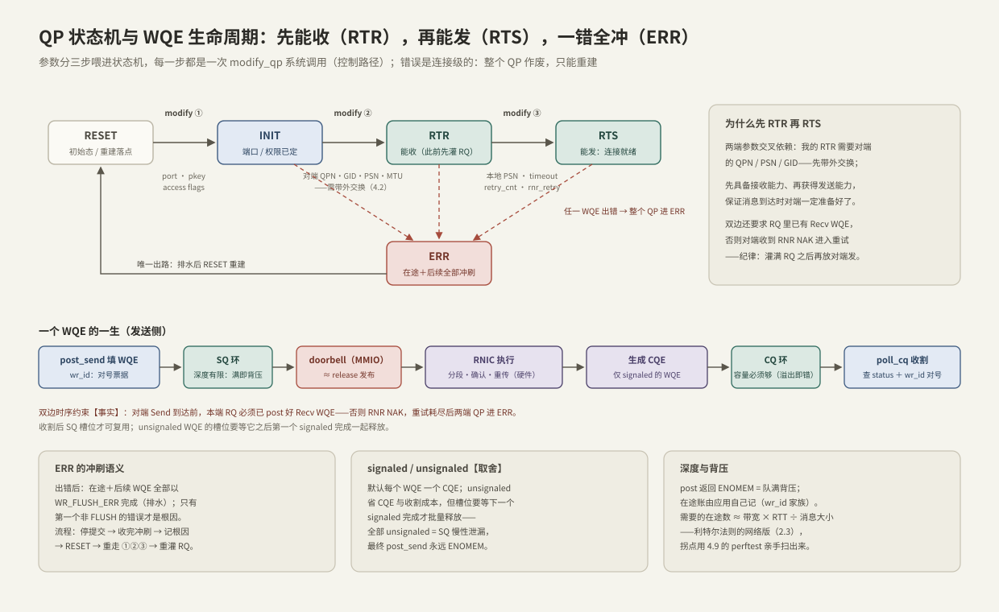

---
tags:
  - 高性能存储
  - RDMA与RoCE
---
# QP WQE CQ 状态机

> [[4.2 Verbs 编程模型]] 把五个对象摆上桌面，本篇拆开最有"脾气"的那部分：**QP 是一台住在网卡里的连接状态机——参数分三步喂进去才通车；WQE 是一次操作的一生——填表、门铃、硬件执行、CQE 收割，每一站都有明确的所有权移交与顺序保证；而错误是连接级的：一个 WQE 出错，整个 QP 作废**。TCP 把这一切藏在内核里替你兜底，Verbs 把它们摊开交给你——代价是必须懂，回报是每一微秒都可解释、可排查。

前置：[[4.2 Verbs 编程模型]]（五对象与 WR/WQE/SGE/CQE 术语，本篇直接使用）、[[3.2 Queue Pair 与 Doorbell]]（环 + 门铃的力学）、[[2.1 SQ CQ 模型]]（提交/完成分离的心智模型）。

---

## 1. 为什么网卡里要有一台状态机

**【事实】** RC（Reliable Connection）的可靠传输——序号、确认、超时重传、按序交付——全部由网卡（RNIC）硬件执行（[[4.1 RDMA 为什么快]] 的第三根柱子）。硬件要执行，就得持有每条连接的传输状态：包序号 PSN、重传计数器、在途窗口、对端地址。这份状态叫 **QP 上下文（QP context）**，本质上是 TCP 的 TCB（Transmission Control Block）从内核搬进了网卡。

拿 TCP 逐项对账，差异全在"谁负责"：

| | 内核 TCP | RDMA RC |
| --- | --- | --- |
| 连接状态存放 | 内核 TCB | 网卡 QP 上下文（片上缓存，装不下溢出到主存）【实现】 |
| 建连 | 三次握手，带内自动完成 | 参数带外交换 + 两端各自 modify_qp 三步（[[4.2 Verbs 编程模型]] §4） |
| 序号 | SEQ/ACK 按字节 | PSN 按包 |
| 重传 | 内核定时器 + 拥塞控制 | 网卡硬件 timeout / retry_cnt 计数器 |
| 对端没准备好 | 内核缓冲区兜底、窗口收缩 | RNR NAK：RQ 没挂 WQE 就明说"你等会再来" |
| 出错 | RST 后重连，socket 还能复用 | QP 进 ERR，只能排水重建 |

两个直接的工程推论：

1. **建连归软件、传输归硬件**：状态机每次推进都是一次 `ibv_modify_qp` 系统调用（控制路径，毫秒级无妨）；推到 RTS 之后，热路径全在硬件里跑；
2. **QP 上下文是稀缺资源**【实现】：片上缓存装不下时溢出到主机内存，连接数上万后每个包可能多付一次 PCIe 往返去取上下文——这是 [[4.1 RDMA 为什么快]] §5"连接状态在网卡"的微观机制，也是大集群要控制 QP 数、SRQ（共享接收队列）存在的原因之一。

---

## 2. 状态机主线：三次 modify_qp，每次一组必带参数



**【事实】** RC QP 的完整状态集有 7 个：RESET、INIT、RTR（Ready to Receive）、RTS（Ready to Send）、ERR，外加两个冷门——SQD（Send Queue Drain，优雅暂停发送用）与 SQE（RC 用不到：RC 的发送错误直接进 ERR）。主线只有四站，每一跳都必须带齐该跳的参数集合、不能跳步——`attr_mask` 少一位就是 EINVAL（掩码均为 `IBV_QP_` 前缀，此处省略）：

| 跳 | attr_mask 必带 | 语义 |
| --- | --- | --- |
| RESET→INIT | STATE + PKEY_INDEX + PORT + ACCESS_FLAGS | 定端口与本端授权：允许对端对我 READ / WRITE / ATOMIC 吗 |
| INIT→RTR | STATE + AV + PATH_MTU + DEST_QPN + RQ_PSN + MAX_DEST_RD_ATOMIC + MIN_RNR_TIMER | 填对端的一切：地址向量（RoCE 下含 GID，[[4.6 RoCE 与 InfiniBand]]）、对端 QPN、起始收包序号、允许对端在途 READ/ATOMIC 数、RNR 通告等待档位 |
| RTR→RTS | STATE + TIMEOUT + RETRY_CNT + RNR_RETRY + SQ_PSN + MAX_QP_RD_ATOMIC | 填本端发送的可靠性参数：ACK 超时、传输重试上限、RNR 重试上限、起始发包序号、本端在途 READ/ATOMIC 上限 |

表格里最容易被略过、事后最贵的三个字段：

- **为什么先 RTR 再 RTS**【事实】：RTR 需要的全是对端参数（QPN/GID/PSN），必须等带外交换完成才能填；并且先具备接收能力、再获得发送能力，保证任何一端开始发送时对端一定收得下包。但"能收包"不等于"有地方放"——双边操作还要求 RQ 里已挂好 Recv WQE（`ibv_post_recv` 从 INIT 起就允许调用），这就是 [[4.2 Verbs 编程模型]] §5"先灌满 RQ 再放对端发"纪律的出处；
- **timeout / retry_cnt**【实现】：ACK 超时 ≈ 4.096 µs × 2^timeout（14 档 ≈ 67 ms），retry_cnt 上限 7。超时重传由网卡计数，耗尽后以 `IBV_WC_RETRY_EXC_ERR` 浮出——它对应的是"包或 ACK 真的丢了"；
- **rnr_retry = 7 表示无限重试**【事实】：对端 RQ 空时回 RNR NAK（Receiver Not Ready），本端按对端通告的 min_rnr_timer 档位（如 12 档 ≈ 0.64 ms【实现】）等待后重发。7 是"永不放弃"——生产常用，开发期慎用（§6）；
- **MAX_QP_RD_ATOMIC / MAX_DEST_RD_ATOMIC** 这对参数是 RDMA READ 吞吐的闸门，用法在 [[4.5 Send Recv 与 RDMA Read Write]] §4。

---

## 3. WQE 的一生：七站，两次所有权移交

发送侧（对应上图下半部）：

1. **post_send 填 WR**：opcode、SGE（addr/len/lkey）、`wr_id`、send_flags——纯用户态内存写，没有系统调用；
2. **驱动把 WR 写成 SQ 环里的 WQE**：从这一刻起，SGE 指向的 buffer **所有权移交网卡**——直到对应完成被收割前，不许写、不许释放【事实】；
3. **doorbell（MMIO）**：一次跨 PCIe 的写，语义 ≈ release 发布——保证网卡看到门铃时 WQE 内容已全部就位（[[3.2 Queue Pair 与 Doorbell]] 的门铃协议，同一形状）；
4. **网卡取 WQE，按 lkey 查地址翻译表，DMA 读出数据**（lkey 与翻译表的来历在 [[4.4 内存注册与零拷贝]]）；
5. **硬件传输**：按 PATH_MTU 分段、编 PSN、发包、收 ACK、超时重传——§1 那台"硬件 TCP"在干活；
6. **生成 CQE**（仅 signaled 的 WQE，§5）：写进 CQ 环；
7. **poll_cq 收割**：读 CQE ≈ acquire 确认——此后才能安全复用 buffer 与 SQ 槽位；`wr_id` 负责对号入座。

接收侧对称且更简单：`ibv_post_recv` 把空 buffer 挂进 RQ（所有权同样移交网卡）；对端 SEND 到达时，网卡按 FIFO 消费队头 Recv WQE、DMA 写入数据、生成 CQE（`wc.byte_len` 是实际消息长度）。

**顺序保证【事实】**——协议设计的地基，[[4.5 Send Recv 与 RDMA Read Write]] 会反复用到：

- 同一 QP 的 SQ：WQE 按提交序开始执行；RC 下完成也按序返回；
- 跨 QP：任何顺序都不保证；
- 例外：RDMA READ / ATOMIC 是"拆成两半的事务"，后续 WQE 可以在 READ 响应回来之前开始执行——需要严格先后时给后续 WQE 加 `IBV_SEND_FENCE`【实现】。

---

## 4. 完成怎么收：轮询还是事件

| | busy poll | completion channel（事件） |
| --- | --- | --- |
| 机制 | 循环 `ibv_poll_cq` | CQ 绑一个 channel fd，epoll 等它可读 |
| 完成延迟 | 最低，p99 贴 p50 | 加中断 + 唤醒，几到几十 µs 且随负载抖【量级】 |
| CPU | 烧满一个核 | 空闲时归零 |
| 适用 | 数据面热路径 | 控制面、低频或大量闲置连接 |

这与 [[2.4 polling 与 registered buffers]]、[[2.2 io_uring 与 epoll 对比]] 是同一笔交易：**用一个核的确定性支出，换走完成路径上调度器带来的整条尾巴**【取舍】。

事件模式有一个固定套路【实现】，顺序错一步就是永久卡死：

1. `ibv_req_notify_cq`（武装：下一个 CQE 到达时发事件）；
2. 等 fd 可读 → `ibv_get_cq_event` → `ibv_ack_cq_events`；
3. **先重新武装**（再调一次 `ibv_req_notify_cq`）；
4. **再 poll 到空**。

若把 3、4 反过来：在"poll 空"与"武装"之间落进的 CQE 不会触发事件——你在等事件、事件在等下一个 CQE，两边互相等到天荒地老。

---

## 5. signaled、CQ 容量与在途记账

**signaled / unsignaled【取舍】**：默认每个 WQE 完成产生一个 CQE（`IBV_SEND_SIGNALED` 控制）。unsignaled 省掉 CQE 的生成与收割成本，但它占的 SQ 槽位要等"它之后第一个 signaled WQE 完成"才批量释放——全部 unsignaled 等于槽位慢性泄漏，最终 `post_send` 永远返回 ENOMEM。常用节奏：每 N 个 WQE 标记一个 signaled，N 远小于 SQ 深度。

**CQ 容量是硬约束【事实】**：CQ 溢出不是背压，是错误——网卡报 async event `IBV_EVENT_CQ_ERR`，关联 QP 进 ERR。容量必须覆盖挂在它上面**所有 QP** 的最大在途 signaled 完成总和。深度上限还受设备能力约束（`ibv_query_device` 的 `max_qp_wr` / `max_cqe`），创建时超限直接失败。

**在途账自己记【实践】**：`poll_cq` 返回 0 不代表没有在途（unsignaled 的完成不可见）。为每个 QP 维护在途计数：post 前检查、收割后递减。需要的在途数 ≈ 带宽 × RTT ÷ 消息大小——利特尔法则的网络版（[[2.3 iodepth 与提交完成路径]]），拐点用 [[4.9 ibv_perftest 基准实验]] 亲手扫出来。

---

## 6. 错误模型：两条通道，一票否决

**【事实】** 错误从两条性质完全不同的通道浮出：

| 通道 | 时机 | 覆盖 | 后果 |
| --- | --- | --- | --- |
| `post_*` 返回 errno | 提交时，同步 | 本地资源问题：队满（ENOMEM）、参数非法（EINVAL） | QP 不受伤，修正后可重试 |
| `wc.status != IBV_WC_SUCCESS` | 完成时，异步 | 传输与远端问题 | RC 下 QP 进 ERR，连接作废 |

**ERR 的冲刷（flush）语义**：出错点之后所有在途与后续 WQE 一律以 `IBV_WC_WR_FLUSH_ERR` 完成——它们不是错误原因，是排水。**只有第一个非 FLUSH 的 status 才是根因**。

重建流程（唯一出路，照抄可用）：

1. 停止提交（此时 post 会返回错误，别再灌）；
2. 持续 poll，把冲刷完成**收干净**——否则旧 CQE 会混进下一条连接的收割循环，`wr_id` 张冠李戴；
3. 记录根因 CQE（status、opcode、wr_id、qp_num）；
4. modify 回 RESET（或干脆销毁重建 QP）；
5. 生成新 PSN、重新带外交换，重走 ①②③；
6. 重灌 RQ，恢复提交。

**RNR 与传输重试是两套独立计数【事实】**：RNR（"对端没挂 buffer"）按 rnr_retry 计，耗尽报 `IBV_WC_RNR_RETRY_EXC_ERR`；传输超时（"包或 ACK 丢了"）按 retry_cnt 计，耗尽报 `IBV_WC_RETRY_EXC_ERR`。看到哪个，排查方向完全不同（§8）。

---

## 7. Modern C++：三步推进 + 收割循环

生产环境常用 rdma_cm 代跑这段状态机（[[4.2 Verbs 编程模型]] §4 的取舍）；手写一遍是为了 EINVAL 时知道去核对哪个字段：

```cpp
#include <infiniband/verbs.h>

#include <array>
#include <cstdint>
#include <iostream>
#include <span>
#include <system_error>

inline void check(int rc, const char* what) {
    if (rc != 0)   // Verbs 惯例：直接返回 errno 值（4.2 §6 的 API 风格陷阱）
        throw std::system_error{rc, std::system_category(), what};
}

struct PeerInfo {          // 带外交换得来（4.2 §4）
    std::uint32_t qpn;
    std::uint32_t psn;     // 对端起始 PSN
    ibv_gid gid;
};

// 三步推进：attr_mask 必须与 §2 参数表逐位对齐，少一位就是 EINVAL
void connect_rc(ibv_qp* qp, const PeerInfo& peer, std::uint32_t local_psn,
                std::uint8_t port, std::uint8_t gid_index) {
    ibv_qp_attr a{};
    a.qp_state        = IBV_QPS_INIT;
    a.pkey_index      = 0;
    a.port_num        = port;
    a.qp_access_flags = IBV_ACCESS_REMOTE_READ | IBV_ACCESS_REMOTE_WRITE;
    check(ibv_modify_qp(qp, &a,
                        IBV_QP_STATE | IBV_QP_PKEY_INDEX | IBV_QP_PORT |
                            IBV_QP_ACCESS_FLAGS),
          "modify_qp INIT");

    a = {};
    a.qp_state           = IBV_QPS_RTR;
    a.path_mtu           = IBV_MTU_1024;   // 两端必须一致（带外协商）
    a.dest_qp_num        = peer.qpn;
    a.rq_psn             = peer.psn;       // 对端的起始发包序号
    a.max_dest_rd_atomic = 4;              // 允许对端在途 READ/ATOMIC 数（4.5）
    a.min_rnr_timer      = 12;             // RNR NAK 通告的等待档位（≈0.64 ms）
    a.ah_attr.is_global  = 1;              // RoCE 必须带 GRH
    a.ah_attr.grh.dgid       = peer.gid;
    a.ah_attr.grh.sgid_index = gid_index;  // 本端 GID 槽位——RoCE v2 的经典坑（4.6）
    a.ah_attr.grh.hop_limit  = 64;
    a.ah_attr.port_num   = port;
    check(ibv_modify_qp(qp, &a,
                        IBV_QP_STATE | IBV_QP_AV | IBV_QP_PATH_MTU |
                            IBV_QP_DEST_QPN | IBV_QP_RQ_PSN |
                            IBV_QP_MAX_DEST_RD_ATOMIC | IBV_QP_MIN_RNR_TIMER),
          "modify_qp RTR");

    a = {};
    a.qp_state      = IBV_QPS_RTS;
    a.sq_psn        = local_psn;
    a.timeout       = 14;   // ACK 超时 ≈ 4.096 µs × 2^14 ≈ 67 ms
    a.retry_cnt     = 7;    // 传输重试上限
    a.rnr_retry     = 7;    // 7 = 无限重试——开发期改小让问题炸出来（§6）
    a.max_rd_atomic = 4;    // 本端在途 READ/ATOMIC 上限：READ 吞吐的闸门（4.5）
    check(ibv_modify_qp(qp, &a,
                        IBV_QP_STATE | IBV_QP_TIMEOUT | IBV_QP_RETRY_CNT |
                            IBV_QP_RNR_RETRY | IBV_QP_SQ_PSN |
                            IBV_QP_MAX_QP_RD_ATOMIC),
          "modify_qp RTS");
}

// 收割：flush 与根因分离；返回 true 表示连接已坏，走 §6 重建流程
bool reap(ibv_cq* cq, auto&& on_complete) {
    std::array<ibv_wc, 32> wc{};
    const int n = ibv_poll_cq(cq, static_cast<int>(wc.size()), wc.data());
    if (n < 0)
        throw std::runtime_error{"ibv_poll_cq failed"};
    bool broken = false;
    for (const ibv_wc& c : std::span{wc.data(), static_cast<std::size_t>(n)}) {
        on_complete(c.wr_id);   // 归还 buffer 与槽位：在途账 -1（§5）
        if (c.status == IBV_WC_SUCCESS)
            continue;
        broken = true;
        if (c.status != IBV_WC_WR_FLUSH_ERR)   // 第一个非 FLUSH 才是根因
            std::cerr << "root cause: " << ibv_wc_status_str(c.status)
                      << " wr_id=" << c.wr_id << '\n';
    }
    return broken;
}
```

---

## 8. 排障清单：症状 → 原因 → 检查

| 症状 | 常见原因 | 检查动作 |
| --- | --- | --- |
| `IBV_WC_WR_FLUSH_ERR` 刷屏 | 这不是根因，是 ERR 后的排水 | 往前找第一个非 FLUSH 的 CQE；找不到就查 `ibv_get_async_event` 里的 QP/CQ 事件 |
| `IBV_WC_RETRY_EXC_ERR` | 对端 QP 死了或没到 RTR、路径断、两端 PATH_MTU 不一致 | 两端 `ibv_query_qp` 看状态；`rping` 验证连通；核对 MTU；RoCE 下查交换机 UDP 4791（[[4.6 RoCE 与 InfiniBand]]）与 PFC 风暴（[[4.7 PFC ECN 与 DCQCN]]） |
| `IBV_WC_RNR_RETRY_EXC_ERR` | 对端 RQ 空：消费太慢或忘了 post_recv | 先灌满 RQ 再放对端发；加深 RQ 或上 SRQ；核对 rnr_retry / min_rnr_timer |
| `IBV_WC_LOC_LEN_ERR` | 发送 SGE 超出 MR 范围；接收 buffer 小于来消息 | 核对 addr/length 与 MR 边界；协议里定死消息上限（[[4.5 Send Recv 与 RDMA Read Write]]） |
| `IBV_WC_LOC_PROT_ERR` | lkey 错、buffer 不在该 MR、MR 与 QP 不同 PD | 核对 SGE 的 lkey 归属与 PD（[[4.4 内存注册与零拷贝]]） |
| `IBV_WC_REM_ACCESS_ERR` | rkey 错或已失效、对端 MR 未开 REMOTE_* 权限、越界 | 双方打印 rkey/raddr/len 与 access flags 逐项核对（[[4.5 Send Recv 与 RDMA Read Write]]） |
| `ibv_modify_qp` 返回 EINVAL | attr_mask 少位、状态跳步、字段值非法、两端 GID index / MTU 不一致 | 对照 §2 参数表逐位核对；`ibv_query_qp` 确认当前状态 |
| `ibv_post_send` 返回 ENOMEM | SQ 满：在途没收割，或全 unsignaled 导致槽位泄漏 | 先 poll 再补位；核对 signaled 节奏与自记在途账（§5） |
| 不报错也不出完成，整体卡死 | 事件模式丢武装（§4 顺序反了）；或全 unsignaled 无 CQE 可等 | 核对 req_notify → drain 的顺序；至少周期性 signaled |

---

## 9. 陷阱与误区

> [!warning] 常见错误
> 1. **rnr_retry=7（无限重试）当默认**：它把"对端忘了 post_recv"从一个响亮的错误变成安静的卡死。开发期用有限值让 bug 当场爆炸，上线再谈兜底。
> 2. **指望 EINVAL 告诉你缺哪个参数**：modify_qp 对一切参数问题一视同仁地返回 EINVAL——唯一办法是拿 §2 的表逐位核对 attr_mask。
> 3. **CQ 容量拍脑袋**：多个 QP 共享一个 CQ 时，容量必须 ≥ 所有 QP 在途 signaled 之和；溢出是连接级错误，不是背压。
> 4. **ERR 后只重建不排水**：冲刷 CQE 还在 CQ 里，新连接的收割循环会把旧 wr_id 当成自己的完成处理。
> 5. **把 poll 返回 0 当"无在途"**：unsignaled 的完成永远不可见，在途账必须自己记——与 io_uring 的自记账纪律同源（[[2.1 SQ CQ 模型]]）。

---

## 10. 关键结论

| 结论 | 性质 |
| --- | --- |
| QP 上下文 = 搬进网卡的 TCB；建连归软件（modify_qp 三步），传输归硬件 | 事实 |
| 主线 RESET→INIT→RTR→RTS，每跳一组必带参数；先能收、再能发；RTR 前灌满 RQ | 事实（约束） |
| WQE 的一生有两次所有权移交：post 时 buffer 交给网卡，收割 CQE 后才拿回来 | 事实 |
| 同 QP 按序执行、RC 完成按序返回；跨 QP 无序；READ/ATOMIC 之后要 FENCE | 事实（约束） |
| doorbell ≈ release、读 CQE ≈ acquire——与 io_uring/NVMe 同一门铃协议 | 类比 |
| signaled 节奏 = CQE 开销与槽位回收时延的交易；CQ 容量是硬约束不是背压 | 取舍 |
| 错误两条通道：post 返回值（本地、可重试）与 wc.status（传输、连接作废）；根因 = 第一个非 FLUSH | 事实 |
| 轮询换尾巴、事件换核——与 io_uring 同一笔交易；事件模式必须"先武装再排空" | 取舍 / 实践结论 |

---

## 关联知识

- [[4.2 Verbs 编程模型]] - 五对象怎么建、WR/SGE/CQE 术语的出处
- [[4.4 内存注册与零拷贝]] - WQE 里 lkey 背后的地址翻译与内存所有权
- [[4.5 Send Recv 与 RDMA Read Write]] - opcode 语义与顺序保证的用法
- [[4.6 RoCE 与 InfiniBand]] - AV/GID 字段的网络层出处、RoCE v2 排障
- [[4.7 PFC ECN 与 DCQCN]] - RETRY_EXC 背后可能的网络原因
- [[4.9 ibv_perftest 基准实验]] / [[4.10 rc_pingpong 最小程序]] - 在途深度拐点与状态机的可运行版本
- [[3.2 Queue Pair 与 Doorbell]] - 门铃协议的 NVMe 版
- [[2.4 polling 与 registered buffers]] - 轮询 vs 事件：同一笔交易的 io_uring 版
