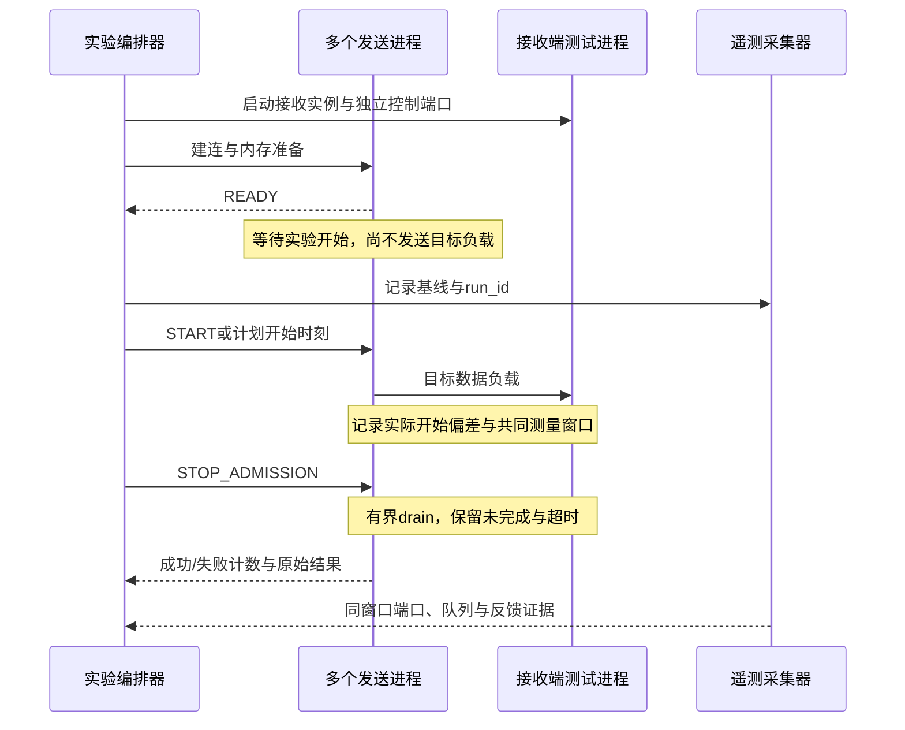

---
tags:
  - 高性能存储
  - RDMA与RoCE
  - Benchmark
aliases:
  - RoCE Benchmark Matrix
  - RoCE 基准矩阵与 P99
created: 2026-09-11
---

# RoCE Benchmark Matrix：Message Size、QP 数、Flow 数、Incast、NUMA、Multi-Rail、PFC/ECN 与 P99

> 一次 `ib_write_bw` 跑满带宽，证明的是某个配置下的一种能力，不是整个 Fabric 已经验收。可靠的 Benchmark Matrix 应把每个实验写成：要验证的假设、主动改变的变量、固定条件、测量窗口、失败判据，以及结果能支持的结论。

基础工具、两端启动方式和 SEND/READ/WRITE 的入口见[[4.9 ibv_perftest 基准实验]]。本篇不重复安装教程，重点把微基准扩展成**连接规模、拥塞场景、主机拓扑与尾延迟的实验体系**。

**适用范围。** Linux、硬件 RoCEv2 RNIC、明确版本的 rdma-core/perftest；默认先测主机内存、RC 和单 rail。GPU 内存、DC/XRC、特殊拥塞算法是另建基线的变体。所有尺寸、重复次数和数值例子都是实验设计，不是本机或用户集群实测结果。

**方法来源。** 《Systems Performance》第 2 版要求边运行边观察，确认真正受测对象与瓶颈，再逐步增加负载。本篇沿用这个 Active Benchmarking 方法，把 RDMA 特定变量放进相互可比较的矩阵。[^perf]

## 1. 先声明受测系统和通过条件

| 目标 | 测量边界 | 必须一起报告 |
|---|---|---|
| 单主机/单 NIC 能力 | host memory ↔ RNIC ↔ peer | CPU、NUMA、PCIe、操作类型和队列窗口 |
| Fabric 汇聚能力 | 多个发送端 ↔ 指定瓶颈口 ↔ 接收端 | 输入负载、路径分布、队列、PFC/ECN、丢弃 |
| 大规模连接能力 | 连接表、资源创建与活动 QP 工作集 | allocated/active QP、创建耗时、资源与 P99 |
| 应用性能 | 请求进入、业务处理、远端确认完成 | offered/success/error、端到端时延与正确性 |

如果测的是应用请求结束，却只用本地 WRITE CQE 当终点，结论边界就变了。本地完成与远端业务消费、持久化不是同一个事件；语义依据见[[4.13 RDMA 操作顺序性]]和[[4.14 Fence 与内存可见性]]。

通过条件应在实验之前指定。例如：吞吐是否满足目标、成功请求 P99 是否满足 SLO、超时与错误率是否低于预算、接收 buffer 是否不会失控耗尽。**只有“P99 很低”而没有成功率，不构成通过。**

## 2. QP、Flow、Peer、Outstanding 分开计数

| 变量 | 本篇的严格含义 | 易混淆之处 |
|---|---|---|
| Message size $S$ | 一次目标操作的 payload 字节数 | 不是 Ethernet frame 长度，也不是包数量 |
| Allocated QP | 已创建未释放的本地 QP | 不是测量窗口内全部活跃 |
| Active QP $A$ | 指定窗口中实际参与目标操作的 QP | 可以远小于 allocated QP |
| Peer / sender count $F$ | 独立远端或独立数据发送主机数 | 两主机 `-q 32` 不等于 32 主机 incast |
| Flow count | 实验定义的流数，需注明应用/传输/散列口径 | 不自动等于独立网络路径数 |
| Outstanding $I$ | 已提交但尚未回收完成的操作数量 | QP 数、CQE 数都不是它的替代值 |
| Rail count $R$ | 实际参与的独立 NIC/端口与对应网络路径 | 一个 NIC 多 QP 不自动变成多 rail |

大规模连接的对象数与工作集模型见[[4.28 RDMA 大规模连接：QP 资源成本、SRQ、连接扩展与 RNIC Cache]]。网卡/交换机如何观察数据范围，则使用[[4.29 RDMA Fabric Telemetry：NIC Counter、Switch Counter、Queue Occupancy、PFC Pause、ECN Mark、CNP 与 Drop Counter]]中的口径合同。

### 2.1 两种 QP 扫描回答不同问题

固定每 QP 深度 $D$ 时，总并发上限通常近似 $I=A D$；增加 $A$ 同时扩大了在途窗口。它适合测扩展后的能力，不足以单独证明“多个 QP 改善了 RNIC Cache”。

要隔离活动 QP 的影响，可以固定总 $I$，在活动 QP 间分配。若最大 $A$ 大于 $I$，无法让每个 QP 同时至少有一个操作；此时应增大固定窗口，或明确只改变 allocated QP 而非全部活跃 QP。报告请求的 tx-depth 与实际峰值/均值 in-flight，不把两者默认为相等。

### 2.2 READ incast 要画数据，而不是只画请求

多个主机向一个目标 WRITE，自然形成数据汇聚。一个客户端同时向多个服务器 READ，真正的大数据方向是多服务器返回该客户端，同样可以形成 incast。

因此，必须记录 `operation_initiator` 与 `bulk_data_sender`，尤其不能根据“谁启动了 client 命令”决定在哪一端采 RP/NP、TX/RX 或瓶颈口。

## 3. 因子矩阵：候选水平不是全部相乘

![[图片/SVG/8_4_4_30_1.svg|900]]

图中先扫描单轴，再围绕实际拐点选择交互实验；不把所有选项笛卡尔积跑一遍。这样既保留归因能力，也避免测试时间主要花在没有明确问题的组合上。

| 因子 | 起始候选水平，按设备能力裁剪 | 应固定或配对检查 |
|---|---|---|
| Message size | 64 B、256 B、1 KiB、4 KiB、64 KiB、1 MiB | inline、MTU、每次 WR 的实际字节数 |
| Active QP | 1、4、16、64；再对拐点细化 | 总 outstanding 或每 QP 深度的口径 |
| Allocated QP | 活跃数量固定，再逐批扩大 | 队列 cap、CQ、MR 和注册工作集 |
| Sender/peer count | 1、2、4、8，按测试主机扩展 | 汇聚出口、启动重叠、总 offered load |
| Access pattern | 均匀轮转、热点、阶段换热点 | 随机种子、每 QP 连续批量 |
| Outstanding | 1、8、32、128，按操作限制裁剪 | SEND 接收 credit、READ/Atomic 深度限制 |
| NUMA | CPU 本地/远程 × memory 本地/远程 | 两端位置、first-touch、迁移与注册时间 |
| Rail | 各 rail 单独、并行、真实应用使用多 rail | CPU、PCIe Root、接收端和共享 uplink |
| CC profile | 已验证基线，再做隔离实验变体 | PFC priority、ECN queue、NP/RP、CNP 路径 |
| Traffic shape | 稳态、受控 burst、incast、背景混合 | 到达模型、突发宽度、周期与实际输入速率 |

64 B 以下或更大消息、数千活动 QP、多主机 all-to-all 都可以后续加，但先证明小矩阵结果可信。不是所有设备都允许所有 cap；不支持的组合写 `unsupported`，资源不足写 `allocation_failed`，不能从图表中静默删除。

### 3.1 冻结的环境清单

固定主机、NIC 型号/固件、驱动/内核、perftest 二进制版本与哈希、CPU 电源策略、NUMA 与 PCIe 链路、线速、端到端 MTU、VLAN/GID、DSCP/PCP trust 与映射、队列/PFC/ECN 配置、路由/ECMP/LAG 状态、测试方向与背景负载。

若某项必须改变，就把它升级成显式实验因子，而不是让它悄悄漂移。不能把调频告警用 `-F` 隐藏后声称已经控制了频率；它并不替你设置 CPU 电源策略。[^perftest]

## 4. 分阶段执行：先可信，再扩展

| 阶段 | 目的 | 最小产物 | 何时停止扩大 |
|---|---|---|---|
| S0 身份与正确性 | 确认设备/路径、握手、数据语义 | 环境快照、原始输出、错误日志 | 设备不符、数据校验失败 |
| S1 单轴能力 | 单 rail、尺寸与 QP/窗口扫描 | 吞吐/延迟曲线及同窗 telemetry | 不支持、资源或温度/链路异常 |
| S2 交互归因 | QP×size、sender×burst、NUMA×rail | 配对对照与置信范围/波动 | 输入负载不再可比 |
| S3 隔离压力 | 接收变慢、拥塞变体、恢复 | 错误率、恢复时间、资源回收 | 超出预设安全/停机条件 |
| S4 回归与应用 | 长时负载、真实应用使用模式 | SLO、正确性、应用收益 | 不满足结果有效性合同 |

**教学工作量示例：** 6 个尺寸 × 4 个活动 QP 水平 × 3 次重复 = 72 次运行。这个计数只是 S1 的一个切片，尚未乘 NUMA、rail 和拥塞配置。三次重复只是起点，不能自动提供稳定的极端分位数估计。

逐步加压来自教材的 Ramping Load 方法：确认 delivered throughput 的扩展形状，同时观察瓶颈。每个关键配置做基线—变体—基线的配对，或随机化次序，避免把温度、时间段和缓存预热漂移当成优化。[^perf]

## 5. 单 rail 的可执行基线

### 5.1 先保存身份，不要一上来跑无限测试

以下命令读取本机状态。配合交换机配置快照保存到该轮结果目录，不要求安装额外 exporter。设备名和 NUMA 值需要从实际系统确认。

```bash
uname -r
ib_write_bw -V
ib_send_lat -V
rdma link show
ibv_devinfo -v
numactl --hardware
lspci -tv
```

每端分别确认 GID 的类型和对应 netdev；**两端的 GID index 不要求相同**。示例用显式 `-d/-i/-x` 和 perftest 默认控制通道，不加 `-R`，避免把 RDMA CM 自动选择与手工 GID 选择混在一起。

### 5.2 两端分别设置本地参数

下列值是示例模板，先替换为真实隔离实验机的设备、GID、CPU、NUMA 和地址。`-m 1024` 是这里选定的 QP MTU，并不代表整个生产网络应使用这个值。确认端到端链路 MTU 足够且两端设置兼容。[^perftest]

```bash
# 每端各自设置；本地 DEV/GID/CPU/NODE 可以不同。
DEV=mlx5_0
IBPORT=1
GID=3
CPU=2
NODE=0
CTRLPORT=18515
SIZE=4096
QPS=4
DEPTH=32
```

在服务端执行并等待它进入监听状态。这里不使用管道，保留 perftest 退出状态；`timeout` 是有界的实验保护，不是测得的 RPC deadline。

```bash
# 服务端：先运行。失败或 timeout 时保留日志，不能当作有效零吞吐。
timeout --signal=INT --kill-after=5s 90s \
  numactl --physcpubind="$CPU" --membind="$NODE" \
  ib_write_bw -d "$DEV" -i "$IBPORT" -x "$GID" -m 1024 \
  -p "$CTRLPORT" -s "$SIZE" -q "$QPS" -t "$DEPTH" \
  -Q 1 -I 0 -D 20 -N --report_gbits
```

客户端使用自己的本地变量，并追加服务端控制地址。普通控制 IP 的可达性，不替代所选 RoCE GID 和数据路径的可达性。

```bash
# RFC 5737 示例地址，必须替换为实验服务端地址。
SERVER_IP=192.0.2.20
timeout --signal=INT --kill-after=5s 90s \
  numactl --physcpubind="$CPU" --membind="$NODE" \
  ib_write_bw -d "$DEV" -i "$IBPORT" -x "$GID" -m 1024 \
  -p "$CTRLPORT" -s "$SIZE" -q "$QPS" -t "$DEPTH" \
  -Q 1 -I 0 -D 20 -N --report_gbits "$SERVER_IP"
```

两端的操作、消息大小、QP 数、MTU、深度和计时模式应一致；本地设备标识与绑定位置按各端填写。`-Q 1 -I 0` 是便于比较的显式起点，不是性能最优配置。后续改变 signaled 比例、inline 或 post-list，另建一组对照，机制见[[4.15 Signaled Unsignaled WR]]与[[4.16 Inline Batching 与 Doorbell 优化]]。

### 5.3 基线读数如何自洽

对于固定 payload 大小 $S$、成功操作速率 $\lambda$：

$$
G_{payload}=\lambda S
$$

同一窗口内 MsgRate 与 payload goodput 应在换算后相符。再用线侧/功能侧计数交叉核对：它们因为封装、重传或范围不同不必完全相等，但必须能解释数量级。不能把双向带宽的**两个方向合计值**与单向线速直接比较。[^perftest]

大量 QP、小消息下 CPU 可能先限制提交/回收；大消息下可能转为 NIC、内存或 PCIe/网络带宽。应该由 profile 和同窗计数证明，而不是从曲线外形直接宣布根因。

## 6. Latency：计时起点和终点必须写进结果

### 6.1 至少区分这几种延迟

| 指标名示例 | 起点 → 终点 | 包含或排除的等待 |
|---|---|---|
| `scheduled_response_us` | 计划到达 → 业务确认 | 包含生成器迟发、软件排队与服务时间 |
| `issued_response_us` | 实际发起 → 业务确认 | 不包含计划到达之前的迟发 |
| `post_to_cq_observed_us` | 开始提交 → 软件观察到 WC | 包含本地提交和完成回收等待；不一定含远端业务处理 |
| `request_response_rtt_us` | 请求发起 → 响应完成 | 请求/响应路径与对端处理 |
| `perftest_half_rtt_us` | 工具乒乓样本换算 | 不是直接测出的某一单向网络传播时间 |

使用软件观察 CQ 的时间戳时，计入的是 **CQE 可见之后直到 poll 到它的等待**，不等于纯线缆+交换机延迟。CQ moderation、poll batch、线程迁移与 CPU 调度都会影响测量端点。

单端同一个单调时钟可以测 RTT 或本地完成间隔；跨主机直接相减要有时钟同步和误差界限，微秒级目标不能忽略这一项。

### 6.2 一组 SEND latency 参考命令

先在服务端运行同配置命令但不带地址，再运行客户端。使用迭代模式与原始未排序样本输出，避免只看汇总的一列。

```bash
# 服务端：沿用已核对的本地 DEV/IBPORT/GID/CPU/NODE/CTRLPORT
timeout --signal=INT --kill-after=5s 90s \
  numactl --physcpubind="$CPU" --membind="$NODE" \
  ib_send_lat -d "$DEV" -i "$IBPORT" -x "$GID" -m 1024 \
  -p "$CTRLPORT" -s 64 -n 100000 -I 0 -U
```

```bash
# 客户端：使用自己的本地绑定，追加 SERVER_IP
timeout --signal=INT --kill-after=5s 90s \
  numactl --physcpubind="$CPU" --membind="$NODE" \
  ib_send_lat -d "$DEV" -i "$IBPORT" -x "$GID" -m 1024 \
  -p "$CTRLPORT" -s 64 -n 100000 -I 0 -U "$SERVER_IP"
```

`-U` 输出中的序号不是跨设备可对齐的硬件时间戳。不要把输出中配置表、样本表和汇总表一起送进宽松的数字提取脚本；解析时检查表头、单位、样本数和工具版本，失败即标记解析失败。

**本次源码核验提示。** perftest 的 `print_report_lat()` 对 READ/ATOMIC 使用 `rtt_factor=1`，其他相关乒乓操作用 2。因此不能把 READ/Atomic 的完成耗时按 SEND 规则再次除二。所核验提交中还存在 `LAT_MEASURE_TAIL=2` 的汇总处理：未排序样本在这一处理之前输出。汇总与自行计算的分位数不完全一致时，应先查样本集合和估计规则，不随意删掉尾部追求一致。[^latcode]

### 6.3 低负载乒乓 P99 不是满载业务 P99

SEND ping-pong 中，上一次交互结束后才继续下一次，它是一种闭环负载。它适合获得该模式的基线，不能自然代表一个持续到达请求、会在软件队列里等待的服务。

在满载背景下另外起一个小探针，还要确认它与真实业务是否共享 queue/priority、QP 调度与 CPU 资源。探针 P99 很低，不证明大流或某个受限租户的 P99 也低。

## 7. Open-loop、Closed-loop 与 Coordinated Omission

闭环以完成触发下一次提交；服务变慢时，发出的请求也可能变少。开放到达模型依据外部节奏产生请求，服务变慢时仍需体现输入压力。两者没有“一个永远正确”，但代表不同问题。

**教学算例：** 若应每 100 μs 发起请求，却因为一次 10 ms 停顿只发出一次，那么只统计已经发出的请求，会漏掉本应在停顿期间到来的等待经历。这类偏差称为 coordinated omission。HdrHistogram 的 expected-interval 校正提供一种基于假设的补偿；它不是恢复真实丢失时间戳，也不能在已经包含计划到达延迟的样本上重复应用。[^hdr]

生产式到达实验应同时保存：计划时刻、实际发起时刻、成功提交时刻、终止状态以及 deadline。发生生成器迟发、队列拒绝或 admission drop 时，要记录数量与原因，不能静默消失。否则 advertised offered load 与实际负载会脱节。

如果 perftest 当前版本无法表达所需的外部到达模型，应把它定位为能力微基准，再用应用驱动器测试该到达模型；不要仅调 `-q` 就把闭环测试称为 open-loop。

## 8. Incast：把并发启动变成可验证的汇聚

![[图片/SVG/8_4_4_30_2.svg|900]]

图上半部画的是不同主机的数据汇聚；下半部保留共同稳态窗口和启动偏差。多个进程同时存在，不等于它们的目标流量在受测出口同时叠加。

### 8.1 最小拓扑与两种负载合同

至少区分 $F$ 个发送主机、每主机活动 QP 数、汇聚口和接收主机。可以在接收端为每个 sender 启动独立 perftest 实例，使用不同的**控制端口**；这些端口用于区分控制连接，不应被当作 RoCE 数据面路径熵的直接配置。

| 合同 | 扩大 sender 数时保持什么不变 | 能回答的问题 |
|---|---|---|
| 固定每 sender 负载 | 每发送端的 offered rate / burst | 聚合压力随 fan-in 增大后的表现 |
| 固定聚合负载 | 所有 sender 的总 offered load | 分布式来源/路径数量本身的影响 |

二者都值得测，但不能在同一条图上省略这一差别。

### 8.2 控制面屏障与真正的数据重叠



这个图是**实验编排合同**，不是 perftest 自带了所有 READY/START 功能的声明。脚本同时启动多个后台进程，只能提供粗粒度并发；若要研究几十微秒 burst，必须有具备相应精度的生成器和实际开始偏差测量，SSH 启动不能充当微秒级屏障。

### 8.3 稳态与 burst 的判断条件不同

长时稳态可以选取所有 sender 真正同时运行的交集窗口；短 burst 则必须记录实际 burst 起止、宽度和间隔，不能靠“进程总共运行 20 秒”推断每次突发的重叠程度。

采集接收端 CQ/SRQ、CPU 和 PCIe 证据，排除“接收线程处理不过来却被叫作交换机 incast 瓶颈”。网络队列、PFC、CE/CNP 与丢弃按 4.29 的统计范围关联，不能把任意一台机器的端口总量代表整个 Fabric。

## 9. NUMA 与 Multi-Rail：分别证明局部性和聚合收益

### 9.1 NUMA 是 CPU 与内存两个维度

以 NIC 挂接的节点为参照，分别测 CPU-local/memory-local、CPU-remote/memory-local、CPU-local/memory-remote、两者 remote。两端都要记录，因为接收端放置也影响结果。

绑定线程不等于绑定全部内存。内存策略应在分配和 first-touch 前设置；已经注册的 buffer 不会因为后来 pin CPU 就自动移动。记录实际内存分布、注册布局、CPU 迁移与 PCIe 拓扑，而不是只保存一次 `numactl` 命令文本。

### 9.2 多 rail 分三层验证

| 验证层 | 实验 | 可以得出的结论 |
|---|---|---|
| 单 rail 健康 | A 单独、B 单独，分别同窗测量 | 两条路径各自的能力与异常 |
| 主机并行容量 | A+B 同时跑独立流，并确认共同窗口 | 主机能否并行使用这些接口 |
| 单应用收益 | 同一个应用实际分配业务到 A+B | 应用吞吐/尾延迟是否改善 |

**两个独立 `ib_write_bw` 相加，不证明一个应用自动获得双倍性能。** 多 rail 可能共享 PCIe 上行、内存带宽、CPU、接收端或 Fabric uplink；双端口卡也未必是两个独立故障域。

报告两种归一化量更清楚：

$$
E_{parallel}=\frac{G_{A+B,\;concurrent}}{G_{A,\;alone}+G_{B,\;alone}}
$$

$$
S_{app}=\frac{G_{app,\;multi}}{G_{app,\;single}}
$$

前者描述相同方法下的聚合效率，后者描述应用收益。分母/分子要在可比较负载和窗口中测得；如果变化还包括 worker 数或 batch，也要一并报告。perftest 的 `-O` 是特定 dual-port 模式，不能把它宣传为任意 Multi-NIC 应用分流器。[^perftest]

## 10. PFC/ECN 矩阵：把“配置名字”变成实际控制路径

“ECN on”至少涉及合适的包标识、交换机 marking、通知端行为与发送端反应；“PFC on”还涉及真实流量分类、priority、buffer 与端口。只记录两个布尔值，不足以复现实验。

| Profile | 目的 | 使用边界 |
|---|---|---|
| 已验证的 PFC + ECN/CC 基线 | 参考配置 | 先完成队列映射和反馈证据核验 |
| PFC 保留、关闭/改变 CC 的隔离对照 | 观察反馈不足时的行为 | 只在维护窗口或隔离实验网，预设停止条件 |
| ECN/CC 保留、PFC 关闭的变体 | 评估明确支持的 lossy RoCE 配置 | 不可当作所有 RNIC 的默认建议 |
| 两者关闭的故障/边界实验 | 验证恢复与失败边界 | 小范围隔离，不能在共享生产 Fabric 直接运行 |

除了 throughput/P99，还要比较 pause duration、CE/CNP、有效丢弃/重传、fairness 和应用错误率。若负载变体的实际输入更低，尾延迟更低未必是控制策略更好。

**不在本篇提供跨厂商配置写命令。** 实验 profile 应引用已经审核的设备配置快照，并有恢复到基线的办法。对 offloaded RDMA，不能默认 Linux `tc netem` 挂到 netdev 就能拦住真实 RNIC 数据面；故障注入是否命中目标路径本身需要验证。

## 11. 测量窗口、终止状态与 P99 的统计合同

![[图片/SVG/8_4_4_30_3.svg|900]]

图中先画延迟的不同终点，再用两组数量不同的合成样本说明“平均各流 P99”为什么没有整体分位数意义。所有分布都是教学构造，不是硬件测量。

### 11.1 Warm-up、Measure、Drain 分开

吞吐可以按共同稳态时间窗内完成的有效字节计算；延迟则可选择“在 measure 窗口内发起的请求”为 cohort，并在有界 drain 阶段继续追踪它们到成功、错误或超时。两者的统计边界不同，要明确写出，不能把 drain 字节随意加到短窗口分母上。

超时请求不是一个短延迟样本。若只统计成功请求，字段应命名 `p99_success_us`，并同时报告总发起数、成功数、错误数、超时数、停止时未解决数量及其处理规则。把未完成请求直接删除，会把最慢部分从分布中移走。

### 11.2 分位数不等于平均值，也不能直接平均分位数

对 $n$ 个已排序成功样本 $x_1\le\cdots\le x_n$，本篇离线分析采用 nearest-rank：

$$
Q_p=x_{\lceil pn\rceil},\qquad 0<p\le1
$$

不同工具可能采用插值、桶近似或不同样本删选，所以报告估计规则和原始样本数。教材解释的 P99 是分布位置，不是一种“最慢 1% 的平均延迟”。[^perf]

**反例：** 流 A 有 10,000 个 1 μs 样本；流 B 有 100 个 100 μs 样本。A/B 各自 P99 分别为 1/100 μs，平均是 50.5 μs；合并 10,100 个样本后 nearest-rank P99 却是 1 μs。整体 P99 也会掩盖流 B 的问题，因此整体与 per-flow/per-tenant 指标都需要。

histogram 可以在单位、范围、桶或精度兼容时合并计数；不能平均分位数，也不能把一个时间加权的 queue histogram 与一个按请求计数的 latency histogram 合并。

### 11.3 样本数、相关性与重复实验

对于 1000 个独立样本，1% 尾部大约只有十个样本；0.1% 尾部大约只有一个。持续拥塞中的样本还可能强相关，不能把“几百万条连续操作”简单看作几百万次独立实验。

保留每轮分布、按时间切片的异常和多次重复的波动。跨轮汇总时写清是 pooled sample P99、各轮 P99 的分布，还是最坏一轮 P99。它们都可以有用，但不是同一个指标。固定百分比提升不应脱离测量噪声直接变成回归门槛。

## 12. 可运行的离线统计：拒绝默默忽略失败行

下面的 **Python 3.10+** 程序读取明确规范的 CSV，而不是直接猜 perftest 任意版本的输出。CSV 每个 `run_id + op_id` 只允许一个最终状态；只合并同轮且同一 `latency_kind` 的成功样本，错误和超时进入独立计数。

四段代码按顺序保存为 `summarize_latency.py`。它是离线工具，排序与校验开销不进入 RDMA 热路径。

先定义分位数函数与输入 schema，空成功集合返回 `None`，不会编出一个 0 μs P99。

```python
import argparse
import csv
import json
import math
from collections import Counter, defaultdict
from pathlib import Path

REQUIRED = {"run_id", "op_id", "flow_id", "status", "latency_kind", "latency_us"}


def quantile(values: list[float], p: float) -> float | None:
    if not 0 < p <= 1:
        raise ValueError("p must be in (0, 1]")
    if not values:
        return None
    ordered = sorted(values)
    return ordered[math.ceil(p * len(ordered)) - 1]
```

逐行校验标识和状态；成功行必须有有限、非负的 μs 数值。错误/超时的 deadline 或观察时间不能冒充成功延迟填进同一分布。

```python
def parse_row(row: dict) -> tuple:
    keys = (row.get(k, "") for k in ("run_id", "op_id", "flow_id", "latency_kind"))
    run, op, flow, kind = keys
    if not all(isinstance(v, str) and v.strip() for v in (run, op, flow, kind)):
        raise ValueError("empty identity or latency_kind")
    status = row.get("status")
    if status not in {"ok", "error", "timeout"}:
        raise ValueError("status must be ok/error/timeout; resolve pending explicitly")
    raw = row.get("latency_us")
    value = None
    if status == "ok":
        value = float(raw)
        if not math.isfinite(value) or value < 0:
            raise ValueError("success latency must be finite and nonnegative")
    elif raw not in (None, ""):
        raise ValueError("failure latency_us must be blank; keep deadline separately")
    return run, op, flow, kind, status, value
```

收集时拒绝重复操作 ID 和同一轮中的混合延迟口径。每轮 aggregate 与每条 flow 都生成一份统计，而不平均各 flow 的结果。

```python
def summarize(path: Path) -> list[dict]:
    groups = defaultdict(lambda: {"counts": Counter(), "values": []})
    seen, kinds = set(), {}
    with path.open(newline="", encoding="utf-8") as stream:
        reader = csv.DictReader(stream)
        if not REQUIRED.issubset(reader.fieldnames or []):
            raise ValueError("CSV header does not match required schema")
        for line, row in enumerate(reader, start=2):
            try:
                run, op, flow, kind, status, value = parse_row(row)
                if (run, op) in seen:
                    raise ValueError("duplicate operation ID")
                if run in kinds and kinds[run] != kind:
                    raise ValueError("mixed latency kinds in one run")
                seen.add((run, op))
                kinds[run] = kind
                for key in ((run, None), (run, flow)):
                    groups[key]["counts"][status] += 1
                    if value is not None:
                        groups[key]["values"].append(value)
            except (TypeError, ValueError) as exc:
                raise ValueError(f"line {line}: {exc}") from exc
```

下面一段继续上面函数的缩进，随后给出命令行入口。输出中的分位数明确为成功请求条件分布；没有数据或全部失败时，也不会把失败状态隐藏掉。

```python
    if not groups:
        raise ValueError("CSV contains no operations")
    output = []
    for (run, flow), group in groups.items():
        counts, values = group["counts"], group["values"]
        total = sum(counts.values())
        output.append({
            "run_id": run, "flow_id": flow, "latency_kind": kinds[run],
            "total": total, "ok": counts["ok"], "error": counts["error"],
            "timeout": counts["timeout"],
            "failure_fraction": (total - counts["ok"]) / total,
            "p50_success_us": quantile(values, 0.50),
            "p99_success_us": quantile(values, 0.99),
            "p999_success_us": quantile(values, 0.999),
        })
    return output


if __name__ == "__main__":
    parser = argparse.ArgumentParser()
    parser.add_argument("csv_path", type=Path)
    args = parser.parse_args()
    try:
        print(json.dumps(summarize(args.csv_path), ensure_ascii=False, allow_nan=False))
    except (OSError, UnicodeError, ValueError) as exc:
        parser.exit(2, f"invalid input: {exc}\n")
```

这是单执行主体的离线计算，没有跨线程等待，不另画时序图。`flow_id: null` 表示该 run 的合并视图，不是名为 `null` 的实际流。

可先使用下面的**合成数据**检查输入合同，再替换为实验驱动器导出的数据。这里的几行不能用于推断稳定 P99。

```csv
run_id,op_id,flow_id,status,latency_kind,latency_us
demo,1,A,ok,request_response_rtt,2.0
demo,2,A,ok,request_response_rtt,3.0
demo,3,B,timeout,request_response_rtt,
demo,4,B,error,request_response_rtt,
```

```bash
python3 summarize_latency.py samples.csv > latency-summary.json
```

该脚本不估计未发出的计划请求，也不从汇总报表恢复原始样本；计划到达数和 admission drop 需由生成器另行报告。`request_response_rtt`、`scheduled_response`、`post_to_cq_observed` 应作为不同 `latency_kind`，不能放进同一轮悄悄合并。

## 13. 结果目录与最小 Manifest

建议每次运行保留独立目录：环境/配置快照、两端原始 stdout/stderr、命令和退出码、telemetry 原始值、规范化样本、统计结果与有效性判定。不要只保留最终图。

下面是**待填的记录模板**，`null` 表示尚未记录，而不是零或“不重要”。实际报告有关键空值时，应判为证据不完整。

```yaml
run_id: null
purpose: null
tool_version_and_binary_hash: null
hosts_nic_firmware_kernel: null
topology_and_config_snapshot: null
operation_and_transport: null
payload_bytes: null
allocated_qps: null
active_qps: null
sender_hosts_and_flow_definition: null
outstanding_policy_and_actual: null
cpu_memory_numa_both_ends: null
rails_and_shared_bottlenecks: null
pfc_ecn_cc_profile: null
arrival_model_and_offered_load: null
warmup_measure_drain_windows: null
start_skew_and_clock_error: null
latency_kind_and_estimator: null
successful_failed_timedout_counts: null
telemetry_coverage_and_reset_events: null
exit_codes_and_validity: null
```

## 14. 结论应该写成可以反驳的句子

| 不足的结论 | 更可审查的结论形式 |
|---|---|
| 这张网卡支持数千连接 | 在指定 allocated/active QP、cap、工作集和负载下，资源/吞吐/P99 的结果如何 |
| ECN 让 P99 降低 | 在相同输入、映射和统计窗口下，P99、成功率、队列与反馈证据如何一起变化 |
| 多 rail 带宽翻倍 | 是两个独立流的并行容量，还是同一个应用的收益；共享资源和负载如何控制 |
| 没有丢包 | 哪些设备、范围和原因计数被覆盖；是否重置；缺失项是什么 |
| P99 回归 10% | 估计规则、样本、重复运行波动与效应量是否支持该判断 |

对相同权重、相同输入目标的并行流，可以补充 Jain fairness index：

$$
J=\frac{(\sum_i x_i)^2}{n\sum_i x_i^2}
$$

这里 $x_i$ 是同窗口各流的非负 delivered rate，分母非零。它是**本文采用的公平性分析量**；不同租户目标权重或输入速率不同，需要先说明归一化方式。只报告总吞吐可能隐藏个别流饥饿，只报告公平性也可能隐藏“所有流都很慢”。

## 15. 运行结束前的有效性检查

本轮结果需要满足：设备与路径身份正确；payload 和操作语义一致；每个因子变动可追踪；关键 sender 窗口重叠；生成器没有未解释的迟发/丢弃；错误与超时未被剔除；counter epoch 和单位明确；没有把平均分位数当整体 P99；没有在未经验证的 offload 路径上假装完成故障注入。

资源创建失败或应用正确性失败是实验结果，不是“删除这轮再重跑直到好看”的理由。脚本 timeout、设备 reset、采集失败也要留在报告中。

**复习。** `-q` 从 1 增加到 16 后吞吐提高，能否证明 ECMP 分流更均匀？不能；总 outstanding、RNIC 调度和 CPU 开销可能同时改变，需要路径证据与受控对照。

**复习。** 背景吞吐下降而探针 P99 改善，是否说明配置更优？不一定；可能只是实际输入更低，或探针获得了不同服务等级。

**复习。** 为什么正确性校验与错误率必须与尾延迟一起保留？因为丢掉最慢请求、快速返回错误、提前结束窗口，都可能让条件分布的 P99 看起来更好，却让用户体验更差。

## 参考资料

[^perf]: Brendan Gregg，*Systems Performance: Enterprise and the Cloud*，第 2 版，§2.8.3 “Standard Deviation, Percentiles, Median”；§12.3.2 “Active Benchmarking”、§12.3.7 “Ramping Load”、§12.3.9 “Statistical Analysis”。实际阅读本项目 PDF，Active Benchmarking 正文位于该重排 PDF 的第 1018–1019 页；引用以章节为主。
[^perftest]: linux-rdma，[*perftest README*](https://github.com/linux-rdma/perftest/blob/b513a77278c8061ca6c4dcd1a95d08801c6e7623/README)，Testing Methodology、Benchmarks Description、Running Tests。核验上游提交 `b513a77278c8061ca6c4dcd1a95d08801c6e7623`，2026-09-11。实验必须另行记录实际安装的二进制版本，不能假定与这个提交相同。
[^latcode]: linux-rdma，[`src/perftest_parameters.c`](https://github.com/linux-rdma/perftest/blob/b513a77278c8061ca6c4dcd1a95d08801c6e7623/src/perftest_parameters.c)，`print_report_lat()`、`rtt_factor`、`LAT_MEASURE_TAIL` 与原始样本输出位置。核验日期：2026-09-11。这里指出具体实现行为，不将其视为所有旧版/发行版的统一算法。
[^hdr]: HdrHistogram 项目，[README：Corrected vs. Raw value recording calls](https://github.com/HdrHistogram/HdrHistogram#corrected-vs-raw-value-recording-calls)，expected-interval 校正的机制与适用假设。核验日期：2026-09-11；不同语言实现以各自 API 文档为准。
