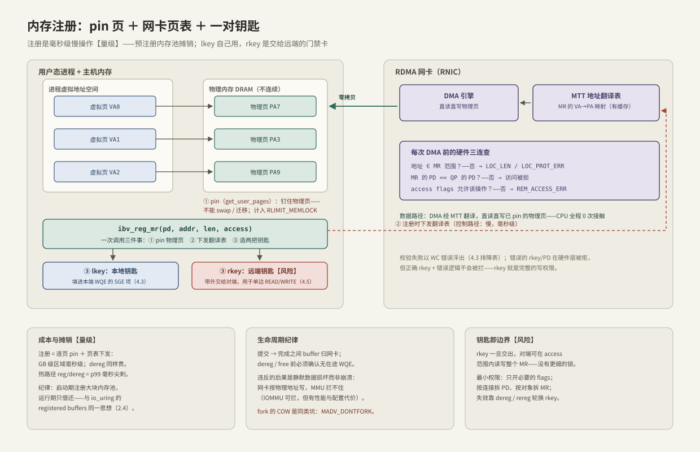

---
tags:
  - 高性能存储
  - RDMA与RoCE
---
# 内存注册与零拷贝

> [[4.1 RDMA 为什么快]] 说零拷贝省下每字节的 CPU 搬运，[[4.2 Verbs 编程模型]] 用一行 `ibv_reg_mr` 把它带过。本篇把这一行拆开：**注册 = 把"这块内存归谁管、地址怎么翻译、谁有权动它"从内核手里接过来，签到应用与网卡名下**——pin 物理页、下发网卡页表、领两把钥匙。零拷贝的所有速度，都是拿这份责任换来的；责任履行不到位时，故障形态不是崩溃，而是静默数据损坏。

前置：[[4.2 Verbs 编程模型]]（MR/PD 在对象模型中的位置）、[[1.5 mmap 读路径]]（虚拟内存与缺页——本篇的地基）、[[3.8 PCIe 拓扑与 NUMA]]（DMA 数据真正走的总线）。

---

## 1. 从虚拟内存说起：为什么网卡不能直接用你的指针

C++ 程序里的指针是**虚拟地址**。CPU 每次访存都经 MMU 翻译，翻译不了就缺页异常陷入内核——正因为每一次访问都拦得住，内核才敢对页面为所欲为【事实】：

- **swap 出去**：下次访问缺页再读回来；
- **迁移与整理**：NUMA balancing、内存规整（compaction）随时把页搬到另一个物理地址，改页表即可；
- **写时复制（COW）**：fork 后父子共享物理页，谁写谁触发复制；
- **回收**：干净页说丢就丢。

网卡的 DMA 引擎不在这套机制里【事实】：它从 PCIe 一侧直接读写物理内存，不经过进程页表，也不会触发缺页。如果内核在传输中途把页换走，网卡还在往旧物理页写——**没有任何硬件会替你拦住它**（无 IOMMU 时）。所以让网卡安全访问用户内存，必须同时满足两件事：

1. **物理页钉死（pin）**：传输期间物理地址不能变——不许 swap、不许迁移、不许回收；
2. **网卡有自己的翻译表**：把"这段虚拟地址对应这些物理页"显式教给网卡。

这正是注册（Memory Registration）做的事。对比一个熟悉的参照系：[[1.3 Buffered IO 与 O_DIRECT]] 的 O_DIRECT 每次 IO 由内核临时 pin 页、IO 完就放；RDMA 把这件事做成**长期租约**，摊销到千万次传输上。

---

## 2. `ibv_reg_mr` 拆开：一次调用三件事



**① pin 物理页**：内核逐页钉住（长期 pin），计入 `RLIMIT_MEMLOCK` 锁页配额——`ulimit -l` 是 RDMA 程序落地的第一道坎（[[4.2 Verbs 编程模型]] 排障表第二行）。被 pin 的页从内核内存管理中"退休"【事实】：不 swap、不迁移、不参与回收。注册 100 GB，就是把 100 GB DRAM 从操作系统手里长期划走——容量规划要把它当成固定支出。

**② 下发翻译表**：VA→PA 的逐页映射写进网卡的 MTT（Memory Translation Table）。网卡对表有片上缓存，miss 时去主存补取【实现】——大而碎的 MR 让表项爆炸、缓存命中率下降；用 2 MB 大页注册可把表项数量砍掉 512 倍，是大内存池的标配【实现】。

**③ 造两把钥匙**：`lkey` 填进本端 WQE 的 SGE（[[4.3 QP WQE CQ 状态机]] §3 第 4 站消费它）；`rkey` 带外交给远端，用于单边 READ/WRITE（[[4.5 Send Recv 与 RDMA Read Write]]）。钥匙绑定 PD 与 access flags，网卡在**每次 DMA 前做硬件三连查**：地址在 MR 范围内吗、MR 与 QP 同 PD 吗、flags 允许这个操作吗——任何一查不过，以 WC 错误浮出（4.3 排障表）。

flags 的组合规则【事实】：`IBV_ACCESS_REMOTE_WRITE` 或 `REMOTE_ATOMIC` 必须同时带 `LOCAL_WRITE`（否则 reg_mr 直接 EINVAL）；接收 buffer 的 MR 至少要 `LOCAL_WRITE`——网卡要往里写数据。

**成本【量级】**：pin 逐页做、翻译表逐页下发——GB 级区域毫秒计，dereg 同样贵。这就是 [[4.2 Verbs 编程模型]] §1"贵操作滚去初始化"纪律在 MR 上的形态：热路径出现 reg/dereg，p99 立刻多出毫秒级尖刺。

---

## 3. 零拷贝对账：省了什么，没省什么

省下的部分已在 [[4.1 RDMA 为什么快]] §1–3 逐项算过：每字节 2 次 CPU 拷贝、每消息 1 次陷入、每包协议与中断。没省的部分要诚实【事实】：

- 数据仍要**物理地过总线**：网卡 DMA 读/写 DRAM，每字节过内存总线与 PCIe 各一次（[[3.8 PCIe 拓扑与 NUMA]] 的账）；
- 门铃 MMIO、CQE 回写这些每消息固定成本还在；
- 注册本身的毫秒级成本，要靠预注册摊销。

一句话：**零拷贝省的是 CPU 参与和按字节的搬运成本，不是物理传输本身**。

同构对照——"预登记换热路径免检"在本专题第三次出现【类比】：

| 场景 | 预登记动作 | 热路径省下的 |
| --- | --- | --- |
| O_DIRECT（[[1.3 Buffered IO 与 O_DIRECT]]） | 对齐约束 + 每次临时 pin | Page Cache 拷贝 |
| io_uring registered buffers（[[2.4 polling 与 registered buffers]]） | `io_uring_register` | 每次 IO 的页查找与引用计数 |
| RDMA MR | `ibv_reg_mr` | 每次传输的 pin 与地址翻译 |

---

## 4. rkey：一张能力凭证，不是句柄

**【事实】** rkey 的权限粒度 = 整个 MR × access flags：持有它的远端可以在 MR 全范围内做 flags 允许的任何操作——没有字节级 ACL、没有次数限制、没有过期时间。它是能力凭证（capability）：**交出去等于授权，不是标识**。

最小权限实践【实践】：

- **只开必要的 flags**：只读的数据区绝不给 `REMOTE_WRITE`；
- **边界即隔离**：按连接/租户拆 PD（跨 PD 访问被硬件拒绝，[[4.2 Verbs 编程模型]] §2 的结构性约束），按对象拆 MR，不要一个巨型 MR 打天下；
- **撤销是显式动作**：失效手段只有 dereg（或 rereg 轮换 rkey）——设计协议时把"收回授权"当成一个正式步骤，而不是指望对端自觉。

---

## 5. 生命周期纪律：违约的代价是静默损坏

三个时序约束，违反哪个都**不报错、只污染数据**：

1. **在途期间 buffer 归网卡**（[[4.3 QP WQE CQ 状态机]] §3 的所有权移交）：post 之后、对应完成收割之前，不许写、不许 free、不许 dereg；
2. **先 dereg，再 free**：dereg 撤掉 pin 与网卡翻译表。顺序反了，allocator 把页面还给系统、重新分配给别人之后，网卡仍按旧物理地址继续写——写进无关数据里。MMU 拦不住（网卡不走它）；IOMMU 能拦【取舍】——代价是每次 DMA 多一层翻译、配置更复杂，性能敏感场景常被关掉；
3. **fork 警戒**【实现】：fork 触发 COW，父进程之后写页时内核给**父进程**换新物理页，而网卡翻译表仍指向旧页（现在归子进程）——数据静默分家。对策：`ibv_fork_init()`（或环境变量 `IBV_FORK_SAFE=1`）让注册区自动 `madvise(MADV_DONTFORK)`；更干脆的纪律是 RDMA 进程不 fork（注意 `popen`/`system` 也是 fork）。

**MR 缓存的 VA 复用坑**【实现】：注册太贵，很多通信框架（UCX、MPI 等）做"注册缓存"——按虚拟地址区间记住已注册的 MR。若应用 munmap 后又 mmap 到同一 VA，缓存以为还注册着，网卡表里却是旧物理页——又一类静默损坏。框架靠 hook 内存释放函数来失效缓存；自己写内存池时，**池内存从不归还系统**是最省心的设计。

---

## 6. 工程形态：预注册池 + RAII

把上面的纪律固化成类型——注册与内存的生命周期绑死，借还只在收割 CQE 之后：

```cpp
#include <infiniband/verbs.h>

#include <cstddef>
#include <cstdint>
#include <cstdlib>
#include <memory>
#include <optional>
#include <span>
#include <system_error>
#include <vector>

// 一块预注册内存与它的 MR：注册生命周期与内存生命周期绑死
class RegisteredArena {
public:
    RegisteredArena(ibv_pd* pd, std::size_t bytes)
        : storage_{static_cast<std::byte*>(
                       std::aligned_alloc(kPage, round_up(bytes))),
                   &std::free},
          mr_{storage_ ? ibv_reg_mr(pd, storage_.get(), round_up(bytes),
                                    IBV_ACCESS_LOCAL_WRITE |
                                        IBV_ACCESS_REMOTE_WRITE)
                       : nullptr} {
        if (mr_ == nullptr)
            throw std::system_error{errno, std::system_category(), "ibv_reg_mr"};
    }
    ~RegisteredArena() {
        ibv_dereg_mr(mr_);   // 析构体先跑：先 dereg，成员再析构 free——顺序即正确性
    }
    RegisteredArena(const RegisteredArena&) = delete;
    RegisteredArena& operator=(const RegisteredArena&) = delete;

    std::uint32_t lkey() const noexcept { return mr_->lkey; }
    std::uint32_t rkey() const noexcept { return mr_->rkey; }
    std::span<std::byte> bytes() const noexcept {
        return {storage_.get(), mr_->length};
    }

private:
    static constexpr std::size_t kPage = 4096;
    static std::size_t round_up(std::size_t n) {
        return (n + kPage - 1) / kPage * kPage;
    }

    std::unique_ptr<std::byte, void (*)(void*)> storage_;
    ibv_mr* mr_;
};

// 借还池：注册成本全部留在构造期，热路径只剩指针运算
class BufferPool {
public:
    BufferPool(ibv_pd* pd, std::size_t block, std::size_t count)
        : arena_{pd, block * count} {
        for (std::size_t i = 0; i != count; ++i)
            free_.push_back(arena_.bytes().subspan(i * block, block));
    }

    struct Lease {
        std::span<std::byte> buf;
        std::uint32_t lkey;   // 直接填进 SGE（4.3）
    };
    std::optional<Lease> borrow() {
        if (free_.empty())
            return std::nullopt;   // 池空是背压信号，不是扩池信号
        Lease lease{free_.back(), arena_.lkey()};
        free_.pop_back();
        return lease;
    }
    // 只能在对应 CQE 收割之后调用——在途期间 buffer 归网卡
    void give_back(std::span<std::byte> b) { free_.push_back(b); }

private:
    RegisteredArena arena_;
    std::vector<std::span<std::byte>> free_;
};
```

---

## 7. 两条延伸路径：ODP 与 GPU 显存

- **ODP（On-Demand Paging）【取舍】**：`IBV_ACCESS_ON_DEMAND` 让支持它的网卡学会缺页——不 pin、不占锁页配额、注册瞬间返回；代价是首次访问触发网卡缺页，µs 到 ms 级停顿，可用 `ibv_advise_mr` 预取缓解。适合超大且访问稀疏的区域；延迟敏感的热路径仍然用 pin。
- **GPU 显存注册（GPUDirect RDMA）【实现】**：MR 概念不限于主机内存——装了 `nvidia_peermem` 后，`ibv_reg_mr` 可以直接吃 GPU 显存指针，网卡 DMA 经 PCIe 直达显存、完全绕过 CPU 内存。这是贯穿案例"数据直达 GPU 客户端"的最后一块拼图，展开在 [[8.1 GPU 内存层次与数据搬运]] 与 [[8.2 GDS 与 cuFile]]。

---

## 8. 排障清单：症状 → 原因 → 检查

| 症状 | 常见原因 | 检查动作 |
| --- | --- | --- |
| reg_mr 失败 EPERM / ENOMEM | 锁页配额不足 | `ulimit -l`；systemd 配 `LimitMEMLOCK=infinity`；容器加 `--ulimit memlock=-1` |
| reg_mr 失败 EINVAL | flags 组合非法（REMOTE_WRITE/ATOMIC 没带 LOCAL_WRITE）、长度为 0 | 对照 §2 的组合规则；打印 addr/len/flags |
| `IBV_WC_LOC_PROT_ERR` | lkey 与 QP 不同 PD、SGE 越出 MR 边界 | 核对 SGE 的 addr/length 落在哪个 MR、该 MR 属于哪个 PD |
| `IBV_WC_REM_ACCESS_ERR` | rkey 错或已 dereg、对端 MR 缺 REMOTE_* 权限、访问越界 | 两端打印 rkey 与 MR flags 逐项比对；确认没有提前 dereg |
| 接收路径报 LOC_PROT | 接收 buffer 的 MR 没开 LOCAL_WRITE | 网卡要写你的内存——LOCAL_WRITE 是接收 MR 的底线 |
| 数据偶发错乱、无任何报错 | 在途期间 free/复用了 buffer；fork COW；MR 缓存 VA 复用 | 审计 buffer 归还时机（必须在 CQE 之后）；上 `ibv_fork_init`；排查注册缓存与 munmap/mmap 序列 |
| p99 周期性毫秒级尖刺 | 热路径里混进了 reg/dereg | 火焰图搜 `ibv_reg_mr`；改预注册池（§6） |
| 注册大内存慢、网卡性能随 MR 数量下降 | 页太小、MR 太碎导致 MTT 表项爆炸 | 大页（2 MB）注册；合并小 MR 为池 |

---

## 9. 陷阱与误区

> [!warning] 常见错误
> 1. **把注册当一次性手续**："注册过就永远有效"是错觉——dereg、munmap、fork 都能让映射失效，而失效的表现是静默损坏，不是报错。
> 2. **每次 IO 现场 reg/dereg**：毫秒级成本直接叠进延迟，还把锁页配额变成竞态资源。预注册 + 借还是唯一工程形态。
> 3. **rkey 当句柄随手广播**：它是"整个 MR 的写权限"本身；泄露 rkey ≈ 泄露内存。按 §4 做最小权限。
> 4. **接收 MR 忘开 LOCAL_WRITE**：编译运行全无恙，第一个包到达时才以 WC 错误爆出来，报错位置离根因十万八千里。
> 5. **注册 buffer 一边给网卡一边自己写**：在途期间的所有权在网卡手里（4.3）；"读没问题"也只在你能证明网卡此刻不写它时成立。

---

## 10. 关键结论

| 结论 | 性质 |
| --- | --- |
| CPU 访存有 MMU 与缺页兜底，内核才敢移动页面；DMA 不经进程页表，所以必须 pin + 网卡自带翻译表 | 事实 |
| `ibv_reg_mr` = pin + MTT 下发 + lkey/rkey；GB 级毫秒计，dereg 同样贵 | 事实 / 量级 |
| 被 pin 的内存从内核内存管理退休：不 swap、不迁移、不回收，计入 RLIMIT_MEMLOCK | 事实 |
| rkey 是能力凭证：粒度 = 整个 MR × flags；最小权限靠拆 PD、拆 MR、少开 flags | 事实 / 实践结论 |
| 在途期间 buffer 归网卡；dereg 先于 free；fork 用 ibv_fork_init 设防——违约的代价是静默损坏 | 事实（约束） |
| 零拷贝省的是 CPU 与每字节成本；物理传输、MMIO、注册成本仍在 | 事实 |
| 预登记换热路径免检：O_DIRECT、registered buffers、MR 是同一思想的三个实例 | 类比 |
| ODP 拿缺页停顿换免 pin；GPUDirect 把 MR 推广到显存——8 章的入场券 | 取舍 |

---

## 关联知识

- [[4.1 RDMA 为什么快]] - 零拷贝在三根柱子中的位置与整体收益
- [[4.2 Verbs 编程模型]] - MR/PD 在对象模型与十步流程中的位置
- [[4.3 QP WQE CQ 状态机]] - lkey 被消费的地方；所有权移交的另一半
- [[4.5 Send Recv 与 RDMA Read Write]] - rkey 被消费的地方：单边操作
- [[1.5 mmap 读路径]] - 缺页与页表：本篇反复对照的地基
- [[1.3 Buffered IO 与 O_DIRECT]] / [[2.4 polling 与 registered buffers]] - "预登记换免检"的另两个实例
- [[3.8 PCIe 拓扑与 NUMA]] - DMA 数据真正走的总线与内存带宽账
- [[8.2 GDS 与 cuFile]] - 把 MR 概念推广到 GPU 显存
