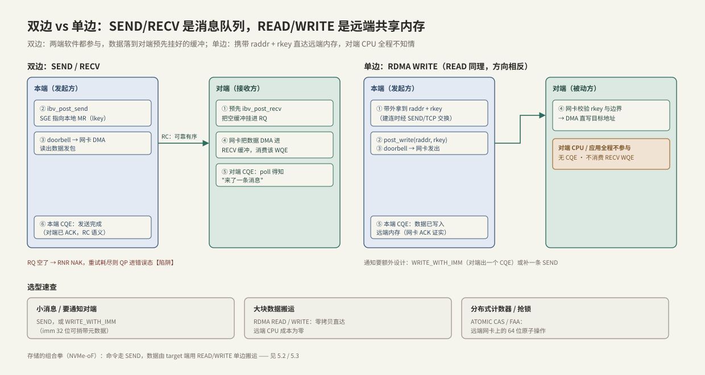

---
tags:
  - 高性能存储/RDMA与RoCE
---
# Send Recv 与 RDMA Read Write

> QP 通了（[[4.3 QP WQE CQ 状态机]]）、内存注册好了（[[4.4 内存注册与零拷贝]]），最后的问题是往 post_send 的 opcode 字段里填什么。这不是 API 细节——**SEND/RECV 与 RDMA READ/WRITE 是两种通信语义：前者是硬件消息队列，数据落在接收方指定的缓冲里，对端软件必须参与；后者把对端内存当成自己的远端地址空间，地址由发起方指定，对端 CPU 全程不知情**。选 opcode 就是设计协议：谁出 CPU、谁出内存、谁负责知道"数据到了"。

前置：[[4.3 QP WQE CQ 状态机]]（WQE/CQE 力学与顺序保证）、[[4.4 内存注册与零拷贝]]（lkey/rkey——两种语义各自的钥匙）。

---

## 1. 全家福：一张表看清五类操作

| opcode | 对端要先 post_recv | 对端出 CQE | 需要 rkey | 数据方向 | 典型用途 |
| --- | --- | --- | --- | --- | --- |
| SEND（可带 IMM） | 是 | 是 | 否 | 本端 → 对端 RQ 挂的 buffer | 命令、RPC 请求、小消息 |
| RDMA WRITE | 否 | 否 | 是 | 本端 → 对端指定地址 | 大块数据推送 |
| RDMA WRITE_WITH_IMM | **是（消耗一个 Recv WQE）** | 是 | 是 | 同上，另带 32 位 imm | 推完数据顺便通知 |
| RDMA READ | 否 | 否 | 是 | 对端指定地址 → 本端 | 大块数据拉取 |
| ATOMIC CAS / FAA | 否 | 否 | 是 | 8 字节读改写 | 远端计数器、抢锁 |

所有差异的根只有一条【事实】：**双边操作的数据落点由接收方决定**（RQ 队头的 Recv WQE 指到哪就写哪），**单边操作的落点由发起方决定**（WQE 里直接携带 raddr + rkey）。前者像进程间的消息队列，后者像把对端内存 mmap 进了自己的地址空间。

---

## 2. 双边 SEND/RECV：硬件消息队列



时序见上图左半。三条硬约束，全部是协议级的【事实】：

1. **RECV 先行**：对端 SEND 到达时 RQ 必须已有 Recv WQE，否则 RNR NAK、重试耗尽连接崩（[[4.3 QP WQE CQ 状态机]] §6）；
2. **消息语义，不是字节流**：一个 SEND 恰好消费一个 Recv WQE，边界天然保留——没有 TCP 的"半条消息"问题；但反过来，**接收 buffer 必须 ≥ 来消息**：装不下不是截断，是两端一起报错（接收方 `LOC_LEN_ERR`、发送方 `REM_INV_REQ_ERR`）、QP 进 ERR。所以消息上限是协议的一部分，要像定 MTU 一样定死；
3. **RC 的"可靠"不包括对端有 buffer**：传输层保证包不丢不乱，不保证 RQ 不空。应用层流控要自己搭——常用**信用（credit）协议**：接收方在回包里捎带"我又挂好了 N 个 buffer"，发送方在途消息数不超过手里的 credit。NVMe-oF 的队列深度协商本质就是它（[[5.3 Host 与 Target]]）。

**小消息优化：inline【取舍】**——`IBV_SEND_INLINE` 让 CPU 把数据直接拷进 WQE，网卡不再按 lkey 发起第二次 DMA 取数：省一次 PCIe 往返、延迟更低，且 post 返回后 buffer 立即可复用（不受在途所有权约束）；上限是 `max_inline_data`（数十到几百字节【量级】，从 QP 创建属性里查）。"零拷贝原教旨"在小消息上不成立——一次 CPU 拷贝反而更快。

---

## 3. 单边 RDMA WRITE：写进对端内存，对端不知道

时序见上图右半。前提是先拿到对端的 raddr + rkey——带外交换，或建连初期用一条 SEND 传过来（[[4.2 Verbs 编程模型]] §4 参数表的最后一行）。

**本端 CQE 的语义【事实】**：signaled WRITE 完成 = 远端网卡已 ACK、数据已置入远端内存。对端不出 CQE、不消耗 Recv WQE、CPU 不参与——这是 [[4.1 RDMA 为什么快]] 里"客户端读数据不耗服务端 CPU"的机制本体。

对端"什么时候来看"就成了设计问题——**通知不是白来的，要自己造**【取舍】：

| 方案 | 机制 | 成本 |
| --- | --- | --- |
| WRITE_WITH_IMM | 消耗对端一个 Recv WQE、出 CQE、捎带 32 位 imm | 对端要维持 RQ 与收割循环 |
| 数据 WRITE + 补一条 SEND | 同 QP 按序：SEND 到达时数据必已置入（4.3 §3 的顺序保证） | 多一条 WQE、多一次消息 |
| 对端轮询 flag 字 | 数据 WRITE 后，再发**单独一条** WRITE 写 flag | 烧对端 CPU；延迟最低 |

> [!warning] 字节落地顺序是厂商行为
> IB 规范只保证**消息级**顺序；单条 WRITE 内部数据按什么顺序落进远端内存没有承诺【实现】。轮询"数据尾字节"判断到达在某些网卡上碰巧能跑，但不可移植——flag 必须放在独立的第二条 WRITE 里。

另一个易错点【事实】：WRITE_WITH_IMM **不是纯单边**——它消耗对端 Recv WQE，RQ 空了照样 RNR。

---

## 4. 单边 RDMA READ：拉取，与它的隐形闸门

READ 是 WRITE 的镜像：请求带着 raddr + rkey 过去，对端**网卡**从本地内存读出数据、流式送回，写进本端 SGE 指向的 buffer；本端 CQE = 数据已在本地可用。对端 CPU 依然零参与。

两条 READ 特有的限制【事实】：

1. **在途 READ 数有硬上限**：requester 端受 `max_qp_rd_atomic`、responder 端受 `max_dest_rd_atomic` 约束（正是 [[4.3 QP WQE CQ 状态机]] §2 参数表里那对字段，典型上限 16【量级】）。超出的 READ 不报错，在 SQ 里排队等窗口——表现为"READ 带宽莫名其妙上不去"，是 perftest 对照实验的常客（[[4.9 ibv_perftest 基准实验]]）；WRITE 没有这道闸门；
2. **READ 是拆开的事务**：后续 WQE 可以在 READ 响应回来前开始执行——依赖 READ 结果的后续操作要加 `IBV_SEND_FENCE`（4.3 §3）。

**方向选型的实践结论**【实践】：大块传输尽量做成"**数据所在端发起 WRITE**"而不是"需求端发起 READ"——WRITE 无在途闸门、单条消息就完成、还能捎 IMM 通知。工程里 READ 更多用在"需求端知道地址、数据端完全被动"的场景（如日志/快照的后台拉取）。

---

## 5. ATOMIC：网卡上的 64 位原子操作

`ATOMIC_CMP_AND_SWP` / `ATOMIC_FETCH_AND_ADD` 对远端一个 8 字节对齐的 64 位字做读-改-写，旧值 DMA 回本端 SGE。用途：分布式计数器、抢锁、无锁队列的尾指针——相当于把 `std::atomic<uint64_t>` 的 RMW 语义搬到了对端网卡上。

**原子性的边界要看清【事实】**：原子性由 responder 网卡保证，其作用域查 `ibv_query_device` 的 `atomic_cap`——`IBV_ATOMIC_HCA` 表示只对**经同一块网卡**的原子操作互斥，与对端 CPU 的 `std::atomic` 操作**不**互斥（网卡的读改写走 PCIe，与 CPU 缓存一致性域的原子性没有联动保证）【实现】。纪律：被网卡原子操作的变量，对端 CPU 只读不写；需要 CPU 与网卡混合原子时，确认设备支持 `IBV_ATOMIC_GLOB`。使用前提：对端 MR 开 `REMOTE_ATOMIC`，且受 §4 同一对 rd_atomic 闸门约束。

---

## 6. 组合拳：真实协议长什么样

单选哪个都不够，工业协议全是混搭【实践】——**控制走双边（小、天然要通知、天然 RPC 形状），数据走单边（大、零打扰）**：

- **NVMe-oF over RDMA**（[[5.2 Transport TCP vs RDMA]]、[[5.3 Host 与 Target]]）：命令与完成走 SEND；读数据由 target 发起 WRITE 推回 host，写数据由 target 发起 READ 从 host 拉——两个方向都是**target 发起单边**，host 网卡全程代劳；
- **贯穿案例（50 GB/s 存储节点）**：GPU 客户端发一条几十字节的读请求（SEND，inline）；存储节点从盘 O_DIRECT 读进预注册池（[[4.4 内存注册与零拷贝]] §6）；WRITE 直达客户端预注册 buffer，尾包用 WRITE_WITH_IMM 通知。数据流两端 CPU 都只处理每 IO 一次的控制消息——客户端侧配合 GPUDirect 还能直落显存（[[8.2 GDS 与 cuFile]]）；
- **选型速查**（对应图中底部三卡）：小消息/要通知 → SEND 或 WRITE_WITH_IMM；大块搬运 → READ/WRITE（优先数据端 WRITE）；分布式计数/锁 → ATOMIC。

---

## 7. Modern C++：一段代码，两种形状

双边与单边在代码上的差异，全部集中在 opcode 与 `wr.wr.rdma` 那几行；收割侧按 `wc.opcode` 分发：

```cpp
#include <arpa/inet.h>
#include <infiniband/verbs.h>

#include <cstdint>
#include <optional>
#include <span>
#include <system_error>

struct RemoteRegion {      // 对端带外送来的 raddr + rkey（4.4）
    std::uint64_t addr;
    std::uint32_t rkey;
};

inline constexpr std::uint32_t kMaxInline = 220;  // 以 QP 实际 max_inline_data 为准

// 双边：发一条消息。小命令走 inline，省一次网卡取数
void post_send_msg(ibv_qp* qp, std::span<const std::byte> msg,
                   std::uint32_t lkey, std::uint64_t wr_id) {
    ibv_sge sge{.addr = reinterpret_cast<std::uintptr_t>(msg.data()),
                .length = static_cast<std::uint32_t>(msg.size()),
                .lkey = lkey};
    ibv_send_wr wr{};
    wr.wr_id      = wr_id;
    wr.opcode     = IBV_WR_SEND;
    wr.sg_list    = &sge;
    wr.num_sge    = 1;
    wr.send_flags = IBV_SEND_SIGNALED |
                    (msg.size() <= kMaxInline ? IBV_SEND_INLINE : 0u);
    ibv_send_wr* bad = nullptr;
    if (int rc = ibv_post_send(qp, &wr, &bad); rc != 0)
        throw std::system_error{rc, std::system_category(), "post_send(SEND)"};
}

// 单边：把本地 buffer 写进远端注册过的内存；带 imm 则对端出一个 CQE
void post_write(ibv_qp* qp, std::span<const std::byte> src, std::uint32_t lkey,
                RemoteRegion dst, std::uint64_t wr_id,
                std::optional<std::uint32_t> imm = std::nullopt) {
    ibv_sge sge{.addr = reinterpret_cast<std::uintptr_t>(src.data()),
                .length = static_cast<std::uint32_t>(src.size()),
                .lkey = lkey};
    ibv_send_wr wr{};
    wr.wr_id  = wr_id;
    wr.opcode = imm ? IBV_WR_RDMA_WRITE_WITH_IMM : IBV_WR_RDMA_WRITE;
    if (imm)
        wr.imm_data = htonl(*imm);   // imm 按网络字节序传输【实现】
    wr.sg_list    = &sge;
    wr.num_sge    = 1;
    wr.send_flags = IBV_SEND_SIGNALED;
    wr.wr.rdma.remote_addr = dst.addr;   // 落点由发起方指定——单边的本质
    wr.wr.rdma.rkey        = dst.rkey;
    ibv_send_wr* bad = nullptr;
    if (int rc = ibv_post_send(qp, &wr, &bad); rc != 0)
        throw std::system_error{rc, std::system_category(), "post_send(WRITE)"};
}

// 收割侧：一个 CQ 里混着几种完成，按 opcode 分发
void on_completion(const ibv_wc& wc) {
    if (wc.status != IBV_WC_SUCCESS) {
        // 进入 4.3 §6 的错误流程：找根因、排水、重建
        return;
    }
    switch (wc.opcode) {
    case IBV_WC_SEND:        break;  // 命令已送达（对端已 ACK）：归还命令 buffer
    case IBV_WC_RDMA_WRITE:  break;  // 数据已置入远端内存：推进发送窗口
    case IBV_WC_RDMA_READ:   break;  // 数据已在本地 buffer：立即可用
    case IBV_WC_RECV:        break;  // 双边消息到达：长度在 wc.byte_len
    case IBV_WC_RECV_RDMA_WITH_IMM:
        // 对端 WRITE_WITH_IMM：数据已就位，ntohl(wc.imm_data) 是捎带的元数据
        break;
    default:                 break;
    }
}
```

---

## 8. 排障清单：症状 → 原因 → 检查

| 症状 | 常见原因 | 检查动作 |
| --- | --- | --- |
| SEND 完成了，对端"没收到" | 对端收到了但没 poll；对端 recv CQ 满进 ERR | 查对端收割循环是否在跑；CQ 容量核对（[[4.3 QP WQE CQ 状态机]] §5） |
| RNR 重试耗尽 | RQ 空——注意 WRITE_WITH_IMM 也消耗 Recv WQE | 灌 RQ 的时机与深度；上 credit 流控（§2） |
| 对端 `LOC_LEN_ERR`、本端 `REM_INV_REQ_ERR` | 消息大于对端 recv buffer | 协议定死消息上限，两端一致 |
| `REM_ACCESS_ERR` | rkey 错/已失效、对端 MR 缺 REMOTE_* flags、raddr/len 越界 | 两端打印 rkey、raddr、len、MR flags 逐项核对（[[4.4 内存注册与零拷贝]]） |
| READ/ATOMIC 一发就错 | 对端 `max_dest_rd_atomic` 为 0；MR 没开对应权限 | 核对 4.3 §2 参数表两端配置与 MR flags |
| READ 带宽远低于 WRITE | 在途 READ 被 `max_qp_rd_atomic` 卡住 | 调大两端 rd_atomic、多 QP 并行；用 [[4.9 ibv_perftest 基准实验]] 的 read/write 对照确认 |
| WRITE 完成但对端"看不见数据" | 没设计通知；或轮询数据尾字节（不可移植） | 换 WRITE_WITH_IMM 或独立 flag WRITE（§3 的表） |
| ATOMIC 结果偶发错乱 | 对端 CPU 同时在写该变量；atomic_cap 只有 HCA 级 | `ibv_query_device` 查 atomic_cap；变量只归网卡改（§5） |
| imm 元数据错位 | 字节序没转换 | 发送 `htonl`、接收 `ntohl`（§7 代码） |

---

## 9. 陷阱与误区

> [!warning] 常见错误
> 1. **把 WRITE_WITH_IMM 当纯单边**：它要消耗对端 Recv WQE——对端 RQ 空照样 RNR，"单边"只单在数据落点上。
> 2. **轮询数据尾字节判断 WRITE 到达**：字节落地顺序是厂商行为不是规范承诺；通知用 IMM 或独立 flag WRITE。
> 3. **READ 之后立刻用其结果发起下一条 WQE 而不加 FENCE**：READ 是拆开的事务，后续 WQE 可能先执行。
> 4. **拿 SEND 当字节流**：消息边界、定长上限是协议的一部分；"大消息拆包重组"要自己在应用层做。
> 5. **忘了应用层流控**：RC 的可靠只覆盖网络传输，不覆盖对端 buffer 供给——credit 不是可选项，是双边协议的一部分。
> 6. **CPU 与网卡混用原子**：`IBV_ATOMIC_HCA` 下二者互不设防；被网卡 ATOMIC 的变量，对端 CPU 只读。

---

## 10. 关键结论

| 结论 | 性质 |
| --- | --- |
| 双边 = 硬件消息队列，落点由接收方定；单边 = 远端内存直达，落点由发起方定 | 事实 |
| 接收 buffer 必须 ≥ 来消息；RC 可靠不含"对端有 buffer"——credit 流控自己搭 | 事实（约束）/ 实践结论 |
| WRITE 本端 CQE = 数据已置入远端内存；对端何时知道要靠 IMM / 补 SEND / flag 三选一 | 事实 / 取舍 |
| WRITE_WITH_IMM 消耗对端 Recv WQE，不是纯单边 | 事实 |
| READ 在途数被 rd_atomic 闸门锁死；大块搬运优先"数据端发起 WRITE" | 事实 / 实践结论 |
| ATOMIC 原子域默认只覆盖同网卡（HCA 级），与对端 CPU 原子不互斥 | 事实（约束） |
| inline 用一次 CPU 拷贝换掉一次 DMA 取数——小消息上"零拷贝"不是最优 | 取舍 |
| 工业协议的形状：控制走 SEND、数据走单边、由数据端/target 发起（NVMe-oF 即此） | 实践结论 |

---

## 关联知识

- [[4.3 QP WQE CQ 状态机]] - 顺序保证与错误模型：本篇协议设计的地基
- [[4.4 内存注册与零拷贝]] - rkey 的来历、权限边界与生命周期
- [[4.2 Verbs 编程模型]] - WR/SGE 结构与 rkey 的带外交换
- [[4.6 RoCE 与 InfiniBand]] - 这些消息在线上的封装形态
- [[4.9 ibv_perftest 基准实验]] - send/read/write 三种模式各自在测什么
- [[4.10 rc_pingpong 最小程序]] - SEND/RECV 的最小可运行版本
- [[5.2 Transport TCP vs RDMA]] / [[5.3 Host 与 Target]] - 组合拳的工业标准版
- [[8.2 GDS 与 cuFile]] - 单边直达 GPU 显存的延伸
