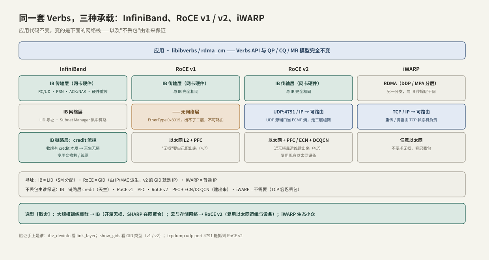
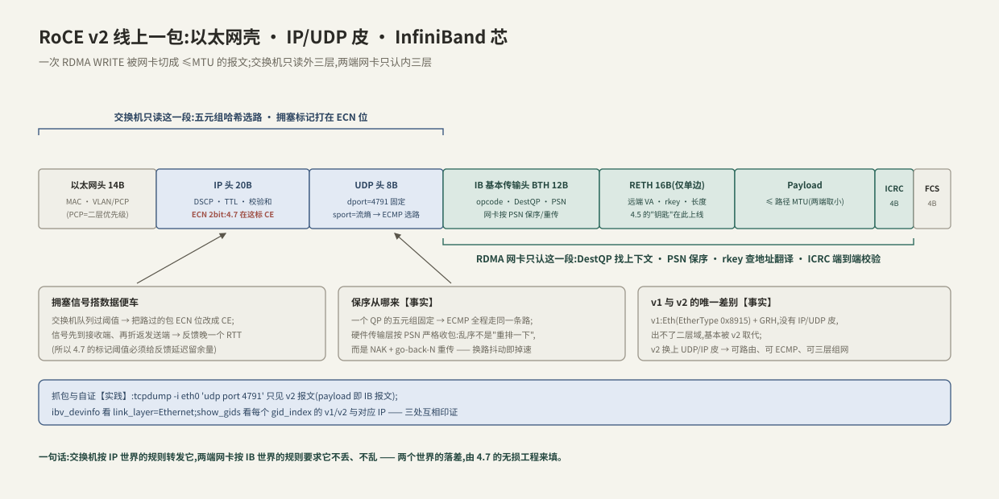

---
tags:
  - 高性能存储/RDMA与RoCE
---
# RoCE 与 InfiniBand

> 4.1–4.5 把网卡教会了 RDMA:QP 建好了、MR 注册了、单边 WRITE 也会发了——但这一切都默认"网卡以下是一张理想的网"。本篇把镜头下移一层,看承载 RDMA 的网络长什么样。结论先行:**RDMA 是网卡里的一套传输层语义;InfiniBand 与 RoCE 是这套语义的两种承载,选承载本质上是在选"不丢包由谁保证"——IB 由链路层机制天生保证,RoCE 要靠运维在以太网上建出来**。贯穿案例的存储集群(原型见 [[7.4 3FS 架构]])选的是 RoCE v2,本篇讲清它为什么赢,以及它欠下的、要在 [[4.7 PFC ECN 与 DCQCN]] 里还的债。

前置:[[4.1 RDMA 为什么快]](三根柱子与"近无损"前提)、[[4.2 Verbs 编程模型]](GID/连接参数首次出现处)、[[4.5 Send Recv 与 RDMA Read Write]](RETH 里装的 rkey 与远端地址)。

---

## 1. 概念:一套语义,三种承载

**【事实】** Verbs 的对象模型(QP/MR/CQ)与传输语义(RC 的保序、可靠、单边操作)定义在 InfiniBand 规范的**传输层**;应用代码不感知下面是什么网——同一份程序,插 IB 卡跑 IB 交换机,插 RoCE 卡跑以太网交换机。真正随承载变化的是四件事:**寻址、路由、流控、"不丢包"的来源**。



| | InfiniBand | RoCE v1 | RoCE v2 | iWARP |
| --- | --- | --- | --- | --- |
| 传输层 | IB 传输层(网卡硬件) | 同 IB | 同 IB | DDP/MPA(另一分支) |
| 网络层 | IB 网络层 | **无**(EtherType 0x8915) | UDP/IP(目的端口 4791) | TCP/IP |
| 寻址 | LID(SM 分配,16 bit) | GID(由 MAC 派生) | GID ≈ IP 地址 | 普通 IP |
| 能否路由 | 子网内 LID 转发 | 否,出不了二层域 | **是**,三层 Clos 随便走 | 是 |
| 不丢包 | 链路层 credit,天生 | PFC 配出来 | PFC + ECN/DCQCN 配出来 | 不需要(TCP 容忍丢包) |
| 生态位 | 训练集群后端网主流 | 基本被 v2 取代 | 存储网络/云主流 | 小众 |

**【实践】** 今天不加限定词说"RoCE",默认指 RoCE v2(也叫 Routable RoCE)。iWARP 知道存在即可:它把 RDMA 架在 TCP 上,不要求无损,但生态与性能生态位都被前两者挤没了。

---

## 2. 边界:为什么"无损"成了 RoCE 的前提

这是本篇最重要的因果链,4.7 整篇都建立在它上面:

1. **硬件传输层的重传很"穷"【实现】**:重传逻辑在网卡里,而网卡上下文内存珍贵——传统 RC 实现不缓存乱序到达的报文,只认"PSN 连续":丢 1 个包 = NAK + **go-back-N**,整个窗口从丢点重发。
2. **代价按带宽平方放大【量级】**:100 Gb/s、RTT 10 μs 的网里,在途数据(BDP)约 125 KB;每丢一个包就重发一整段在途数据,千分之一的丢包率足以把有效吞吐打掉大半——TCP 里"丢包是常规信号",RoCE 里"丢包是事故"。
3. **IB 的答案【事实】**:链路层 credit 流控——接收方先授信,发送方有 credit 才发,缓冲永不溢出,**天生无损**;配套 Subnet Manager(SM)集中算路,整张网是一个被规划的封闭系统。
4. **以太网的答案**:默认"拥塞即丢包"(队列满了 tail-drop),这正是 TCP 的世界观。RoCE 把 IB 芯搬到以太网上,就必须把以太网改造成"几乎不丢"——工具是 PFC/ECN/DCQCN([[4.7 PFC ECN 与 DCQCN]]),**责任从"买对设备"变成"做对运维"【取舍】**。

新一代网卡在改善这件事(选择性重传、更聪明的乱序容忍)【实现】,但"把网建到近无损"仍是当下 RoCE 部署的默认前提——评估任何 RoCE 方案,先问这张网谁来配、谁来盯。

---

## 3. 端到端路径:一个 RDMA WRITE 在 v2 线上的样子

网卡把一条 WQE 切成若干 ≤ 路径 MTU 的报文发出去。看懂一包的解剖,交换机和网卡的分工就清楚了:



三个机制点,都会在后面反复用到:

1. **ECMP 与保序【事实】**:交换机对五元组做哈希选路;一个 QP 的五元组固定(源端口在建链时定下),所以**一条流全程走同一条路径**——这不是巧合,是保序的需要:硬件传输层按 PSN 严格收包,换路导致的乱序不会被"重排一下",而是触发 NAK 与 go-back-N。UDP 源端口的另一个身份是**熵**:不同 QP 散到不同路径,把多打一的流量摊开。
2. **ECN 位在外层 IP 头【事实】**:交换机不需要懂 RDMA,队列超阈值时把路过报文的 ECN 位改成 CE 即可——拥塞信号搭数据的便车到接收端再折返,这是 4.7 里 DCQCN 的输入。
3. **MTU 两套账【实现】**:IB 传输层的 MTU 是枚举值(256/512/1024/2048/4096),受以太网 MTU 约束——1500 的网上 `active_mtu` 常见 1024,上了 9000 巨帧才能用 4096;两端 QP 在 RTR 阶段协商取小,两端配置不一致是 [[4.2 Verbs 编程模型]] 排障表的常客。

---

## 4. 关键数据结构:地址与路径从哪来

两个世界用两套地址体系,对应两种完全不同的"谁来算路":

| | InfiniBand | RoCE v2 |
| --- | --- | --- |
| 地址 | LID,16 bit,**SM 统一分配** | GID,128 bit,**从本机 IP 派生**(IPv4 映射形如 `::ffff:10.0.0.5`) |
| 存放处 | 端口属性 | 每端口一张 **GID 表**,一行一个 `gid_index` |
| 算路者 | Subnet Manager 集中计算转发表下发交换机 | 现成的 IP 世界:BGP/OSPF + ECMP,三层 Clos【实践】 |
| 集中 vs 分布【取舍】 | 全局视野、天生无环;代价是 SM 的规模与故障域 | 复用以太网运维体系;代价是拥塞控制要自己闭环(4.7) |

`gid_index` 是建链参数的一部分(4.2 §4 的交换清单):同一个端口的 GID 表里,v1 GID 与 v2 GID、IPv4 派生与 IPv6 派生同时存在,**选错行,建链成功但不通**。用代码把"选对 v2 GID"固化下来:

```cpp
#include <infiniband/verbs.h>

#include <cstdint>
#include <optional>
#include <system_error>

// 连接参数里的 gid_index 从这来:只挑 RoCE v2 的 GID,而不是"反正用 0"
std::optional<ibv_gid_entry> pick_roce_v2_gid(ibv_context* ctx, uint32_t port) {
    ibv_port_attr pa{};
    if (ibv_query_port(ctx, port, &pa) != 0)
        throw std::system_error{errno, std::system_category(), "query_port"};
    for (uint32_t i = 0; i < pa.gid_tbl_len; ++i) {
        ibv_gid_entry e{};
        if (ibv_query_gid_ex(ctx, port, i, &e, 0) != 0)
            continue;                              // 空槽位,跳过
        if (e.gid_type == IBV_GID_TYPE_ROCE_V2)    // 需要时可再按 IPv4/IPv6 过滤
            return e;
    }
    return std::nullopt;   // 表里只有 v1/IB:先解决网络形态,再谈代码
}
```

命令行的对应物:`show_gids` 列全表(哪行是 v2、对应哪个 IP/网卡),`ibv_devinfo` 看 `link_layer`(Ethernet = RoCE,InfiniBand = IB)——排障时三处互相印证【实践】。

---

## 5. 选型【取舍】:训练网与存储网为什么答案不同

| 维度 | InfiniBand | RoCE v2 |
| --- | --- | --- |
| 无损 | 开箱即得(credit) | 运维建出来(PFC/ECN/DCQCN) |
| 设备与成本 | 专用交换机/线缆,单一供应链 | 复用以太网设备与供应链 |
| 运维技能 | IB 专门技能(SM、OpenSM) | 网络团队现有技能 + 无损专项 |
| 增值能力 | SHARP 在网聚合等【实现】 | 与普通业务流量共网、共工具链 |
| 典型落点 | 大规模训练后端网 | 存储网络、云、NVMe-oF |

**实践结论**:训练集群对集合通信(AllReduce)极端敏感、预算集中,IB 常胜;存储网络流量模式更杂、要和现有以太网体系共存,RoCE v2 是主流答案——本专题后续 [[5.1 NVMe-oF 架构]]、[[5.2 Transport TCP vs RDMA]] 默认在 RoCE v2 上讨论。两者不是对错之分,是"把复杂度买断在设备里"还是"摊销在运维里"的取舍。

---

## 6. 陷阱与误区

> [!warning] 常见错误
> 1. **"RoCE 就是以太网上的 IB 全家桶"**:搬过来的只有传输层;IB 的 credit 流控、SM 集中管理都没跟过来——"无损"要自己还(4.7)。
> 2. **ping 通 ≠ RDMA 通**:ICMP 不走 UDP 4791,也不吃 PFC/ECN 配置;验证连通性用 `ibv_rc_pingpong`/`rping`,抓包认准 4791。
> 3. **v1/v2 与 gid_index 选错**:建链成功但流量不通,或走了不可路由的 v1——用 §4 的代码与 `show_gids` 固化选择,别硬编码 `gid_index=0`。
> 4. **MTU 两端不一致**:RTR 协商取小只在"参数正确交换"时发生;手工交换参数时一端 4096 一端 1024,轻则性能损失,重则不通(4.2 排障表)。
> 5. **跳过无损前提直接上生产**:轻负载一切正常,压力一上来偶发丢包 → go-back-N 大掉速,表现为"莫名其妙的周期性吞吐塌陷"——先按 4.7 建网,再谈上线。

---

## 7. 关键结论

| 结论 | 性质 |
| --- | --- |
| RDMA 是网卡里的传输层语义,IB/RoCE/iWARP 是三种承载;应用代码不感知承载 | 事实 |
| RoCE v2 = IB 传输层芯 + UDP/IP 皮(端口 4791)+ 以太网壳,可路由可 ECMP;v1 无 IP 皮已被取代 | 事实 |
| 硬件传输层 go-back-N:丢包代价按 BDP 放大,所以 RoCE 必须跑在近无损网络上 | 实现 → 因果 |
| IB 的无损来自链路层 credit(天生);RoCE 的无损来自 PFC/ECN/DCQCN(建出来) | 事实 |
| 一个 QP 五元组固定 → 同流同路径,保序靠它;UDP 源端口兼任 ECMP 熵 | 事实 |
| LID 由 SM 集中分配,GID 由 IP 派生;`gid_index` 是建链参数,选错则"建链成功但不通" | 事实/实践 |
| 训练后端网选 IB(买断复杂度),存储网选 RoCE v2(摊销进运维)——取舍不是对错 | 取舍 |

---

## 关联知识

- [[4.1 RDMA 为什么快]] - "近无损网络"作为代价第一次出现的地方
- [[4.2 Verbs 编程模型]] - GID/MTU 是建链交换参数;排障表中网络层问题回流到本篇
- [[4.7 PFC ECN 与 DCQCN]] - 本篇欠的债:把以太网建成近无损,具体怎么做
- [[4.8 soft-RoCE 边界]] - 没有 RoCE 网卡时,软件模拟能验证什么
- [[5.2 Transport TCP vs RDMA]] - NVMe-oF 场景下,RoCE v2 与 TCP 传输的正面对比
- [[7.4 3FS 架构]] - 贯穿案例原型:RoCE v2 存储集群的真实形态
