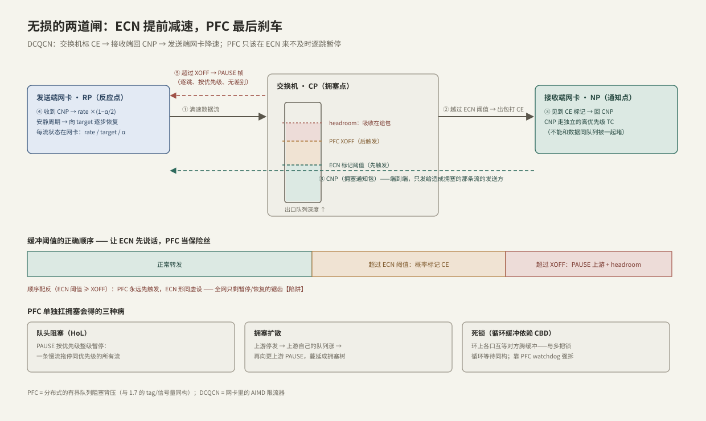
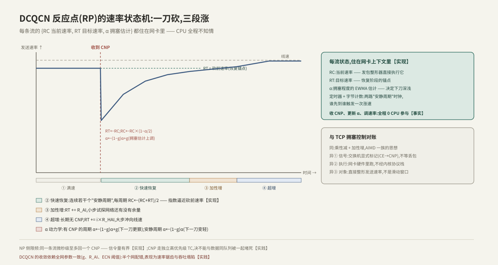

---
tags:
  - 高性能存储
  - RDMA与RoCE
---
# PFC ECN 与 DCQCN

> [[4.6 RoCE 与 InfiniBand]] 欠下的债在这里还:RoCE 要一张"几乎不丢包"的以太网,而这张网不是买来的,是**配出来的**。核心图景只有两道闸:**ECN 端到端提前减速(治因),PFC 逐跳暂停兜底(保命);DCQCN 把 ECN 的标记接到网卡的限速器上,构成闭环**。工程铁律一句话:**让 ECN 先说话,PFC 常年沉默**——PFC 是保险丝,不是主闸。

前置:[[4.6 RoCE 与 InfiniBand]](为什么丢包是事故)、[[4.1 RDMA 为什么快]](传输层在网卡里,所以拥塞控制也得在网卡里)、[[1.7 块层与 blk-mq]](有界队列与背压——本篇是它的分布式版本)。

---

## 1. 问题定义:存储网里拥塞是常态,丢包是事故

两个前提相乘,得出"必须建无损"这个结论:

1. **丢包贵【实现 → 因果】**:4.6 §2 的账——硬件传输层 go-back-N,丢一个包重发整段在途数据;带宽越高,BDP 越大,单次丢包的放大越狠。
2. **拥塞躲不掉【实践】**:存储流量天然**多打一(incast)**——条带读分散在 N 台节点、同时回给一个客户端;EC 重建从 K 台同时拉数据([[7.1 副本 vs EC]])。交换机出口在微秒级被打满是常态,不是异常。

所以问题不是"如何避免拥塞",而是**"如何在必然发生的拥塞里不丢包,同时别把整张网拖死"**。以太网交换机的默认答案(队列满了 tail-drop)在这里被明确禁止,替代方案就是本篇的两道闸。

---

## 2. 全景:两道闸的分工



| | ECN(+DCQCN) | PFC |
| --- | --- | --- |
| 作用范围 | **端到端**:信号最终到达"造成拥塞的那条流"的发送方 | **逐跳**:只暂停上一跳 |
| 粒度 | 按流(每条流独立限速) | 按优先级(一停一整级) |
| 时机 | 提前:队列刚开始涨就减速 | 最后:缓冲快溢出才刹车 |
| 副作用 | 小:只慢了该慢的流 | 大:队头阻塞、拥塞扩散、死锁(§4) |
| 定位【实践】 | **主力**:日常拥塞全靠它消化 | **保险丝**:ECN 来不及时保住"不丢包"底线 |

先记住分工再看机制,否则很容易把 PFC 当成主角——它恰恰是最不该经常出场的那个。

---

## 3. PFC:逐跳的硬背压

**【事实】** PFC(Priority-based Flow Control,IEEE 802.1Qbb)是经典以太网 PAUSE 帧的按优先级版本:链路上的流量分成 8 个优先级(priority),交换机入口为每个优先级单独记账;某优先级的占用越过 **XOFF 水位**,就向上一跳发 PAUSE 帧——"这个优先级,停"。降回 **XON 水位**后放行(滞回防抖)。

三个工程要点:

1. **headroom 是刚需【事实/量级】**:PAUSE 发出后,上一跳"在飞"的数据还会继续到达——线缆传播延迟 × 2 × 带宽 + 若干个 MTU 的量级。XOFF 水位之上必须预留这块 headroom,否则 PAUSE 发了照样溢出丢包;线缆越长、带宽越高,headroom 越大。
2. **流量分级【实践】**:PFC 按优先级整级操作,所以 RoCE 流量必须与普通 TCP 流量隔离在不同的 TC(Traffic Class)——常见做法是 RoCE 数据独占一个 TC 并只对它开 PFC;映射依据二层 PCP 或三层 DSCP(三层组网用 DSCP)【实现】。
3. **心智模型**:PFC 就是分布式的**有界阻塞队列**——和 [[1.7 块层与 blk-mq]] 里 tag 用完就睡、[[3.2 Queue Pair 与 Doorbell]] 里队列满就不再提交是同一个背压思想,只是"阻塞"跨越了机器边界:下游满 → 上游停。

---

## 4. PFC 单独扛拥塞会得的三种病

阻塞式背压跨机器之后,单机里无害的行为全变成网络级故障:

| 病 | 机制 | 单机同构物 |
| --- | --- | --- |
| **队头阻塞(HoL)** | PAUSE 按优先级整级暂停:一条慢流触发的暂停,拖停同优先级的所有流 | 一把大锁保护了不相干的数据 |
| **拥塞扩散** | 上游被停 → 上游自己的队列涨 → 再向更上游 PAUSE——拥塞从一个口蔓延成一棵"拥塞树",受害者与肇事者毫无关系 | 一个慢消费者拖垮整条流水线 |
| **死锁(CBD)** | 环形拓扑/路由绕行时,环上各口互相等对方腾缓冲——**循环等待**,谁也动不了 | 多把锁不按序加锁的经典死锁 |

**【实现】** 交换机与网卡提供 PFC watchdog:检测某队列被 PAUSE 卡死超时,强制丢包解锁——注意它的语义:**用"违反无损"来换"打破死锁"**,watchdog 触发本身就是网络配置有病的告警信号。

**结论(本篇第一定律)**:PFC 保证的是"不丢包",不保证"不拖垮别人";它只能当兜底,日常拥塞必须由更细粒度、更早介入的机制消化——这就是 ECN 与 DCQCN 的职责。

---

## 5. ECN:把拥塞写在包头上,搭数据的便车

**【事实】** ECN(Explicit Congestion Notification,RFC 3168)用 IP 头的 2 个 bit:发送方把包标为 ECT(支持 ECN);交换机出口队列越过阈值时,不丢包,而是把路过报文的 ECN 位改写成 **CE**(Congestion Experienced);接收方看到 CE,负责通知发送方减速。

两个机制细节决定了它好用:

1. **概率标记【实现】**:交换机按 WRED 风格在低阈值 K_min 与高阈值 K_max 之间按队列深度线性升概率标记(到 K_max 全标)——轻微拥塞只有少数流收到信号,避免全网同步降速再同步恢复的振荡。
2. **信号搭便车 → 反馈晚一个 RTT**:CE 标在正路过的数据包上,先到接收端、再折返发送端。**阈值必须给这一个 RTT 的反馈延迟留余量**——这正是"ECN 阈值必须显著低于 PFC XOFF"的原因之一:信号在路上时,队列还在涨。

交换机全程不需要懂 RDMA:它只改 IP 头两个 bit(4.6 封包图里 CE 位于外层 IP 头)。懂 RDMA 的部分在两端网卡——这就是 DCQCN。

---

## 6. DCQCN:把 ECN 信号接到网卡的限速器上

**【事实】** DCQCN(Data Center Quantized Congestion Notification)是 RoCE 上事实标准的拥塞控制,三个角色构成闭环:

- **CP(拥塞点)= 交换机**:越阈值给数据包标 CE(§5);
- **NP(通知点)= 接收端网卡**:看到 CE,给该流的发送方回 **CNP**(Congestion Notification Packet)。限频:同一条流微秒级至多一个【实现】;CNP 必须走**独立的高优先级 TC**——信令绝不能与数据同队列被一起堵死【实践】;
- **RP(反应点)= 发送端网卡**:收到 CNP 就降速,安静了就涨回来。

RP 的速率状态机是理解 DCQCN 的核心——每条流三个变量:RC(当前速率)、RT(目标速率)、α(拥塞程度的 EWMA 估计):



**状态变化串讲**(对照上图):

```text
收到 CNP:RT←RC;RC←RC×(1−α/2);α←(1−g)α+g        —— 一刀砍,α 越大刀越狠
安静周期(定时器/字节计数二选一先到):
  快速恢复:RC←(RC+RT)/2,连续若干周期,指数逼近砍前速率
  加性增:RT += R_AI,小步试探
  超增:长期无 CNP,RT += i×R_HAI,大步冲线速
每个安静周期 α←(1−g)α                             —— 拥塞估计衰减,下一刀变轻
```

与 TCP 拥塞控制对账【类比】:同属 AIMD 思想,但三点不同——**信号是显式标记不是丢包;执行点在网卡硬件不在内核(收 CNP、调速率,CPU 全程不知情);对象是发送速率整形不是滑动窗口**。这与 4.1 "传输层卸载"一脉相承:拥塞控制也是传输层的一部分,自然也在网卡里。

---

## 7. 阈值工程:一条不等式链决定这张网的品格

把 §3–§6 拼起来,交换机每个无损队列上有一条必须成立的不等式链【实践】:

```text
ECN K_min < ECN K_max < PFC XOFF;XOFF + headroom ≤ 该队列可用缓冲
```

- 队列在 K_min 之下:正常转发,谁也不惊动;
- 越过 K_min:开始概率标 CE → CNP → 肇事流降速——**按流、端到端,只慢该慢的**;
- 冲到 XOFF(ECN 来不及,如突发 incast):PAUSE 上游保命,headroom 吸收在途包——**不丢包底线守住**;
- 拥塞缓解:先 XON 放行,再由 DCQCN 三段涨恢复速率。

**配反的灾难**:若 ECN 阈值 ≥ XOFF,PFC 永远先触发,ECN 形同虚设——全网退化成"只有 PFC"的世界,§4 三种病全套上演,表现为周期性的暂停/恢复锯齿与莫名其妙的整级卡顿。这是 RoCE 网络最常见的配置事故【实践】。

两级背压的结构,C++ 工程师其实天天在写——同构代码(教学类比,非网络实现):

```cpp
#include <condition_variable>
#include <cstddef>
#include <mutex>
#include <queue>

// 硬闸 = PFC(满了阻塞上游);软闸 = ECN(过水位只发信号,请上游自己减速)
template <typename T>
class TwoGateQueue {
public:
    TwoGateQueue(std::size_t ecn_mark, std::size_t xoff)
        : ecn_mark_{ecn_mark}, xoff_{xoff} {}   // 前提:ecn_mark < xoff,配反则软闸永远沉默

    bool push(T v) {                            // 返回 true = 本次入队被"标记"
        std::unique_lock lk{mu_};
        not_full_.wait(lk, [&] { return q_.size() < xoff_; });  // PFC:硬闸,阻塞发送方
        q_.push(std::move(v));
        not_empty_.notify_one();
        return q_.size() >= ecn_mark_;          // ECN:软闸,只发信号,由调用方降速
    }

    T pop() {
        std::unique_lock lk{mu_};
        not_empty_.wait(lk, [&] { return !q_.empty(); });
        T v = std::move(q_.front());
        q_.pop();
        not_full_.notify_one();                 // 真 PFC 用 XON<XOFF 滞回防抖,此处从简
        return v;
    }

private:
    std::size_t ecn_mark_;
    std::size_t xoff_;
    std::mutex mu_;
    std::condition_variable not_full_, not_empty_;
    std::queue<T> q_;
};
```

对 `push` 返回的标记置之不理的生产者,最终撞上硬闸、整条流水线停顿——这正是"只配 PFC 不配 ECN"的网络的单机缩影。

---

## 8. 观测与验收:无损网络的"体检单"

无损配置对不对,不能靠"跑起来没报错",要看计数器【实践】:

| 看哪里 | 看什么 | 健康基线 |
| --- | --- | --- |
| 发送端网卡 | CNP 接收计数、速率被限计数(`ethtool -S`,计数器名因厂商而异【实现】) | 压测时 CNP 活跃 = ECN 闭环在工作 |
| 接收端网卡 | ECN/CE 见到计数、CNP 发送计数 | 与发送端对得上 |
| 交换机 | 每口每优先级的 PAUSE 收发计数、ECN 标记计数、watchdog 触发数 | **PAUSE ≈ 0,watchdog = 0** |
| 全网 | 丢包计数(无损 TC 上) | 恒为 0,出现即事故 |

验收口诀:**压测时 CNP 有、PAUSE 无**——ECN 在干活,PFC 在待命。反过来(PAUSE 多、CNP 少)就是阈值配反或 ECN 没开,回 §7 排查。PAUSE 计数的持续增长要当告警处理:那是拥塞树正在生长的声音。

---

## 9. 陷阱与误区

> [!warning] 常见错误
> 1. **只配 PFC 不配 ECN**:轻载正常,重载全网锯齿——PFC 独扛拥塞必得 §4 三种病;PFC 是保险丝,不是主闸。
> 2. **CNP 与数据同一个 TC**:拥塞时信令和数据一起排队/一起被 PAUSE,降速指令永远迟到——闭环断裂,等价于没有拥塞控制。
> 3. **ECN 阈值配得比 XOFF 高**:软闸永远沉默,见 §7"配反的灾难"。
> 4. **半张网配对了**:无损配置是**全路径性质**——路径上任何一台交换机没配 PFC/ECN,链条就在那里断掉;新扩容的交换机没套模板是经典事故源。
> 5. **headroom 按默认值抄**:换了长线缆/高带宽后 headroom 不够,PAUSE 发了照样丢——headroom 与线长、速率成正比,要按物理参数算。
> 6. **拿 TCP 直觉预估行为**:TCP 丢包退化平缓、按窗口收敛;RoCE 丢包是断崖(go-back-N),恢复走 DCQCN 三段涨——两者的故障表现与调参逻辑完全不同。

---

## 10. 关键结论

| 结论 | 性质 |
| --- | --- |
| 存储网拥塞(incast)是常态,RoCE 丢包是事故——目标是"拥塞中不丢包",不是"避免拥塞" | 事实/实践 |
| ECN 端到端、按流、提前减速,是主力;PFC 逐跳、按优先级、最后刹车,是保险丝 | 事实 → 分工 |
| PFC = 跨机器的有界阻塞队列背压;单独使用必得 HoL、拥塞扩散、死锁三种病 | 事实/类比 |
| DCQCN 闭环:交换机标 CE → 接收端网卡回 CNP(限频、独立高优先 TC)→ 发送端网卡按 {RC,RT,α} 状态机砍/涨速率 | 事实 |
| 拥塞控制执行在网卡:信号显式、不经内核、整形速率——是 4.1 "传输层卸载"的延伸 | 事实 |
| 阈值不等式链:ECN K_min < K_max < XOFF,XOFF + headroom ≤ 缓冲;配反 = 全网退化成"只有 PFC" | 实践 |
| 验收口诀:压测时 CNP 有、PAUSE 无;PAUSE 持续增长与 watchdog 触发都是事故告警 | 实践结论 |
| 无损是全路径性质:一台交换机漏配,整条链路破功——运维复杂度是 RoCE 相对 IB 的真实成本 | 取舍 |

---

## 关联知识

- [[4.6 RoCE 与 InfiniBand]] - 为什么 RoCE 必须要这张无损网(go-back-N 的账)
- [[4.1 RDMA 为什么快]] - "网络要近无损"在代价表里的位置
- [[1.7 块层与 blk-mq]] - 有界队列背压的单机版:tag 用完就睡
- [[3.2 Queue Pair 与 Doorbell]] - 同一背压思想在设备队列上的形态
- [[4.9 ibv_perftest 基准实验]] - 压测时对照 §8 的计数器,验证闭环是否工作
- [[5.2 Transport TCP vs RDMA]] - 不想付无损运维成本时,NVMe-oF over TCP 的退路
