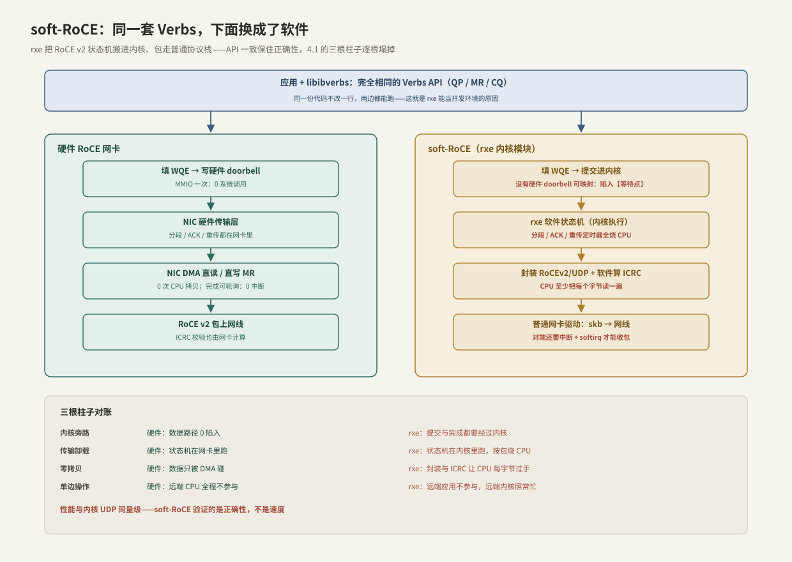

---
tags:
  - 高性能存储/RDMA与RoCE
---
# soft-RoCE 边界

> 贯穿案例里的现实问题:集群在机房,代码却在笔记本和 CI 上写。soft-RoCE(内核模块 rxe)让**没有 RDMA 网卡的机器也能跑完整的 Verbs 程序**——同一套 API、同一套线上报文格式,底下换成软件。一句话立住边界:**它保住的是语义与正确性,交出去的是 [[4.1 RDMA 为什么快]] 的全部三根柱子;它是正确性工具和学习工具,不是性能工具**。用它的全部技巧,就是清楚哪些结论在它上面算数、哪些不算。

前置:[[4.2 Verbs 编程模型]](rxe 跑的正是这套 API)、[[4.6 RoCE 与 InfiniBand]](rxe 实现的是 RoCE v2 线上格式)、[[4.1 RDMA 为什么快]](三根柱子——本篇逐根检查它们塌掉的样子)。

---

## 1. 概念:rxe 是 RDMA 栈里的一个"软件 provider"

**【事实】** Linux 的 RDMA 子系统是分层的:上面是统一的 uverbs 接口与 `libibverbs`,下面是可插拔的 provider(mlx5 等硬件驱动是一类 provider)。**rxe(`rdma_rxe`,Linux 4.8 起进入主线)是纯软件的 provider**:把 RoCE v2 的传输层状态机实现在内核里,报文通过普通网卡、走普通内核网络栈收发。

三个立刻有用的推论:

1. **应用零修改**:`ibv_*` 全套可用,[[4.10 rc_pingpong 最小程序]] 不改一行就能跑;
2. **线上格式是真的 RoCE v2**【实现】:UDP 4791、BTH/ICRC 都按规范封装,所以 rxe 与硬件 RoCE 网卡可以互通——一端笔记本一端真卡也能建链;
3. **同门兄弟**:siw(soft-iWARP,Linux 5.3+)是 iWARP 的软件版,思路相同,本篇结论同样适用。

---

## 2. 端到端路径:同一套 API 下,软硬两条路



对照 4.1 的三根柱子逐根检查(上图底部的对账表):

| 柱子 | 硬件 RoCE | rxe |
| --- | --- | --- |
| 内核旁路 | 填 WQE + 写 doorbell,0 陷入 | **没有硬件 doorbell 可 mmap**:提交与完成都要经过内核 |
| 传输层卸载 | 分段/ACK/重传在网卡里 | 状态机在内核软件里跑,**按包烧 CPU**;ICRC 也由 CPU 计算 |
| 零拷贝 | 数据只被网卡 DMA 碰 | 封装与校验让 **CPU 把每个字节过手**;对端还要中断 + softirq 收包 |
| (单边操作) | 远端 CPU 全程不参与 | 远端**应用**确实不参与,但远端**内核**照常忙——"单边"只剩语义,没剩性能 |

**【量级】** 结论:rxe 的延迟与吞吐和内核网络栈同一量级——这不是它做得差,而是它本来就跑在内核网络栈上。任何用 rxe 测出来的性能数字,都只是"内核协议栈 + 一层封装"的数字。

---

## 3. 边界:什么在 rxe 上算数,什么不算

本篇的核心,建议当检查清单用:

| ✅ 在 rxe 上验证**算数** | ❌ 在 rxe 上验证**不算数** |
| --- | --- |
| Verbs API 用法与资源依赖序([[4.2 Verbs 编程模型]] 的 RAII 封装) | 一切延迟/带宽/IOPS 数字(§2:量级都不对) |
| QP 状态机推进与建链流程:INIT→RTR→RTS、参数交换([[4.3 QP WQE CQ 状态机]]) | MR 注册成本的真实量级(pin + 网卡页表下发,[[4.4 内存注册与零拷贝]]) |
| MR 权限语义:lkey/rkey、越权访问的 WC 错误路径 | 轮询/中断的相位与竞态时序:软件路径的时间分布完全不同 |
| Send/Recv 配对、RNR 行为、消息边界语义([[4.5 Send Recv 与 RDMA Read Write]]) | 设备能力位:`max_inline_data`、atomic 支持、最大 QP/CQE 深度等,与真卡不同【实现】 |
| 单边 READ/WRITE 的语义与完成序 | PFC/ECN/DCQCN 行为:软件路径不产生真实的无损网络信令([[4.7 PFC ECN 与 DCQCN]]) |
| 错误注入与恢复逻辑:rkey 写错、QP 进 ERR 后重建 | doorbell/MMIO 相关的问题(根本没有这条路径) |
| rdma_cm 建链流程、与硬件卡的协议互通 | 大规模连接数下的网卡上下文缓存行为(4.1 §5) |

判断准则一句话:**语义问题(对不对)在 rxe 上算数,资源问题(多快、多抖、多大规模)必须上真卡**([[4.9 ibv_perftest 基准实验]])。

---

## 4. 搭建:五分钟拥有一台"RDMA 网卡"

```bash
# 1) 载入模块,把 rxe 挂到一块普通网卡上
sudo modprobe rdma_rxe
sudo rdma link add rxe0 type rxe netdev eth0

# 2) 现在系统里"多了一台 RDMA 网卡"
rdma link                  # rxe0/1 state ACTIVE ... netdev eth0
ibv_devices                # device: rxe0
ibv_devinfo -d rxe0        # link_layer: Ethernet;传输语义仍是 IB 那套

# 3) 跑通最小闭环(单机 loopback 即可,-g 按 show_gids 选 RoCE v2 的 gid_index)
ibv_rc_pingpong -d rxe0 -g 1 &
ibv_rc_pingpong -d rxe0 -g 1 127.0.0.1
```

要点【实践】:

- **单机就能学**:两个进程走 loopback,4.2 的十步流程、4.3 的状态机、4.10 的 pingpong 全部可亲手跑;
- **锁页限额照样存在**【实现】:rxe 的 MR 注册同样走内核锁页路径,`ulimit -l` 太小照样 `ibv_reg_mr` 失败——4.2 排障表在 rxe 上依然成立;
- **CI 集成**:Linux 虚拟机里 `modprobe` 即得,不需要任何特殊硬件——功能测试矩阵从此可以跑在普通 runner 上。

---

## 5. 工程化:让测试代码自己认清环境

CI 在 rxe 上跑功能、实验室在真卡上跑性能——同一套测试代码要能区分两种环境,原则是**探测而非假设**:

```cpp
#include <infiniband/verbs.h>

#include <cstdint>
#include <string_view>
#include <system_error>

struct DeviceProfile {
    bool software_provider;   // rxe / siw:正确性环境,性能断言全部跳过
    uint32_t max_qp_wr;       // 能力位:查出来的,不是猜出来的
    int max_rd_atomic;
};

DeviceProfile probe(ibv_context* ctx) {
    ibv_device_attr attr{};
    if (ibv_query_device(ctx, &attr) != 0)
        throw std::system_error{errno, std::system_category(), "query_device"};
    std::string_view name{ibv_get_device_name(ctx->device)};
    return DeviceProfile{
        // 命名前缀是约定不是契约【实现】;CI 里再叠加环境变量显式声明更稳
        .software_provider = name.starts_with("rxe") || name.starts_with("siw"),
        .max_qp_wr = static_cast<uint32_t>(attr.max_qp_wr),
        .max_rd_atomic = attr.max_qp_rd_atom,
    };
}

// 用法:队列深度、inline 大小等一律从 profile/attr 推导;
// software_provider == true 时,延迟/带宽断言直接 skip——rxe 的数字不构成回归基线
```

两条纪律【实践】:

1. **能力位驱动**:`max_inline_data` 之类以 QP 创建后**回读**的值为准,不同 provider 差异很大——在 rxe 上"恰好能跑"的硬编码参数,换真卡未必成立(反之亦然);
2. **性能断言分级**:功能断言(完成状态、数据正确性、错误路径)全环境生效;性能断言(p99、带宽下限)只在硬件环境生效,否则 CI 会被 rxe 的软件抖动搞成"狼来了"。

---

## 6. 陷阱与误区

> [!warning] 常见错误
> 1. **拿 rxe 的数字做容量规划或汇报**:那是内核协议栈的数字,与 RDMA 网卡差着数量级——性能结论只能来自真卡([[4.9 ibv_perftest 基准实验]])。
> 2. **"rxe 上全绿 = 生产就绪"**:rxe 验证不了无损网络配置、MTU/GID 组合、网卡能力位、规模化连接——上线前的 4.6/4.7 检查一项不能少。
> 3. **用 rxe 复现性能类 bug**:轮询相位、完成时序、缓存行为全变了,"复现不出来"不等于"没有 bug"。
> 4. **假设能力位**:rxe 与真卡的 `max_inline_data`、atomic 支持不同,硬编码参数两头翻车——一律 `ibv_query_device` / 回读 QP 属性。
> 5. **忘了它也要锁页配额**:容器/CI 里 `memlock` 限额太小,`ibv_reg_mr` 在 rxe 上照样失败,别把环境问题当代码 bug(4.2 排障表)。

---

## 7. 关键结论

| 结论 | 性质 |
| --- | --- |
| rxe 是内核里的软件 RoCE v2 provider(Linux 4.8+):同一套 Verbs API、同一套线上格式,可与硬件卡互通 | 事实 |
| 三根柱子全塌:提交要陷入、状态机烧 CPU、字节被 CPU 过手——性能与内核协议栈同量级 | 事实/量级 |
| 边界准则:语义问题(对不对)在 rxe 上算数;资源问题(多快、多抖、多大规模)必须上真卡 | 实践结论 |
| 单机 loopback 即可学完 4.2/4.3/4.10 的全部流程,零硬件门槛 | 实践 |
| 锁页限额、PD/MR 权限等内核侧约束在 rxe 上真实存在——排障经验可迁移 | 事实 |
| 测试代码用"探测而非假设":能力位回读 + software_provider 分级断言 | 实践结论 |
| rxe 全绿 ≠ 生产就绪:无损网络、能力位、规模化行为它一概验证不了 | 取舍/边界 |

---

## 关联知识

- [[4.1 RDMA 为什么快]] - 三根柱子:本篇逐根检查它们在软件路径上塌掉的样子
- [[4.2 Verbs 编程模型]] - rxe 跑的正是这套 API;排障表大半在 rxe 上依然适用
- [[4.9 ibv_perftest 基准实验]] - 性能结论唯一合法的来源:真卡实测
- [[4.10 rc_pingpong 最小程序]] - 在 rxe 上零硬件跑通的第一个完整程序
- [[4.6 RoCE 与 InfiniBand]] / [[4.7 PFC ECN 与 DCQCN]] - rxe 验证不了的那部分:网络形态与无损工程
