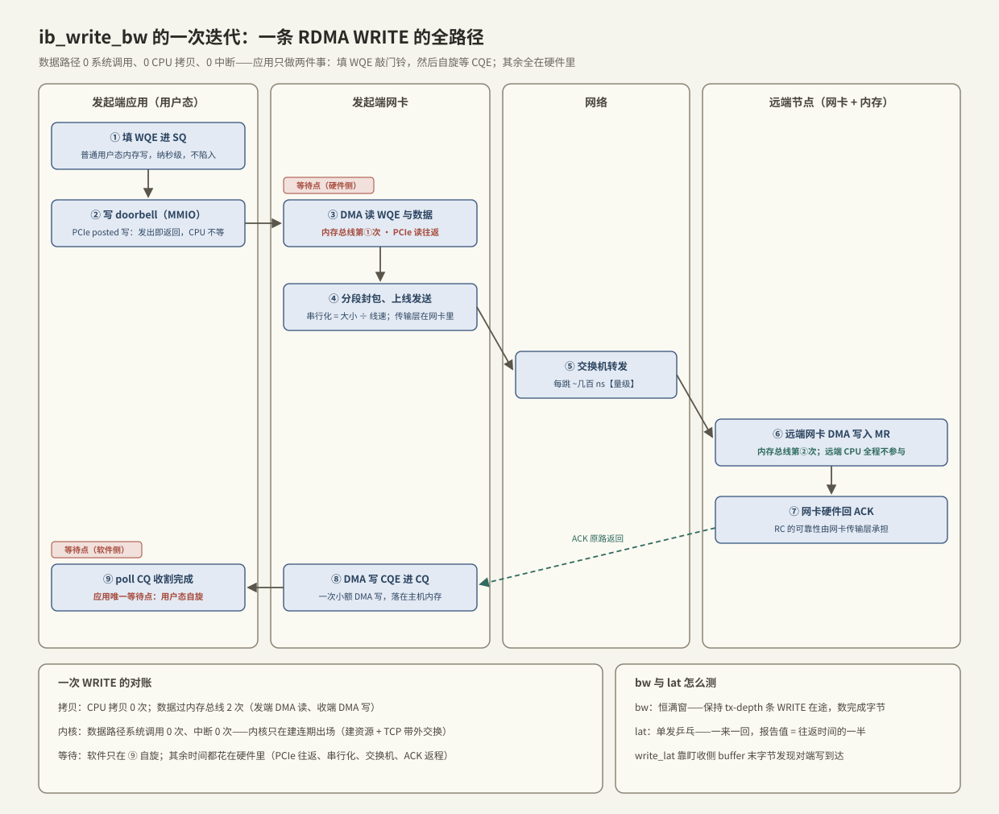

---
tags:
  - 高性能存储
  - RDMA与RoCE
---
# ibv_perftest 基准实验

> [[3.7 nvme-cli 实操]] 量的是盘的地板，本篇量网的地板。[[4.1 RDMA 为什么快]] 留下了两句可检验的断言——小消息写延迟 1–2 μs【量级】、大消息带宽贴网卡线速——perftest 就是把它们放上试验台的仪器。拿到的数字有两个用途：**验收**（这批网卡和这张网配不配得上 50 GB/s 出口）与**地板**（业务延迟减去它，剩下的才是自己软件的账，[[5.4 延迟分解方法论]]）。原则沿用 [[2.6 io_uring 延迟吞吐实验]]：所有示意数字只提供形状，结论必须出自自己的机器。

前置：[[4.1 RDMA 为什么快]]（要验证的断言）、[[4.2 Verbs 编程模型]]（WQE/CQ/doorbell 这些词的出处）、[[4.6 RoCE 与 InfiniBand]]（GID index 为什么重要）。

---

## 1. perftest 是什么：六件套 + 双进程模型

**【事实】** `perftest` 是 RDMA 社区的标准微基准包，核心工具按「操作 × 指标」组成矩阵（名字带 `ib_` 前缀，但 RoCE 网卡照用）：

| | 带宽 | 延迟 |
| --- | --- | --- |
| RDMA WRITE（单边） | `ib_write_bw` | `ib_write_lat` |
| RDMA READ（单边） | `ib_read_bw` | `ib_read_lat` |
| SEND/RECV（双边） | `ib_send_bw` | `ib_send_lat` |

运行模型是固定的双进程：服务端裸起（`ib_write_bw`），客户端指向它（`ib_write_bw <server-ip>`）。两个进程先用一条**普通 TCP 连接**（默认端口 18515）交换 QPN、GID、PSN、rkey 与 buffer 地址——正是 [[4.2 Verbs 编程模型]] §4 的带外交换——然后数据全程走 RDMA，TCP 连接只在最后同步一下结果。

**分工**：perftest 是测量仪器，MR 预注册、恒满窗、计时都替你写好了；想看这台机器从零到跑通的每一行代码，去 [[4.10 rc_pingpong 最小程序]]。

---

## 2. 一次 WRITE 的全路径：先知道自己在测什么

读数之前先画路径——`ib_write_bw` 的每一次迭代，就是下面这条九步链：



逐步把「谁在等、数据动没动」记账【事实】：

| 步骤 | 发生什么 | 等待点 | 数据拷贝 |
| --- | --- | --- | --- |
| ① 填 WQE 进 SQ | 普通用户态内存写 | 无 | 无 |
| ② 写 doorbell | MMIO，PCIe posted 写 | 无——发出即返回，CPU 不等回应 | 无 |
| ③ 网卡 DMA 读 WQE 与数据 | PCIe 读往返 | 硬件侧等待：PCIe 往返 ~百 ns 级【量级】 | 数据过内存总线第 ① 次（DMA 读） |
| ④ 分段封包上线 | 网卡硬件切 MTU、加头 | 串行化 = 消息大小 ÷ 线速 | 无（网卡内部流水） |
| ⑤ 交换机转发 | 查表转发 | 每跳 ~几百 ns【量级】 | 无 |
| ⑥ 远端网卡 DMA 写 MR | 校验、地址翻译、DMA | 硬件侧 | 数据过内存总线第 ② 次（DMA 写）；**远端 CPU 全程不参与** |
| ⑦ 远端网卡回 ACK | RC 传输层在硬件里 | 返程线延 | 无 |
| ⑧ 本端网卡写 CQE | 小额 DMA 写进 CQ | 无 | CQE 一条（几十字节） |
| ⑨ 应用 poll CQ | 用户态自旋读内存 | **软件唯一等待点：自旋** | 无 |

三本账的合计：**CPU 拷贝 0 次；内核在数据路径上 0 次出场（系统调用 0、中断 0）；软件只在 ⑨ 等**。剩下的时间全在硬件里——这正是 perftest 数字干净的原因，也是它只能当地板的原因（§7）。

---

## 3. bw 与 lat 各自怎么测：两种回路，两种口径

**【事实】** 同一条路径，两类工具用不同方式驱动它：

- **带宽（`*_bw`）**：恒满窗——保持 `--tx-depth`（默认 128）条 WQE 在途，完成一条补一条，统计「完成字节 ÷ 时间」。与 [[2.3 iodepth 与提交完成路径]] 的恒满窗是同一个形状：测的是**该并发下的能力上限**，不是单笔延迟；
- **延迟（`*_lat`）**：单发乒乓——任意时刻只有一条消息在途，一来一回反复 `-n` 次。

口径细节决定你能不能正确比较数字【事实】：

| 工具 | 测法 | 报告值的含义 |
| --- | --- | --- |
| `ib_send_lat` / `ib_write_lat` | 乒乓 | **往返时间的一半**（单向延迟） |
| `ib_read_lat` | 连续发 READ | 一次 READ 的完整耗时（天然含整个往返） |
| `ibv_rc_pingpong` 的 usec/iter | 乒乓 | **完整往返**——与上面差 2 倍（[[4.10 rc_pingpong 最小程序]]） |

所以 read_lat ≈ 2 × write_lat 不是 READ 慢，是口径不同 + READ 语义上必须跑完往返才有数据。另一个实现细节【实现】：单边 WRITE 在响应端不产生 CQE，`ib_write_lat` 靠**盯收侧 buffer 的最后一个字节**发现对端写到达——测量本身就在利用「RDMA 对远端 CPU 隐形」这个特性。

计时用 CPU 周期计数器【实现】：换算依赖稳定的 TSC 频率，所以 governor 要定在 `performance`；`-F` 只是压掉降频告警，不解决降频本身。

---

## 4. 实验设计：三个假设、一组命令

沿用 [[2.6 io_uring 延迟吞吐实验]] 的纪律——先写假设再敲命令：

| 假设 | 出处 | 预期观测 |
| --- | --- | --- |
| H1：小消息单向写延迟 ~1–2 μs，且随消息变大按串行化线性增长 | [[4.1 RDMA 为什么快]] §4 | `-a` 扫描下 lat 曲线：小尺寸平坦，大尺寸斜率 = 1/线速 |
| H2：大消息带宽 = 线速 × 协议效率（~95% 上下） | 4.1 §3 | bw 曲线随尺寸爬升后贴住计算值 |
| H3：小消息带宽受**消息速率**限制，与线速无关 | §2 的路径：每条消息一份固定开销 | 小尺寸区 MsgRate 恒定、带宽 = MsgRate × size |

环境准备，每条对应一种「数字畸形」【实践】：

1. **CPU 定频 + 钉核**：`performance` governor；用 `taskset`/`numactl` 把进程钉在**网卡同 NUMA 节点**的核上——跨节点的 buffer 让每次 DMA 多穿一次 UPI（[[3.8 PCIe 拓扑与 NUMA]]）；
2. **选对设备与 GID**：`ibv_devices` 看设备名，`show_gids` 挑 RoCE v2 的 GID index，命令里 `-d mlx5_0 -x <idx>`——GID 选错是「ping 通但 RDMA 不通」的头号原因（[[4.2 Verbs 编程模型]] §7）；
3. **网络前提**：RoCE 要求 PFC/ECN 已配好（[[4.7 PFC ECN 与 DCQCN]]），否则丢包重传会把带宽打出洞；
4. **环境快照**：网卡型号/固件、线速、MTU、交换机拓扑、perftest 版本——没有快照的数字不能比较。

命令组（服务端同命令去掉 IP）：

```bash
# 延迟地板：全尺寸扫描，看平坦区数值与拐点
ib_write_lat  -d mlx5_0 -x 3 -a -F <server-ip>

# 带宽地板：全尺寸扫描，Gbit 口径方便对线速
ib_write_bw   -d mlx5_0 -x 3 -a --report_gbits -F <server-ip>

# 消息速率：小消息 + 多 QP，验证 H3（瓶颈在每消息开销）
ib_write_bw   -d mlx5_0 -x 3 -s 64 -q 4 --report_gbits -F <server-ip>

# 双向带宽：全双工能力，顺带暴露 PCIe 天花板
ib_write_bw   -d mlx5_0 -x 3 -b -a --report_gbits -F <server-ip>

# READ 与 SEND 对照：同尺寸下三种操作的差异
ib_read_bw    -d mlx5_0 -x 3 -a --report_gbits -F <server-ip>
ib_send_bw    -d mlx5_0 -x 3 -a --report_gbits -F <server-ip>
```

常用参数速查：`-s` 消息大小、`-n` 迭代数、`-D <秒>` 按时长跑、`-t` tx-depth、`-q` QP 数、`-R` 改用 rdma_cm 建连、`-p` 改控制端口。

---

## 5. 读数：两条曲线的形状与判据

**延迟曲线（`ib_write_lat -a`）**：小尺寸区一条平线——这就是「固定成本地板」：PCIe 往返 + 网卡处理 + 线延，与消息大小无关；尺寸大到串行化时间可比后，曲线转入线性段，斜率 ≈ 1/线速。输出里的 `t_typical` 看地板，`t_max` 与 99%/99.9% 列（新版 perftest 提供【实现】）看抖动——**RDMA 的卖点之一就是 p99 贴着 t_typical**，若相差数倍，先查降频、迁核与网络（§6）。

**带宽曲线（`ib_write_bw -a`）**：以 100 Gbps 网卡为例的 sanity 算术【量级】——线速 12.5 GB/s，RoCE v2 每个 MTU 包挂 ~80 字节头部，4096 MTU 下协议效率 ~97%，所以合格线在 ~11.5–12 GB/s；小尺寸区带宽低是**正常的**，那里 MsgRate（Mpps 列）才是硬指标，带宽 = MsgRate × size 自然小。

| 症状 | 大概率原因 | 检查 |
| --- | --- | --- |
| 大消息带宽只有一半 | buffer 跨 NUMA、PCIe 链路降级（x8/x4 或降代） | `numactl` 钉本地节点；`lspci -vv` 看 LnkSta（[[3.8 PCIe 拓扑与 NUMA]]） |
| 双向带宽明显低于 2× 单向 | PCIe 双向合计撞天花板 | 算 PCIe 有效带宽 vs 2× 线速【实现】 |
| 延迟平坦区 >5 μs | 走了 soft-RoCE / 降频 / 中断迁移 | `ibv_devinfo` 确认硬件；governor；钉核（[[4.8 soft-RoCE 边界]]） |
| 带宽剧烈波动或远低预期 | RoCE 网络丢包，硬件重传大步回退 | 交换机/网卡 PFC、ECN 计数器（[[4.7 PFC ECN 与 DCQCN]]） |
| 完全连不上 | GID index 错、控制端口 18515 被防火墙拦 | `show_gids`；先 `nc` 验证 18515 可达 |
| 小消息 MsgRate 上不去 | 单 QP/单核发射瓶颈 | `-q` 加 QP、多实例，对照 H3 |

---

## 6. 数字落到案例：把网络地板写进验收单

贯穿案例的存储节点要以 50 GB/s 出网（[[4.1 RDMA 为什么快]] §2），按 [[3.7 nvme-cli 实操]] 的验收思路，网卡侧的清单是：

1. **每张卡**：`ib_write_bw -a` ≥ 线速 × 95%；`ib_write_lat` 平坦区 ≤ 2 μs 且 99.9% 列不失控【实践】；
2. **每对节点**：跨机架路径也要过一遍——延迟多出的部分应当 ≈ 线延与跳数能解释的量，解释不了的去查网络排队；
3. **聚合**：多卡并发同测，确认聚合带宽 ≥ 50 GB/s 且不互相拖累（共享 PCIe/内存带宽的挤占在这一步现形，[[3.8 PCIe 拓扑与 NUMA]]）；
4. 所有数字连同环境快照存档，作为日后回归的基线（方法同 [[9.1 fio Benchmark Matrix]]）。

---

## 7. 陷阱与误区

> [!warning] 常见错误
> 1. **拿 perftest 数字当业务预期**：它测的是「MR 预注册好、buffer 反复复用、专核自旋」的理想态；业务还要付 MR 管理、CQ 轮询策略、冷 buffer 缓存未命中与盘路径耦合的账——perftest 是**地板**，不是承诺（[[4.1 RDMA 为什么快]] §7）。
> 2. **soft-RoCE 上跑基准**：rxe 的数字与硬件 RDMA 没有可比性，只配验证程序正确性（[[4.8 soft-RoCE 边界]]）。
> 3. **忘了 `-x` 选 GID**：默认 index 可能落在 RoCE v1 或错误 VLAN 上——现象是建连成功但不通或性能怪异（[[4.6 RoCE 与 InfiniBand]]）。
> 4. **小消息带宽低就怪网卡**：小尺寸区的瓶颈是每消息固定开销（H3），看 MsgRate 而不是 BW 列。
> 5. **混淆延迟口径**：perftest 报单向（往返/2），pingpong 报整个往返，业务日志常是「提交到完成」——对比前先统一口径。
> 6. **单次运行下结论**：不同尺寸、不同时段各跑三次取中位数；波动本身就是信号（网络或降频）。

---

## 8. 关键结论

| 结论 | 性质 |
| --- | --- |
| perftest = 操作(write/read/send) × 指标(bw/lat) 矩阵；TCP 带外建连、数据全走 RDMA | 事实 |
| 一次 WRITE：CPU 拷贝 0、内核出场 0、软件唯一等待点是自旋 poll CQ；数据过内存总线仅 2 次 DMA | 事实 |
| bw 用恒满窗测能力上限，lat 用单发乒乓测单笔；write/send_lat 报往返一半，read_lat 天然含整个往返 | 事实 |
| 延迟曲线 = 固定成本平坦区 + 串行化线性段；带宽曲线小尺寸看 MsgRate、大尺寸对线速 × ~95% | 事实 / 量级 |
| 跨 NUMA buffer、PCIe 降级、GID 选错、网络丢包是四大「数字畸形」来源 | 实践结论 |
| 验收三级：单卡 ≥ 95% 线速、跨机架可解释、聚合 ≥ 出口目标；数字连环境快照归档为基线 | 实践结论 |
| perftest 是地板不是预期：业务延迟 − 地板 = 自己软件的账 | 实践结论 |

---

## 关联知识

- [[4.1 RDMA 为什么快]] - 本篇要验证的两句断言的出处
- [[4.2 Verbs 编程模型]] - WQE/CQ/doorbell 与带外交换的机制
- [[4.10 rc_pingpong 最小程序]] - 从仪器换成自己的代码：每一行怎么写
- [[4.6 RoCE 与 InfiniBand]] / [[4.7 PFC ECN 与 DCQCN]] - GID 与无损网络：两个最常见的翻车点
- [[4.8 soft-RoCE 边界]] - 什么数字不能信
- [[3.7 nvme-cli 实操]] - 同一套验收方法论的盘侧版本
- [[3.8 PCIe 拓扑与 NUMA]] - 跨 NUMA 与 PCIe 降级如何吃掉带宽
- [[2.6 io_uring 延迟吞吐实验]] - 实验纪律与恒满窗的首次出场
- [[5.4 延迟分解方法论]] - 地板数字在延迟分解里的位置
