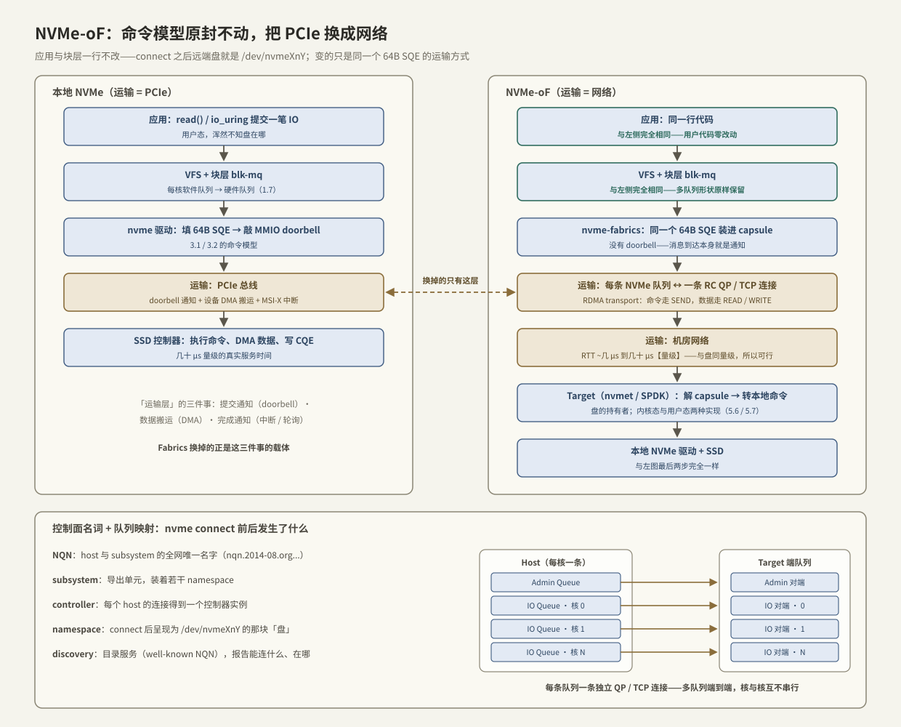
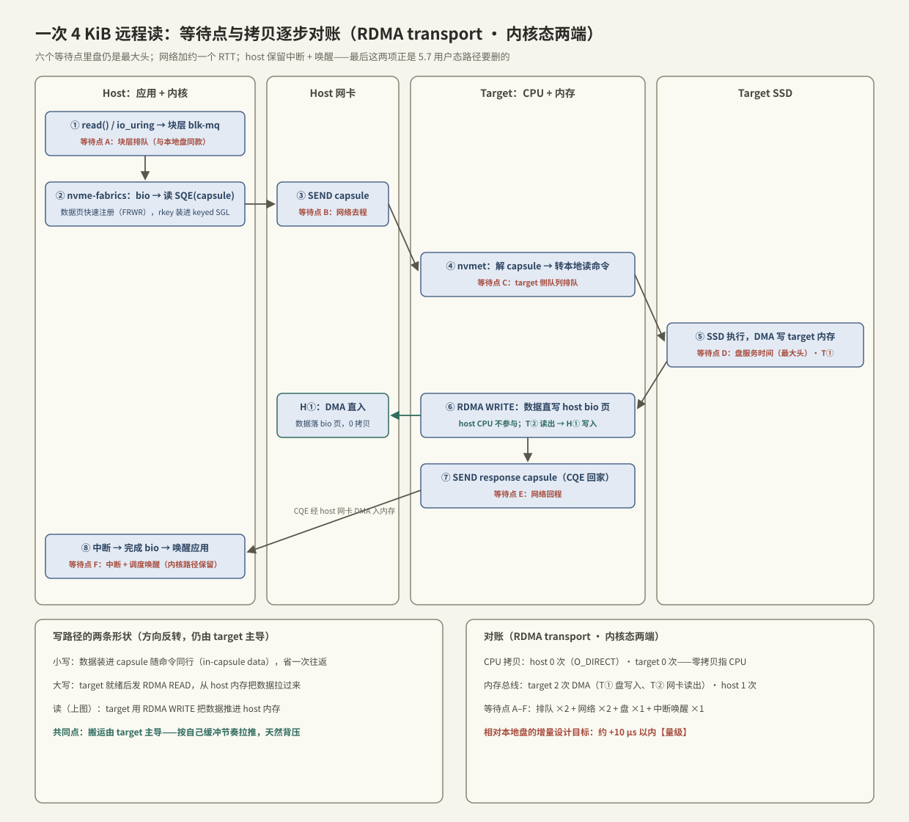

# NVMe-oF 架构

> 贯穿案例走到一个新问题：存储节点上 16 块盘、112 GB/s 的供给能力（[[3.7 nvme-cli 实操]]），只有插着盘的这台机器用得到——GPU 节点想读，必须有人把「盘」搬过网络。第 3 章给了 NVMe 的命令模型，第 4 章给了绕过内核的网络，NVMe-oF（NVMe over Fabrics）把两者拼起来，答案短得出奇：**命令模型一个字节不改，只把「运输层」从 PCIe 换成网络**。本篇讲这次替换的架构：换掉了什么、留下了什么，以及一次远程读写在应用、内核、网卡、盘之间的完整流转——每一步的等待点与拷贝。

前置：[[3.1 NVMe 命令模型]]（SQE/CQE 与多队列）、[[3.3 Admin Queue 与 IO Queue]]（控制面/数据面分工）、[[4.1 RDMA 为什么快]]（网络侧的三根柱子）、[[1.7 块层与 blk-mq]]（host 侧那半段路的地图）。

---

## 1. 为什么把盘搬出去：三笔账 + 一个前提

本地盘的问题不在性能，在**资源错配**【实践】：

1. **孤岛账**：算力节点的盘常年用不满，存储节点的 CPU 常年闲着——盘和算力被机箱焊死在一起，谁也匀不出去；
2. **扩展账**：训练数据涨了要加盘，结果被迫连 CPU、内存、GPU 一起买；存算无法独立扩容；
3. **运维账**：盘坏了、数据要迁移，都和「哪台主机」绑定，调度器无从插手。

解法是**存算分离（disaggregation）**：盘集中到存储节点，算力节点按需挂载。而它可行的前提是一条量级事实【量级】（[[00. 总纲]] 的坐标系）：**机房网络 RTT（几 μs 到几十 μs）与 NVMe 随机读延迟（几十 μs）同量级**——把盘放到网络另一端，延迟才只多百分之几十，而不是多一个数量级。HDD 时代 iSCSI 能凑合，正是因为毫秒级寻道把网络开销淹没了；NVMe 把盘做快之后，旧的网络存储栈反而成了瓶颈：

**iSCSI 的教训**【事实】：SCSI 命令集要经过翻译层、会话本质上单队列、内核 SCSI 中间层锁竞争——NVMe 端到端的多队列并行（[[3.2 Queue Pair 与 Doorbell]]）在半路被挤成单行道。NVMe-oF 的设计目标就是不重蹈覆辙：**让 NVMe 的语义与并行度原样穿过网络**，相对本地盘的延迟增量控制在 ~10 μs 以内【量级/设计目标】。

---

## 2. 一句话架构：换运输层，不换命令模型



角色只有两个【事实】：**Host**（发起 IO 的一端，跑 `nvme-fabrics` 主机驱动）与 **Target**（持有盘的一端，跑内核 `nvmet` 或用户态 SPDK，[[5.6 SPDK 用户态驱动]]）。替换的内容用「运输层三件事」概括最清楚：

| 运输层职责 | 本地 NVMe（PCIe） | NVMe-oF（Fabric） |
| --- | --- | --- |
| 提交通知 | MMIO doorbell（[[3.2 Queue Pair 与 Doorbell]]） | **没有 doorbell**——命令封成 capsule 发出去，消息到达即通知 |
| 数据搬运 | SSD 控制器 DMA | transport 负责：RDMA READ/WRITE 或 TCP 字节流 |
| 完成通知 | 中断 / 轮询 | response capsule（CQE）到达 |

**capsule** 是唯一的新名词【事实】：command capsule = 64 字节 SQE + 可选的内联数据；response capsule = 16 字节 CQE。命令还是 [[3.1 NVMe 命令模型]] 里那条命令，只是运输从「设备来内存取」变成「打包寄过去」。

对上层的效果【事实】：`nvme connect` 之后 host 上出现 `/dev/nvmeXnY`，块层、文件系统、应用**零改动**——第 2 章写的 io_uring 恒满窗程序（[[2.6 io_uring 延迟吞吐实验]]）指向这个设备原样能跑，只是测出来的数字变了（怎么拆这个差值是 [[5.4 延迟分解方法论]] 的主题）。

transport 有三种：RDMA（IB/RoCE）、TCP、FC。本章主线用 RDMA 讲机制，TCP 的对照专门放在 [[5.2 Transport TCP vs RDMA]]。

---

## 3. 控制面：五个名词与三条命令

连接之前，先认识目录结构【事实】：

| 名词 | 是什么 |
| --- | --- |
| **NQN** | NVMe Qualified Name——host 与 subsystem 的全网唯一名字（`nqn.2014-08.org.nvmexpress:...`；host 侧存在 `/etc/nvme/hostnqn`） |
| **subsystem** | Target 上的导出单元，权限（哪些 host NQN 允许连）挂在它身上 |
| **controller** | 每个 host 的每次连接得到一个控制器实例——「一 host 一 controller」是动态创建的 |
| **namespace** | subsystem 里的卷，connect 后就是 host 看到的 `/dev/nvmeXnY` |
| **discovery** | 目录服务：一个 well-known NQN 的特殊 subsystem，回答「这里能连什么、地址在哪」 |

host 侧的完整生命周期只有三条命令（RDMA transport，默认端口 4420【实现】）：

```bash
modprobe nvme-rdma

# 问目录：这个 target 上导出了哪些 subsystem
nvme discover -t rdma -a 192.168.1.10 -s 4420

# 连接：内核建好队列，盘出现在本地
nvme connect  -t rdma -a 192.168.1.10 -s 4420 -n nqn.2026-07.io.lab:jbof16
nvme list                        # /dev/nvme1n1 —— 用起来与本地盘无异

nvme disconnect -n nqn.2026-07.io.lab:jbof16
```

**队列映射**是架构里最要紧的一条【事实】：connect 时 host 建一条 Admin 队列 + 每 CPU 核一条 IO 队列，**每条 NVMe 队列独占一条 transport 通道**——RDMA 下是一条 RC QP（[[4.2 Verbs 编程模型]]），TCP 下是一条 TCP 连接。于是 [[1.7 块层与 blk-mq]] 的「每核一队列、无锁直达」形状端到端保留：核与核的 IO 从 blk-mq 到网络到 target 全程不串行化。流控也顺着队列走：response capsule 里回带 SQ 头指针，host 据此知道队列还能塞几条【实现】。

---

## 4. 一次远程读的全路径：等待点与拷贝逐步对账

核心一节。以「host 上 O_DIRECT 随机读 4 KiB，RDMA transport，两端都是内核态」为例：



八步流转，六个等待点【事实】：

| 步骤 | 发生什么 | 等待点 | 拷贝/DMA |
| --- | --- | --- | --- |
| ① 应用 read()/io_uring → blk-mq | 与本地盘完全同一段路（[[1.8 一次 read write 全路径图]]） | **A：块层排队** | 无 |
| ② nvme-fabrics 造 capsule | bio → 64B 读 SQE；数据页**现场快速注册**（FRWR），rkey+地址作为 keyed SGL 放进 SQE【实现】 | 无（μs 内） | 无 |
| ③ RDMA SEND capsule | 命令上网 | **B：网络去程 ~μs** | capsule 一条（64B 级） |
| ④ target 收 capsule | nvmet 解析 → 转成对本地盘的读命令 → 本地 doorbell | **C：target 侧队列** | 无 |
| ⑤ 本地 SSD 执行 | 第 3 章的整套：SQ → 盘 → DMA 写 target 内存 | **D：盘服务时间，几十 μs——最大头** | T①：盘 DMA 写入 target 内存 |
| ⑥ target 发 RDMA WRITE | 用 ② 给的 rkey，把数据**直写 host 的 bio 页**——host CPU 不参与（[[4.5 Send Recv 与 RDMA Read Write]]） | 数据串行化 | T②：网卡 DMA 读出；H①：host 侧 DMA 写入 |
| ⑦ 紧跟 response capsule | CQE 回家 | **E：网络回程** | capsule 一条 |
| ⑧ host 完成 | 网卡中断 → nvme-rdma 收 CQE、去注册 MR → blk-mq 完成 bio → 唤醒应用 | **F：中断 + 调度唤醒** | 无 |

三个读账要点：

1. **盘还是大头**：D 占几十 μs，网络 B+E 合计约一个 RTT（几 μs）——这就是「增量 ~10 μs 内」的由来；也因此**远端盘的性能分析先看 target 的盘，再怀疑网络**【实践】；
2. **零拷贝是 CPU 零拷贝**：host 与 target 的 CPU 都没搬过数据字节，但内存总线该走还得走（T①T②H① 三次 DMA）——与 [[4.1 RDMA 为什么快]] §2 的内存账同一口径。若 host 用 buffered 读，页缓存→用户 buffer 那次拷贝是 [[1.3 Buffered IO 与 O_DIRECT]] 的账，不算在 fabrics 头上；
3. **内核路径保留了 A 与 F**：块层排队、中断、调度唤醒——本地盘有的固定成本一个没少。SPDK 的用户态路径删的就是这两处（[[5.7 内核态 vs 用户态路径]]），这是第 5 章后半的主线。

---

## 5. 写路径：方向反转，仍由 target 主导

写与读的差别只在数据搬运的方向与时机【事实】：

- **小写**：数据直接塞进 command capsule 与 SQE 同行（**in-capsule data**），一个单程送达，省掉一次数据往返；上限由 target 声明（内核实现常见 4 KiB 级【实现】）——代价是 target 要为每条连接预留接收缓冲【取舍】；
- **大写**：capsule 只带 keyed SGL；target 准备好缓冲后**主动发 RDMA READ**，从 host 内存把数据拉过来，落盘后回 response。

两条路都是 **target 主导数据搬运**——host 从不直接推大块数据。这个设计点值得记住【事实/设计】：target 最清楚自己的缓冲与盘的节奏，由它决定何时拉数据，拥塞时推迟 READ 即可，**背压是架构自带的**，不需要额外的流控协议。

---

## 6. 故障模型：语义一样，脾气不一样

「与本地盘无异」只对数据路径成立；故障路径是另一回事【实践】：

| | 本地盘 | NVMe-oF 远端盘 |
| --- | --- | --- |
| 坏的方式 | 盘死 → 快速 EIO | 网络分区/target 宕 → **IO 挂起等重连** |
| 超时语义 | 驱动超时，边界清晰 | `ctrl_loss_tmo` 内反复重连，超了才放弃【实现】 |
| 上层感受 | 立刻知道坏了 | 可能 hang 几十秒——应用与编排层必须有超时预算 |

keep-alive 心跳负责发现对端消失；一条路径断了怎么切到另一条，是 [[5.5 Multipath 与故障切换]] 的主题。**部署侧军规**【实践】：NVMe-oF 导出的是**块设备**，不是共享文件系统——两台 host 同时挂同一个 namespace 各写各的，文件系统直接损坏；要共享，上层必须是集群文件系统或分布式系统自己分片（AI 存储怎么组织这件事见 [[7.6 AI 存储 vs 传统 NAS]]）。

---

## 7. 陷阱与误区

> [!warning] 常见错误
> 1. **把 NVMe-oF 当 NAS**：它是「网络上的块设备」，无共享语义；多 host 同挂裸 namespace = 文件系统损坏。
> 2. **性能锅先甩网络**：一次远程读里盘占大头（等待点 D）；先用 [[5.4 延迟分解方法论]] 把增量拆到层，再下结论。
> 3. **忽略故障模型差异**：本地盘死得干脆，远端盘会 hang——不设 IO 超时预算的应用在网络抖动时整体卡死。
> 4. **以为 TCP transport 是免费替身**：TCP 把第 4 章省掉的拷贝、中断、协议处理又请了回来，延迟与 CPU 账完全不同（[[5.2 Transport TCP vs RDMA]]）。
> 5. **p99 只盯盘**：上了网络之后，拥塞、PFC 风暴、incast 都成了新的尾延迟来源（[[4.7 PFC ECN 与 DCQCN]]）——观测面要把网络计数器加进来。
> 6. **裸奔导出**：subsystem 不限 `allow_hosts`，等于全网可写你的盘。

---

## 8. 关键结论

| 结论 | 性质 |
| --- | --- |
| NVMe-oF = NVMe 命令模型（SQE/CQE/多队列）原样保留，运输层由 PCIe 换成 Fabric；capsule 是 SQE/CQE 的网络包装 | 事实 |
| 可行前提：机房 RTT 与 NVMe 延迟同量级；设计目标：相对本地增量 ~10 μs 内 | 量级 |
| 没有 doorbell：消息到达即通知；流控靠 response capsule 回带队列头指针 | 事实 |
| 每条 NVMe 队列独占一条 QP/TCP 连接——blk-mq 的每核并行端到端保留，这是对 iSCSI 单队列的直接纠偏 | 事实 |
| 远程读八步：盘（D）仍是最大等待点，网络加约一个 RTT（B+E）；host 保留块层排队与中断唤醒（A、F） | 事实 |
| 零拷贝 = CPU 零拷贝：两端 CPU 不碰数据，但内存总线过 3 次 DMA（T①T②H①） | 事实 |
| 数据搬运始终由 target 主导（读 WRITE 推、写 READ 拉）——背压内建于架构 | 事实/设计 |
| 语义像本地盘、故障不像：hang-重连-超时的脾气必须进应用的超时预算 | 实践结论 |
| A 与 F 两个内核等待点是 SPDK 用户态路径的删除对象——第 5 章后半的主线 | 取舍/伏笔 |

---

## 关联知识

- [[3.1 NVMe 命令模型]] / [[3.2 Queue Pair 与 Doorbell]] / [[3.3 Admin Queue 与 IO Queue]] - 被原样搬上网络的那套命令模型
- [[4.1 RDMA 为什么快]] / [[4.5 Send Recv 与 RDMA Read Write]] - 运输层的机制：capsule 走 SEND，数据走单边操作
- [[1.7 块层与 blk-mq]] / [[1.8 一次 read write 全路径图]] - host 侧那半段路
- [[5.2 Transport TCP vs RDMA]] - 两种运输的正面对比
- [[5.4 延迟分解方法论]] - 把「远程比本地慢多少」拆到层
- [[5.5 Multipath 与故障切换]] - 路径断了之后的故事
- [[5.6 SPDK 用户态驱动]] / [[5.7 内核态 vs 用户态路径]] - 删掉等待点 A 与 F 的方案
- [[7.6 AI 存储 vs 传统 NAS]] - 块设备之上如何组织共享
