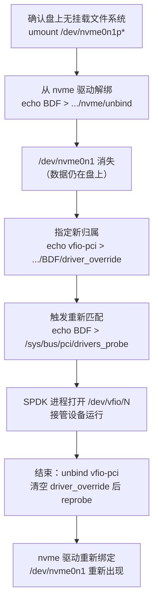

---
tags:
  - 高性能存储
status: 已完成
---

# VFIO/UIO 与设备绑定

> [[5.9 SPDK 环境与 HugePage]] 准备好了内存这一半：大页、pinned、物理连续。本篇解决另一半——**设备**。SPDK 是用户态驱动，它要直接读写 NVMe 盘的寄存器、让盘直接 DMA 进自己的缓冲区；但开机后设备默认被内核 `nvme` 驱动持有，`/dev/nvme0n1` 就是内核在"营业"的证据。一个设备同一时刻只能有一个驱动，所以第一步是**所有权转移**：把设备从内核驱动手里解绑（unbind），交给一个"什么都不干、只负责放行"的直通驱动（vfio-pci 或 uio）。对 C++ 工程师来说这个动作似曾相识——**独占资源的 `std::move`**：转移句柄，不复制资源，原持有者失效。

前置：[[0.3 DMA IOMMU 与 Pinned Memory]]（DMA 与 IOMMU 是什么）、[[0.4 PCIe BAR MMIO 与 MSI-X]]（BAR 与 MMIO 是什么）、[[5.9 SPDK 环境与 HugePage]]（大页与 pinned 内存）。

---

## 1. 背景：设备"属于"谁，由谁说了算

先把名词说直白：

- **PCIe 设备**：插在 PCIe 总线上的硬件，NVMe SSD 是其中一种。每个设备有一个总线地址（BDF，形如 `0000:01:00.0`）和一对 ID（厂商 ID + 设备 ID）。
- **驱动绑定（bind）**【事实】：内核枚举 PCIe 设备时，拿设备的 ID 去匹配各驱动登记的"我认识哪些 ID"列表，匹配上就把设备**交给这个驱动独占管理**。NVMe 盘默认匹配到内核 `nvme` 驱动，于是有了 `/dev/nvme0n1`、有了文件系统、有了整条内核 IO 栈（[[5.7 内核态 vs 用户态路径]]）。
- **解绑（unbind）**：通过 sysfs 告诉内核"这个驱动别管这个设备了"。解绑后 `/dev/nvme0n1` 消失——注意只是**内核不再认识它**，盘上数据一个字节都没动。

SPDK 想接管设备，数据路径上需要三样东西：

1. **摸到寄存器**：把设备的 BAR（寄存器窗口）`mmap` 进自己的地址空间，写门铃 = 一次普通内存写（[[0.4 PCIe BAR MMIO 与 MSI-X]]）；
2. **让设备 DMA 自己的内存**：盘主动读写 SPDK 的大页缓冲区，不经过内核拷贝；
3. **独占**：不能有内核驱动同时在操作同一批队列——两个"驱动"各写各的门铃，设备状态立刻错乱。

第 3 条决定了必须先解绑。第 1、2 条决定了需要一个**中间人**：内核不能凭空允许普通进程 `mmap` 任意物理地址、更不能允许设备随便 DMA——这个中间人就是 uio / vfio 这类"直通驱动"，它们绑定设备后什么业务都不做，只提供一套受控接口把设备暴露给用户态。

---

## 2. 关键前提：DMA 为什么危险，IOMMU 为什么是答案

普通进程越界访问会被 MMU 拦下（段错误），因为 CPU 的每次访存都经过页表翻译。但 **DMA 是设备发起的访存，绕过 CPU 的 MMU**【事实】。给设备下发命令时要填"数据写到哪个地址"——如果这个地址填错了，或者程序有 bug：

> 没有保护的场景：用户态驱动把一个算错的物理地址填进 NVMe 读命令，盘老老实实把 4KB 数据 DMA 过去——目标可能是内核代码段、其他进程的页、页表本身。没有段错误，没有 panic 现场，只有稍后莫名其妙的崩溃。

**IOMMU** 就是给设备配的 MMU【事实】：设备发出的地址不再是物理地址，而是 **IOVA**（IO 虚拟地址），由 IOMMU 按每设备的页表翻译成物理地址；未映射的 IOVA → DMA 被硬件拦截并报错。与进程虚拟内存完全同构：

| 进程侧 | 设备侧 |
| --- | --- |
| 虚拟地址 → MMU → 物理地址 | IOVA → IOMMU → 物理地址 |
| 页表由内核维护 | IOMMU 页表由内核（经 vfio）维护 |
| 越界 → SIGSEGV | 越界 → DMA 被拦 + 错误上报 |
| TLB 缓存翻译 | IOTLB 缓存翻译 |

这层保护是 uio 与 vfio 的分水岭。

---

## 3. UIO：第一代方案，"裸指针"

**uio_pci_generic**（Userspace IO）是老一代通用直通驱动【事实】：

- 提供 `/dev/uioN` 与 sysfs 下的 `resource` 文件，用户进程 `mmap` 它们拿到 BAR；
- 中断退化成"对 `/dev/uioN` 做阻塞 `read()`，返回中断计数"——且只支持老式 INTx，不支持 MSI-X（SPDK 全轮询模式下影响不大，但这关掉了中断模式的可能性）；
- **完全没有 DMA 保护**：设备照旧用物理地址 DMA。用户态要自己把虚拟地址翻译成物理地址（读 `/proc/self/pagemap`，配合大页保证物理连续，见 [[5.9 SPDK 环境与 HugePage]]），且必须 root。

**【类比，非等同】** UIO 就是 `void*` 加手工 `reinterpret_cast`：能用、快，但任何一步算错地址，后果是整机级的静默内存损坏。它存在的理由只剩一个：机器没有 IOMMU（老硬件、部分虚拟机）。

---

## 4. VFIO：第二代方案，"带边界检查的句柄"

**vfio-pci** 是现行标准【事实】，设计围绕 IOMMU 展开，三层对象：

- **container**（`/dev/vfio/vfio`）：一个 IOMMU 上下文，即一套 IOVA→物理页表；
- **group**（`/dev/vfio/<N>`）：**硬件能保证互相隔离的最小设备集合**。粒度由 PCIe 拓扑和 ACS（Access Control Services）能力决定——如果桥下几个设备之间的点对点流量不经过 IOMMU，它们就只能整组一起交出，不能只交一个【事实】；
- **device**：组内单个设备，从 group fd 换取 device fd，进而查询/`mmap` 各 BAR、配置中断。

用户态初始化的典型 ioctl 序列【实现】：

1. 打开 container、group，`VFIO_GROUP_SET_CONTAINER` 把组挂进容器；
2. `VFIO_SET_IOMMU` 选择 IOMMU 模式（常用 Type1）；
3. `VFIO_IOMMU_MAP_DMA`：把自己的一段虚拟内存注册成某个 IOVA——**内核在此把页 pin 住并写入 IOMMU 页表**（对应 [[0.3 DMA IOMMU 与 Pinned Memory]] 的 pinned 语义；普通用户受 `RLIMIT_MEMLOCK` 限制）；
4. `VFIO_GROUP_GET_DEVICE_FD` 拿设备 fd，查 region 信息后 `mmap` BAR0，开始当驱动。

此后设备只能访问显式映射过的 IOVA；给设备文件配好属组/ACL 后，SPDK 可以**不必 root** 运行【事实】。前提是平台 IOMMU 已开启：BIOS 里的 VT-d / AMD-Vi，加内核参数（Intel 需 `intel_iommu=on`）。没有 IOMMU 的环境有个逃生口：vfio 的 **noiommu 模式**（`enable_unsafe_noiommu_mode=1`）——保留 vfio 接口但失去全部保护，安全性等价于 uio，内核会打上 taint 标记【事实】。

两代方案与绑定前后的全景：

![[图片/SVG/8_5_10_1.svg|900]]

---

## 5. 绑定操作：生命周期与回滚

绑定是纯控制面操作，生命周期是线性的：



手工命令与观测【实现】：

```bash
# 谁在持有设备（Kernel driver in use: nvme / vfio-pci）
lspci -k -s 0000:01:00.0

# 手工转移所有权（SPDK 的 scripts/setup.sh 自动做这几步 + 配大页）
modprobe vfio-pci
echo 0000:01:00.0 > /sys/bus/pci/drivers/nvme/unbind
echo vfio-pci     > /sys/bus/pci/devices/0000:01:00.0/driver_override
echo 0000:01:00.0 > /sys/bus/pci/drivers_probe

# 观察 IOMMU group：同组设备必须一起交出
readlink /sys/bus/pci/devices/0000:01:00.0/iommu_group
ls /sys/kernel/iommu_groups/*/devices/

# 一键操作与还原
sudo scripts/setup.sh            # 绑定所有未挂载的 NVMe + 配大页
sudo scripts/setup.sh status     # 当前归属状态
sudo scripts/setup.sh reset      # 全部还原给内核驱动
```

---

## 6. C++ 对应：设备句柄就是 move-only 资源

绑定的语义模型和 C++ 独占资源完全同构【类比，非等同】：设备 = 资源，驱动 = owner，unbind/bind = `std::move`，回滚 = 归还。用户态这一侧的句柄（fd、mmap 区域）自然也该用 RAII 管理——泄漏一个 vfio fd 意味着设备悬在"无人管理"状态：

```cpp
#include <fcntl.h>
#include <sys/ioctl.h>
#include <sys/mman.h>
#include <unistd.h>
#include <linux/vfio.h>

#include <cstdint>
#include <span>
#include <stdexcept>
#include <utility>

// move-only 的 fd 句柄：与"设备同一时刻只有一个 owner"同构
class UniqueFd {
public:
    explicit UniqueFd(int fd) : fd_{fd} {
        if (fd_ < 0) throw std::runtime_error{"open/ioctl failed"};
    }
    ~UniqueFd() { if (fd_ >= 0) ::close(fd_); }
    UniqueFd(UniqueFd&& o) noexcept : fd_{std::exchange(o.fd_, -1)} {}
    UniqueFd& operator=(UniqueFd&& o) noexcept {
        if (this != &o) { this->~UniqueFd(); fd_ = std::exchange(o.fd_, -1); }
        return *this;
    }
    UniqueFd(const UniqueFd&) = delete;
    UniqueFd& operator=(const UniqueFd&) = delete;
    int get() const { return fd_; }
private:
    int fd_;
};

// 骨架（需 root 权限 + 设备已绑 vfio-pci 才能真正运行）：
// 展示控制面的 ioctl 序列——系统调用只出现在这里，数据路径上没有
void bring_up(const char* group_path) {
    UniqueFd container{::open("/dev/vfio/vfio", O_RDWR)};
    UniqueFd group{::open(group_path, O_RDWR)};

    int cfd = container.get();
    if (::ioctl(group.get(), VFIO_GROUP_SET_CONTAINER, &cfd) < 0)
        throw std::runtime_error{"set container"};
    if (::ioctl(container.get(), VFIO_SET_IOMMU, VFIO_TYPE1_IOMMU) < 0)
        throw std::runtime_error{"set iommu"};

    // 注册 DMA 缓冲：从这一刻起，设备"只"能访问这段 IOVA
    vfio_iommu_type1_dma_map map{};
    map.argsz = sizeof(map);
    map.vaddr = reinterpret_cast<std::uintptr_t>(
        ::mmap(nullptr, 2 << 20, PROT_READ | PROT_WRITE,
               MAP_PRIVATE | MAP_ANONYMOUS | MAP_HUGETLB, -1, 0));
    map.iova  = 0;            // 自选的设备侧地址
    map.size  = 2 << 20;
    map.flags = VFIO_DMA_MAP_FLAG_READ | VFIO_DMA_MAP_FLAG_WRITE;
    if (::ioctl(container.get(), VFIO_IOMMU_MAP_DMA, &map) < 0)
        throw std::runtime_error{"map dma"};  // 常见失败：RLIMIT_MEMLOCK 不足

    UniqueFd device{static_cast<int>(
        ::ioctl(group.get(), VFIO_GROUP_GET_DEVICE_FD, "0000:01:00.0"))};
    // 之后：VFIO_DEVICE_GET_REGION_INFO 查 BAR0 → 经 device fd mmap → 写门铃
}
```

**它为什么影响存储延迟**：绑定本身是一次性的控制面动作，慢一点无所谓；但它换来的是数据面的结构性变化——提交 IO 从"系统调用 + 中断 + 内核层层排队"（约 μs 级软件开销，[[5.7 内核态 vs 用户态路径]]）变成"填 SQE + 写一次 mmap 的门铃"，完成从"中断唤醒"变成"轮询自家内存"（[[5.11 Reactor Thread 与 Poller]]）。唯一留在数据路径上的新硬件环节是 IOMMU 翻译：IOTLB 命中时开销可忽略，miss 时要走 IOMMU 页表【量级】——所以 DMA 缓冲用大页映射，减少 IOTLB 表项，这与 CPU 侧大页省 TLB 的逻辑一模一样（[[0.2 虚拟内存 Page Table 与 TLB]]）。

---

## 7. 陷阱与误区

> [!warning] 常见错误
> 1. **带着挂载的文件系统就 unbind**：内核会拒绝或造成 IO 错误。先 `umount`，确认这块盘没人用（包括 swap、LVM）。
> 2. **以为绑定/解绑会动数据**：不会。改变的只是"谁持有设备"；`setup.sh reset` 后文件系统完好如初。危险的不是绑定，而是接管后 SPDK 对盘的写入。
> 3. **同一 IOMMU group 里混着在用的设备**：组是隔离的最小单位，必须整组交出。桥下若挂着正在跑 SSH 的网卡，交出去连接立断——先看 `iommu_groups` 再动手。
> 4. **虚拟机里照搬物理机流程**：VM 通常没有 vIOMMU，vfio 走不通，只能 uio 或 noiommu 模式——此时没有 DMA 保护，纯属裸奔，只适合实验环境【前提】。
> 5. **`VFIO_IOMMU_MAP_DMA` 返回 EPERM/ENOMEM**：非 root 用户撞上 `RLIMIT_MEMLOCK`——map 即 pin，pin 要计入 memlock 配额。
> 6. **uio 下用普通 4KB 页做 DMA 缓冲**：物理不连续 + 可能被内核迁移，地址翻译当场作废。uio 路线必须大页 + pagemap，这正是它危险的根源。

---

## 8. 关键结论

| 结论 | 性质 |
| --- | --- |
| 一个 PCIe 设备同一时刻只有一个驱动 owner；SPDK 接管 = sysfs unbind/bind 的所有权转移，数据不动 | 事实 |
| 用户态驱动需要两样东西：mmap 的 BAR（控制）+ 可被设备 DMA 的内存（数据） | 事实 |
| DMA 绕过 CPU 的 MMU；IOMMU 是设备侧的 MMU：IOVA 翻译 + 越界拦截 + IOTLB | 事实 |
| uio = 无保护直通（物理地址、root、无 MSI-X）；vfio = IOMMU 隔离 + 权限可下放——生产默认 vfio | 事实 / 取舍 |
| IOMMU group 是隔离最小粒度，由拓扑与 ACS 决定，同组设备必须一起交出 | 事实 |
| `MAP_DMA` 即 pin + 建 IOMMU 页表；大页减少 IOTLB miss，与 CPU 侧 TLB 逻辑同构 | 实现 / 量级 |
| 绑定是控制面一次性成本，换来数据面 0 syscall、0 中断、0 拷贝——这是后续所有延迟优化的地基 | 取舍 |

---

## 关联知识

- [[0.3 DMA IOMMU 与 Pinned Memory]] - IOMMU、pin、IOVA 的硬件细节：本篇的地基
- [[0.4 PCIe BAR MMIO 与 MSI-X]] - BAR 是什么、mmap 后写寄存器为何只是一次内存写
- [[5.9 SPDK 环境与 HugePage]] - 内存侧的准备：大页、物理连续、pinned
- [[5.7 内核态 vs 用户态路径]] - 绑定前后两条数据路径的成本对比
- [[5.11 Reactor Thread 与 Poller]] - 接管设备之后，谁来推进 IO：下一篇
- [[5.13 SPDK NVMe Driver]] - 拿到 BAR 和 DMA 缓冲后，驱动本体怎么写

## 参考

- Linux 内核文档：`Documentation/driver-api/vfio.rst`（container/group/device 模型与 ioctl 序列）、`Documentation/driver-api/uio-howto.rst`
- SPDK 文档：System Configuration、`scripts/setup.sh`
- PCI Express Base Specification：ACS（Access Control Services）与隔离粒度
