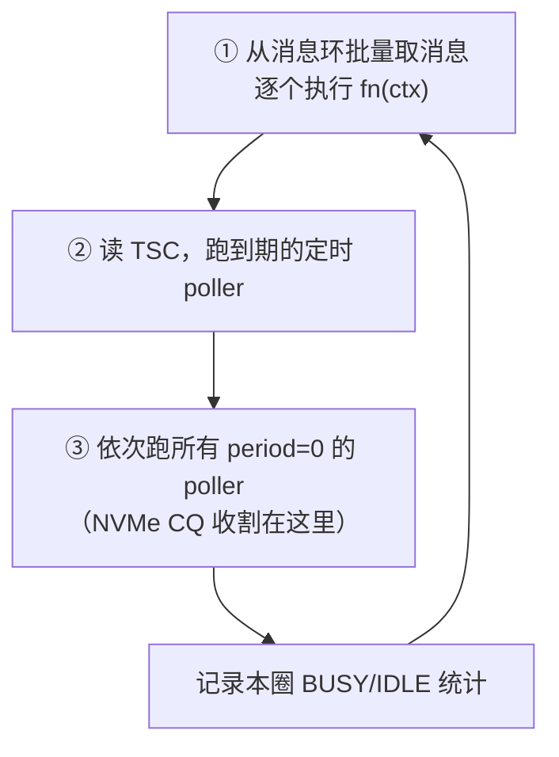

---
tags:
  - 高性能存储/NVMe-oF与SPDK
status: 已完成
---

# Reactor、Thread 与 Poller

> [[5.10 VFIO UIO 与设备绑定]] 把设备交给了 SPDK 进程，但同时也失去了内核的全套服务：没有中断处理程序帮你发现完成，没有调度器帮你唤醒等待的线程。盘做完一笔 IO，只是默默把 16 字节的 CQE DMA 进主机内存（[[3.2 Queue Pair 与 Doorbell]]）——**没有任何人会被通知**。那么谁来推进 IO 完成？SPDK 的答案是一套三层结构：reactor（每核一个永不睡眠的事件循环）、spdk_thread（数据的"户口所在地"）、poller（每圈都被问一遍的回调）。写过 muduo 的人会有强烈既视感：这就是 one loop per thread，只是"等事件"的方式从 `epoll_wait` 睡眠换成了永不睡眠的轮询——而这个替换，正是延迟从"μs 级且抖动"变成"亚 μs 且稳定"的来源。

前置：[[0.6 Interrupt Busy Polling 与 Context Switch]]（中断 vs 轮询的成本总论）、[[5.6 SPDK 用户态驱动]]（CQ 为什么躺在主机内存里）、[[5.10 VFIO UIO 与设备绑定]]（设备如何到手）。

---

## 1. 背景：接管设备之后，"完成"没人管了

内核路径上一笔 IO 的完成链是：设备发中断 → ISR 收割 CQE → 唤醒睡在 `io_wait` 上的线程。这条链的每一环都由内核提供。SPDK 接管设备后（且默认不注册中断），链条只剩第一步的"原材料"：**CQE 已经在你的内存里，读它就是读一次 DRAM**。

所以问题变成：**谁、以什么节奏、去读这块内存？** 三个候选答案：

| 方案 | 问题 |
| --- | --- |
| 每次提交后原地自旋等这一笔完成 | 同步化了，队列深度退化为 1，吞吐崩 |
| 开一个专门的"收割线程" | 收割线程与提交线程共享 qpair → 要加锁 → [[5.12 无锁 thread-per-core 模型]] 要消灭的东西 |
| **每个核跑一个事件循环，把"查一遍 CQ"作为循环里的常驻步骤** | SPDK 的选择 |

第三种就是 **Reactor 模式**：一个循环不断地"收集事件 → 分发给回调"。muduo 的 EventLoop 是它的 epoll 版（事件 = 内核告知的 fd 就绪）；SPDK 的 reactor 是它的轮询版（事件 = 自己查出来的 CQE、消息、到期定时器）。模式相同，等事件的方式截然不同。

---

## 2. 三个概念：reactor / spdk_thread / poller

定义先行，再给关系：

- **reactor**【实现】：SPDK 启动时按核掩码（如 `-m 0x3` 表示用 core 0 和 core 1）**每核创建一个**，本体是一个绑核的 pthread，跑一个死循环，永不 `sleep`、永不 `epoll_wait`。它是物理执行资源。
- **spdk_thread**【实现】：**逻辑线程**，不是 pthread。它是一个调度容器，里面装着：一个无锁消息环（别的核往里投任务）、若干 poller、若干 io_channel（对 bdev 的每线程句柄）。一个 reactor 上可以挂多个 spdk_thread；spdk_thread 也可以被整体搬到别的 reactor（负载均衡时）。它真正的意义是**数据的属地**：qpair、连接、缓存分片都"落户"在某个 spdk_thread 上，只被它访问。
- **poller**【实现】：注册到 spdk_thread 上的回调，`spdk_poller_register(fn, arg, period_us)`。`period_us == 0` 的 poller 每圈必跑；非零的是**定时 poller**，reactor 用 TSC（CPU 时间戳计数器）判断到期才跑——不用内核定时器，因为那又要走系统调用和中断。poller 返回 `BUSY`（这圈干了活）或 `IDLE`（空转），供 `spdk_top` 统计**真实**负载——全轮询模式下 `top` 里永远是 100%，分不出忙闲。

最重要的一个 poller 就是 NVMe 完成收割：`spdk_nvme_qpair_process_completions()`——每圈扫一遍本线程 qpair 的 CQ，按相位位收割新 CQE、执行完成回调。**"谁推进 IO 完成"的最终答案就是它**。

三层结构与跨核消息通道的全景：

![[图片/SVG/8_5_11_1.svg|900]]

reactor 一圈的执行顺序是纯线性的：



一圈典型耗时在亚 μs 到几 μs 之间（取决于挂了多少 poller、每个干多少活）【量级】。

**C++ 对应**：reactor ≈ 手写的单线程 executor；poller ≈ 一个"每 tick 都重新入队的任务"；spdk_thread ≈ 带任务队列的 strand（保证其上的一切串行执行）。C++ 标准库没有现成对应物，最接近的是 muduo 的 EventLoop + `runInLoop`，或 boost::asio 的 `io_context` + `strand`——只是它们都睡在 `epoll_wait` 里，SPDK 不睡。

---

## 3. 消息传递：跨线程协作的唯一通道

spdk_thread 上的数据只许它自己碰，那别的线程想动怎么办？**发消息请所有者代劳**【实现】：

```c
spdk_thread_send_msg(target_thread, fn, ctx);  // 把 (函数指针, 上下文) 投进对方的消息环
```

三个值得较真的点：

1. **投递是无锁的**：消息环是 MPSC（多生产者单消费者）无锁环，投递方用 CAS 抢位置、以 release 语义发布，消费方以 acquire 语义读取——**发送前对 `ctx` 的所有写，对执行 `fn(ctx)` 的目标线程可见**，这是 happens-before 在环上的落点（细节见 [[5.12 无锁 thread-per-core 模型]]）。
2. **不需要唤醒对方**：muduo 的 `runInLoop` 投完任务要 `wakeup()`（往 eventfd 写一字节，把睡在 `epoll_wait` 里的循环叫醒）——一次系统调用加一次唤醒。SPDK 的目标线程**本来就永不睡眠、每圈来收**，投递纯粹是两次内存操作。消息延迟 = 对方走完当前这圈的剩余时间，亚 μs 且无调度抖动【量级】。
3. **`ctx` 的所有权随消息转移**：投出去之后发送方不得再碰——语义上等同于把 `unique_ptr` move 进了队列。

**【类比，非等同】** `spdk_thread_send_msg ≈ EventLoop::runInLoop`：同样是"把活转交给属主线程串行执行"，muduo 用它保证 TCP 连接的所有回调都在所属 loop 线程跑，SPDK 用它保证 qpair/channel 只被属主碰。同一个设计动机：**用属地化消灭锁**。

---

## 4. 与 epoll 事件循环的对比：延迟从哪里省出来

| 维度 | epoll 循环（muduo） | SPDK reactor |
| --- | --- | --- |
| 等事件 | `epoll_wait` 系统调用中睡眠 | 永不睡眠，每圈主动查 |
| 事件来源 | 内核通知 fd 就绪（背后是中断） | 自己读设备 DMA 来的 CQ / 消息环 / TSC |
| 单次发现成本 | 系统调用 + 唤醒 + 调度：~μs，抖动大 | 一次内存读：亚 μs，稳定 |
| 空闲时 CPU | ≈ 0% | 100%（烧核） |
| 跨线程投递 | 队列 + eventfd `wakeup()` | 无锁环投递，无系统调用 |

省出来的延迟有两块【量级】：

- **均值**：中断 → ISR → 唤醒 → 上下文切换这条链约 1–几 μs（[[0.6 Interrupt Busy Polling 与 Context Switch]] 的成本表），对 10 μs 级的 NVMe 盘是 10%+ 开销，对更快的介质和 NVMe-oF 转发场景不可接受;
- **尾部**：唤醒要经过调度器，被抢占、迁核、缓存变冷都会拉出长尾。轮询路径上没有调度器插手，p99 与 p50 的差距显著收窄——**对存储服务，p99 稳定往往比均值更值钱**（[[0.7 性能指标 IOPS 带宽 延迟 P99]]）。

代价同样明确【取舍】：烧掉整颗核，且**前提是核可独占**。混部环境里轮询线程被抢占，比睡眠线程更糟——延迟没省下来，CPU 白烧（隔离配置见 [[5.9 SPDK 环境与 HugePage]]、[[5.23 Target CPU NUMA NIC SSD 亲和性]]）。新版 SPDK 也提供 interrupt mode 让空闲时睡眠，本质是往混合策略回摆。

---

## 5. 协作式调度的纪律：一人阻塞，全核遭殃

reactor 上的 poller 和消息是**协作式调度**：没有抢占，一个回调不返回，同核的一切都停摆。这条纪律和 muduo "回调里不许阻塞"一字不差，但后果更重——同核上停摆的不只是几条 TCP 连接，还有所有 qpair 的完成收割：

- 一个 poller 里等了 1 ms 的锁 → 本核**所有** IO 的完成发现推迟 1 ms → p99 直接多出一个 1 ms 的台阶；
- 禁止清单【实现】：阻塞系统调用（磁盘写日志、同步 DNS）、`mutex` 等待、`sleep`、长计算不分片。要打日志走异步，要长计算就切片成多次 poller 调用。

完成发现延迟的构成也随之清晰：**平均 = 半圈时间，最坏 = 一整圈时间**。圈越短、poller 越守纪律，延迟越低越稳——这就是"reactor 模型如何直接决定存储延迟"的机制。

---

## 6. 动手：量化"一个慢 poller 拖垮全核"

不需要 SPDK 环境，一个 mini-reactor 就能复现协作式调度的核心风险——观察"快 poller 的调用间隔"如何被慢 poller 撑爆：

```cpp
#include <algorithm>
#include <chrono>
#include <functional>
#include <print>
#include <thread>
#include <vector>

// mini-reactor：poller = 每圈都被调用的回调（对应 spdk_poller period=0）
// 实验：pollerA 记录自己相邻两次被调用的间隔；pollerB 每 10 万圈"违纪"一次
namespace {

using Clock = std::chrono::steady_clock;

}  // namespace

int main() {
    std::vector<std::function<void()>> pollers;
    std::vector<long long> gaps_ns;
    gaps_ns.reserve(2'000'000);

    Clock::time_point last = Clock::now();
    pollers.emplace_back([&] {                       // pollerA：守纪律，只记时间
        const auto now = Clock::now();
        gaps_ns.push_back(
            std::chrono::duration_cast<std::chrono::nanoseconds>(now - last)
                .count());
        last = now;
    });

    long long iter = 0;
    pollers.emplace_back([&] {                       // pollerB：偶尔阻塞 2ms
        if (++iter % 100'000 == 0) {
            std::this_thread::sleep_for(std::chrono::milliseconds{2});
        }
    });

    const auto deadline = Clock::now() + std::chrono::seconds{3};
    while (Clock::now() < deadline) {                // reactor 循环：永不睡眠
        for (const auto& p : pollers) p();
    }

    std::ranges::sort(gaps_ns);
    const auto pct = [&](double q) {
        return gaps_ns[static_cast<std::size_t>(q * (gaps_ns.size() - 1))];
    };
    std::println("loop iterations : {}", gaps_ns.size());
    std::println("gap p50  : {} ns", pct(0.50));
    std::println("gap p99  : {} ns", pct(0.99));
    std::println("gap p9999: {} ns", pct(0.9999));
    std::println("gap max  : {} ns  <- pollerB 的 2ms 全数转嫁给 pollerA", gaps_ns.back());
    return 0;
}
```

```bash
g++ -std=c++23 -O2 -pthread -o mini_reactor mini_reactor.cpp && ./mini_reactor
```

**读结果的方式**：p50 是纯循环开销（几十~几百 ns，这就是"一圈"的量级），p9999/max 会出现 ~2 ms 的台阶——pollerA 什么坏事都没做，尾延迟却完全由同核的 pollerB 决定。把 pollerA 想象成 NVMe CQ 收割 poller，这个台阶就是线上 p99 毛刺的形状（[[9.5 p99 毛刺定位]]）。对照实验：把 pollerB 的 sleep 去掉，max 立刻回到 μs 以下。

---

## 7. 陷阱与误区

> [!warning] 常见错误
> 1. **把 spdk_thread 当 pthread 用**：它没有自己的栈和执行流，不能 `sleep`/`join`，"阻塞一个 spdk_thread"实际是阻塞了整个 reactor 及其上所有其他 spdk_thread。
> 2. **在 poller 或消息回调里等锁 / 打同步日志 / 做长计算**：协作式调度没有抢占，本核所有 IO 的尾延迟为你的阻塞买单。长活切片，慢活外包给专用核。
> 3. **消息 `ctx` 投出后继续使用**：所有权已转移，继续读写是数据竞争 + 潜在 use-after-free——和 move 后使用同罪。
> 4. **poller 注销时机不当**：回调仍可能在飞行中（本圈已取出待执行），注销后立刻释放 `ctx` 会悬空。SPDK 的惯例是在属主线程上下文里注销再释放。
> 5. **用 `top` 看负载**：全轮询下永远 100%。要看 poller 的 BUSY/IDLE 比（`spdk_top`），否则容量规划全错。
> 6. **在共享核上跑 reactor**：被调度器抢占的轮询循环既烧 CPU 又不省延迟，比 epoll 模型全面更差。轮询的前提是核独占【前提】。

---

## 8. 关键结论

| 结论 | 性质 |
| --- | --- |
| 接管设备后没有中断链，完成 = CQE 躺在自家内存里；必须有人轮询，这个人就是 reactor 上的 poller | 事实 |
| reactor = 每核一个绑核 pthread 的死循环；spdk_thread = 数据属地的逻辑线程；poller = 每圈/定时被问一遍的回调 | 实现 |
| 一圈 = 收消息 → 到期定时 poller → 普通 poller；完成发现延迟平均半圈、最坏一圈 | 实现 / 量级 |
| 跨核只走 `spdk_thread_send_msg`：无锁环投递、release/acquire 保证可见、`ctx` 所有权随消息转移、无需唤醒 | 实现 |
| 与 epoll 模型的本质差异在"等事件"方式：睡眠+唤醒（μs、抖动）vs 永不睡眠轮询（亚 μs、稳定） | 事实 / 量级 |
| 轮询用一整颗核换均值和 p99；前提是核可独占，混部下反而全面劣化 | 取舍 / 前提 |
| 协作式调度无抢占：一个回调阻塞 1 ms，本核所有 IO 尾延迟 +1 ms——纪律即延迟 | 事实 |
| `spdk_thread_send_msg ≈ runInLoop`、reactor ≈ 不睡觉的 EventLoop：one loop per thread 的存储版 | 类比 |

---

## 关联知识

- [[0.6 Interrupt Busy Polling 与 Context Switch]] - 中断/轮询/上下文切换的成本总账：本篇取舍的依据
- [[5.6 SPDK 用户态驱动]] - CQ 为什么在用户态内存里、相位位怎么判新
- [[5.10 VFIO UIO 与设备绑定]] - 设备如何到手：本篇的前一步
- [[5.12 无锁 thread-per-core 模型]] - 属地化与消息传递的完整性能模型：下一篇
- [[5.18 Queue 建立过程]] - NVMe-oF 场景下 qpair 与 poll group 的建立
- [[2.7 SQPOLL 与 IOPOLL]] - 内核里的轮询变体：同一取舍的另一落点
- [[9.5 p99 毛刺定位]] - 慢 poller 造成的台阶在线上如何被定位

## 参考

- SPDK 文档：Event Framework（reactor/event）、Message Passing and Concurrency、Poller 与 `spdk_top`
- 《Linux多线程服务端编程》：one loop per thread、`runInLoop` 与跨线程任务转交（对照阅读）
- SPDK 源码：`lib/event/reactor.c`（主循环）、`lib/thread/thread.c`（spdk_thread 与消息环）
