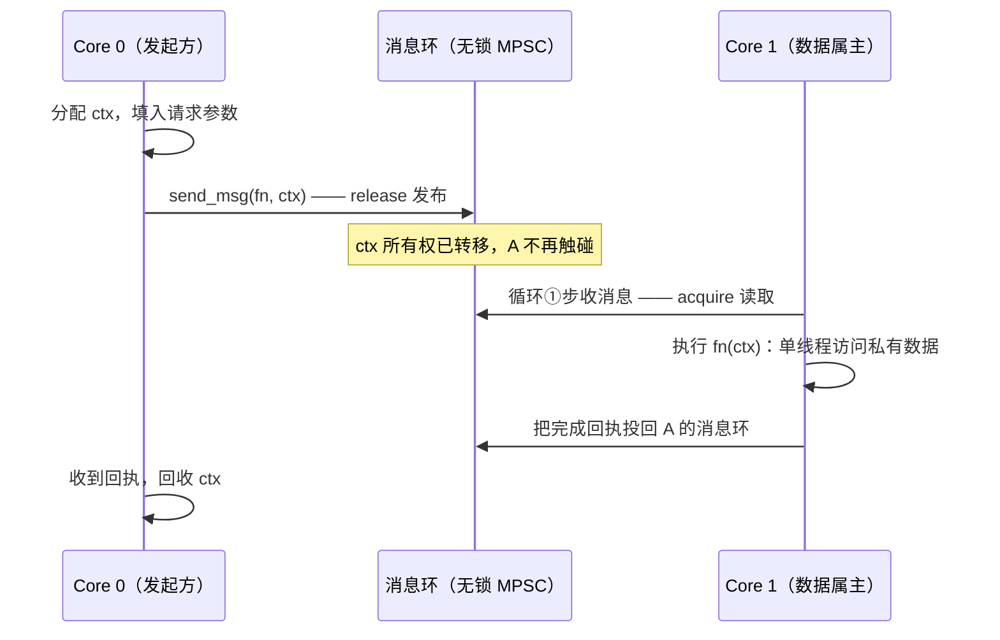

---
tags:
  - 高性能存储
status: 已完成
---

# 无锁 thread-per-core 模型

> [[5.11 Reactor Thread 与 Poller]] 给出了骨架：每核一个循环。本篇讲灵魂：为什么 SPDK 的"无锁"其实是"**无共享**"。多线程 C++ 的常规做法是"共享数据 + 锁保护"；SPDK 反过来——**数据按核切分、各归各家，跨核只递消息**。锁没有被"优化快了"，而是被设计掉了。理解这一步，并发控制（锁 vs 属地）、队列（有界环）、内存可见性（release/acquire）、背压（满了怎么办）这四件 C++ 多线程课的老朋友，会在存储延迟上各自对号入座。

前置：[[0.1 CPU Cache Cache Line 与内存屏障]]（缓存行与 MESI）、[[5.11 Reactor Thread 与 Poller]]（reactor 与消息）、[[0.5 NUMA CPU 亲和性与内存亲和性]]（跨 NUMA 访存成本）。

---

## 1. 先算一笔锁的账：共享为什么伤延迟

假设一个存储服务用经典模型：4 个工作线程共享一个请求队列、一张连接表、几个统计计数器，用 `std::mutex` / `std::atomic` 保护。三层成本逐级放大【量级】：

1. **缓存行弹跳**。CPU 之间以 64 字节的 cache line 为单位保持一致性（MESI 协议，[[0.1 CPU Cache Cache Line 与内存屏障]]）。锁字和被保护数据所在的行，每次被某核写之前，都要先让其他核的副本失效、再跨核取回独占权。**即使没人排队等锁**，这个来回也要几十~上百 ns——是 L1 命中的几十倍。无争用的 `atomic` 操作约 10 ns，争用下的跨核 RMW 翻一个量级。
2. **锁排队**。抢不到 `std::mutex` 的线程走 futex 陷入内核睡眠，被唤醒还要过调度器：μs 级往返。持锁线程若恰好被抢占，后面排队的全体陪等（锁护送，lock convoy）。
3. **尾延迟放大**。排队论的基本形状：利用率逼近饱和时等待时间陡增。锁就是一个服务台，4 个核高频抢它，p99 最先起飞——而存储服务恰恰是按 p99 签 SLO 的（[[0.7 性能指标 IOPS 带宽 延迟 P99]]）。

结论先行：**共享本身就是成本，锁只是把成本显性化的形式**。把锁换成"无锁数据结构"（大家一起 CAS）并不解决第 1 层——缓存行照样弹跳。真正的解法是让共享消失。

---

## 2. thread-per-core：数据落户，跨核发消息

SPDK 的设计原则【实现】：

- **每核一个线程**（reactor），线程绑核、核独占——线程数不随连接数增长；
- **数据按核切分**：每个 NVMe qpair、每个 io_channel、每个连接、每片元数据，都"落户"在一个 spdk_thread 上，**只被属主访问**。SPDK 的 qpair 刻意不做线程安全——这是设计而非缺陷（同一思路见 [[4.18 多线程下 QP 使用模型]]）；
- **跨核只走消息**：想动别人的数据，`spdk_thread_send_msg` 把"函数 + 上下文"投给属主，由属主在自己的循环里执行。

由此，"无锁"的准确含义分两层：

| 层 | 含义 |
| --- | --- |
| 数据路径 | **无同步**：私有数据单线程访问，连 `atomic` 都不需要，编译器和 CPU 可以放开优化 |
| 跨核边界 | 同步收敛到唯一一点：消息环的头尾指针（无锁环，见下节） |

**C++ 对应**【类比，非等同】：这就是 sharded executor / actor 模型——每个 shard 一个 strand，状态封在 shard 内，外界只能投递消息。muduo 把"一条 TCP 连接的所有回调固定在一个 loop 线程"是同一原则的网络版；数据库世界的 shared-nothing 架构是它的分布式版。

两种模型的对照与背压机制：

![[图片/SVG/8_5_12_1.svg|900]]

---

## 3. 跨核边界：无锁环与内存可见性

跨核消息环是整个模型里唯一需要并发推理的地方，值得拆开看【实现】：

- 环是**有界数组 + 头尾下标**。多个生产者用 CAS 抢占写槽位，填入 `(fn, ctx)` 后以 **release** 语义发布尾指针；唯一的消费者（属主线程）以 **acquire** 语义读尾指针，再取槽位内容。
- release/acquire 配对建立 happens-before：**发送方在投递之前对 `ctx` 做的所有写入，对属主线程执行 `fn(ctx)` 时可见**。这就是为什么消息处理函数可以放心裸读 `ctx`，一个锁都不加——可见性由环保证了，不需要每个字段自己再同步。
- **所有权随消息转移**：投递后发送方不得再碰 `ctx`，语义上等同于 `queue.push(std::move(ptr))`。数据竞争不是被锁压制住的，而是"同一时刻只有一个线程能看到这份数据"在设计层面就成立。

一次跨核协作的完整生命周期是线性的：



对比锁模型的延迟结构【量级】：消息路径 = 两次环操作（各几十 ns）+ 对方走完当前圈的剩余时间（亚 μs）；没有 futex、没有调度器、没有唤醒。均值未必碾压无争用的锁，但**分布极窄**——没有"抢锁失败陷入内核"这个 μs 级的分叉，p99 稳定性完全不同。

---

## 4. 背压：有界队列把"太快"变成"可控的慢"

模型里所有队列都是**有界**的：消息环有深度，qpair 有队列深度，bdev 的 io 对象池有容量。满了怎么办？SPDK 的答案是**立即失败，绝不阻塞**【实现】：

- `spdk_thread_send_msg` 环满返回错误；
- qpair 满时提交函数返回 `-ENOMEM`，调用方用 `spdk_bdev_queue_io_wait` 注册"有空位再叫我"的回调，稍后重试；
- 于是压力沿着调用链向上传：bdev 满 → transport 不再从 socket 收新请求 → TCP 窗口收缩 / RDMA credit 耗尽 → **客户端被迫放慢**。这条链就是背压（backpressure），与 [[5.20 TCP Transport 数据路径]] 的流控衔接。

为什么有界性直接决定延迟上界？Little's law：

$$
L = \lambda W
$$

队列里平均滞留 $L$ 个请求、到达率 $\lambda$、平均等待 $W$。深度 $L$ 被硬性限制，$W$ 就有上界；反过来，无界队列的 $L$ 随积压任意增长，$W$ 跟着膨胀到秒级、分钟级——**无界队列不是没有背压，是把背压推迟成内存耗尽和迟到的雪崩**【取舍】。C++ 工程里的同款教训：线程池配无界 `std::deque` 任务队列，过载时看起来"还活着"，实际每个任务都要排几分钟——不如有界队列早早拒绝，让上游限流。

---

## 5. 负载均衡与取舍：属地化的代价

thread-per-core 不是免费午餐，代价集中在**分片不均**【取舍】：

- **热点核**：连接/qpair 按静态规则分到各核后，如果某个核摊上的恰好都是大流量连接，它 100% 忙、别的核围观——锁模型下"谁闲谁干"的天然均衡消失了；
- 对策【实现】：接入时按负载择核落户；SPDK 的动态调度器可把整个 spdk_thread 迁到别的 reactor（搬"户口"而不是搬单个请求，属地不变式仍然成立）；NUMA 边界内分片（核、内存、NIC、SSD 同 node，见 [[5.23 Target CPU NUMA NIC SSD 亲和性]]）；
- **调试形态改变**：数据竞争类 bug 基本消失（单线程访问没有竞争），换来的是**消息时序类** bug——回执乱序、ctx 生命周期、两阶段操作中途对象没了。前者靠 TSAN 抓，后者靠状态机纪律。

| 维度 | 共享 + 锁 | thread-per-core |
| --- | --- | --- |
| 均值延迟（低负载） | 相当 | 相当 |
| p99（高负载） | 锁排队，陡增 | 窄分布，平稳 |
| 扩展性 | 核数增加 → 争用加剧 | 近线性（分片均匀时） |
| 负载均衡 | 天然（谁闲谁抢） | 要自己做（分片/迁移） |
| 心智负担 | 每个数据结构都要想并发 | 想清"数据归谁" + 消息时序 |

---

## 6. 动手：量出"共享"本身的价格

不用 SPDK，一个计数器实验就能量出模型差异的物理根源——三种写法、同样的活【实现】：

```cpp
#include <atomic>
#include <chrono>
#include <cstdint>
#include <print>
#include <thread>
#include <vector>

// 4 线程各自增计数 N 次：
//   shared    : 全员写同一个 atomic —— 缓存行在核间弹跳
//   falseshare: 各写各的，但挤在同一 cache line —— 照样弹跳
//   sharded   : 各写各的，独占 cache line —— thread-per-core 的雏形
namespace {

constexpr int kThreads = 4;
constexpr std::int64_t kOps = 10'000'000;

struct alignas(64) PaddedCounter {   // 独占一个 cache line
    std::atomic<std::int64_t> v{0};
};

template <typename Fn>
long long run_ms(Fn&& body) {
    const auto t0 = std::chrono::steady_clock::now();
    {
        std::vector<std::jthread> ts;
        for (int i = 0; i < kThreads; ++i) ts.emplace_back(body, i);
    }                                 // jthread 析构自动 join（RAII）
    return std::chrono::duration_cast<std::chrono::milliseconds>(
               std::chrono::steady_clock::now() - t0)
        .count();
}

}  // namespace

int main() {
    std::atomic<std::int64_t> shared{0};
    const auto t_shared = run_ms([&](int) {
        for (std::int64_t i = 0; i < kOps; ++i)
            shared.fetch_add(1, std::memory_order_relaxed);
    });

    std::vector<std::atomic<std::int64_t>> packed(kThreads);  // 同一行内相邻
    const auto t_false = run_ms([&](int id) {
        for (std::int64_t i = 0; i < kOps; ++i)
            packed[id].fetch_add(1, std::memory_order_relaxed);
    });

    std::vector<PaddedCounter> sharded(kThreads);
    const auto t_shard = run_ms([&](int id) {
        for (std::int64_t i = 0; i < kOps; ++i)
            sharded[id].v.fetch_add(1, std::memory_order_relaxed);
    });

    std::println("shared  (真共享)      : {} ms", t_shared);
    std::println("packed  (伪共享)      : {} ms", t_false);
    std::println("sharded (每线程独占行): {} ms", t_shard);
    return 0;
}
```

```bash
g++ -std=c++23 -O2 -pthread -o sharding_cost sharding_cost.cpp && ./sharding_cost
```

**读结果的方式**：典型多核机器上 sharded 比 shared 快一个数量级上下；packed 虽然逻辑上毫无共享，却和 shared 同样慢——**慢的根源不是"逻辑共享"而是"缓存行共享"**。三行结果对应三个结论：锁/原子争用贵在缓存一致性流量；只改逻辑不改内存布局没用（伪共享，[[0.1 CPU Cache Cache Line 与内存屏障]]）；按线程切分并隔离到独立缓存行，成本回到纯本地写。SPDK 把这个原则从计数器推广到 qpair、连接、整条数据路径——每笔 IO 都省下这些跨核流量，p99 里就少了这些 μs。

---

## 7. 陷阱与误区

> [!warning] 常见错误
> 1. **图省事在别的线程直接调 qpair / io_channel**：低负载下往往"碰巧能跑"，高负载下偶发损坏和崩溃，极难复现。属地不变式没有运行时强制（release 版），靠纪律和 debug 断言维持。
> 2. **`ctx` 投出后继续读写**：所有权已转移，此后访问是数据竞争 + 潜在 use-after-free。把 `send_msg` 看作 `std::move`。
> 3. **忽略 `send_msg` / 提交函数的返回值**：环满、qpair 满返回错误是背压信号；吞掉它等于丢请求或悄悄破坏"满了会变慢"的契约。
> 4. **私自加无界缓冲"解决"满的问题**：延迟上界随之消失，过载从"快速失败"变成"迟到的雪崩"。
> 5. **用自旋锁替代属地化，"反正临界区很短"**：短临界区照样弹缓存行，且自旋方烧的是本核的 poller 时间——两个核一起变慢。
> 6. **分片时无视 NUMA**：核在 node 0、缓冲区在 node 1，每次访存跨 QPI/Infinity Fabric，白白多几十 ns（[[0.5 NUMA CPU 亲和性与内存亲和性]]）。
> 7. **把"消息模型没有并发 bug"当真**：竞争没了，时序 bug 还在——回执到达时发起方对象已析构是最常见的一类；用状态机 + 引用计数（`shared_ptr` 或显式 refcnt）管理跨消息生命周期。

---

## 8. 关键结论

| 结论 | 性质 |
| --- | --- |
| 共享的第一性成本是缓存行在核间弹跳（MESI），锁只是把它显性化；"无锁数据结构"不消除这层成本 | 事实 |
| 无争用 atomic ~10 ns，争用跨核 RMW 数十~上百 ns，mutex 争用走 futex ~μs——三层逐级放大 | 量级 |
| thread-per-core = 数据按核落户、单线程访问（无同步），跨核只走消息；"无锁"的真义是"无共享" | 实现 |
| 唯一同步点收敛到消息环头尾指针：release 发布 / acquire 消费建立 happens-before，ctx 内容无需再同步 | 事实 |
| 消息即所有权转移（≈ move 进队列）：数据竞争在设计层面消灭，不是被锁压制 | 类比 / 实现 |
| 有界队列 + 立即失败 = 背压：深度有界 ⇒ 等待有界（Little's law）；无界队列把过载推迟成雪崩 | 事实 / 取舍 |
| 代价是负载均衡要自己做：热点核靠择核落户 / 迁移 spdk_thread / NUMA 内分片缓解 | 取舍 |
| 换来的延迟红利主要在 p99：路径上没有 futex、调度器、唤醒，分布窄而稳 | 量级 |

---

## 关联知识

- [[0.1 CPU Cache Cache Line 与内存屏障]] - 缓存行、MESI、release/acquire：本篇一切成本的物理根源
- [[0.5 NUMA CPU 亲和性与内存亲和性]] - 分片必须落在 NUMA 边界内的原因
- [[5.11 Reactor Thread 与 Poller]] - 承载本模型的执行骨架：reactor 与消息环
- [[4.18 多线程下 QP 使用模型]] - RDMA 世界同一原则：QP 每线程独占
- [[5.20 TCP Transport 数据路径]] - 背压链的网络段：TCP 窗口与收包节流
- [[5.23 Target CPU NUMA NIC SSD 亲和性]] - 分片与硬件拓扑对齐的完整实践
- [[9.5 p99 毛刺定位]] - 锁排队 / 热点核在线上呈现的形状与定位方法

## 参考

- SPDK 文档：Message Passing and Concurrency、Scheduler（动态负载均衡）
- DPDK 文档：`rte_ring`（无锁环的 CAS + release/acquire 实现，SPDK 环同源）
- 《Effective Modern C++》Item 40：并发用 `std::atomic`，特种内存用 `volatile`（区分同步与可见性的起点）
- 《Linux多线程服务端编程》：one loop per thread 与"用消息传递代替共享内存"的工程论证
