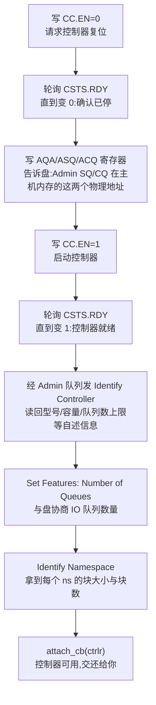

---
tags:
  - 高性能存储
  - NVMe-oF与SPDK
status: 已完成
---

# SPDK NVMe Driver

> [[5.6 SPDK 用户态驱动]] 回答了"用户态凭什么能开盘"（VFIO + IOMMU + hugepage 三块拼图），[[5.10 VFIO UIO 与设备绑定]] 把设备交到了进程手里，[[5.11 Reactor Thread 与 Poller]] 安排好了"谁来推进事件"。还剩最后一段没讲：**设备到手之后，从"一块生硬件"到"能读写的盘"，中间的活谁干？** 内核里这段活叫"驱动初始化"，`modprobe nvme` 时默默做完，你只看到 `/dev/nvme0n1` 凭空出现；SPDK 里它变成你程序中明明白白的三步调用——**probe/attach（唤醒控制器）→ alloc_io_qpair（建提交通道）→ cmd_read/process_completions（提交与收割）**。本篇把这三步逐一拆开：每一步在跟硬件做什么交易、与内核 nvme 驱动逐项对照哪些活只是"搬了地方"，最后给一个可编译的最小程序和一组亲手触发背压的实验。

前置：[[3.1 NVMe 命令模型]]（SQE/CQE/opcode 是什么）、[[3.2 Queue Pair 与 Doorbell]]（队列与门铃机制）、[[5.6 SPDK 用户态驱动]]（轮询与内存序）、[[5.10 VFIO UIO 与设备绑定]]（设备如何到手）。

---

## 1. 全景：这里说的"驱动"是一个库

先把名词掰直。日常语境里"驱动"= 内核模块（`nvme.ko`），似乎天然属于内核。但驱动的本质定义朴素得多【事实】：**一段"懂这类硬件规范"的代码**——知道寄存器在哪个偏移、命令是什么格式、初始化按什么顺序握手。这段代码放内核是驱动，放用户态链接进你的进程（`libspdk_nvme`）也是驱动。SPDK NVMe Driver 就是后者：**一个普通的用户态库，你的程序调用它的函数，它替你按 NVMe 规范跟盘打交道**。

它向你暴露三层对象，与内核世界一一对应：

| SPDK 对象 | 含义 | 内核里的对应物 |
| --- | --- | --- |
| `spdk_nvme_ctrlr` | 控制器：一个 PCIe 功能，即"这块 SSD" | `/dev/nvme0`（字符设备） |
| `spdk_nvme_ns` | namespace：控制器内一段独立编址的逻辑盘（[[3.10 Namespace]]） | `/dev/nvme0n1`（块设备） |
| `spdk_nvme_qpair` | queue pair：一条 SQ+CQ 提交通道 | blk-mq 的一个硬件队列（[[1.7 块层与 blk-mq]]） |

还有一条隐藏通道【事实】：**Admin qpair**。NVMe 规定控制器有一对专用的管理队列，只走配置类命令（Identify、Create/Delete IO Queue、Get Log Page 等），不走数据 IO。它在 attach 阶段由驱动自动创建——你平时感觉不到它，但"建 IO 队列"这件事本身就是通过它发命令完成的：**IO 队列是用 Admin 队列"下单"造出来的**。

---

## 2. probe/attach：把控制器从复位态唤醒

入口只有一个函数：

```c
int spdk_nvme_probe(const struct spdk_nvme_transport_id *trid, void *cb_ctx,
                    spdk_nvme_probe_cb probe_cb,     // 每发现一个设备问你:要吗?
                    spdk_nvme_attach_cb attach_cb,   // 初始化完成,把 ctrlr 交给你
                    spdk_nvme_remove_cb remove_cb);  // 设备被拔走时通知你
```

它做三件事：**枚举**（扫描所有绑到 vfio/uio 的 NVMe 设备）、**询问**（对每个设备调 `probe_cb`，返回 true 表示"我要接管它"）、**初始化**（对要的设备执行控制器初始化握手，完成后调 `attach_cb` 递给你 `ctrlr` 指针）。单设备场景也可用 `spdk_nvme_connect`（同步版，指定 `trid` 直连一个）【实现】。

初始化握手是纯线性的固定流程——**这套顺序写在 NVMe 规范里，谁当驱动谁照做**【事实】，内核 nvme 驱动做的是同一套：



三个值得停下来看的点：

1. **CC/CSTS 是 BAR0 里的 MMIO 寄存器**（[[5.10 VFIO UIO 与设备绑定]] mmap 进来的那段）：所谓"初始化"就是一场寄存器问答，用户态写 CC、轮询 CSTS，与内核驱动的指令序列完全相同【事实】；
2. **先复位再启动**【事实】：无论上一个使用者（内核驱动或崩溃的前一个 SPDK 进程）把盘留在什么状态，EN=0→RDY=0 都会把它拉回已知起点——这也是"上个进程没 detach 就崩了，下次 probe 通常仍能救回来"的原因；
3. `remove_cb` 对应热插拔：盘被物理拔走或 vfio 撤销映射时回调你。**没有内核帮你善后，"盘没了"从此是应用必须处理的事件**，与 [[5.5 Multipath 与故障切换]] 衔接。

---

## 3. qpair 创建：用 Admin 队列"下单"造 IO 队列

```c
struct spdk_nvme_io_qpair_opts opts;
spdk_nvme_ctrlr_get_default_io_qpair_opts(ctrlr, &opts, sizeof(opts));
opts.io_queue_size     = 256;   // 环深度:同时在途命令的硬上限
opts.io_queue_requests = 512;   // tracker 数:可大于环深,给排队留余量
struct spdk_nvme_qpair *qpair =
    spdk_nvme_ctrlr_alloc_io_qpair(ctrlr, &opts, sizeof(opts));
```

这一步背后发生的事【事实】：驱动在 hugepage 里分配两段环内存，然后经 **Admin 队列**发两条命令——Create IO CQ（告诉盘"完成队列在这个物理地址"）、Create IO SQ（"提交队列在这里，完成投递到刚才那个 CQ"）。从此这对环归你，与 [[3.2 Queue Pair 与 Doorbell]] 里 host 与盘的通信契约完全一致。

三个参数的语义要分清【实现/取舍】：

- `io_queue_size`：**硬件环的深度**。太小会频繁触发背压；太大浪费内存且掩盖排队（延迟堆在环里，Little 定律照常生效，见 [[5.8 SPDK bdev 与 perf]] §6）；
- `io_queue_requests`：**tracker（每命令簿记对象）的数量**，可以大于环深——环满时命令先在软件层排队，缓冲突发；
- `delay_cmd_submit`：允许驱动攒几条 SQE 再敲一次 doorbell——**用一点延迟换更少的 MMIO 写**（MMIO 是提交路径上最贵的单步）。低延迟场景关掉，高吞吐场景打开【取舍】。

军规重申（出处 [[5.12 无锁 thread-per-core 模型]]）：**qpair 不是线程安全的**，正确用法是每核各建一个，硬件多队列天然支持这种分片。

---

## 4. 提交与完成：一次读命令的完整解剖

![[图片/SVG/8_5_13_1.svg|900]]

提交侧三步、完成侧三步，图上编号 ①—⑨。文字版走一遍：

**提交**（`spdk_nvme_ns_cmd_read(ns, qpair, buf, lba, n_blocks, cb, ctx, 0)`）：

1. 取一个空闲 **tracker**——每条在途命令的簿记对象，记着 `cid`（命令 ID）、你的回调与 `ctx`、PRP 表的位置。tracker 用尽 = 返回 `-ENOMEM`，命令根本没发出（显式背压，[[5.6 SPDK 用户态驱动]] §5）；
2. 在 SQ tail 槽位填 64 字节 SQE：opcode=Read、cid、起始 LBA（SLBA）、块数（NLB）、数据放哪（PRP1/PRP2，按页列出的物理地址表，[[3.9 PRP 与 SGL]]）——**全是写自己进程里的 hugepage 内存**；
3. 写屏障之后，往 mmap 进来的 doorbell 寄存器写一次新 tail 值——唯一一次 MMIO，约百 ns 量级【量级】。函数随即返回，**不等完成**。

**完成**（`spdk_nvme_qpair_process_completions(qpair, max_completions)`，通常注册为 poller 每圈调用）：

4. 读 CQ 下一槽位的 **phase bit**：没翻转 → 返回 0（空轮询，常态）；翻转了 → 这是一条盘刚 DMA 进来的新 CQE；
5. 按 CQE 里的 `cid` 找回 tracker，**在当前线程直接调你的回调**（run-to-completion）；一圈最多收 `max_completions` 条（0 = 不限），返回值 = 本次收割条数；
6. 写 CQ head doorbell 归还槽位。

内存序的对账在 [[5.6 SPDK 用户态驱动]] §4 已经写透：提交侧 = SPSC 环的 `push()`（数据写全、release 发布），完成侧 = `pop()`（acquire 见到 phase 才读 CQE）——对端不是线程，是盘的 DMA 引擎。

还有一条容易忽略的暗线【实现】：**Admin 队列也要轮询**。`spdk_nvme_ctrlr_process_admin_completions(ctrlr)` 得低频周期性调用（如每秒若干次），否则 AER 异步事件（[[3.14 AER 异步事件]]）与超时检测都不会推进——内核里这些由中断和内核线程免费驱动，用户态里"免费"二字不存在。

---

## 5. 与内核 nvme 驱动对照：活一件没少，只是搬了家

| 驱动的活 | 内核 nvme 驱动 | SPDK NVMe Driver |
| --- | --- | --- |
| 初始化握手（§2 流程） | `modprobe` 时做，用户不可见 | `probe/attach` 时做，就在你进程里 |
| IO 队列 | 每 CPU 一个硬件队列，blk-mq 管理（[[1.7 块层与 blk-mq]]） | 每核手动 `alloc_io_qpair`，应用管理 |
| 命令簿记 | blk-mq tag | tracker / cid |
| 数据缓冲 | 任意用户内存，内核负责 pin + 建散列表 | 必须 `spdk_dma_malloc`（hugepage、已注册 IOMMU） |
| 完成通知 | MSI-X 中断 → ISR → softirq（[[3.12 Interrupt 与 MSI-X]]） | 轮询 phase bit，无中断 |
| 命令超时 | 内核定时器自动发现，自动 reset 控制器（[[3.13 Command Timeout 与 Controller Reset]]） | 需 `spdk_nvme_ctrlr_register_timeout_callback` 注册，**恢复动作自己写**（abort 或 reset 由你决定） |
| 设备共享 | 任意进程 open `/dev/nvme0n1` | 单进程独占 |
| 观测 | `iostat`/`blktrace` 全家桶（[[9.2 iostat 指标解读]]） | 自带统计 + [[5.8 SPDK bdev 与 perf]] 的工具 |

这张表的正确读法【事实】：**SPDK 没有"省掉"驱动的任何职责，它省掉的是内核路径的通用性税**——系统调用、共享仲裁、中断唤醒。职责本身（初始化、簿记、超时、热拔）全数转嫁给了应用，这正是 [[5.7 内核态 vs 用户态路径]] 里"快的代价是侵入性"的驱动层版本。

---

## 6. 最小程序：probe → qpair → 读 LBA 0

骨架如下（SPDK 是 C API，按本库惯例用 RAII 包出 Modern C++ 形态；编译最省事的方式是把它替换进 SPDK 源码树 `examples/nvme/hello_world/` 复用其 Makefile，函数签名以源码树头文件为准【实现】）：

```cpp
#include "spdk/env.h"
#include "spdk/nvme.h"
#include <cstdio>
#include <memory>

namespace {

// ---- RAII:控制器与 DMA 缓冲,离开作用域必然归还 ----
struct CtrlrGuard {
    spdk_nvme_ctrlr* c{};
    ~CtrlrGuard() { if (c) spdk_nvme_detach(c); }
};
struct DmaBuf {
    void* p{};
    explicit DmaBuf(std::size_t n) : p{spdk_dma_zmalloc(n, 4096, nullptr)} {}
    ~DmaBuf() { spdk_dma_free(p); }
    DmaBuf(const DmaBuf&) = delete;
    DmaBuf& operator=(const DmaBuf&) = delete;
};

struct Ctx {                    // 回调间传递状态:C 回调的"手动闭包"
    CtrlrGuard ctrlr;
    spdk_nvme_ns* ns{};
    bool done{false};
};

bool probe_cb(void*, const spdk_nvme_transport_id* trid,
              spdk_nvme_ctrlr_opts*) {
    std::printf("probing %s\n", trid->traddr);
    return true;                               // 第一个设备就要
}

void attach_cb(void* raw, const spdk_nvme_transport_id*,
               spdk_nvme_ctrlr* c, const spdk_nvme_ctrlr_opts*) {
    auto* ctx = static_cast<Ctx*>(raw);
    ctx->ctrlr.c = c;
    for (auto nsid = spdk_nvme_ctrlr_get_first_active_ns(c); nsid != 0;
         nsid = spdk_nvme_ctrlr_get_next_active_ns(c, nsid)) {
        ctx->ns = spdk_nvme_ctrlr_get_ns(c, nsid);   // 取第一个活跃 ns
        break;
    }
}

void read_done(void* raw, const spdk_nvme_cpl* cpl) {
    auto* ctx = static_cast<Ctx*>(raw);
    ctx->done = true;
    std::printf("read %s\n",
                spdk_nvme_cpl_is_error(cpl) ? "FAILED" : "ok");
}

}  // namespace

int main(int argc, char** argv) {
    spdk_env_opts env{};
    spdk_env_opts_init(&env);
    env.name = "nvme_driver_demo";
    if (spdk_env_init(&env) != 0) return 1;    // hugepage/PCI 环境就位

    Ctx ctx;
    if (spdk_nvme_probe(nullptr, &ctx, probe_cb, attach_cb, nullptr) != 0 ||
        ctx.ns == nullptr) {
        std::fprintf(stderr, "no controller/ns found\n");
        return 1;
    }
    std::printf("ns: %u sectors x %u B\n",
                (unsigned)spdk_nvme_ns_get_num_sectors(ctx.ns),
                spdk_nvme_ns_get_sector_size(ctx.ns));

    spdk_nvme_qpair* qp =
        spdk_nvme_ctrlr_alloc_io_qpair(ctx.ctrlr.c, nullptr, 0);
    DmaBuf buf{4096};                          // 普通 new 出来的内存盘 DMA 不到

    int rc = spdk_nvme_ns_cmd_read(ctx.ns, qp, buf.p, /*lba=*/0,
                                   /*count=*/1, read_done, &ctx, 0);
    if (rc != 0) { std::fprintf(stderr, "submit rc=%d\n", rc); return 1; }

    while (!ctx.done)                          // 手写"最小 reactor":轮询直到完成
        spdk_nvme_qpair_process_completions(qp, 0);

    spdk_nvme_ctrlr_free_io_qpair(qp);
    return 0;                                  // ctx.ctrlr 析构时自动 detach
}
```

预期输出：`probing 0000:01:00.0` → ns 的几何信息 → `read ok`。三处对应正文：`while` 循环就是被 [[5.11 Reactor Thread 与 Poller]] 工程化之前的"裸 reactor"；`DmaBuf` 强制了 DMA 内存纪律；`Ctx` 展示了 C 回调风格下状态如何手动穿针——SPDK 编程侵入性的最小样本。

---

## 7. 实验：亲手摸一次背压与空轮询

**实验一：触发 -ENOMEM（控制变量：只改队列参数）。** 把 §3 的 `opts.io_queue_size` 与 `io_queue_requests` 都设到最小值（如 4），然后一口气提交 8 条读、不调 `process_completions`：

- 预期：前几条返回 0，随后开始返回 `-ENOMEM`【事实】；
- 学到的：背压不是异常是常态接口，`-ENOMEM ≠ 内存不足`，而是"tracker/环位用尽，请先收割再提交"。收几条完成再提交，又能成功——队列资源是循环水位，不是消耗品。

**实验二：量空轮询占比（观测指标怎么读）。** 在 §6 的轮询循环里加两个计数器：调用次数 `total`、返回值非 0 的次数 `effective`。qd=1 时你会看到 `effective/total` 极低（盘几十 μs 才完成一笔，循环每圈百 ns 级）【量级】：

- 学到的：**CPU 100% ≠ 有效功率 100%**。这个比值就是 `spdk_top` 里 reactor busy/idle 统计的手工版（[[5.8 SPDK bdev 与 perf]] §6），也是"轮询低负载纯浪费、高负载纯收益"的直接读数；
- 常见误读：把 `process_completions` 返回 0 当错误处理。0 是空轮询的正常返回；负值才是错（如 `-ENXIO`：qpair 因控制器故障已失效）。

---

## 8. 陷阱与故障定位

> [!warning] 常见错误
> 1. **提交后不轮询就等回调**：没有中断，回调只可能发生在你调 `process_completions` 的线程里——"永远不完成的 IO"九成是这一条。
> 2. **在回调里再做阻塞/长活**：回调运行在轮询线程上，占住它 = 这个核上一切 IO 停摆（[[5.11 Reactor Thread 与 Poller]] 的军规）。
> 3. **buffer 用普通堆内存**：`new`/`std::vector` 的内存没注册 IOMMU，轻则 `-EFAULT`，开着 IOMMU 时盘的 DMA 直接被硬件拦截。
> 4. **回调返回前复用/释放 buffer**：命令在途期间那块内存归盘"共享"，提前动它是数据竞争，对端是 DMA 引擎。
> 5. **忘了 Admin 队列**：不调 `process_admin_completions`，超时回调与 AER 永不触发——盘出了事你是最后一个知道的。
> 6. **超时后不做任何事**：timeout 回调只是通知；不 abort/reset，那条命令的 tracker 永久泄漏，队列水位只降不升。

| 症状 | 首查 | 原因与处置 |
| --- | --- | --- |
| probe 一个设备都找不到 | `./scripts/setup.sh status` | 设备没绑 vfio/uio、trid 地址写错、或没用 root |
| `spdk_env_init` 失败 | `grep Huge /proc/meminfo` | hugepage 没预留：重跑 `setup.sh`（[[5.9 SPDK 环境与 HugePage]]） |
| attach 卡住 / 极慢 | 盘的 CSTS 寄存器（SPDK 日志会打印） | 控制器在做内部恢复，或 CSTS.CFS=1（fatal）：断电重启盘，怀疑硬件 |
| 提交恒返回 `-ENOMEM` | 自己的收割逻辑 | 只提交不收割；或 `io_queue_requests` 设得比并发量小 |
| 回调永远不来 | 轮询是否在同一线程、同一 qpair | 见陷阱 1；跨线程用 qpair 则是数据竞争，现象更诡异 |
| 偶发数据损坏 | 是否多核共用 qpair / buffer 生命周期 | 陷阱 4 或 [[5.6 SPDK 用户态驱动]] 陷阱 2；用单核复跑收敛问题 |
| 上个进程崩了，设备"脏" | 直接重新 probe | 初始化第一步就是复位（§2），一般可救；救不回用 `setup.sh reset` 归还内核再接管 |

---

## 9. 关键结论

| 结论 | 性质 |
| --- | --- |
| 驱动 = 懂硬件规范的代码，放哪都行；SPDK NVMe Driver 是链接进进程的用户态库，对象层级 ctrlr → ns → qpair 与内核的 nvme0/nvme0n1/硬件队列一一对应 | 事实 |
| 初始化握手（复位→建 Admin 队列→使能→Identify→协商队列数）是 NVMe 规范定的固定流程，内核与 SPDK 做同一套；先复位保证从任意残留状态可恢复 | 事实 |
| IO 队列是经 Admin 队列"下单"创建的；io_queue_size 是环深，io_queue_requests 是 tracker 数，delay_cmd_submit 用延迟换 MMIO 次数 | 事实 / 取舍 |
| 提交 = 写 tracker + SQE + 一次 doorbell MMIO；完成 = 轮询 phase bit + cid 找回 tracker + 同线程回调——零 syscall、零中断 | 事实 |
| 内核驱动的职责（超时、热拔、Admin 事件、恢复）一件没少，全部转嫁给应用——快的代价是把"内核替你做的事"变成你的代码 | 事实 / 取舍 |
| -ENOMEM 是显式背压不是内存不足；process_completions 返回 0 是常态不是错误；CPU 100% ≠ 有效功率 100% | 事实 / 实践 |
| qpair 每核一个不可共享；DMA 缓冲必须来自 spdk_dma_malloc；命令在途期间 buffer 归盘共有 | 事实 |

---

## 关联知识

- [[3.1 NVMe 命令模型]] / [[3.2 Queue Pair 与 Doorbell]] - SQE/CQE/doorbell/phase bit：本篇一切操作的硬件契约
- [[3.9 PRP 与 SGL]] - SQE 里"数据放哪"字段的完整规则
- [[3.12 Interrupt 与 MSI-X]] / [[3.13 Command Timeout 与 Controller Reset]] - 被换掉的完成通知与被转嫁的超时恢复
- [[5.6 SPDK 用户态驱动]] - 三块拼图与内存序对账：本篇的地基
- [[5.10 VFIO UIO 与设备绑定]] - BAR0 寄存器是怎么 mmap 进来的
- [[5.11 Reactor Thread 与 Poller]] / [[5.12 无锁 thread-per-core 模型]] - process_completions 被工程化成 poller 的去处；qpair 分片军规
- [[5.8 SPDK bdev 与 perf]] - 在这层驱动之上量性能的三探针方法
- [[5.15 自定义最小 bdev 模块]] - 把本篇的裸驱动包成统一块设备抽象
