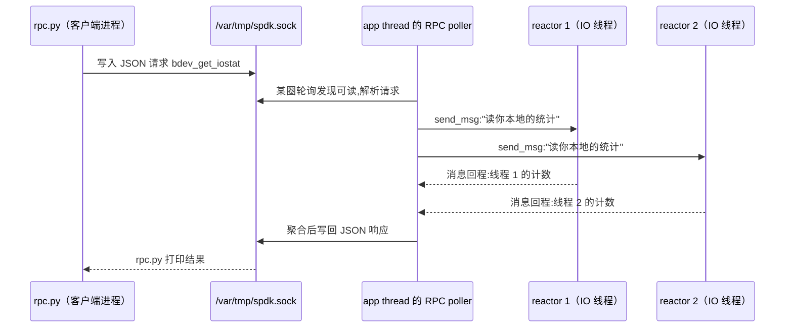

---
tags:
  - 高性能存储/NVMe-oF与SPDK
status: 已完成
---

# SPDK JSON-RPC 控制方式

> 到 [[5.13 SPDK NVMe Driver]] 为止，讲的全是**数据面**：每秒百万次、纳秒计较的热路径。但一个常驻的存储进程还有另一类完全不同的需求——建一块盘、删一块盘、查一眼统计、把当前配置存下来。这类操作每天几次、慢一点无所谓，但必须能**在数据面全速运行时进行**，这就是**控制面**（[[10.1 数据面与控制面分工]]）。麻烦在于 SPDK 的线程模型：reactor 永不阻塞地轮询（[[5.11 Reactor Thread 与 Poller]]），没有哪个线程"闲着等你敲命令"。SPDK 的答案优雅地复用了自己：**把控制面做成 JSON-RPC 服务，请求从一个 Unix domain socket 进来，被当作"又一种事件"排进事件循环**——控制面借用数据面的事件引擎，却不打扰它的热路径。本篇讲这套 RPC 的协议与服务模型、一套可复现的实操命令、配置持久化的本质，以及它顺手送你的一件礼物：RPC 响应时间是整个进程健康的探针。

前置：[[5.8 SPDK bdev 与 perf]]（bdev 与 JSON 配置初见）、[[5.11 Reactor Thread 与 Poller]]（事件循环与消息传递）、[[10.1 数据面与控制面分工]]（两面为什么要分）。

---

## 1. 名词：JSON-RPC 与 Unix domain socket

**JSON-RPC**【事实】：一个极简的远程调用协议——请求和响应都是一段 JSON 文本。请求带三样东西：方法名、参数、请求 ID；响应带结果（或错误）和同一个 ID（用于配对，因为请求可以并发发多个）：

```json
{"jsonrpc": "2.0", "method": "bdev_malloc_create",
 "params": {"num_blocks": 131072, "block_size": 512}, "id": 1}

{"jsonrpc": "2.0", "id": 1, "result": "Malloc0"}
```

没有二进制编码、没有 schema 编译器、没有连接握手——**它就是文本**。这是刻意的取舍【取舍】：控制面每天几次调用，可调试性（`cat` 就能看懂、任何语言 20 行就能写客户端）远比性能重要。

**Unix domain socket（UDS）**【事实】：形态像网络 socket（`socket/connect/read/write` 同一套 API），但通信双方必须在**同一台机器**上，寻址不用 IP+端口，用**文件系统路径**（SPDK 默认 `/var/tmp/spdk.sock`）。两个对本篇重要的性质：不经过网络协议栈（没有 TCP/IP 开销，也**不可能**被远程访问）；访问控制就是**文件权限**——能打开这个文件的进程就能发命令，§6 的安全边界全系于此。

先做一次"裸窥探"，证明上面两段没有魔法（需先按 §3 启动 `spdk_tgt`）：

```bash
python3 - <<'EOF'
import socket, json
s = socket.socket(socket.AF_UNIX, socket.SOCK_STREAM)
s.connect("/var/tmp/spdk.sock")
s.sendall(json.dumps({"jsonrpc": "2.0", "method": "rpc_get_methods",
                      "id": 1}).encode())
print(s.recv(1 << 20).decode()[:300], "...")
EOF
```

返回的就是全部可用方法名的 JSON 数组。日常当然不必手搓——SPDK 自带客户端 `scripts/rpc.py`，它做的事与上面这几行完全等价【事实】。

---

## 2. 服务模型：RPC 是事件循环里的一个 poller

RPC 服务端没有专门的线程。它的实现是【事实/设计】：在 **app thread**（SPDK 启动时创建的第一个 `spdk_thread`，跑在主 reactor 上）注册一个 poller，每圈循环用非阻塞方式检查监听 socket——有新连接就 accept，有完整请求就解析并调用对应的处理函数。与 [[5.11 Reactor Thread 与 Poller]] 里"轮询 NVMe CQ"的 poller 地位完全平等：**对 reactor 而言，一条 RPC 请求和一条 CQE 都只是"这圈循环发现的事件"**。

处理函数常常要碰别的核的数据（例如 `bdev_get_iostat` 要汇总每个线程的 io_channel 统计）。按无锁模型的规矩（[[5.12 无锁 thread-per-core 模型]]），它不加锁去读，而是用 `spdk_for_each_channel` 把消息逐核送过去、在数据的"户口所在地"读取、再把结果汇回 app thread：



两个推论值得记住：

- **控制面天然慢而无害**【事实】：一次 RPC 要等消息在各核的循环里各走一圈，毫秒级；但它消耗的 IO 线程时间只是"处理一条消息"，热路径不加锁、不停顿；
- **RPC 响应时间是健康探针**【实践】：`rpc.py` 卡住≠RPC 有问题，而通常意味着**某个 reactor 被阻塞了**（有人在 poller 里睡觉、死循环）——消息送过去没人处理。数据面的病，控制面最先表现出症状。排查时这比 CPU 100%（轮询模式下恒真，无信息量）有用得多。

---

## 3. 实操：一套可复现的 RPC 会话

零硬件即可复现（Malloc bdev 是内存假盘，[[5.8 SPDK bdev 与 perf]] §4）。终端一，启动一个"什么都还没配"的通用 target：

```bash
sudo ./build/bin/spdk_tgt          # 默认监听 /var/tmp/spdk.sock
```

终端二，用 `rpc.py` 依次执行（`-s` 可指定别的 socket 路径；每条命令后附输出解读）：

```bash
# 1. 有哪些方法可用——探索入口,任何方法可加 -h 看参数
sudo ./scripts/rpc.py rpc_get_methods | head -20

# 2. 建一块 64 MiB、块大小 512B 的内存盘;返回值 "Malloc0" 是 bdev 名
sudo ./scripts/rpc.py bdev_malloc_create 64 512

# 3. 列出所有 bdev:关注 block_size、num_blocks(几何)、claimed
#    (是否已被上层如 NVMe-oF subsystem 认领,认领后不可再次打开写)
sudo ./scripts/rpc.py bdev_get_bdevs

# 4. IO 统计:num_read_ops/bytes_read 是累计值;ticks 除以 tick_rate 才是秒
sudo ./scripts/rpc.py bdev_get_iostat -b Malloc0

# 5. reactor 统计:busy/idle 是 tick 累计,二者之比 = 有效功率占比
#    (这就是 5.8 §6 说的"CPU 100% 之下看真忙闲"的数据源)
sudo ./scripts/rpc.py framework_get_reactors

# 6. 删掉它;有在途 IO 时框架先排干并通知打开者,再真正拆除
sudo ./scripts/rpc.py bdev_malloc_delete Malloc0
```

指标口径的三个要点【实现】：

- **计数是累计值**：算速率要采样两次取差除以间隔（§5 实验就用这一点）；
- **ticks 不是秒**：所有时间量以 CPU tick 计，响应里附带 `tick_rate`（每秒 tick 数），自己换算;
- **统计按 io_channel 聚合**：每线程各记各的、RPC 时消息汇总（§2 的时序图），所以读统计本身零锁、但读到的是"消息到达各核那一刻"的快照，不是同一瞬间的一致切面【前提】。

---

## 4. 配置持久化：配置文件 = 可回放的 RPC 记录

跑完一堆 RPC 后进程状态很复杂，重启怎么办？导出：

```bash
sudo ./scripts/rpc.py save_config > my_config.json
```

看一眼输出结构，会发现一件把"配置文件"概念彻底祛魅的事【事实】：

```json
{
  "subsystems": [
    {
      "subsystem": "bdev",
      "config": [
        { "method": "bdev_malloc_create",
          "params": { "name": "Malloc0", "num_blocks": 131072,
                      "block_size": 512 } }
      ]
    }
  ]
}
```

每一项就是 `method + params`——**配置文件不是状态的快照，而是"重建这个状态所需的 RPC 调用清单"**。启动时加载（`spdk_tgt -c my_config.json`）的本质就是按序回放这些调用。[[5.8 SPDK bdev 与 perf]] §4 手写的 `bdev.json` 是同一格式——当时是手写"预录的 RPC"，现在是机器帮你录。

由此立刻推出两条边界【事实】：

- `save_config` 保存的是**怎么重建**，不是**数据与统计**——Malloc bdev 重启后内容归零，iostat 计数归零；
- 极少数设置必须在框架初始化**之前**生效（如调度器、大块内存参数）。为此有 `--wait-for-rpc` 启动模式：进程起来先不初始化，等你发完启动期 RPC、再发 `framework_start_init` 放行【实现】。平时用不到，但在 `save_config` 输出里见到 `startup_config` 分区时要认得它。

---

## 5. 实验：用控制面给数据面对账

**目标**：验证"RPC 统计与压测工具读数同源"，顺便练习速率换算。零硬件可复现。

bdevperf 也内嵌 RPC 服务（**每个 SPDK 应用都自动内嵌**【事实】，这正是"RPC 是框架能力而非 spdk_tgt 特性"的证明）。用它的等待模式：

```bash
# 终端一:bdevperf 以 -z 启动:先不跑测试,等 RPC 指令;-r 指定自己的 socket
sudo ./build/examples/bdevperf -z -r /var/tmp/bdevperf.sock

# 终端二:对着 bdevperf 的 socket 建盘,然后遥控开跑
sudo ./scripts/rpc.py -s /var/tmp/bdevperf.sock bdev_malloc_create -b Malloc0 64 512
sudo PYTHONPATH=./python ./examples/bdev/bdevperf/bdevperf.py \
     -s /var/tmp/bdevperf.sock perform_tests -q 32 -o 4096 -w randread -t 60 &

# 测试进行中,间隔 10 秒采两次 iostat(路径与脚本名随版本略有差异,
# 以源码树为准【实现】)
sudo ./scripts/rpc.py -s /var/tmp/bdevperf.sock bdev_get_iostat -b Malloc0
sleep 10
sudo ./scripts/rpc.py -s /var/tmp/bdevperf.sock bdev_get_iostat -b Malloc0
```

**对账**：`(第二次 num_read_ops − 第一次) / 10` 应与 bdevperf 结束时报告的 IOPS 同量级吻合（不会严格相等：采样窗口与测试窗口没对齐，且测试头尾有暖场）【前提】。对不上一个量级才说明有问题——先查是不是看错了 bdev 或看错了字段（`bytes_read` 与 `num_read_ops` 差一个块大小的倍数）。

**顺手加一个故障注入**：测试跑着的时候 `bdev_malloc_delete Malloc0`。观察 bdevperf 立刻报 IO 失败退出——框架把"盘没了"作为事件通知了所有打开者（hotremove 回调），in-flight IO 以错误完成而非悬挂【事实】。这就是 [[5.5 Multipath 与故障切换]] 里上层能做切换的机制基础：底层保证"死得干脆、有讣告"。

---

## 6. 安全边界：一个文件权限背后是整个存储

把话说重【实践】：**能写 `/var/tmp/spdk.sock` 的本地进程 = 完全控制这个存储进程**。`bdev_malloc_delete`、NVMe-oF subsystem 增删（[[5.17 Subsystem 与 Namespace]]）、乃至挂着生产数据的 bdev 全在一条命令射程内——这不是"配置接口"，是"数据毁灭接口"。三条纪律：

1. **文件权限就是全部门禁**：SPDK 以 root 跑，socket 默认也归 root。不要为了省 `sudo` 把它 chmod 777——等于把盘交给机器上所有用户；
2. **不要裸转发成 TCP**：JSON-RPC 协议本身**没有认证、没有加密**【事实】（设计前提就是"本机、可信、文件权限已把关"）。用 `socat` 把它暴露成 TCP 端口的那一刻，前提全部作废；
3. **生产的正确形态**：RPC 之上包一层管理 agent（白名单方法、审计日志、鉴权），人只对 agent 说话——这正是 [[10.1 数据面与控制面分工]] 里"控制面还要再分层"的实例。

---

## 7. 最小 C++ 客户端：看清协议到底有多薄

生产用 `rpc.py` 或现成库；下面 40 行的价值是祛魅——UDS + 文本，仅此而已（Modern C++/RAII 惯例同本库其他示例）：

```cpp
#include <sys/socket.h>
#include <sys/un.h>
#include <unistd.h>
#include <array>
#include <cstdio>
#include <cstring>
#include <string_view>

class UnixSock {                 // fd 的 RAII 包装:异常/提前返回都不漏
public:
    explicit UnixSock(const char* path)
        : fd_{::socket(AF_UNIX, SOCK_STREAM, 0)} {
        sockaddr_un addr{};
        addr.sun_family = AF_UNIX;
        std::strncpy(addr.sun_path, path, sizeof(addr.sun_path) - 1);
        if (fd_ < 0 || ::connect(fd_, reinterpret_cast<sockaddr*>(&addr),
                                 sizeof(addr)) != 0) {
            if (fd_ >= 0) ::close(fd_);
            fd_ = -1;
        }
    }
    ~UnixSock() { if (fd_ >= 0) ::close(fd_); }
    UnixSock(const UnixSock&) = delete;
    UnixSock& operator=(const UnixSock&) = delete;

    bool ok() const { return fd_ >= 0; }
    void send(std::string_view s) const { ::write(fd_, s.data(), s.size()); }
    std::size_t recv(char* buf, std::size_t n) const {
        const auto r = ::read(fd_, buf, n);
        return r > 0 ? static_cast<std::size_t>(r) : 0;
    }
private:
    int fd_;
};

int main() {
    UnixSock sock{"/var/tmp/spdk.sock"};
    if (!sock.ok()) { std::perror("connect"); return 1; }
    sock.send(R"({"jsonrpc":"2.0","method":"rpc_get_methods","id":1})");
    std::array<char, 1 << 16> buf{};
    const auto n = sock.recv(buf.data(), buf.size() - 1);
    std::printf("%.*s\n", static_cast<int>(n), buf.data());   // 原样打印响应
    return 0;
}
```

`g++ -std=c++20 -Wall rpc_client.cpp -o rpc_client && sudo ./rpc_client`。真实客户端还需两样这里省略的东西【实现】：按 JSON 边界切分流式响应（`read` 可能只给半个 JSON），以及 `id` 配对以支持并发请求。

---

## 8. 常见误读与故障定位

| 现象 | 误读 | 正解 |
| --- | --- | --- |
| RPC 一次要几毫秒 | "SPDK 好慢" | 控制面路径（socket + 逐核消息汇总），与数据面延迟无关；数据面的数字看 [[5.8 SPDK bdev 与 perf]] 的探针 |
| `framework_get_reactors` 的 busy 很高 | "CPU 瓶颈了" | busy/idle 区分的是"这圈有没有干活"，要看**比值与趋势**；判断瓶颈还要结合 IOPS 是否随负载增长 |
| iostat 数字巨大 | "IOPS 百万了" | 那是**累计**计数；速率 = 两次采样差 / 间隔（§5） |
| save_config 后重启，数据没了 | "持久化失败" | save_config 存的是重建步骤不是数据；Malloc 是内存盘，本就易失 |
| 删 bdev 的 RPC 返回了，立刻拔后端 | "已经删干净了" | 拆除是异步流程（排干 in-flight → 通知打开者 → 释放）；返回表示"开始拆"，复杂拓扑下要用 `bdev_get_bdevs` 确认消失 |

| 症状 | 首查 | 原因与处置 |
| --- | --- | --- |
| `Connection refused` / 文件不存在 | `ls -l /var/tmp/*.sock`；进程活着吗 | 进程没起，或它用了 `-r` 自定义路径——rpc.py 的 `-s` 要跟着指过去 |
| `Permission denied` | socket 文件属主与权限 | 用 sudo，或调整属组；**不要** chmod 777（§6） |
| `Method not found` | `rpc_get_methods` 里搜 | 方法名拼错、该子系统没编译进这个二进制、或还在 `--wait-for-rpc` 阶段（初始化前只有启动期方法可用） |
| rpc.py 长时间无响应 | 各 reactor 是否还在转（`spdk_top`、`perf top`） | §2 的健康探针触发：大概率某个 poller 阻塞/死循环，用 `gdb -p` 看各线程栈定位到人 |
| save_config 输出是空的 | 连的是哪个 socket | 建盘发给了 A 进程，save 发给了 B 进程（多 SPDK 进程共存时最常见） |

---

## 9. 关键结论

| 结论 | 性质 |
| --- | --- |
| SPDK 控制面 = JSON-RPC over Unix domain socket：纯文本协议 + 文件路径寻址，可调试性优先——控制面每天几次，性能无关紧要 | 事实 / 取舍 |
| RPC 服务端是 app thread 上的一个 poller：请求与 CQE 同为"事件循环里的事件"；跨核数据经 send_msg/for_each_channel 在归属核上读取，热路径零锁零停顿 | 事实 |
| RPC 响应时间是全进程健康探针：rpc.py 卡住 ≈ 某个 reactor 被阻塞——数据面的病控制面先发症状 | 实践结论 |
| 配置文件 = 可回放的 RPC 调用清单（method+params）；save_config 存"怎么重建"而非数据/统计；启动加载即回放 | 事实 |
| 统计皆为累计值、时间皆为 tick：速率要差分，秒要除 tick_rate；多核统计是消息汇总的近似快照,不是一致切面 | 事实 / 前提 |
| 每个 SPDK 应用都内嵌 RPC 服务（bdevperf -z 即证明）；删 bdev 会排干在途 IO 并回调打开者——"死得干脆"是上层做故障切换的前提 | 事实 |
| socket 文件权限是唯一门禁：协议无认证无加密，禁止裸暴露为 TCP；生产在其上包管理 agent | 事实 / 实践 |

---

## 关联知识

- [[10.1 数据面与控制面分工]] - 本篇是这条总纲在 SPDK 里的落地
- [[5.11 Reactor Thread 与 Poller]] / [[5.12 无锁 thread-per-core 模型]] - RPC poller 与逐核消息汇总的机制出处
- [[5.8 SPDK bdev 与 perf]] - bdev.json 的来历：手写的"预录 RPC"
- [[5.15 自定义最小 bdev 模块]] - 给自己的模块加 RPC 建盘方法，闭环控制面
- [[5.17 Subsystem 与 Namespace]] - NVMe-oF target 的配置同走这套 RPC
- [[5.5 Multipath 与故障切换]] - "删 bdev 通知打开者"是切换机制的底座
