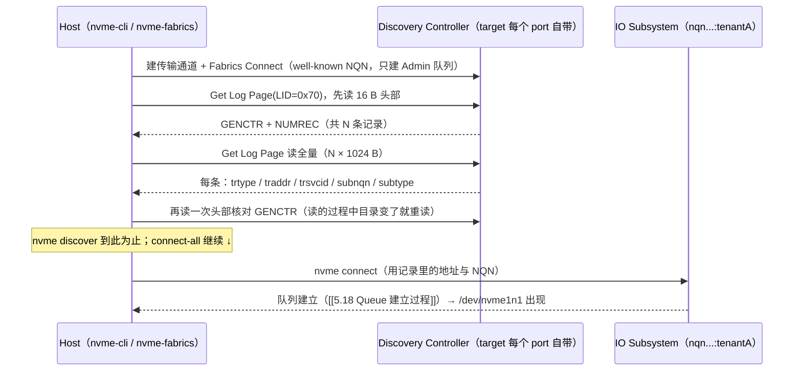

---
tags:
  - 高性能存储
status: 已完成
---

# Discovery Controller

> 贯穿案例走到部署时刻：4 台存储节点、64 台 GPU 节点，`nvme connect` 需要三样东西——transport、地址（traddr:trsvcid）、subsystem 的 NQN（[[5.3 Host 与 Target]] §2）。谁来告诉 64 台 host 这些信息？把 IP 和 NQN 硬编码进每台机器的脚本，第一次扩容或故障切换就会教做人。NVMe-oF 的答案是内建一个**目录服务**：host 只需要记住「去哪问」，连什么、走哪条路都现场查——这就是 Discovery Controller。它是纯控制面组件，一个数据字节都不经手，但它给出的答案（连哪个地址、看见几条路径）直接决定了数据面之后跑在哪条 NUMA 路径、有没有第二条路可切。

前置：[[5.1 NVMe-oF 架构]]（NQN 与五个名词）、[[5.3 Host 与 Target]]（connect 七步与 configfs）、[[3.3 Admin Queue 与 IO Queue]]（Admin 命令与 Get Log Page 属于控制面）。

---

## 1. 为什么需要目录服务

先把问题说土一点：`nvme connect -t rdma -a 192.168.1.10 -s 4420 -n nqn...:tenantA` 这行命令里的每个参数都是**部署事实**，而部署事实会变【实践】：

1. **扩容**：第 5 台存储节点上线，64 台 host 的配置都要改一遍；
2. **迁移与故障切换**：卷从节点 2 挪到节点 3，或节点 2 的一个网口坏了换另一个——地址变了，硬编码的 host 找不到家；
3. **多路径**：同一个 subsystem 从两个网口导出（[[5.5 Multipath 与故障切换]]），host 要连两条路，地址是成对出现的——手工维护 64 × 4 × 2 张地址表没有前途。

类比很直接：**Discovery 之于 NVMe-oF，相当于 DNS 之于 IP**——应用记域名不记 IP，host 记「目录在哪」不记每块盘在哪。差别只在返回内容：DNS 返回地址，discovery 返回「可连的 subsystem 列表 + 每个的 transport/地址/端口」。

一个先立住的定位【事实】：**discovery 在控制面，不在数据路径上**。查目录发生在 connect 之前；连上之后的每一笔读写都不经过它。这决定了它的故障影响范围（§6）。

---

## 2. 名词：Discovery Controller 与 Discovery Log Page

**Discovery Controller** 是一种特殊的 controller【事实】：它不挂任何 namespace、不接受 IO 命令，只回答一类查询——「这里能连什么」。它藏在一个**全网约定俗成的 NQN** 后面：

```text
nqn.2014-08.org.nvmexpress.discovery
```

host 不需要提前知道任何东西，对着这个 well-known NQN 发起 connect，连上的就是目录本身。内核 `nvmet` 在每个配好的 port 上自动提供这个 discovery subsystem，无需额外配置【实现】。

查询走的是 NVMe 已有的机制——**Get Log Page**。先给这个词一个定义：log page 是 NVMe 控制器暴露结构化信息的标准方式，一条 Admin 命令带上页号（Log Identifier, LID）就能读，本地盘的 SMART 健康信息、错误日志走的都是它（[[3.14 AER 异步事件]] 里配合 AEN 用过）。discovery 专用页是 **LID 0x70（Discovery Log Page）**，布局【实现】：

| 部分 | 内容 |
| --- | --- |
| 头部（前 16 字节） | `GENCTR`（8 B，目录版本号，内容一变就自增）、`NUMREC`（8 B，记录条数） |
| 记录（每条 1024 字节） | 一条 = 一个「可连目标」：`TRTYPE`（rdma/tcp/fc）、`ADRFAM`、`TRADDR`（地址）、`TRSVCID`（端口）、`SUBNQN`（连谁）、`SUBTYPE`（NVM subsystem 还是另一个 discovery 服务）、`PORTID`、`ASQSZ`（建议的 Admin 队列深度） |

注意记录的粒度【事实】：**一条记录 = 一个 (subsystem, port) 组合**，不是一个 subsystem。同一个 subsystem 从两个网口导出，目录里就是两条记录——多路径信息就是这样带出来的（§5）。

---

## 3. 发现流程：从「问路」到「盘出现」



两处实现细节值得一提【实现】：

- **两段式读取**：先读头部拿 `NUMREC` 才知道要多大的缓冲，再读全量；读完复核 `GENCTR`，不一致说明读的中途目录变了，重来——一个朴素的乐观并发控制；
- **端口约定**：数据面 connect 常用 4420；**NVMe/TCP 的 discovery 有专门的 IANA 端口 8009**，RDMA 惯例上 discovery 与数据面共用 4420。写自动化时别把 8009 和 4420 搞混。

命令行上的对应关系：

```bash
# 只问路，不连接
nvme discover -t tcp -a 192.168.1.10 -s 8009
#   输出即 0x70 页的翻译：每条记录一段 subnqn/traddr/trsvcid/subtype

# 问路 + 对每条 NVM 记录逐个 connect，一步到位
nvme connect-all -t tcp -a 192.168.1.10 -s 8009

# 开机自动：把「去哪问」写进配置，服务启动时 connect-all 读它
cat /etc/nvme/discovery.conf
#   --transport=tcp --traddr=192.168.1.10 --trsvcid=8009
```

至此 host 侧只剩一条不变量要维护：**discovery 服务的地址**。盘怎么挪、subsystem 怎么加，都是 target 侧改 configfs 的事，目录自动反映【实践】。

---

## 4. Discovery Controller 也是 controller：短连接与长连接两种用法

「特殊」不意味着另起一套机制——discovery controller 走的是与普通 controller 完全相同的 Fabrics Connect 流程（[[5.18 Queue 建立过程]]），差别只在能力被裁剪【事实】：

| | 普通（IO）controller | Discovery controller |
| --- | --- | --- |
| Admin 队列 | 有 | 有（唯一的队列） |
| IO 队列 | 每核一条 | **不允许创建** |
| namespace | 有 | 无 |
| 能执行的命令 | 全集 | 基本只有 Identify、Get Log Page、Keep Alive 等寥寥几条 |

由此派生出两种用法【实现】：

- **短连接（默认）**：`nvme discover` 连上、读完、断开——目录是一次性快照。拓扑之后再变，host 不知道；
- **长连接（persistent）**：`nvme discover -p` 连上后不断开，host 上会多出一个字符设备（如 `/dev/nvme0`，只有 Admin 队列、无盘），靠 Keep Alive 维持。价值在于**变更推送**：目录一变，discovery controller 通过 **AEN**（Asynchronous Event Notification，异步事件通知——controller 主动上报事件的机制，本地盘上它报健康告警，见 [[3.14 AER 异步事件]]）发出 *Discovery Log Page Change* 事件；nvme-cli 装好的 udev 规则捕获事件后自动重跑 `connect-all`——**扩容的新盘自己长出来，不需要任何人登录 64 台 host**。

生产部署的推荐形态就是后者【实践】：persistent discovery + 事件驱动 connect，host 侧配置收敛为一行 discovery 地址。

---

## 5. 多路径与规模化：目录里的三种「不止一条」

**同一 subsystem 多条记录**【事实】：target 把 tenantA 同时软链到两个 port（两张网卡、甚至一 RDMA 一 TCP），目录里就是两条 `SUBNQN` 相同、`TRADDR/TRTYPE` 不同的记录。`connect-all` 会把两条都连上，host 端按 namespace 的 NGUID 聚合成一个多路径设备——哪条路当主用、断了怎么切，是 [[5.5 Multipath 与故障切换]] 的内容。**目录是多路径的信息源**：漏配一个 port 的导出，host 就少一条命，平时看不出来，故障时才发现没有 B 路。

**指向另一个目录的记录（referral）**【事实】：`SUBTYPE` 可以标记「这条记录是另一个 discovery 服务」，host 应当追过去继续查——目录可以级联。

**集中式目录（CDC）**【实现/生态】：每台 target 自带的目录只知道自己；集群规模大了之后，更工程化的做法是一个**中心目录服务**（Centralized Discovery Controller，NVMe TP8010 标准化；Linux 侧配套 `nvme-stas` 项目），所有 target 向它注册，所有 host 只问它——存储版的服务注册与发现。中小集群用「每 target 目录 + discovery.conf 列几个地址」已经够用，CDC 是规模上去之后的选修。

---

## 6. 工作负载对账：一个纯控制面组件如何影响吞吐与尾延迟

discovery 不碰数据，但它的**答案**塑造数据面。用贯穿案例过一遍因果链：

1. **答案选路 → 吞吐**：存储节点双网卡分属两个 NUMA 节点（[[5.23 Target CPU NUMA NIC SSD 亲和性]]）。host 连目录返回的哪个 `TRADDR`，数据面就落在哪张网卡、哪个 NUMA——连错口，每笔 IO 跨 NUMA 搬运，单口带宽上限直接砍半。**目录内容是性能配置的一部分**，不是可有可无的元数据【实践】；
2. **AEN 缺失 → 聚合带宽损失**：短连接模式下扩容的第 5 台存储节点没人发现，训练负载仍挤在 4 台上——「容量加了带宽没加」这类工单，先查 host 是不是没开 persistent discovery【实践】；
3. **connect 风暴 → 尾延迟**：target 重启恢复后，64 台 host 的 udev 几乎同时触发 `connect-all`，每台建 1 + N 条队列（[[5.18 Queue 建立过程]] 的连接账）——上千次队列建立挤在几秒内，target 的 CPU 被控制面吃掉，**已恢复的数据面 IO p99 跟着抖**。大集群要给自动重连加随机退避【实践】；
4. **故障影响范围**：discovery 服务挂掉，**已连接的 IO 一个不受影响**（数据面不经过它）；受伤的是「新 connect」与「拓扑变更感知」。注意重连不依赖 discovery——host 重连用的是 connect 时记住的原地址（[[5.21 Controller Loss Timeout]]），只有当故障切换需要**新地址**时，目录才回到关键路径上。

对照实验思路（两台机器即可复现）：跑着 fio 的同时 `iptables` 封掉 discovery 端口（TCP 8009）——IO 曲线纹丝不动；再封数据端口 4420——IO 立刻挂起进入重连。一组实验把「控制面/数据面分离」从口号变成肌肉记忆。

---

## 7. Modern C++：亲手读一次目录头部

目录查询就是一条普通 Admin 命令——用 `NVME_IOCTL_ADMIN_CMD` 对着 persistent discovery controller 的字符设备发 Get Log Page(0x70)，读回头部的 `GENCTR` 与 `NUMREC`，即可验证 §2 的布局（`UniqueFd` 同 [[3.10 Namespace]] §7，此处略去定义）：

```cpp
#include <fcntl.h>
#include <sys/ioctl.h>
#include <unistd.h>
#include <linux/nvme_ioctl.h>

#include <array>
#include <cerrno>
#include <cstdint>
#include <cstring>
#include <print>
#include <system_error>

namespace {
constexpr std::uint8_t kOpGetLogPage = 0x02;   // Admin 命令 opcode
constexpr std::uint8_t kLidDiscovery = 0x70;   // Discovery Log Page

std::uint64_t ReadLe64(const std::byte* p) {   // 字段为小端；x86/arm64 主机可直接 memcpy
    std::uint64_t v{};
    std::memcpy(&v, p, sizeof v);
    return v;
}
}  // namespace

int main(int argc, char** argv) {
    const char* dev = argc > 1 ? argv[1] : "/dev/nvme0";   // nvme discover -p 留下的字符设备
    UniqueFd fd{::open(dev, O_RDONLY)};
    if (fd.get() < 0) {
        throw std::system_error{errno, std::generic_category(), "open"};
    }

    std::array<std::byte, 16> hdr{};                       // GENCTR(8B) + NUMREC(8B)
    nvme_admin_cmd cmd{};
    cmd.opcode   = kOpGetLogPage;
    cmd.addr     = reinterpret_cast<std::uint64_t>(hdr.data());
    cmd.data_len = hdr.size();
    const std::uint32_t numd = hdr.size() / 4 - 1;         // 传输长度：0-based dword 数
    cmd.cdw10 = (numd << 16) | kLidDiscovery;              // NUMDL | LID

    if (::ioctl(fd.get(), NVME_IOCTL_ADMIN_CMD, &cmd) != 0) {
        throw std::system_error{errno, std::generic_category(), "Get Log Page(0x70)"};
    }
    std::println("genctr={} numrec={}", ReadLe64(hdr.data()), ReadLe64(hdr.data() + 8));
    return 0;
}
```

```bash
nvme discover -t tcp -a 192.168.1.10 -s 8009 -p    # 建立 persistent 连接，出现 /dev/nvme0
g++ -std=c++23 -Wall -Wextra -o disclog disclog.cpp && ./disclog /dev/nvme0
# 在 target 上多导出一个 subsystem，再跑一次：genctr +1，numrec +1
```

**关键点**：改 target 的 configfs 后重跑，看 `genctr` 自增——「目录版本号」不再是纸面概念。对本地 PCIe 盘发 0x70 通常会得到 Invalid Log Page 错误：目录属于 fabric 的世界【实现】。

---

## 8. 陷阱与误区

> [!warning] 常见错误
> 1. **绕过 discovery 硬编码 connect 参数**：短期省事，扩容/迁移/加路径时 64 台 host 逐台改配置；host 侧应当只维护 discovery 地址这一条不变量。
> 2. **把 discovery 当数据面依赖盯监控**：它挂了已有 IO 不受影响；反过来，它活着也不代表数据端口通——两个端口要分开探活。
> 3. **忘开 persistent（`-p`）**：没有 AEN 就没有变更推送，拓扑变更全靠人肉重跑 discover——「加了盘但 host 看不见」的第一嫌疑。
> 4. **以为目录里看得见就连得上**：权限检查发生在 Fabrics Connect（[[5.17 Subsystem 与 Namespace]] 的 `allowed_hosts`）；同时内核 nvmet 也会按 host 身份过滤目录记录——「看不见」与「连不上」是两道门，排障时分开验证。
> 5. **大集群不做重连退避**：target 恢复瞬间的 connect-all 风暴把控制面变成数据面的噪声源，p99 无辜背锅。
> 6. **多路径只连了一条**：目录里同一 SUBNQN 的记录数就是路径数——`nvme discover` 的输出与 `nvme list-subsys` 的路径数对不上，说明有路没连上，故障切换会失灵。

---

## 9. 关键结论

| 结论 | 性质 |
| --- | --- |
| Discovery Controller = 藏在 well-known NQN 后的目录服务：只挂 Admin 队列、无 namespace，用 Get Log Page(0x70) 回答「这里能连什么」 | 事实 |
| 目录记录粒度是 (subsystem, port)：GENCTR 是版本号，NUMREC 条数；两段式读取 + 复核 GENCTR 防撕裂 | 事实 / 实现 |
| host 侧唯一要维护的不变量是 discovery 地址；connect-all 与 discovery.conf 把其余参数变成现场查询 | 实践结论 |
| persistent discovery + AEN + udev 自动 connect = 拓扑变更零人工；短连接模式看不到任何后续变更 | 事实 / 实践 |
| discovery 在控制面：挂掉不影响已有 IO，影响的是新 connect 与变更感知；重连走缓存地址不走目录 | 事实 |
| 目录的答案决定数据面走哪张网卡/哪个 NUMA、有几条多路径——纯控制面组件通过「选路」影响吞吐与尾延迟 | 事实 / 实践 |
| connect 风暴是控制面挤压数据面的典型形态，大集群重连要加退避 | 实践结论 |
| NVMe/TCP discovery 惯例端口 8009，数据面 4420；CDC（TP8010/nvme-stas）是规模化后的集中式目录 | 实现 |

---

## 关联知识

- [[5.1 NVMe-oF 架构]] - NQN、subsystem 等五个名词的首次定义
- [[5.3 Host 与 Target]] - connect 七步；本篇解决「参数从哪来」
- [[5.17 Subsystem 与 Namespace]] - 目录里列出的东西是怎么配出来的、谁有权连
- [[5.18 Queue 建立过程]] - connect 之后队列如何一条条建出来
- [[5.5 Multipath 与故障切换]] - 目录多条记录在 host 端聚合成多路径之后的故事
- [[3.3 Admin Queue 与 IO Queue]] - Get Log Page 走的控制面
- [[3.14 AER 异步事件]] - AEN 机制的本地盘原型
- [[5.21 Controller Loss Timeout]] - 重连为什么不依赖 discovery
- [[5.23 Target CPU NUMA NIC SSD 亲和性]] - 「连哪个口」背后的 NUMA 账

## 参考

- NVM Express Base Specification：Discovery Log Page（LID 0x70）、Discovery Controller、well-known NQN
- NVMe TP8010：Centralized Discovery Controller；`nvme-stas` 项目
- nvme-cli 文档：`nvme discover` / `nvme connect-all` / `/etc/nvme/discovery.conf` 与 udev autoconnect 规则
