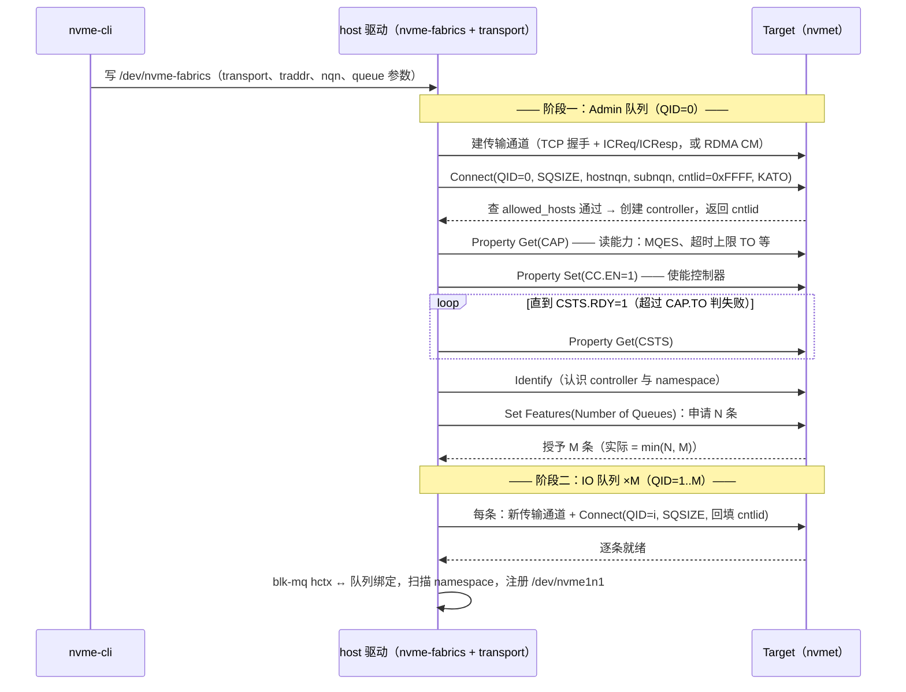

---
tags:
  - 高性能存储
status: 已完成
---

# NVMe-oF Queue 建立过程

> 目录告诉 host 去哪连（[[5.16 Discovery Controller]]），ACL 决定能连什么（[[5.17 Subsystem 与 Namespace]]）——从「允许连」到「能发 IO」之间还差最后一段：队列。本地盘上建一条队列很朴素：主机内存里划两个环（SQ/CQ），把地址告诉控制器，之后靠 doorbell 寄存器通知（[[3.2 Queue Pair 与 Doorbell]]）。网络两端**没有共享内存、没有寄存器可写**，这套机制整体失效——队列必须改用「互发消息、逐条协商」的方式在两端各自建出来。本篇按命令级走完这个过程：Fabrics 命令族如何顶替寄存器、深度与数量怎么谈、谈崩了怎么回滚，以及队列参数如何变成吞吐、内存与尾延迟之间的乘法。

前置：[[3.2 Queue Pair 与 Doorbell]]（本地队列的原型）、[[3.3 Admin Queue 与 IO Queue]]（控制面先行的分工）、[[5.3 Host 与 Target]]（connect 七步的宏观版，本篇是它的显微镜）、[[5.2 Transport TCP vs RDMA]]（通道本身怎么建）。

---

## 1. 本地队列 vs fabric 队列：存在形式的差异

| 队列的组成部分 | 本地 NVMe（PCIe） | NVMe-oF |
| --- | --- | --- |
| 队列本体 | 主机内存里的环形数组，控制器 DMA 来读写 | **两端各自的私有状态** + 中间一条传输通道（TCP 连接 / RDMA QP） |
| 建队列的方式 | Admin 命令告知环的物理地址（Create IO SQ/CQ） | 对每条队列发一次 **Fabrics Connect** 命令 |
| 提交通知 | 写 doorbell 寄存器（MMIO） | 无 doorbell：capsule 消息到达即通知（[[5.1 NVMe-oF 架构]] §2） |
| 控制器寄存器（CAP/CC/CSTS） | BAR 空间 MMIO 直读直写 | **Property Get / Property Set** 命令——寄存器的消息化替身 |
| 流控 | host 自己知道环的空位 | response capsule 回带 SQ 头指针，host 据此记账【实现】 |

一句话总结【事实】：**本地队列是一块共享内存，fabric 队列是一段协商出来的会话**。「Property」这个词第一次见容易懵，其实就是把「读写控制器寄存器」这件事包装成命令：`Property Get(CSTS)` 等价于本地的「读 CSTS 寄存器」——语义原样保留，运输方式换了，这与整个 NVMe-oF 的设计哲学（[[5.1 NVMe-oF 架构]]：换运输层，不换命令模型）一脉相承。

承载这些的是 **Fabrics 命令族**【实现】：一组只在 fabric 上存在的命令（共用 opcode `0x7F`，用子类型字段区分），成员就是 Connect、Property Get/Set、认证收发等寥寥几个——NVMe-oF 对命令集的全部扩充就这么多。

---

## 2. Connect 命令：一条队列的出生证

每条队列（Admin 或 IO）的建立都是同一个两步曲【事实】：

1. **先建传输通道**：TCP 下三次握手 + ICReq/ICResp 协商 PDU 参数；RDMA 下走 CM 建 RC QP，且队列深度已经在 CM 私有数据里预告（HSQSIZE/HRQSIZE），让 target 提前把 RECV 缓冲发满【实现】；
2. **在通道上发 Fabrics Connect**：这条命令携带的字段决定了队列的身份与尺寸——

| 字段 | 含义 |
| --- | --- |
| QID | 队列号：0 = Admin 队列，1..N = IO 队列 |
| SQSIZE | 请求的队列深度（0-based） |
| hostnqn / subnqn | 我是谁、要连谁——ACL 查表的输入（[[5.17 Subsystem 与 Namespace]] §3） |
| hostid | host 的 UUID 身份 |
| cntlid | Admin connect 填 0xFFFF（请求动态分配）；**IO connect 填 Admin connect 返回的值**——把 N 条物理连接绑定成同一个 controller 的关键【实现】 |
| KATO | keep-alive 超时（仅 Admin connect），心跳周期从此定下 |

cntlid 的接力值得停一秒【事实】：fabric 上一个 controller 的 N+1 条队列分布在 N+1 条独立的 TCP 连接/QP 上，target 靠「IO connect 里回填的 cntlid」知道这条新连接属于哪个 controller——**controller 是逻辑实体，连接是物理载体，cntlid 是把它们缝起来的线**。

---

## 3. 全时序：从写字符设备到 /dev/nvme1n1

[[5.3 Host 与 Target]] §2 给了七步的宏观版，下面下钻到命令级：



三个结构性观察：

1. **控制面先行**【事实】：Admin 队列必须先活，IO 队列的数量、深度、乃至存在与否都是在 Admin 队列上谈出来的——[[3.3 Admin Queue 与 IO Queue]] 的分工在 fabric 上原样成立，只是「Create IO Queue 命令」被「每队列一次 Connect」取代；
2. **使能序列是本地的复刻**【事实】：CAP → CC.EN=1 → 等 CSTS.RDY，与本地驱动初始化一模一样，只是 MMIO 换成了 Property 命令——学过一遍本地初始化的人在这里零新知识；
3. **数据面就绪的判定**：`/dev/nvme1n1` 出现 ≠ 一条连接，而是 **1 + M 条连接全部走完 Connect** 的结果。`dmesg` 里那行 `creating 8 I/O queues` 与 `nvme list-subsys`（state: live）是最直接的观测点（§6）。

---

## 4. 深度与数量的协商：每个参数都是两端的 min

fabric 队列的尺寸从来不是 host 单方面说了算【事实】：

- **深度**：host 请求 SQSIZE，上限是 Property Get(CAP) 读到的 **MQES**（controller 支持的最大队列深度）；内核默认请求 128，`nvme connect --queue-size` 可调【实现】。RDMA 下深度还要与 QP 的收发深度对齐——target 按协商深度**预发满 RECV 缓冲**，深度直接变成 target 的内存预算；
- **数量**：host 用 Set Features(Number of Queues) 申请（默认 = CPU 核数），target 按自己的资源授予，**实际 = min(申请, 授予)**【事实】。同一份 host 配置连不同 target，拿到的队列数可以不同——「同样的机器同样的脚本，两套环境性能不一样」的一个隐蔽根因【实践】；
- **in-capsule 数据上限**：Identify 里的 IOCCSZ 决定多大的写可以随命令同行（省一次数据往返，[[5.1 NVMe-oF 架构]] §5）——同样是 target 声明、host 遵守。

深度该设多少？用 Little's law 算，不靠拍脑袋【量级】：

$$
\text{所需在途请求数} = \text{目标 IOPS} \times \text{单笔端到端延迟}
$$

贯穿案例代入：单条队列想跑 20 万 IOPS 的 4 KiB 随机读，端到端 100 μs，则需要在途 0.2M × 100μs = **20 个**——深度 128 绰绰有余；但若换成跨机房 RTT 1 ms 的链路，同样 IOPS 需要在途 200 个，深度 128 就成了吞吐的天花板【取舍】。反方向的账同样要算：深度 × 队列数 × 每命令缓冲 = target 内存；且深度给太大，盘饱和后多出来的请求只是在队列里**排队攒延迟**，p99 变差而 IOPS 不涨——[[1.7 块层与 blk-mq]] 讲过的队列深度悖论在网络上原样重演。

---

## 5. 队列数的取舍：连接账的另一半

[[5.17 Subsystem 与 Namespace]] §4 从 subsystem 粒度算过连接账，本篇补上每 subsystem 的因子——`--nr-io-queues`【取舍】：

| | 队列多（默认每核一条） | 队列少（如 --nr-io-queues=4） |
| --- | --- | --- |
| blk-mq 提交路径 | 每核独享队列，无锁直达（[[1.7 块层与 blk-mq]]） | 多核共享一条队列：提交端锁竞争 + 缓存行弹跳，**提交侧 CPU 开销上升** |
| 连接/QP 数 | 64 核 = 64 条，乘上 host 数与 subsystem 数很快过万 | 成倍收敛 |
| target 内存与 QP cache | 每连接缓冲 × 巨大连接数；QP 状态挤出网卡缓存 → 尾延迟上行（[[4.1 RDMA 为什么快]] §5） | 显著缓解 |
| 何时选 | host 核数少、subsystem 少、追求极限每核 IOPS | 大集群、多 subsystem——**大多数生产部署的方向**【实践】 |

判断准则：**单 host 对单 subsystem 的聚合 IOPS 需求 ÷ 单队列能力（约 20–40 万 IOPS 级）≈ 需要的队列数**，多出来的队列只贡献连接账不贡献吞吐。另外内核还支持把队列按用途分类（`--nr-write-queues`、`--nr-poll-queues`：写专用队列、轮询队列），属于进阶调优【实现】，思路与本地 blk-mq 的队列分类一致。

---

## 6. 失败、回滚与观测

**建立途中失败**，每一步的表现不同【实现】：

| 失败点 | 症状 | 常见原因 |
| --- | --- | --- |
| 传输通道建不起 | connect 命令立刻报错（连接拒绝/超时） | 端口没监听、防火墙、subsystem 没软链到 port |
| Connect 被拒 | `Connect Invalid Data` 类状态码 | 不在 allowed_hosts、NQN 拼错、参数超界 |
| CSTS.RDY 等不到 | 卡到 CAP.TO 超时后失败 | target 后端异常（如 device_path 无效） |
| IO 队列建到一半失败 | **整个 controller 回滚**：已建队列全部拆除，按重连策略重试 | target 资源耗尽、网络抖动 |

最后一行是关键语义【事实】：队列建立对单个 controller 是**全或无**的——不存在「带着一半 IO 队列上线」的中间态；要么 1+M 条全部就绪进入 live，要么整体拆除进入重连循环。

**建成之后的生死**由两个机制接管【实现】：Admin 队列上的 Keep Alive 心跳（KATO 周期，秒级）探测对端存活；一旦断链，controller 进入状态机循环 `live → resetting → connecting → live`，期间**未完成的 IO 被 requeue 而不是报错**——应用感受到的是延迟凸起而非 EIO，直到 `ctrl_loss_tmo` 耗尽才放弃（参数与取舍见 [[5.21 Controller Loss Timeout]]）。这也解释了一类现场问题：target 重启后 64 台 host **同时**进入 connecting，每台重建 1+M 条队列——connect 风暴挤压 target CPU，刚恢复的数据面 p99 跟着抖（[[5.16 Discovery Controller]] §6 的第 3 条因果链）。

**观测点**清单【实践】：

```bash
nvme list-subsys -v                     # 每个 controller 的 state（live/connecting）与路径
cat /sys/class/nvme/nvme1/state         # 同上，可脚本化监控
dmesg | grep -E "nvme.*(queue|connect)" # "creating 8 I/O queues" —— 实际授予的 M
ss -ti dport = :4420                    # TCP：每条队列一条连接，逐条看 RTT/重传
rdma res show qp | grep -c RTS          # RDMA：处于 RTS 态的 QP 数 ≈ 队列数
```

对照实验设计（验证 §4/§5 的账）：固定负载（fio 4 KiB randread，iodepth 扫描），变量一：`--nr-io-queues` ∈ {1, 4, 每核}；变量二：`--queue-size` ∈ {32, 128, 1024}。预期：队列数 1 → 提交侧单队列锁竞争限制 IOPS；深度 32 + 高 RTT → 吞吐被在途数卡住；深度 1024 → IOPS 不再涨而 p99 明显变差。三条曲线画出来，本篇的取舍就全部落地了。

---

## 7. 陷阱与误区

> [!warning] 常见错误
> 1. **以为 connect 成功 = 建了一条连接**：是 1 + M 条；防火墙只放行了「第一条」的场景下，Admin 建立成功、IO 队列超时，症状是 connect 命令卡很久然后失败——排查时逐条数连接。
> 2. **队列深度越大越好**：盘饱和后深度只贡献排队延迟；先用 Little's law 算需要的在途数，再留 2–4 倍余量。
> 3. **两套环境性能不同先怀疑硬件**：先对 `dmesg` 里实际授予的队列数 M 与 `--queue-size` 生效值——协商出来的 min 不一致，性能口径就不一致。
> 4. **把重连期间的高延迟当丢数据**：IO 在 requeue 不在丢弃；真正的风险参数是 `ctrl_loss_tmo` 之后的放弃行为，应用的超时预算要覆盖它。
> 5. **大集群不做重连退避**：target 恢复瞬间的全员重建队列是自找的 p99 毛刺。
> 6. **动了 CPU 数/亲和后不复核队列映射**：热插 CPU、改 isolcpus 后 blk-mq hctx 与队列的绑定可能退化为跨核提交——症状同 [[5.3 Host 与 Target]] §4 的亲和链断裂。

---

## 8. 关键结论

| 结论 | 性质 |
| --- | --- |
| 本地队列是共享内存 + doorbell；fabric 队列是「每队列一条传输通道 + 一次 Fabrics Connect」协商出的会话，寄存器读写由 Property Get/Set 顶替 | 事实 |
| Fabrics 命令族（opcode 0x7F：Connect/Property/认证）是 NVMe-oF 对命令集的全部扩充 | 事实 / 实现 |
| cntlid 把分布在 N+1 条物理连接上的队列缝成一个逻辑 controller：Admin connect 分配，IO connect 回填 | 事实 |
| 使能序列 CAP → CC.EN → CSTS.RDY 与本地初始化同构；控制面先行：IO 队列的一切参数在 Admin 队列上协商 | 事实 |
| 深度与数量都是两端的 min：MQES 封顶深度、Set Features 授予数量——同配置不同 target 队列数可以不同 | 事实 / 实践 |
| 深度下限由 Little's law 定（IOPS × 端到端延迟），上限由 target 内存与排队延迟定；RTT 越大深度越是吞吐的第一约束 | 量级 / 取舍 |
| 队列数取舍 = 每核无锁提交 vs 连接账（target 内存 + QP cache）；大集群方向是 nr_io_queues 收敛 | 取舍 |
| 队列建立对 controller 全或无；断链后 IO requeue 不报错，hang 到 ctrl_loss_tmo——延迟凸起是设计行为 | 事实 |
| 观测三件套：nvme list-subsys 的 state、dmesg 的授予队列数、ss/rdma res 的逐条连接 | 实践结论 |

---

## 关联知识

- [[3.2 Queue Pair 与 Doorbell]] - 被消息化替换的本地队列原型
- [[3.3 Admin Queue 与 IO Queue]] - 控制面先行的分工在 fabric 上的延续
- [[5.3 Host 与 Target]] - connect 七步的宏观版与亲和链
- [[5.2 Transport TCP vs RDMA]] - 传输通道本身的建立与参数交换
- [[5.16 Discovery Controller]] - connect 参数从哪来；connect 风暴的目录侧视角
- [[5.17 Subsystem 与 Namespace]] - Connect 查表的 ACL 与 subsystem 粒度的连接账
- [[5.19 RDMA Transport 数据路径]] / [[5.20 TCP Transport 数据路径]] - 队列建成之后，一笔 IO 在两种 transport 上怎么走
- [[5.21 Controller Loss Timeout]] - 断链后 requeue/重连/放弃的参数细节
- [[1.7 块层与 blk-mq]] - 队列深度悖论与每核队列的单机原型
- [[4.1 RDMA 为什么快]] - QP cache 压力如何变成尾延迟

## 参考

- NVM Express Base Specification：Fabrics 命令（Connect、Property Get/Set）、CAP/CC/CSTS、Set Features (Number of Queues)
- NVMe over Fabrics Specification / NVMe-RDMA Transport Spec：CM 私有数据（HSQSIZE/HRQSIZE）、in-capsule 数据（IOCCSZ）
- Linux 内核 `drivers/nvme/host/fabrics.c`、`tcp.c`、`rdma.c`：connect 参数（queue_size、nr_io_queues、kato）与控制器状态机
