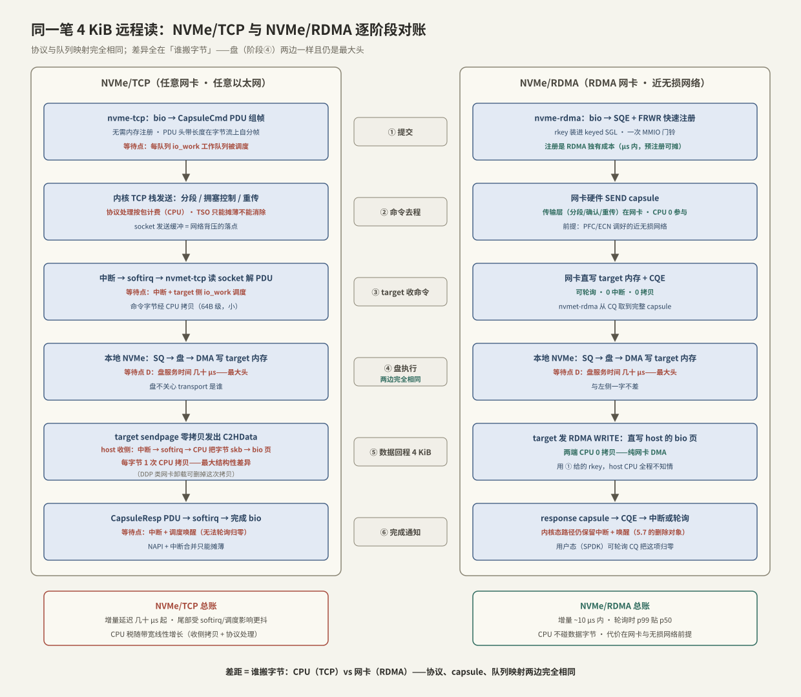

# Transport TCP vs RDMA

> [[5.1 NVMe-oF 架构]] 说 transport 只负责三件事——提交通知、数据搬运、完成通知——并用 RDMA 把机制讲完了。本篇把另一个主角 **NVMe/TCP** 摆上台面：同一套 capsule、同一套「每队列一条连接」的映射，换成 TCP 字节流来承载，一次读写会在哪些步骤多出拷贝、中断与排队。结论先行：**两者的差距不在协议设计，而在「谁来搬字节」——RDMA 让网卡搬，TCP 让两端 CPU 搬**。差的正是 [[4.1 RDMA 为什么快]] 给内核 TCP 记过的那笔账，只是这次它叠加在每一笔远程 IO 上。

前置：[[5.1 NVMe-oF 架构]]（capsule 与队列映射）、[[4.1 RDMA 为什么快]]（内核 TCP 的成本结构：拷贝/陷入/中断三件套）、[[4.5 Send Recv 与 RDMA Read Write]]（单边操作语义）。

---

## 1. 为什么需要第二种 transport【取舍】

RDMA transport 的性能有三个前提（[[4.1 RDMA 为什么快]] §5）：RDMA 网卡、近无损网络（PFC/ECN 调好，[[4.7 PFC ECN 与 DCQCN]]）、以及配套的运维能力。三者缺一，RDMA 的数字就兑现不了——而大多数机房、几乎所有云环境，至少缺一条。

NVMe/TCP 的设计动机就是补这个空档【事实】：**在任意以太网、任意网卡上跑 NVMe-oF，不动交换机一行配置**。它 2018 年进入 NVMe-oF 标准（TP 8000），Linux 5.0 起内核自带 `nvme-tcp`（host）与 `nvmet-tcp`（target）【实现】。

| 前提 | NVMe/RDMA | NVMe/TCP |
| --- | --- | --- |
| 网卡 | RDMA 网卡（RoCE/IB） | 任意网卡 |
| 网络 | 近无损（PFC/ECN 工程） | 任意以太网，容忍丢包 |
| 内核/生态 | rdma-core + 驱动栈 | 内核自带，云环境可用 |
| 运维 | 无损网络体检单（[[4.7 PFC ECN 与 DCQCN]] §8） | 常规 TCP 运维 |

要紧的是：**两种 transport 承载的是同一个协议**。NQN、subsystem、capsule、每核一条队列——[[5.1 NVMe-oF 架构]] 讲的一切原样成立，`nvme connect -t tcp` 与 `-t rdma` 得到的都是 `/dev/nvmeXnY`。差异全部藏在数据面的字节搬运里，这也是为什么对比要按「一次 IO 的逐步对账」来做（§3）。

---

## 2. NVMe/TCP 怎么把 capsule 装进字节流

TCP 是字节流，没有消息边界，所以 NVMe/TCP 定义了一层**PDU（Protocol Data Unit）**做自分帧【事实】：每个 PDU 头部带类型与长度字段，接收方按长度切流——与网络编程里处理「粘包」的定长头方案是同一个思路。

| PDU | 方向 | 作用 |
| --- | --- | --- |
| ICReq / ICResp | 建连 | 每条 TCP 连接先协商 PDU 参数（digest 开关、R2T 深度等） |
| CapsuleCmd | host → target | 命令 capsule（64B SQE，可含内联数据） |
| CapsuleResp | target → host | 响应 capsule（16B CQE） |
| C2HData | target → host | 读数据，target 主动推 |
| R2T | target → host | 「可以发数据了」——写路径的流控许可 |
| H2CData | host → target | 写数据，**只有收到 R2T 才能发** |

三个结构性要点：

1. **每条 NVMe 队列 = 一条 TCP 连接**【事实】：队列映射与 RDMA 的「每队列一条 QP」完全对偶，blk-mq 的每核并行保留；
2. **数据搬运的主动权仍在 target**【事实】：读数据由 target 用 C2HData 推，写数据由 target 用 R2T 拉——[[5.1 NVMe-oF 架构]] §5「target 主导、背压内建」的结论对 TCP 同样成立，R2T 的许可深度就是流控窗口；
3. **可选 digest**：PDU 头与数据可各带一个 CRC32C【事实】。TCP 校验和只有 16 位，检不出某些网络设备内存翻转的错字节；digest 用 CPU 换端到端完整性【取舍】——没有硬件卸载时按字节付费。

小写优化与 RDMA 同款：**in-capsule data** 把数据直接塞进 CapsuleCmd 省掉 R2T 往返，内核 target 的 TCP 端口默认允许 16 KiB 级、可配【实现】。

---

## 3. 核心对账：同一笔 4 KiB 远程读，两条 transport 逐步对比

与 [[5.1 NVMe-oF 架构]] §4 同一场景（host O_DIRECT 随机读 4 KiB，两端内核态），按六个阶段对账：

| 阶段 | NVMe/RDMA | NVMe/TCP | 差异记账 |
| --- | --- | --- | --- |
| ① 提交 | bio → SQE，数据页现场注册（FRWR），rkey 进 keyed SGL | bio → CapsuleCmd PDU 组帧，交给内核 socket；**无需内存注册** | TCP 免注册开销；两边都有驱动工作队列的调度点【实现】 |
| ② 命令去程 | 网卡硬件 SEND，CPU 不参与 | 内核 TCP 栈：分段、拥塞控制、重传定时器——**按包的协议处理费** | TCP 把 [[4.1 RDMA 为什么快]] §1 的协议账请了回来（TSO 等卸载能减不能免） |
| ③ target 收命令 | 网卡直写内存 + CQE，可轮询 | **中断 → softirq → nvmet-tcp 从 socket 读出并解析 PDU** | TCP 多一次中断与一次命令字节拷贝（64B 级，小） |
| ④ 盘执行 | 本地 NVMe：SQ → 盘 → DMA 写 target 内存 | **完全相同** | 等待点 D（几十 μs）两边一样——盘不关心网络 |
| ⑤ 数据回程 | target 发 RDMA WRITE，**直写 host 的 bio 页**，两端 CPU 零拷贝 | target 侧 sendpage 零拷贝发出【实现】；**host 侧：中断 → softirq → CPU 把字节从 skb 拷进 bio 页** | **最大结构性差异：TCP 的 host 接收侧每字节 1 次 CPU 拷贝**，无 DDP 硬件时省不掉 |
| ⑥ 完成 | response capsule → CQE → 中断/轮询 → 唤醒 | CapsuleResp PDU → softirq → 完成 bio → 唤醒 | 内核态下两边都保留中断 + 调度唤醒（[[5.7 内核态 vs 用户态路径]] 的删除对象） |

读账小结【量级】：

- **延迟增量**：RDMA 相对本地盘 ~10 μs 内（[[5.1 NVMe-oF 架构]] 的设计目标）；TCP 常见再多十几到几十 μs，且尾部受 softirq/调度影响显著更抖——具体差值用 [[5.4 延迟分解方法论]] 在自己环境里量；
- **CPU 增量**：⑤ 的接收拷贝按字节计费。粗账：单核 memcpy 十几 GB/s（[[4.1 RDMA 为什么快]] §2.2），10 GB/s 的读流量仅 host 接收拷贝就要 ~1 个核，再加两端协议处理与中断——**IOPS 越高、块越大，TCP 的 CPU 税越重**；
- **盘仍是大头**：④ 两边相同且占几十 μs。小负载下 TCP 的绝对延迟差可能只有百分之几十，这正是它够用的场景边界（§5）。

---

## 4. 写路径：R2T 多半个往返

写路径两边的形状差异比读更明显【事实】：

- **RDMA 写**：CapsuleCmd 带 keyed SGL → target 就绪后主动发 **RDMA READ** 把数据拉过来 → 落盘 → CapsuleResp。数据搬运对两端软件都是「一次动作」，拉取时机由 target 的缓冲与盘节奏决定（[[4.5 Send Recv 与 RDMA Read Write]] §4）；
- **TCP 写**：CapsuleCmd → target 回 **R2T** → host 发 H2CData → 落盘 → CapsuleResp。R2T 是一个**显式的软件往返**：target 的 io 线程要被调度起来发许可，host 的 io 线程要被调度起来发数据——比 RDMA 版本多约半个 RTT 加两次调度点【事实】。

两条消解路径【取舍】：

1. **in-capsule data**：小写随命令同行，R2T 整个消失——代价是 target 为每条连接预留接收缓冲；
2. **加深队列**：R2T 的往返延迟可以被并发掩盖（利特尔法则，[[00. 总纲]] §4）——吞吐型写负载感知不到，QD1 的同步写（比如 WAL 的 fsync 路径，[[1.4 fsync fdatasync 与持久化语义]]）感知最明显。

---

## 5. 成本结构总表与选型

| 维度 | NVMe/RDMA | NVMe/TCP |
| --- | --- | --- |
| 数据拷贝（CPU） | 0（网卡 DMA 直达 bio 页） | 接收侧每字节 1 次（两端各自的收方向） |
| 协议处理 | 网卡硬件 | CPU（TSO/GRO 可摊薄，不可消除） |
| 中断 | 可轮询归零 | NAPI + 中断合并，无法归零 |
| 内存注册 | 每 IO 快速注册或预注册池（[[4.4 内存注册与零拷贝]]） | 不需要 |
| 延迟增量【量级】 | ~10 μs 内 | 几十 μs 起，尾部更抖 |
| 尾延迟来源 | 网络拥塞（PFC 风暴、incast） | softirq 抢核、调度、拥塞重传 |
| 硬件/网络前提 | RDMA 网卡 + 近无损网络 | 无 |
| 连接规模 | QP 上下文占网卡缓存，上万后回落【实现】 | 内核 socket，规模弹性大 |

**选型判断**【取舍】：

- **机房内、延迟敏感的关键路径**（AI 训练读、KV Cache 换入换出）→ RDMA：CPU 税与尾延迟都便宜一个档；
- **云环境、跨可用区、通用硬件、连接数爆炸** → TCP：随处能跑、退化平缓，把省下的运维复杂度折算进延迟预算；
- **不是二选一**：同一个 subsystem 可以同时在 RDMA 端口与 TCP 端口导出【实现】——关键路径走 RDMA、管理与兜底路径走 TCP 是常见部署。

还有一条演化路线值得知道【实现】：部分网卡提供 NVMe/TCP 卸载（DDP——网卡按 PDU 解析直接把数据放进目标页），把 ⑤ 的接收拷贝也拿掉。**「TCP 慢」是实现属性，不是协议宿命**；但依赖特定网卡后，「任意硬件」这条初衷也就打了折扣【取舍】。

---

## 6. 陷阱与误区

> [!warning] 常见错误
> 1. **拿 iperf 带宽预估存储表现**：iperf 测的是大流吞吐，存储要的是小 IO 延迟与 p99——带宽跑满与 4K QD1 延迟好坏几乎无关。
> 2. **把「远程 ≈ 本地 + 10 μs」套到 TCP 上**：那是 RDMA transport 的设计目标；TCP 的增量另算，先测再承诺（[[5.4 延迟分解方法论]]）。
> 3. **TCP transport 裸配就上线**：网卡中断亲和、队列数、中断合并不调，p99 被 softirq 抢核支配——症状像「网络慢」，根因是 host CPU（[[5.4 延迟分解方法论]] §4 的归因签名）。
> 4. **以为 TCP 不需要关心网络质量**：拥塞丢包会触发重传与拥塞窗口回退，尾延迟照样炸——存储 fan-in（多 target 回给一个 host）天然造 incast，只是 TCP 退化得比 RoCE 平缓。
> 5. **忽略 digest 的 CPU 账**：数据 digest 按字节 CRC32C，大带宽下可观；关掉则放弃端到端校验——这是一笔要显式做的取舍，不是默认值随缘。
> 6. **对比测试口径不齐**：MTU、队列数、中断合并、digest 开关任何一项不一致，TCP vs RDMA 的对比数字都不可解释。

---

## 7. 关键结论

| 结论 | 性质 |
| --- | --- |
| TCP 与 RDMA 承载同一个 NVMe-oF 协议：capsule、队列映射、target 主导数据搬运全部一致；差异全在字节搬运方式 | 事实 |
| NVMe/TCP 用 PDU 在字节流上自分帧；每条 NVMe 队列独占一条 TCP 连接 | 事实 |
| 读路径最大结构差异：host 接收侧每字节 1 次 CPU 拷贝（skb → bio 页）；RDMA 为网卡 DMA 直写、CPU 零拷贝 | 事实 |
| 写路径 TCP 多一个 R2T 软件往返；in-capsule data 或加深队列可消解 | 事实 / 取舍 |
| 盘的服务时间两边完全相同且仍是大头——transport 决定的是「增量」，不是全部 | 事实 |
| 延迟增量：RDMA ~10 μs 内，TCP 几十 μs 起且尾部更抖；CPU 税随带宽线性增长 | 量级 |
| RDMA 的快建立在网卡 + 无损网络 + 运维三前提上；TCP 的通用性建立在把搬运费转嫁给 CPU 上——没有免费的一侧 | 取舍 |
| 机房内关键路径选 RDMA，云与通用环境选 TCP，同一 subsystem 可双端口并存 | 实践结论 |
| DDP 类网卡卸载能删掉 TCP 的接收拷贝——「TCP 慢」是实现属性而非协议宿命 | 事实 / 取舍 |

---

## 关联知识

- [[5.1 NVMe-oF 架构]] - capsule 与队列映射：两种 transport 共享的骨架
- [[4.1 RDMA 为什么快]] - 内核 TCP 的成本三件套：本篇 TCP 侧账目的出处
- [[4.5 Send Recv 与 RDMA Read Write]] - RDMA 侧数据搬运的单边操作语义
- [[4.7 PFC ECN 与 DCQCN]] - RDMA 的「近无损网络」前提怎么建
- [[4.4 内存注册与零拷贝]] - RDMA 独有的注册成本与预注册池
- [[5.3 Host 与 Target]] - 两端软件栈内部：本篇的调度点都藏在哪
- [[5.4 延迟分解方法论]] - 把「TCP 比 RDMA 慢多少」量成自己环境的数字
- [[5.7 内核态 vs 用户态路径]] - 两种 transport 都留下的中断与唤醒，SPDK 怎么删
