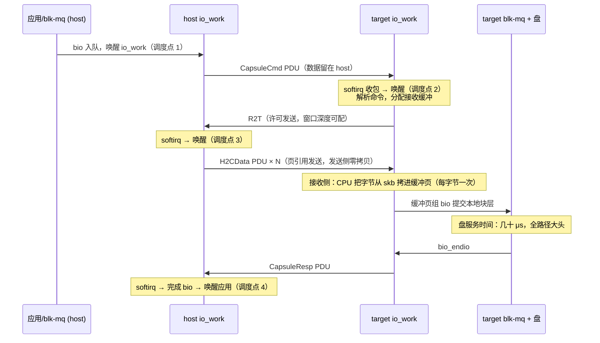

---
tags:
  - 高性能存储/NVMe-oF与SPDK
status: 已完成
---

# NVMe-oF TCP Transport 数据路径

> [[5.2 Transport TCP vs RDMA]] 给过总账：TCP transport 的差距不在协议设计，在「谁来搬字节」。本篇把 TCP 这一侧下钻到机制级：一笔 IO 在内核里怎么流转、那次「每字节 CPU 拷贝」到底发生在哪一行逻辑上、为什么数据面**一次系统调用都没有**、以及调优的旋钮各拧在哪。给熟悉用户态网络编程的读者先校准一个认知：**nvme-tcp 是内核模块，socket 由内核代码直接驱动——你熟悉的 `send()/epoll` 循环在这里都存在同构物，但全部搬进了内核、以每队列一个工作项的形式运转**。

前置：[[5.2 Transport TCP vs RDMA]]（PDU 与 R2T 的定义、六阶段对账）、[[5.3 Host 与 Target]]（io_work 与两端软件栈）、[[1.7 块层与 blk-mq]]（bio 从哪来）、[[5.18 Queue 建立过程]]（每队列一条 TCP 连接怎么建成）。

---

## 1. 名词与三个前提

先复习两个词（详细定义在 [[5.2 Transport TCP vs RDMA]] §2）：**PDU** 是 NVMe/TCP 在字节流上自分帧的消息单元——带类型与长度的头部，和网络编程处理粘包的定长头方案同一思路；**R2T（Ready to Transfer）** 是写路径上 target 发给 host 的「可以发数据了」许可。

三个决定整条路径形状的前提【事实】：

1. **每条 NVMe 队列独占一条 TCP 连接**，blk-mq 的每核并行原样保留（[[5.18 Queue 建立过程]]）；
2. **数据面没有系统调用**：应用的 `read()/io_uring` 陷入发生在块层入口；从 bio 往下，nvme-tcp 在内核里直接调用 socket 的内核接口收发，没有第二次陷入——用户态网络程序的「每次 send/recv 一次 syscall」的账，这里不存在；
3. **每条队列一个专属工作项（io_work）**，绑定固定 CPU【实现】：它就是这条连接的「单线程事件循环」——组帧、发送、解析、完成全在这个上下文里串行执行，和 one loop per thread 的 Reactor 是同构物。代价：请求提交与实际发送之间隔着一次 workqueue 调度（[[5.3 Host 与 Target]] §4 的等待点 H-b）。

---

## 2. 发送路径：零拷贝的一侧

以 host 发命令/数据为例（target 回数据同理），io_work 被调度后做三件事【实现】：

1. **组帧**：把请求组装成 PDU——命令头是新写的几十字节；**数据部分不拷贝**，直接把 bio 页的引用挂进 socket（内核页引用发送，`sendpage`/`MSG_SPLICE_PAGES` 机制），网卡最终 DMA 读走的是原始页【事实】；
2. **交给内核 TCP 栈**：分段（TSO 卸载到网卡）、拥塞控制、重传定时器照常运转——[[4.1 RDMA 为什么快]] 给内核 TCP 记的「按包协议处理费」这里如数支付，卸载能摊薄不能消除；
3. **Nagle 已关闭**【实现】：驱动对连接设置 `TCP_NODELAY`——存储的小命令等不起「攒一批再发」的延迟。

所以**发送侧本来就接近零拷贝**。TCP transport 的拷贝账几乎全部记在接收侧。

---

## 3. 接收路径：那次「每字节拷贝」在哪

接收方向的完整链条（host 收读数据、target 收写数据，机制相同）【事实/实现】：

```text
网卡收包 → 中断 → NAPI/GRO 聚合（softirq 上下文）→ 数据暂存内核 skb
  → 唤醒该队列的 io_work → 按 PDU 头切流、找到这笔 IO 对应的 bio
  → CPU 把数据从 skb 逐字节拷进 bio 页（这就是那次拷贝）
  → PDU 收完 → 完成 bio → 唤醒应用
```

为什么这次拷贝省不掉【事实】：网卡收包时**不知道**这段字节属于哪笔 IO、该落到哪个 bio 页——TCP 是字节流，IO 归属要等 CPU 解析 PDU 头才知道。对照 RDMA：rkey 让网卡在硬件层就知道落点，所以能 DMA 直写（[[5.19 RDMA Transport 数据路径]] §2 第⑦步）。部分网卡的 **DDP 卸载**把 PDU 解析下放到网卡、恢复直写能力——但那就引入了「特定硬件」前提，通用性打折【取舍】。

这条链上有两类按量计费的成本【量级】：

- **CPU**：拷贝按字节计费——单核 memcpy 十几 GB/s，10 GB/s 的接收流量仅拷贝就吃约一个核，加上协议处理与 softirq，**带宽越大 CPU 税越重**；
- **调度**：中断 → softirq → io_work 两次交接，每次都是潜在排队点。CPU 空闲时只有几 μs，CPU 忙时排队时间直接进 p99——这是 TCP transport 尾延迟比 RDMA 抖的机制根源（[[5.3 Host 与 Target]] §4）。

**亲和链**因此比 RDMA 更要紧【实践】：网卡中断向量 → softirq 所在核 → io_work 绑定核 → blk-mq hctx 四者对齐，数据才不跨核弹跳。驱动会尽力对齐（按 socket 的入包 CPU 安置 io_work），但改中断亲和、isolcpus 后要复核。

---

## 4. 全时序：一笔 16 KiB 写（含 R2T）

超过 in-capsule 上限的写最能暴露 TCP 路径的全部调度点：



对账【事实】：与 RDMA 写路径相比，多出 **一个 R2T 软件往返**（约半个 RTT + 两次调度）与**一次接收侧数据拷贝**；小写用 in-capsule data 可消掉 R2T（[[5.2 Transport TCP vs RDMA]] §4）。读路径更简单：没有 R2T，target 直接推 C2HData，拷贝发生在 host 接收侧。

---

## 5. 旋钮与取舍

| 旋钮 | 默认行为 | 拧它的理由 | 代价 |
| --- | --- | --- | --- |
| digest（头/数据 CRC32C） | 建连时协商，可关 | TCP 校验和只有 16 位，检不出某些设备内存翻转 | 数据 digest 按字节烧 CPU【取舍】 |
| 队列数 `--nr-io-queues` | 每核一条 | 大集群收敛连接账（[[5.18 Queue 建立过程]] §5） | 多核共享队列的提交侧锁竞争 |
| in-capsule 上限 | 内核 target 默认 KiB 级、可配 | 小写省 R2T 往返 | target 按深度预留缓冲 |
| 中断合并（`ethtool -C`） | 网卡默认 | 高 IOPS 下摊薄中断 | 合并窗口直接加进延迟——延迟敏感负载要调小 |
| MTU / 巨帧 | 1500 | 大块 IO 减少每包处理费 | 全路径（交换机、两端）必须一致，否则黑洞难查 |
| 轮询队列 `--nr-poll-queues` | 关 | 用 busy-poll 削掉中断与 softirq 交接（较新内核支持，版本相关【实现】） | 烧核换延迟——方向与 SPDK 一致（[[5.7 内核态 vs 用户态路径]]） |

**适用边界**（呼应 [[5.2 Transport TCP vs RDMA]] §5 的选型）：TCP transport 的定位是「任意网络、任意网卡上能用的 NVMe-oF」；延迟敏感的机房内关键路径，结构性差距（接收拷贝 + 调度点）调参无法抹平，只能靠 DDP 卸载或换 RDMA。

---

## 6. 对照实验与排障清单

**对照实验**（验证 §3 的 CPU 账与调度账）：固定 fio 负载（4 KiB randread），变量一：QD ∈ {1, 32}；变量二：digest 开/关；变量三：中断合并大/小。三路同窗观测：

```bash
fio --filename=/dev/nvme1n1 --rw=randread --bs=4k --iodepth=1 --direct=1 \
    --time_based --runtime=60 --ioengine=io_uring --lat_percentiles=1 --name=probe
mpstat -P ALL 5          # 看 %soft 与 %sys 集中在哪个核——接收拷贝与 softirq 的账
nstat -az TcpRetransSegs # 重传必须为零，否则先修网络再谈调优
ss -ti dport = :4420     # 逐连接 RTT/cwnd——每条队列一条连接，逐条看
```

预期签名：QD1 延迟差主要来自调度点；高 QD 下 CPU 差来自拷贝与协议处理；digest 打开后大块负载 `%sys` 显著上升。

**排障清单**：

| 症状 | 首要嫌疑 | 检查动作 |
| --- | --- | --- |
| 延迟比预期高且抖，重传为零 | softirq 抢核、亲和链断裂 | `mpstat -P ALL` 找被打满的核；`/proc/interrupts` 对网卡中断分布；核对 io_work 与中断是否同核 |
| p99 尖刺 + 重传计数增长 | 网络拥塞/incast、交换机丢包 | `nstat -az TcpRetransSegs` 增速；`ss -ti` 的 rtt 膨胀；交换机队列计数 |
| 带宽上不去，单核 100% | 接收拷贝 + 协议处理挤在一个核 | 队列数是否为 1、RSS/中断是否没打散；`ethtool -S` 每队列包计数 |
| 大块 IO 慢、小块正常 | MTU 不一致、digest 按字节计费 | 路径 MTU 逐跳核对；对照 digest 开关重测 |
| 写延迟明显高于读 | R2T 往返未被并发掩盖 | QD1 同步写属最坏场景；核对 in-capsule 是否生效（写大小 vs 上限） |
| 连接反复断连重连 | 对端超时、防火墙状态表、keep-alive | `dmesg` 时间线；状态与参数见 [[5.21 Controller Loss Timeout]] |

---

## 7. 陷阱与误区

> [!warning] 常见错误
> 1. **用用户态网络直觉推内核路径**：nvme-tcp 数据面没有系统调用，瓶颈不在陷入，在拷贝与调度——优化方向别搞错对象。
> 2. **「TCP 卸载都开了所以接近 RDMA」**：TSO/GRO 摊薄的是协议处理，**接收侧每字节拷贝一分没少**——那是结构性差异，只有 DDP 类卸载能删。
> 3. **中断合并只调网卡不看延迟**：合并窗口是直接加在每笔 IO 上的延迟；吞吐型与延迟型负载的合并参数方向相反。
> 4. **裸配上线**：默认配置下亲和不齐、合并保守，p99 被 softirq 支配——症状像网络慢，根因是 host CPU（[[5.4 延迟分解方法论]] §4 签名表）。
> 5. **关 digest 不留记录**：关掉是放弃端到端校验换 CPU，这是一笔要显式记录的取舍，不是默认优化项。
> 6. **对比测试口径不齐**：MTU、队列数、合并、digest 任一不一致，TCP vs RDMA 的对比数字不可解释（[[5.2 Transport TCP vs RDMA]] §6）。

---

## 8. 关键结论

| 结论 | 性质 |
| --- | --- |
| nvme-tcp 是内核模块：数据面零系统调用；每队列一条连接 + 一个绑核 io_work（内核版事件循环） | 事实 / 实现 |
| 发送侧近零拷贝（页引用直挂 socket）；接收侧每字节一次 CPU 拷贝——因为 IO 归属要等 CPU 解析 PDU 才知道 | 事实 |
| 中断 → softirq → io_work 的两次交接是尾延迟的机制根源；CPU 忙时排队直接进 p99 | 事实 |
| 写路径多一个 R2T 软件往返；in-capsule data 消 R2T，深队列掩盖它 | 事实 / 取舍 |
| CPU 税随带宽线性增长：10 GB/s 接收流量约一个核只干拷贝 | 量级 |
| 亲和链（中断 → softirq → io_work → hctx）对齐是 TCP transport 调优的第一课 | 实践结论 |
| digest、中断合并、MTU、轮询队列都是显式取舍——每个旋钮两头都有代价 | 取舍 |
| 结构性差距（拷贝 + 调度）调参不可抹平；上限突破靠 DDP 卸载或换 RDMA | 事实 / 取舍 |

---

## 关联知识

- [[5.2 Transport TCP vs RDMA]] - PDU/R2T 定义与两种 transport 的总对账
- [[5.19 RDMA Transport 数据路径]] - 同一笔 IO 的 RDMA 版本，对照阅读
- [[5.3 Host 与 Target]] - io_work、等待点编号与亲和链
- [[5.18 Queue 建立过程]] - 每队列一条连接的由来与队列数取舍
- [[1.7 块层与 blk-mq]] - bio 的来处与 tag 背压
- [[4.1 RDMA 为什么快]] - 内核 TCP 成本三件套的出处
- [[5.4 延迟分解方法论]] - 「网络慢还是 CPU 慢」的归因方法
- [[5.7 内核态 vs 用户态路径]] - 轮询替换中断的系统化方案

## 参考

- NVMe/TCP Transport Specification（TP 8000）：PDU 类型、R2T、digest 协商
- Linux 内核 `drivers/nvme/host/tcp.c`、`drivers/nvme/target/tcp.c`：io_work、页引用发送、接收拷贝路径
