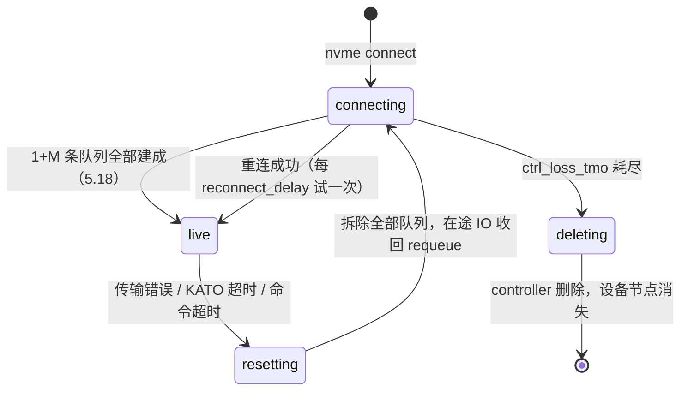

---
tags:
  - 高性能存储
  - NVMe-oF与SPDK
status: 已完成
---

# Controller Loss Timeout

> [[5.1 NVMe-oF 架构]] 埋过一句伏笔：远端盘不是快速 EIO，是 **hang**。本篇回答「hang 多久、谁说了算」。答案是一组分层的定时器：**命令级超时**发现单笔 IO 卡死，**KATO 心跳**发现对端静默死亡，**reconnect_delay / ctrl_loss_tmo** 决定断链后挣扎多久、什么时候彻底放弃——最后这个「放弃期限」就是标题的 Controller Loss Timeout（CLT）。这些参数不是内核细节，是**业务可见行为的开关**：同一次网络抖动，参数不同，应用看到的可能是 30 秒延迟凸起、也可能是文件系统直接变只读。

前置：[[5.3 Host 与 Target]]（controller 与 keep-alive 的由来）、[[5.18 Queue 建立过程]]（断链后要重建的正是那 1+M 条队列）、[[3.13 Command Timeout 与 Controller Reset]]（本地盘的超时原型）、[[5.5 Multipath 与故障切换]]（有备路时这些参数怎么配合）。

---

## 1. 先把名词说清楚

- **controller（控制器）**：host 与 target 之间的会话实体——一次 `nvme connect` 创建一个，由 1 条 Admin 队列 + M 条 IO 队列组成（[[5.18 Queue 建立过程]] §2）。「controller loss」指**这个会话失联**：网线断了、target 死了、或者只是丢包严重——此刻 host 无法区分（区分方法是 [[5.22 网络故障与 Target 故障差异]] 的主题），数据本身并没有丢；
- **KATO（Keep Alive Timeout）**：Admin 队列上的心跳契约。host 以小于 KATO 的周期发 Keep Alive 命令，超过 KATO 量级收不到对方的回应，双方各自判定对端死亡【实现】。它是**静默故障的兜底**——有信号的死（TCP RST、链路 down、QP 进 error）不用等它，ms 级就能发现（[[5.5 Multipath 与故障切换]] §1）；
- **为什么默认「等」而不是「死」**【取舍】：本地盘的故障模型里，控制器失联≈硬件坏了，快失败合理（[[3.13 Command Timeout 与 Controller Reset]]）；网络上**抖动是常态**——交换机升级、链路闪断，几秒后世界恢复原样。内核默认把断链当抖动处理：hang 住重试，而不是立刻向应用报错。这个默认对不对，取决于你有没有备路（§4）。

---

## 2. 三层定时器

| 层 | 参数 | Linux 默认【实现】 | 管什么 |
| --- | --- | --- | --- |
| 命令级 | `io_timeout`（nvme_core 模块参数） | 30 s | 单笔 IO 超时 → 触发 controller reset，进入重连循环 |
| 连接级 | KATO（`nvme connect --keep-alive-tmo`） | 5 s | 静默死亡的检测上限；有信号的死不经过它 |
| 控制器级 | `reconnect_delay` | 10 s | 断链后每隔多久试一次重连 |
| 控制器级 | `ctrl_loss_tmo` | 600 s | 重连总预算；耗尽即删除 controller；**-1 = 永不放弃** |
| 控制器级 | `fast_io_fail_tmo` | 关闭（-1） | 重连期间让 IO 提前失败返回的时限（§4） |

三层的关系【事实】：命令级和连接级负责**发现**故障（谁先触发都一样），控制器级负责**故障之后的策略**。检测窗口 = min(有信号的 ms 级事件, KATO, 卡住命令的 io_timeout)——最坏情况是静默死且无在途 IO，等满一个 KATO 周期。

---

## 3. 状态机与 IO 的命运



每个状态下 IO 的行为【事实】——这是全篇最需要记住的表：

| 状态 | 新 IO | 在途 IO | 应用感受 |
| --- | --- | --- | --- |
| live | 正常下发 | 正常完成 | 正常 |
| resetting / connecting | 在块层排队（requeue），**不报错** | 收回、排队等重发 | **hang**：延迟凸起，无错误 |
| connecting 且 `fast_io_fail_tmo` 已到期 | 立即失败返回 | 失败返回 | 得到 IO 错误，上层可另作处理 |
| deleting（ctrl_loss_tmo 耗尽） | 失败 | 失败 | **设备消失**：`/dev/nvme1n1` 被移除；挂着的文件系统报错、常见转只读 |

一次静默故障的时间线（全部默认值、单路径）【量级】：

```text
t0        链路静默断（无任何信号）
t0+≤5s    KATO 到期判死 → resetting → connecting；在途 IO 收回 requeue
t0+~5s 起 每 10 s（reconnect_delay）重试一次重连——期间应用持续 hang
t0+605s   ctrl_loss_tmo（600 s）耗尽 → 删除 controller → 设备消失，IO 报错
```

**恢复的代价**也要知道【事实】：重连成功 = 重新走一遍 [[5.18 Queue 建立过程]] 的全或无流程（1+M 条队列重建）；requeue 的 IO 随后重发——块读写幂等使重发安全（[[5.5 Multipath 与故障切换]] §5）。target 重启后所有 host 同时进入 connecting 的重连风暴，会挤压刚恢复的 target（[[5.16 Discovery Controller]] §6）。

---

## 4. 与 multipath 的交互：两套目标，两套参数

这组参数的合理取值**取决于有没有备路**【取舍】：

| 部署 | 目标 | 建议方向 |
| --- | --- | --- |
| **双路径（native multipath）** | 坏路快让位，好路快接管；坏路慢慢修 | 检测靠 ANA/传输事件（[[5.5 Multipath 与故障切换]]），native multipath 在路径失效时即把 IO 改道备路；`ctrl_loss_tmo` 给长（600 s 甚至 -1）——路径修好自动回表，删掉反而要人工重连 |
| **上层自管冗余**（dm-multipath / 应用层副本） | 内核别替我 hang，把错误交上来 | 设 `fast_io_fail_tmo`（如 5–15 s）：重连没指望时尽快把 IO 失败返回，让上层切换 |
| **单路径** | hang 比死好——只要业务超时预算兜得住 | 不设 `fast_io_fail_tmo`（提前 EIO 只会更糟）；`ctrl_loss_tmo` 至少覆盖 target 计划内维护窗口（升级重启 + 余量），否则一次例行升级 = 全体 host 设备消失 |

一条必须成立的不等式【实践】——超时预算从下往上逐层加余量：

```text
检测窗口（≤KATO） + 首次重连耗时  <  应用/上层的 IO 超时  <  编排系统的健康判死阈值
```

左边不成立：每次网络抖动应用先崩（内核还在正常重连，应用已经放弃）。右边不成立：hang 窗口内 Kubernetes liveness 探针超时把 Pod 杀掉——存储没死，业务被自己的探针打死（[[10.6 健康检查与故障摘除]] 的同一道题）。

---

## 5. 观测、演练与一个最小探针

**观测点**【实践】：

```bash
nvme list-subsys -v                    # 每个 controller 的 state：live / connecting / ...
cat /sys/class/nvme/nvme1/state        # 同上，可脚本化
dmesg -T | grep -iE "nvme.*(error recovery|reconnect|removing)"
# 典型时间线三段式：starting error recovery → Reconnecting in 10 seconds → (成功回 live 或 Removing)
```

**演练**（参数改之前先量出自己环境的真实窗口，[[9.6 故障注入矩阵]]）：

- 有信号故障：target 侧 `ip link set <网卡> down`——检测应为 ms～s 级；
- 静默故障：target 侧 `iptables -A INPUT -p tcp --dport 4420 -j DROP`（不回 RST，最像交换机静默丢包）——检测应约等于 KATO；
- 全程跑 QD1 fio 观察延迟凸起的宽度，与 dmesg 时间线对账。

状态跳变的时间戳靠肉眼盯 `dmesg` 容易漏，用一个最小探针把「state 变化 + 本机单调时钟」记下来（RAII：文件句柄由 `ifstream` 作用域管理；单调钟避免 NTP 跳变污染时长，同 [[5.4 延迟分解方法论]] 军规 3）：

```cpp
#include <chrono>
#include <filesystem>
#include <fstream>
#include <print>
#include <string>
#include <thread>

// 轮询 /sys/class/nvme/<ctrl>/state，状态跳变时打印相对时间戳。
// 用途：演练时量出「断链 → 判死 → 回 live」各段的真实耗时。
int main(int argc, char* argv[]) {
    const std::filesystem::path state_file =
        std::filesystem::path{"/sys/class/nvme"} / (argc > 1 ? argv[1] : "nvme1") / "state";
    using Clock = std::chrono::steady_clock;
    const auto t0 = Clock::now();
    std::string last;
    while (true) {
        std::string cur;
        if (std::ifstream in{state_file}; !std::getline(in, cur)) cur = "<gone>";  // 设备被删除
        if (cur != last) {
            const auto ms = std::chrono::duration_cast<std::chrono::milliseconds>(Clock::now() - t0);
            std::println("[{:>8}ms] {} -> {}", ms.count(), last.empty() ? "<start>" : last, cur);
            if (cur == "<gone>") return 0;   // ctrl_loss_tmo 耗尽的终点
            last = cur;
        }
        std::this_thread::sleep_for(std::chrono::milliseconds{100});
    }
}
```

**排障清单**：

| 症状 | 首要嫌疑 | 检查动作 |
| --- | --- | --- |
| IO hang 约十分钟后报错、设备消失 | `ctrl_loss_tmo` 默认 600 s 耗尽 | `dmesg` 里 Removing 时间戳减去 error recovery 时间戳 ≈ 600 s 即实锤；恢复后重新 connect，再评估 §4 调参 |
| 网络一抖应用就超时崩溃 | 应用超时 < 检测窗口，预算倒挂 | 对照 §4 不等式；应用超时至少覆盖 KATO + 首次重连 |
| state 长期停在 connecting | target 没恢复、ACL/端口配置变了、防火墙 | target 侧 configfs 核对（[[5.3 Host 与 Target]] §3）；host 侧手工 `nvme discover` 验证可达性 |
| 频繁 live ↔ resetting 震荡 | 网络丢包/拥塞把心跳打丢，KATO 误判 | `nstat -az TcpRetransSegs`、`ethtool -S` 丢包计数——先修网络，不是调大 KATO 完事（[[5.22 网络故障与 Target 故障差异]]） |
| target 重启后集群 p99 抖几分钟 | 全员重连风暴 + 队列重建挤压 target | 重连打散/退避；见 [[5.16 Discovery Controller]] §6 |
| 设了 fast_io_fail 后应用大量 EIO | 单路径上误用——没人接住提前返回的错误 | 单路径撤掉该参数；它只服务于「上层有冗余」的部署 |

---

## 6. 陷阱与误区

> [!warning] 常见错误
> 1. **把 hang 当 bug**：resetting/connecting 期间 IO requeue 不报错是**设计行为**——数据没丢，在排队。恐慌性重启应用只会叠加故障。
> 2. **`ctrl_loss_tmo = -1` 一把梭**：永不放弃意味着设备永不消失——target 已物理报废，host 上还挂着一个永远 connecting 的僵尸设备，编排层以为存储还在。无人值守场景要配监控告警兜底。
> 3. **单路径设 `fast_io_fail_tmo`**：没有备路时提前失败 = 把可自愈的抖动升级成应用错误，纯粹变糟。
> 4. **KATO 调小求快检测**：检测灵敏度与误判率是同一旋钮的两端（[[5.5 Multipath 与故障切换]] §7）——丢包环境下小 KATO 制造 reset 震荡，自己生产尾延迟。
> 5. **只演练拔线**：link down 是 ms 级检测的善良故障；真正考验参数的是 iptables DROP 式静默死——演练矩阵两种都要有（[[9.6 故障注入矩阵]]）。
> 6. **忘了 ctrl_loss_tmo 之后的世界**：设备消失对挂载中的文件系统是硬伤（报错/转只读），恢复要人工介入——「放弃」的代价远大于「多等」，这是默认值给到 600 s 的原因。

---

## 7. 关键结论

| 结论 | 性质 |
| --- | --- |
| 三层定时器分工：io_timeout/KATO 负责发现，reconnect_delay/ctrl_loss_tmo 负责策略；检测窗口最坏 ≈ KATO | 事实 |
| 状态机 live → resetting → connecting → live/deleting；重连期间 IO requeue 不报错——hang 是设计行为 | 事实 |
| ctrl_loss_tmo 耗尽 = 设备消失，对上层是比 hang 严重得多的事件；默认 600 s、-1 为永不放弃 | 事实 |
| Linux 默认量级：KATO 5 s、reconnect_delay 10 s、ctrl_loss_tmo 600 s、fast_io_fail 关闭 | 实现 |
| 参数随部署形态走：双路径靠 multipath 快切 + 长 ctrl_loss_tmo；上层自管冗余用 fast_io_fail 快交错误；单路径用长预算硬扛 | 取舍 |
| 超时预算不等式：检测 + 首次重连 < 应用超时 < 编排判死阈值——两头破坏都会把小故障放大 | 实践结论 |
| 重连成功 = 1+M 条队列全或无重建；requeue 重发安全的前提是块读写幂等 | 事实 |
| 参数调整前先注入故障量出自己环境的真实检测/恢复窗口——默认值不是你的值 | 实践结论 |

---

## 关联知识

- [[5.3 Host 与 Target]] - keep-alive 与重连参数的第一次出场
- [[5.18 Queue 建立过程]] - 重连时全或无重建的正是这套队列
- [[5.5 Multipath 与故障切换]] - 有备路时检测/切换/回表的完整机制
- [[5.22 网络故障与 Target 故障差异]] - 「失联」背后到底是谁死了：区分方法
- [[3.13 Command Timeout 与 Controller Reset]] - 本地盘的超时与 reset 原型
- [[5.16 Discovery Controller]] - 重连风暴的目录侧视角
- [[9.6 故障注入矩阵]] - 有信号 / 静默两类故障的注入方法
- [[10.6 健康检查与故障摘除]] - 编排层判死阈值：同一道两难题
- [[5.4 延迟分解方法论]] - 单调时钟计时的军规出处

## 参考

- NVM Express Base Specification：Keep Alive 命令与 KATO 语义
- Linux 内核 `drivers/nvme/host/fabrics.c`（`ctrl_loss_tmo`、`reconnect_delay`、`fast_io_fail_tmo`、`kato` 参数）、`drivers/nvme/host/core.c`（controller 状态机）
