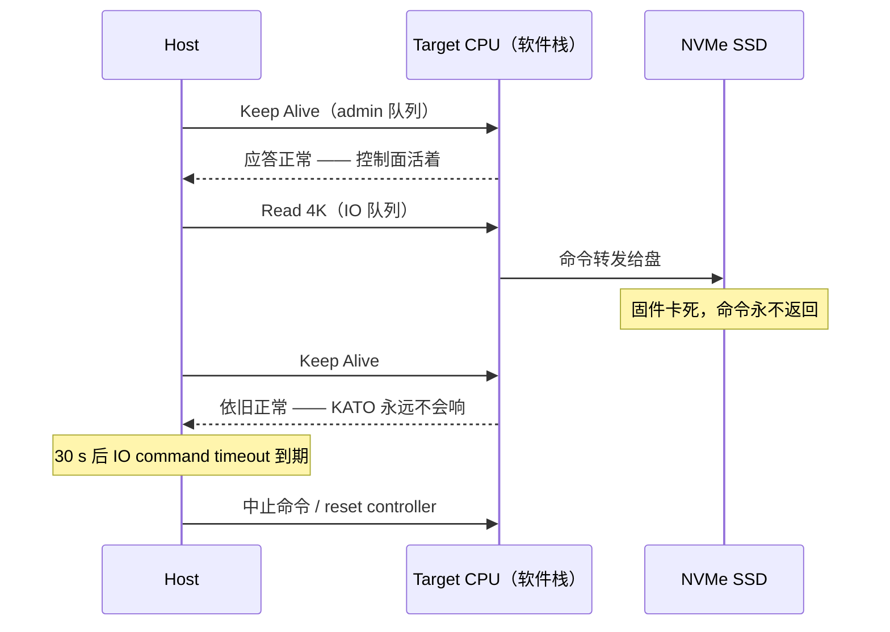

---
tags:
  - 高性能存储
status: 已完成
---

# 网络故障与 Target 故障差异

> [[5.5 Multipath 与故障切换]] 讲了「一条路死了怎么切」，但它跳过了一个更早的问题：**你怎么知道死的是路，还是路那头的人？** NVMe-oF 里 host 通过网络访问远端存储节点（target），一笔 IO 不返回时，host 看到的症状常常一模一样——「对端沉默」。可根因完全是两码事：网线断了，target 好好的，切条路就活；target 的盘卡死了，切路只是换个门敲同一间空屋。用同一套处理逻辑对付两类故障，轻则恢复变慢，重则重试风暴把半死的 target 彻底压死。本篇把两类故障拆开：症状上怎么区分、各层超时谁先响、恢复动作差在哪、以及怎么在测试环境里把每一种死法都演练一遍。

前置：[[5.3 Host 与 Target]]（host/target 各自的角色）、[[5.5 Multipath 与故障切换]]（KATO 检测与切换时序）、[[3.13 Command Timeout 与 Controller Reset]]（单条命令超时的处理）。

---

## 1. 先把故障域画出来：一笔 IO 要穿过谁

一笔远端 IO 从发出到返回，串起这些部件【事实】：

```text
host 应用 → host 内核/网卡 → 网线 → 交换机 → 网线 → target 网卡
        → target 软件栈（网络协议处理 + IO 转发）→ NVMe SSD → 原路返回
```

按「坏的东西在哪」分两大类【事实】：

| 类别 | 定义 | 典型例子 | 此时另一方 |
| --- | --- | --- | --- |
| **网络故障** | host 与 target 之间的传输通道坏了 | 网线松、交换机重启、链路丢包、路由黑洞 | target 本身健康，换条路就能到 |
| **Target 故障** | 存储节点自身坏了 | target 进程崩溃/死锁、整机宕机、盘固件卡死、盘介质坏 | 网络健康，报文能到达，但没人干活或干不完活 |

还有一块灰色地带【实践】：**拥塞与部分丢包**——链路没断但质量劣化（丢 1% 的包、RTT 翻十倍）。它既不触发断连也不触发超时，只让 p99 爆炸，是三类里最难定位的（§6 的演练必须覆盖它）。

为什么要较真这个分类【实践】：恢复动作完全不同。网络故障的解药是**换路**（multipath）；target 故障的解药是**修人**（重启进程、reset 盘、集群层摘除节点）。拿换路去治 target 故障，两条路轮流超时，就是 [[5.5 Multipath 与故障切换]] §7 说的切换风暴。

---

## 2. Host 手里只有三种信号

Host 无法「看见」远端发生了什么，只能靠三种可观测信号推断【事实】：

1. **传输层事件**：TCP 收到 RST、链路 link down、RDMA 的 QP 进 error 态——有明确的「出事了」通知；
2. **超时**：等某个应答等到计时器到期——沉默本身作为证据；
3. **NVMe 状态码与异步事件**：target 明确回复「这条命令失败了」（错误状态码）或主动上报（AEN，[[3.14 AER 异步事件]]）。

把两类故障按「有没有信号」再切一刀，得到四象限【事实/实践】：

| | 有信号 | 无信号（沉默） |
| --- | --- | --- |
| **网络故障** | 本地网卡 link down、RDMA QP error——**信号在本地产生**，ms 级感知 | 交换机静默丢包、路由黑洞——只能等超时 |
| **Target 故障** | TCP RST（进程崩溃时内核代发）、NVMe 错误状态码、AEN——**信号从对端传来** | 进程被冻结/死锁、整机掉电、盘 hang——同样只能等超时 |

两个关键推论：

- **有信号的故障好办**：信号本身携带位置信息。RST 说明 target 的**内核还活着但进程死了**（RST 是 OS 在进程退出后代为拒绝）；link down 说明问题在本地链路；错误状态码说明 target 全程在线、只是这条命令办不成。
- **沉默的故障，带内（in-band）不可区分**【事实】：网络黑洞和 target 整机掉电，在 host 看来是同一种沉默。想分辨只有两条路——**换条路再试**（第二条独立路径通 → 大概率是第一条路的网络问题；也不通 → 大概率 target 死了，multipath 顺便当了诊断工具），或者**带外确认**（从第三台机器 ping target、看 target 自己的监控心跳，[[9.8 Runbook 与可运维产物]]）。

---

## 3. 超时层级：谁先响，决定你看到什么错

Host 侧同时跑着好几个计时器，故障的「呈现形式」由最先到期的那个决定【实现】：

| 计时器 | 盯着什么 | Linux 默认 | 到期动作 |
| --- | --- | --- | --- |
| KATO（Keep Alive Timeout） | **连接活性**：host 周期发 Keep Alive 命令，双方都拿它当心跳 | 5 s | 判定 controller 失联 → 拆连接、进重连循环 |
| IO command timeout | **单条命令**：从提交到完成的时长 | 30 s（`nvme_io_timeout`） | 超时处理：中止命令 → reset controller（[[3.13 Command Timeout 与 Controller Reset]]） |
| `ctrl_loss_tmo` | **放弃线**：重连多久算彻底失败 | 600 s | 放弃该 controller，上层报错 |
| 应用超时 | 业务自己定的 deadline | 业务各异 | 业务报错/重试 |

这套层级里藏着本篇最重要的一个区分手段【事实】：

> **KATO 正常 ≠ target 健康。** Keep Alive 是一条 admin 命令，由 target 的 CPU 直接应答，不经过盘。所以「心跳正常、IO 超时」这个组合，精确指向 **target 数据面故障**（盘 hang、IO 转发路径死锁）——控制面活着，数据面死了。

用时序图看这个最容易误诊的场景（盘固件卡死）：



反过来，**KATO 超时**（连 Keep Alive 都没应答）说明整条「host↔target CPU」的通路断了——网络黑洞、target 进程冻结、整机宕机，三者居其一，进入 §2 说的「带内不可区分」区。

另一条军规从层级直接推出【实践】：**各层超时必须从下往上递增**。应用超时 1 s、KATO 5 s 的配置下，每次网络抖动都是应用先崩、存储层还没来得及切换——应用把锅甩给存储，实际是超时预算倒挂（[[5.5 Multipath 与故障切换]] §7 同款陷阱）。

---

## 4. 恢复路径：同一个症状，两张处方

诊断的意义在于处方不同【实践】：

| 判定 | 依据信号 | 正确动作 | 错误动作及其代价 |
| --- | --- | --- | --- |
| 单路网络故障 | link down / QP error / 仅一条路沉默 | multipath 切路（μs 级重排，[[5.5 Multipath 与故障切换]]），后台按 `reconnect_delay` 重连原路 | 原地死等重连——白白吃满检测窗口 |
| target 进程崩溃 | TCP RST，重连立刻再被 RST | 停止无意义的快速重连（退避），等进程重启或集群层拉起；多路径**无效**（两条路通向同一具尸体） | 疯狂重连 = 重启风暴，进程刚起来就被连接洪峰打垮 |
| target 数据面故障 | KATO 正常 + IO 超时 | host 侧 reset controller 试一次（[[3.13 Command Timeout 与 Controller Reset]]）；不行则 target 侧介入（reset 盘、重启服务），集群层摘盘（[[10.6 健康检查与故障摘除]]） | 切路重试——每条路都在同一块死盘上再排队 30 s，尾延迟成倍叠加 |
| target 明确报错 | NVMe 错误状态码（介质错等） | 按语义处理：介质错不重试、向上层报 EIO；瞬态错误有限重试 + 退避 | 无脑重试——对确定性失败重试 N 次 = 延迟 ×N，还遮住了真实根因 |
| 灰色故障（丢包/拥塞） | 无断连无超时，仅 p99 上涨、TCP 重传计数上涨 | 按 [[5.4 延迟分解方法论]] 分段定位，网络侧排查；必要时手动切路 | 等它自己触发超时——它不会，SLO 先死 |

一个贯穿性的原则【实践】：**重试是有代价的诊断**。每次重试都在给（可能已经过载的）对端加压。健康系统 → 重试无害；半死系统 → 重试是压垮它的最后一根稻草，这就是「元稳定故障」（metastable failure）的标准入口。所以重试必须带**指数退避 + 抖动 + 总额上限**，这与 TCP 拥塞控制在网络层做的事同构：把「失败」解释为「拥塞信号」，主动减压。

---

## 5. Modern C++：把「二探针判据」写成代码

上面的诊断逻辑可以浓缩成一个**二探针模型**：控制面探针（模拟 Keep Alive：连接 + 一条轻量 admin 交互）与数据面探针（真实读 4 KiB）。两个布尔值张成的 2×2 就是判定表。下面把它写成一个可嵌入巡检脚本的分类器【实现】：

```cpp
#include <chrono>
#include <expected>
#include <print>
#include <string_view>

// 一次探测的失败方式:超时(沉默) 或 明确拒绝(RST/错误码)
enum class ProbeError { Timeout, Refused };

// 两个探针的结果由外部探测函数产出,这里只做判定
struct ProbeReport {
    std::expected<void, ProbeError> control;  // 控制面:连接 + admin 应答
    std::expected<void, ProbeError> data;     // 数据面:真实 4 KiB 读
};

enum class Verdict { Healthy, NetOrHostDead, TargetProcessDead, DataPlaneDead, TargetReportsError };

constexpr Verdict classify(const ProbeReport& r) {
    if (r.control && r.data) return Verdict::Healthy;
    if (!r.control && r.control.error() == ProbeError::Refused)
        return Verdict::TargetProcessDead;          // RST:内核在,进程亡
    if (!r.control)
        return Verdict::NetOrHostDead;              // 沉默:黑洞或整机死,带内不可分
    if (r.data.error() == ProbeError::Timeout)
        return Verdict::DataPlaneDead;              // 心跳好、IO 死:盘或转发路径
    return Verdict::TargetReportsError;             // 明确错误码:按语义处理
}

constexpr std::string_view advice(Verdict v) {
    switch (v) {
        case Verdict::Healthy:            return "无动作";
        case Verdict::NetOrHostDead:      return "换第二条路复测;仍死→带外确认 target";
        case Verdict::TargetProcessDead:  return "退避重连,通知拉起服务;切路无效";
        case Verdict::DataPlaneDead:      return "reset controller 一次;不行→target 侧介入";
        case Verdict::TargetReportsError: return "按状态码语义:介质错不重试,瞬态错退避重试";
    }
    return "unreachable";
}
```

**关键点**：

- `std::expected` 把「成功 / 哪种失败」放进类型里，调用方**无法忘记**处理失败分支——比返回 `int` 错误码多一层编译期保险；
- `classify` 是纯函数、`constexpr`，判定表可以直接写单元测试穷举 2×3 种输入——诊断逻辑最怕「散落在各处的 if」，集中成一张真值表才能被评审和演练检验；
- 注意 `NetOrHostDead` 的语义是诚实的：**带内探测到此为止**，代码把「去做带外确认」作为输出建议，而不是假装能分辨。

---

## 6. 演练：把每种死法都亲手杀一遍

判定表没被故障注入验证过，就只是愿望清单【实践】。注入手段按象限对号（配合 [[9.6 故障注入矩阵]]）：

| 注入命令（在哪台执行） | 模拟的故障 | 期望信号 | 期望恢复 |
| --- | --- | --- | --- |
| `ip link set eth0 down`（host 或 target） | 网络·有信号 | link down 事件，ms 级 | 立刻切路 |
| `iptables -A INPUT -p tcp --dport 4420 -j DROP`（target） | 网络·黑洞 | 沉默 → KATO 5 s 超时 | 切路；原路后台重连 |
| `tc qdisc add dev eth0 root netem loss 2% delay 5ms`（target） | 灰色故障 | 无超时，p99 与 TCP 重传上涨 | 不会自动恢复——验证监控能否发现 |
| `kill -9 <tgt_pid>`（target） | target·有信号 | TCP RST，重连立刻再 RST | 验证退避是否生效、有无重连风暴 |
| `kill -STOP <tgt_pid>`（target） | target·沉默（冻结） | 沉默 → KATO 超时，**与黑洞不可区分** | 验证带外确认流程 |
| SPDK `bdev_error` 注入 / delay bdev（target） | 数据面故障 | **KATO 正常 + IO 超时/错误码** | 验证「切路无效、reset 有效」 |

三条演练纪律【实践】：

1. **黑洞用 `DROP` 不用 `REJECT`**：`REJECT` 会回 ICMP/RST，是「有信号」故障；真实网络故障大多是黑洞。用错注入方式，演练结果全盘作废。
2. **`kill -9` 与 `kill -STOP` 必须分开测**：前者有 RST（好检测），后者纯沉默（难检测）。只测前者会高估自己的检测能力——这是 [[5.5 Multipath 与故障切换]] §7「只测拔线不测静默死」的进程版。
3. 每次注入记录三个时间戳：**注入时刻、host 侧首个信号时刻、业务恢复时刻**——中间两段差值就是检测窗口与恢复窗口，直接对照 SLO（[[9.7 SLO 与性能回归]]）。

---

## 7. 陷阱与误区

> [!warning] 常见错误
> 1. **把 KATO 正常当作 target 健康**：Keep Alive 只证明「target CPU 能应答 admin 命令」，数据面（盘、IO 转发）可以在心跳完全正常时死透。健康检查必须带一条真实数据面 IO。
> 2. **对 RST 快速重连**：进程崩溃后的快速重连循环，会在服务重启瞬间形成连接洪峰，把刚起来的进程再次打垮。RST 是「确定性失败」，处方是退避，不是加速。
> 3. **用切路对付 target 故障**：两条路径终点是同一个 target 时，切路只是让两条路轮流超时，尾延迟翻倍。切路前先问：故障域是路径，还是终点？
> 4. **演练只覆盖「善良故障」**：link down、kill -9 都有清晰信号；真正拉高 p99 的是黑洞、冻结、灰色丢包。注入矩阵按 §2 四象限对号入座，缺一个象限就少一分底气。
> 5. **重试不设总额**：单笔 IO 重试 3 次看似克制，1 万并发下对半死 target 就是 3 万笔额外负载。退避控制频率，总额上限控制总量，两个都要。
> 6. **忽略超时倒挂**：应用、KATO、IO timeout、`ctrl_loss_tmo` 必须逐层递增且留余量——下层还在检测，上层已经报错，故障就会被记到错误的账本上。

---

## 8. 关键结论

| 结论 | 性质 |
| --- | --- |
| 故障分网络与 target 两域，再按有无信号切成四象限；恢复动作由「故障域」决定，不由「症状」决定 | 事实/实践 |
| 有信号故障自带位置信息：RST=进程死内核活、link down=本地链路、错误状态码=target 在线但办不成事 | 事实 |
| 沉默故障带内不可区分：网络黑洞与 target 冻结在 host 看来相同——靠第二条路复测或带外确认分辨 | 事实 |
| KATO 只测控制面：「心跳正常 + IO 超时」精确指向 target 数据面故障，此时切路无效、reset 有效 | 事实 |
| 各层超时必须自下而上递增：KATO < IO timeout < `ctrl_loss_tmo` < 应用容忍上限，倒挂 = 应用替存储背锅 | 实践结论 |
| 重试是有代价的诊断：无退避、无总额的重试把半死系统推进元稳定故障 | 事实 |
| 演练黑洞用 DROP 不用 REJECT；kill -9 与 kill -STOP 分开测——注入的信号形态必须与真实故障一致 | 实践结论 |

---

## 关联知识

- [[5.5 Multipath 与故障切换]] - 判定为网络故障后的切换机制与时序
- [[5.21 Controller Loss Timeout]] - 重连循环的放弃线 `ctrl_loss_tmo` 详解
- [[5.3 Host 与 Target]] - 两侧角色分工，故障域划分的基础
- [[5.4 延迟分解方法论]] - 灰色故障（无超时只有 p99 上涨）的定位手段
- [[3.13 Command Timeout 与 Controller Reset]] - 数据面故障时 host 侧的 reset 路径
- [[3.14 AER 异步事件]] - target 主动上报的「有信号」通道
- [[9.6 故障注入矩阵]] - §6 演练表的全局版本
- [[9.8 Runbook 与可运维产物]] - 带外确认与处置动作的沉淀载体
- [[10.6 健康检查与故障摘除]] - 集群层对 target 故障的摘除决策

---

## 参考

- NVM Express Base Specification - Keep Alive、状态码与异步事件章节
