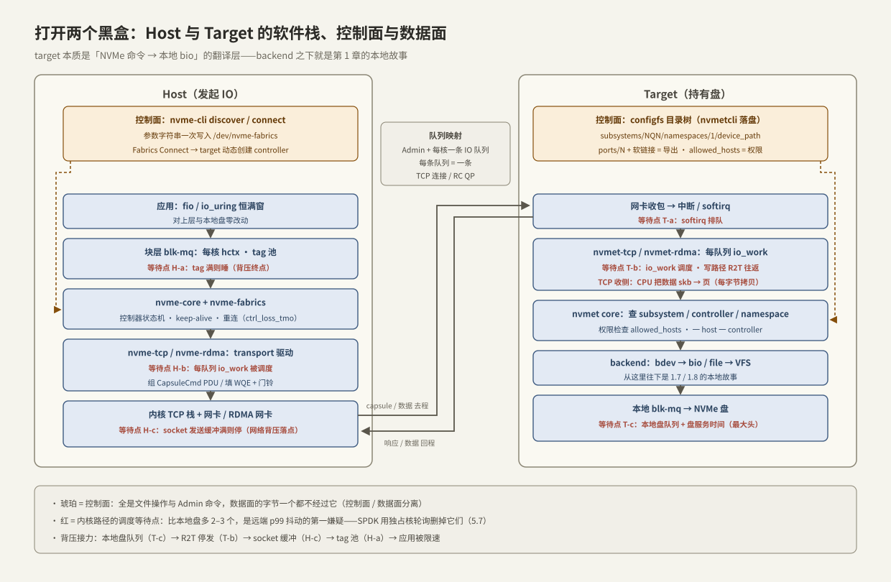

---
tags:
  - 高性能存储
  - NVMe-oF与SPDK
---
# Host 与 Target

> [[5.1 NVMe-oF 架构]] 给了角色分工与一次 IO 的全路径，但 Host 与 Target 在图上还是两个黑盒。本篇把盒子打开：host 侧「从 `/dev/nvmeXnY` 到网卡」的软件栈由哪几层组成，target 侧谁在监听、谁在查表、谁把命令递给真正的盘；一条连接如何从 `nvme connect` 一步步建立；以及一笔请求在两个盒子**内部**还要经过哪些队列与调度点——这些点正是远端盘 p99 抖动的藏身处，也是 [[5.7 内核态 vs 用户态路径]] 里 SPDK 要动刀的对象。主线用内核态 TCP transport（机制最全、无需专用硬件就能亲手搭），RDMA 的差异随文标注。

前置：[[5.1 NVMe-oF 架构]]（角色与队列映射）、[[5.2 Transport TCP vs RDMA]]（PDU 与 R2T）、[[1.7 块层与 blk-mq]]（host 侧上半段）、[[3.3 Admin Queue 与 IO Queue]]（控制面/数据面分工）。

---

## 1. 全景：两个盒子各三层



| 层 | Host 侧 | Target 侧 |
| --- | --- | --- |
| 通用核心 | `nvme-core`：控制器状态机、`/dev/nvmeXnY` 设备注册、keep-alive 定时器 | `nvmet` core：subsystem/controller/namespace 查表、权限检查 |
| fabrics 逻辑 | `nvme-fabrics`：connect 参数解析、重连策略 | configfs 控制面：导出什么、允许谁连 |
| transport 驱动 | `nvme-tcp` / `nvme-rdma`：把 SQE 变成 PDU/capsule 发出去 | `nvmet-tcp` / `nvmet-rdma`：监听端口、收命令、回数据 |
| 后端 | —（下面就是网卡） | **backend**：bdev（转成 bio 提交本地块层）或 file（走 VFS） |

一个应当校准的认知【事实】：**target 不是一个「存储服务器软件」，而是内核里的一个命令翻译层**——把网络上收到的 NVMe 命令翻译成对本地块设备的 bio。任何一台有盘的 Linux 机器 `modprobe nvmet` 之后都能当 target；从 target 的 backend 往下，走的就是 [[1.7 块层与 blk-mq]]、[[1.8 一次 read write 全路径图]] 的本地故事。

---

## 2. 控制面：一次 connect 的完整时序

`nvme connect` 敲下去到 `/dev/nvme1n1` 出现，中间发生了七步【实现】：

1. **参数下发**：`nvme-cli` 把 `transport=tcp,traddr=...,nqn=...` 这样一个字符串写进字符设备 `/dev/nvme-fabrics`——控制面的入口就是一次文件写；
2. **建 Admin 队列的传输通道**：TCP 下先三次握手，再交换 ICReq/ICResp 协商 PDU 参数（[[5.2 Transport TCP vs RDMA]] §2）；RDMA 下走 CM 建 RC QP（[[4.2 Verbs 编程模型]]）；
3. **Fabrics Connect 命令**：在这条队列上发出第一条 NVMe 命令，携带 hostnqn 与目标 subsystem NQN；target 做权限检查（§3 的 `allowed_hosts`），通过则**动态创建一个 controller 实例**并返回 controller ID——「一 host 一次连接一 controller」（[[5.1 NVMe-oF 架构]] §3）在这里落地；
4. **认识对方**：host 在 Admin 队列上发 Identify 读控制器与 namespace 信息；
5. **要 IO 队列**：Set Features (Number of Queues) 协商队列数——默认每 CPU 核一条，可用 `nr_io_queues` 收敛【实现】；
6. **逐条建 IO 队列**：每条队列重复第 2–3 步——**新建一条 TCP 连接/QP，再发一条带队列号的 Connect**。64 核 host 连一个 subsystem，就是 1（Admin）+ 64 条连接【量级】——集群总连接数 = host 数 × subsystem 数 × 核数，这笔账在 RDMA 下压网卡 QP 缓存（[[4.1 RDMA 为什么快]] §5），在 TCP 下压内存与 target 的 worker；
7. **注册块设备**：扫描 namespace，`/dev/nvmeXnY` 出现，blk-mq 的每核硬件队列与第 6 步的队列一一绑定。

连接活着之后靠两个定时器维持【实现】：host 周期性发 **Keep Alive** 命令（KATO，秒级）；断链后按 `reconnect_delay`（默认约 10 s）重试，直到 `ctrl_loss_tmo`（默认约 600 s）耗尽才放弃并删除设备——[[5.1 NVMe-oF 架构]] §6「远端盘会 hang 不会立刻死」的脾气就来自这两个参数，路径切换见 [[5.5 Multipath 与故障切换]]。

---

## 3. Target 控制面实操：configfs 目录树

target 的配置界面是 configfs——**导出一块盘 = 建几个目录、写几个文件、做一个软链接**。完整可复现（两台机器或一台机器自连均可）：

```bash
# ---- target 侧 ----
modprobe nvmet nvmet-tcp
cd /sys/kernel/config/nvmet

# 1. 建 subsystem（导出单元）
mkdir subsystems/nqn.2026-07.io.lab:demo
echo 1 > subsystems/nqn.2026-07.io.lab:demo/attr_allow_any_host   # 实验用；生产写 allowed_hosts

# 2. 挂 namespace（把本地盘放进去）
mkdir subsystems/nqn.2026-07.io.lab:demo/namespaces/1
echo -n /dev/nvme0n1 > subsystems/nqn.2026-07.io.lab:demo/namespaces/1/device_path
echo 1 > subsystems/nqn.2026-07.io.lab:demo/namespaces/1/enable

# 3. 开监听端口
mkdir ports/1
echo tcp        > ports/1/addr_trtype
echo ipv4       > ports/1/addr_adrfam
echo 192.168.1.10 > ports/1/addr_traddr
echo 4420       > ports/1/addr_trsvcid

# 4. 软链接 = 「在这个端口导出这个 subsystem」
ln -s /sys/kernel/config/nvmet/subsystems/nqn.2026-07.io.lab:demo ports/1/subsystems/

# ---- host 侧 ----
modprobe nvme-tcp
nvme connect -t tcp -a 192.168.1.10 -s 4420 -n nqn.2026-07.io.lab:demo
nvme list    # /dev/nvme1n1 出现
```

两个值得内化的设计点：

1. **控制面全是文件操作，数据面一个字节不经过 configfs**【事实】——与 [[3.3 Admin Queue 与 IO Queue]] 的控制面/数据面分离是同一思想：慢而灵活的配置路径，快而固定的数据路径；
2. 配置是易失的（重启即空），生产用 `nvmetcli save/restore` 落成 JSON【实现】。

---

## 4. 数据面：一笔 4 KiB 写在两个盒子内部的流转

[[5.1 NVMe-oF 架构]] §4 用读讲了盒子**之间**的路径，这里用写补上盒子**内部**的细节——写路径才暴露 R2T 与两端的全部调度点。场景：O_DIRECT 随机写 4 KiB，TCP transport，数据大于 in-capsule 上限。

**Host 盒子内部（① → ③）**：

| 步 | 发生什么 | 等待点 | 拷贝 |
| --- | --- | --- | --- |
| ① 应用 → blk-mq | `write()`/io_uring 陷入，bio 进每核 hctx，取 tag | **H-a：tag 池满则睡**（[[1.7 块层与 blk-mq]] 背压） | 无（O_DIRECT，DMA 直用用户页） |
| ② 队列的 io 线程组帧 | 每条队列有一个专属工作项（`io_work`），绑在固定 CPU 上；它把请求组成 CapsuleCmd PDU | **H-b：io_work 被调度**——请求提交与实际发送之间隔着一次 workqueue 调度【实现】 | 无 |
| ③ 内核 TCP 发送 | PDU 进 socket 发送缓冲，协议栈分段发出 | **H-c：socket 发送缓冲满则停**（网络背压的落点） | 命令头拷入 skb（64B 级）；数据页此时还没资格发 |

**Target 盒子内部（④ → ⑦）**：

| 步 | 发生什么 | 等待点 | 拷贝 |
| --- | --- | --- | --- |
| ④ 收命令 | 中断 → softirq → 该队列的 io_work 解析 PDU | **T-a：softirq + io_work 调度** | 命令头一次 |
| ⑤ 回 R2T，收数据 | nvmet 查 controller/namespace → 分配缓冲 → 回 R2T；host 的 io_work 被再次调度，发 H2CData；target 收流 | **T-b：R2T 软件往返**（[[5.2 Transport TCP vs RDMA]] §4） | **target 接收侧：CPU 把数据从 skb 拷进缓冲页**（每字节） |
| ⑥ backend 落盘 | 数据页组成 bio，提交本地 blk-mq → 本地 NVMe → 盘 | **T-c：本地盘队列 + 盘服务时间（最大头）** | 盘 DMA 读走缓冲页 |
| ⑦ 完成回程 | 本地中断 → `bio_endio` → nvmet 回 CapsuleResp → host softirq → blk-mq 完成 → 唤醒应用 | **H-d：host 中断 + 调度唤醒** | CQE 一次 |

对账结论【实践】：

1. **内核 target 给每笔 IO 添了 2–3 个纯调度等待点**（H-b、T-a、T-b 里的两次 io_work 调度）。空载时每个只有几 μs，但它们都经过调度器——CPU 一忙就排队，**这是远端盘 p99 比本地盘抖得多的第一嫌疑**，也是 SPDK 用「独占核轮询」替换的对象（[[5.7 内核态 vs 用户态路径]]）；
2. **亲和链要对齐**【实践】：blk-mq hctx → NVMe 队列 → io_work 所在 CPU → 网卡中断向量，四者不对齐则每笔 IO 跨核弹跳、缓存行来回迁移——症状是「什么都不饱和但延迟高」，排查思路同 [[3.8 PCIe 拓扑与 NUMA]]；
3. **背压是三段接力**【事实】：本地盘队列满（T-c）→ target 停发 R2T（T-b）→ host socket 缓冲滞留（H-c）→ tag 池耗尽（H-a）→ 应用被限速。与 [[1.8 一次 read write 全路径图]] §3 的单机背压链同构，只是中间多了网络一段。

---

## 5. 后端选择【取舍】

| backend | 路径 | 适用 | 代价 |
| --- | --- | --- | --- |
| **bdev**（`device_path` 指向块设备） | nvmet → bio → 本地 blk-mq，最短 | 整盘/分区透传，性能口径干净 | 导出粒度 = 块设备 |
| **file**（指向文件） | nvmet → VFS → 文件系统 | 灵活切卷、精简置备 | 多穿文件系统层；`buffered_io` 开启时数据先进页缓存——**掉电语义依赖 flush 链**（[[1.4 fsync fdatasync 与持久化语义]]），与 bdev 直写不同【事实】 |
| **SPDK bdev** | 用户态 target，轮询到底 | 榨干延迟与每核 IOPS | 独占核、生态另起（[[5.8 SPDK bdev 与 perf]]） |

---

## 6. 陷阱与误区

> [!warning] 常见错误
> 1. **namespace 忘 enable、subsystem 忘软链到 port**：configfs 每步都静默成功，最后 host 端 `nvme discover` 空空如也——按 §3 顺序逐项核对。
> 2. **`attr_allow_any_host=1` 带上生产**：等于全网可写这块盘；正式环境逐个登记 `allowed_hosts`。
> 3. **带宽上不去先怪盘或网**：常见根因是 target 单核饱和——网卡中断、io_work、backend 提交挤在同一个 CPU。先看 `mpstat -P ALL` 有没有一个核 100%，再谈别的。
> 4. **file 后端默认当成盘用**：buffered 模式下「写完成」≠ 落盘，崩溃一致性语义整个变了——数据库/WAL 类负载要么用 bdev，要么明确核对 flush 行为。
> 5. **在 target 机器上跑其他重负载**：io_work 抢不到核，所有 host 的远端 p99 一起抖——target 的 CPU 预算要当作数据路径的一部分规划。
> 6. **连接数账没人算**：host 数 × subsystem 数 × 核数在大集群轻松过万；用 `nr_io_queues` 收敛，RDMA 下更要盯网卡 QP 容量。

---

## 7. 关键结论

| 结论 | 性质 |
| --- | --- |
| Host 栈 = nvme-core + nvme-fabrics + transport 驱动；Target 栈 = transport 监听 + nvmet 查表 + backend——target 本质是「NVMe 命令 → 本地 bio」的翻译层 | 事实 |
| connect 七步：写 /dev/nvme-fabrics → 建通道 → Fabrics Connect（此时动态创建 controller）→ Identify → 协商队列数 → 每队列一条连接逐条建 → 注册块设备 | 事实 / 实现 |
| 控制面全是文件操作（configfs/字符设备），数据面不经过它——控制面/数据面分离的又一实例 | 事实 |
| 每核一条队列 × host 数 × subsystem 数 = 集群连接账，RDMA 压网卡 QP 缓存、TCP 压内存与 worker | 量级 |
| 内核 target 给每笔 IO 加 2–3 个调度等待点（io_work、softirq、R2T 往返）——远端 p99 抖动的第一嫌疑，SPDK 的删除对象 | 事实 / 伏笔 |
| 跨网络背压三段接力：本地盘队列 → R2T 停发 → socket 缓冲 → tag 池 → 应用限速，与单机背压链同构 | 事实 |
| 亲和链（hctx → 队列 → io_work → 中断向量）不对齐 = 「什么都不饱和但延迟高」 | 实践结论 |
| file 后端 + buffered_io 改变持久化语义；keep-alive/ctrl_loss_tmo 决定故障时 hang 多久 | 事实 / 取舍 |

---

## 关联知识

- [[5.1 NVMe-oF 架构]] - 盒子之间的路径；本篇是盒子内部
- [[5.2 Transport TCP vs RDMA]] - PDU、R2T 与两种 transport 的字节搬运差异
- [[1.7 块层与 blk-mq]] / [[1.8 一次 read write 全路径图]] - host 上半段与背压链的单机版
- [[3.3 Admin Queue 与 IO Queue]] - 控制面/数据面分离的设备端原型
- [[3.8 PCIe 拓扑与 NUMA]] - 亲和链排查的同一套方法
- [[1.4 fsync fdatasync 与持久化语义]] - file 后端 buffered 模式的语义出处
- [[5.5 Multipath 与故障切换]] - reconnect/ctrl_loss_tmo 之后的路径切换
- [[5.6 SPDK 用户态驱动]] / [[5.7 内核态 vs 用户态路径]] / [[5.8 SPDK bdev 与 perf]] - 把本篇的调度点全部删掉的方案
