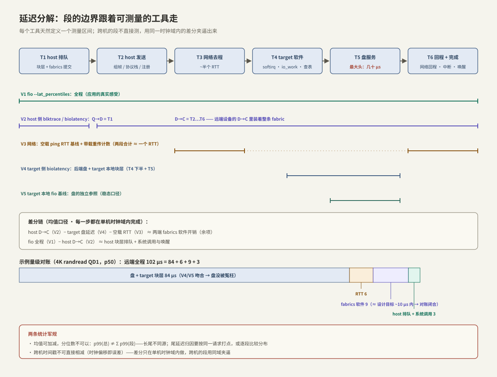

---
tags:
  - 高性能存储/NVMe-oF与SPDK
---
# 延迟分解方法论

> 前三篇把远程 IO 的路径讲全了，现在给方法：远端盘的 4K 读比本地慢了 40 μs、p99 忽然多了 300 μs——是网络、是 target 软件、还是盘本身？「感觉」没有资格回答。方法论只有一句话：**把端到端延迟切成边界清晰、可独立测量的段，逐段对账，让每一微秒的增量落到具体的层**。[[1.8 一次 read write 全路径图]] §6 的「自上而下二分」是它的单机版；本篇把它扩展到跨网络的场景——两台机器、两个时钟、五个观测点，以及两条最容易踩错的统计军规。

前置：[[1.8 一次 read write 全路径图]]（单机版分解与工具四把刀）、[[5.1 NVMe-oF 架构]] 至 [[5.3 Host 与 Target]]（每一段里都有什么）、[[9.2 iostat 指标解读]] / [[9.3 blktrace 与块层生命周期]] / [[9.4 eBPF biolatency biosnoop]]（工具的精确语义）。

---

## 1. 三条军规

分解之前先立规矩，违反任何一条，测出的数字都不可解释：

1. **段的边界必须落在可测量的层边界上**【方法】。「网络那段」不是一个段，除非你有工具能单独测它；反过来，每个观测工具天然定义了一个测量区间（fio 测全程、blktrace 测 Q→C、target 侧 biolatency 测后端盘……）——**分段方案要跟着工具走，而不是跟着直觉走**；
2. **均值可加减，分位数不可以**【事实】：`p99(总) ≠ Σ p99(段)`——各段的长尾未必发生在同一批请求上，总延迟的 p99 甚至可能小于两段 p99 之和，也可能远大于。差分归因只对均值/p50 这类稳健统计量做；尾延迟归因要么比较**各段各自的分布形状**，要么对**同一笔请求**打逐段时间戳（biosnoop 式的按请求关联，[[9.4 eBPF biolatency biosnoop]] §6）；
3. **两台机器两个时钟**【事实】：host 与 target 的时间戳属于不同时钟域，NTP 校准后仍有难以约束的偏移与漂移——**跨机时间戳直接相减是无效数据**。所有差分都在同一台机器内做；跨机的段用「同域夹逼」间接求出（§2 的差分链）。

端到端的段定义（TCP transport 为例，读路径，往返合并计入各段）：

```text
T_总(应用见) = T1 host排队(块层+fabrics) + T2 host发送 + T3 网络去程
             + T4 target软件 + T5 盘服务 + T6 回程+host完成
```

---

## 2. 五个观测点：每个工具測到哪一段



| 观测点 | 位置 | 工具 | 覆盖的段 |
| --- | --- | --- | --- |
| **V1 应用层** | host | `fio`（`--lat_percentiles=1`） | T1–T6 全程：应用真实感受 |
| **V2 host 块层** | host | blktrace / biolatency：`Q→D` 与 `D→C`（[[9.3 blktrace 与块层生命周期]]） | `Q→D` ≈ T1；`D→C` ≈ T2+T3+T4+T5+T6 的设备侧部分——**远端盘的 D→C 里装着整条 fabric**（[[9.4 eBPF biolatency biosnoop]] §8） |
| **V3 网络** | host | 空载 `ping`/sockperf 基线；带载看重传（`nstat -az TcpRetransSegs`）、交换机队列计数 | T3 + T6 中的网络部分 ≈ 一个 RTT |
| **V4 target 块层** | target | 对**后端盘**跑 biolatency / blktrace | T5 + target 本地块层（T4 的下半） |
| **V5 盘基线** | target | 本地 `fio` 直打后端盘（稳态口径，[[3.6 空盘与稳态性能]]） | T5 的独立参照 |

**差分链**【方法】——全部在各自时钟域内完成，均值口径：

```text
host D→C  −  target侧盘延迟  −  空载RTT   ≈  两端 fabrics 软件开销 (T2 + T4上半 + 完成回程软件部分)
fio 总延迟 −  host D→C                    ≈  host 块层排队 + 提交/完成的系统调用与唤醒 (T1 + T6上半)
```

左边三项分别来自 V2、V4、V3，没有任何一步跨时钟域相减；「fabrics 软件开销」作为余项被夹逼出来——它变大时再进 [[5.3 Host 与 Target]] §4 的等待点清单里找具体嫌疑。

---

## 3. 五步 runbook

负载形状必须全程锁死【方法】：块大小、读写比、QD、运行时长完全一致——延迟口径用 `QD=1` 测（排队为零，量纯路径），吞吐口径另测高 QD（[[2.6 io_uring 延迟吞吐实验]] 的曲线方法）。

```bash
# 0. 固定负载形状：4K randread，QD1，延迟口径
FIO_ARGS="--rw=randread --bs=4k --iodepth=1 --direct=1 --time_based --runtime=60 \
          --ioengine=io_uring --lat_percentiles=1 --name=probe"

# 1.【target】盘基线（V5）：直打后端盘，得到 T5 的独立参照
fio --filename=/dev/nvme0n1 $FIO_ARGS

# 2.【host】空载网络基线（V3）：机房内应为几十~几百 μs 量级的下限
ping -c 100 -i 0.01 192.168.1.10        # 看 min 与 mdev：min≈纯RTT，mdev≈网络抖动底噪

# 3.【host】远端全程（V1）：对 /dev/nvme1n1 跑同一份 FIO_ARGS
fio --filename=/dev/nvme1n1 $FIO_ARGS

# 4. 两侧同时开分布观测（V2 + V4），与步骤 3 同窗口运行
sudo biolatency-bpfcc -D nvme1n1 10     # host：D→C 分布（含整条 fabric）
sudo biolatency-bpfcc -D nvme0n1 10     # target：后端盘分布

# 5.【host】带载网络健康：重传是否为零、RTT 是否膨胀
nstat -az TcpRetransSegs; ss -ti dst 192.168.1.10 | grep -o 'rtt:[^ ]*'
```

对账表长这样（数字是**示例量级**，只演示方法）：

| 段 | 来源 | p50 示例 |
| --- | --- | --- |
| 远端全程（V1） | 步骤 3 | 102 μs |
| 盘 + target 块层（V4） | 步骤 4 | 84 μs |
| 空载 RTT（V3） | 步骤 2 | 6 μs |
| **余项：两端 fabrics 软件** | 差分 | **≈ 9 μs** |
| 交叉验证：本地基线（V5） | 步骤 1 | 83 μs（与 V4 吻合 → 盘没被冤枉） |

余项 9 μs 与 [[5.1 NVMe-oF 架构]]「增量 ~10 μs 内」的设计目标同量级——对账闭合。若余项冒到几十 μs，嫌疑排序：TCP 接收拷贝与 softirq（[[5.2 Transport TCP vs RDMA]] §3）、io_work 调度（[[5.3 Host 与 Target]] §4）、亲和链错位。

---

## 4. 尾延迟归因：签名表

p50 对账闭合之后，p99 用「现象签名 → 嫌疑层 → 验证动作」定位【实践】：

| 现象签名 | 嫌疑层 | 验证动作 |
| --- | --- | --- |
| p50 整体平移，p99−p50 差距不变 | 固定成本变大（路径变长：拷贝/调度/digest） | QD1 增量与带宽无关则实锤；对照 transport 配置 |
| p50 正常，p99 独自炸；**target 本地分布同样有尾** | 盘（GC/稳态化，[[3.5 GC 写放大与 Over-Provisioning]] / [[3.6 空盘与稳态性能]]） | V4/V5 的直方图第二峰；盘 smart-log |
| p50 正常，p99 炸；**target 本地分布干净** | 网络或两端软件 | 重传计数>0 → 网络（incast/拥塞，[[4.7 PFC ECN 与 DCQCN]]）；重传为零 → 查两端 CPU：softirq 抢核、io_work 排队（`mpstat`、`runqlat`） |
| 随 QD 增长非线性恶化 | 某级队列打满（tag 池、R2T 窗口、socket 缓冲） | `aqu-sz` 逐层看（[[9.2 iostat 指标解读]]）；利特尔法则核对 L=λW |
| 只有大块 IO 慢，小块正常 | 带宽段（链路争用、MTU/分段） | 换 bs 扫描；带载 RTT 是否随 bs 膨胀 |
| 周期性毛刺 | 背景任务相位（flusher、compaction、别人的重负载） | 时间轴对齐：biosnoop 逐请求 + 系统日志 |

方法上的要点【方法】：签名表的每一行都遵循同一结构——**先用「target 本地有没有同样的尾」把嫌疑一分为二**（盘 vs 盘之外），再用一个只对单层敏感的指标（重传数、runqlat、aqu-sz）收口。这正是 1.8 二分法的跨网络版。

---

## 5. Modern C++：带时间窗的分位数探针

差分法要求 V1 与 V2/V4 **同窗口**对齐，一只只报总量的秒表不够用。下面的探针按固定时间窗输出分位数序列，窗口边界与 biolatency 的 `-D 10` 对齐后即可逐窗对账；同时它示范军规 2——分位数从不跨段相加：

```cpp
#include <algorithm>
#include <chrono>
#include <cstddef>
#include <print>
#include <span>
#include <vector>

using Clock = std::chrono::steady_clock;

// 单一职责：收集一个时间窗内的延迟样本，窗口结束时输出分位数并复位。
// 只在一个时钟域（本机 steady_clock）内计时——military rule #3。
class WindowedLatency {
public:
    explicit WindowedLatency(std::chrono::seconds window) : window_{window}, window_start_{Clock::now()} {}

    void record(std::chrono::nanoseconds sample) {
        samples_.push_back(sample.count());
        if (Clock::now() - window_start_ >= window_) flush();
    }

private:
    void flush() {
        if (!samples_.empty()) {
            std::ranges::sort(samples_);
            std::println("window p50={}us p99={}us p999={}us n={}",
                         at_quantile(0.50) / 1000, at_quantile(0.99) / 1000,
                         at_quantile(0.999) / 1000, samples_.size());
        }
        samples_.clear();
        window_start_ = Clock::now();
    }

    [[nodiscard]] long long at_quantile(double q) const {
        const auto idx = static_cast<std::size_t>(q * static_cast<double>(samples_.size() - 1));
        return samples_[idx];
    }

    std::chrono::seconds window_;
    Clock::time_point window_start_;
    std::vector<long long> samples_;
};

// 用法：io_uring 恒满窗（2.3 的骨架）里，把提交时刻塞进 user_data 关联到完成时刻——
// 同一笔请求的两个时间戳相减，才是合法的「按请求」延迟样本。
struct Tagged {
    Clock::time_point submitted;
};
```

**读数方法**：把它跑在远端盘上，与 host/target 两侧的 `biolatency -D 10` 三路同窗对齐——每个 10 秒窗得到三组分位数，**逐窗比较分布**（而不是把窗内的段分位数相减）。某个窗口 host 侧 p99 炸而 target 侧干净，就把该窗口的嫌疑按 §4 签名表收口。

---

## 6. 陷阱与误区

> [!warning] 常见错误
> 1. **分位数相减**：`远端p99 − 本地p99` 不是「网络的 p99」——长尾不同源，这个减法没有统计意义（军规 2）。
> 2. **跨机时间戳相减**：host 发包时刻减 target 收包时刻 = 时钟偏移污染过的数字；分解只在单机时钟域内做，跨机段用差分链夹逼（军规 3）。
> 3. **负载形状不一致**：本地基线 4K QD32、远端测 4K QD1，两个数字没有可比性——排队时间完全不同。
> 4. **拿空载 RTT 当带载网络成本**：空载 RTT 是下限；带载要看重传计数与 `ss -ti` 的实时 rtt，队列积压全在差值里。
> 5. **「网络慢」实为 host CPU 慢**：TCP transport 的接收拷贝与 softirq 吃核后，完成路径排队——签名像网络，根因在 host（[[5.2 Transport TCP vs RDMA]] §3）。先看 `mpstat` 再怪网。
> 6. **一次测量下结论**：背景负载有相位（flusher、别人的训练任务）；至少跑出多个时间窗，看结论是否稳定。
> 7. **%util 误读远端设备**：多队列设备上 %util 早已不代表饱和度（[[9.2 iostat 指标解读]] §5），远端设备更甚——用延迟与 aqu-sz 说话。

---

## 7. 关键结论

| 结论 | 性质 |
| --- | --- |
| 延迟分解 = 段边界跟着可测量的工具走：fio（全程）、blktrace Q→D/D→C（host 块层/设备侧）、biolatency@target（盘）、ping/nstat（网络） | 方法论 |
| 远端设备的 D→C 里装着整条 fabric：host 发送、网络、target 软件、盘、回程——它不再是「盘的延迟」 | 事实 |
| 差分链：host D→C − target 盘延迟 − 空载 RTT ≈ 两端 fabrics 软件开销；全程不跨时钟域 | 方法论 |
| 均值可加减、分位数不可以：p99 归因要么按请求打点、要么逐段比分布 | 事实 |
| 跨机时间戳不可直接相减：时钟偏移即误差源；单机差分 + 同域夹逼 | 事实 |
| 尾延迟归因先问「target 本地有没有同样的尾」——一刀把嫌疑分成盘/盘之外 | 方法论 |
| 延迟口径 QD1、吞吐口径高 QD，两套数字不混用；负载形状全程锁死 | 方法论 |
| 对账闭合的标志：余项与设计目标同量级（RDMA ~10 μs 内）；余项异常再进等待点清单找嫌疑 | 实践结论 |

---

## 关联知识

- [[1.8 一次 read write 全路径图]] - 本方法论的单机版与「四把刀」
- [[5.1 NVMe-oF 架构]] / [[5.2 Transport TCP vs RDMA]] / [[5.3 Host 与 Target]] - 每一段里具体有什么等待点与拷贝
- [[9.2 iostat 指标解读]] / [[9.3 blktrace 与块层生命周期]] / [[9.4 eBPF biolatency biosnoop]] - 观测点 V2/V4 的工具语义
- [[9.1 fio Benchmark Matrix]] / [[2.6 io_uring 延迟吞吐实验]] - 负载形状与延迟/吞吐口径
- [[3.5 GC 写放大与 Over-Provisioning]] / [[3.6 空盘与稳态性能]] - 「盘自己的尾」从哪来
- [[4.7 PFC ECN 与 DCQCN]] - 网络侧尾延迟的机制与计数器
