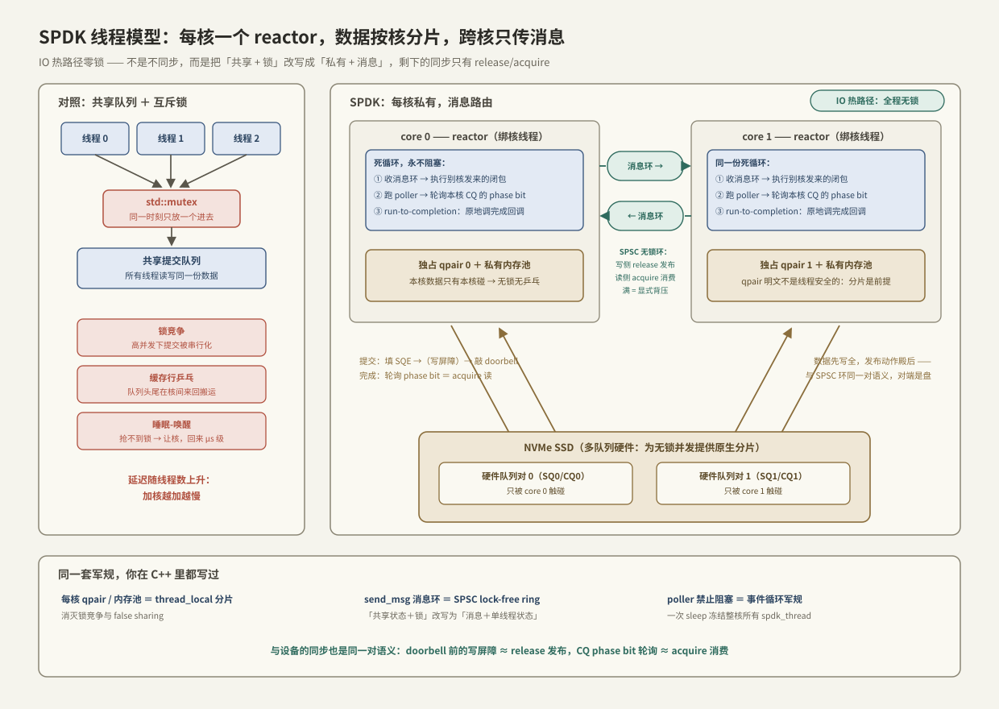

---
tags:
  - 高性能存储
  - NVMe-oF与SPDK
---
# SPDK 用户态驱动

> [[5.1 NVMe-oF 架构]] §4 留下两个内核等待点：A（块层排队）与 F（中断 + 调度唤醒）。对本地几十 μs 的盘，这几 μs 是零头；但 target 机器要用少数几个核转发几百万 IOPS 时，每笔 IO 的 syscall、中断、唤醒乘上百万倍，CPU 先于盘和网络耗尽【量级】。SPDK（Storage Performance Development Kit）的答案激进而简单：**把 NVMe 驱动整个搬进用户态进程，中断换轮询，共享换独占，锁换消息**。本篇讲它凭什么可行（硬件访问的三块拼图），以及它的线程模型为什么恰好是一份「高性能 C++ 并发设计」的标准答案——你写多线程程序时学的每一条军规，SPDK 都用到了极致。

前置：[[3.1 NVMe 命令模型]] + [[3.2 Queue Pair 与 Doorbell]]（SQ/CQ/doorbell——SPDK 直接操作的就是它们）、[[1.7 块层与 blk-mq]]（被绕开的内核路径）、[[2.4 polling 与 registered buffers]]（io_uring 的轮询是同一思想的内核版）。

---

## 1. 凭什么用户态能开盘：三块拼图

「驱动必须在内核」是习惯,不是物理定律。NVMe 设备的全部接口只有两样【事实】：一段 MMIO 寄存器（doorbell 与配置，[[3.2 Queue Pair 与 Doorbell]]），加一堆放在**普通内存**里的队列与数据缓冲——设备通过 DMA 来读写。让用户态进程凑齐这两样访问权，就凑齐了一个驱动：

| 拼图 | 内核里的形态 | SPDK 的做法 | 关键机制 |
| --- | --- | --- | --- |
| ① 摸到寄存器 | 驱动 ioremap BAR | 设备从 `nvme` 驱动解绑，改绑 `vfio-pci`；进程把 BAR **mmap 进自己地址空间**——之后读写寄存器就是普通内存访问，不进内核 | VFIO |
| ② 给设备安全的 DMA 权 | 内核保证物理地址有效 | **IOMMU** 建立设备侧页表：设备只能 DMA 到进程显式映射过的内存,乱写直接被硬件拦截 | VFIO + IOMMU |
| ③ 稳定的 DMA 缓冲 | 内核页不换出 | 从 **hugepage** 池分配所有 IO 内存：页大（2 MiB）、常驻（不换出）、虚实映射固定——设备拿到的地址永远有效，IO 路径永不缺页 | hugetlbfs |

②值得多看一眼【事实】：没有 IOMMU 时，能发 DMA 的设备等于能写任意物理内存,把这权力交给用户态进程是安全灾难——所以「用户态驱动」直到 IOMMU 普及才成为正经方案。这是「用户态凭什么能安全开盘」的完整答案：**硬件（IOMMU）接管了原来由内核软件承担的隔离职责**【事实/前提】。

拼图凑齐后,提交一笔 IO = 往 hugepage 里的 SQ 写 64 字节 + 往 mmap 的 doorbell 写 4 字节【事实】。零 syscall——内核自始至终不知道这笔 IO 存在过。

---

## 2. 中断换轮询：通知机制的贴身互换

完成通知同样绕开内核：不申请中断，SPDK 起一个循环**反复读 CQ 里下一个位置的 phase bit**（[[3.1 NVMe 命令模型]]），盘通过 DMA 写入新 CQE、翻转 phase bit 的瞬间，下一次轮询立刻看见【事实】。

这就是 C++ 里最古老的两难——`condition_variable::wait` 还是自旋——放大到整个 IO 栈【事实】：

| | 中断（≈ cv.wait） | 轮询（≈ 自旋 acquire 读） |
| --- | --- | --- |
| 等待时 | 让出 CPU，可睡眠 | 烧满一个核 |
| 事件到达 | 中断 → ISR → softirq → 唤醒 → 调度器排队 → 上核，μs 级 + 调度抖动 | 下一圈循环就看见，百 ns 内 |
| 每秒百万事件 | 中断风暴，ISR 开销 × 百万 | 轮询成本不随事件数增长——**反而事件越密越划算** |

轮询在低负载下是纯浪费、高负载下是纯收益【取舍】——SPDK 赌的就是存储 target 常年高负载。这笔账的完整版（何时该选哪边）放在 [[5.7 内核态 vs 用户态路径]]。

---

## 3. 线程模型:每核一个 reactor，消息代替锁

删掉内核只是清了场；SPDK 的延迟成绩大半来自清场后**重建的并发模型**【事实】。三个概念：

- **reactor**：每个核一个、绑核（pinned）的 OS 线程，跑死循环——这是唯一真正的线程；
- **spdk_thread**：调度在 reactor 上的轻量执行上下文（≈ 无栈协程/executor），持有自己的 poller 列表与消息环；
- **poller**：注册给 spdk_thread 的回调,每圈循环被调一次——「轮询 CQ」「轮询网卡」都是 poller。

```text
reactor 死循环（每核一份，永不阻塞）:
  while (true) {
      收消息环里别的核发来的消息，执行;     // 跨核协作的唯一入口
      依次调用本核每个 poller;              // 其中就有「读 NVMe CQ 的 phase bit」
  }
```

配套三条铁律【事实/设计】：

1. **一切资源按核分片**：每个 reactor 有**自己的** NVMe qpair（[[3.2 Queue Pair 与 Doorbell]] 本来就支持多队列——硬件为无锁并发提供了原生分片）、自己的内存池、自己的 io_channel。IO 热路径上没有任何跨核共享的可写数据，**因此没有锁**；
2. **run-to-completion**：一笔 IO 从提交到完成回调全程在同一个核上，不跨核迁移——上下文不搬家,缓存常温【事实】；
3. **跨核只传消息**：真需要别的核干活（如关闭一个多核共用的 bdev），把闭包 `spdk_thread_send_msg` 进对方的**无锁环**，对方循环里执行。共享数据的锁被「数据归属单核 + 消息路由到归属核」取代。



这三条你全都见过【事实】——它们就是 C++ 高性能并发的标准结论集：

| SPDK 机制 | C++ 世界的同一件事 | 共同动机 |
| --- | --- | --- |
| reactor 绑核死循环 | 绑核的 `std::jthread` 跑事件循环 | 消灭调度迁移与唤醒延迟 |
| 每核 qpair/内存池 | thread-local 分配器、每线程计数器 | 消灭锁竞争与缓存行乒乓（false sharing 的系统级版本） |
| run-to-completion | 任务不跨线程续接（同 executor 完成） | 缓存局部性 |
| send_msg 无锁环 | SPSC lock-free ring buffer | 把「共享状态 + 锁」改写成「消息 + 单线程状态」 |
| poller | 事件循环里的非阻塞回调,禁止阻塞调用 | 一次阻塞冻结整核——与 muduo「不许在 IO 线程里睡」同一军规 |

---

## 4. 内存可见性：这套无锁模型的地基

「无锁」不等于「无同步」【事实】。SPDK 剩下的两处跨执行体共享，恰好是 C++ 内存模型的两个教科书场景——而且**其中一方是硬件**。

**场景一：跨核消息环（SPSC）**。单生产者单消费者环的 Modern C++ 最小实现：

```cpp
template <typename T, std::size_t N>          // N 为 2 的幂
class SpscRing {
public:
    bool push(T v) {                           // 仅生产者核调用
        const auto t = tail_.load(std::memory_order_relaxed);
        if (t - head_.load(std::memory_order_acquire) == N) return false;  // 满：背压
        slots_[t & (N - 1)] = std::move(v);
        tail_.store(t + 1, std::memory_order_release);   // ① 数据先写全，再发布
        return true;
    }
    std::optional<T> pop() {                   // 仅消费者核调用
        const auto h = head_.load(std::memory_order_relaxed);
        if (h == tail_.load(std::memory_order_acquire)) return std::nullopt;  // ② 与①配对
        T v = std::move(slots_[h & (N - 1)]);
        head_.store(h + 1, std::memory_order_release);
        return v;
    }
private:
    std::array<T, N> slots_{};
    alignas(64) std::atomic<std::size_t> head_{0};   // 各占一个缓存行:
    alignas(64) std::atomic<std::size_t> tail_{0};   // 生产/消费互不弹对方的行
};
```

①②的 release/acquire 配对保证：消费者看到新 tail 时，槽里的数据**必然**已可见【事实】。少了它，另一个核可能读到半个消息——这不是理论洁癖,是弱内存序硬件上必现的 bug。

**场景二：与盘的「线程间同步」**。把 SSD 控制器看作一个特殊的「线程」，SQ/CQ 就是你与它之间的两个环【事实】：

- **提交侧**：填完 64 字节 SQE（写内存）→ 敲 doorbell（写 MMIO）。doorbell 绝不能先于 SQE 内容到达设备，否则盘读到半条命令——SPDK 在两步之间放写屏障【实现】。**这就是 `push()` 里的①**：数据先写全，发布动作殿后；
- **完成侧**：盘 DMA 写入 CQE、最后翻 phase bit；host 轮询 phase bit，翻转后才读 CQE 其余字段——**这就是 `pop()` 里的②**：acquire 语义保证看到发布标志时数据已就位。

同一对 release/acquire,一次用在核与核之间，一次用在核与设备之间【事实】。内存可见性规则不关心对端是线程还是 DMA 引擎——这是「学好 C++ 内存模型能直接读懂驱动代码」的字面证明。

---

## 5. 背压：队列满从「隐式睡眠」变成「显式返回值」

qpair 深度有限。内核路径里队列满 = 提交者被移出运行队列睡觉，应用无感也无从决策（[[1.7 块层与 blk-mq]]）；SPDK 里没有「睡」这个选项——reactor 死循环不许阻塞——于是**背压变成返回值**【事实】：

```cpp
int rc = spdk_nvme_ns_cmd_read(ns, qpair, buf, lba, n_blocks, on_complete, ctx, 0);
if (rc == -ENOMEM) {
    // qpair 满 / 无空闲请求对象:命令根本没发出去。
    // 调用者自己决定:排到自己的等待队列?向上游返回忙?丢弃?
}
```

上层 bdev 框架提供 `spdk_bdev_queue_io_wait`：注册回调,资源空出来时通知你重试【实现】——本质是把内核替你做的「睡眠-唤醒」搬到用户态、变成显式状态机。对照 C++：这就是**有界队列的 `try_push` vs 阻塞 `push`** 之争。阻塞版省心；try 版把「满了怎么办」的决策权交还调用者——高负载系统几乎总要 try 版，因为「谁该慢下来」是业务决策，不该由最底层替你选【取舍】。丢锅方向也变了：内核路径压力堆在看不见的内核队列里，SPDK 压力堆在**你自己的**等待队列里——可观测、可计数、可设上限，这正是 [[5.4 延迟分解方法论]] 想要的形状。

---

## 6. 代价清单：删内核删掉的不只是开销

| 失去的 | 后果 | 补救 |
| --- | --- | --- |
| page cache 与文件系统 | 没有缓存、没有目录——盘上是裸块 | 自建缓存,或用 SPDK 的 blobstore/blobfs（功能远弱于内核 FS）【事实】 |
| 设备共享 | 设备整个从内核拔走,本进程独占；`iostat`/`blktrace` 全部失明（[[9.2 iostat 指标解读]]） | 观测走 SPDK 自己的统计（[[5.8 SPDK bdev 与 perf]]） |
| 进程隔离与故障域 | 驱动 bug = 进程崩 = 「盘」没了;好在 IOMMU 兜底,崩坏不了别人的内存 | 上层拉起+多路径（[[5.5 Multipath 与故障切换]]） |
| 空闲时的 CPU | 每个 reactor 100% 烧核,idle 也烧 | 接受它,或混合部署时用中断模式退让【取舍】 |
| 通用性 | 只值得用在「存储就是主业」的进程:NVMe-oF target、存储引擎、DPU | 普通应用走内核 + io_uring（[[2.4 polling 与 registered buffers]]） |

---

## 7. 陷阱与误区

> [!warning] 常见错误
> 1. **在 poller/回调里调阻塞函数**：一次 `sleep`、一把竞争的锁、一个同步 syscall,整个核上所有 spdk_thread 全部冻结。与「不许在 muduo IO 线程里睡」同罪,但后果放大到整核。
> 2. **跨核共享 qpair**：qpair 明文不是线程安全的【事实】——两个核往同一个 SQ 写就是数据竞争,现象是偶发命令损坏而不是立刻崩溃,极难排查。分片不是建议,是前提。
> 3. **IO buffer 用普通 malloc 内存**：设备 DMA 需要 hugepage 池里的固定映射内存（`spdk_dma_malloc`）;普通堆内存没有向 IOMMU 注册,轻则 -EFAULT,重则静默错数据。
> 4. **忽略 -ENOMEM 返回值**：以为提交必成功,队列满时命令静默丢失,表现为「偶尔有 IO 永远不完成」。背压是返回值,必须接。
> 5. **把 100% CPU 当 bug 报**：轮询模式下 top 显示满核是设计行为;真实负载要看 SPDK 内部统计的有效循环占比。
> 6. **忘了绑核与隔核**：reactor 没绑核或与其他负载混跑,调度器把它迁来迁去,轮询延迟优势全吐回去——部署时 isolcpus/cpuset 是标配【实践】,NUMA 亲和另见 [[3.8 PCIe 拓扑与 NUMA]]。

---

## 8. 关键结论

| 结论 | 性质 |
| --- | --- |
| 用户态驱动三块拼图：VFIO mmap BAR（摸寄存器）+ IOMMU（安全 DMA）+ hugepage（常驻缓冲）——隔离职责从内核软件移交给硬件 | 事实 |
| NVMe 队列本就是普通内存 + doorbell,硬件接口天然适合搬到用户态——提交一笔 IO 零 syscall | 事实 |
| 中断换轮询 = cv.wait 换自旋:低负载纯浪费,高负载纯收益;轮询成本不随事件率增长 | 事实/取舍 |
| 线程模型三铁律:资源按核分片(每核 qpair)、run-to-completion、跨核只传消息——IO 热路径零锁 | 事实 |
| 无锁 ≠ 无同步:SPSC 环靠 release 发布/acquire 消费;doorbell 前的写屏障与 CQ phase bit 轮询是同一对语义用在核与设备之间 | 事实 |
| 背压从隐式(内核让你睡)变显式(-ENOMEM 返回值)——「满了谁慢下来」的决策权交还应用 | 事实/取舍 |
| 删内核的代价:失去 page cache/文件系统/设备共享/标准观测,每核常烧 100%——只值得用在存储即主业的进程 | 取舍 |
| SPDK 的每一条设计军规都是 C++ 高性能并发军规的系统级放大——两边可以互相印证着学 | 实践结论 |

---

## 关联知识

- [[3.1 NVMe 命令模型]] / [[3.2 Queue Pair 与 Doorbell]] - SPDK 直接操作的硬件接口;多队列 = 硬件原生分片
- [[1.7 块层与 blk-mq]] - 被整个绕开的内核路径
- [[2.4 polling 与 registered buffers]] - 同一思想的内核版:io_uring 轮询与固定缓冲
- [[5.1 NVMe-oF 架构]] - 等待点 A/F 的出处;SPDK 是 target 侧的主流实现
- [[5.7 内核态 vs 用户态路径]] - 两条路径的正面对账
- [[5.8 SPDK bdev 与 perf]] - bdev 抽象与性能实测
- [[3.8 PCIe 拓扑与 NUMA]] - 绑核之外还要绑对 NUMA 节点
- [[9.2 iostat 指标解读]] - 为什么 SPDK 设备在标准工具里失明
