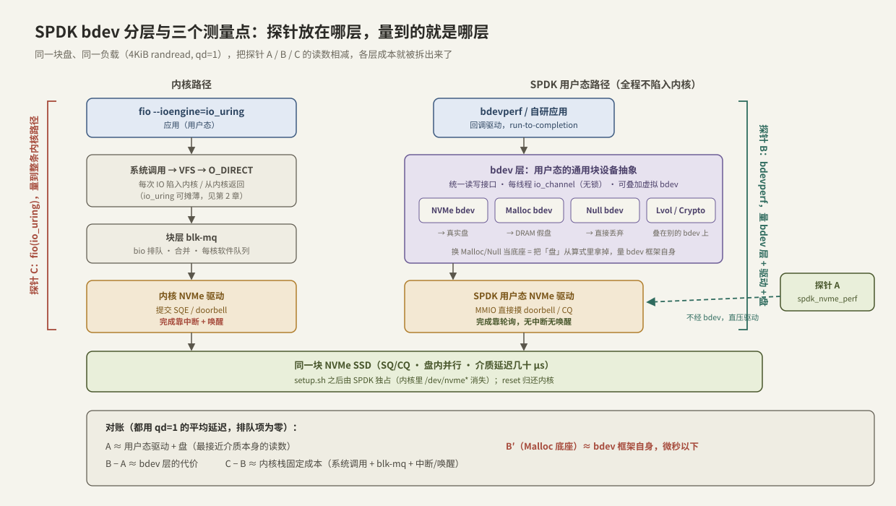

---
tags:
  - 高性能存储/NVMe-oF与SPDK
---
# SPDK bdev 与 perf

> [[5.7 内核态 vs 用户态路径]] 断言：删掉系统调用、blk-mq 排队与中断唤醒，一次 4 KiB 随机读能省下若干微秒的内核固定成本。断言要用数字兑现。SPDK 自带一套分层压测工具，天生适合做这件事：**`spdk_nvme_perf` 直压用户态驱动、`bdevperf` 压 bdev 抽象层、fio 压完整内核路径**——探针放在哪层，量到的就是哪层，读数相减，每层的成本就被拆出来了。本篇先讲清 bdev 这个「用户态的块层」是什么、为什么需要它，再给出一套可复现的三探针对账实验：命令、指标含义、常见误读与故障定位。

前置：[[5.6 SPDK 用户态驱动]]（轮询、hugepage、设备接管——本篇所有工具跑在它之上）、[[5.7 内核态 vs 用户态路径]]（我们要验证的对象）、[[3.7 nvme-cli 实操]]（内核侧的对照组操作）。

---

## 1. bdev：SPDK 世界里的「块层」

**定义【事实】**：bdev（block device layer）是 SPDK 在用户态重建的通用块设备抽象——向上给应用统一的读写接口，向下把「块设备」这个概念与具体后端解耦。它对 SPDK 的意义，就是内核里 VFS + 块层对 `/dev/nvme0n1` 的意义，只是全程无系统调用、无锁、回调驱动。

为什么用户态还需要一层抽象【设计】？直接用 [[5.6 SPDK 用户态驱动]] 的裸 NVMe API 不行吗？行，但每个应用都得自己处理设备热插拔、IO 切分、重试，且代码焊死在 NVMe 上。bdev 用一层薄抽象换来两样东西：

1. **后端可替换**：同一套应用代码，底下可以是真实 NVMe 盘、内存假盘（Malloc）、什么都不做的假盘（Null）、远端 NVMe-oF、甚至内核 AIO 文件；
2. **可堆叠（stacking）**：虚拟 bdev 可以叠在别的 bdev 之上——逻辑卷（lvol）、加密（crypto）、QoS 限速……与内核 device-mapper 同构【事实】。



两个与内核块层的关键差异【事实】：

- **并发模型**：没有共享队列加锁。每个 SPDK 线程通过 `spdk_bdev_get_io_channel()` 拿到**线程私有的 io_channel**，IO 全程在本线程内提交、轮询、回调完成（run-to-completion）——「每核一队列」的思想与 blk-mq（[[1.7 块层与 blk-mq]]）一致，但连软件队列间的迁移与锁都没有；
- **完成语义**：没有中断与唤醒。完成靠 reactor 线程轮询 CQ，然后**在同一个线程里调你注册的回调**——这正是 [[5.7 内核态 vs 用户态路径]] 里被删掉的等待点 F 的去处。

对压测的直接推论：**Malloc/Null bdev 是天然的「控制变量」后端**——把真实盘从算式里拿掉，量出 bdev 框架自身的开销（微秒以下【量级】）；反过来，`spdk_nvme_perf` 不经过 bdev 层，量的是驱动 + 盘的裸读数。分层工具 + 可替换后端，这就是「按层对账」的全部器材。

---

## 2. 环境准备：接管设备（可复现命令）

以近年 SPDK 源码树为准（路径随版本略有差异，以仓库内 `--help` 与文档为准【实现】）：

```bash
git clone https://github.com/spdk/spdk && cd spdk
git submodule update --init
sudo ./scripts/pkgdep.sh          # 安装依赖
./configure && make -j$(nproc)    # 产物在 build/ 下

# 接管：预留 hugepage + 把 NVMe 从内核驱动解绑、绑到 vfio-pci
sudo HUGEMEM=4096 ./scripts/setup.sh
./scripts/setup.sh status         # 确认设备已在 vfio-pci/uio 名下，记下 PCIe 地址

# 全部做完后归还内核：
sudo ./scripts/setup.sh reset     # /dev/nvme* 重新出现
```

> [!warning] 两条安全线
> 1. **`setup.sh` 之后盘从内核消失**：`/dev/nvme0n1` 没了，挂载在上面的文件系统自然也没了（脚本会跳过有挂载/有数据占用迹象的盘，但不要赌它）——**只用专门的测试盘**。
> 2. **写测试直接毁数据**：perf/bdevperf 写的是裸盘 LBA，没有文件系统概念，`-w randwrite` 一秒钟就能把盘上原有数据变垃圾。

hugepage 与 vfio 的原理（为什么必须预留大页、IOMMU 开与不开的差别）属于 [[5.6 SPDK 用户态驱动]]，此处只用结论：`HUGEMEM=4096` 预留 4 GiB；无 IOMMU 的机器退回 `uio_pci_generic`，功能等价但失去 DMA 隔离保护【实现】。

---

## 3. 探针 A：spdk_nvme_perf——驱动 + 盘的裸读数

`perf`（安装后名 `spdk_nvme_perf`）绕过 bdev，直接用裸 NVMe 驱动 API 压盘：

```bash
# 4KiB 随机读，qd=1，单核，60 秒——量路径延迟的标准姿势
sudo ./build/examples/perf -q 1 -o 4096 -w randread -t 60 -c 0x1 \
     -r 'trtype:PCIe traddr:0000:01:00.0'

# 吞吐姿势：qd=128 喂饱盘内并行（对照 2.3 的 iodepth 曲线）
sudo ./build/examples/perf -q 128 -o 4096 -w randread -t 60 -c 0x1 \
     -r 'trtype:PCIe traddr:0000:01:00.0'
```

参数对位（与 fio 术语互译，方便和 [[9.1 fio Benchmark Matrix]] 对照）：`-q` = iodepth，`-o` = bs，`-w` = rw（randread/randwrite/read/write/rw），`-c` = core mask（0x1 即只用 core 0），`-r` 指定 PCIe 地址（也可给 NVMe-oF 的 `trtype:RDMA adrfam:IPv4 traddr:... trsvcid:4420`——同一工具即可压远端 target【实现】）。

**输出怎么读**：主体是每设备/汇总的 `IOPS、MiB/s、Average Latency、Min、Max`。三条判读规则：

1. **qd=1 的平均延迟才是「路径延迟」**：此时无排队，读数 ≈ 驱动 + 盘的服务时间——这就是对账里的 A；
2. **高 qd 下延迟 = 排队延迟**：Little 定律（[[00. 总纲]] §4）`L = λW` 锁死三者，qd=128 时 avg latency 飙到毫秒不是盘变慢，是你让 IO 排了 128 深的队【事实】；
3. 尾延迟需显式开启 latency tracking（选项各版本有异，见 `--help`，常见为 `-L`）才有分位数输出；不开时只有 min/avg/max，**别拿 max 当 p99**——max 常是首次访问的冷启动毛刺。

---

## 4. 探针 B：bdevperf——加上 bdev 层再量一次

bdevperf 与 perf 负载语义相同，但 IO 走 bdev 接口，需要一份 JSON 配置声明 bdev 拓扑：

```json
{
  "subsystems": [{
    "subsystem": "bdev",
    "config": [
      { "method": "bdev_nvme_attach_controller",
        "params": { "name": "nvme0", "trtype": "PCIe",
                    "traddr": "0000:01:00.0" } },
      { "method": "bdev_malloc_create",
        "params": { "name": "ram0", "num_blocks": 262144, "block_size": 512 } }
    ]
  }]
}
```

`bdev_nvme_attach_controller` 挂真实盘（产生名为 `nvme0n1` 的 bdev）；顺手建一个 128 MiB 的 Malloc bdev `ram0` 作为控制变量。运行：

```bash
# 探针 B：经 bdev 层压真实盘（参数含义与 perf 一致）
sudo ./build/examples/bdevperf -c bdev.json -q 1  -o 4096 -w randread -t 60

# 探针 B′：同一命令压 Malloc bdev——把「盘」从算式里拿掉
#（bdevperf 默认压配置里所有 bdev，结果按 bdev 分行输出，分别读数即可）
```

**输出怎么读**：按 bdev × core 分行给出 IOPS 与 MiB/s。判读要点：

- `nvme0n1` 行与探针 A 相减 → **bdev 层的代价**（io_channel 分发 + 一层回调，典型远小于 1 μs【量级】——这正是「抽象几乎免费」的证据）；
- `ram0` 行是纯框架开销的读数：单核 IOPS 高得离谱（DRAM 速度）。**它不是你的盘性能**，只用于回答「bdev 框架本身会不会成为瓶颈」；
- RPC 方式（`scripts/rpc.py` 对着常驻 target 动态建 bdev）与 JSON 静态配置等价，实验用后者更容易复现【实现】。

---

## 5. 三探针对账：实验设计

**目标**：把 [[5.7 内核态 vs 用户态路径]] 的每一项「省掉的成本」落成实测数字。

**控制变量**：同一块盘、同一负载（4 KiB randread）、同一个核（探针 C 用 `taskset -c 0`，A/B 用 `-c 0x1`）、盘处于相同状态（稳态问题见下节）。三次测量：

| 探针 | 命令 | 覆盖的层 |
| --- | --- | --- |
| C | `setup.sh reset` 后：`taskset -c 0 fio --ioengine=io_uring --direct=1 --bs=4k --rw=randread --iodepth=1 --runtime=60 --filename=/dev/nvme0n1 --name=probe_c` | 系统调用 + VFS + blk-mq + 内核驱动 + 中断 + 盘 |
| B | `setup.sh` 后：`bdevperf -q 1 -o 4096 -w randread -t 60` | bdev + 用户态驱动 + 盘 |
| A | `perf -q 1 -o 4096 -w randread -t 60 ...` | 用户态驱动 + 盘 |

**对账（全部用 qd=1 平均延迟）**：

- `A` ≈ 盘的服务时间 + 驱动开销——全链路里最接近介质的读数；
- `B − A` ≈ bdev 层代价（预期亚微秒）；
- `C − B` ≈ **内核路径固定成本**：系统调用往返 + blk-mq + 中断/上下文唤醒，预期几 μs 量级【量级】——这就是 5.7 那句断言的数字形态。

注意分母【前提】：盘本身几十 μs 时，几 μs 的差值只占 ~10%——**内核旁路的收益比例取决于介质快慢**。把同一实验跑在 Malloc bdev/内存盘上，C 与 B 的比值会急剧拉大；这也是「SPDK 在超低延迟介质（Optane 级）上收益最大」这一结论的实验版本。顺带把 qd=128 的三组吞吐也记下：单核 IOPS 的差距展示的是**每 IO CPU 成本**的差异（轮询省下的陷入/中断），而不是盘的能力差异。

---

## 6. 指标含义与常见误读

| 读数现象 | 误读 | 正解 |
| --- | --- | --- |
| SPDK 进程 CPU 恒 100% | 「CPU 跑满了，瓶颈在 CPU」 | 轮询模型空转也是 100%【事实】。CPU 是否真饱和要看 IOPS 是否还随负载涨，或用 `spdk_top` 看 reactor 的 busy/idle 比【实现】 |
| Malloc bdev 千万级 IOPS | 「SPDK 让我的盘快了 100 倍」 | 那是 DRAM 的读数，控制变量用的假盘，与盘无关 |
| qd=128 时 avg latency ≈ 1 ms | 「用户态路径也不过如此」 | 排队延迟（Little 定律）；路径延迟只能在 qd=1 读 |
| perf 与 fio 数字对不上 | 「有一个工具在骗人」 | 探针层不同（A vs C），差值恰恰是要测的东西；先检查负载参数是否逐项对齐 |
| 写测试头几分钟 IOPS 极高后跳水 | 「盘坏了/SPDK 不稳」 | 空盘→稳态转变（FTL/GC，[[3.6 空盘与稳态性能]]）；写测试前要预处理（precondition） |
| 单核 IOPS 到顶后加 qd 无效 | 「盘到头了」 | 可能是单核提交能力到头：`-c 0x3` 加核再看；核要选盘同 NUMA 节点的（[[3.8 PCIe 拓扑与 NUMA]]） |
| max latency 几十 ms | 「p99 烂穿」 | max ≠ p99：开 latency tracking 看分位数；首次 IO、GC 毛刺都会打高 max |

---

## 7. 最小 C++ 示例：bdev 异步读的代码形态

压测工具之外，感受一下 bdev API 的编程模型——它解释了「探针 B 为什么快」：全程回调、无阻塞、无系统调用。骨架如下（可对照 SPDK 源码 `examples/bdev/hello_world` 补全编译细节；SPDK 是 C API，这里用 RAII 与 lambda 包出 Modern C++ 形态）：

```cpp
#include "spdk/bdev.h"
#include "spdk/event.h"

// io_channel 的 RAII 包装:通道是线程私有资源,离开作用域必须归还
struct ChannelGuard {
    spdk_io_channel* ch;
    explicit ChannelGuard(spdk_bdev_desc* d) : ch{spdk_bdev_get_io_channel(d)} {}
    ~ChannelGuard() { if (ch) spdk_put_io_channel(ch); }
    ChannelGuard(const ChannelGuard&) = delete;
    ChannelGuard& operator=(const ChannelGuard&) = delete;
};

static void read_done(spdk_bdev_io* io, bool ok, void* ctx) {
    spdk_bdev_free_io(io);                     // 完成回调里归还 io 对象
    // ok == false 时按 EIO 处理;这里演示:处理完直接退出事件循环
    spdk_app_stop(ok ? 0 : 1);
}

static void app_main(void* /*ctx*/) {
    spdk_bdev_desc* desc = nullptr;
    // 按名字打开 JSON 配置里声明的 bdev(如 "nvme0n1"/"ram0")
    if (spdk_bdev_open_ext("ram0", /*write=*/false,
                           [](spdk_bdev_event_type, spdk_bdev*, void*) {},
                           nullptr, &desc) != 0) {
        spdk_app_stop(1);
        return;
    }
    ChannelGuard chan{desc};                   // 本线程的私有提交通道
    void* buf = spdk_dma_zmalloc(4096, 4096, nullptr);   // DMA 安全的大页内存

    // 异步读:立即返回,完成时 reactor 在本线程调 read_done
    spdk_bdev_read(desc, chan.ch, buf, /*offset=*/0, /*len=*/4096,
                   read_done, nullptr);
    // 真实程序在此持续提交/处理;缓冲与 desc 的释放同样应包成 RAII
}

int main(int argc, char** argv) {
    spdk_app_opts opts{};
    spdk_app_opts_init(&opts, sizeof opts);
    opts.name = "bdev_read_demo";
    opts.json_config_file = "bdev.json";       // 复用第 4 节的配置
    return spdk_app_start(&opts, app_main, nullptr);   // 进入 reactor 轮询循环
}
```

**关键点**：

- `spdk_app_start` 之后线程就变成 reactor：一个永不 sleep 的事件循环，轮询设备 CQ 并派发回调——**读这段代码里找不到任何一次陷入内核的等待**，这就是等待点 A/F 被删掉后的编程模型；
- 缓冲必须来自 `spdk_dma_zmalloc`（hugepage、物理连续、可 DMA），普通 `new`/`std::vector` 的内存设备 DMA 不到【事实】；
- 回调风格是 run-to-completion 的代价：逻辑被切成回调链，这也是 [[5.7 内核态 vs 用户态路径]] 里「SPDK 快但侵入性强」取舍的代码体现【取舍】。

---

## 8. 故障定位速查

| 症状 | 首查 | 原因与处置 |
| --- | --- | --- |
| `No NVMe controllers found` | `./scripts/setup.sh status` | 没接管或已被归还：重跑 `setup.sh`；确认 `-r` 里 PCIe 地址与 status 输出一致 |
| 启动报 hugepage/内存分配失败 | `grep Huge /proc/meminfo` | 大页不足或碎片化：加大 `HUGEMEM` 重跑 setup.sh；多进程场景检查是否互相吃配额 |
| setup.sh 跳过某块盘 | `lsblk` / `mount` | 盘上有挂载或分区在用——SPDK 的防呆，卸载后重试（想清楚再动） |
| vfio 绑定失败 | `dmesg` 里搜 `iommu` | BIOS/内核未开 IOMMU（`intel_iommu=on`）：开启，或接受降级 uio_pci_generic |
| 第二个 SPDK 进程起不来 | `ls /dev/hugepages` | 单进程默认独占设备与大页：清掉残留文件，或用 multi-process（`--shm-id`）模式【实现】 |
| 数字异常低 | `setup.sh status` 看 NUMA | core mask 与盘跨 NUMA 节点（跨 socket 走 UPI，[[3.8 PCIe 拓扑与 NUMA]]）；或盘已进稳态/正在 GC |
| 测完内核里盘不见了 | - | 忘了 `setup.sh reset`——归还后 `/dev/nvme*` 才会回来 |

---

## 9. 关键结论

| 结论 | 性质 |
| --- | --- |
| bdev = 用户态重建的块层：统一接口、后端可换、虚拟 bdev 可堆叠；并发靠每线程 io_channel，无锁 run-to-completion | 事实 |
| 三探针分层：perf 压驱动（A）、bdevperf 压 bdev（B）、fio 压内核全路径（C）；差值即层成本 | 事实 / 方法 |
| qd=1 平均延迟 = 路径延迟；高 qd 延迟 = 排队（Little 定律）；max ≠ p99 | 事实 |
| bdev 层代价亚微秒；内核固定成本几 μs——旁路收益比例由介质快慢决定，盘越快占比越大 | 量级 / 前提 |
| 轮询模型 CPU 恒 100%，不代表 CPU 瓶颈；Malloc bdev 的读数是框架上限，不是盘 | 事实 / 实践 |
| setup.sh 接管后盘从内核消失，写测试毁数据——只用测试盘，测完 reset 归还 | 实践结论 |
| DMA 缓冲必须用 spdk_dma_zmalloc；编程模型是回调链，快的代价是侵入性 | 事实 / 取舍 |
| 写测试必须预处理到稳态，否则量的是空盘假象 | 实践结论 |

---

## 关联知识

- [[5.6 SPDK 用户态驱动]] - 本篇所有工具脚下的运行时：hugepage、vfio、轮询 reactor
- [[5.7 内核态 vs 用户态路径]] - 三探针实验要验证的理论账
- [[9.1 fio Benchmark Matrix]] - 探针 C 的完整方法论与参数矩阵
- [[3.6 空盘与稳态性能]] - 写测试为何必须 precondition
- [[3.8 PCIe 拓扑与 NUMA]] - core mask 怎么选才不跨节点
- [[2.3 iodepth 与提交完成路径]] - qd 与延迟/吞吐关系的机制版
- [[5.1 NVMe-oF 架构]] - 把 `-r` 换成 RDMA/TCP 地址，同一套工具压远端 target
