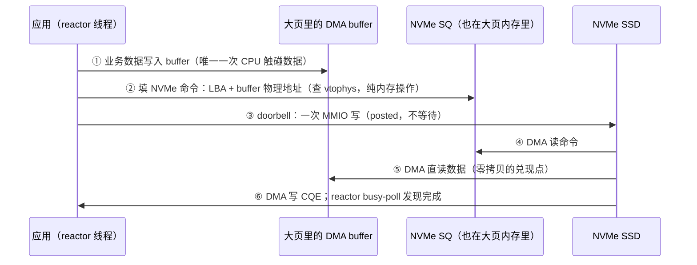

---
tags:
  - 高性能存储
  - NVMe-oF与SPDK
status: 已完成
---

# SPDK 环境与 HugePage

> 第一次跑 SPDK 示例程序，十有八九死在同一行报错上：`EAL: No free 2048 kB hugepages reported`。一个存储框架，凭什么开口先要"大页内存"？因为用户态驱动（[[5.6 SPDK 用户态驱动]]）把内核请出了数据路径，也就同时接手了内核平时默默代劳的三件事：**保证 buffer 不被换出、知道 buffer 的物理地址、让地址翻译足够便宜**。HugePage 一次性满足这三件。本篇从"大页到底解决什么"讲起，落到可操作的预留配置、CPU 隔离、初始化流程与启动失败排查——这是本地用户态数据路径的地基课：地基没打好，后面 [[5.11 Reactor Thread 与 Poller]] 和 bdev 性能实验（[[5.8 SPDK bdev 与 perf]]）全是空中楼阁。

前置：[[0.2 虚拟内存 Page Table 与 TLB]]（页、页表、TLB、大页的机制底座）、[[0.3 DMA IOMMU 与 Pinned Memory]]（设备为什么需要"钉住"的内存）、[[5.6 SPDK 用户态驱动]]（这套环境服务的主体）。

---

## 1. 先把名词说直白：页、大页、以及"设备眼里的内存"

复习三个词（细节在 [[0.2 虚拟内存 Page Table 与 TLB]]）：

- **页（page）**：内核管理内存的最小单位，x86-64 默认 4 KB。程序看到的地址是虚拟的，每次访存都要经页表翻译成物理地址，翻译结果缓存在 TLB 里；
- **HugePage（大页）**：同一机制的大号版本——x86-64 上是 2 MB 或 1 GB 一页。一页顶 512（或 26 万）个 4 KB 页：页表层级少一层、一条 TLB 表项覆盖的范围大 512 倍；
- **设备眼里的内存**：NVMe SSD 做 DMA 时拿到的是物理地址（或 IOMMU 翻译的 IOVA，[[5.10 VFIO UIO 与设备绑定]]），它完全不认识进程的虚拟地址，也不知道内核随时可能把某个 4 KB 页换出到磁盘或迁移到别处。

内核路径下这个矛盾由内核自己调和（DMA 前临时 pin 页、用完解 pin）。**SPDK 把内核请出了数据路径，就必须在启动时一次性把矛盾解决掉**——这就是大页的三重角色【事实】：

| 需求 | 4 KB 匿名页的问题 | HugePage（hugetlbfs 显式预留）给的承诺 |
| --- | --- | --- |
| DMA 目标必须常驻 | 可能被换出、被迁移，物理地址说变就变 | 预留页锁定在物理内存，**不参与换出**【事实】 |
| 用户态要能查物理地址 | 每 4 KB 一条映射，翻译表巨大且易变 | SPDK 以 2 MB 粒度维护一张虚拟→物理映射表（vtophys）【实现】，小而稳定 |
| 数据路径翻译要便宜 | 大 buffer 随机访问频繁 TLB miss | 一条 TLB 表项管 2 MB，miss 率骤降（[[0.2 虚拟内存 Page Table 与 TLB]] §6） |

一个高频混淆必须当场拆掉【事实】：**THP（透明大页）不是这里说的大页**。THP 是内核对匿名内存的自动优化——它可以随时把大页拆回 4 KB、可以回收、不做任何"常驻 + 物理稳定"的承诺。SPDK 要的是 hugetlbfs 的**显式预留**：管理员划出一块，内核从此不打它的主意。

---

## 2. 一次写 I/O 的流转：大页在数据路径上的位置

配置之前先看清它服务的对象。SPDK 本地 NVMe 写路径的完整流转（对比项见 [[5.7 内核态 vs 用户态路径]]）：



逐站对账【事实】：

| 站点 | 等待点 | 数据拷贝 |
| --- | --- | --- |
| ①② 填数据、填命令 | 无系统调用、无锁（thread-per-core，[[5.12 无锁 thread-per-core 模型]]） | 数据进 buffer 算业务本身的一次写入 |
| ③ doorbell | PCIe posted write，CPU 不停留 | 0 |
| ④⑤ 设备取命令取数据 | SSD 内部调度 + PCIe 往返 | **0 次软件拷贝**——SSD 直读大页 buffer |
| ⑥ 完成 | busy-poll：无睡眠无中断无上下文切换；代价是核 100% 占用（[[5.6 SPDK 用户态驱动]] §2） | 0 |

对照内核路径一次 `write()`：陷入内核 → 拷贝进 page cache（一次完整数据拷贝）→ 块层排队 → 中断唤醒。SPDK 路径上**内核零出场、数据零拷贝**——而这一切的前提是：buffer 和队列必须活在"物理地址已知且永不挪窝"的内存里。**大页就是这块内存的供给者**：`spdk_dma_malloc` 分出来的 buffer、NVMe SQ/CQ 环本身，全部落在预留的大页区【实现】。

也就是说：**大页不是 SPDK 的性能锦上添花，是正确性前提**。TLB 收益只是搭车的红利。

---

## 3. HugePage 配置实操

### 3.1 预留：越早越好

运行期预留 2 MB 页（写 `nr_hugepages` 的两种视角）：

```bash
# 全局预留 1024 × 2 MB = 2 GB
echo 1024 | sudo tee /proc/sys/vm/nr_hugepages

# 按 NUMA node 预留（生产推荐：只在 SSD/NIC 所在 node 上留，见 §5）
echo 1024 | sudo tee /sys/devices/system/node/node0/hugepages/hugepages-2048kB/nr_hugepages

# 核对账本
grep -i huge /proc/meminfo     # HugePages_Total / Free / Rsvd；Hugepagesize
```

**为什么"越早越好"**【实践】：预留 2 MB 页需要 512 个物理连续的 4 KB 页框。机器运行越久内存越碎，`nr_hugepages` 写 1024 可能只成功几百——**写入值是请求，不是保证，写完必须回读核对**。1 GB 大页对碎片更敏感，实践上直接走内核启动参数：

```bash
# /etc/default/grub 追加：启动时预留 4 × 1 GB
default_hugepagesz=1G hugepagesz=1G hugepages=4
```

### 3.2 SPDK 自带的一键脚本

```bash
sudo HUGEMEM=4096 ./scripts/setup.sh          # 预留 4096 MB 大页 + 解绑 NVMe 设备交给用户态驱动
./scripts/setup.sh status                     # 查看当前大页与设备绑定状态
sudo ./scripts/setup.sh reset                 # 归还设备给内核驱动、释放预留
```

`setup.sh` 做两件事：按 `HUGEMEM`（MB）预留大页；把 NVMe 设备从内核 nvme 驱动解绑、绑到 vfio-pci/uio（后一半是 [[5.10 VFIO UIO 与设备绑定]] 的主题）。注意**解绑那一刻起内核里的 `/dev/nvme0n1` 消失**——别把系统盘绑给 SPDK，这是新手最惊悚的翻车点。

### 3.3 2 MB 还是 1 GB【取舍】

| | 2 MB | 1 GB |
| --- | --- | --- |
| 预留时机 | 运行期通常可行 | 实践上要求启动参数预留 |
| TLB 覆盖 | 一条表项 2 MB | 一条表项 1 GB，大内存池下 miss 更少 |
| 粒度浪费 | 细，按需给 | 粗，一次 1 GB 起步 |
| 适用 | 开发机、中小内存池 | 大内存池的 target/存储引擎，追尾延迟 |

---

## 4. CPU 隔离：给 busy-poll 的核清场

SPDK reactor 是 100% 占核的死循环（[[5.6 SPDK 用户态驱动]] §2 的代价面）。若内核调度器还往这些核上放别的任务、irqbalance 还往上面砸中断，轮询循环就会被随机打断——表现为 p99 毛刺而不是平均值劣化。清场三件套【实现】：

```bash
# ① 内核启动参数：把 core 2-5 从通用调度里摘出来
isolcpus=2-5 nohz_full=2-5 rcu_nocbs=2-5

# ② SPDK 用 core mask 明确落在被隔离的核上
./build/bin/spdk_tgt -m 0x3C          # 二进制 111100 = core 2,3,4,5

# ③ 把无关中断赶出这些核
systemctl stop irqbalance             # 或配置 IRQBALANCE_BANNED_CPUS
```

各自的角色：`isolcpus` 让调度器不再往这些核放普通任务（**代价**：这些核对系统其余部分等于不存在，核数预算要提前想清【取舍】）；`nohz_full` 停掉纯用户态核上的周期性时钟滴答；`rcu_nocbs` 把 RCU 回调挪去别的核。三者都只是"减少打扰"，真正把线程钉在核上的仍是 core mask / 亲和性设置（[[0.5 NUMA CPU 亲和性与内存亲和性]] §3）。

---

## 5. 初始化流程：spdk_env_init 到底做了什么

应用视角只有几行（RAII 包装见 §7），但环境层（基于 DPDK EAL【实现】）在底下走完一条固定流水线：

1. **认领大页**：扫描 hugetlbfs，把预留页 mmap 进本进程地址空间，在 `/dev/hugepages` 下留下映射文件（多进程模式靠它共享内存）；
2. **建 vtophys 表**：以 2 MB 为粒度记录"这段虚拟地址 → 那个物理页"——之后 `spdk_dma_malloc` 返回的每个 buffer 都能 O(1) 查到物理地址；IOMMU 开启时这一步登记的是 IOVA 映射（[[5.10 VFIO UIO 与设备绑定]]）;
3. **NUMA 归位**：内存池按 socket 组织——大页要预留在 SSD 所在 node 上，否则每次 DMA 跨一趟 socket 互连（[[0.5 NUMA CPU 亲和性与内存亲和性]] §5 的设备亲和性问题在此落地）;
4. **拉起 reactor**：按 core mask 每核一个轮询线程，进入 [[5.11 Reactor Thread 与 Poller]] 的世界。

从此进程内的内存分成泾渭分明的两类【实践】：普通 `new/malloc` 的内存——给业务逻辑，**绝不能交给设备 DMA**；`spdk_dma_malloc` 的大页内存——给数据路径。两边的指针混用是一类高频事故（§8 排障清单第 6 行）。

---

## 6. 常见启动失败：报错 → 原因 → 处置

| 报错/现象 | 原因 | 处置 |
| --- | --- | --- |
| `No free 2048 kB hugepages` | 没预留，或被别的进程占完 | §3.1 预留后回读核对；`grep Huge /proc/meminfo` 看 Free |
| 预留写 1024 只成功几百 | 物理内存碎片化 | 尽早预留；`echo 3 > /proc/sys/vm/drop_caches; echo 1 > /proc/sys/vm/compact_memory` 后重试；仍不行则重启预留 |
| `Cannot allocate memory`（大页明明有剩） | 大页留在 node1，分配请求落在 node0 | 按 NUMA node 预留；核对进程与设备的 node 归属 |
| 二次启动失败 / 内存被占 | 上一个实例异常退出，`/dev/hugepages` 残留映射文件 | 清理残留文件或跑 `setup.sh reset` 后重来 |
| `VFIO support not initialized` / 设备打不开 | IOMMU 未开或设备没绑 vfio-pci | 内核参数 `intel_iommu=on`；重跑 setup.sh（[[5.10 VFIO UIO 与设备绑定]]） |
| 非 root 跑不起来 | 大页文件与 vfio 设备节点权限 | 给 hugetlbfs 挂载点与 `/dev/vfio/*` 配组权限，或加 `--huge-unlink` 类方案 |
| 绑完设备系统盘消失 | 把在用的 NVMe 也解绑了 | `setup.sh reset` 恢复；以后用 `PCI_ALLOWED` 白名单限定要绑的设备 |

---

## 7. 实践模板（Modern C++）：环境与 DMA 内存的 RAII

SPDK 是 C API，生命周期全靠调用纪律——用 RAII 把纪律固化成类型（同 [[4.2 Verbs 编程模型]] §6 对 verbs 的处理思路）：

```cpp
#include <spdk/env.h>
#include <memory>
#include <span>
#include <stdexcept>

// 进程级环境：构造成功即环境就绪，作用域结束自动收尾
class SpdkEnv {
public:
    explicit SpdkEnv(const char* name, int core_mask_hex = 0x1) {
        spdk_env_opts opts;
        spdk_env_opts_init(&opts);
        opts.name = name;
        // opts.core_mask / opts.mem_size(MB) 等按需设置
        if (spdk_env_init(&opts) < 0)
            throw std::runtime_error{"spdk_env_init failed: 先检查大页预留（§6 排查表）"};
    }
    ~SpdkEnv() { spdk_env_fini(); }
    SpdkEnv(const SpdkEnv&) = delete;
    SpdkEnv& operator=(const SpdkEnv&) = delete;
};

// DMA buffer：大页内存 + 物理地址可查，用 unique_ptr 管生命周期
struct DmaFree {
    void operator()(void* p) const noexcept { spdk_dma_free(p); }
};
using DmaBuf = std::unique_ptr<std::byte[], DmaFree>;

DmaBuf make_dma_buffer(std::size_t bytes, std::size_t align = 4096) {
    void* p = spdk_dma_zmalloc(bytes, align, /*phys_addr=*/nullptr);
    if (!p) throw std::bad_alloc{};        // 大页池耗尽也走这里——不是普通 OOM
    return DmaBuf{static_cast<std::byte*>(p)};
}
```

**关键点**：

- `SpdkEnv` 删除拷贝语义：进程级单例资源，类型上就不允许出现第二份；
- `DmaBuf` 与普通内存在类型系统里分开——接口签名要求 `DmaBuf`（或其 `std::span` 视图）的地方，塞不进 `new` 出来的指针，§5 末尾那类混用事故在编译期被拦下一半；
- 分配失败语义不同于普通 OOM：大页池是启动时定死的封闭水池【事实】，`bad_alloc` 意味着池子漏了（泄漏）或预算算错了，处置方向完全不同。

---

## 8. 实验：把大页的收益与边界量出来

1. **TLB 收益对照**：同一段随机访问代码分别跑在 4 KB 匿名内存与 2 MB 大页上，`perf stat -e dTLB-load-misses,dtlb_load_misses.walk_duration` 对比——工作集越大差距越显著（方法论同 [[0.2 虚拟内存 Page Table 与 TLB]] §9）；
2. **预留时机对照**：开机立即预留 1024 页 vs 先跑数小时混合负载再预留——后者成功页数下降，亲眼见一次碎片化【实践】；
3. **饥饿边界**：故意把 `HUGEMEM` 设小后跑 bdevperf（[[5.8 SPDK bdev 与 perf]]），观察从"启动失败"到"跑起来但 buffer 池告急"的两种表现形态;
4. **NUMA 错位对照**：大页全预留在 node0、NVMe 挂在 node1，对比正确归位后的 p99——平均值变化不大、尾部拉开是预期形态（[[0.5 NUMA CPU 亲和性与内存亲和性]] §6 结论重演）。

---

## 9. 与内核路径共存的注意点

大页预留是**永久圈地**【事实】：`HugePages_Total` 里的内存从预留那刻起就不再属于 page cache、不参与常规回收——同机的内核路径应用（数据库、日志服务）的可用内存实打实变少。共存纪律【实践】：

1. **预算上限**：大页 + 系统其余负载的峰值内存 < 物理内存，给 page cache 留出余量——把 90% 内存划成大页的机器上，剩下的进程会在 10% 里互相踩踏；
2. **设备白名单**：`setup.sh` 用 `PCI_ALLOWED` 圈定要接管的 NVMe，与内核路径在用的盘物理隔离；
3. **中断归属**：被隔离核上的 NVMe/网卡中断要显式改亲和到系统核，否则内核路径设备的中断打在 SPDK 的核上，两边一起变慢；
4. **观测口径**：SPDK 接管的盘从 `iostat` 里消失（内核不再看见它）——监控要换到 SPDK 自己的统计接口，别误判成"盘丢了"。

---

## 10. 陷阱与误区

> [!warning] 常见错误
> 1. **把 THP 当 SPDK 的大页**：THP 是内核的自动优化，可拆分、可回收、不承诺物理稳定——SPDK 要的是 hugetlbfs 显式预留。`AnonHugePages` 涨了不等于 SPDK 有内存可用。
> 2. **写完 `nr_hugepages` 不回读**：写入是请求不是保证，碎片化时静默打折——启动失败时第一件事是核对 `HugePages_Free`。
> 3. **普通内存指针交给 DMA**：`new` 出来的 buffer 塞给 bdev 读写接口，轻则报错，重则设备 DMA 到错误物理页——数据损坏。数据路径 buffer 一律 `spdk_dma_malloc` 出身。
> 4. **大页预留错 NUMA node**：总量对了、位置错了，每次 DMA 多走一趟 socket 互连——p99 买单而平均值沉默，最难归因的一类配置错误。
> 5. **把系统盘绑给用户态驱动**：解绑那一刻 `/dev/nvme0n1` 消失。setup.sh 前先 `lsblk` 确认哪块盘承载着根文件系统。
> 6. **隔离了核却忘了中断**：isolcpus 挡住调度器，挡不住 irqbalance——毛刺照旧。核隔离与中断亲和必须成对配置。
> 7. **异常退出后直接重启**：`/dev/hugepages` 残留映射文件占着预留页，第二个实例"莫名"没内存——清残留或 reset 是标准动作。

---

## 11. 关键结论

| 结论 | 性质 |
| --- | --- |
| SPDK 要大页不是为了快，是为了对：DMA 需要"常驻 + 物理地址可知"的内存，hugetlbfs 预留页两者都承诺 | 事实 |
| TLB miss 下降是搭车红利：一条表项从 4 KB 覆盖扩到 2 MB / 1 GB | 事实 |
| THP ≠ hugetlbfs：自动、可拆、无承诺 vs 显式、锁定、可依赖 | 事实 |
| 预留是请求不是保证：碎片化静默打折，写后必须回读；1 GB 页实践上走启动参数 | 事实 / 实践结论 |
| SPDK 数据路径：无系统调用、无中断、零软件拷贝；busy-poll 以整核换低延迟 | 事实 / 取舍 |
| 大页、线程、设备三者必须落在同一 NUMA node；错位的账单记在 p99 上 | 实践结论 |
| 大页是永久圈地：预算要给同机内核路径应用留活路 | 事实 / 取舍 |
| 环境问题的排查顺序：大页账本 → NUMA 归属 → 设备绑定 → 权限 → 残留文件 | 实践结论 |

---

## 关联知识

- [[0.2 虚拟内存 Page Table 与 TLB]] - 页表、TLB、大页机制的底座
- [[0.3 DMA IOMMU 与 Pinned Memory]] - 设备为什么需要钉住的内存
- [[0.5 NUMA CPU 亲和性与内存亲和性]] - 大页/线程/设备三方归位的方法
- [[5.6 SPDK 用户态驱动]] - 这套环境服务的主体：轮询、无锁、用户态驱动
- [[5.7 内核态 vs 用户态路径]] - 两条路径的逐站对账
- [[5.10 VFIO UIO 与设备绑定]] - setup.sh 的另一半：设备怎么交给用户态
- [[5.11 Reactor Thread 与 Poller]] - 环境就绪后跑在上面的线程模型
- [[5.8 SPDK bdev 与 perf]] - 地基之上的第一组性能实验
- [[4.18 多线程下 QP 使用模型]] - 同一"分区 + 归属"思想在 RDMA 层的版本
