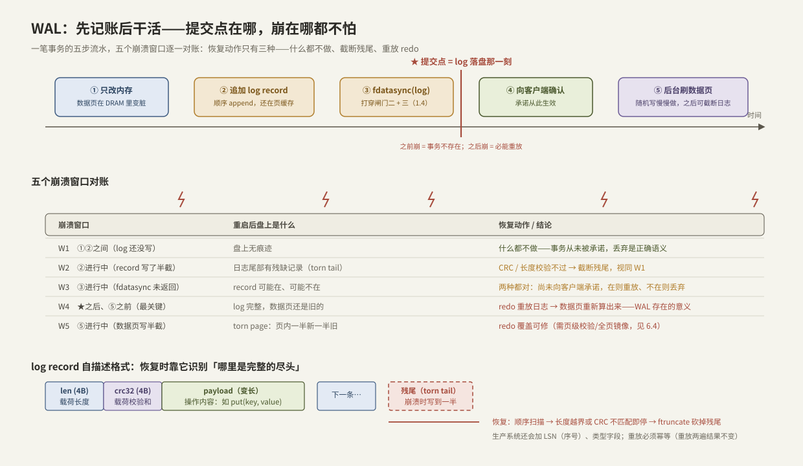

# WAL 与 Crash Consistency

> 前五章把「一笔 IO 怎么走得快」讲完了，第 6 章换问题：**介质慢、进程和机器还会随时崩，怎么保证承诺过的数据一个字节不丢**。直接在数据文件上原地改（in-place update）做不到这一点——崩溃可以把你打断在任何两条指令之间，留下一半新一半旧的盘上状态。WAL（Write-Ahead Log，预写日志）是几乎所有存储引擎的共同答案：**先把「打算做什么」顺序追加到日志并落盘，再慢慢改数据本体**。本篇讲清楚三件事：为什么原地改注定不安全、WAL 的提交点定义在哪、崩在任何一个窗口恢复流程如何自圆其说——并动手写一个能扛 `kill -9` 的最小 WAL。

前置：[[1.4 fsync fdatasync 与持久化语义]]（两级易失缓存与三道闸门——本篇的每一次「落盘」都指打穿它们）、[[1.3 Buffered IO 与 O_DIRECT]]（write 返回 ≠ 持久）。

---

## 1. 问题：崩溃可以打断在任何位置

先把「崩溃一致性（crash consistency）」定义清楚【事实】：**系统在任意时刻断电/崩溃后重启，盘上数据必须处于某个「自洽」状态——要么是操作发生前，要么是操作发生后，绝不能是半截**；且所有已向调用方确认过的操作必须还在。

原地更新为什么做不到？设想一个最朴素的 KV 引擎，`put(k, v)` 直接 `pwrite` 改数据文件里的对应位置：

1. **单条记录都可能半截**：一次逻辑写跨越多个扇区时，掉电后可能只有前一半是新的（torn write，展开见 [[6.4 Torn Write 与 Checksum]]）——盘只承诺扇区级原子性，不承诺你的记录级原子性【事实】；
2. **多处更新更没救**：一个操作常要改多个位置（数据 + 索引 + 元数据）。改到一半崩溃，两处一新一旧，重启后没有任何信息能判断「改到哪了」；
3. **每次改完都 fsync 也无济于事**：fsync 能保证「已写的持久」，保证不了「几处修改一起生效或一起不生效」——**持久性（durability）与原子性（atomicity）是两个独立问题**【事实】。

出路只有一条：**不要求数据本体的更新是原子的，而是另找一个「天然容易做到原子追加」的地方先把意图记下来**。这个地方就是顺序日志。

---

## 2. WAL 的核心协议：三条规则一个提交点

WAL 的全部内容可以压缩成三条规则【事实】：

1. **先写日志**：修改数据页之前，描述这次修改的 log record 必须先追加到日志文件；
2. **提交 = 日志落盘**：向调用方确认「事务已提交」之前，该事务的日志（含 commit 标记）必须已经 `fdatasync` 到介质——**提交点（commit point）被定义为日志落盘完成的那一刻**，与数据本体何时更新完全解耦；
3. **重启先重放**：崩溃重启后，先扫描日志，把已提交但可能没来得及应用到数据本体的操作**重做（redo）**一遍，再对外服务。



这套协议同时买到了三样东西：

- **原子性**：数据本体的多处修改被「一条日志记录是否完整落盘」这个单一事件代表——记录完整则事务存在，不完整则视为从未发生；
- **持久性成本降到最低**【取舍】：关键路径上只有一次**顺序追加 + 一次 fdatasync**。数据本体的随机写全部移出关键路径，由后台慢慢做——把 [[1.4 fsync fdatasync 与持久化语义]] 里「fsync 很贵」的账砍到只付一次，且顺序写是所有介质最擅长的模式；
- **可恢复性**：日志就是操作的全序历史，重放即重建。

**边界【前提】**：本篇（及下面的实现）讨论最常见的 **redo-only** 简化模型——脏数据页只在事务提交后才允许写回盘（no-steal 策略），因此恢复只需 redo、不需 undo。工业引擎（如 InnoDB 的 ARIES 风格）允许未提交脏页提前落盘换取内存弹性，代价是日志里还要记 undo 信息，恢复变成「redo 全部 + undo 未提交」三阶段——机制复杂一个量级，但提交点的定义不变。

---

## 3. 五个崩溃窗口逐一对账

协议是否自洽，要靠穷举崩溃位置来验证（对照上图下半部分）。一笔事务的流水：①改内存 → ②追加 log record → ③fdatasync（log） → ④确认客户端 → ⑤后台刷数据页。

| 窗口 | 崩溃时盘上状态 | 恢复动作 | 为什么正确 |
| --- | --- | --- | --- |
| W1：②之前 | 无痕迹 | 什么都不做 | 事务从未被承诺，丢弃即正确语义 |
| W2：②进行中 | 日志尾部残缺记录（torn tail） | CRC/长度校验失败 → **截断残尾** | 残缺 = 未提交，等价 W1 |
| W3：③进行中 | record 可能在也可能不在 | 在则重放，不在则丢弃 | 尚未向客户端确认，两种结果都合法【事实】 |
| W4：④之后⑤之前 | 日志完整，数据页还是旧的 | **redo 重放** | 已承诺的事务由日志兜底——WAL 存在的意义 |
| W5：⑤进行中 | 数据页半新半旧（torn page） | redo 重放覆盖 | 需配合页级校验或全页镜像识别，见 [[6.4 Torn Write 与 Checksum]] |

两个支撑细节【事实】：

- **日志自身的原子性靠校验和而非盘**：追加半截是常态（W2），所以每条 record 必须自带长度 + CRC，恢复时「读不出完整下一条」就是日志的逻辑终点——**日志的末尾由内容定义，不由文件大小定义**；
- **redo 必须幂等**：W4/W5 的重放可能作用在「其实已经应用过」的数据上，且恢复中途再崩会导致重放执行两遍。因此 record 应记「把 X 设为 v」（幂等），而不是「把 X 加 1」（不幂等）；工业引擎用页级 LSN 比对来跳过已应用的记录【实现】。

**checkpoint 收尾**【事实】：日志不能无限长。周期性地把内存脏页全部刷盘并记录「日志已应用到位置 L」，之后 L 之前的日志即可截断/回收；恢复只需从最近 checkpoint 重放。checkpoint 越频繁恢复越快，但刷脏页的 IO 越重——典型的恢复时间 vs 运行时开销取舍【取舍】。

---

## 4. 最小可运行 WAL：能扛 kill -9 的 60 行

把协议直译成 Modern C++。设计极简但每个成员都对应上文一条规则：record 格式 `[u32 len][u32 crc][payload]`，`append` 只追加、`commit` 才刷盘、`recover` 扫描 + 截断残尾 + 回调重放。复用 [[1.4 fsync fdatasync 与持久化语义]] 的 `UniqueFd` / `write_all` / `sync_or_throw`。

### 4.1 校验和与记录头

CRC 是 W2 窗口的探测器——没有它，残缺记录与完整记录在恢复时无法区分：

```cpp
#include <cstdint>
#include <span>

// CRC-32（反射多项式 0xEDB88320），无表实现，够教学用；生产用 crc32c 硬件指令
constexpr std::uint32_t crc32(std::span<const std::byte> data) {
    std::uint32_t crc = 0xFFFF'FFFFu;
    for (std::byte b : data) {
        crc ^= static_cast<std::uint32_t>(b);
        for (int i = 0; i < 8; ++i)
            crc = (crc >> 1) ^ (0xEDB8'8320u & (0u - (crc & 1u)));
    }
    return ~crc;
}

struct RecordHeader {          // 盘上格式：小端序，紧跟 payload
    std::uint32_t len;         // payload 字节数
    std::uint32_t crc;         // payload 的 CRC-32
};
```

**关键点**：CRC 只覆盖 payload，`len` 本身靠「合法性检查」兜底——恢复时若 `len` 大到越过文件末尾，同样判定为残尾。生产格式还会加 LSN（单调序号）与 record 类型字段，原理不变。

### 4.2 追加与提交：把「提交点」写成代码

```cpp
#include <fcntl.h>
#include <cstring>
#include <filesystem>
#include <vector>

class Wal {
public:
    explicit Wal(const std::filesystem::path& p)
        : fd_{open_or_throw(p.c_str(),
              O_RDWR | O_CREAT | O_APPEND | O_CLOEXEC, 0644)} {}

    // 规则 1：先写日志。只进页缓存，尚无任何持久化承诺
    void append(std::span<const std::byte> payload) {
        RecordHeader h{static_cast<std::uint32_t>(payload.size()),
                       crc32(payload)};
        std::vector<std::byte> buf(sizeof h + payload.size());
        std::memcpy(buf.data(), &h, sizeof h);
        std::memcpy(buf.data() + sizeof h, payload.data(), payload.size());
        write_all(fd_.get(), buf);          // 头 + 载荷一次写出
    }

    // 规则 2：提交点。此调用返回之前，不得向任何人确认事务
    void commit() { sync_or_throw(fd_.get(), "fdatasync(wal)"); }

    int fd() const { return fd_.get(); }

private:
    UniqueFd fd_;
};
```

**关键点**：

- 头和载荷拼进同一个缓冲区**一次 `write` 写出**，避免「头在盘上、载荷不在」的中间态概率被两次系统调用放大（当然协议不依赖这一点——CRC 才是正解，这只是缩小窗口）；
- `append` 与 `commit` 分开，正是为 [[6.2 Group Commit]] 留的接口：多个事务各自 `append`，最后共享一次 `commit`；
- 第一次创建日志文件后还应 `fsync` 父目录，否则崩溃后**文件本身**可能消失——[[1.4 fsync fdatasync 与持久化语义]] §4 的目录规则在这里同样生效，示例为省篇幅略去。

### 4.3 恢复：内容定义末尾，残尾一律截断

```cpp
#include <unistd.h>
#include <functional>

// 重启后调用：完整记录依序回放给 on_record（必须幂等），残尾截掉
inline void recover(Wal& wal,
                    const std::function<void(std::span<const std::byte>)>& on_record) {
    const off_t file_size = ::lseek(wal.fd(), 0, SEEK_END);
    off_t pos = 0;
    while (pos + static_cast<off_t>(sizeof(RecordHeader)) <= file_size) {
        RecordHeader h;
        ::pread(wal.fd(), &h, sizeof h, pos);
        const off_t body = pos + sizeof h;
        if (body + h.len > static_cast<std::uint64_t>(file_size)) break; // len 越界 → 残尾
        std::vector<std::byte> payload(h.len);
        ::pread(wal.fd(), payload.data(), h.len, body);
        if (crc32(payload) != h.crc) break;                              // 校验失败 → 残尾
        on_record(payload);                                              // redo
        pos = body + h.len;
    }
    if (pos < file_size) {                     // W2：把逻辑终点之后的字节物理砍掉
        if (::ftruncate(wal.fd(), pos) != 0)
            throw std::system_error{errno, std::generic_category(), "ftruncate(wal)"};
        sync_or_throw(wal.fd(), "fdatasync(truncate)");
    }
}
```

**关键点**：

- 循环的三个退出条件（头读不满、len 越界、CRC 不过）都指向同一结论：**这里就是日志的逻辑终点**——之后的字节无论是什么都视为噪声；
- 截断后必须再 `fdatasync`：截断本身也是一次需要持久化的修改，否则「砍残尾」这件事可能在下次崩溃中被回滚；
- 示例为教学省略了 `pread` 的短读处理与错误检查（真实代码应像 `write_all` 一样循环重试并在出错时抛 `std::system_error`）。

用法骨架——一个扛崩溃的 KV：`put` = `append(编码后的 k,v)` + `commit` + 改内存表；启动 = `recover` 把内存表重建出来。数据本体（这里退化成纯内存表）想什么时候持久化都行，日志永远兜底——这其实就是 [[6.5 Bitcask 模型]] 的雏形：日志即数据库。

---

## 5. 动手验证：亲手崩给它看

崩溃一致性代码**不测等于没写**。分三档强度：

```bash
# ① 观察等待点：确认关键路径 = 顺序 write + 一次 fdatasync
strace -T -e trace=write,fdatasync ./wal_demo put k1 v1

# ② 进程级崩溃：写入循环中随机 kill -9，重启后校验
while true; do
  ./wal_demo write_forever & pid=$!
  sleep 0.$((RANDOM % 9)); kill -9 $pid
  ./wal_demo verify || { echo "CORRUPTED"; break; }   # verify: recover 后检查不变量
done

# ③ 掉电级：kill -9 杀不掉页缓存，真正的断电会——用 dm-flakey 等
#    工具在块层模拟写丢失/乱序，见 6.10（此处不展开）
```

**②与③的差别务必想清楚【事实】**：`kill -9` 只销毁进程，页缓存里已 `write` 未 `fdatasync` 的数据**仍会被内核写回盘**——它测的是「协议逻辑对不对」，测不出「少刷了一次盘」。漏掉 fdatasync 的 bug 只有断电级注入（[[6.10 崩溃注入测试]]）才能暴露。快速自查法：在 ① 的 strace 输出里数 fdatasync 次数——每次向客户端确认之前必须能看到一次。

---

## 6. 陷阱与误区

> [!warning] 常见错误
> 1. **「WAL = 数据写两遍，所以写性能减半」**：两遍不等价——日志是顺序追加 + 攒批一次刷，数据本体的随机写移出了关键路径。WAL 通常是**提升**小写吞吐的手段，代价是读放大/空间由别的机制收拾（[[6.6 LSM-tree 三种放大]]）。
> 2. **append 之后就向客户端返回成功**：write 返回只到页缓存（[[1.4 fsync fdatasync 与持久化语义]]），提交点是 fdatasync 完成。少这一步，掉电丢最近一批「已确认」事务。
> 3. **record 不带校验和**：残尾与完整记录无法区分，恢复要么把垃圾当数据重放，要么把好数据当垃圾丢弃。
> 4. **redo 不幂等**（记增量而非终值）：恢复重放两遍、或重放到已应用的页上，数据直接错。
> 5. **只测 kill -9 就宣布崩溃安全**：页缓存替你掩盖了缺失的 fdatasync；断电语义必须用故障注入测。
> 6. **fdatasync 返回 EIO 后重试**：状态未知，重试的「成功」不可信——必须当致命错误处理（[[6.3 fsyncgate 与 EIO 处理]]）。
> 7. **日志与数据本体同盘还各自狂刷**：两股流在设备队列里互相插队，日志的顺序性被打碎，p99 上天——日志独立盘/独立命名空间是经典部署【实践】。

---

## 7. 关键结论

| 结论 | 性质 |
| --- | --- |
| 崩溃一致性 = 任意时刻崩溃后盘上状态自洽，且已确认的操作不丢；持久性与原子性是两个独立问题 | 事实 |
| 原地更新做不到多处修改的原子性；WAL 用「顺序日志先落盘」把原子性归约为「一条记录是否完整」 | 事实 |
| 提交点 = 日志 fdatasync 完成的那一刻，与数据本体何时落盘解耦 | 事实 |
| 关键路径成本 = 顺序追加 + 一次 fdatasync；数据本体随机写移到后台——这是 WAL 的性能红利 | 事实 |
| 日志末尾由内容（长度 + CRC 校验）定义，不由文件大小定义；残尾一律截断 | 事实 |
| redo 必须幂等；checkpoint 换恢复时间，代价是运行时刷脏页 IO | 事实 / 取舍 |
| 本篇是 redo-only（no-steal）简化；工业引擎加 undo 换内存弹性 | 前提 |
| kill -9 测不出缺失的 fdatasync——断电语义要靠故障注入 | 实践结论 |

---

## 关联知识

- [[1.4 fsync fdatasync 与持久化语义]] - 「落盘」二字的完整定义，本篇一切承诺的地基
- [[6.2 Group Commit]] - append/commit 分离的直接受益者：多事务分摊一次刷盘
- [[6.3 fsyncgate 与 EIO 处理]] - 提交点上的 fdatasync 失败了怎么办
- [[6.4 Torn Write 与 Checksum]] - W2/W5 两个「写半截」窗口的系统性展开
- [[6.5 Bitcask 模型]] - 「日志即数据库」推到极致的引擎
- [[6.9 RocksDB 关键路径]] - 工业引擎里 WAL 所处的位置
- [[6.10 崩溃注入测试]] - 断电语义的正确测法
