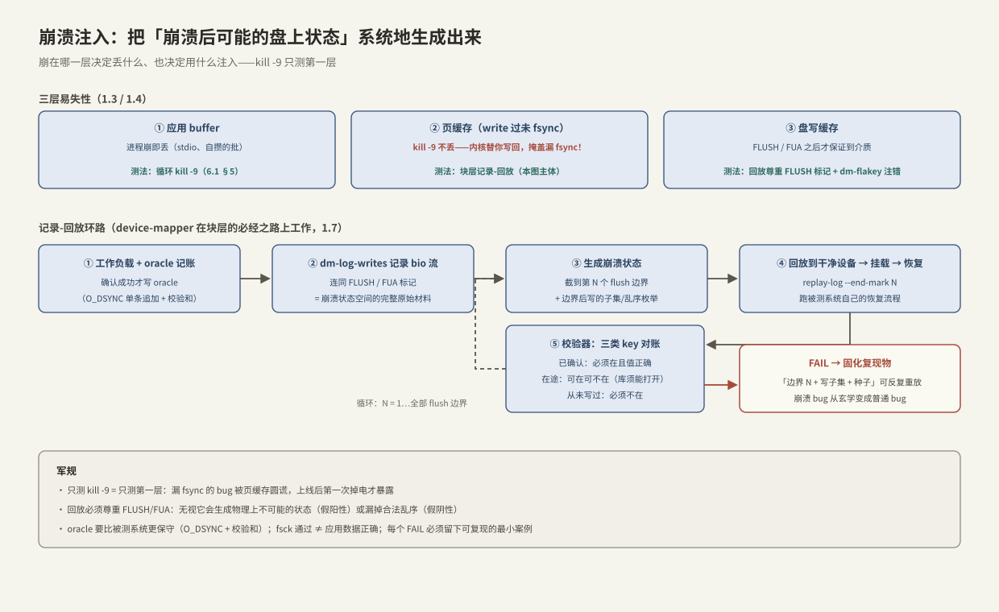

---
tags:
  - 高性能存储/存储引擎
---
# 崩溃注入测试

> [[6.1 WAL 与 Crash Consistency]] 写出了「能扛 kill -9 的 WAL」，并在末尾留了一句警告：**kill -9 杀不掉页缓存，真正的断电会**。本篇兑现这句话：崩溃一致性没法靠 code review 证明——崩溃可以发生在任何两条指令之间、盘上状态可以停在 flush 边界内的任何组合，这是一个**不可穷举靠肉眼、但可以系统生成的状态空间**。方法论一句话：**用工具把「崩溃后盘上可能出现的每一种状态」生成出来，对每个状态跑一遍恢复 + 不变量校验**。测试的分层依据是操作系统的分层：崩在进程、崩在内核（掉电）、崩在盘缓存，三层丢的东西不一样，需要的注入手段也不一样。

前置：[[6.1 WAL 与 Crash Consistency]]（被测协议本体）、[[1.3 Buffered IO 与 O_DIRECT]] / [[1.4 fsync fdatasync 与持久化语义]]（三层易失性的出处）、[[1.7 块层与 blk-mq]]（注入点所在的层）、[[6.4 Torn Write 与 Checksum]]（校验器要抓的典型损伤）。

---

## 1. 概念与边界：崩溃分三层，测试也分三层

数据在到达介质前躺过三层易失存储【事实】（[[1.3 Buffered IO 与 O_DIRECT]]）：

| 层 | 谁丢它 | kill -9 会丢吗 | 掉电会丢吗 |
| --- | --- | --- | --- |
| 应用 buffer（stdio、自己攒的批） | 进程崩溃 | **丢** | 丢 |
| 页缓存（write 过但没 fsync） | 内核崩溃 / 掉电 | **不丢**——内核还活着，flusher 稍后写回 | **丢** |
| 盘写缓存（fsync 过但设备没刷介质） | 掉电（无掉电保护的盘） | 不丢 | **丢**——除非发过 FLUSH/FUA（[[1.4 fsync fdatasync 与持久化语义]]） |

由此得到本篇最重要的推论【事实】：**kill -9 只测第一层**。漏写 `fdatasync` 的 bug 在 kill -9 测试里永远不暴露——页缓存活着，内核把你没刷的数据默默写回了，测试全绿；上线后第一次掉电，「已确认」的数据消失。[[6.1 WAL 与 Crash Consistency]] §5 的实验必须升级到第二、三层才算数。

第二个边界要画清【事实】：崩溃后盘上是什么状态？文件系统与设备只承诺——**FLUSH 边界之前的写已持久，边界之后的写可以部分到达、可以乱序**（写回没有顺序保证，[[1.4 fsync fdatasync 与持久化语义]]）。所以「一次崩溃」不对应一个盘上状态，而对应一个**状态集合**：最后一个 flush 边界前的前缀，叠加边界后任意子集的写。崩溃注入测试的本质就是枚举这个集合的代表元。

---

## 2. 测试环路：记录 → 生成 → 回放 → 校验



工程化的崩溃测试是一个四件套环路【方法】：

```text
① 工作负载(带记账) → ② 块层记录写流 → ③ 生成崩溃状态 → ④ 恢复 + 校验不变量
                                    ↑___________循环枚举所有崩溃点___________|
```

核心工具是 **device-mapper**【实现】：Linux 在块层提供的可堆叠虚拟块设备框架（[[1.7 块层与 blk-mq]] 的下一层邻居）——把一个虚拟设备叠在真实设备上，就能在 bio 流经的必经之路上观察与干预。两个关键 target：

- **dm-log-writes**：把流经的每个 bio（连同 **FLUSH/FUA 标记**）记录成日志——这就是「崩溃后可能状态」的完整原始材料；
- **dm-flakey**：周期性地丢弃写或返回错误——模拟坏盘与瞬断，测 EIO 路径。

有了带 flush 标记的写日志，**崩溃状态生成**就是机械操作【方法】：回放到第 N 个 flush 边界 = 一个合法崩溃状态；再在「边界后未刷的写」里枚举子集与顺序（受 FUA 约束），得到更多合法状态。学术工具 ALICE、CrashMonkey 做的就是这件事的自动化【实现】。

```bash
# ① 在被测目录下叠一层记录设备
dmsetup create log --table "0 $(blockdev --getsz /dev/vdb) log-writes /dev/vdb /dev/vdc"
mkfs.ext4 /dev/mapper/log && mount /dev/mapper/log /mnt/test

# ② 跑带记账的工作负载（§4 的 oracle 写法），然后解除挂载
run_workload /mnt/test && umount /mnt/test

# ③④ 循环：回放到每一个 flush 边界（mark），挂载、恢复、校验
#    replay-log 属 log-writes 配套工具
for n in $(replay-log --log /dev/vdc --list-marks); do
  replay-log --log /dev/vdc --replay /dev/vdd --end-mark "$n"
  mount /dev/vdd /mnt/check
  run_checker /mnt/check || echo "FAIL at flush #$n"   # 失败可精确定位到写序列
  umount /mnt/check
done
```

这个环路的价值在**可复现**【实践】：真实掉电测试（拔电源）随机且不可重放；记录-回放把每个失败案例固化成「第 N 个 flush 边界 + 某个写子集」，可以反复重放调试——崩溃 bug 从「玄学」变成普通 bug。

---

## 3. 三层注入手段对号入座

| 层级 | 手段 | 覆盖的 bug | 不覆盖 |
| --- | --- | --- | --- |
| 进程崩 | 循环 `kill -9`（[[6.1 WAL 与 Crash Consistency]] §5） | 提交点协议错、恢复不幂等、残尾处理 | 漏 fsync、写回乱序 |
| 内核崩/掉电 | dm-log-writes 记录 + 按 flush 边界回放；VM 强杀（`virsh destroy`）作粗粒度替代【实现】 | **漏 fsync、错序依赖**（依赖了 flush 边界之间的顺序）、目录项未刷（rename 后没 fsync 父目录） | 盘缓存层的撕裂 |
| 盘/介质层 | dm-flakey 丢写与注错；篡改字节模拟 torn write | EIO 处理（[[6.3 fsyncgate 与 EIO 处理]]）、半页撕裂的检测与恢复（[[6.4 Torn Write 与 Checksum]]） | — |
| 应用内部 | failpoint / SyncPoint：在代码里埋点，让指定调用点返回错误或直接 `abort()`【实现】 | 特定交错时序（「刷 A 成功、刷 B 失败」这类难以从外部构造的分支） | 只测你埋了点的地方 |

选择顺序【实践】：先把第一层跑绿（成本最低、抓住大部分逻辑错），再上第二层（抓语义错，**必测**），第三、四层按引擎的承诺范围加——承诺能扛 torn write 就必须注入 torn write。

---

## 4. 校验器与不变量：测试的另一半

注入只是一半；**没有精确的不变量，崩溃测试等于没测**【方法】。三件套里最容易写错的是记账（oracle）：

- 工作负载每次「确认成功」后，把这笔操作记进一个 **oracle 文件**；
- 崩溃恢复后，校验器把被测库与 oracle 对账，每个 key 归入三类【事实】：
  1. **已确认**（oracle 里有）：必须存在且值正确——丢了就是 durability bug；
  2. **在途**（发出未确认）：**可在可不在**——两者都合法，但库必须能正常打开；
  3. **从未写过**：必须不存在——冒出来是恢复重放越界。

自指陷阱【实践】：**oracle 自己也会被崩溃打断**。它必须比被测系统更保守——每条记录单独 `O_DSYNC` 追加、带校验和、恢复时残尾截断，就是 [[6.1 WAL 与 Crash Consistency]] 那套最小协议的复用。用 Modern C++ 写出来：

```cpp
#include <fcntl.h>
#include <unistd.h>

#include <cstdint>
#include <filesystem>
#include <span>
#include <string>
#include <system_error>

// oracle：每条确认记录同步落盘。故意慢——测试基础设施要的是不可抵赖，不是吞吐。
class Oracle {
public:
    explicit Oracle(const std::filesystem::path& p)
        : fd_{::open(p.c_str(), O_WRONLY | O_CREAT | O_APPEND | O_DSYNC, 0644)} {
        if (fd_ < 0) throw std::system_error{errno, std::system_category(), "open oracle"};
    }
    ~Oracle() { if (fd_ >= 0) ::close(fd_); }
    Oracle(const Oracle&) = delete;
    Oracle& operator=(const Oracle&) = delete;

    // 只有被测系统「确认成功」之后才调用：写下的都是必须存活的承诺
    void confirm(std::span<const std::byte> record) {
        // 单条 write + O_DSYNC：返回即持久（含记录头与校验和，格式复用 6.1 §4）
        if (::write(fd_, record.data(), record.size())
                != static_cast<ssize_t>(record.size()))
            throw std::system_error{errno, std::system_category(), "oracle write"};
    }

private:
    int fd_;
};

// 校验器骨架：恢复后对账三类 key
enum class Verdict : std::uint8_t { ok, lost_confirmed, ghost_key };

Verdict check(const auto& db, const auto& oracle_entries) {
    for (const auto& [key, value] : oracle_entries)          // ① 已确认：必须在
        if (db.get(key) != value) return Verdict::lost_confirmed;
    for (const auto& key : db.keys())                        // ③ 从未写过：必须不在
        if (!oracle_entries.contains(key) && !maybe_in_flight(key))
            return Verdict::ghost_key;
    return Verdict::ok;                                      // ② 在途 key 两态皆合法
}
```

**关键点**：

- `confirm()` 的调用时机在被测系统返回成功**之后**——顺序反了，oracle 会把「未确认」记成「已确认」，制造假阳性；
- 校验器区分三类而不是两类：把「在途」也判失败会淹没在噪声里，把它判必须存在则是对系统提了它没承诺过的要求；
- `Verdict` 失败时连同「flush 边界编号 + 回放子集」一起输出——这就是可复现的最小案例。

---

## 5. 工程化：测试矩阵与 CI

崩溃测试的维度是乘积空间【方法】：**崩溃层级（3）× 崩溃时机（每个 flush 边界）× 文件系统（ext4/xfs/btrfs）× 挂载选项**。全乘积跑不完，取舍策略【取舍】：

- 时机维度用**全枚举**（flush 边界有限且这是主战场）；
- 文件系统维度至少两种——**只在 ext4 默认配置通过不算通过**：`data=ordered` 顺带保证了一些协议没要求的顺序，换 fs 就露馅【事实/实现】；
- CI 里每晚跑记录-回放全环路，failpoint 单测随每次提交跑；
- 与整个专题的故障演练框架的衔接（超时、慢盘、网络分区等更大的矩阵）见 [[9.6 故障注入矩阵]]。

---

## 6. 陷阱与误区

> [!warning] 常见错误
> 1. **只测 kill -9 就宣布崩溃安全**：页缓存替你把漏掉的 fsync 圆谎了——掉电语义必须在块层注入（§1 的推论，本篇存在的理由）。
> 2. **oracle 不同步落盘**：测试基础设施比被测系统还脆，报出来的「丢数据」分不清是谁丢的。
> 3. **只测最后一刻崩溃**：很多 bug 藏在中间状态（比如 compaction 换文件的窗口、rename 与父目录 fsync 之间）——要扫**每一个** flush 边界。
> 4. **回放时无视 FLUSH/FUA 标记**：把已保证顺序的写也乱序，生成物理上不可能的状态 → 假阳性；反之把边界内的写当成有序 → 假阴性。
> 5. **fsck 通过 = 测试通过**：文件系统一致只说明 fs 自己没坏；应用数据对不对，只有应用级不变量能回答。
> 6. **失败不留复现物**：崩溃 bug 最贵的是复现；每个失败必须固化「边界编号 + 写子集 + 种子」，否则修复无从验证。

---

## 7. 关键结论

| 结论 | 性质 |
| --- | --- |
| 崩溃分三层（进程/内核/盘缓存），各丢不同的东西；kill -9 只测第一层，漏 fsync 的 bug 它永远测不出 | 事实 |
| 崩溃后盘上状态 = 最后 flush 边界前的前缀 + 边界后写的任意子集（可乱序）——一次崩溃对应一个状态集合 | 事实 |
| 测试环路四件套：带 oracle 的负载 → dm-log-writes 记录（带 FLUSH/FUA）→ 按边界生成状态 → 恢复 + 校验 | 方法论 |
| device-mapper 是注入的支点：log-writes 记录回放、flakey 丢写注错——都作用在块层这个必经之路 | 事实 / 实现 |
| 记录-回放把崩溃 bug 变成可复现的普通 bug——这是它优于拔电源的根本原因 | 实践结论 |
| 校验器三分法：已确认必须在、在途两态皆可、未写过必须不在；oracle 自身要用 O_DSYNC 级协议 | 方法论 |
| 只在 ext4 默认挂载上通过 ≠ 崩溃安全：data=ordered 赠送的顺序不属于协议 | 事实 / 实现 |
| failpoint 补外部注入够不着的交错分支；fsck 通过不等于应用数据正确 | 方法论 |

---

## 关联知识

- [[6.1 WAL 与 Crash Consistency]] - 被测协议；oracle 的记录格式也复用它
- [[1.3 Buffered IO 与 O_DIRECT]] / [[1.4 fsync fdatasync 与持久化语义]] - 三层易失性与 FLUSH/FUA 语义的出处
- [[6.3 fsyncgate 与 EIO 处理]] - dm-flakey 注错时被测的正是这条路径
- [[6.4 Torn Write 与 Checksum]] - 介质层注入要模拟的典型损伤
- [[6.9 RocksDB 关键路径]] - `sync` 三档语义，正是本篇要验证的对象
- [[1.7 块层与 blk-mq]] - device-mapper 所在的层
- [[9.6 故障注入矩阵]] - 从崩溃扩展到慢盘/网络分区的完整演练框架
