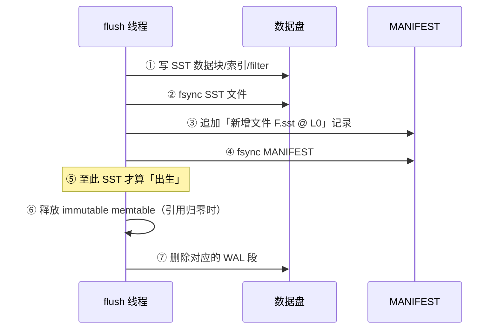

---
tags:
  - 高性能存储
  - 存储引擎
status: 已完成
---

# MemTable、Immutable MemTable 与 SST 生命周期

> [[6.6 LSM-tree 三种放大]] §1 用一句话带过了写入的一生：「memtable 写满冻结、刷盘成 SSTable、逐层下沉」。本篇把这一句话展开成**对象生命周期**：LSM 数据面只有三类对象——active memtable、immutable memtable、SSTable 文件——每个对象什么时候出生、什么时候变态、什么时候死，全部有明确的触发条件和不可逆的方向。掌握这条生命周期线，后面的章节都有了挂靠点：flush 完成要向 [[6.12 Manifest 与 Version Set]] 报户口，immutable 堆积会触发 [[6.14 Write Stall]]，崩溃后靠 WAL 重建的正是这里的内存对象（[[6.17 Recovery 路径]]）。对 C++ 工程师，这条线还有一层熟悉的味道：**全库只有一个对象可写，其余全部只读**——冻结就是把可变对象变成 `shared_ptr<const T>`，删除就是引用计数归零后的析构。

前置：[[6.1 WAL 与 Crash Consistency]]（内存对象崩溃安全的地基）、[[6.6 LSM-tree 三种放大]]（这些对象为什么这样摆）、[[6.9 RocksDB 关键路径]]（同一批对象在读写路径上的位置）。

---

## 1. 三类对象，一条单行道

先给定义【事实】：

- **Active MemTable**：内存里的有序结构（典型实现是跳表【实现】），接收所有新写入——**全库唯一可写的对象**；
- **Immutable MemTable**：写满后被「冻结」的 memtable。还是同一个跳表，只是从此刻起不再接受任何修改，排队等待刷盘；
- **SSTable**（Sorted String Table）：immutable 刷到盘上的产物——按 key 排序的**不可变文件**，自带索引与 bloom filter，落在 L0 层，之后被 compaction 逐层搬运归并（[[6.7 Compaction 策略]]）。

用一个例子把路走一遍：连续 `Put("a",1)`、`Put("b",2)`……写满 64 MiB 后，这批 kv 的物理位置将依次是——active 跳表 → 冻结后的 immutable 跳表 → L0 的某个 `.sst` 文件 → 被 compaction 归并进 L1 的新文件（旧 L0 文件作废）→ 一路下沉。**方向永远向前，没有任何一步回退**【事实】。

![[图片/SVG/8_6_11_1.svg|900]]

这条单行道换来的东西，正是并发程序员最眼馋的【事实】：除了 active memtable 需要写保护，**其余所有对象天然线程安全**——读线程拿到引用就可以随便读，不需要任何锁。LSM 把「共享可变」这个并发难题，在架构层面改写成了「单写者 + 不可变快照」。

---

## 2. Active MemTable：唯一的可变对象

### 2.1 为什么是跳表

memtable 要同时满足三件事【事实】：插入快（写路径在关键路径上）、有序遍历（flush 时要按 key 顺序铺文件、scan 要范围查询）、并发读安全（读线程与写线程同时访问）。跳表（skip list）恰好三样全占【实现】：

- 插入 O(log n)，且**只新增节点、不移动旧节点**——已存在节点的指针和数据永不改变；
- 天然有序，迭代就是走底层链表;
- 单写者模型下，写线程用原子指针接入新节点（release 发布），读线程 acquire 读指针——**读端完全无锁**。对比平衡树：旋转会移动多个节点，无锁化困难得多——这就是 LevelDB/RocksDB 都选跳表的原因【实现】。

### 2.2 写入协议：WAL 先行

一笔写进 active memtable 前，必须先在 WAL 里留下备份（[[6.1 WAL 与 Crash Consistency]]）【事实】：

```text
① WAL 追加记录（+ 按配置 fsync）→ ② 插入 active memtable → ③ 向客户端确认
```

顺序不能反：memtable 是易失内存，崩溃即蒸发；WAL 是它在盘上的影子。**每个 memtable 精确对应一段 WAL**——这个「一对一」是 §4 里 WAL 删除规则的地基。

---

## 3. 冻结：一次 O(1) 的指针交换

active 写满触发冻结（switch）。触发条件【实现】（以 RocksDB 为例）：

- 单个 memtable 达到 `write_buffer_size`（默认 64 MiB）;
- 所有列族的 WAL 总量超限（逼着旧 memtable 赶紧 flush 好回收 WAL）;
- 手动 `Flush()` 或关库前的收尾。

冻结这个动作本身便宜得惊人【事实】：**不拷贝任何数据**，只是一组指针操作——

```text
immutable 队列.push(active);   // 老跳表整体改名为 immutable
active = new 空跳表;            // 新写入从此进新对象
切换到新的 WAL 段;              // WAL 边界与 memtable 边界对齐
```

三个动作在一个临界区里原子完成【实现】。「切 WAL 段」与「换 memtable」必须绑在一起：这样每个 WAL 段完整覆盖且仅覆盖一个 memtable，恢复时才能**整段重放、整段丢弃**（§4）。

C++ 同构物【事实】：这就是 `std::atomic<std::shared_ptr<const T>>` 的「复制-修改-发布」模式的退化版——甚至更简单，因为旧对象不需要复制，它整体转为只读。发布之后，读线程无论持有新旧哪个指针都是安全的：旧指针指向的对象再也不会变。

**队列有上限**【实现】：immutable 不能无限堆积（RocksDB `max_write_buffer_number`，默认 2，含 active）。写入太快、flush 跟不上，队列满 → 引擎掐住前台写——这就是 [[6.14 Write Stall]] 的第一种触发条件。生命周期的每个「等待位」都是有界缓冲，背压由此产生。

---

## 4. Flush：从内存到 L0，以及 WAL 的死期

后台 flush 线程从 immutable 队列取任务，做的事情本质是「把已排序的跳表顺序抄成文件」【事实】：跳表本来有序，迭代一遍、依序写数据块、附上索引块和 bloom filter，就是一个合法的 SSTable——**全程顺序写，没有任何随机 IO**，这是 LSM 写路径快的另一半原因（前一半是 WAL 顺序追加）。

真正需要小心的是**收尾的次序**——它决定崩溃安全【事实/实现】：



两条规则从次序里长出来：

- **MANIFEST 记录是 SST 的出生证明**【事实】：崩溃发生在 ③ 之前，盘上那个写了一半（甚至写完了）的 `.sst` 是无主文件——恢复时 [[6.12 Manifest 与 Version Set]] 不认它，直接清理，数据靠 WAL 重放找回来，不丢也不重；
- **WAL 的删除条件是三合一**【事实】：对应 memtable 已 flush 完成、新 SST 已记入 MANIFEST 并 fsync、没有更旧的 memtable 还依赖这段 WAL。三条缺一就删，等于亲手把崩溃恢复的最后一根绳子剪断——「WAL 删早了」是存储引擎数据丢失事故的经典成因【实践】。

崩溃窗口对账（[[6.1 WAL 与 Crash Consistency]] §3 的方法搬过来用）【事实】：

| 崩溃时刻 | 盘上状态 | 恢复动作 |
| --- | --- | --- |
| 冻结前 | WAL 段完整，无 SST | 重放 WAL 重建 active |
| flush 进行中（①②） | 半截 SST，MANIFEST 未记 | 无主文件清理，重放 WAL |
| ③④ 之间 | SST 完整，MANIFEST 半截 | MANIFEST 按记录校验截断，同上 |
| ⑦ 之前 | SST 已生效，WAL 还在 | 重放该 WAL 段为**幂等覆盖**（[[6.18 WAL 回放幂等性]]），结果不变 |

---

## 5. SST 的一生：出生、改嫁、作废、火化

SST 文件出生即不可变，它的生命周期全靠「被谁引用」驱动【事实】：

1. **出生**：flush（进 L0）或 compaction（进 L1+）产出，MANIFEST 记账；
2. **在役**：被当前 Version（[[6.12 Manifest 与 Version Set]]，「现在有哪些文件有效」的清单）引用，服务读请求；
3. **作废（obsolete）**：作为 compaction 的输入被归并进新文件后，逻辑上已死——新 Version 不再引用它；
4. **火化**：所有引用归零后 `unlink` 删除文件，磁盘空间归还。

关键在第 3、4 步之间的缝隙【事实】：文件逻辑上死了 ≠ 可以物理删除。还可能有人拿着它——

- 一个开了很久的**迭代器**：它钉住的是打开瞬间的文件集合，其中某些文件此后作废了，但迭代器还在读;
- 一个**快照**（[[6.15 Snapshot 与 Sequence Number]]）：语义上要求「看见过去某一刻」，过去那一刻的文件就不能消失;
- 正在读它的 compaction 任务本身。

所以删除靠**引用计数**，不靠时间【实现】——这就是 `shared_ptr` 的析构语义，连底层机制都同构：POSIX 的 `unlink` 只删目录项，已打开的 fd 继续可读，最后一个 fd 关闭时文件才真正消失——**文件系统自己就是一层引用计数**。

代价也同款【实践】：一个忘了关的长命迭代器 = 一个长命 `shared_ptr` 拖住大对象——旧 SST 删不掉，空间放大上涨（[[6.6 LSM-tree 三种放大]] §2.3），compaction 重写完发现输入文件还得留着，白占一份空间。「iterator 泄漏导致磁盘涨满」是 LSM 引擎的高频事故【实践】。

---

## 6. Modern C++：五十行跑通生命周期

把主干写成能编译的骨架：单写者引擎 + 后台 flush，重点看**冻结的指针交换**与**读端无锁快照**两个形状。为聚焦生命周期，跳表用 `std::map` 代替、SST 简化为落盘的有序文本【实现】：

### 6.1 对象与冻结

```cpp
#include <filesystem>
#include <format>
#include <fstream>
#include <map>
#include <memory>
#include <mutex>
#include <print>
#include <string>
#include <vector>

struct MemTable {
    std::map<std::string, std::string> kv;   // 代替跳表:同样有序
    std::size_t bytes = 0;
};

class Engine {
public:
    void put(std::string k, std::string v) {
        std::scoped_lock lk{mu_};
        // 真实引擎此处先追加 WAL(6.1),略去以聚焦生命周期
        active_->bytes += k.size() + v.size();
        active_->kv.insert_or_assign(std::move(k), std::move(v));
        if (active_->bytes >= kFreezeBytes) freeze_locked();
    }

private:
    void freeze_locked() {                    // 冻结:纯指针操作,O(1)
        imm_.push_back(std::move(active_));   // unique_ptr → 队列,从此无人可写
        active_ = std::make_unique<MemTable>();
        // 真实引擎同一临界区内还要:切换 WAL 段
    }

    static constexpr std::size_t kFreezeBytes = 64 << 20;
    std::mutex mu_;
    std::unique_ptr<MemTable> active_ = std::make_unique<MemTable>();
    std::vector<std::shared_ptr<const MemTable>> imm_;  // 注意:const
    friend void flush_one(Engine&, const std::filesystem::path&, int);
};
```

**关键点**：

- `imm_` 的元素类型是 `shared_ptr<const MemTable>`——**类型系统替我们执行「冻结后只读」**：谁也拿不到非 const 引用，编译器兜底；
- `freeze_locked` 里 `unique_ptr` 隐式转成 `shared_ptr<const>`：所有权从「独占可写」降级为「共享只读」，恰好就是冻结的语义——C++ 的智能指针类型把状态机画在了签名里；
- 真实引擎的 `mu_` 只护住指针交换这几纳秒，数据面读写不在锁下。

### 6.2 flush 与读端快照

```cpp
void flush_one(Engine& e, const std::filesystem::path& dir, int file_no) {
    std::shared_ptr<const MemTable> victim;
    {
        std::scoped_lock lk{e.mu_};
        if (e.imm_.empty()) return;
        victim = e.imm_.front();              // 拿引用,不搬数据
    }
    std::ofstream sst{dir / std::format("{:06}.sst", file_no)};
    for (const auto& [k, v] : victim->kv)     // map 有序 → 顺序铺文件
        sst << k << '\t' << v << '\n';
    sst.flush();                              // 真实引擎:fsync + 写 MANIFEST + fsync
    {
        std::scoped_lock lk{e.mu_};           // 收尾后才从队列摘除
        std::erase(e.imm_, victim);           // 真实引擎此后才可删对应 WAL 段
    }
}   // victim 离开作用域:若无读者共持,memtable 内存在此归还
```

**关键点**：

- flush 全程**不持引擎锁**——它读的是只读对象,谁也碰不着它;锁只在取任务、摘队列两个瞬间出现;
- 读线程的形状与此相同：锁下抓一把 `shared_ptr`（active 的快照 + 各 immutable + 当前 Version 的 SST 列表），松锁后按新→旧探测——**引用在手，无锁慢慢读**;
- 最后一行注释就是 §5 的火化仪式:内存版的「引用归零才释放」,与 SST 文件的 unlink 一模一样。

---

## 7. 观测：在真实引擎上看见生命周期

RocksDB 把每一环都记了账【实现】：

```bash
# 内存对象:active 当前大小 / immutable 个数(贴近上限 = flush 跟不上)
# 应用内: db->GetProperty("rocksdb.cur-size-active-mem-table", &v);
#         db->GetProperty("rocksdb.num-immutable-mem-table", &v);

# 文件视角:数据目录里三类文件的生灭
ls -l <db_dir>          # *.log = WAL 段, *.sst = SSTable, MANIFEST-*
watch -n1 'ls <db_dir> | grep -c sst'   # 写压力下看 SST 出生速度

# 系统视角:flush 应表现为纯顺序写
iostat -x 5             # flush 期间 wMB/s 高而 w/s 相对低(大块顺序写)
```

一个对照实验【实践】：压写入的同时 `watch` WAL 文件数——正常时 `.log` 随 flush 完成被删除、数量稳定；如果 `.log` 只增不减，说明 flush 卡住（盘慢或被限速），write stall 已在路上——这比等 p99 报警早得多。

---

## 8. 陷阱与误区

> [!warning] 常见错误
> 1. **把 memtable 当读缓存**：它是**写缓冲**，只装最近写入的数据，读命中率天然没有保证——读性能靠 block cache 和 bloom filter（[[6.13 Bloom Filter 与 Block Cache]]），不靠调大 memtable。
> 2. **`write_buffer_size` 一调解千愁**：调大确实能摊薄 flush 频率，但代价是崩溃恢复要重放更大的 WAL、单次 flush 的 IO 突刺更猛、内存占用上限抬高——它是三方取舍的旋钮，不是免费加速键。
> 3. **immutable 堆积时去调 `max_write_buffer_number`**：堆积的根因是 flush 消费太慢（盘带宽、rate limiter、[[6.16 Rate Limiter 与后台任务隔离]]），加大队列只是把 stall 推迟几秒、让最终爆发更猛——治堵先治消费端。
> 4. **手工清理「没用的」文件**：`.log` 在对应 memtable flush 完成前是最后的救命绳；「作废」的 `.sst` 可能正被快照钉着。数据目录里没有一个文件是引擎忘了删的——删除永远交给引擎的引用计数。
> 5. **长命迭代器/快照不关**：钉住旧 memtable 与旧 SST，内存和磁盘一起涨，compaction 白做——用 RAII 管住迭代器的生命周期，就像管住任何一个昂贵的 `shared_ptr`。
> 6. **忽视冻结与 WAL 切段的原子性**（自研引擎陷阱）：两个动作分开做，WAL 段与 memtable 边界错位，恢复时要么多放、要么漏放——必须同临界区完成。

---

## 9. 关键结论

| 结论 | 性质 |
| --- | --- |
| 数据面只有三类对象：active（唯一可写）、immutable（只读待刷）、SST（盘上不可变）——状态只前进不回退 | 事实 |
| 「单写者 + 不可变快照」让除 active 外的一切天然线程安全：读端拿引用即可无锁读 | 事实 |
| 冻结是 O(1) 指针交换，且必须与 WAL 切段同临界区——WAL 段边界对齐 memtable 边界，恢复才能整段处理 | 事实/实现 |
| MANIFEST 记录是 SST 的出生证明：没记账的文件在恢复时视同不存在，数据由 WAL 兜底 | 事实 |
| WAL 死期 = flush 完成 + MANIFEST 落盘 + 无更旧依赖，三条全满足；提前删 = 剪断崩溃恢复的绳子 | 事实 |
| SST 删除靠引用计数不靠时间：Version、迭代器、快照都是持有者；unlink 之下文件系统还有一层 fd 引用计数 | 事实/实现 |
| immutable 队列、L0 文件数都是有界缓冲：flush/compaction 跟不上时背压逐级回传，最终表现为 write stall | 事实 |
| 长命迭代器/快照 = 长命 shared_ptr 拖住大对象：空间放大与内存一起涨——生命周期要用 RAII 管住 | 实践结论 |

---

## 关联知识

- [[6.1 WAL 与 Crash Consistency]] - memtable 的盘上影子，本篇 §4 删除规则的前提
- [[6.6 LSM-tree 三种放大]] - 这套对象摆放方式的代价账本
- [[6.7 Compaction 策略]] - SST「改嫁」环节的策略选择
- [[6.9 RocksDB 关键路径]] - 同一批对象在一次读/写请求里的出场顺序
- [[6.12 Manifest 与 Version Set]] - SST 的户口本：出生证明与在役清单
- [[6.14 Write Stall]] - immutable 堆积、L0 超限时的背压终点
- [[6.15 Snapshot 与 Sequence Number]] - 钉住旧对象的另一类持有者
- [[6.17 Recovery 路径]] - 崩溃后按本篇窗口表重建内存对象的完整流程
- [[6.18 WAL 回放幂等性]] - 「SST 已生效但 WAL 未删」窗口安全的原因

---

## 参考

- LevelDB / RocksDB 源码与 RocksDB Wiki - MemTable、Flush、Obsolete Files Purge 相关章节
