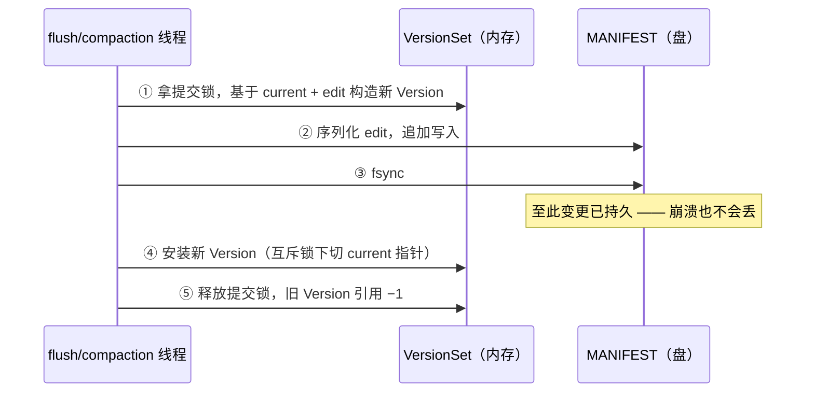

---
tags:
  - 高性能存储
status: 已完成
---

# Manifest 与 Version Set

> [[6.11 MemTable Immutable 与 SST 生命周期]] 讲完了 SST 文件的生老病死，但留了一个口子：引擎自己是怎么**记住**「现在有哪些 SST、各在哪一层」的？这份记忆不能只放内存——进程一崩就没了；也不能靠扫目录——目录里混着写了一半的文件和已作废还被引用的文件。所以引擎给**元数据**也配了一整套「内存态 + 日志」：内存里是引用计数串起来的不可变 **Version** 链（由 **VersionSet** 管理），盘上是一条只追加的 **MANIFEST** 日志，入口是一个只有一行内容的 **CURRENT** 文件。对 C++ 工程师，这套东西全是老朋友：Version 是 copy-on-write 的不可变快照 + `shared_ptr` 引用计数，MANIFEST 是给元数据配的 WAL（[[6.1 WAL 与 Crash Consistency]]），CURRENT 的更新靠 `rename` 的原子性（[[1.11 rename link unlink 崩溃语义]]）。本篇把「一次 flush/compaction 完成后，这笔账怎么记、崩溃后怎么对账」走通，为 [[6.17 Recovery 路径]] 铺好地基。

前置：[[6.11 MemTable Immutable 与 SST 生命周期]]（账本记的就是这些文件的生死）、[[6.9 RocksDB 关键路径]]（读请求第一步就是取 current Version）、[[6.1 WAL 与 Crash Consistency]]（同一套日志思想，这次用在元数据上）。

---

## 1. 问题：为什么不能「重启后扫一遍目录」

先把朴素方案证伪。数据库目录里躺着一堆 `.sst` 文件，重启后 `ls` 一遍不就知道有哪些文件了？不行，原因有三【事实】：

1. **目录里有「假文件」**：flush 崩在半路会留下写了一半的 `.sst`（[[6.11 MemTable Immutable 与 SST 生命周期]] §4）；compaction 的输出文件在完工前也一直躺在目录里。文件名分不出真假——需要一份「谁是正式在编」的名单；
2. **文件名不含层级**：LSM 的正确性依赖「每个文件属于哪一层」（L1 以下层内不重叠、读时按层探测，[[6.6 LSM-tree 三种放大]]）。这个信息只存在引擎的账本里，文件自己不知道；
3. **变更必须原子**：一次 compaction 是「删 N 个旧文件 + 加 M 个新文件」的**打包动作**——读者要么看到旧组合、要么看到新组合，绝不能看到「旧的删了、新的还没上」的中间态；崩溃恢复也一样，要么恢复到 compaction 前、要么恢复到 compaction 后。

第三条把问题的本质暴露出来了：**文件集合的变更需要事务语义**。而我们已经有一套解决事务语义的工具——日志 + 原子提交。于是引擎的做法就是一句话【事实】：

> **元数据也是数据**：内存里放当前状态，盘上放变更日志，恢复 = 重放日志。

---

## 2. 内存侧：Version、VersionEdit、VersionSet

三个名词，用 C++ 的语言各给一句定义【实现】（以 LevelDB/RocksDB 的命名为准）：

- **Version**：某一时刻「各层有哪些 SST 文件」的**不可变快照**——一个 `const` 对象，创建后永不修改，带引用计数；
- **VersionEdit**：两个 Version 之间的**差量**——「L0 加了 12.sst；L0 删了 07.sst、09.sst；L1 加了 13.sst」这样一小包增删记录，同类比是一次 git commit 的 diff；
- **VersionSet**：管理者——持有 `current` 指针指向最新 Version，负责「拿旧 Version + 一个 VersionEdit，造出新 Version，再切换 current」。

![[图片/SVG/8_6_12_1.svg|900]]

这套设计与 [[6.11 MemTable Immutable 与 SST 生命周期]] 的「单写者 + 不可变快照」是同一个模子【事实】：

- **变更 = 造新版本**，不是原地改——copy-on-write。所以任何读者拿到一个 Version 后，它看到的文件集合永远一致，不需要任何锁；
- **读请求第一步就是 pin 住 current Version**（引用计数 +1，[[6.9 RocksDB 关键路径]] §3 第 1 步），读完 −1。整个读操作期间哪怕 compaction 换掉了一半文件，这个读者眼里的世界纹丝不动；
- **旧 Version 的死期由引用计数决定**：没人引用时回收；被长命迭代器钉住的旧 Version 会连带钉住它引用的旧 SST 文件——这正是 6.11 §5「文件火化靠引用计数」在元数据层的对应物。

原子性的实现便宜得很【实现】：切换 current 就是互斥锁保护下的一次指针赋值，读者拿引用则可以做到近乎无锁（RocksDB 进一步把「memtable 组 + current Version」打包成 SuperVersion，读线程一次原子取整包，进一步压缩临界区——实现细节，思想不变）。

---

## 3. 盘侧：MANIFEST 是元数据的 WAL

内存态解决了「运行中怎么看」，盘上还得解决「崩了怎么找回来」。做法完全照抄 WAL【事实】：

- 每产生一个 VersionEdit，就把它**序列化后追加写入 MANIFEST 文件**，每条记录带 CRC（记录格式与 WAL 相同，坏尾可检测、可截断，[[6.4 Torn Write 与 Checksum]]）；
- MANIFEST **只追加、不改写**——顺序写，与数据 WAL 同样的性能形状；
- 恢复时从头**逐条重放**：从空状态开始依次 apply 每个 edit，放完最后一条，得到的就是崩溃前最后一次成功提交的 current Version。

两个工程细节把这条日志补成完整方案【实现】：

**其一，MANIFEST 会长大，所以要「快照 + 增量」。** 日志无限追加，重放时间就无限涨。解法和所有日志系统一样：定期开一个新 MANIFEST 文件，**首条记录写入当前的全量文件清单**（相当于一条大号 edit），之后继续追加增量。RocksDB 在每次打开数据库时、以及文件超过 `max_manifest_file_size` 时做这个切换。旧 MANIFEST 随后作废删除。

**其二，「哪个 MANIFEST 是活的」需要一个原子入口——CURRENT 文件。** 目录里可能同时存在新旧两个 MANIFEST（切换写到一半时崩溃）。CURRENT 是一个内容只有一行的小文件，写着活跃 MANIFEST 的文件名。更新它用的是文件系统的经典原子替换三步【事实】：

```text
写临时文件（内容 "MANIFEST-000013\n"）→ fsync → rename 为 CURRENT
```

`rename` 在 POSIX 语义下对目录项的替换是原子的（[[1.11 rename link unlink 崩溃语义]]）：崩在 rename 前，CURRENT 还指旧 MANIFEST——新 MANIFEST 白写了但无害；崩在 rename 后，指向的新 MANIFEST 早已 fsync 完整。**任何时刻读 CURRENT，得到的都是一个完整可用的 MANIFEST**。

---

## 4. LogAndApply：一次版本切换的完整时序

flush 或 compaction 完工后，向 VersionSet 提交 edit 的函数在 LevelDB/RocksDB 里叫 `LogAndApply`——名字就是次序：**先 Log（落盘），后 Apply（改内存）**【实现】：



次序背后是熟悉的规则【事实】：**先盘后内存**。②③ 在 ④ 之前，意味着「内存里可见的状态」永远不领先于「盘上已持久的状态」——反过来就完了：读者看到了新文件组合、崩溃后账本里却没有，恢复出来的世界和读者看过的世界对不上。

这条路径在端到端数据路径中的位置值得专门说清【事实】：

- **前台读写完全不碰 MANIFEST**。读请求 pin Version 是纯内存操作；写请求走 WAL + memtable（[[6.9 RocksDB 关键路径]] §2）。所以 MANIFEST 的 fsync 不在前台延迟的关键路径上；
- **但它在后台流水线的关键路径上**：所有 flush、所有 compaction 的收尾都要串行排队过这把提交锁 + 这次 fsync【实现】。等待点由此产生——如果 MANIFEST 所在的盘很慢（或和数据盘、WAL 盘挤在一起被打满），每次后台任务收尾都多等几十毫秒，flush/compaction 吞吐下降，堆积逐级回传，最终以 [[6.14 Write Stall]] 的形式砸回前台。**一个「不在前台路径上」的 fsync，绕了一圈还是能把前台写卡住**；
- **fsync 失败必须当成大事故**：MANIFEST 写失败意味着账本不可信，RocksDB 的做法是置后台错误、整库转只读【实现】——这正是 [[6.3 fsyncgate 与 EIO 处理]] 的教训在元数据上的应用：fsync 报错后不能假装重试就好。

数据拷贝方面这条路径极轻【事实】：edit 序列化后通常就几十到几百字节，一次用户态构造 + 一次 `write` 的内核拷贝，成本全在 fsync 的等待上——**元数据路径是「拷贝便宜、等待昂贵」的极端案例**。

---

## 5. 崩溃窗口对账

沿用 [[6.1 WAL 与 Crash Consistency]] §3 的方法，把 §4 时序的每个缝隙检查一遍【事实】：

| 崩溃时刻 | 盘上状态 | 恢复结果 |
| --- | --- | --- |
| ② 之前 | MANIFEST 无此 edit，新 SST 是无主文件 | 恢复到旧 Version；无主文件被清理；flush 场景数据由 WAL 重放兜底，compaction 场景输入文件还在、重做即可 |
| ②③ 之间（记录写了一半） | MANIFEST 尾部半条记录，CRC 不过 | 坏尾截断，等价于「② 之前」 |
| ③④ 之间 | edit 已持久，内存没装上（进程已死，无所谓） | 重放到含此 edit：恢复出**新** Version——比崩溃前内存所见还新一步，但完全一致合法 |
| MANIFEST 切换中 | 新旧 MANIFEST 并存 | CURRENT 指谁用谁（§3 其二），另一个作废清理 |

再加上开库时的**目录对账**【实现】：重放得到 current Version 后，引擎把目录里的文件与账本比对——账本上没有的 `.sst`（半截文件、作废文件）、已不被 CURRENT 引用的旧 MANIFEST，一律删除。6.11 §4 说「MANIFEST 记录是 SST 的出生证明」，执法环节就在这里。

一个真实故障形态收尾【实践】：如果 CURRENT 指向的 MANIFEST 丢失或损坏（误删、盘坏），库直接打不开——数据文件都完好，却没了户口本。RocksDB 提供 `ldb repair` 类工具：扫描全部 `.sst`，读文件内部的元信息（key 范围等），重建一份 MANIFEST。数据大多能救回来，但层级结构等信息按保守规则重摆，恢复后的读性能形状不保证——**账本可以重建，代价是丢失账本里独有的组织信息**。这也解释了为什么 6.11 §8 强调：数据目录里没有一个文件是可以手删的。

---

## 6. Modern C++：五十行 VersionSet

把 §2–§4 的主干写成能编译的骨架。重点看三个形状：Version 的 `shared_ptr<const>`、edit 的差量应用、LogAndApply 的「先盘后内存」次序。序列化简化为文本行【实现】：

```cpp
#include <algorithm>
#include <cstdint>
#include <fstream>
#include <map>
#include <memory>
#include <mutex>
#include <string>
#include <vector>

struct FileMeta { std::uint64_t number; };          // 真实实现还有 key 范围、大小等

struct Version {                                     // 不可变快照
    std::vector<std::vector<FileMeta>> levels;       // levels[L] = 该层在役文件
};

struct VersionEdit {                                 // 两个版本之间的差量
    std::vector<std::pair<int, FileMeta>> added;     // {level, file}
    std::vector<std::pair<int, std::uint64_t>> deleted;
};

class VersionSet {
public:
    explicit VersionSet(const std::string& manifest_path, int num_levels = 7)
        : manifest_{manifest_path, std::ios::app},
          current_{std::make_shared<const Version>(
              Version{.levels = std::vector<std::vector<FileMeta>>(num_levels)})} {}

    // 读端：pin 当前版本 —— shared_ptr 拷贝就是引用计数 +1
    std::shared_ptr<const Version> pin_current() const {
        std::scoped_lock lk{mu_};
        return current_;
    }

    // 提交端：先 Log（盘），后 Apply（内存）
    void log_and_apply(const VersionEdit& edit) {
        std::scoped_lock lk{mu_};                    // 真实实现是独立的提交锁
        auto next = std::make_shared<Version>(*current_);   // copy-on-write
        for (auto& [level, num] : edit.deleted)
            std::erase_if(next->levels[level],
                          [num](const FileMeta& f) { return f.number == num; });
        for (auto& [level, f] : edit.added) next->levels[level].push_back(f);

        append_record(edit);                         // ① 追加序列化记录
        manifest_.flush();                           // ② 真实实现：fsync；失败则整库转只读
        current_ = std::move(next);                  // ③ 至此新版本才对读者可见
    }                                                // 旧 Version 引用归零时自动析构

private:
    void append_record(const VersionEdit& edit) {    // 真实实现：二进制编码 + CRC
        for (auto& [l, f] : edit.added)   manifest_ << "+ " << l << ' ' << f.number << '\n';
        for (auto& [l, n] : edit.deleted) manifest_ << "- " << l << ' ' << n << '\n';
    }

    mutable std::mutex mu_;
    std::ofstream manifest_;
    std::shared_ptr<const Version> current_;
};
```

**关键点**：

- `pin_current` 返回 `shared_ptr<const Version>`——读者拿到的是**类型系统保证只读**的快照，锁只护住指针拷贝那一瞬间，之后读多久都不碍任何人的事；
- `log_and_apply` 里 `current_ = std::move(next)` 必须排在落盘之后——把这两行对调，就造出了 §5 表里不存在的第五种窗口：「读者见过、盘上没有」；
- 恢复的实现就是把 `append_record` 反过来：逐行读 MANIFEST，攒成 edit 依次 apply——和运行时共用同一个 apply 函数，**重放路径与正常路径同构**，这是日志式系统测试成本低的原因之一（[[6.10 崩溃注入测试]]）。

---

## 7. 观测：看见账本的生灭

```bash
# 账本三件套：CURRENT 指谁、MANIFEST 多大、有没有滞留的旧 MANIFEST
cat <db_dir>/CURRENT
ls -l <db_dir>/MANIFEST-* <db_dir>/CURRENT

# 人肉读账本：RocksDB 自带工具 dump 全部 edit 序列
ldb manifest_dump --path=<db_dir>/MANIFEST-000012

# 验证「先盘后内存」：追踪 flush 收尾时对 MANIFEST 的 write + fsync 次序
strace -f -e trace=write,fsync,fdatasync,rename -p <pid>
```

对照实验思路【实践】：写压力下每秒 `ls` 一次数据目录——每完成一次 flush/compaction，能看到 `.sst` 集合变化的**同一时刻** MANIFEST 尺寸增长；kill -9 后重启，用 `ldb manifest_dump` 对比崩溃前后账本，验证 §5 的窗口表（配合 [[6.10 崩溃注入测试]] 的注入手段更系统）。

---

## 8. 陷阱与误区

> [!warning] 常见错误
> 1. **手删 CURRENT / MANIFEST**：「数据都在 sst 里，这俩小文件应该没用」——删掉 = 烧户口本，库直接打不开，只能走 repair 丢失层级信息。数据目录里的每个文件都归引擎管（6.11 §8 同款结论，本篇给了原因）。
> 2. **把 MANIFEST 的 fsync 当小事**：它不在前台路径上，但所有后台任务收尾串行过它（§4）——放在慢盘/共享盘上，write stall 会以一种极难排查的方式出现：前台卡了，数据盘却不忙。
> 3. **以为「扫目录」能兜底恢复**：目录里有半截文件、作废文件，且文件不自带层级——账本不是缓存，是唯一事实源（§1）。
> 4. **自研引擎把「删旧文件」和「记账」次序写反**：必须先把「删除」记入 MANIFEST 并 fsync，之后才能 unlink 旧文件；反过来崩溃后账本引用着不存在的文件，库打不开或静默丢数据。
> 5. **长命迭代器只当读性能问题**：它 pin 住旧 Version → 钉住旧 SST → 磁盘涨（6.11 §5）；本篇补上另一半：旧 Version 链也在内存里越挂越长——元数据内存同样在涨。
> 6. **混淆两本账**：WAL 记「数据变更」，MANIFEST 记「文件集合变更」；WAL 的删除依赖 MANIFEST 先记账（6.11 §4 的三合一条件）——两本账的耦合点在 flush 收尾，次序错一步就丢数据。

---

## 9. 关键结论

| 结论 | 性质 |
| --- | --- |
| 文件集合的变更需要事务语义，所以元数据也用「内存态 + 日志」：Version 链在内存，MANIFEST 在盘 | 事实 |
| Version 是不可变快照 + 引用计数：变更 = copy-on-write 造新版本 + 指针原子切换，读端近乎无锁 | 事实/实现 |
| MANIFEST 就是元数据的 WAL：追加写、CRC 记录、坏尾截断、快照 + 增量控制重放长度 | 事实 |
| CURRENT 用「写临时文件 + fsync + rename」原子指向活跃 MANIFEST——任何时刻读到的都是完整账本 | 事实 |
| LogAndApply 的铁律是先盘后内存：内存可见状态永不领先盘上持久状态 | 事实 |
| MANIFEST fsync 不在前台关键路径，但在全部后台任务的收尾关键路径上——慢了照样传导成 write stall | 事实/实践 |
| 恢复 = 读 CURRENT → 重放 edit → 目录对账清孤儿；账本丢了只能 repair，数据可救、组织信息不保 | 事实/实践 |
| 元数据路径「拷贝极轻、等待极重」：字节数以百计，成本全在 fsync 与提交串行化 | 事实 |

---

## 关联知识

- [[6.1 WAL 与 Crash Consistency]] - 同一套日志思想的数据版；本篇是它的元数据版
- [[6.4 Torn Write 与 Checksum]] - MANIFEST 记录级 CRC 与坏尾截断的机制来源
- [[6.3 fsyncgate 与 EIO 处理]] - MANIFEST fsync 失败为什么必须整库转只读
- [[6.9 RocksDB 关键路径]] - 读请求 pin current Version 的位置（§3 第 1 步）
- [[6.11 MemTable Immutable 与 SST 生命周期]] - 账本登记的对象；「出生证明」的执法环节在本篇 §5
- [[6.14 Write Stall]] - MANIFEST 提交变慢时背压的最终去向
- [[6.10 崩溃注入测试]] - 系统性验证 §5 崩溃窗口表的方法
- [[6.17 Recovery 路径]] - 开库全流程：本篇负责文件清单，WAL 回放负责内存数据
- [[1.11 rename link unlink 崩溃语义]] - CURRENT 原子替换依赖的文件系统语义

---

## 参考

- LevelDB `version_set.cc` / RocksDB `VersionSet::LogAndApply` 源码
- RocksDB Wiki - MANIFEST、How we keep track of live SST files
