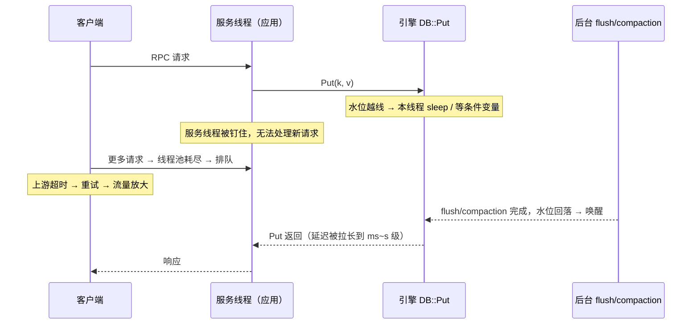

---
tags:
  - 高性能存储
status: 已完成
---

# Write Stall

> 前几篇已经把 LSM 的写入流水线铺完整了：前台线程写 WAL + active memtable（[[6.9 RocksDB 关键路径]]），写满冻结进 immutable 队列，后台 flush 刷成 L0 文件，compaction 逐层下沉（[[6.11 MemTable Immutable 与 SST 生命周期]]、[[6.7 Compaction 策略]]）。这是一条经典的**生产者-消费者流水线**：前台写是生产者，flush/compaction 是消费者，中间每个环节都是**有界缓冲**。于是一个多线程工程师秒懂的问题出现了——生产者持续快于消费者时怎么办？丢数据不行，无限堆积等于慢性自杀，剩下唯一的选择就是**背压（backpressure）：让生产者等**。Write stall 就是存储引擎的背压机制：当某个水位越线，引擎主动给前台写限速（slowdown）甚至叫停（stop）。它不是 bug，是安全阀；但它发作时，应用线程会被钉在 `Put()` 里不动——吞吐悬崖和 p99 尖刺的常见根因就是它。本篇讲清三件事：**什么条件触发、刹车怎么实现、卡住之后该修哪里**。

前置：[[6.7 Compaction 策略]]（消费端的工作原理）、[[6.11 MemTable Immutable 与 SST 生命周期]]（流水线上每个有界缓冲的由来）、[[6.6 LSM-tree 三种放大]]（水位背后的放大账）。

---

## 1. 为什么必须刹车：不刹的三种死法

先回答「凭什么让我的写请求等」。假设引擎不做任何限制，写入持续超过后台消化能力【事实】：

1. **读性能塌方**：flush 照常产出 L0 文件，但 compaction 消化不掉。L0 文件 key 范围互相重叠，**每个点查都要把所有 L0 文件探一遍**（[[6.9 RocksDB 关键路径]] §3）——L0 从 4 个涨到 400 个，读放大跟着涨两个量级，读延迟从百 μs 变成几十 ms；
2. **恢复时间失控**：memtable 堆着刷不出去，对应的 WAL 段就不能删（[[6.11 MemTable Immutable 与 SST 生命周期]] §4 的三合一条件）——WAL 越滚越长，下次崩溃恢复要重放的日志无限增长（[[6.17 Recovery 路径]]）；
3. **空间失控**：compaction 债越欠越多，该合并的重复数据、该清的墓碑都堆着，空间放大上涨（[[6.6 LSM-tree 三种放大]]），最终写满盘——那才是真正的全场死亡。

所以背压是三害相权的正解【事实】：**用「写变慢」这种可恢复的降级，换「读崩、恢复崩、盘满」三种不可恢复的事故**。这个结构网络工程师也熟：TCP 流控靠接收窗口让发送端等、线程池靠有界队列让提交者阻塞——同一个模式，这次发生在存储引擎里。

---

## 2. 三个水位：引擎盯着哪些数字踩刹车

RocksDB 持续监控三个「缓冲堆积深度」，任何一个越线就触发对应档位、回落即解除【实现】：

![[图片/SVG/8_6_14_1.svg|900]]

1. **immutable memtable 个数**：上限 `max_write_buffer_number`（默认 2，含 active）。队列满说明 **flush 跟不上**——新 memtable 没地方放，写必须停下等 flush 腾位置。这是最靠近前台、发作最快的一个水位；
2. **L0 文件数**：`level0_slowdown_writes_trigger`（默认 20）触发限速，`level0_stop_writes_trigger`（默认 36）触发停写。L0 堆积说明 **L0→L1 compaction 跟不上**——注意这个水位直接就是读放大（每个 L0 文件读都要探），所以它同时是「读性能保护线」；
3. **待 compaction 字节数**（pending compaction bytes，引擎估算的「欠下还没搬的数据量」）：`soft_pending_compaction_bytes_limit`（默认 64 GiB）限速、`hard_pending_compaction_bytes_limit`（默认 256 GiB）停写。这是**深层 compaction 债务**的总量指标，防止债务在看不见的深层无限积累。

三个水位分别看住流水线的三段：**flush 段、L0 入口段、深层消化段**——正好覆盖 6.11 那条单行道上所有可能堵车的位置【事实】。

---

## 3. 两档刹车：slowdown 与 stop 的实现

刹车分两档，都实现在**写路径内部**——`DB::Put`/`Write` 进入引擎后、真正写 WAL 之前的那段代码里【实现】：

- **slowdown（限速写）**：越过 slowdown 水位后，写请求不再全速放行，而是按 `delayed_write_rate`（默认 16 MiB/s，并随水位变化动态上下调）计算配额，**写线程主动 sleep 补足时间片**再继续。写还在进行，只是被匀速滴灌——目的是把生产速率压到消费速率之下，让水位缓慢回落；
- **stop（停写）**：越过 stop 水位后，写线程直接**阻塞在条件变量上**，直到后台任务把水位拉回线下才被唤醒。零流量放行，是最后一道保险。

从多线程视角看这两档就是熟悉的两种等待【事实】：slowdown 是「带配额的节流」（sleep），stop 是「条件变量等待」（`condition_variable::wait`）。两者都发生在**用户态的引擎代码里**——不涉及内核 IO 等待，盘甚至可能正忙着做 compaction，而前台线程在纯粹地等。

### 3.1 等待点的位置：背压如何传出存储层

这是本篇最值得画时序的地方——stall 的等待发生在哪一层，决定了它如何向上游放大【事实】：



链条要念完整【实践】：**引擎限写 → 应用线程阻塞在 `Put` → 服务线程池被占满 → 新请求排队 → 上游客户端超时 → 超时触发重试 → 重试流量让写入更猛**——存储层的一次背压，经过应用层和网络层的放大，可以演变成整条链路的雪崩。所以工程上要么在应用入口就做限流削峰（把等待挪到系统边缘），要么至少让超时与重试策略「认识」stall（重试要带退避，别火上浇油）。

---

## 4. 排障：先认指纹，再找根因

**Stall 是症状，不是病**。病永远在消费端：flush/compaction 的消化速率 < 前台写入速率。排障顺序是先确认「确实在 stall」，再回答「消费端为什么慢」【实践】。

### 4.1 确认 stall

```bash
# 引擎自己的账（应用内读取）：
#   db->GetProperty("rocksdb.stats", &out);
#     → "Stalls(count)" 一节按原因分类计数：memtable_slowdown/stop、
#       level0_slowdown/stop、pending_compaction_bytes_slowdown/stop
#   db->GetProperty("rocksdb.is-write-stopped", &v);          // 正在 stop？
#   db->GetProperty("rocksdb.actual-delayed-write-rate", &v); // 当前限速值，0 = 未限速
#   statistics: rocksdb.stall.micros —— 写线程被 stall 掉的总时长

# 系统侧指纹：写 p99 阶跃上涨的同一时刻——
iostat -x 5    # 盘并不空闲：大块顺序读写繁忙（compaction 在赶工），
               # 而前台小 IO 反而变少 —— 「应用卡了但盘很忙」是 stall 的典型形状
```

「原因分类计数」直接告诉你是哪个水位越线——三个水位对应三个不同的瓶颈段（§2），处置完全不同【实践】。

### 4.2 常见根因与处置

| 越线水位 | 说明 | 优先处置 |
| --- | --- | --- |
| immutable 满 | flush 太慢：WAL/SST 盘写带宽不足、flush 线程数不够 | 加 `max_background_jobs`、检查盘带宽被谁占了 |
| L0 超限 | L0→L1 compaction 跟不上：单线程瓶颈或盘被抢 | 提高 compaction 并行度；检查 [[6.16 Rate Limiter 与后台任务隔离]] 是否把后台限得太死（限速太低反而制造 stall——保护前台读延迟与喂饱 compaction 是一对矛盾） |
| pending bytes 超限 | 深层债务：写入模式与 compaction 策略不匹配 | 结构性调整：leveled/tiered 流派与参数（[[6.7 Compaction 策略]] §5 的排障清单） |

一组对照实验把因果关系钉死【实践】：`db_bench fillrandom` 持续压写，把 rate limiter 刻意压到很低（模拟消费端不足）——观察 L0 文件数爬向 20/36、`actual-delayed-write-rate` 出现并逐步下调、写 p99 阶跃；放开限速，水位回落、stall 计数停止增长。全程只动「消费端速率」一个变量，就能复现和消除完整的 stall 周期。

### 4.3 治理顺序

按性价比排序【实践】：

1. **扩消费端**：更多后台线程、更快的盘、合理的 rate limiter——直接治病；
2. **平滑生产端**：应用侧攒批（`WriteBatch`，[[6.2 Group Commit]] 同款思想）、入口限流削峰——把突发磨平，避免瞬时越线；
3. **结构性取舍**：写多读少可考虑 tiered compaction 减少搬运量（代价是读放大与空间放大，[[6.7 Compaction 策略]]）；
4. **最后才是调水位阈值**：调大 stop/slowdown 阈值**没有增加任何消化能力**，只是允许堆更多的债——L0 更厚（读更慢）、WAL 更长（恢复更慢）、悬崖推迟但更陡。它是买时间的手段，不是修复。

---

## 5. Modern C++：把两档刹车写成四十行

背压不是存储引擎的专利——下面用标准库把「有界缓冲 + slowdown + stop」的骨架写出来，形状与引擎内部一模一样【实现】：

```cpp
#include <chrono>
#include <condition_variable>
#include <deque>
#include <mutex>
#include <thread>

// 模拟 immutable 队列 / L0 层：一个带两档水位的有界缓冲
template <typename T>
class StalledQueue {
public:
    StalledQueue(std::size_t slowdown, std::size_t stop)
        : slowdown_(slowdown), stop_(stop) {}

    void push(T item) {                      // 前台写线程调用 —— 两档刹车都在这里
        std::unique_lock lk{mu_};
        not_full_.wait(lk, [this] { return q_.size() < stop_; });   // ② stop：
        if (q_.size() >= slowdown_) {        //    条件变量等待，零流量放行
            lk.unlock();                     // ① slowdown：主动 sleep 降速，
            std::this_thread::sleep_for(     //    锁外睡，别把消费者也挡住
                std::chrono::milliseconds(1 + q_size_over_slowdown()));
            lk.lock();
            not_full_.wait(lk, [this] { return q_.size() < stop_; });
        }
        q_.push_back(std::move(item));
    }

    T pop() {                                // 后台 flush/compaction 线程调用
        std::unique_lock lk{mu_};
        not_empty_.wait(lk, [this] { return !q_.empty(); });
        T item = std::move(q_.front());
        q_.pop_front();
        not_full_.notify_all();              // 水位回落：唤醒被 stop 的生产者
        return item;
    }

private:
    long q_size_over_slowdown() const {      // 越线越深，睡得越久 —— 动态限速
        return static_cast<long>(q_.size() - slowdown_);
    }

    std::size_t slowdown_, stop_;
    mutable std::mutex mu_;
    std::deque<T> q_;
    std::condition_variable not_full_, not_empty_;
};
```

**关键点**：

- `push` 里的两段等待就是两档刹车：sleep 是 slowdown（越线越深睡得越久——对应引擎按水位动态下调 `delayed_write_rate`），`condition_variable::wait` 是 stop；
- 解除 stall 的唯一出口在 `pop` 的 `notify_all`——**只有消费者干活才能放行生产者**，§4.3「治理先扩消费端」在代码结构里就能看出来；
- 把 `stop_` 调大而不加消费者，`push` 的等待没有消失，只是推迟——§4.3 第 4 条的代码版证明。

---

## 6. 陷阱与误区

> [!warning] 常见错误
> 1. **一见 stall 就调大阈值**：消化能力没变，债更深、恢复更久、读更慢，悬崖更陡（§4.3）——先看 stall 原因分类计数，治对应的消费端。
> 2. **把 `delayed_write_rate` 调大当解药**：限速值是「刹车踩多深」，不是「路有多宽」——放松刹车只会让水位更快顶到 stop 线，从「慢」直接变「停」。
> 3. **rate limiter 设得太保守**（[[6.16 Rate Limiter 与后台任务隔离]]）：为保读延迟把后台 IO 掐得太死，compaction 饿死 → 水位上涨 → stall——为了 p99 杀了吞吐，还是没保住 p99。
> 4. **把 stall 误诊为盘故障**：指纹恰好相反——盘正忙着 compaction 大块读写，前台却卡着（§4.1）；先看引擎的 stall 计数和 L0 水位，再怀疑硬件。
> 5. **应用层不认识背压**：超时 + 无退避重试，把 stall 放大成雪崩（§3.1）；写入口没有限流，突发全靠引擎硬扛——等待一定会发生，区别只是发生在系统边缘还是发生在最深处。
> 6. **测试只压稳态吞吐**：stall 是**时间维度**的现象（水位爬升需要时间），短压测测不出来；容量评估要压到「水位稳定不涨」才算数，并盯 `stall.micros` 增量而非只看 QPS 均值。

---

## 7. 关键结论

| 结论 | 性质 |
| --- | --- |
| LSM 写入是生产者-消费者流水线，每个环节都是有界缓冲；生产持续快于消费时，背压是丢数据/无限堆积之外的唯一正解 | 事实 |
| stall 用「写变慢」换「读塌方、恢复失控、盘写满」三种不可恢复事故——是安全阀，不是 bug | 事实 |
| 三个水位看住三段流水线：immutable 数（flush 段）、L0 文件数（入口段，同时就是读放大）、pending bytes（深层债务） | 实现 |
| 两档刹车都在用户态写路径里：slowdown = 按配额 sleep，stop = 条件变量等待；盘可能正忙，前台在纯等 | 事实/实现 |
| 背压会穿透存储层：Put 阻塞 → 线程池耗尽 → 上游超时重试 → 雪崩；限流削峰应做在系统边缘 | 实践结论 |
| stall 是症状不是病：原因分类计数指向具体水位，根治永远是扩消费端；调阈值只是买时间且加重债务 | 实践结论 |
| 系统侧指纹：「应用写卡住 + 盘忙于大块顺序 IO」同时出现——与盘故障的指纹相反 | 实践结论 |
| 容量评估必须压到水位稳态：短压测看不见水位爬升，QPS 均值掩盖 stall | 实践结论 |

---

## 关联知识

- [[6.7 Compaction 策略]] - 消费端的工作原理与结构性调参空间
- [[6.11 MemTable Immutable 与 SST 生命周期]] - 各个有界缓冲的由来；immutable 队列上限即第一个水位
- [[6.6 LSM-tree 三种放大]] - L0 水位为什么直接等于读放大
- [[6.9 RocksDB 关键路径]] - 刹车代码所在的写路径位置
- [[6.13 Bloom Filter 与 Block Cache]] - 对偶主题：读路径的治理
- [[6.16 Rate Limiter 与后台任务隔离]] - 「保前台延迟」与「喂饱 compaction」这对矛盾的调解者
- [[6.2 Group Commit]] - 应用侧攒批平滑生产端的同款思想
- [[6.17 Recovery 路径]] - WAL 堆积如何转化为恢复时间
- [[9.5 p99 毛刺定位]] - stall 指纹在系统级排障中的位置

---

## 参考

- RocksDB Wiki - Write Stalls、Rate Limiter
- 《Linux多线程服务端编程》- 有界队列与背压的工程实践（生产者-消费者一章）
