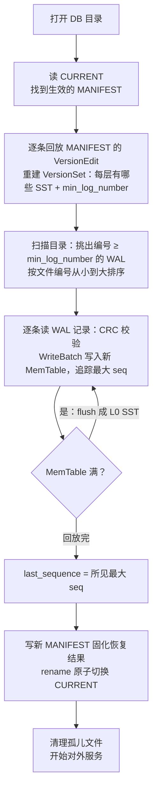

---
tags:
  - 高性能存储
status: 已完成
---

# Recovery 路径

> 进程崩了、机器掉电了，内存里的 MemTable 灰飞烟灭——重启后引擎凭什么敢说"数据都在"？靠磁盘上三类文件的接力：CURRENT/MANIFEST 记录"世界由哪些 SST 组成"，WAL 记录"最近还发生过哪些写"。恢复就是确定性地回放这两份日志，把内存状态重建到崩溃前最后一次持久化的样子。本篇从每个文件是什么讲起，走完恢复流水线，再讲损坏怎么检测、四种恢复模式怎么选、恢复时间由什么决定——启动慢也是一种延迟。

前置：[[6.1 WAL 与 Crash Consistency]]（WAL 为什么能保数据）、[[6.12 Manifest 与 Version Set]]（版本元数据是什么）。

---

## 1. 背景：崩溃后磁盘上剩下什么

崩溃的定义先说清：进程异常退出（crash）或整机掉电（power loss）。两者丢的东西不同——crash 只丢用户态内存，内核页缓存还活着；掉电连页缓存、盘上易失缓存一起丢，**只有 fsync 走完全程的数据才算数**（这条边界在 [[6.1 WAL 与 Crash Consistency]] 与 [[6.3 fsyncgate 与 EIO 处理]]）。

重启后引擎面对一个目录，里面是这些文件：

| 文件 | 是什么 | 恢复时的角色 |
| --- | --- | --- |
| `CURRENT` | 一行文本，写着当前生效的 MANIFEST 文件名 | 恢复的入口指针 |
| `MANIFEST-xxxxxx` | 追加式日志，每条记录是一个 VersionEdit（本次增/删了哪些 SST、日志水位推进到哪） | 重放它 = 重建"每层有哪些文件" |
| `*.log`（WAL） | 追加式日志，每条记录是一个完整的 WriteBatch | 重放最近的、还没变成 SST 的写 |
| `*.sst` | 不可变数据文件 | 数据本体，恢复时不动它 |
| `OPTIONS` / `IDENTITY` | 配置快照 / 实例 ID | 兼容性校验 |

内存里丢掉的、需要重建的东西正好三样：**MemTable 里的最近写入**（从 WAL 回放）、**"当前版本"指针即 VersionSet**（从 MANIFEST 回放）、**last_sequence 水位**（从两者取最大，多版本语义才能延续，见 [[6.15 Snapshot 与 Sequence Number]]）。Block cache 也丢了，但那是冷启动性能问题，不是正确性问题。

**【前提】** 恢复只能恢复"已经持久化"的内容。`WriteOptions.sync=false` 时 WAL 写只到页缓存——进程 crash 不丢（内核还在），掉电会丢最近若干条写。这不是恢复路径的 bug，是写入时用持久性换吞吐的既定取舍。

---

## 2. 恢复流水线



逐段拆开讲。

### 2.1 CURRENT → MANIFEST：一层间接换来原子切换

MANIFEST 自己也会长大、也要定期换新文件，而"从旧 MANIFEST 切到新 MANIFEST"必须原子——否则崩在半路，恢复入口就是个残缺文件。做法【实现】：写好新 MANIFEST 并 fsync → 写 `CURRENT.tmp` → `rename` 覆盖 `CURRENT` → fsync 父目录。POSIX 保证 `rename` 原子【事实】：崩溃后 CURRENT 要么指旧、要么指新，不存在中间态。

C++ 工程师看这个模式会觉得眼熟：**构造完整的不可变对象，最后一步原子交换指针发布**。`rename` 就是文件系统里的 `ptr.store(new_obj, release)`；"fsync 数据文件先于 fsync 目录项"对应"先写字段、后发布指针"。同一个发布纪律，跨了两个抽象层。细节展开在 [[6.12 Manifest 与 Version Set]] 与 [[6.1 WAL 与 Crash Consistency]]。

### 2.2 回放 MANIFEST：重建"世界的目录"

VersionEdit 逐条 apply：加这几个 SST、删那几个、日志水位推进到 N。全部放完得到 VersionSet——每层有哪些文件、键范围是什么——以及关键的 **min_log_number**：编号小于它的 WAL，内容已经全部固化进 SST，**不需要回放**。这个水位是 flush 完成时写进 MANIFEST 的（[[6.11 MemTable Immutable 与 SST 生命周期]]）；它是恢复时间的第一决定因素（第 4 节）。

### 2.3 回放 WAL：顺序即正确性

需要回放的 WAL 按**文件编号从小到大**、文件内按**记录先后**回放。顺序不能乱的原因很朴素：同一个 key 可能被写了多次，后写覆盖先写，乱序回放会让旧值复活。seq 也要求单调——每个 WriteBatch 头部带着它当年分配到的起始 seq，回放按原值恢复，快照与多版本语义（[[6.15 Snapshot 与 Sequence Number]]）才能无缝衔接。

WAL 的物理格式【实现】：文件切成 32KB 的 block，记录带 CRC32C 校验和，大记录用 FULL/FIRST/MIDDLE/LAST 四种分片类型跨 block。每读一条：校验 CRC → 通过则把 WriteBatch 插进新 MemTable。回放中 MemTable 满了就地 flush 成 L0 文件，继续放。

同一份 WAL 允许被回放多次吗（上次恢复到一半又崩了）？允许——回放是幂等的，机制在 [[6.18 WAL 回放幂等性]]。

### 2.4 收尾：孤儿文件与免费的崩溃原子性

回放完毕，写一个新 MANIFEST 固化恢复结果、切 CURRENT，然后删掉两类"孤儿"：已经回放完的旧 WAL，以及**不被任何 Version 引用的 SST**。

孤儿 SST 从哪来？崩溃时 compaction 正写到一半的输出文件。注意这里的精妙之处【事实】：这个半成品**从未进入 MANIFEST**——compaction 的协议是"先把输出文件完整写好并 fsync，最后才向 MANIFEST 提交 VersionEdit"。所以崩溃后它就是一坨无主数据，直接删除，无需任何修复逻辑。**"先写数据、后提交元数据"让崩溃原子性从难题变成免费品**——和 2.1 的 rename 是同一个思想在不同粒度的重复。

---

## 3. 尾部损坏与四种恢复模式

崩溃瞬间正在追加的那条 WAL 记录很可能只写了一半（torn write，检测机制见 [[6.4 Torn Write 与 Checksum]]）——CRC 校验必然失败。问题是：**遇到坏记录，回放该停还是该跳？**这是语义决策，不是技术细节，RocksDB 把选择权交给用户【实现】【取舍】：

| WALRecoveryMode | 遇到损坏的行为 | 语义承诺 | 适用 |
| --- | --- | --- | --- |
| `kAbsoluteConsistency` | 任何损坏都拒绝打开 | 一条都不许少，宁可不服务 | 丢一条都不能忍、宁愿人工介入的场景 |
| `kPointInTimeRecovery`（默认） | 回放到第一处损坏为止，之后全部放弃 | **前缀一致**：恢复到某个真实存在过的时刻 | 单机默认，绝大多数场景 |
| `kTolerateCorruptedTailRecords` | 只容忍最后的尾部撕裂 | 近似前缀一致 | 老版本默认 |
| `kSkipAnyCorruptedRecords` | 跳过坏记录继续回放后面的 | **无承诺**：可能造出从未存在过的状态 | 只配救灾：尽量捞数据，捞完必须全量校验 |

为什么前缀一致是对的默认【事实】：WAL 是全库唯一的写入顺序真相。回放到第一处损坏就停，得到的是"崩溃前某一刻"的完整快照；跳过中间坏记录继续放，会得到"删除丢了但后续覆盖还在"这类**历史上从未存在过的状态**——比丢数据更危险，因为它悄无声息。

**【前提】** 以上是单机语义。有副本的系统里 point-in-time 回退会让本副本落后于集群共识，追齐还是重建由复制协议决定——那是第 7 章分布式的话题，单机引擎只负责"诚实地恢复到一个真实时刻"。

---

## 4. 恢复也是延迟：单线程的世界重建

把恢复放回本章的主线——并发与延迟——看两个特点：

**（1）恢复期间没有并发问题，因为根本没有并发。** 回放由打开 DB 的线程单线程执行：不需要锁、不需要发布水位，随便写。直到恢复完成、`DB::Open` 返回，句柄才交给业务线程——这又是一次 release 发布：**对象构造完成之前不暴露给任何读者**。C++ 里"构造函数不发布 `this`、不在半初始化状态注册回调"讲的是同一条纪律。代价是恢复期整个 DB 不可用——**恢复时长直接就是服务的启动延迟、也是故障后的不可用窗口（MTTR 的大头）**。

**（2）恢复时长 ≈ 待回放 WAL 总量 ÷ 单线程回放速度。** 回放速度受限于顺序读带宽和单线程 CPU（CRC 校验 + MemTable 插入），实际常是 CPU 先到瓶颈；WAL 总量则由 min_log_number 推进速度决定【量级】——WAL 攒到 GB 级时，恢复轻松进入分钟级。

于是控制恢复时间 = 控制 WAL 总量【实现】：`max_total_wal_size` 超限时强制 flush 最老的数据把水位推上去。这里埋着一个经典的多 Column Family（列族，可理解为同一 DB 里的多个命名空间）陷阱：**所有 CF 共享同一份 WAL**，一份 WAL 能删除的前提是"里面每个 CF 的数据都已 flush"。一个低流量的冷 CF 长期不 flush，就把所有 WAL 都钉在磁盘上——见第 6 节的故障案例。

---

## 5. Modern C++：迷你 WAL 回放器

把第 2、3 节的核心——"逐条校验、前缀一致、重建状态"——写成能跑的代码。格式简化为：`| len(4B) | crc(4B) | payload |`，payload 内是 `seq + op + key + value`：

```cpp
#include <cstdint>
#include <cstring>
#include <fstream>
#include <map>
#include <print>
#include <string>
#include <vector>

// 教学用校验和（真实引擎用硬件加速的 CRC32C，见 6.4）
uint32_t checksum(const std::vector<char>& buf) {
    uint32_t h = 2166136261u;
    for (char c : buf) { h ^= static_cast<unsigned char>(c); h *= 16777619u; }
    return h;
}

struct RecoveredState {
    std::map<std::string, std::string> table;  // 重建出的 MemTable
    uint64_t last_seq = 0;                     // 重建出的水位
    size_t replayed = 0;
    bool clean_tail = true;                    // 是否回放到文件真正的末尾
};

// kPointInTimeRecovery 语义：回放到第一处损坏为止，绝不跳过
RecoveredState replay_wal(const std::string& path) {
    RecoveredState st;
    std::ifstream wal{path, std::ios::binary};  // RAII：离开作用域自动关闭

    while (wal) {
        uint32_t len = 0, crc = 0;
        if (!wal.read(reinterpret_cast<char*>(&len), 4)) break;   // 正常 EOF
        if (!wal.read(reinterpret_cast<char*>(&crc), 4)) {        // 头写了一半：尾部撕裂
            st.clean_tail = false;
            break;
        }
        std::vector<char> payload(len);
        if (!wal.read(payload.data(), len) || checksum(payload) != crc) {
            st.clean_tail = false;             // 撕裂或损坏：停在这一刻，前缀一致
            break;
        }
        // 解析 payload：| seq(8B) | op(1B) | klen(2B) | key | value |
        uint64_t seq = 0;
        std::memcpy(&seq, payload.data(), 8);
        const char op = payload[8];
        uint16_t klen = 0;
        std::memcpy(&klen, payload.data() + 9, 2);
        std::string key{payload.data() + 11, klen};
        if (op == 'P') {
            st.table[key] = std::string{payload.data() + 11 + klen,
                                        payload.size() - 11 - klen};
        } else {                               // 'D'：删除。回放天然幂等（见 6.18）
            st.table.erase(key);
        }
        st.last_seq = seq;                     // 顺序回放 → 单调递增
        ++st.replayed;
    }
    return st;
}

int main(int argc, char** argv) {
    const auto st = replay_wal(argc > 1 ? argv[1] : "test.wal");
    std::println("回放 {} 条，last_seq={}，尾部{}",
                 st.replayed, st.last_seq, st.clean_tail ? "完整" : "撕裂（已截断）");
    for (const auto& [k, v] : st.table) std::println("  {} = {}", k, v);
    return 0;
}
```

```bash
g++ -std=c++23 -Wall -Wextra -o wal_replay wal_replay.cpp && ./wal_replay test.wal
```

值得注意的三处对应：尾部撕裂（`clean_tail = false`）不是错误而是**预期路径**——追加中的文件被崩溃截断天经地义，宁静地停下就是 point-in-time 语义；坏记录后直接 `break` 而不是 `continue`，`continue` 就把自己降级成了 `kSkipAnyCorruptedRecords`；重放同一文件两遍结果相同——幂等性的直观验证（[[6.18 WAL 回放幂等性]]）。

---

## 6. 实验与故障案例

**实验 A：崩溃注入。** 循环写入的进程用 `kill -9` 随机杀掉，重启后校验"已确认的写一条不少"。注意 `kill -9` 只测 crash 语义；掉电语义要靠 dm-flakey 或虚拟机硬断电模拟——两者覆盖的故障面不同（第 1 节）。系统化的做法见 [[6.10 崩溃注入测试]]。

**实验 B：sync 的代价与收益。** 对照 `sync=true` / `sync=false` 两组，各写 10 万条后硬断电：前者零丢失、吞吐低一个量级以上；后者丢最近若干条、吞吐高。把"持久性 vs 吞吐"的取舍从条文变成实测数字。

**故障案例（多 CF 钉死 WAL）**：某服务重启一次要 20 分钟，运维一度当成"盘慢"。真因：DB 里有一个记录配置变更的冷 CF，几个月没攒满过一个 MemTable、从未 flush——所有 WAL 因为它删不掉，堆到几十 GB，每次重启全量回放。处理：设置 `max_total_wal_size` 强制推进水位，并对冷 CF 定期主动 `Flush()`。教训：**恢复时间是要预算和演练的 SLO，不是崩了才发现的惊喜**（[[9.7 SLO 与性能回归]]）。

---

## 7. 陷阱与误区

> [!warning] 常见错误
> 1. **以为数据都在 SST 里**：最近的写只存在于 WAL。手动清理"日志文件"腾空间 = 删数据。
> 2. **把进程 crash 和掉电当一回事**：crash 后页缓存还在，没 fsync 的 WAL 也能活下来；掉电只认 fsync 走完全程的数据。测试只做 kill -9 会高估自己的持久性。
> 3. **手动删除"看起来没用"的文件**：CURRENT、MANIFEST、WAL 都不是垃圾；孤儿清理是引擎开门时自己做的事，人不要代劳。
> 4. **生产环境用 `kSkipAnyCorruptedRecords`**：中间丢写会造出从未存在过的状态，只配救灾，救完必须全量校验。
> 5. **备份 = 拷贝目录**：运行中直接 `cp` 会拷到互相撕裂的 WAL/MANIFEST/SST。一致备份用 Checkpoint（硬链接 + 落盘点）或备份引擎。
> 6. **恢复时间不设预算**：WAL 无上限 → 崩一次恢复半小时 → 可用性事故。`max_total_wal_size` + 冷 CF 定期 flush + 定期演练恢复。

---

## 8. 关键结论

| 结论 | 性质 |
| --- | --- |
| 恢复 = MANIFEST 回放重建 VersionSet + WAL 回放重建 MemTable + 恢复 last_sequence | 事实 |
| CURRENT 经 rename 原子切换；"先写数据文件、后提交元数据"使孤儿文件可直接删除——崩溃原子性免费 | 事实 / 实现 |
| rename 切换 ≙ C++ 的"构造完不可变对象后原子交换指针"；DB::Open 返回前不暴露句柄 ≙ 构造中不发布 this | 类比 |
| WAL 按编号与记录序严格顺序回放，seq 按原值恢复，多版本语义跨重启延续 | 事实 |
| 尾部撕裂是预期路径；默认 kPointInTimeRecovery 给前缀一致——恢复到一个真实存在过的时刻 | 事实 / 取舍 |
| kSkipAnyCorruptedRecords 可能造出从未存在过的状态，仅救灾可用 | 取舍 |
| 恢复只能恢复已持久化的内容：sync=false 掉电丢尾部写，是写入侧的既定取舍 | 前提 |
| 恢复时长 ≈ WAL 总量 ÷ 单线程回放速度，就是启动延迟与 MTTR；冷 CF 会钉死共享 WAL | 量级 / 实现 |

---

## 关联知识

- [[6.1 WAL 与 Crash Consistency]] - 恢复能力的来源：写前日志与 fsync 边界
- [[6.12 Manifest 与 Version Set]] - 恢复的元数据入口与版本模型
- [[6.18 WAL 回放幂等性]] - 恢复中断重来为什么不会写坏数据
- [[6.10 崩溃注入测试]] - 恢复正确性的系统化验证方法
- [[6.4 Torn Write 与 Checksum]] - 尾部撕裂检测的机制基础
- [[6.15 Snapshot 与 Sequence Number]] - last_sequence 恢复后多版本语义如何延续
- [[6.3 fsyncgate 与 EIO 处理]] - 恢复路径信任 fsync 的前提与例外
- [[6.11 MemTable Immutable 与 SST 生命周期]] - min_log_number 水位由 flush 推进

## 参考

- RocksDB Wiki: WAL Recovery Modes、Write Ahead Log File Format、MANIFEST
- LevelDB 文档 `doc/log_format.md`、源码 `db/version_set.cc`（`VersionSet::Recover`）
- 《Modern Operating Systems》崩溃一致性与日志式文件系统章节（同一思想在文件系统层）
