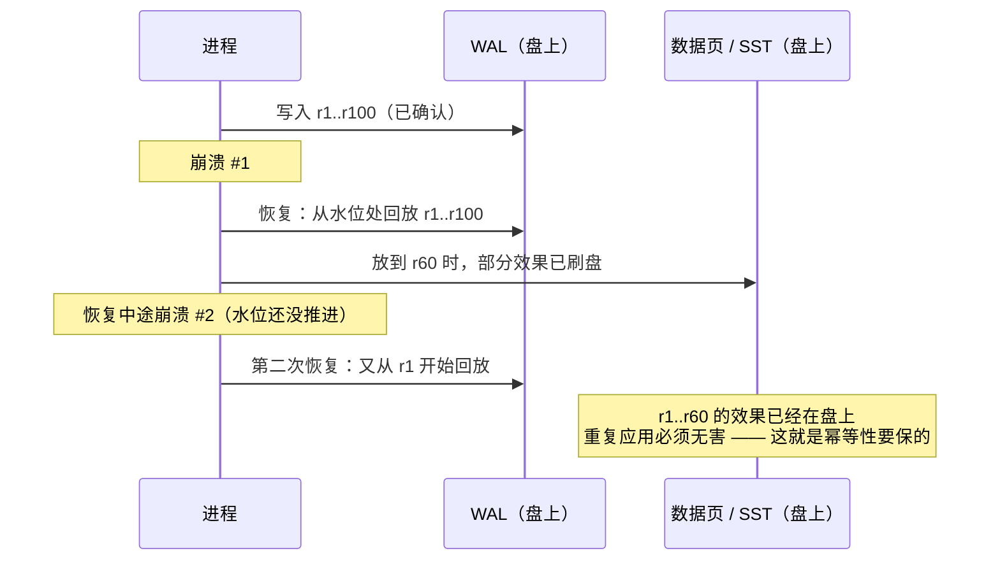

---
tags:
  - 高性能存储/存储引擎
status: 已完成
---

# WAL 回放的幂等性

> [[6.17 Recovery 路径]] 说恢复就是"确定性地回放日志"，但留了一个尾巴：恢复到一半又崩了怎么办？答案是重启后再放一遍。于是问题变成：**同一段日志被应用两遍、三遍，最终状态凭什么还正确？**这就是回放幂等性。本篇先讲清"为什么重复回放不可避免"，再给出三种让重复无害的机制——重建式回放、物理日志、LSN 护栏——并用一个 30 行的 C++ 例子演示缺护栏的回放怎么把计数器翻倍，最后给出实验设计与故障定位路径。

前置：[[6.4 Torn Write 与 Checksum]]（坏记录怎么检测出来）、[[6.17 Recovery 路径]]（回放发生在恢复流水线的哪一步）。

---

## 1. 名词与背景：什么叫幂等

**幂等（idempotent）**：一个操作执行一次和执行多次，效果相同。写成函数：

$$
f(f(x)) = f(x)
$$

日常例子：把开关拨到"开"是幂等的——拨十次还是开；"按一下加一"不是幂等的——按十次就加了十。对应到存储操作：`put(k, v)`（把 k 直接设成 v）天然幂等，`incr(k)`（把 k 加一）天然不幂等。

WAL 回放语境下，我们要的幂等更精确一点：**把同一段日志前缀、按同一顺序应用到起点状态上，应用一遍和应用多遍（哪怕中间断掉从头再来），得到的最终状态相同**。

两个边界要先划清【前提】：

- 幂等管的是"**同一段日志、同一个顺序**的重复应用"。它不承诺乱序应用也正确——回放顺序必须保持，原因在 [[6.17 Recovery 路径]] 第 2.3 节（后写覆盖先写，乱序会让旧值复活）。
- 如果日志里本来就有两条相同意图的记录（客户端超时重试，同一笔 insert 被记了两次），WAL 层管不了——那是请求级去重的事，见 [[7.13 幂等 重试 与请求去重]]。一句话区分：**回放幂等解决"一条记录被应用多次"，请求幂等解决"一个意图被记录多条"**，层次不同，机制也不同。

---

## 2. 重复回放从哪来

这不是假想敌，至少有三个真实来源：

1. **恢复中途再崩**。回放是个可能持续几分钟的过程（WAL 攒到 GB 级时，见 [[6.17 Recovery 路径]] 第 4 节），期间机器完全可能再次掉电。重启后从水位处重新回放——前一次已经产生的部分持久化效果（比如回放中途 flush 出去的 SST、就地更新引擎已写回的数据页）还留在盘上。
2. **水位滞后**。"从哪开始回放"由一个持久化的水位决定（LSM 里是 MANIFEST 中的 min_log_number，见 [[6.12 Manifest 与 Version Set]]）。安全纪律只有一条【事实】：**先把回放/flush 的效果持久化，再推进水位**。反过来（先推水位、后落盘）一旦崩溃就永久丢数据。这条纪律的必然代价是：效果已落盘、水位还没推进的窗口里崩溃，重启后这段日志会被再放一遍。
3. **日志复制与增量备份**。把 WAL 运到副本或备份机上 apply 时，网络重传、断点续传都会造成同一段日志被重复投喂。



所以重复回放不是设计失误，而是把纪律定成"**宁可重复、绝不遗漏**"之后的必然结果。幂等性就是为这个纪律兜底的机制。

---

## 3. 三种让重复无害的机制

### 3.1 重建式回放：从空状态重来，只需要确定性

LSM 引擎（LevelDB/RocksDB）走这条路：回放不是把日志打到"上次剩下的半截状态"上，而是**新建一个空 MemTable 从头放**。同一段前缀 + 确定性的应用逻辑 → 同一个结果。严格说这靠的是确定性而不是记录级幂等，但效果等价：重放多少遍都一样。

那前一次恢复中途已经 flush 成 SST 的部分怎么办？靠**原子水位提交**收尾【实现】：flush 出的 SST 只有在 MANIFEST 追加了对应 VersionEdit（同时推进 min_log_number）之后才"算数"，而这个追加是原子的。于是世界只有两种可能：

- 水位没推进 → 那个 SST 是无主孤儿，恢复开始时直接删掉，WAL 全量重放；
- 水位推进了 → 对应的 WAL 整文件跳过，不会再碰。

**永远不存在"SST 算数、对应 WAL 又被重放一遍"的中间态**。这正是 [[6.17 Recovery 路径]] 里"先写数据、后提交元数据"协议在幂等性上的分红——粒度是文件级的，粗但够用。

### 3.2 物理日志：整块覆盖，赋值天然幂等

日志记录里存的不是"做什么操作"，而是**改完之后的完整物理内容**（整个 block 或 page 的字节镜像）。回放就是"把这些字节写到这个位置"——赋值写一遍和写十遍结果相同，不需要任何护栏。

- ext4 的 jbd2 日志记录的就是整块（physical journaling）【事实】；
- PostgreSQL 的 `full_page_writes`：每个 checkpoint 之后第一次修改某页时，把**整页镜像**写进 WAL【事实】。这一招同时解决了 torn page（页写了一半掉电）：回放时用完整镜像直接覆盖，根本不要求盘上那个页处于任何"可理解"的状态。

代价【取舍】：日志体积大——8KB 的页改 8 个字节也要记整页。所以 PostgreSQL 只在 checkpoint 后第一次改页时记全页，后续修改记增量；这是"用 checkpoint 频率换 WAL 体积"的旋钮。

### 3.3 逻辑日志 + LSN 护栏：ARIES 的做法

就地更新（in-place update）的引擎——InnoDB 的 B+ 树、经典关系数据库——日志记的是逻辑或"生理"（physiological）操作："在页 P 里插入键 k"、"计数器加 5"。这类操作不幂等，重放两遍状态就错。ARIES 的护栏机制【事实】：

- 每条日志记录有单调递增的 **LSN**（Log Sequence Number，日志序列号——本质就是这条记录在日志文件里的字节偏移，天然单调）；
- 每个数据页的页头存一个 **page LSN**：这个页最后一次被哪条日志记录修改过；
- 回放规则只有一条：`record.lsn <= page.lsn` → 这条记录的效果已经在页上了，**跳过**；否则应用并把 page LSN 推到 record.lsn。

设计的精髓在于：**页数据和它的"应用进度指针"存在同一个页里，一次页写原子地同时落盘**。进度和数据永远不会脱节。前提是页写本身不撕裂——这由扇区原子性假设或 double write buffer / full_page_writes 兜底（[[6.4 Torn Write 与 Checksum]]）。

### 3.4 三种机制对照

| 机制 | 日志记什么 | 幂等从哪来 | 代价 | 代表 |
| --- | --- | --- | --- | --- |
| 重建式回放 | 逻辑操作（WriteBatch） | 从空状态确定性重建 + 文件级原子水位 | 恢复要全量重放、重建内存态 | LevelDB / RocksDB |
| 物理日志 | 改后的字节镜像 | 赋值天然幂等 | 日志体积大 | jbd2、PG full_page_writes |
| 逻辑日志 + LSN 护栏 | 页内操作 | 比较 record.lsn 与 page LSN | 页头带 LSN；页写需防撕裂 | ARIES / InnoDB |

一个快速判断法：**你的回放是打在"空状态"上还是"可能已含部分效果的状态"上？**前者只需确定性，后者必须有真护栏。

---

## 4. 与 checksum 的配合：先物理完整，再语义幂等

分层看，两者回答的问题不同：checksum 判"这条记录是不是被完整写下来的"（物理层），幂等判"这条记录能不能再应用一遍"（语义层）。顺序固定：CRC 校验通过，才谈应用。两个交叉点值得注意：

- **前缀一致 × 确定性**：默认的 point-in-time 恢复模式在第一处损坏就停（[[6.17 Recovery 路径]] 第 3 节），于是每次重放的都是**同一个前缀**，重建式回放的结果才稳定。如果用 `kSkipAnyCorruptedRecords` 跳坏继续放，两次重放跳过的记录集合可能不同——连确定性都没了，幂等无从谈起。
- **WAL 复用的陷阱**【实现】：RocksDB 可以复用旧 WAL 文件（`recycle_log_file_num`，省掉文件增长时的元数据开销）。复用文件的尾部残留着**上一世代的旧记录，它们的 CRC 是合法的**。防线是记录头里带上 log number（世代号），回放时核对"这条记录属于当前文件世代吗"。记住分工：**checksum 管"坏"，世代号管"旧而合法"，幂等管"重复应用"**——三层缺一不可。

---

## 5. Modern C++：一个会翻倍的计数器

把 3.3 节的 LSN 护栏写成能跑的最小例子。场景：就地更新的"数据页"存计数器，日志是逻辑记录"加 delta"——天然不幂等，看护栏怎么救：

```cpp
#include <cstdint>
#include <map>
#include <print>
#include <string>
#include <vector>

struct Record { uint64_t lsn; std::string key; int64_t delta; };  // 逻辑记录：计数器 +delta

struct Page {                        // 就地更新的"数据页"
    int64_t value = 0;
    uint64_t page_lsn = 0;           // 本页最后应用到的日志位置（与数据同页存放）
};

// 错误版本：不看 LSN，重复回放就重复加
void replay_naive(std::map<std::string, Page>& pages, const std::vector<Record>& log) {
    for (const auto& r : log) pages[r.key].value += r.delta;
}

// 正确版本：ARIES 式护栏——只应用比页更新的记录
void replay_guarded(std::map<std::string, Page>& pages, const std::vector<Record>& log) {
    for (const auto& r : log) {
        auto& p = pages[r.key];
        if (r.lsn <= p.page_lsn) continue;   // 效果已在页上：跳过，这一行就是幂等
        p.value += r.delta;
        p.page_lsn = r.lsn;                  // 数据与进度一起更新
    }
}

int main() {
    const std::vector<Record> log{{1, "hits", 10}, {2, "hits", 5}, {3, "errs", 1}};
    std::map<std::string, Page> a, b;

    replay_naive(a, log);   replay_naive(a, log);    // 模拟：恢复到一半崩了，从头再放一遍
    replay_guarded(b, log); replay_guarded(b, log);

    std::println("naive   hits={} errs={}   (期望 15/1，重复应用被放大成 2 倍)",
                 a["hits"].value, a["errs"].value);
    std::println("guarded hits={} errs={}   (放两遍与放一遍结果相同)",
                 b["hits"].value, b["errs"].value);
}
```

```bash
g++ -std=c++23 -Wall -Wextra -o wal_idem wal_idem.cpp && ./wal_idem
# naive   hits=30 errs=2   (期望 15/1，重复应用被放大成 2 倍)
# guarded hits=15 errs=1   (放两遍与放一遍结果相同)
```

三处与真实引擎的对应：`continue` 那一行就是 ARIES 的 redo 判断；`value` 和 `page_lsn` 在同一个对象里一起改，对应真实引擎"页内容与 page LSN 在**同一次页写**中落盘"——若把两者拆开各自持久化，护栏本身就会撕裂；`put/delete` 型操作可以不要这个护栏（覆盖天然幂等），所以纯 KV 的 LSM 回放没有这段逻辑，而带 `Merge` 算子的 RocksDB 之所以安全，靠的是 3.1 的重建式回放而不是记录级幂等。

---

## 6. 实验设计、指标与故障定位

**实验 A（确定性验证，单进程可跑）**：用 [[6.17 Recovery 路径]] 的迷你回放器或本篇 demo，同一份日志做三组：回放 1 遍、回放 2 遍、"放到第 k 条中断再从头放"。对最终状态求校验和比对。变量只有回放次数——校验和不同即幂等被破坏，这是最便宜的回归测试。

**实验 B（崩溃注入，覆盖"恢复中再崩"）**：关键是让 kill 落在**恢复窗口内**，而不只是运行期：

```bash
for i in $(seq 200); do
  ./kv_server --dir ./db & pid=$!
  sleep 0.$((RANDOM % 5))          # 短睡眠，大概率命中 Open()/回放阶段
  kill -9 $pid
done
./kv_verify --dir ./db --acked acked.list  # 已确认写一条不少、计数器等于期望值
```

工业化版本是 RocksDB 的 `db_stress`（内置随机 kill 点）；系统化方法与"已确认写清单"的构造见 [[6.10 崩溃注入测试]]。注意 `kill -9` 只覆盖进程 crash 语义，掉电语义要用 dm-flakey 或虚拟机硬断电（[[6.17 Recovery 路径]] 第 1 节讲过两者的差别）。

**指标含义与常见误读**：

| 观察项 | 含义 | 常见误读 |
| --- | --- | --- |
| 回放条数（replayed records） | 本次恢复应用了多少条 | 多次崩溃后**累计值**翻倍属正常（重复回放），不代表数据翻倍 |
| 跳过条数（LSN 护栏 skipped） | 效果已在页上的记录数 | 恢复后 skipped=0 不代表有问题——取决于崩溃点在哪 |
| DB 成功打开 | 只说明物理格式过关 | ≠ 语义正确；必须外部校验不变量（计数器、主表与索引一致性） |
| 恢复耗时 | 待回放量 ÷ 回放速度 | "恢复慢 = 盘慢"——实际常是单线程 CPU 瓶颈（CRC + 插入） |

**故障定位路径（现象 → 疑点，按概率排序）**：

- 每次崩溃恢复后计数器/统计值**变大**：就地更新缺 LSN 护栏；或护栏比较把 `<=` 写成 `<` 之类的 off-by-one。
- 主表与二级索引不一致：两者回放路径不同源（一个重建式、一个就地更新），崩溃点落在两者之间——统一回放机制或让索引可从主表重建。
- 偶发"读到上一世代的旧数据"：WAL 复用未校验世代号，或预分配区的残留字节被当成合法记录（第 4 节）。
- 丢数据而非重复：水位先于效果持久化被推进——第 2 节的纪律被破坏，**比重复危险得多**，优先排查。

---

## 7. 陷阱与误区

> [!warning] 常见错误
> 1. **把幂等当免费品**：纯 put/delete 的 LSM 世界里它近乎免费（重建式 + 覆盖语义），但只要引擎有 incr/Merge 类算子或就地更新，就必须显式护栏。
> 2. **幂等 ≠ 可乱序**：承诺只对"同一前缀、同一顺序"的重复成立；乱序回放照样出错。
> 3. **"CRC 过了就能放"**：复用的 WAL 文件里，上一世代的记录 CRC 完全合法——还要核对世代号。
> 4. **测试只崩一次**：单次崩溃测不出"恢复中再崩"的嵌套场景，而那正是幂等性存在的理由（实验 B）。
> 5. **把客户端重试当回放问题修**：日志里有两条相同意图的记录，WAL 层无解，要在请求层做去重（[[7.13 幂等 重试 与请求去重]]）。
> 6. **护栏进度与数据分开持久化**：page LSN 必须和页数据同一次写落盘，拆开存等于护栏自己会撕裂。

---

## 8. 关键结论

| 结论 | 性质 |
| --- | --- |
| 重复回放是"先持久化效果、后推进水位"纪律的必然结果——宁可重复、绝不遗漏 | 事实 |
| 水位推进与效果持久化的顺序不可反转，反了就是丢数据 | 事实 |
| 三种机制：重建式（确定性 + 原子水位）、物理日志（赋值天然幂等）、逻辑日志 + LSN 护栏 | 实现 |
| page LSN 与页数据同页共存、一次写同时落盘，护栏才不会自己撕裂 | 实现 |
| checksum 管"坏"、世代号管"旧而合法"、幂等管"重复应用"——三层各司其职 | 事实 |
| 判断法：回放打在空状态上只需确定性；打在可能含部分效果的状态上必须有护栏 | 事实 |
| 请求级重复（客户端重试）WAL 层救不了，需请求 ID 去重 | 前提 |
| 验证手段：状态校验和"1 遍 vs N 遍"对比 + 恢复窗口内随机 kill | 实现 |

---

## 关联知识

- [[6.17 Recovery 路径]] - 回放在恢复流水线中的位置；本篇是它留下的尾巴
- [[6.4 Torn Write 与 Checksum]] - 物理完整性是语义幂等的前置层
- [[6.10 崩溃注入测试]] - "恢复中再崩"场景的系统化测试方法
- [[6.12 Manifest 与 Version Set]] - 原子水位提交的载体
- [[6.11 MemTable Immutable 与 SST 生命周期]] - min_log_number 水位由 flush 推进
- [[6.1 WAL 与 Crash Consistency]] - WAL 与持久化边界的基础
- [[7.13 幂等 重试 与请求去重]] - 请求级幂等：另一层的同名问题

## 参考

- Mohan et al., "ARIES: A Transaction Recovery Method Supporting Fine-Granularity Locking and Partial Rollbacks Using Write-Ahead Logging" (1992) —— page LSN redo 规则的出处
- RocksDB Wiki: WAL Recovery Modes、Write Ahead Log、`recycle_log_file_num`
- PostgreSQL 文档: `full_page_writes` 与 torn page 保护
- MySQL/InnoDB 文档: redo log 与 checkpoint（LSN 语义）
