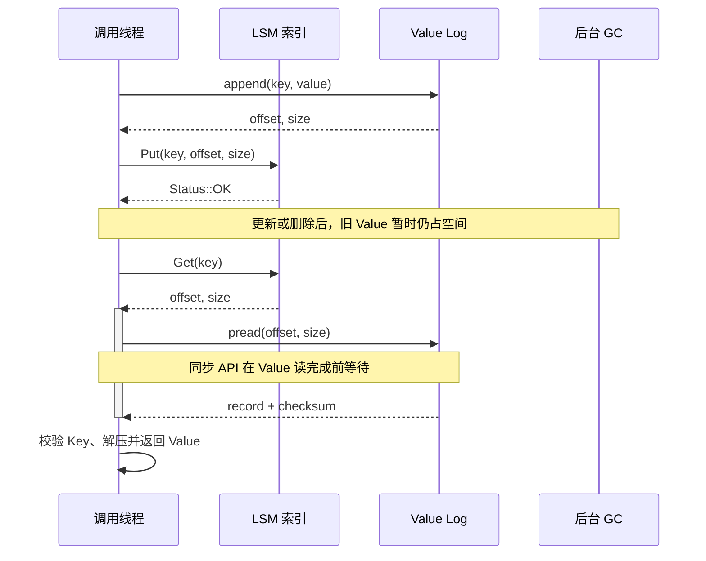
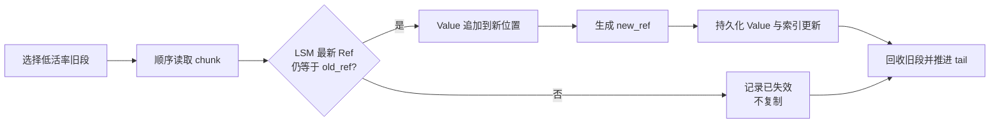
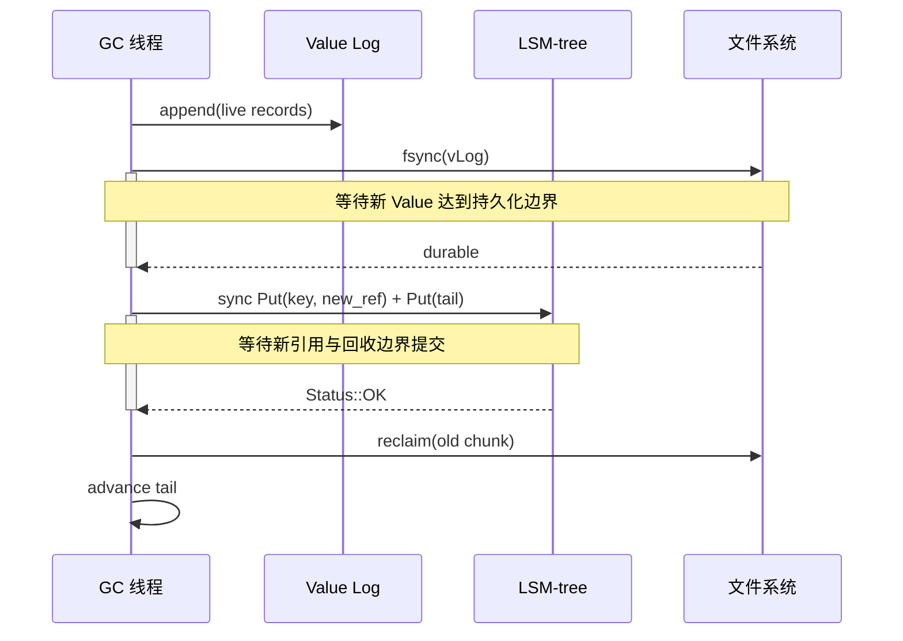
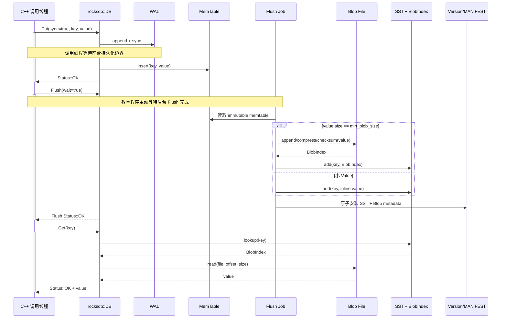

---
tags:
  - 高性能存储
  - 存储引擎
  - LSM-tree
  - WiscKey
  - RocksDB
  - BlobDB
status: 已完成
---

# WiscKey 模型与 RocksDB BlobDB (Key-Value 分离存储)

[[6.6 LSM-tree 三种放大]] 已经说明：LSM-tree 用后台 Compaction 换取顺序写和有序查询，但同一个逻辑记录可能在 L0、L1、L2……之间反复搬运。当 `Value` 远大于 `Key` 时，Compaction 搬运的大部分字节并不是为了比较或排序，而只是被大 Value “拖着走”。

WiscKey 给出的核心解法是 **Key-Value Separation（键值分离）**：

> **只让 LSM-tree 排序 `Key + Value 引用`，把大 Value 写进独立的 append-only Value Log；从而把“键的有序组织”和“值的空间回收”拆成两个数据结构、两条后台路径。**

这个设计不是无成本优化。它把原先内联 LSM 的一部分代价转移成了：

```text
点查的一次间接读
+ Value Log / Blob File 的独立垃圾回收
+ 无效 Value 带来的空间放大
+ 范围扫描时的随机读取与重排
+ 更复杂的崩溃一致性边界
```

因此，正确的理解不是“WiscKey 一定比 RocksDB 快”，而是：

```text
大 Value + 写密集/更新密集 + 点查为主 + SSD 并行随机读能力强
    → Key-Value 分离通常更有机会胜出

Tiny Value + 超长范围扫描 + 低并发存储 + GC 空间紧张
    → 分离的额外间接访问和空间管理可能得不偿失
```

本文承接 [[6.9 RocksDB 关键路径]] 中的 `Put/Get → WAL/MemTable → Flush/Compaction → Version` 路径：先解释 WiscKey 原始模型，再区分 RocksDB **Integrated BlobDB** 的工程化实现。二者共享“把大 Value 移出 SST”的思想，但写入时机、文件组织、GC 和一致性集成方式并不相同。

---

## 1. 先建立总体模型：Compaction 为什么不必搬动整个 Value

### 1.1 传统 LSM：排序单位是完整的 `Key + Value`

普通 LSM-tree 的 SST 记录可以抽象为：

```text
InternalKey = UserKey + SequenceNumber + ValueType
Record      = InternalKey + Value
```

当某一层触发 Compaction 时，存储引擎需要：

1. 读取输入层 SST；
2. 读取下一层发生 Key-Range 重叠的 SST；
3. 按 `InternalKey` 执行多路归并；
4. 丢弃已经被覆盖、删除或快照不可见的旧版本；
5. 把剩余记录写入新的 SST；
6. 原子安装新 Version，最后删除旧文件。

这里真正参与比较的是 Key、Sequence Number 和 Value Type。**Value 本身通常不决定记录在有序空间中的位置，却会跟随记录一起被读出和重写。**

假设：

```text
Key + 元数据 = 32 B
Value         = 4096 B
```

一次 1 GiB 的“完整 KV 搬运”中，真正需要排序的索引信息不到 1%，其余几乎全是 Value 字节。

这正是 [[6.7 Compaction 策略]] 中写放大在大 Value 场景下变得昂贵的原因：Compaction 是否发生由 LSM 层级和空间约束决定，而一次 Compaction 搬多少字节，则强烈受 Value 大小影响。

### 1.2 Key-Value 分离：把 SST 中的 Value 换成小引用

分离后，SST 记录变成：

```text
InternalKey + BlobIndex
```

而真正的 Value 位于另一类文件中：

```text
BlobIndex → {file_number, offset, size, compression, ...}
```

WiscKey 论文中的基本引用是：

```text
<vLog-offset, value-size>
```

当前 RocksDB Integrated BlobDB 的内部 `BlobIndex` 还包含 blob file number 和 compression 等信息。它属于持久化内部格式，不应由业务代码自行拼装或依赖内部头文件。

### 1.3 写放大的定量模型

设：

- `K`：每条记录的 Key 与必要索引元数据字节；
- `V`：Value 字节；
- `R`：Value 引用字节；
- `A_idx`：`Key + Ref` 在 LSM 中经历的写放大；
- `A_blob`：Value 在 Blob/vLog 路径上的写放大，包含初次写入以及 GC 搬迁；
- `WA_sep`：相对于用户写入 `K + V` 的主机侧写放大。

则可近似写成：

$$
WA_{sep}
\approx
\frac{A_{idx}(K+R)+A_{blob}V}{K+V}
$$

传统内联 LSM 则近似为：

$$
WA_{inline}
\approx
A_{lsm}
$$

因为 `K + V` 一起经历层间搬运。

> [!important] `A_blob` 不是永远等于 1
> Value 初次顺序写入一次只是起点。更新、删除和版本淘汰会在 Blob/vLog 中留下垃圾，GC 又会复制仍然存活的 Value，因此：
>
> $$
> A_{blob}=1+\frac{Bytes_{GC\_relocated}}{Bytes_{user\_value}}
> $$

WiscKey 论文给出一个便于建立量级感的例子：16 B Key、1 KiB Value、Key 在 LSM 中写放大为 10、Value 只写一次，则：

$$
\frac{10\times16+1024}{16+1024}\approx1.14
$$

这是 **论文假设下、尚未计入后续 vLog GC 的示例**，不能直接当成生产系统的固定 WA。

### 1.4 应用层 WA 与 SSD 内部 WAF 是两层不同放大

本文讨论的 LSM/Blob GC 写放大主要发生在主机软件层：

```text
用户逻辑写入
→ WAL / SST / Blob 文件写入
→ 块设备主机写入量增加
```

SSD FTL 内部还可能因为页失效、垃圾回收和磨损均衡再次搬迁 NAND 页面：

```text
主机写入量
→ FTL 映射与设备 GC
→ NAND 实际编程量进一步增加
```

粗略地看：

$$
NAND\ Writes
\approx
User\ Writes
\times WA_{host}
\times WAF_{device}
$$

所以，减少大 Value 的 LSM Compaction 字节不仅释放主机 I/O 带宽，也可能减少进入设备 FTL 的写入压力；但最终 NAND 写入仍需结合设备遥测验证，不能只看 RocksDB 的逻辑统计。

### 1.5 `1 KiB～4 KiB` 不是普适分界线

“Value 大于 1 KiB 或 4 KiB 就应该分离”只能作为实验起点，不能作为架构定律。阈值取决于：

- Key、InternalKey 和 Ref 的实际大小；
- Value 大小分布，而不是只有平均值；
- 更新/删除率与对象寿命分布；
- Compaction style、level fanout 和目标文件大小；
- 点查、`MultiGet`、短 Scan、长 Scan 的比例；
- Blob Cache 与 Block Cache 命中率；
- SSD 随机读延迟、可维持队列深度和控制器内部并行度；
- 可接受的空间放大和 GC 带宽；
- 压缩粒度与压缩比。

![[图片/SVG/8_6_6_19_1.svg|1340]]

这张图把三个核心机制放在同一张全景图中：**为什么能大幅降低 Compaction 写放大、无效 Value 怎样在后台被判定与回收、以及失去 Value 物理连续性后如何通过 SSD 并发预取维持范围查询吞吐。**

---

## 2. WiscKey 的数据布局与前台路径

### 2.1 两个逻辑结构，各自承担一种职责

WiscKey 将数据库拆成：

| 结构 | 保存内容 | 核心职责 |
|---|---|---|
| LSM-tree | `Key → <offset, size>` | 有序索引、点查定位、范围 Key 遍历、版本可见性 |
| vLog | `header + key + value` | 大 Value 的 append-only 顺序落盘、后续 GC 数据源 |

它与 [[6.5 Bitcask 模型]] 有相似之处：都使用追加日志保存 Value，并让索引指向最新记录地址。但两者的索引设计不同：

| Bitcask | WiscKey |
|---|---|
| 通常把完整 KeyDir 常驻内存 | 把 Key 索引保存在可落盘的有序 LSM 中 |
| 点查非常直接 | 点查先查 LSM，再读 vLog |
| 原生有序 Scan 能力较弱 | LSM 可按 Key 顺序遍历 |
| Merge 清理旧 segment | vLog GC 依据 LSM 最新引用判断存活 |

因此，WiscKey 可以理解为：

> **把 Bitcask 风格的 Value Log 与 LSM-tree 的可扩展有序索引组合起来。**

### 2.2 为什么 vLog 记录中还要保存 Key

如果 vLog 只有：

```text
Value
```

GC 扫到某条记录时就不知道它属于哪个 Key，也无法询问 LSM：“你当前还指向这个地址吗？”

所以 WiscKey 为每条 vLog 记录保存：

```text
key_size | value_size | key | value
```

工程实现通常还会加入：

```text
magic/version
checksum
record type
expiration / timestamp
padding / alignment
```

Key 在 LSM 和 vLog 中各保存一份，增加了少量空间和写入，但换来了在线 GC 的可判活性。

### 2.3 `Put`：先产生 Value 地址，再把地址写进索引

WiscKey 原始模型的 `Put(key, value)` 可以抽象为：

```text
1. 把 {key, value} 追加到 vLog head
2. 得到 <offset, size>
3. 向 LSM 插入 key → <offset, size>
4. 旧地址不原地删除，等待 GC
```

如果同一个 Key 被更新：

```text
K → offset_old
K → offset_new
```

LSM 的最新版本指向 `offset_new`，`offset_old` 对应的 vLog 记录便成为垃圾。

### 2.4 `Delete`：删除索引引用，不同步挖掉 vLog 中间字节

删除操作只需在 LSM 中写入 tombstone 或删除 Key 的可见映射：

```text
Delete(K)
→ LSM 中 K 不再指向旧 Value
→ 旧 Value 留在 vLog
→ 后台 GC 最终回收
```

这是 log-structured 数据布局的共同特征：前台写入只追加新状态，不在随机位置执行昂贵的空间整理。

### 2.5 `Get`：一次索引查找加一次 Value 间接读

点查路径是：

```text
Get(K)
→ 在 LSM 中查到 BlobIndex
→ 根据 file/offset/size 读取 Value
→ 校验 record / checksum / Key
→ 解压并返回
```

表面看，它比内联 SST 多了一次间接访问；但分离后 LSM 显著变小，可能带来：

- 更少的 SST 层级或文件触碰；
- 更多 index/filter/data metadata 驻留缓存；
- 更高的 [[6.13 Bloom Filter 与 Block Cache|Block Cache]] 有效容量；
- 更轻的后台 Compaction 干扰。

因此点查是否变慢不能只数“多了一次 I/O”，而要比较完整路径：

$$
T_{point}
=
T_{LSM\ lookup}
+T_{blob\ read}
+T_{decompress}
+T_{queueing}
$$

分离可能让第一项和第四项下降，也可能让第二项成为新瓶颈。



图中最容易被代码隐藏的边界是：**索引更新成功并不会物理删除旧 Value；空间回收与前台 Key 生命周期是解耦的。**

---

## 3. Append-only vLog 与后台并发 GC

### 3.1 head、tail 与“有效区间”

WiscKey 将 vLog 视为一条持续追加的日志：

```text
tail                                            head
  ↓                                                ↓
  [待清理旧记录 | 活记录 | 失效记录 | 活记录 | 新追加]
```

- `head`：所有新 Value 和 GC 搬迁 Value 的追加位置；
- `tail`：下一批候选清理记录的起点；
- `[tail, head)`：当前尚未回收的日志区间。

原论文使用单一大 vLog 配合文件系统 hole punching；现代工程实现也常把日志切成多个独立 segment/blob file，以文件为单位选择、搬迁和删除。两种实现都遵循相同原则：

```text
旧区域只读
新区域只追加
回收前先证明旧记录不再被当前索引引用
```

### 3.2 不能只按 Key 存在判断“记录仍然存活”

假设：

```text
vLog@100: K → V1
vLog@900: K → V2
LSM:      K → 900
```

GC 扫到 `vLog@100` 时，LSM 中确实存在 Key `K`，但这不能证明 V1 仍然存活。正确判据是：

```text
LSM 当前可见引用 == 正在检查的旧记录地址
```

即：

```text
Live(K, old_ref)
    := LookupLatest(K) == old_ref
```

如果只检查“Key 是否存在”，GC 会错误搬迁旧版本，甚至让旧 Value 重新覆盖新 Value。

### 3.3 一轮 GC 的执行路径

在线 GC 的核心步骤：

1. 从 tail 或候选旧文件顺序读取一个 chunk；
2. 解析每条 `{key, value, old_ref}`；
3. 查询 LSM 当前最新引用；
4. 只将仍被引用的 Value 追加到 head/新 blob file；
5. 为这些 Key 安装新的引用；
6. 持久化新 Value、新引用与新的回收边界；
7. 删除旧文件或 punch hole；
8. 推进 tail。



### 3.4 用 live ratio 计算 GC 成本

设一个候选段大小为 `S`，活数据比例为 `u`：

```text
Live bytes    = uS
Garbage bytes = (1-u)S
```

本轮 GC 至少需要：

- 读取 `S`；
- 重写 `uS`；
- 最终回收 `(1-u)S`。

每回收 1 B 空间所需的 Value 搬迁量为：

$$
\frac{uS}{(1-u)S}=\frac{u}{1-u}
$$

| 活数据比例 `u` | 搬迁/回收比 `u/(1-u)` | 含义 |
|---:|---:|---|
| 0.2 | 0.25 | 搬 1 B 可回收约 4 B，适合优先清理 |
| 0.5 | 1 | 搬 1 B 回收 1 B |
| 0.8 | 4 | 搬 4 B 才回收 1 B，GC 很昂贵 |
| 0.9 | 9 | 空间压力很大，但清理效率极低 |

这和 SSD FTL 中 [[3.5 GC 写放大与 Over-Provisioning]] 的数学结构相同：**可用空洞越少，为了制造一单位连续空闲空间，必须搬迁的活数据越多。**

### 3.5 GC 与前台更新并发时为什么仍可正确判活

GC 的每条记录都带 `old_ref`。在并发更新下可能发生：

```text
GC 读到 K@old
前台把 K 更新为 K@new
GC 查询 LSM
```

此时查询结果为 `new_ref`，与 `old_ref` 不同，GC 直接丢弃旧 Value。

更复杂的竞态是：

```text
GC 判断 old_ref 仍存活
GC 复制 Value 到 gc_ref
前台同时写入 new_ref
```

工程实现必须让“GC 安装 gc_ref”服从存储引擎的版本序、Sequence Number、条件更新或 Compaction 语义，不能无条件覆盖更晚的前台写入。原始 WiscKey 与 RocksDB Integrated BlobDB 的实现方式不同：

- WiscKey 通过同步 LSM 更新和自己的顺序约束完成搬迁；
- Integrated BlobDB 在 Compaction 处理同一条可见内部记录时同步生成新 BlobIndex，天然位于 RocksDB 的版本归并流程中。

### 3.6 崩溃安全的提交顺序

GC 最大的灾难不是“留下重复 Value”，而是：

```text
旧空间已经释放
但新 Value 或新引用尚未持久化
→ LSM 指向不存在的数据
```

因此安全顺序必须是：

```text
新数据 durable
→ 新引用 durable
→ 新回收边界 durable
→ 最后释放旧空间
```

WiscKey 论文中的 GC 顺序是：

1. 把活 Value 追加到 vLog head；
2. `fsync(vLog)`；
3. 同步写入新 Value 地址与 tail；
4. 最后回收旧区域。



这与 [[6.1 WAL 与 Crash Consistency]]、[[6.4 Torn Write 与 Checksum]] 的结论一致：**写入调用的先后顺序不等于掉电后的持久化顺序；回收旧副本之前必须建立并验证 durable happens-before。**

> [!warning] 原论文的文件系统前提不能无条件外推
> WiscKey 还利用了当时 ext4、XFS、Btrfs 上“append 崩溃后至多保留一个前缀”的观测性质，并在读取时校验地址范围和 Key。实现新系统时不能只引用论文就假设任意文件系统、远程文件系统或块设备都具备相同语义；必须针对实际栈验证 `write`、`fsync/fdatasync`、目录持久化、hole punching 和 torn write 行为。

### 3.7 后台并发 GC 的资源隔离

“后台并发”不代表“无限并发”。GC 会与前台共享：

- SSD 读写带宽和队列深度；
- CPU 解压、checksum 和索引查询；
- Block Cache / Blob Cache；
- 文件描述符；
- Compaction 线程池；
- I/O 调度和 cgroup 配额。

生产系统至少应限制：

```text
GC 并发任务数
GC 读取带宽
GC 搬迁写带宽
单轮 chunk 大小
候选文件数
前台 P99/P999 触发的降速阈值
磁盘剩余空间触发的紧急阈值
```

可以复用 [[6.16 Rate Limiter 与后台任务隔离]] 的原则：常态下让 GC 低速追赶，空间接近红线时提高优先级，但不能等到磁盘几乎写满才开始清理，否则 `u` 往往已经升高，单位回收成本反而更差。

---

## 4. 范围查询为什么回退，以及怎样利用 SSD 内部并发性

### 4.1 内联 LSM 的天然优势：Key 顺序通常也是 Value 物理顺序

在普通 SST 中：

```text
K1,V1 | K2,V2 | K3,V3 | ...
```

短范围扫描通常可以通过连续读取 data block 完成，具有较好的空间局部性和 readahead 效果。

Key-Value 分离后：

```text
LSM:  K1→R7, K2→R2, K3→R9, K4→R1
Blob: R1, R2, ..., R9
```

Key 仍然有序，但 Value 地址由历史写入、更新和 GC 决定。按 Key 顺序调用 `Next()` 可能转化为：

```text
read(offset7)
read(offset2)
read(offset9)
read(offset1)
```

若每次只同步提交一个小随机读，范围查询会失去顺序吞吐，并把每个 Value 的设备延迟串联起来。

### 4.2 不能把“SSD 随机读快”简化成“随机读等于顺序读”

SSD 没有机械寻道，但仍存在：

- FTL 映射查询；
- NAND page 读取和 ECC 解码；
- channel/LUN 冲突；
- PCIe/NVMe 提交与完成开销；
- 内核 I/O 路径与系统调用开销；
- 小 I/O 放大和读合并机会不足；
- GC、热节流、SLC cache 状态造成的尾延迟。

WiscKey 在 2016 年的特定 Samsung 840 EVO 上观察到：32 个线程、请求大于 16 KiB 时，并行随机读吞吐可接近顺序读。这是一个**历史设备上的实验结果**，证明了设计机会，不是所有 SSD 的保证。

《深入浅出 SSD》说明，NAND 的独立并发来自多个 channel、Die/LUN 和 Plane；一个 LUN 通常只能独立执行一个命令，而不同 LUN 可以并行。因此，应用层只有保持足够多的在途 I/O，控制器才有机会把请求分散到内部资源。这个机制应和 [[3.1 NVMe 命令模型]] 中 SQ/CQ 与 Queue Depth 一起理解。

### 4.3 WiscKey 的优化：先顺序读 Key，再并发预取 Value

范围扫描流水线可以拆成：

```text
1. LSM iterator 顺序得到 K1,R7；K2,R2；K3,R9...
2. 给每条记录分配逻辑序号 seq
3. 将 {seq, ref} 放入有界地址队列
4. 多个 worker / 异步 I/O 并行读取 Value
5. 完成事件可能乱序到达
6. 把结果放入 seq → Value 的重排缓冲
7. 只有 next_seq 已完成时，才按 Key 顺序交给用户
```

这里同时存在两种顺序：

| 顺序 | 是否必须保持 |
|---|---|
| 设备完成顺序 | 不必，越能乱序并行越好 |
| 用户观察到的 Key 顺序 | 必须，Iterator 语义不能变化 |

### 4.4 有界预取窗口与背压

设预取窗口为 `W`，平均 Value 大小为 `V_avg`，则仅结果缓冲的内存上界约为：

$$
Memory_{reorder}\approx W\times V_{avg}
$$

窗口太小：

```text
设备队列填不满
→ 无法利用多 LUN/channel
→ 随机读延迟串行暴露
```

窗口太大：

```text
内存和 Blob Cache 污染
+ 取消后浪费读取
+ 一个慢 I/O 阻塞大量已完成结果
+ GC/Compaction 与 Scan 争抢更严重
```

因此地址队列必须有容量上限。当队列或重排缓冲满时，LSM iterator 停止继续预取，这就是范围读取路径的背压。

### 4.5 现代 Linux 上的实现选择

可选实现包括：

- 固定线程池 + `pread()`；
- `io_uring` 多个在途 read；
- RocksDB FileSystem/Env 的异步读取能力；
- 用户态存储栈中的批量 NVMe 命令。

重点不是 API 名称，而是以下不变量：

```text
地址队列有界
在途 I/O 有上限
完成结果带 seq
按 seq 提交
取消能停止继续预取
错误能定位到具体 Key/Ref
对象活到最后一个完成事件返回
```

### 4.6 可以进一步利用物理地址信息

拿到一批 BlobIndex 后，可以在不改变最终 Key 顺序的前提下优化设备读取：

1. 按 `file_number` 分组，减少文件切换；
2. 将同一文件中相邻 offset 合并为较大的 extent read；
3. 按 offset 对设备提交顺序重排；
4. 读取完成后再根据 `seq` 恢复 Key 顺序；
5. 对热点 Value 使用独立 Blob Cache；
6. 根据扫描长度动态调整窗口和并发度。

这相当于：

```text
逻辑顺序：Key order
物理调度：file/offset order
提交顺序：Key order
```

### 4.7 哪些范围查询最容易退化

- Value 很小，单次随机读取的固定开销占比高；
- 数据随机写入，Key 顺序与 Value 位置高度失配；
- 扫描范围很长，几乎等于全表遍历；
- 设备只能维持很低的随机读 IOPS；
- 队列深度被同步 Iterator 限制为 1；
- GC 同时占用大量读取与写入带宽；
- Blob Cache 不足，且预取导致 Block Cache 抖动；
- 运行于 HDD 或随机读昂贵的远程存储；
- 单个慢 Value 读取阻塞重排缓冲的 `next_seq`。

WiscKey 论文的最坏测试中，随机装载 100 GiB 数据并扫描 4 GiB；64 B KV 时 WiscKey 明显慢于 LevelDB。这个结果提醒我们：**Key-Value 分离不是只看平均 Value 大小，还必须把 Scan 长度和物理局部性纳入决策。**

---

## 5. WiscKey、RocksDB Integrated BlobDB、Titan 与 BadgerDB

### 5.1 原始 WiscKey 与 Integrated BlobDB 不是同一条写路径

这是本篇最重要的版本边界。

![[图片/SVG/8_6_6_19_2.svg|900]]

这张图对比了两者的全链路差异：**WiscKey 是前台写日志、独立反查 GC；RocksDB Integrated BlobDB 则把大 Value 提取与判活垃圾回收完全融入后台 Flush 与 Level Compaction 流程中，并原生纳管于 VersionSet / MANIFEST 事务体系。**

| 维度 | WiscKey FAST ’16 | RocksDB Integrated BlobDB |
|---|---|---|
| 基础实现 | LevelDB 1.18 改造 | 集成进普通 `rocksdb::DB` |
| Value 进入外部文件的时机 | 前台 `Put` 先 append vLog | 基线设计在 flush/compaction 后台生成 blob file |
| SST 中保存 | Key + `<offset,size>` | InternalKey + `BlobIndex` |
| 小 Value | 原始模型主要讨论分离 | 小于 `min_blob_size` 可继续内联 SST |
| 外部文件 | 单一 append-only vLog，head/tail | 多个 immutable blob files，纳入 Version/MANIFEST |
| 文件内顺序 | 主要按写入时间 | 后台生成，类似 SST，可按 Key 排列 |
| GC | 独立扫描 tail，查询 LSM 判活 | 与 Compaction 集成，边归并边搬迁并更新 Ref |
| 空间回收 | hole punching / 可改环形日志 | 以 blob file 生命周期回收 |
| 一致性集成 | 自定义 vLog/LSM 顺序与恢复 | 复用 RocksDB flush、compaction、Version、WAL 语义 |
| 读 API | LevelDB 兼容 API | 普通 RocksDB API，业务无需使用旧 BlobDB wrapper |

RocksDB 的工程选择并没有否定 WiscKey，而是在回答另一个问题：

> **怎样把 Key-Value 分离纳入已有 RocksDB 的 [[6.12 Manifest 与 Version Set|Version/MANIFEST]]、[[6.15 Snapshot 与 Sequence Number|Snapshot]]、Checkpoint、Backup、Transaction 和 Compaction 体系，而不是在旁边维护一套难以组合的独立日志。**

### 5.2 不要误用 Legacy BlobDB

RocksDB 代码历史上存在两套 BlobDB：

- Legacy `rocksdb::blob_db::BlobDB`：StackableDB 包装实现，偏 FIFO/TTL，功能兼容性和性能较差；
- Integrated BlobDB：通过 `rocksdb::Options` 开启，仍使用标准 `rocksdb::DB` 接口。

新设计应以 Integrated BlobDB 为主，不要因为旧博客或示例而默认采用 legacy wrapper。

### 5.3 Integrated BlobDB 的当前引用格式

当前 RocksDB 内部 `kBlob` 引用概念上包含：

```text
type
file_number
offset
size
compression
```

TTL 变体还会加入 expiration。它被作为 `ValueType::kTypeBlobIndex` 存在基础 DB 中。

> [!warning] 不要让业务依赖 `db/blob/blob_index.h`
> RocksDB 明确把非 `include/` 下的头文件视为内部实现。业务只配置公开 Options、调用公开 DB API，并通过属性和统计观测即可。

### 5.4 Integrated BlobDB 的 GC 为什么能少一次索引往返

原始 WiscKey 独立 GC 扫描 vLog 后，需要对每条记录执行 LSM 查询来判断：

```text
current_ref == old_ref ?
```

Integrated BlobDB 的 GC 在 Compaction 处理内部记录时已经知道：

- 哪个版本仍然可见；
- 哪个 BlobIndex 正被输出；
- 哪些旧版本、删除标记已经被淘汰。

因此它可以在同一次 Compaction 中：

```text
读旧 Blob
→ 写入新 Blob File
→ 把输出 SST 中的 BlobIndex 改为 new_ref
```

无需为每条记录额外做一次独立 `Get/Put`。代价是 Blob GC 进度与 Compaction 选择发生耦合，因此 RocksDB 又提供 age cutoff 和强制 targeted compaction 阈值来控制空间回收。

### 5.5 当前 `main` 的 experimental direct-write 路径

截至 2026-08-30，RocksDB `main` 的公开 Options 中还出现了实验性的 `enable_blob_direct_write`：Value 可以在前台写路径直接进入 blob file，并在 WAL/memtable 中替换为 BlobIndex。

但当前头文件同时列出多项限制，包括：

- 只支持有序单 memtable writer 路径；
- 不支持 unordered、pipelined、two write queues 和 concurrent memtable write；
- active direct-write blob file 的 WAL replay 恢复仍有限制；
- checkpoint/backup/live-files 需要先 flush 某些状态；
- 与部分功能不兼容。

因此它不应被当作 Integrated BlobDB 的默认工作方式。本文代码示例保持 `enable_blob_direct_write = false`，讲解稳定的后台 flush/compaction 提取路径。

### 5.6 Titan 与 BadgerDB 的位置

- **BadgerDB**：Go 实现，明确以 WiscKey 为设计基础，采用 LSM + Value Log；
- **Titan**：TiKV/RocksDB 体系中的 Key-Value 分离插件，在 flush/compaction 时按阈值把 Value 写入 blob file；
- **RocksDB Integrated BlobDB**：上游 RocksDB 内建能力，使用标准 DB API；
- **WiscKey**：奠定现代 SSD-aware Key-Value 分离设计的论文模型。

它们共享的是设计方向，不共享同一套文件格式、GC 协议或崩溃恢复边界。

---

## 6. RocksDB Integrated BlobDB：C++17 配置与调用

下面使用 RocksDB 的公开头文件与标准 `rocksdb::DB` API。代码按 **2026-08-30 核对的 RocksDB `main@82dfd6a5` 公共接口**编写；较旧版本可能仍主要暴露 `DB**` 裸指针输出参数，不能把两套 `Open()` 签名机械混用。

> [!note] 示例目标
> 这段程序不是吞吐 Benchmark，而是验证三个边界：
>
> 1. 业务仍调用普通 `Put/Get`；
> 2. `Flush(wait=true)` 只为教学观察，迫使 MemTable 进入 SST/Blob 文件；
> 3. DB 的所有权由 `std::unique_ptr` 表达，异常路径不泄漏。

### 6.1 公开头文件、单位与所有权类型

```cpp
// 适用：C++17；RocksDB Integrated BlobDB（main@82dfd6a5）。
#include <array>
#include <cstdint>
#include <iostream>
#include <memory>
#include <stdexcept>
#include <string>
#include <string_view>

#include <rocksdb/db.h>
#include <rocksdb/options.h>
#include <rocksdb/slice.h>
#include <rocksdb/statistics.h>

namespace demo {

constexpr std::uint64_t kKiB = 1024ULL;
constexpr std::uint64_t kMiB = 1024ULL * kKiB;
using DbPtr = std::unique_ptr<rocksdb::DB>;
```

这里只包含 `include/rocksdb/` 下的公开接口；业务代码不应包含 `db/blob/blob_index.h` 等内部头文件。`DbPtr` 明确表示调用者独占数据库句柄，避免用裸指针表达所有权。

### 6.2 把“哪些 Value 分离”与“怎样回收”拆成两组配置

```cpp
void ConfigureBlobPlacement(rocksdb::Options& options) {
    options.create_if_missing = true;
    options.compaction_style = rocksdb::kCompactionStyleLevel;

    // 只有达到阈值的 Value 才离开 SST；4 KiB 只是实验档位，
    // 不是生产推荐值，也不是 WiscKey/BlobDB 的普适分界线。
    options.enable_blob_files = true;
    options.min_blob_size = 4ULL * kKiB;

    // Blob 文件太大时回收粒度变粗；太小时文件和元数据开销上升。
    options.blob_file_size = 256ULL * kMiB;

    // 先用无压缩建立可解释基线，再单独测试 LZ4/Zstd。
    options.blob_compression_type = rocksdb::kNoCompression;
}
```

```cpp
void ConfigureBlobGcAndObservability(rocksdb::Options& options) {
    // Integrated Blob GC 在 Compaction 遇到旧 BlobIndex 时搬迁活 Value。
    options.enable_blob_garbage_collection = true;

    // 允许 GC 考察最老的 25% Blob 文件；对象寿命分布不同，
    // 最佳 cutoff 也会不同。
    options.blob_garbage_collection_age_cutoff = 0.25;

    // GC/Compaction 顺序读取 Blob 文件时扩大 I/O 粒度。
    options.blob_compaction_readahead_size = 2ULL * kMiB;

    // 没有 Statistics 对象，就拿不到 Blob 读写与搬迁 tickers。
    options.statistics = rocksdb::CreateDBStatistics();
}

rocksdb::Options MakeBlobOptions() {
    rocksdb::Options options;
    ConfigureBlobPlacement(options);
    ConfigureBlobGcAndObservability(options);
    return options;
}
```

这样拆分是为了防止把两个独立旋钮混在一起：`min_blob_size` 决定**何时产生 Blob**，GC 参数决定**产生垃圾后怎样还债**。只开分离却不规划 GC，会把写放大问题换成无上限的空间放大。

### 6.3 用当前 `unique_ptr` 输出参数打开数据库

```cpp
DbPtr OpenBlobDb(const std::string& path) {
    rocksdb::Options options = MakeBlobOptions();
    DbPtr db;

    const rocksdb::Status status =
        rocksdb::DB::Open(options, path, &db);

    if (!status.ok()) {
        throw std::runtime_error(
            "RocksDB open failed: " + status.ToString());
    }
    if (!db) {
        throw std::runtime_error(
            "RocksDB open returned OK but no DB object");
    }

    return db;
}
```

当前公共 API 在成功时直接把 `std::unique_ptr<DB>` 写入输出参数，并在失败时重置它。较旧 RocksDB 版本若只有 `DB**` 重载，应在成功后立刻接管裸指针，但不能为了兼容旧版而在新代码中无谓地退回手工所有权管理。

### 6.4 写入大 Value，并显式 Flush 观察物理分离

```cpp
void PutLargeValue(
    rocksdb::DB& db,
    const std::string& key,
    const std::string& value) {
    rocksdb::WriteOptions write_options;
    write_options.sync = true;

    const rocksdb::Status status =
        db.Put(write_options, key, value);
    if (!status.ok()) {
        throw std::runtime_error(
            "RocksDB Put failed: " + status.ToString());
    }
}

void FlushForObservation(rocksdb::DB& db) {
    rocksdb::FlushOptions flush_options;
    flush_options.wait = true;

    const rocksdb::Status status = db.Flush(flush_options);
    if (!status.ok()) {
        throw std::runtime_error(
            "RocksDB Flush failed: " + status.ToString());
    }
}
```

`sync=true` 约束本次前台写的 RocksDB/WAL 持久化边界，并不等于“当前线程立即把 Value 单独写进 Blob 文件”。基线 Integrated BlobDB 通常在后台 Flush/Compaction 中提取大 Value；这里额外调用 `Flush(wait=true)`，只是为了让教学程序在返回前确实生成可观测的 SST/Blob 文件，生产热路径不应每写一条就手工 Flush。

### 6.5 通过普通 `Get()` 校验逻辑结果

```cpp
void ReadAndVerify(
    rocksdb::DB& db,
    const std::string& key,
    const std::string& expected) {
    rocksdb::ReadOptions read_options;
    std::string actual;

    const rocksdb::Status status =
        db.Get(read_options, key, &actual);

    if (status.IsNotFound()) {
        throw std::runtime_error("RocksDB Get: key not found");
    }
    if (!status.ok()) {
        throw std::runtime_error(
            "RocksDB Get failed: " + status.ToString());
    }
    if (actual != expected) {
        throw std::runtime_error("RocksDB Get: value mismatch");
    }
}
```

业务侧仍然得到完整 Value，不需要解析 `BlobIndex`。间接读取、checksum、解压和文件缓存都由 RocksDB runtime 完成；这正是 Integrated BlobDB 与 legacy wrapper 最大的使用面差异。

### 6.6 属性不存在时必须显式报告

```cpp
void PrintBlobProperties(rocksdb::DB& db) {
    constexpr std::array<std::string_view, 5> kProperties{
        "rocksdb.num-blob-files",
        "rocksdb.blob-stats",
        "rocksdb.total-blob-file-size",
        "rocksdb.live-blob-file-size",
        "rocksdb.live-blob-file-garbage-size",
    };

    for (const std::string_view property : kProperties) {
        std::string value;
        const rocksdb::Slice property_name{
            property.data(), property.size()};

        // false 表示当前版本、Column Family 或构建不支持该属性；
        // 不能把空字符串误报成数值 0。
        if (!db.GetProperty(property_name, &value)) {
            std::cerr << property << ": unavailable\n";
            continue;
        }

        std::cout << property << ": " << value << '\n';
    }
}

}  // namespace demo
```

属性只说明当前 Version 与文件状态，不等于业务性能结论。还需要把这些值与 SST Compaction 字节、GC 搬迁字节、设备写入和前台 P99 放在同一时间轴上。

### 6.7 最小入口

```cpp
int main(int argc, char* argv[]) {
    if (argc != 2) {
        std::cerr << "usage: blob_demo <db-path>\n";
        return 2;
    }

    try {
        auto db = demo::OpenBlobDb(argv[1]);

        // 16 KiB 明显超过示例的 4 KiB 阈值。
        const std::string value(16ULL * demo::kKiB, 'x');
        demo::PutLargeValue(*db, "object:42", value);
        demo::FlushForObservation(*db);
        demo::ReadAndVerify(*db, "object:42", value);
        demo::PrintBlobProperties(*db);
        return 0;
    } catch (const std::exception& ex) {
        std::cerr << ex.what() << '\n';
        return 1;
    }
}
```



这张图揭示了同步点与所有权边界：`Put(sync=true)` 等待的是前台写提交；示例中的 `Flush(wait=true)` 另行等待文件生成；`Get()` 才在 BlobIndex 路径上读取 Value。DB 对象必须活到所有同步调用返回，并由 `unique_ptr` 在最后关闭。

### 6.8 关键 Options 的工程含义

| Options | 作用 | 调大/调小的主要代价 |
|---|---|---|
| `enable_blob_files` | 开启 Integrated BlobDB | 开启后读、空间与备份路径都需纳入测试 |
| `min_blob_size` | 只分离达到阈值的 Value | 太小：间接读多；太大：Compaction 仍搬大 Value |
| `blob_file_size` | Blob 文件滚动大小 | 太大：回收粒度粗；太小：文件和元数据多 |
| `blob_compression_type` | 每个 Blob 的压缩算法 | 节省空间与 I/O，但增加 CPU 和点查解压 |
| `enable_blob_garbage_collection` | 开启 Blob GC | 降低空间放大，但增加后台读写 |
| `blob_garbage_collection_age_cutoff` | 哪部分最老文件可被搬迁 | 更激进会增加 GC WA；更保守会积累垃圾 |
| `blob_garbage_collection_force_threshold` | 垃圾比例高时触发 targeted compaction | 当前只支持 leveled；过低可能制造额外 Compaction |
| `blob_compaction_readahead_size` | GC/Compaction 读 Blob 的预读窗口 | 过大可能污染缓存或占用带宽 |
| `blob_file_starting_level` | 从指定 LSM 输出层才开始分离 | 延迟分离可避免短命 Value 过早进入 Blob |
| `blob_cache` | 为 Value 设置专用缓存 | 需要与 Block Cache 做容量与优先级隔离 |
| `prepopulate_blob_cache` | Flush 时预热 Blob Cache | 提升写后读，但可能挤出更有价值的缓存项 |

> [!tip] `blob_file_starting_level` 对“短命大 Value”很重要
> 如果大量大 Value 写入后很快被覆盖，立即分离会迅速制造 Blob 垃圾。延迟到更高层再提取，等价于先让 L0/L1 Compaction 淘汰短命版本，再把更可能长期存活的 Value 放入 Blob 文件。代价是这些 Value 在低层仍会经历几次 LSM 搬运。

---

## 7. 怎样证明 Key-Value 分离真的适合当前工作负载

### 7.1 先记录 Value 分布，而不是只看平均值

至少统计：

```text
P50 / P90 / P99 Value size
<1 KiB、1～4 KiB、4～16 KiB、16～64 KiB、>64 KiB 的字节占比
每个区间的更新率、删除率、点查率、扫描率
对象存活时间分布
```

平均 Value 为 8 KiB 可能对应两种完全不同的系统：

```text
A：几乎所有 Value 都约 8 KiB
B：99% 是 100 B，1% 是 800 KiB
```

它们的最佳 `min_blob_size`、缓存策略和 GC 行为不会相同。

### 7.2 最小实验矩阵

固定 Key 大小和总有效数据量，至少覆盖：

| 维度 | 建议档位 |
|---|---|
| Value size | 128 B / 1 KiB / 4 KiB / 16 KiB / 64 KiB |
| `min_blob_size` | disabled / 1 KiB / 4 KiB / 16 KiB / 32 KiB |
| 访问模型 | 100% 写 / 50R50U / 95R5U / 点查 / `MultiGet` |
| Scan | 100 条 / 1 万条 / 1 GiB / 全库 |
| Key 顺序 | 顺序写 / 随机写 / Zipf 更新 |
| GC | 关闭 / 常态 / 强制高垃圾比例 |
| Cache | 冷缓存 / 热缓存 / Blob Cache 分离 |
| 空间水位 | 30% / 70% / 90% 已用 |

不要只做 initial load。Key-Value 分离的关键代价要在长期更新后才暴露：

```text
load
→ 稳态 overwrite/delete
→ Blob 垃圾积累
→ GC 追赶
→ 空间压力
→ 前台 P99
```

### 7.3 同时量三层写放大

#### 业务层

```text
Bytes_user_key
Bytes_user_value
成功 Put/Delete 数
```

#### RocksDB 文件层

```text
WAL bytes
SST flush bytes
SST compaction bytes
Blob file bytes written
Blob GC bytes relocated
Blob garbage bytes
```

#### 设备层

```text
块设备 host write bytes
NVMe SMART Data Units Written
设备 busy/await/queue depth
温度与节流状态
```

推荐分别计算：

$$
WA_{RocksDB}
=
\frac{WAL+SST\ writes+Blob\ writes}{User\ logical\ bytes}
$$

$$
WA_{blob}
=
\frac{Initial\ blob\ bytes+GC\ relocated\ bytes}{User\ value\ bytes}
$$

$$
WAF_{device}
=
\frac{NAND\ programmed\ bytes}{Host\ write\ bytes}
$$

多数消费级设备并不直接暴露 NAND programmed bytes，此时只能使用厂商属性或近似指标，并明确口径。

### 7.4 RocksDB 应重点观测的 Blob 指标

当前 Integrated BlobDB 提供的关键统计包括：

```text
BLOB_DB_BLOB_FILE_BYTES_READ
BLOB_DB_BLOB_FILE_BYTES_WRITTEN
BLOB_DB_BLOB_FILE_SYNCED
BLOB_DB_GC_NUM_KEYS_RELOCATED
BLOB_DB_GC_BYTES_RELOCATED
```

关键 DB Properties 包括：

```text
rocksdb.num-blob-files
rocksdb.blob-stats
rocksdb.total-blob-file-size
rocksdb.live-blob-file-size
rocksdb.live-blob-file-garbage-size
rocksdb.estimate-live-data-size
```

需要把它们与 [[6.14 Write Stall]] 中的 stall time、pending compaction bytes、L0 file count 和前台 P99 放在同一时间轴上。只看到“Blob GC 搬迁很多”并不能判断是否异常；如果它换来了更少 SST Compaction 和更低 stall，整体仍可能是正收益。

### 7.5 范围扫描要额外观察什么

```text
每次 Scan 返回 Key 数和 Value 字节数
Blob read IOPS 与平均 I/O 大小
实际设备 Queue Depth
乱序完成程度
重排缓冲峰值
等待 next_seq 的 head-of-line 时间
预取命中率与取消浪费字节
Block Cache / Blob Cache 污染
```

一个范围扫描可能总吞吐不差，但因为少数慢 I/O 阻塞 `next_seq` 而产生很高 P999。此时问题不是平均带宽，而是重排缓冲前端的 head-of-line blocking。

---

## 8. 常见误区与故障模式

### 8.1 把“只存 Key”理解成真的只存用户 Key

LSM 中仍需保存：

```text
UserKey
Sequence Number
Value Type
BlobIndex
可能的 TTL/时间戳/校验元数据
```

真正被移走的是大 Value，不是所有元数据。

### 8.2 所有 Value 都分离

Tiny Value 的 BlobIndex、额外 I/O 和文件记录头可能与 Value 本身一样大。分离阈值为 0 虽然合法，但必须有明确实验依据。

### 8.3 认为 Compaction 不再重要

分离后仍需 Compaction 来：

- 维持 Key 的有序层级；
- 清理旧版本和 tombstone；
- 处理 Snapshot 可见性；
- 生成/更新 BlobIndex；
- 推进 Integrated Blob GC；
- 控制读放大和空间放大。

Key-Value 分离减少的是每次 Compaction 搬运的字节，不是消灭 Compaction。

### 8.4 GC 只要“查到 Key 存在”就复制

必须比较完整引用或版本身份。否则旧 Value 可能被误判为活记录。

### 8.5 先删旧文件，再提交新引用

这是典型数据丢失顺序。旧空间回收必须是最后一步。

### 8.6 把论文中的 `fallocate(PUNCH_HOLE)` 当成所有环境通用能力

不同文件系统、稀疏文件、快照、CoW、加密层、网络文件系统和对象存储的回收语义不同。必须验证：

```text
是否真正释放物理空间
是否需要 block 对齐
崩溃时 hole 与 metadata 的顺序
快照是否继续固定旧 extent
监控看到的是逻辑大小还是物理占用
```

### 8.7 只测点查，不测 Scan

Value 物理乱序是 Key-Value 分离最明确的读路径代价。至少要测短 Scan、长 Scan、随机装载和顺序装载。

### 8.8 线程越多，范围扫描越快

超过设备最优 QD 后，更多 worker 可能只会增加：

- 上下文切换；
- I/O 排队；
- cache pollution；
- P99/P999；
- 与 GC/Compaction 的争用。

并发度应由设备基准和在线延迟反馈决定，而不是照抄 WiscKey 的 32 个线程。

### 8.9 忽略空间放大

删除或覆盖 Key 后，Blob 不会立即消失。Blob 文件粒度、Snapshot/Version 生命周期和 GC cutoff 都可能固定垃圾空间。部署容量必须为“有效数据 + 暂存垃圾 + GC 复制目标 + Compaction 临时空间”留余量。

### 8.10 把 WiscKey 的去掉 LSM WAL 优化搬到 RocksDB

原始 WiscKey 利用 vLog 中重复保存 Key 来恢复索引，并据此优化掉自己的 LSM log。RocksDB Integrated BlobDB 的一致性体系与它不同；不能因为理解了论文就擅自关闭 RocksDB WAL。

### 8.11 混淆 Legacy BlobDB 与 Integrated BlobDB

看到 `rocksdb::blob_db::BlobDB` 旧示例时，应先核对版本和实现。现代配置优先使用 `rocksdb::DB + enable_blob_files`。

### 8.12 把一个厂商/版本的阈值当作统一推荐

WiscKey 论文、Titan、RocksDB 和不同 SSD 的结论来自不同：

```text
文件格式
写入路径
GC 策略
压缩方式
硬件
数据分布
基准口径
```

跨系统比较时必须保留这些版本边界。

---

## 9. 何时应该采用 Key-Value 分离

### 9.1 较适合

- 大 Value 字节占数据库总写入的主要部分；
- overwrite/delete 多，内联 Compaction 搬运严重；
- SST Compaction 已经吃满设备或导致 Write Stall；
- 点查和 `MultiGet` 比长范围扫描更重要；
- SSD/NVMe 有足够随机读 IOPS 和可利用的并行度；
- 可以为 Blob 垃圾和 GC 复制保留空间；
- 有能力观测并限制后台 GC；
- 接受更复杂的备份、恢复、校验和迁移测试。

### 9.2 较不适合

- Value 主要是几十到几百字节；
- 业务以大范围有序扫描为核心；
- 存储是 HDD 或高随机访问成本的远程介质；
- 容量极紧，无法承担垃圾和重写的暂态空间；
- 工作负载对象寿命很短，Blob 刚写入就失效；
- 缺少设备队列深度和 Blob GC 观测能力；
- 当前瓶颈根本不是 Compaction，而是 CPU、锁、网络或应用序列化。

### 9.3 一个可执行的决策顺序

```text
1. 证明 SST Compaction 字节是主要瓶颈
2. 统计 Value 大小与寿命分布
3. 选 2～4 个 min_blob_size 候选
4. 测点查、MultiGet、短 Scan、长 Scan
5. 运行到 GC 稳态，而不是只测初始装载
6. 同时比较 RocksDB WA、设备写入与 P99
7. 用 [[6.10 崩溃注入测试]] 校验恢复，并覆盖 Checkpoint、Backup、Snapshot
8. 再决定是否生产启用
```

---

## 10. 关键结论

1. LSM Compaction 为了维持 **Key 的有序性**，并不要求大 Value 跟着反复排序；Key-Value 分离正是利用了这一点。
2. 分离后，LSM 存储 `InternalKey + BlobIndex`，大 Value 存储在 append-only vLog 或 immutable blob files 中。
3. 主机侧写放大应拆成索引路径与 Value 路径：`A_idx(K+R)` 和 `A_blob·V`；Blob GC 会使 `A_blob > 1`。
4. 更新和删除只让旧引用失效，不能在前台随机挖掉 vLog 中间空间；后台 GC 才负责复制活 Value 并回收旧段。
5. GC 判活必须比较“LSM 当前引用是否仍等于 old_ref”，不能只检查 Key 是否存在。
6. 回收旧空间之前，必须先持久化新 Value、新引用和新的回收边界。
7. Key-Value 分离会破坏 Key 顺序与 Value 物理顺序的绑定，范围扫描可能从顺序读退化为小随机读。
8. 范围扫描优化依赖有界预取、足够 QD、并行随机读、乱序完成和按 `seq` 重排；线程数越多并不必然越快。
9. WiscKey 是前台 append vLog 的论文模型；RocksDB Integrated BlobDB 基线通常在后台 flush/compaction 生成 Blob 文件，不能把两者写路径混为一谈。
10. RocksDB 应使用标准 `rocksdb::DB + enable_blob_files`；Legacy BlobDB 不应作为新系统默认选择。
11. `min_blob_size` 没有普适 1 KiB/4 KiB 答案，必须根据 Value 分布、访问模型、设备并行度和 GC 稳态测试。
12. 真正的收益判定需要同时观察用户字节、SST/Blob/GC 字节、设备写入、空间放大和前台 P99/P999。

---

## 11. 参考资料

### 项目 Sources：教材

- Martin Kleppmann, *Designing Data-Intensive Applications*, 1st ed., O’Reilly, 2017：
  - Chapter 3, “SSTables and LSM-Trees”, pp. 76–79；
  - Chapter 3, “Comparing B-Trees and LSM-Trees”, pp. 83–85。
- 舒继武，《数据存储架构与技术（第2版）》：
  - 第 5.2.3 节“LSM 树索引”；
  - 第 5.3.2 节“日志结构的数据组织”。
- SSDFans，《深入浅出 SSD：固态存储核心技术、原理与实战》，第 1 版，2018：
  - 第 3.1.3 节“闪存组织结构”：channel、Die/LUN 与 Plane 并行；
  - 第 4.3 节“垃圾回收”：失效页搬迁、设备侧写放大与空间水位。

### 论文

- Lanyue Lu, Thanumalayan S. Pillai, Andrea C. Arpaci-Dusseau, Remzi H. Arpaci-Dusseau, “WiscKey: Separating Keys from Values in SSD-conscious Storage”, *14th USENIX Conference on File and Storage Technologies (FAST ’16)*, pp. 133–148, 2016。
  - https://www.usenix.org/conference/fast16/technical-sessions/presentation/lu

### RocksDB 官方资料与源码

- RocksDB Wiki, “BlobDB”，访问日期：2026-08-30。
  - https://github.com/facebook/rocksdb/wiki/BlobDB
- RocksDB, `include/rocksdb/advanced_options.h`，`main@82dfd6a5100e29dc315b71bd38331a2902fd3b3e`，访问日期：2026-08-30。
  - https://github.com/facebook/rocksdb/blob/82dfd6a5100e29dc315b71bd38331a2902fd3b3e/include/rocksdb/advanced_options.h
- RocksDB, `include/rocksdb/db.h`，`main@82dfd6a5100e29dc315b71bd38331a2902fd3b3e`，访问日期：2026-08-30。
  - https://github.com/facebook/rocksdb/blob/82dfd6a5100e29dc315b71bd38331a2902fd3b3e/include/rocksdb/db.h
- RocksDB, `db/blob/blob_index.h`，`main@82dfd6a5100e29dc315b71bd38331a2902fd3b3e`，访问日期：2026-08-30。
  - https://github.com/facebook/rocksdb/blob/82dfd6a5100e29dc315b71bd38331a2902fd3b3e/db/blob/blob_index.h
- RocksDB Blog, “Integrated BlobDB”，2021-05-26。
  - https://rocksdb.org/blog/2021/05/26/integrated-blob-db.html

### 工业实现

- Dgraph BadgerDB，Design，访问日期：2026-08-30。
  - https://github.com/dgraph-io/badger
- TiKV Titan，访问日期：2026-08-30。
  - https://github.com/tikv/titan
- PingCAP TiDB Docs, “Titan Overview” 与 “Titan Configuration”，访问日期：2026-08-30。
  - https://docs.pingcap.com/tidb/stable/titan-overview/
  - https://docs.pingcap.com/tidb/stable/titan-configuration/
