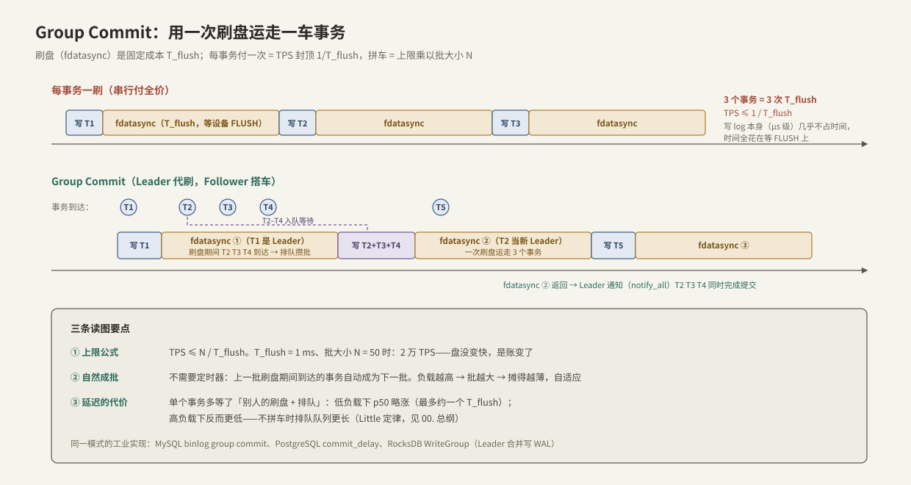

---
tags:
  - 高性能存储
  - 存储引擎
---
# Group Commit

> [[6.1 WAL 与 Crash Consistency]] 把提交点定义在「日志 fdatasync 完成」上，随之而来一笔残酷的账：**每个事务付一次刷盘，TPS 的天花板就是 1/T_flush**——消费级 SSD 的 FLUSH 毫秒级（[[1.4 fsync fdatasync 与持久化语义]]），意味着无论 CPU 多强、代码多好，单点写入被钉死在千级 TPS。Group Commit 是所有数据库对此的标准解法：**刷盘是固定成本，那就拼车——攒一批事务共享同一次 fdatasync**。本篇算清上限账、讲透 Leader/Follower 的自然成批机制，写一个可压测的多线程实现，并说明这笔「吞吐 × N」的交易到底用什么延迟换的。

前置：[[6.1 WAL 与 Crash Consistency]]（append 与 commit 分离——本篇的全部空间来自这个接口）、[[1.4 fsync fdatasync 与持久化语义]]（T_flush 由什么构成、为何盘与盘差一个数量级）。

---

## 1. 上限账：瓶颈不是带宽，是「次数」

先把问题定量。一个事务的关键路径 = 追加几百字节日志（μs 级）+ 一次 `fdatasync`（记为 T_flush）。串行地每事务一刷：

$$
TPS_{\max} = \frac{1}{T_{flush}}
$$

【量级】T_flush 的现实范围（对照 [[1.4 fsync fdatasync 与持久化语义]] §2）：企业级 NVMe（带掉电保护电容）约几十 μs → 上限数万；消费级 SSD 约 1 ms → 上限约 1000；这还没算文件系统日志提交的份额。

注意这笔账的反直觉之处【事实】：**瓶颈与数据量无关**。每事务几百字节，1000 TPS 才几百 KB/s——盘的顺序写带宽（GB/s 级）闲置了 99.9%。卡住我们的不是「写多少」，而是「等多少次 FLUSH 往返」。这与 [[00. 总纲]] 杠杆 2「减少切换」同构：固定开销 × 次数，优化方向必然是**摊薄次数**。

多线程并发提交能突破吗？不能——所有事务刷的是**同一个日志文件的尾部**，fdatasync 天然串行化。10 个线程各自 fdatasync，只是排队轮流付全价。但这个「排队」恰恰暴露了机会：**排在后面的事务，它们的日志早就 append 好了，前面那次 fdatasync 顺手就能把它们一起刷下去**。

---

## 2. 机制：Leader/Follower 与自然成批

Group Commit 的执行模型【事实】：

1. 事务把 log record **append 进日志（或日志缓冲）**，然后进入提交等待；
2. 当前没人在刷盘 → 该事务当选 **Leader**，把此刻已 append 的所有记录一次 `fdatasync`；
3. 已有 Leader 在刷 → 当 **Follower**：record 留在队列里，人睡在条件变量上；
4. Leader 刷完，唤醒所有被这次刷盘覆盖的 Follower——它们的提交点共享同一次 fdatasync；刷盘期间新到的事务中产生下一任 Leader。



上限变成：

$$
TPS_{\max} = \frac{N}{T_{flush}}
$$

其中 N 是平均批大小。T_flush = 1 ms、N = 50 → 5 万 TPS：**盘没有变快一纳秒，是账变了**。

最精妙的一点是**自然成批（natural batching）**【事实/设计】：上面的协议里没有定时器、没有「攒够 K 个再刷」的阈值——批的边界由上一次刷盘的时长天然划出。它因此自适应：

- 低负载：Leader 到达时队列是空的，独自成批立刻刷——**几乎不增加延迟**；
- 高负载：刷盘期间涌入的事务全部成为下一批——**负载越高批越大，摊得越薄**，吞吐随并发上升，直到逼近盘的能力。

对比另一派实现——**定时窗口**：提交前固定 sleep 一小段攒批（PostgreSQL `commit_delay`、MySQL `binlog_group_commit_sync_delay`【实现】）。它在低负载下白白给每个事务加固定延迟，窗口调大调小都要拍脑袋【取舍】；通常只在「自然批还不够大、盘的 FLUSH 又特别贵」时作为补充。现代引擎的主体机制都是自然成批：MySQL binlog 组提交、RocksDB 的 WriteGroup（Leader 合并整组的 WAL 写入，[[6.9 RocksDB 关键路径]]）【实现】。

---

## 3. 延迟账：拼车到底牺牲了谁

「攒批 = 增加延迟」是对 Group Commit 最常见的误读，值得单独算清【事实】：

| 负载 | 每事务一刷 | Group Commit |
| --- | --- | --- |
| 低（到达间隔 > T_flush） | 延迟 ≈ T_flush | Leader 即到即刷，延迟 ≈ T_flush——**没变差** |
| 中 | 延迟 = 排队等前面**每个**事务各刷一次 | 最多等「当前这轮刷完 + 自己这轮」，≈ 2×T_flush 封顶 |
| 高（到达率 > 1/T_flush） | **队列无界增长，延迟发散** | 批大小自动增大吸收到达率，延迟稳定在 ~2×T_flush |

用 Little 定律（[[00. 总纲]] §4）看最直白：到达率 λ 超过服务率 1/T_flush 时，不拼车的系统队列长度 L 无限增长；拼车把服务率抬成 N/T_flush，λ 一涨 N 跟着涨，系统始终稳定。**高负载下 Group Commit 的平均延迟反而更低**——它牺牲的只是低负载下单个事务「本可以独占刷盘却要等同批人」的那一点点，而自然成批连这一点都几乎抹掉了。

p99 的形状也变了【实践】：每事务一刷的 p99 由排队深度决定，负载一高就上天；Group Commit 的 p99 贴着 2×T_flush 走，尾部反而更平。压测时只看 TPS 不看延迟分布，会漏掉这个最有说服力的对比面。

---

## 4. 实现：70 行多线程 Group Commit

在 [[6.1 WAL 与 Crash Consistency]] 的 `Wal`（`append` + `commit` 分离）之上加一层。设计要点先行：

- **序号即凭据**：每条记录 append 时领取递增序号 `seq`；`flushed_` 记录「已持久化到哪个序号」。事务的提交条件就是 `flushed_ >= 我的 seq`——把「我这批刷完没有」变成一个单调水位判断，天然免疫「唤醒了但不是我这批」的混乱；
- **锁只保护队列，绝不覆盖 IO**：Leader 摘下整批后**先释放锁再做 write + fdatasync**——刷盘的毫秒里，下一批必须能继续 append，否则拼车退化回串行；
- **单一 Leader 不重叠**：`flushing_` 标志保证同一时刻至多一次 fdatasync 在飞，后到者一律睡等。

```cpp
#include <condition_variable>
#include <cstdint>
#include <mutex>
#include <span>
#include <vector>

class GroupCommitWal {
public:
    explicit GroupCommitWal(Wal& wal) : wal_{wal} {}

    // 阻塞直到本条记录持久化(可能由别的线程代刷)。多线程并发调用
    void commit(std::vector<std::byte> record) {
        std::unique_lock lk{mu_};
        const std::uint64_t my_seq = ++next_seq_;
        pending_.push_back(std::move(record));

        while (flushed_ < my_seq) {
            if (!flushing_) {                       // 没人在刷 → 我当 Leader
                flushing_ = true;
                auto batch = std::exchange(pending_, {});   // 摘走整批
                const std::uint64_t batch_max = next_seq_;

                lk.unlock();                        // ★ IO 期间不持锁
                for (const auto& r : batch) wal_.append(r);
                wal_.commit();                      // 一次 fdatasync 覆盖整批
                lk.lock();

                flushed_ = batch_max;               // 水位推进到整批之后
                flushing_ = false;
                cv_.notify_all();                   // 同批 Follower 集体过关
            } else {
                cv_.wait(lk);                       // Follower:睡等水位漫过自己
            }
        }
    }

private:
    Wal& wal_;
    std::mutex mu_;
    std::condition_variable cv_;
    std::vector<std::vector<std::byte>> pending_;   // 已领号、未落盘的记录
    std::uint64_t next_seq_ = 0;                    // 发号器
    std::uint64_t flushed_ = 0;                     // 持久化水位
    bool flushing_ = false;                         // 单一 Leader 互斥
};
```

**逐段讲解**：

- `while (flushed_ < my_seq)` 是整个类的灵魂：线程被唤醒后重新检查水位——若自己那批还没刷（自己是在 Leader 摘批**之后**入队的），就再睡或竞选下一任 Leader。条件变量的虚假唤醒也被同一个循环天然处理；
- `batch_max = next_seq_` 而不是数批内元素：Leader 摘批时刻之前发出的所有序号必然都已在 `pending_` 里（append 进队列与领号在同一临界区），所以水位可以直接推到 `next_seq_`；
- `std::exchange(pending_, {})` 摘批后，新事务 append 进的是新 vector——**攒下一批**与**刷这一批**并行发生，这就是自然成批的代码形态；
- 崩溃语义完全继承 [[6.1 WAL 与 Crash Consistency]]：fdatasync 前崩，整批未确认、残尾被恢复流程截断——拼车不改变提交点定义，只改变谁付钱；fdatasync 抛异常（EIO）时按 [[6.3 fsyncgate 与 EIO 处理]] 处理，本示例让异常传播、进程终止，不能吞掉后继续。

【实现】工业版本还会做两件事：Leader 把整批 record 先拼进一个大缓冲再一次 `write`（减少系统调用次数，同一杠杆再用一次）；以及给批大小设上限，防止单批过大造成延迟毛刺。

---

## 5. 动手验证：实验设计

**目标**：亲眼看到「TPS 天花板 = 刷盘次数 × 批大小」这条等式的两边。

```bash
# 实验一:天花板测量。fio 模拟"每写一刷"(即每事务一刷的下界)
fio --name=percommit --filename=/data/wal --rw=write --bs=512 \
    --size=256M --fdatasync=1 --ioengine=psync
# 记下 IOPS——这约等于你这块盘上"不拼车"的 TPS 上限,与 bs 几乎无关

# 实验二:压测上面的实现。N 线程 × 每线程 M 次 commit,统计 TPS 与延迟分布
./gc_bench --threads=1,2,4,8,16,32 --records=100000

# 实验三:对账。分别数"提交了多少事务"与"实际刷了多少次盘"
strace -c -f -e trace=fdatasync ./gc_bench --threads=16 --records=100000
# fdatasync 调用次数 << 事务数,商就是平均批大小 N
```

**预期结果与判读**：

- 实验二中，threads=1 时 TPS ≈ 实验一的 IOPS（没人拼车）；线程数上升，TPS 近似线性增长而 **fdatasync 频率基本不变**——增长全部来自批变大；
- 平均延迟随线程数**基本持平**（维持在 1–2 个 T_flush），这是与「每事务一刷 + 排队」最直观的分野；
- 若 TPS 不随线程涨：先看实验三的商（批没攒起来？）——常见原因是 Leader 持锁做 IO（检查代码）或压测线程数还没超过 1/T_flush 的到达率；
- 换一块企业级盘重跑实验一：T_flush 骤降，不拼车的天花板本身就高——**Group Commit 的收益大小是盘的属性，不是代码的属性**【前提】。

---

## 6. 陷阱与误区

> [!warning] 常见错误
> 1. **「Group Commit 用延迟换吞吐，延迟敏感场景不能开」**：自然成批在低负载下几乎零附加延迟，高负载下平均延迟反而更低（§3）。真正加固定延迟的是定时窗口那一派，别把两者混为一谈。
> 2. **Leader 持锁做 fdatasync**：下一批攒不起来，拼车退化为带锁串行——比不拼还慢。锁的边界只到队列为止。
> 3. **唤醒后不重查水位**（用 if 不用 while）：虚假唤醒或「醒来发现是别人那批刷完了」都会让事务在未持久化时误报提交——直接违反崩溃一致性。
> 4. **fdatasync 失败后置 flushing_=false 继续跑**：EIO 后文件状态未知，整批事务的承诺悬空——必须按 [[6.3 fsyncgate 与 EIO 处理]] 当致命错误。
> 5. **拿 TPS 反推单事务延迟**（latency = 1/TPS）：批处理系统里两者解耦——5 万 TPS 的系统单事务延迟仍是 ~1 ms，别向调用方承诺 20 μs。
> 6. **压测时数据库和压测端同机同盘**：压测端自己的 IO 与日志抢队列，T_flush 被污染，批大小测不准。
> 7. **批无上限**：突发洪峰下单批数万条，一次刷盘数百 ms，p99 出现周期性毛刺——工业实现都设批大小/字节上限【实现】。

---

## 7. 关键结论

| 结论 | 性质 |
| --- | --- |
| 每事务一刷的 TPS 天花板 = 1/T_flush，与数据量、CPU、代码质量无关 | 事实 |
| Group Commit 把上限抬到 N/T_flush：盘没变快，是刷盘次数被 N 个事务分摊 | 事实 |
| 自然成批无定时器：批边界由上次刷盘时长划出，负载越高批越大，自适应 | 事实 / 设计 |
| 低负载几乎零附加延迟；高负载平均延迟反而低于不拼车（Little 定律） | 事实 |
| 实现三铁律：序号做提交凭据、锁不覆盖 IO、单一 Leader 不重叠 | 实践结论 |
| 提交点定义不变，崩溃语义完全继承 WAL；EIO 仍是致命错误 | 事实 |
| 收益大小取决于 T_flush（盘的属性）：企业盘电容让不拼车也能活，消费盘上是数量级差异 | 前提 |
| 验证手段：strace 数 fdatasync，事务数 ÷ 刷盘数 = 实测批大小 | 实践结论 |

---

## 关联知识

- [[6.1 WAL 与 Crash Consistency]] - append/commit 分离的协议基础，本篇在其上拼车
- [[1.4 fsync fdatasync 与持久化语义]] - T_flush 的构成，以及盘与盘差一个数量级的原因
- [[6.3 fsyncgate 与 EIO 处理]] - 共享的那次 fdatasync 失败时，整批事务怎么办
- [[6.9 RocksDB 关键路径]] - WriteGroup：工业引擎里的 Leader/Follower 形态
