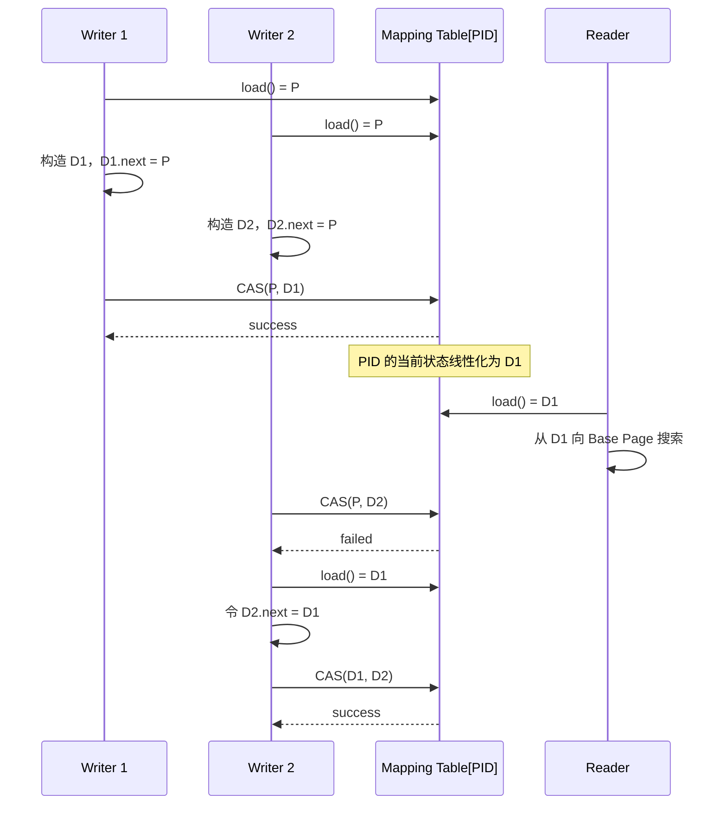
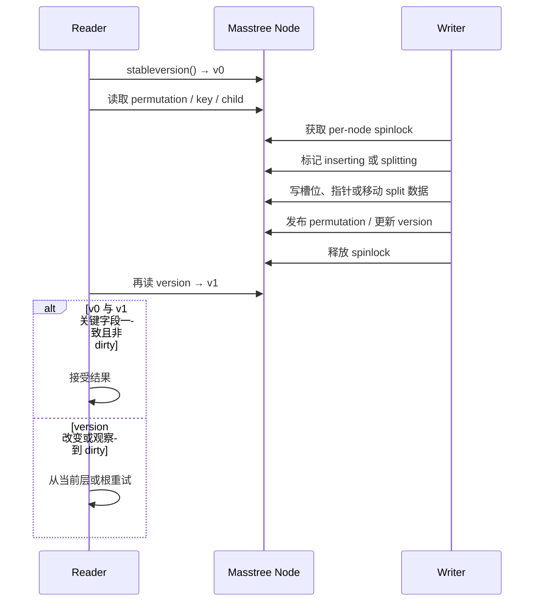
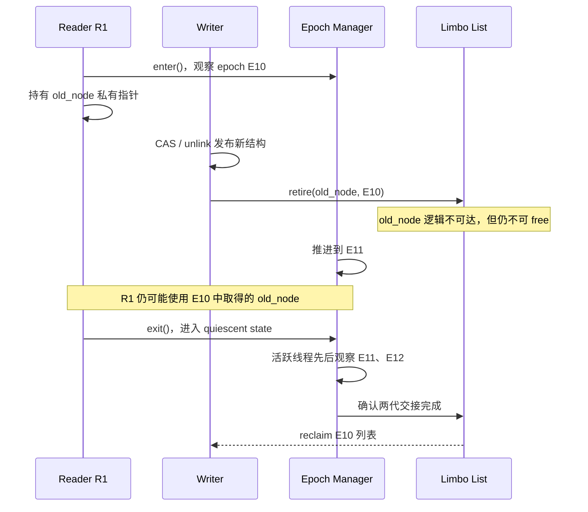

---
tags:
  - 高性能存储
  - 存储引擎
  - 并发
status: 已完成
---

# 高并发无锁内存索引树：Masstree 与 Bw-Tree 原理

> [[6.8 B+ tree vs LSM]] 已经把传统 B+ tree 的并发本质概括为“共享可变结构 + 细粒度 latch”。当索引与数据常驻 DRAM 后，磁盘 I/O 不再掩盖同步成本：一次点查可能只剩几次 Cache Miss，此时根节点附近的锁字、版本字、CAS 目标和缓存行所有权转移，反而会决定吞吐与 p99。本篇比较两条不同路线：**Bw-Tree 用 Mapping Table + Delta Chain + CAS 把原地修改变成版本发布；Masstree 用 8 字节切片的 Trie-of-B+Trees、缓存友好布局、乐观读与局部写锁减少共享写入；两者最终都要用 Epoch-Based Reclamation（EBR）延迟回收旧节点。**

前置知识是 [[0.1 CPU Cache Cache Line 与内存屏障]]：需要先理解 Cache Line、原子读改写、release/acquire 与缓存行弹跳。本文也会与 [[5.12 无锁 thread-per-core 模型]] 对照：后者通过“无共享”消灭同步，而本文讨论的是**保留共享索引后，怎样把同步收敛到更小的发布点**。

> [!important] “无锁”一词先校准
> - **Bw-Tree**：原论文称其为 **latch-free B-tree**。普通页更新通过 CAS 发布；split/merge 被拆成多个原子步骤，观察到未完成结构修改的线程会帮助完成。它不是 wait-free，也不自动提供事务隔离。
> - **Masstree**：lookup 不获取读锁、不写共享同步字段；但 insert、remove、split 等写路径使用 **per-node spinlock**。因此它是“无锁读 + 局部锁写”的并发树，不能把整棵 Masstree 严格称为全操作 lock-free。
> - 本文标题中的“无锁内存索引树”沿用工程语境，指面向高并发、尽量消除全局锁和读路径锁的索引家族；涉及形式化进展保证时，以 latch-free、lock-free、wait-free 的原始表述为准。

---

## 1. 为什么全内存之后，锁会从配角变成主角

基于磁盘的 B+ tree 一次未命中可能等待微秒到毫秒，几十纳秒的 latch 操作通常不是主账。全内存索引把介质等待拿走后，一次操作的主要成本变成：

1. **指针追逐与 Cache Miss**：树节点若散落在堆上，下一层地址只有读完当前节点后才知道，硬件预取器很难完全隐藏延迟；
2. **共享缓存行写入**：读写锁即使允许多个读者并发，读者通常仍要更新锁的计数或状态，导致锁所在 Cache Line 在核心间转移；
3. **热点路径串行化**：根、上层节点、全局版本、内存分配器和统一回收队列会成为所有线程的交汇点；
4. **失败重试**：CAS 或乐观版本校验把“等待锁”改成“检测冲突后重做”，冲突少时很便宜，热点下仍会放大 CPU 与尾延迟；
5. **安全回收**：节点从树上断开，不代表没有线程握着旧指针。立即 `free` 会把逻辑正确的并发算法变成 use-after-free。

这说明“去锁”不是把 `std::mutex` 换成 `std::atomic` 就结束了。完整设计至少要同时回答三件事：

| 问题 | 必须回答什么 |
| --- | --- |
| 发布正确性 | 新状态在哪个原子点对其他线程可见？失败者怎样重试？ |
| 结构正确性 | split/merge 跨多个节点，怎样保证任一中间状态仍可搜索？ |
| 生命周期正确性 | 旧节点何时不再可能被任何并发读者访问？ |

![[图片/SVG/8_6_6_20_1.svg|1340]]

图中最重要的对照不是“哪个完全不用锁”，而是**共享写发生在哪里**：Bw-Tree 把共享写压缩到 Mapping Table 的一个槽位；Masstree 让读者只读节点与版本，写者只锁正在修改的少量节点。两者都把物理释放推迟到 EBR 确认旧读者离场之后。

---

## 2. Bw-Tree：逻辑页不动，物理状态持续换头

### 2.1 Mapping Table：先把“树指针”与“内存地址”拆开

传统 B+ tree 的父节点直接保存子节点地址。子节点一旦搬家，父节点也要修改；并发 split 时，地址传播会把局部变化扩散到上层。

Bw-Tree 给每个逻辑页分配一个 **PID（Page ID）**，树内的下降指针与 B-link side link 都保存 PID。真正的物理位置由 **Mapping Table** 翻译：

```text
PID 42  ── Mapping Table[42] ──> 当前页状态的 head
```

原论文的 Mapping Table 槽位既可以保存内存指针，也可以保存闪存偏移；因此 Bw-Tree 最初并非只面向纯内存数据库，它同时服务于内存中的 latch-free 页和底层 log-structured flash store。本文聚焦前者，但不能把后者从设计动机里删掉。

这层间接寻址带来两个关键性质：

- **物理状态可搬迁**：只改 `Mapping Table[pid]`，父节点仍指向同一个 PID；
- **页可变成“版本链”**：当前状态不必是一块固定大小、原地可写的页，而可以是“若干 Delta + 一个 Base Page”。

代价也很直接：每次访问多一次 Mapping Table 翻译；如果表项或目标页不在 Cache 中，就可能多一次依赖型 Cache Miss。

### 2.2 Delta Update：把原地写改成 prepend + CAS

一次插入、修改或删除不直接覆盖 Base Page，而是：

1. 读取 `Mapping Table[pid]` 得到旧 head `P`；
2. 在线程私有内存中构造 Delta `D`，令 `D.next = P`；
3. 对表项执行 `CAS(P → D)`；
4. CAS 成功，`D` 成为该逻辑页的新 head；CAS 失败，说明别的线程先发布了新状态，当前线程重新读取 head、重建链接并重试。

对**单页普通更新**而言，成功 CAS 就是清晰的线性化点：CAS 前其他线程只能从旧 head 开始读，CAS 后新读者会从 Delta 开始读。失败线程没有持锁等待，而是承认自己基于旧快照构造的候选状态已经过期。



这张时序图揭示了“无等待”背后的真实代价：同一个 PID 越热，越多线程会基于相同旧 head 做重复工作；CAS 失败率与缓存行所有权转移会一起上升。

### 2.3 读路径：先解释 Delta，再回到 Base Page

一个逻辑页的物理形状是：

```text
newest Delta → older Delta → ... → Base Page
```

叶子页查找从最新 Delta 向旧状态扫描：

- 首次遇到目标 key 的 insert/modify Delta，返回其中的新值；
- 首次遇到目标 key 的 delete Delta，判定不存在；
- Delta Chain 中没有该 key，再对有序 Base Page 做二分搜索。

“最新匹配优先”让 Delta Chain 等价于对 Base Page 的增量覆盖，但也引入**读放大**：链长为 `d` 时，最坏要解释 `O(d)` 个 Delta 才能落到底页。Bw-Tree 因此不能只会 prepend，还必须主动偿还 Delta 欠账。

### 2.4 Consolidation：把局部历史折叠成新基页

当访问线程发现 Delta Chain 超过阈值，会构造一个新的有序 Base Page：

1. 合并旧 Base Page 与全部 Delta；
2. 只保留每个 key 的最新状态，丢弃已删除记录；
3. 用 CAS 把 Mapping Table 表项从旧链 head 替换为新 Base Page；
4. CAS 成功后，把整条旧链放入待回收集合；CAS 失败则丢弃自己构造的候选页，不阻塞胜者。

这与 [[6.7 Compaction 策略]] 中“前台便宜写、后台归并还债”的形状相似，但粒度不同：LSM compaction 在 SSTable/run 之间归并，Bw-Tree consolidation 在**单个逻辑页的内存状态**内折叠 Delta。两者都必须观测“欠账长度”，否则前台读延迟会逐渐恶化。

### 2.5 Split / Merge：一个 CAS 不够，就让每一步都保持可搜索

页分裂至少涉及旧页 `P`、新右兄弟 `Q` 和父页，无法用一个 CAS 同时提交。Bw-Tree 采用 B-link 思路，把 split 拆成两个半步：

1. **Child half-split**：先创建 `Q`，再给 `P` prepend 一个 split Delta，记录 separator key 与指向 `Q` 的 side link；
2. 此刻父页还不知道 `Q`，但搜索落到 `P` 后可以根据 separator 沿 side link 找到 `Q`，树仍然有效；
3. **Parent update**：随后给父页 prepend index-term Delta，让后续搜索可以直接下降到 `Q`。

任何线程若遇到尚未完成的结构修改，在继续自己的 update/SMO 之前先帮助补齐剩余步骤。这样，一个执行分裂的线程即使暂停，也不会让其他线程永远等它释放 latch；共享结构里留下的 Delta 足以让别的线程理解并完成操作。

> [!note] 线性化边界
> 普通单页更新可以把成功 CAS 视为线性化点；跨页 split/merge 由多个原子步骤构成，不能粗暴地说“某一个 CAS 就原子完成了整个 SMO”。正确表述是：每一步都留下可搜索的树形状态，帮助协议再把未完成 SMO 推到完成态。

> [!warning] Bw-Tree 不替事务层做决定
> 原论文明确把冲突记录更新的并发控制放在 Bw-Tree 之外，可以由数据库锁管理器、独立事务组件或原子记录语义提供。**索引结构 latch-free ≠ 事务隔离、唯一约束、写写冲突处理都自动成立。**

### 2.6 Bw-Tree 的性能账单

| 成本 | 形成原因 | 需要观测的指标 |
| --- | --- | --- |
| Mapping Table 间接访问 | PID 必须翻译成当前物理状态 | Mapping Table LLC miss、TLB miss |
| Delta 读放大 | 查找要从新到旧解释链 | Delta chain 长度 p50/p99、每查找扫描 Delta 数 |
| CAS 热点 | 同一 PID 的表项是所有写者的发布点 | CAS failure ratio、重试次数、cache-to-cache transfer |
| Consolidation 带宽 | 重建 Base Page 会读旧链、写新页 | consolidation/s、失败候选页数、分配带宽 |
| 回收滞后 | 旧链要等 epoch 安全后才能释放 | retired bytes、oldest active epoch |
| SMO 帮助栈 | 热区连续 split/merge 时会递归帮助 | help depth、split/merge latency p99 |

Bw-Tree 消除了 latch 排队，但没有消除共享：**Mapping Table slot 就是新的缓存行竞争点**。低冲突时 CAS 发布很短；Zipf 热点或单调插入集中打到同一页时，重试依然可能成为主瓶颈。

---

## 3. Masstree：把变长字符串拆成缓存友好的固定切片

### 3.1 Trie-of-B+Trees：每一层只看 8 字节

Masstree 同时借用了 Trie 与 B+ tree：

- key 按 8 字节切片：`bytes[0..7]`、`bytes[8..15]`、`bytes[16..23]`……；
- 第 0 层 B+ tree 以第一个 8-byte slice 排序；
- Border node 的槽位既可以保存 value，也可以保存指向下一层 B+ tree 的 `next_layer`；
- 只有多个 key 共享前缀、继续比较后续切片时，才按需创建更深层。

因此，概念上它是一个 fanout 为 `2^64` 的 Trie，而每个 Trie 节点又由中等扇出的 B+ tree 实现。这样做解决了两个互相拉扯的问题：

- 变长二进制 key 与长公共前缀需要 Trie 避免反复比较同一前缀；
- 每层直接展开 `2^64` 个槽位显然不现实，B+ tree 只为实际出现的 slice 分配节点，并保留有序范围扫描能力。

8 字节切片会按需要做字节序转换，使本机 64-bit 整数比较与字典序一致。原论文实现的 interior/border node 宽度为 15，并在当时测试机器上选择约 256 B、四条 64 B Cache Line 的节点；这是**论文时代的实现参数**，可借鉴“让一次节点访问装下更多有效比较信息”的原则，但不应在现代 CPU 上照抄为常数。

### 3.2 Cache craftiness：减少读路径上的共享写和无效搬运

Masstree 的缓存敏感设计包含三层：

1. **固定 8-byte slice 比较**：Interior node 不必反复追逐完整字符串；长 suffix 只在真正需要确认 key 时访问；
2. **中等扇出 + prefetch**：查找当前节点时预取即将访问的 child，尝试覆盖下一次依赖型 Cache Miss；
3. **读者不写共享状态**：lookup 不获取读锁，也不更新全局读者计数，从而避免“纯读也让锁 Cache Line 弹跳”。

最有代表性的技巧是 Border node 的 **Permutation**：节点有固定的 key/value 槽位，另用一个 64-bit permutation word 表示“哪些槽位有效，以及它们的逻辑有序顺序”。普通插入可以：

1. 持有该节点的局部写锁；
2. 选择一个未使用槽位，先写入 keyslice、suffix/value；
3. 用必要的编译器/机器屏障保证内容先于索引发布；
4. 最后以一次对齐写发布新的 permutation。

读者要么看到旧 permutation（新槽位尚不可见），要么看到新 permutation（新 key 已在正确逻辑位置），不需要观察“数组元素搬到一半”的中间态。这不是把整个节点复制一遍，而是把**可见性开关压缩成一个小的原子发布字段**。

### 3.3 乐观读：版本前后相同，才相信刚才看到的节点

Masstree 每个节点有 version 字，包含 lock/dirty 标记以及 insert/split 等计数。典型 lookup 的逻辑是：

1. 取得稳定版本 `v0`；若节点正在 inserting/splitting，则等待其回到稳定态；
2. 读取 keys、permutation、child 或 value；
3. 在跨节点下降时做 hand-over-hand version validation；
4. 再读版本 `v1`；若版本变脏或关键计数变化，说明刚才可能跨越了 split/remove 的中间状态，从当前层或根重新查找。



图中 Reader 没有被加入任何读锁队列，但也不保证一次通过：写者修改得越频繁，版本校验失败越多。乐观并发的收益来自“冲突稀少”，不是来自“冲突不存在”。

### 3.4 写路径仍然有锁，而且这是有意的取舍

Masstree writer 使用 per-node spinlock，锁位编码在 version 中。普通 value update、Border insert 往往只持有一个节点锁；split/delete 可能同时持有当前节点、新兄弟和父节点，并通过固定的向上加锁顺序避免死锁。

原论文还比较过基于 CAS 的 writer–writer 协议，最终选择局部锁，理由不是作者“不懂无锁”，而是：

- CAS 和 spinlock 都要取得共享 Cache Line 的独占所有权；
- Masstree 的锁范围局部、持有时间短；
- 更复杂的全无锁写协议不一定能抵消额外状态与重试成本。

因此，Masstree 的关键贡献不是“把锁全删掉”，而是：**读路径零共享写；写锁只落在被修改的少量节点；节点布局尽量让一次 Cache Line 搬运带回真正有用的 key/child 信息。**

### 3.5 Masstree 的边界与故障指纹

| 现象 | 可能原因 |
| --- | --- |
| 读 p99 随写比例升高 | version validation 重试增加，split/remove 使读者回根 |
| 写线程 CPU 高但吞吐不涨 | 热 Border node 的 spinlock 与 Cache Line 所有权竞争 |
| 长公共前缀内存占用上升 | 同一 key 路径创建更多 Trie layer 与低利用率小树 |
| 范围扫描尾延迟高 | 需要遍历 Border node 链和多层树；原始 `getrange` 也不对并发更新提供整体原子快照 |
| 换 CPU 后原节点尺寸优势消失 | Cache 容量、预取器、NUMA 和内存带宽与论文机器不同 |

Masstree 支持有序 key 与范围查询，但它不是事务快照本身。需要稳定 snapshot/sequence 语义时，还要由 [[6.15 Snapshot 与 Sequence Number]] 所在的版本管理层决定“哪些记录对本次读可见”。

---

## 4. EBR：从索引断开，只完成了“逻辑删除”的一半

### 4.1 为什么成功 CAS 后仍不能 `free(old)`

考虑 Bw-Tree：

1. Reader 已从 Mapping Table 读到旧 Delta Chain 的 head；
2. Writer CAS 成功，把表项换成新 Base Page；
3. 新 Reader 不会再取得旧 head，但第 1 步的 Reader 仍在沿旧链访问。

Masstree 的 remove/split 同样会留下旧 value、旧节点或已删除节点给并发 Reader。此时立即释放会出现：

- **use-after-free**：Reader 解引用已归还分配器的内存；
- **allocator reuse ABA**：旧地址很快分配给新对象，CAS 只比较指针值时可能误以为状态“又回到 A”；
- **类型重用破坏**：同一地址被别的类型占用，Reader 按旧布局解释新对象。

所以并发结构必须把两个事件分开：

```text
逻辑不可达（unlink / publish new state）
            ≠
物理可回收（reclaim / reuse memory）
```

### 4.2 EBR 的四步协议

EBR 假设一次索引操作会被明确包在短小的 read-side critical section 中：

1. **enter / pin**：线程宣布自己活跃，并记录当前 global epoch；
2. **traverse**：线程可以持有从共享结构读出的私有指针；
3. **retire**：Writer 确认对象已从共享结构断开、不会再产生新共享引用后，把它加入当前 epoch 的 limbo/retire list，而不是直接释放；
4. **reclaim**：当所有可能在 retire 前取得旧指针的线程都已退出临界区或跨过 quiescent state，旧 retire list 才能归还分配器。

Fraser 的经典实现使用三个循环复用的 limbo list：线程进入操作时观察当前 epoch；当所有活跃线程都观察到新 epoch 后，可以回收“两代之前”的列表。之所以不是只等一代，是因为 epoch 切换不是同时发生的：已经观察到 `E` 的线程，仍可能保留从 `E-1` 操作中取得的私有引用。



这张图揭示了 EBR 的核心证明义务：不是“过了某个固定毫秒数”就安全，而是**所有可能持有旧私有引用的线程都已证明离场**。具体库如何推进 epoch、何时扫描线程记录可以不同，但这个不变量不能变。

### 4.3 EBR 为什么快，又为什么可能把内存钉死

EBR 的优势是批量化：Reader 不必为每个指针增减引用计数，也不必在每次解引用前发布 hazard pointer；Writer 把很多退休对象一起回收，摊薄扫描与 `free` 成本。

它的弱点也来自批量化：**一个线程若在临界区内阻塞、被长期抢占或遗漏 `exit()`，就会阻止旧 epoch 回收。**其他索引操作可能仍能继续执行，但 retired objects 不断累积，最终会触达内存上限。Fraser 因此明确指出，他的 EBR 回收器本身不是严格 lock-free。

工程约束应写进接口与监控：

- 用 RAII guard 保证正常返回、异常和取消路径都执行 unpin；
- 临界区内不做网络 I/O、磁盘 I/O、条件变量等待或不可控回调；
- 每线程 epoch record 单独对齐，避免所有核心反复写同一 Cache Line；
- retire list 分批释放，防止一次大批 `free` 制造 p99 毛刺；
- 暴露 `retired_objects`、`retired_bytes`、`oldest_active_epoch`、`max_pin_duration`；
- 线程退出、线程池缩容与 `fork()` 场景必须先从 epoch domain 注销，不能留下永久 active 的记录。

这里可以与 [[9.5 p99 毛刺定位]] 直接联动：若吞吐不变但延迟周期性尖刺，除了看锁/CAS，也要检查 epoch 推进后是否一次回收了过大的 retire batch。

### 4.4 EBR 与 ABA 的关系

EBR 通过延迟地址复用，能阻止最常见的“旧节点刚删除，地址立刻分给新节点”式 pointer ABA：只要线程正确 pin，旧地址在它退出前不能被复用。

但 EBR 不是万能版本号：如果协议本身允许同一个逻辑值真正从 `A → B → A`，或者对象可在 epoch domain 之外被复用，单纯比较指针仍可能误判。需要时仍要使用 tagged pointer、generation/version 或更强的状态验证。正确结论是：**EBR 解决生命周期引发的 ABA 前提，不替算法证明所有逻辑 ABA。**

---

## 5. 两条路线放在同一张账本里

| 维度 | Bw-Tree | Masstree |
| --- | --- | --- |
| 核心抽象 | PID + Mapping Table，逻辑页与物理状态解耦 | 8-byte slice Trie，每个 Trie 节点是一棵 B+ tree |
| key 处理 | 常规 B-tree separator/key；重点不在字符串前缀 | 原生面向变长二进制 key 与公共前缀 |
| 普通读 | Mapping Table → 扫 Delta → Base Page 二分 | 读 version → 查节点/下一层 → version validation |
| 普通写发布 | 构造 Delta，CAS 替换 Mapping Table slot | 持局部写锁，先写槽位，最后发布 value/permutation/version |
| 是否原地改节点 | 不改旧页；追加 Delta 或发布新 Base Page | 会修改节点槽位与元数据，但用局部锁和发布顺序保护 |
| split/merge | B-link side link，分步 CAS，遇到半成品先帮助完成 | 多节点短时加锁 + dirty/version，Reader 检测后重试 |
| 读路径共享写 | 无 latch；主要是读取表项和链 | lookup 不写共享同步字段 |
| 热点退化 | 同一 Mapping Table slot 的 CAS 失败、Delta 变长 | 热节点 spinlock、version retry、回根 |
| 缓存策略 | 避免 update-in-place，旧状态保留有利于 Reader | 固定切片、中等扇出、prefetch、Permutation 减少搬移 |
| 内存回收 | 旧 Delta Chain/Base Page/PID 延迟回收 | 旧 value、删除节点、空 layer 延迟回收 |
| 形式化边界 | latch-free；非 wait-free；事务冲突在外部 | 无锁读 + 局部锁写；整棵树不是 lock-free |
| 最适合的思考场景 | 高并发更新、页频繁重定位、接受链与 consolidation 复杂度 | 变长有序 key、长公共前缀、范围扫描与缓存局部性重要 |

一句话记忆：

> **Bw-Tree 把“修改节点”改写成“发布节点的新解释”；Masstree 把“比较完整字符串并锁住共享树”改写成“逐层比较固定切片，Reader 只验证，Writer 只锁局部”。**

---

## 6. 选型：先问能否不共享，再问选哪种共享树

真正的第一道题不是 Bw-Tree 还是 Masstree，而是：**索引能否按 key range/hash 切分到固定核心？**若业务允许强分片，[[5.12 无锁 thread-per-core 模型]] 的 shared-nothing/消息传递常常更简单：它连 CAS 热点与 EBR 都能大幅减少。代价是热点分片、跨分片事务和负载迁移要由系统层承担。

必须保留多核共享有序索引时，再按负载选择设计方向：

| 负载或约束 | 更值得优先验证的路线 | 原因 |
| --- | --- | --- |
| 写多、多个线程更新不同逻辑页 | Bw-Tree 风格 | 不原地改页，CAS 发布范围小，页间并行度高 |
| 物理页需要频繁搬迁或冷热换入换出 | Bw-Tree 风格 | PID 屏蔽物理位置变化 |
| 变长字符串 key、公共前缀明显 | Masstree 风格 | 8-byte layer 避免重复比较前缀 |
| 点查 + 有序范围扫描都重要 | Masstree 风格 | Trie 层次与 B+ tree/Border 链同时保留排序 |
| 单个 key/page 极热 | 两者都先做分片/热点隔离 | Bw-Tree 会争 CAS slot；Masstree 会争局部写锁 |
| 线程可能在读临界区长期阻塞 | 谨慎使用经典 EBR | 停顿线程会钉住回收，应评估 hazard pointer、引用方案或架构隔离 |

不要把论文中的历史吞吐数字直接当选型结论。CPU Cache、NUMA、内存分配器、键长和写分布都会改变胜负；现代机器上应重新做稳态 Benchmark。

---

## 7. Benchmark：吞吐之外，必须把“重试与退休内存”量出来

### 7.1 负载矩阵

| 变量 | 建议档位 | 想回答的问题 |
| --- | --- | --- |
| 线程数 | 1 / 2 / 4 / 8 / 16 / 核数 | 扩展性在哪个核心数拐弯？ |
| 读写比 | 100:0 / 95:5 / 50:50 / 0:100 | 乐观读与写发布各自何时占主导？ |
| key 分布 | Uniform / Zipf 0.8 / Zipf 0.99 | 热点会把 CAS 或局部锁放大到什么程度？ |
| key 长度 | 8 / 16 / 32 / 64 B | Masstree 多层成本与前缀收益如何变化？ |
| 公共前缀 | 0 / 8 / 24 / 48 B | Trie-of-B+Trees 是否减少重复比较？ |
| 操作 | point get / put / delete / range scan | Delta、version retry、Border 链分别付多少账？ |
| 生命周期 | 只插入 / 稳态更新删除 | EBR 与 consolidation 是否进入稳态？ |

### 7.2 必收指标

**共同指标**：ops/s、p50/p95/p99/p999、CPU cycles/op、instructions/op、LLC miss/op、NUMA remote access、分配字节/op。

**Bw-Tree 指标**：CAS failure ratio、每操作重试次数、Delta Chain 长度分布、consolidation 触发/成功/失败次数、SMO help depth、Mapping Table cache miss、retired bytes。

**Masstree 指标**：version retry ratio、从根重启次数、writer spin cycles、split/remove 次数、各 layer 节点数与填充率、suffix 外置访问次数、retired bytes。

**EBR 指标**：global epoch 推进速率、oldest active epoch、最长 pin 时间、每批 reclaim 对象数、未回收对象与字节数。

Linux 上可以用以下命令看通用硬件事件；具体 event 名称受 CPU 与内核版本影响，应先用 `perf list` 核对：

```bash
perf stat \
  -e cycles,instructions,cache-references,cache-misses \
  -- ./index_bench --threads 16 --read-ratio 0.95 --zipf 0.99

# 支持 perf c2c 的平台上，定位发生 cache-to-cache 传输的热点行
perf c2c record -- ./index_bench --threads 16 --read-ratio 0.50 --zipf 0.99
perf c2c report
```

看结果时不要只问“谁的平均吞吐高”，而要对齐因果链：

```text
热点 key/page
→ CAS failure 或 spin/version retry 上升
→ cycles/op 与 cache-to-cache transfer 上升
→ p99 先恶化
→ 吞吐最后才见顶
```

---

## 8. 常见误区

> [!warning] 容易写错或讲错的地方
> 1. **把 Masstree 说成全操作 lock-free**：原设计的 Writer 明确使用 per-node spinlock；准确说法是 lock-free/lockless lookup + locally locked update。
> 2. **把 CAS 当成没有竞争的魔法**：CAS 是原子读改写，需要争夺 Cache Line 独占权；失败还会重做候选状态。
> 3. **CAS 成功后立即释放旧节点**：发布与回收是两套协议；缺 EBR/SMR 会出现 use-after-free 与 allocator-reuse ABA。
> 4. **EBR 临界区里阻塞**：一个睡眠线程就可能长期钉住所有退休对象；索引还在跑，不代表系统不会因内存增长失效。
> 5. **让 Delta Chain 无界增长**：Bw-Tree 的写快是把工作延期，不执行 consolidation 会把点查变成线性解释历史。
> 6. **只测 Uniform**：Uniform 会掩盖真实服务中的热点；Zipf 下 CAS slot 和局部写锁才会暴露极限。
> 7. **照抄论文节点尺寸**：论文的四 Cache Line/15-way 选择是特定硬件与编译器下的结果，现代平台必须重测。
> 8. **把索引并发等同于事务正确性**：结构不损坏只是底线；snapshot、唯一约束、写写冲突和恢复仍属于更高层协议。
> 9. **只报 ops/s 不报 p99 与 retired bytes**：重试风暴和 EBR 积压通常先伤尾延迟与内存，再伤平均吞吐。

---

## 9. 关键结论

| 结论 | 性质 |
| --- | --- |
| 全内存索引把瓶颈从介质 I/O 推到 Cache Miss、缓存一致性、原子发布与安全回收 | 事实 |
| Bw-Tree 的核心是 PID/Mapping Table 间接层：Delta 或新 Base Page 通过 CAS 成为逻辑页的新物理状态 | 实现 |
| Bw-Tree 读路径必须解释 Delta Chain，consolidation 是不可缺少的读放大控制环 | 实现 |
| Bw-Tree split 依靠 B-link side link 保持 half-split 可搜索，并由遇到半成品的线程帮助完成 | 实现 |
| Masstree 是按 8-byte slice 分层的 Trie-of-B+Trees，针对变长 key、公共前缀和 Cache Line 局部性设计 | 实现 |
| Masstree Reader 用 version validation 乐观读取；Writer 使用 per-node spinlock，不能把整棵树称为严格 lock-free | 事实 |
| Permutation 把 Border insert 的可见性压缩到小型原子发布字段，避免向 Reader 暴露槽位重排中间态 | 实现 |
| EBR 把 unlink 与 reclaim 分离；只有所有旧 Reader 离场后才允许复用地址 | 事实 |
| 经典 EBR 会被停顿线程钉住，因此“索引 latch-free”不代表“回收器也具备同等级进展保证” | 边界 |
| 热点下两条路线都会退化：Bw-Tree 争 CAS slot，Masstree 争局部写锁并增加 Reader retry | 实践结论 |
| 能按核分片时，shared-nothing 往往比复杂共享无锁树更值得先验证 | 工程取舍 |

---

## 参考资料

### 项目 Sources：基础模型

- Martin Kleppmann, *Designing Data-Intensive Applications*, 1st ed., O’Reilly, 2017, Chapter 3, pp. 79–83：B-tree 页、split、原地更新、latch 与 copy-on-write 变体。
- Andrew S. Tanenbaum, Herbert Bos, *Modern Operating Systems*, 4th ed., Pearson, 2015, §2.3.10, pp. 148–149：RCU 中“先断开、后等待 grace period、最后回收”的基础模型。

### 论文与官方实现：算法细节

- Yandong Mao, Eddie Kohler, Robert Morris, “Cache Craftiness for Fast Multicore Key-Value Storage,” *EuroSys 2012*, §§4–6. 论文：https://pdos.csail.mit.edu/papers/masstree:eurosys12.pdf
- Masstree 官方源码与算法说明：https://github.com/kohler/masstree-beta （访问日期：2026-08-30）
- Justin J. Levandoski, David B. Lomet, Sudipta Sengupta, “The Bw-Tree: A B-tree for New Hardware Platforms,” *ICDE 2013*, §§II–V. 论文：https://www.microsoft.com/en-us/research/wp-content/uploads/2016/02/bw-tree-icde2013-final.pdf
- Keir Fraser, *Practical lock-freedom*, University of Cambridge Computer Laboratory Technical Report UCAM-CL-TR-579, 2004, §5.2.3, pp. 79–80. 报告：https://www.cl.cam.ac.uk/techreports/UCAM-CL-TR-579.pdf
