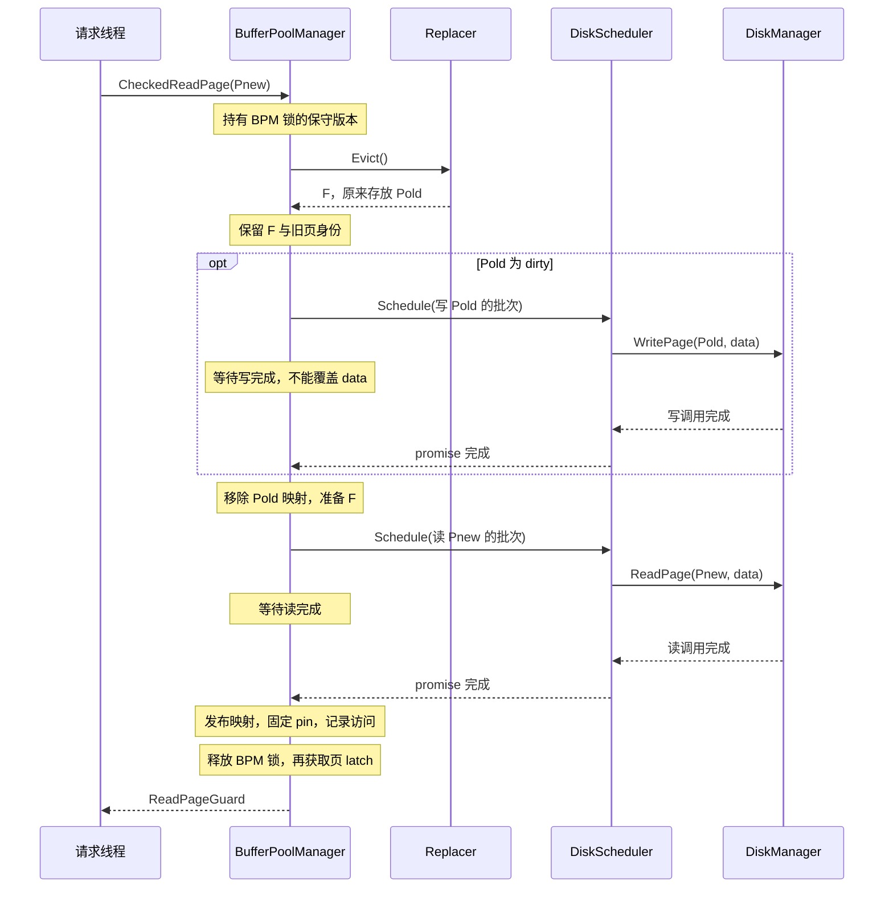
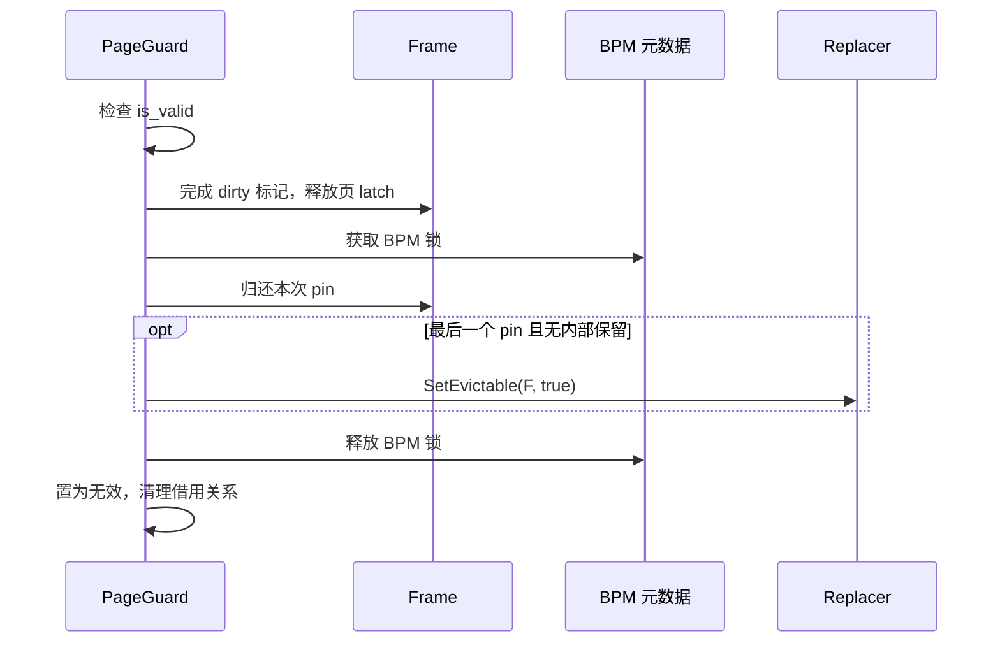
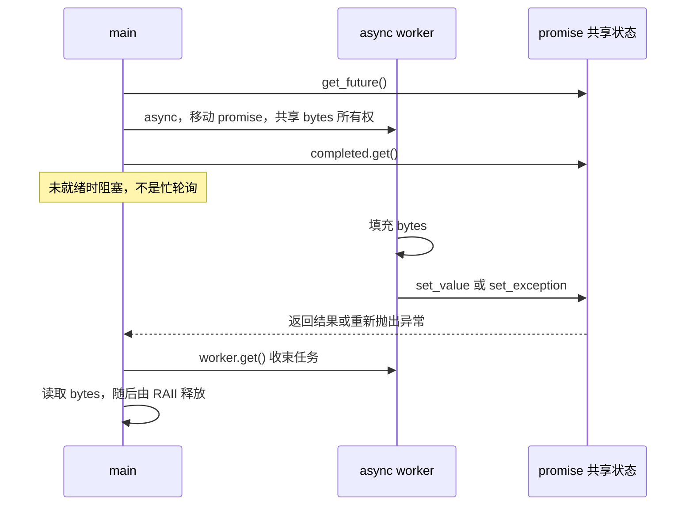

---
tags:
  - 高性能存储
  - 存储引擎
  - BusTub
  - 缓冲池
---
# Buffer Pool Manager：Page、Frame、Pin、Dirty 与 Eviction

> [!abstract] 本篇的实验目标
> 面向 **CMU 15-445/645 BusTub Project 1**：把“页在磁盘与内存之间移动”落实为可检查的不变量、接口契约、引用生命周期与并发时序。读完后，应能解释一次取页从查表、固定 frame、等待 I/O，到返回 guard、释放 pin 的全过程，而不只是说“缓存命中就返回，未命中就淘汰”。

已有 [[8.高性能存储/6. 存储引擎/6.8 B+ tree vs LSM|B+ tree vs LSM]] 解释了索引结构与写路径的取舍；本篇向下进入它依赖的**页驻留管理**。[[8.高性能存储/6. 存储引擎/6.13 Bloom Filter 与 Block Cache|Bloom Filter 与 Block Cache]] 讨论的不可变 SST 数据块缓存，也不能直接替代这里对**可修改页、脏页回写和 frame 复用**的管理。

## 1. 先固定实验版本与范围

本文以 **Fall 2026 Project 1** 为接口基线，交叉核对公开 BusTub 源码快照：

`c0a5431985287e258a6f25f53d822f0d0d2e63e8`，核对日期 **2026-09-06**。

这是本文的资料基线，不表示学习者自己的工作树已经切换到该提交。项目说明、头文件、测试应来自匹配版本，不要把不同学期的教程拼成同一份实现。[1][2]

| 项目 | 本文基线 | 实现时的含义 |
| --- | --- | --- |
| 数据页大小 | `BUSTUB_PAGE_SIZE = 8192`，即 8 KiB | 使用常量；不能照抄旧例子的 4096 |
| P1 替换器 | `ArcReplacer` | LRU-K 是配套笔记中的跨版本对照，不是本学期额外必做任务 |
| 取页接口 | `CheckedReadPage` / `CheckedWritePage` | 返回可失败的 RAII guard，不是裸 `Page *` |
| 新建页 | `NewPage() -> page_id_t` | 分配页号不等于已经获得一个 pinned frame |
| I/O 提交 | `Schedule(std::vector<DiskRequest> &requests)` | 每个请求带自己的完成通知；不是只接收一个请求的旧接口 |
| 示例语言 | C++17 | 使用 RAII、移动语义、标准容器与明确同步 |
| WAL | P1 明确要求忽略 `log_manager_` | 不把 WAL 恢复误写成本篇实验的已实现功能 |

源码 `FrameHeader` 的说明中仍有“4 KB”的历史文字，但 `config.h` 的常量和 Fall 2026 项目正文都是 8192。**遇到这种冲突，记录版本并核对实际常量，不能仅凭注释下结论。**

本篇没有提供整套可直接提交的 P1 解答。CMU 项目页面要求不要公开发布项目实现；公开笔记保留原理、接口、独立小例子与测试思路，个人实验代码应单独管理。[1]

## 2. 建立模型：Page 是身份，Frame 是可以复用的位置

### 2.1 六个对象各自管什么

| 对象 | 管理的信息 | 不负责什么 |
| --- | --- | --- |
| Disk Page | 用 `page_id_t` 标识的逻辑页及其持久化内容 | 不等于当前内存地址 |
| Buffer Pool Frame | 可容纳一个页的内存槽位，用 `frame_id_t` 标识 | 不永久属于某个页 |
| Page Table | 当前驻留页的 `page_id -> frame_id` 映射 | 不是操作系统页表，也不是磁盘页目录 |
| Replacer | 访问历史、可淘汰标记与候选选择 | 不保存页内容，不执行写盘 |
| Disk Scheduler | 请求排队、交给后台 worker、报告完成 | 不自动延长借用缓冲区的有效期 |
| Disk Manager | 具体后端的页读写与空间管理 | 不决定哪一个页应被淘汰 |

**Page identity 与 frame identity 必须分开。** 例如页 P42 当前在 F1，下次被重新读入时可能在 F0；F1 后来又可以存放 P99。B+Tree 中保存的子页标识不能因此变成 F1，更不能保存一次取页得到的进程内指针作为磁盘引用。[2][8][9]

数据库页大小、OS 虚拟内存页大小、文件系统块大小和 NAND Page 大小属于不同层，不要求相同。“8 KiB 页”不能推出“每次一定是一条设备命令”。

### 2.2 把映射、数据与淘汰资格分开看

![[图片/SVG/8_6_6_21_1.svg|900]]

图中 P42 映射到 F1；F1 的 `pin_count=0` 只说明当前没有用户 pin，`dirty=true` 表示覆盖它之前仍有回写义务。F0 正被使用，不能作为候选；F2 是 free frame，尚未绑定页。**空闲 frame 和驻留但可淘汰的 frame 不是同一个集合。**

图里的 frame 并排排列表示逻辑槽位，不表示该版本 BusTub 实际使用一整块连续分配。公开骨架为各个 frame 单独分配 `std::vector<char>`，以便 AddressSanitizer 更容易发现跨页越界。[2]

### 2.3 不要把 `FrameHeader` 当作磁盘页头

当前骨架的 `FrameHeader` 包含 `frame_id_`、`rwlatch_`、`pin_count_`、`is_dirty_` 和 `data_`。其中锁、计数和脏标记是**内存管理元数据**，不应直接序列化进数据库页。[2]

B+Tree 页头里的节点类型、条目数量等，则属于页内容层。两者名字都带“页”或“头”，职责却不同。骨架没有强制提供 `page_id_`、`generation` 或 `io_state` 字段；后文用到这些概念时，它们是解释或设计工具，不是假称已有成员。

当前文件后端还通过 `pages_` 等结构管理页号与文件偏移，存在空槽复用。不能把 `offset = page_id * PAGE_SIZE` 当作这个快照的实现事实；BPM 应依赖 `ReadPage` / `WritePage` 契约，而不是越层推算偏移。[3]

## 3. Pin、Latch、Dirty、Evictable：四个正交概念

### 3.1 Pin 保护的是“这块内存仍代表这一页”

一次成功取页取得一个 pin；释放使用权时归还。`pin_count > 0` 时，frame 不允许被重新绑定给另一页。[2]

pin 不等于线程编号，也不一定恰好等于不同线程的数量：同一线程可能持有多个独立使用权，等待页 latch 的取页请求也需要先保护绑定关系。若设计了后台 I/O pin，计数还必须覆盖这类内部使用权，或者用独立 reservation 达到同样效果。

**pin 不保护字节内容的并发读写。** 两个使用者可以同时 pin 同一页；是否可以同时读、同时写，由页 latch 决定。

### 3.2 Latch 保护临界区，事务锁保护另一层语义

`rwlatch_` 是页内容的读写 latch。读 guard 持共享访问权，写 guard 持独占访问权。BPM 的 `bpm_latch_` 则保护映射、空闲列表以及 pin 与替换器资格之间的协调。[2][4]

这里的 latch 是短期物理同步机制，不等于数据库的行锁、范围锁，也不提供 MVCC 的版本可见性。一个事务可能接触多个页；“这个页一次只能有一个写 guard”不等于“这个事务已经隔离且原子提交”。[9]

### 3.3 Dirty 与是否可以选择为 victim 无关

| 状态 | 能否被选为 victim | 复用前是否必须写回 |
| --- | --- | --- |
| 有 pin，clean | 否 | 不进入淘汰流程 |
| 有 pin，dirty | 否 | 不进入淘汰流程 |
| 无 pin，clean，且无内部保留 | 可以 | 通常不用 |
| 无 pin，dirty，且无内部保留 | 可以 | 必须先妥善保存修改 |
| 用户 pin 为零，但 I/O 正在使用 frame | 不可直接复用 | 由 I/O 生命周期决定 |

因此：`dirty == true` 不是“不可淘汰”，而是“淘汰有额外工作”；`pin_count == 0` 也不是“立即免费复用”。

### 3.4 Evictable 是替换器维护的资格投影

对正常驻留、没有内部 I/O reservation 的 frame，可以把预期关系理解为：

`evictable = (pin_count == 0)`。

但是 `pin_count_` 与 `SetEvictable()` 分处不同对象，即便前者是 atomic，也不会自动使后者同步。**必须把计数变化和资格更新纳入同一个协调协议。** 这一点比选择 LRU-K 还是 ARC 更先决定程序是否正确。[1][2]

## 4. 实现前先写出不变量

下面这些是从接口与资源生命周期推导的检查条件，不是骨架里已经实现的断言。

| 不变量 | 违反后的典型后果 |
| --- | --- |
| 一个驻留 `page_id` 至多对应一个有效 frame | 两份可修改副本互相覆盖 |
| 一个有效 frame 同时只代表一个逻辑页 | 读到另一页的内容 |
| 有 pin 或 I/O reservation 的 frame 不得被复用 | 悬空语义、I/O 覆写新页 |
| 读页完成前，不向用户暴露“已经就绪”的页内容 | 读到旧内容或半页内容 |
| 脏页内容保存完成前，不得覆盖其数据缓冲区 | 丢写或把新页写到旧页位置 |
| free frame 不在 page table 中，也不是 resident candidate | 重复分配同一槽位 |
| pin 归零与 evictable 更新保持一致 | 使用中的页被淘汰，或永远无可用 frame |
| guard 对使用权恰好释放一次 | pin 泄漏或计数下溢 |

还要分清四个动作：**Unpin 释放使用权；Flush 保存内容；Evict 解除内存驻留；Delete 删除逻辑页及后端空间。** Flush 不应顺便删除映射，Evict 也不应顺便删除磁盘页。

## 5. 三条取页路径，先做正确的保守版本

以下是便于推理的**工程设计方案**。关键目标是正确串联既有接口，并不是声称骨架已经采取某一种锁实现。

### 5.1 命中：先固定绑定关系，再等待页 latch

在 BPM 元数据锁内查到 `P -> F` 后，为本次使用权增加 pin，把 F 标为不可淘汰，并按接口约定记录访问。然后释放 BPM 锁，取得 F 的共享或独占页 latch，最后构造 guard。

为什么 pin 必须在释放 BPM 锁前获得？否则在“查到 F”与“锁住 F”之间，另一个线程可能淘汰 F 并把它改成 Q。即便此时仍能访问这块地址，也已经不是请求的 P。

为什么不能随意拿着 BPM 锁等待页 latch？页的当前持有者可能正在执行需要 BPM 锁的操作，从而形成环形等待。**保护映射的锁和保护数据的锁，不应被不加区分地全程嵌套。**

### 5.2 未命中，但有 free frame

保守版本可以在 BPM 锁内取出一个 free frame，保留它，读入目标页，等待完成，建立映射与访问记录，保证它不可淘汰，再释放 BPM 锁、获得页 latch 并交出 guard。

这样会让其他线程的元数据操作等待磁盘，但容易维持“相同页不会重复加载”和“未完成数据不会被看见”。前提是 worker 的完成路径不依赖当前持有的 BPM 锁。若改为等待期间解锁，就必须增加后文的 in-flight 协调，不能只删一行加锁代码。

### 5.3 未命中，且需要淘汰

没有 free frame 时，由替换器选择一个可淘汰 frame。`Evict()` 返回的是一个被策略移出候选集的 frame，不是“旧页已经写回成功”的证明。[2]

随后处理：保留 victim 身份与缓冲区；若旧页为 dirty，先提交旧页写出并等待；旧内容保存后，解除旧映射、清理旧状态；读入新页并等待；建立新映射、设置 pin 和替换器记录；最后才对用户可见。



图的核心是两个先后关系：**写旧页完成先于覆盖旧缓冲区；读新页完成先于返回新页 guard。** 实际提交可以使用批次，但不能通过并行读写同一缓冲区破坏这两个依赖。

### 5.4 所有 frame 都 pinned，不等于整个程序内存耗尽

这时即使系统仍有大量 RAM，固定大小的缓冲池也可能没有可用槽位。Checked 接口应走失败路径并返回 `std::nullopt`；不要为了“让请求成功”淘汰 pinned 页、无限扩容，或在基础实现里无条件等待。[2]

特别注意：**满池不妨碍命中取页。** 应先查 page table；请求的页已经驻留时，不需要额外 frame。

## 6. Page Guard：同时拥有 pin 与页访问权

### 6.1 为什么 `shared_ptr<FrameHeader>` 不够

`shared_ptr` 可以保持 `FrameHeader` 对象存活，却不能阻止 BPM 把这个仍然存活的对象改为存放另一页。保护对象生命周期与保护“页号到数据”的绑定，是不同问题。[2][4]

guard 将 pin、页 latch 和释放动作绑定到 RAII 生命周期。取出的裸数据指针只是**借用视图**：guard 失效、被移动走或执行 `Drop()` 后，不能继续拿旧指针读写。

### 6.2 移动不是复制使用权

| 操作 | 必须保持的语义 |
| --- | --- |
| 默认构造 | 无效 guard，不持有页使用权 |
| 移动构造 | 接管原使用权；源 guard 失效 |
| 移动赋值 | 先释放目标已有使用权，再接管；处理自移动 |
| `Drop()` | 有效时释放一次；无效时无操作 |
| 析构 | 调用 `Drop()`，不能再次释放已归还的 pin |

“允许移动”不代表可以把持有 `std::shared_mutex` 锁的 guard 跨线程随意交接；底层锁的获取与释放仍应遵守同一线程的所有权要求。移动语义细节可结合 *Effective Modern C++* Item 17 与 Item 23 理解，RAII 则对应资源生命周期而非单纯“用智能指针”。[6]

### 6.3 一种容易审查的释放顺序

一种可行的协议是：在仍受页内容保护时完成必要的 dirty 标记；释放页 latch；进入 BPM 元数据临界区归还 pin；在最后一个使用权归还且无内部保留时设置 `evictable=true`；将 guard 置为无效。



释放页 latch 与归还 pin 之间，frame 仍被 pin 保护，不会因此出现可淘汰窗口。若另一线程已经取得新 pin，最终计数不为零，就不应设置可淘汰。

这不是唯一正确顺序。其他方案必须证明不会形成锁环、不会提前开放复用、不会丢失最后一次 dirty 更新，而不能只凭单线程测试通过判断安全。

## 7. Dirty 与 Flush：最容易“测试能过，数据会丢”的部分

### 7.1 Dirty 要累积，不能被只读访问清掉

旧式接口常见 `UnpinPage(page_id, is_dirty)`。其概念应是“已有 dirty 与本次修改求或”，而不是每次都把 dirty 赋成参数值。当前 guard 接口没有要求照搬这个函数，但同样不能在读 guard 的释放路径里把别人的修改标为 clean。

当前公开骨架的 `GetDataMut()` 本身没有替你完成 dirty 设置。实现者需要明确“何时取得可修改访问、何时可能再次修改、何时释放”的标记协议，不能假定 TODO 之外的代码已包办正确性。[4]

### 7.2 写 guard 中途 Flush 后，仍然可以有后续修改

考虑：取得写 guard，修改页，执行 `Flush()`，然后继续通过先前取得的可写指针修改，最后释放 guard。如果 dirty 只在最初取得可写指针时标记一次，Flush 清零后，后续修改就可能丢失回写机会。

一个保守方向是在可写使用权结束时再次承担标脏义务，允许少量多余写回；更精细的方案需要能够追踪 Flush 之后的新修改。**具体标记时机必须与 `IsDirty()`、guard 测试和 API 契约一致。** 对公开的任意可写指针，不能凭一次函数调用精确知道其后的全部写操作。

### 7.3 安全 Flush 要同时保护字节与绑定

安全 Flush 不只是取一个 `char *` 然后写盘。至少应确保：页的身份和 frame 绑定稳定；写出的字节是受保护的一致内容；I/O 完成前其输入缓冲区不会改变；清除 dirty 不会掩盖更新的修改。

共享页 latch 可以阻止写 guard 修改数据，但**不会互斥两个读 guard 的 Flush**。若它们同时写一个普通 `bool is_dirty_`，仍可能发生数据竞争。dirty 的全部访问、并发 flush 的协调和 I/O 顺序，必须有统一保护方式；不要把“数据在读锁下”错误等同于“所有元数据可随意写”。

另外，已经持有页锁的 guard 不能不加设计地调用会再次锁同一页的 BPM 方法。`std::shared_mutex` 不是可重入锁；应沿不重复获取同一把锁的内部路径完成工作。

### 7.4 Unsafe 只说明不替你取得页 latch

`FlushPageUnsafe()` 的源码契约要求不获取页锁，不代表“所有锁都不要”“允许竞争也正确”。页内容稳定性需要由调用者或内部协议保证，page table 和 frame 生命周期仍需要同步。[2]

`FlushAllPages()` 也不是随手遍历哈希表再调用加同一把锁的 `FlushPage()`：可能递归锁死，也可能在解锁后使用已复用的 frame。可以设计内部已持锁版本，或者先收集稳定引用并固定使用权，明确之后的一致性范围。逐页 Flush 不自动产生跨页事务快照。

### 7.5 I/O 完成不等于断电后绝对持久

*The Linux Programming Interface* 第 13 章区分了用户态缓冲、内核缓冲和同步持久化接口。一次库级 flush、一次文件写调用完成，与满足断电恢复要求，不是可以互换的概念。[5]

当前文件后端的 `WritePage()` 使用流写入与 `flush()`；它不是 P1 已经具备完整 `fsync`、WAL、设备持久化屏障和崩溃恢复协议的证据。[3]

进一步做事务存储时，应衔接 [[8.高性能存储/6. 存储引擎/6.1 WAL 与 Crash Consistency|WAL 与 Crash Consistency]]：采用 WAL 的页式引擎在使数据页持久化前，必须满足相应日志先行约束。I/O 错误处理则衔接 [[8.高性能存储/6. 存储引擎/6.3 fsyncgate 与 EIO 处理|fsyncgate 与 EIO 处理]]。这里是在说明工程边界，不是给 P1 增加未要求的 WAL 功能。

## 8. Disk Scheduler：请求对象与数据缓冲区是两种生命周期

### 8.1 四个字段，四种责任

`DiskRequest` 包含读写方向 `is_write_`、借用指针 `data_`、逻辑页号 `page_id_`、完成通知 `callback_`。`callback_` 是 `std::promise<bool>`，不是普通可复制回调；应按移动语义交接请求。[3]

请求进入队列之后，写请求的 `data_` 必须保持有效且内容稳定；读请求的目标区必须保持有效，且不能在完成前被其他使用者当作已读好的页。移动请求对象不会移动或复制指针指向的 8 KiB 内容。

*Modern Operating Systems* §3.6.4 解释了正在进行 I/O 的内存页被重用可能造成破坏，并介绍 pinning 或中间缓冲区方案。这里借用的是同一种**生命周期危险的解释模型**，并不是说数据库的 pin 等同于 `mlock()` 或内核 DMA pin。[7]

### 8.2 后台线程不等于非阻塞系统调用

调用线程把工作交给队列，worker 可以使用阻塞的 `DiskManager::ReadPage/WritePage`。从调用方看是异步分工，不代表底层使用 io_uring、Direct I/O 或 DMA，也不意味着 worker 可以无条件并行处理同一页。[3]

单 worker FIFO 方案容易保持请求处理顺序。改成多个 worker 时，至少要保住同页相关操作的先后关系；“先写 P 再读 P”的调用不能因为并行调度读回旧值。不同页才更容易独立并行。

### 8.3 一个可独立运行的完成通知小例子

下面只演示 **C++17 的缓冲区所有权与一次性完成通知**，不是 BusTub 调度器实现，也不执行真实磁盘 I/O。`std::async` 用于缩小示例；实际 BusTub 使用长期运行的队列 worker。完整程序保存为 `completion_demo.cpp`。[6]

```cpp
#include <array>
#include <exception>
#include <future>
#include <iostream>
#include <memory>
#include <stdexcept>
#include <utility>
int main() try {
  auto bytes = std::make_shared<std::array<char, 8192>>();
  std::promise<bool> promise;
  auto completed = promise.get_future();  // 提交前取得接收端。
  auto worker = std::async(std::launch::async,
      [bytes, p = std::move(promise)]() mutable {
        try {
          (*bytes)[0] = 'X';               // 模拟后台任务填充数据。
          p.set_value(true);               // 数据就绪后才报告完成。
        } catch (...) {
          p.set_exception(std::current_exception());
        }
      });
  if (!completed.get()) throw std::runtime_error("task failed");
  worker.get();                            // 收束后台任务的生命周期。
  std::cout << bytes->at(0) << '\n';        // 完成同步后读取，输出 X。
} catch (const std::exception &e) {
  std::cerr << e.what() << '\n';
  return 1;
}
```



`promise` 只完成一次，future 只接收该次结果；缓冲区所有权则由 `shared_ptr` 单独保证。在 BusTub 中，这一保证通常来自 frame 的 pin/reservation 与 BPM 生命周期，而不是把骨架改成示例的 `shared_ptr<array>`。

验证命令：`g++ -std=c++17 -Wall -Wextra -Werror -pthread completion_demo.cpp -o completion_demo`，再运行 `./completion_demo`。示例中的 `completed.get()` 可能等待，也可能在任务已经完成时立即返回。

### 8.4 Shutdown 与错误不能留给“后台自己处理”

正常关闭应先停止产生新请求，处理约定要完成的已接收请求，再放入终止信号、join worker，最后释放队列、frame 和借用的 DiskManager。当前骨架用队列中的 `std::nullopt` 通知退出；若析构之后仍有生产者提交，排在停止信号后面的请求可能无人处理。[3]

本快照的文件后端读写函数返回 `void`，部分错误只记录日志并返回。**不能凭一个 `promise<bool>` 就声称具备可靠的底层错误检测。** 真正的故障注入与恢复需要可观察的错误通道、明确的后端契约，以及失败后保存或隔离脏页的策略。

若写回失败，不能清 dirty 后复用；若读入失败，不能把半初始化页发布为成功。替换器已移出 victim 时，还要恢复或协调候选状态。上述是生产化扩展要求，应与 P1 基础正常路径测试分开验收。

## 9. 从粗锁走向并发 I/O：新增的不是“少一把锁”，而是一套状态机

保守版本在 I/O 期间持有 BPM 锁，阻止同页重复加载，也保护了旧映射。优化为 I/O 期间解锁后，至少出现三种新危险。

### 9.1 相同页的并发 miss：需要合并加载

线程 A 和 B 同时请求 P，不能各分配一个 frame、各读一次，再相互覆盖 page table。应有一个受同步保护的“P 正在加载”的登记；一个请求拥有加载责任，其他请求等待同一完成事件。

`LOADING`、`RESIDENT`、`EVICTING`、`FREE` 可以作为设计状态；它们不是当前骨架已经定义的枚举。状态发布与等待应使用锁、条件变量或共享完成状态，不能用无同步的布尔标记和 `sleep()` 猜时间。

### 9.2 旧脏页正在写回，又有人请求旧页

只登记“新页正在加载”还不够。若 P 的旧映射在写回前被删除，另一个请求可能从磁盘读到尚未更新的 P。需要保留 P 的写回状态，或让其请求等待该写回完成，再决定复用现有数据还是重新读取。

### 9.3 旧 I/O 完成时，frame 已被重新绑定

使用 `(frame_id, generation)` 检查回调身份可以防止旧完成消息修改新一代元数据，**但不能撤销旧 I/O 已经写坏的数据**。防止破坏仍要靠“不提前复用底层缓冲区”或独立的 staging/bounce buffer。

因此 fine-grained 设计至少需要回答：谁拥有 in-flight 页？谁等待？完成由谁发布？失败唤醒谁？旧页和新页的登记何时移除？关闭时这些等待者如何退出？这些问题没有答案之前，不应先追求 leaderboard 的并行吞吐。

## 10. 按接口检查，而不是凭函数名猜行为

以下概括针对本文固定源码快照；具体参数与异常策略仍以头文件、源码说明和同版测试为准。[2][4]

| 接口 | 成功语义与重要边界 |
| --- | --- |
| `Size()` | 返回 frame 容量，不是目前驻留页数 |
| `NewPage()` | 取得新页号；之后仍要取写 guard 才能访问数据 |
| `CheckedReadPage/CheckedWritePage` | 无可用 frame 时返回空 optional；成功后持有对应访问权 |
| `ReadPage/WritePage` | Checked 版本的便利包装；失败会终止进程，不适合拿来演示可恢复满池处理 |
| `DeletePage` | pinned 时返回 false；否则清理内存与后端空间；不存在或删除成功返回 true |
| `FlushPage` | 对当前驻留页安全写回；不在内存返回 false；不是自动 fetch 的接口 |
| `FlushPageUnsafe` | 不取得页 latch；调用方必须保证其适用条件 |
| `FlushAllPages` | 遍历当前内存页；不自动提供事务级一致性快照 |
| `GetPinCount` | 页不驻留返回空 optional；驻留但零 pin 返回数值 0，两者不同 |

`GetPinCount()` 读取 atomic 计数前仍需要保护 page table 到 frame 的定位过程。原子字段不是对跨对象不变量的整体保护。

## 11. 一个两帧手工走查

假设磁盘页 P、Q、R 均已有合法内容，替换器选择结果按表中指定；本例只检查资源变化，不比较具体算法。

| 步骤 | 操作 | 应观察到的状态 |
| --- | --- | --- |
| 1 | 读 P，保持 guard | P 驻留 F0，pin=1，不可淘汰 |
| 2 | 写 Q，保持 guard | Q 驻留 F1，pin=1，不可淘汰；修改按协议标脏 |
| 3 | 请求 R | Checked 失败；不能选 P 或 Q |
| 4 | 再次读 P | 可命中并增加 pin；不需要第三个 frame |
| 5 | 释放 Q 的写 guard | Q pin=0，可成为候选，但修改仍待保存 |
| 6 | 请求 R，选中 F1 | 先保存 Q，再把 F1 绑定 R；删除的是 Q 的驻留映射，不是磁盘页 |
| 7 | 释放 R，再取 Q | 重新加载 Q，必须看到步骤 2 的修改 |
| 8 | 释放 P 的所有读 guard | 只有最后一次释放后，F0 才恢复可淘汰 |

在调试日志中记录页号、frame 号、pin 变化和操作阶段，比只打印“Fetch success”更能定位串页与 pin 泄漏。

## 12. 面向 BusTub 的实现与测试顺序

概念学习先读本篇，再读 [[8.高性能存储/6. 存储引擎与索引/6.22 Buffer Replacement：LRU-K、ARC 与并发淘汰策略|Buffer Replacement]]。编码依赖则可以先完成替换器与调度器的独立测试，再联动编写 guard 与 BPM。

建议把测试拆成以下层次，而不是一次运行所有项目后盯着最后一个崩溃。

| 测试层 | 必测场景 | 关键断言 |
| --- | --- | --- |
| 页与 frame | 容量 1、重复命中、满池命中 | 不重复读盘、不错误申请新 frame |
| Pin | 两个使用权、所有页 pinned、最后一次 Drop | 计数准确，满池安全失败 |
| Dirty | 写后释放、只读释放、淘汰后重读 | 修改不丢，读操作不清 dirty |
| Guard | 移动构造、移动赋值、自移动、重复 Drop | 使用权不重复释放、不泄漏 |
| Flush | guard 中途 Flush 后再修改、读 guard 并发 Flush | 新修改仍有保存义务，无元数据竞争 |
| 同页并发 | 同页 miss、读写交错 | 同一页只有一个有效驻留副本 |
| I/O 生命周期 | 写回被测试后端阻塞时尝试复用 | 原缓冲区在完成前不能被覆盖 |
| Scheduler | 同页写后读、多个请求、正常关闭 | 每个已接收请求按契约完成一次 |
| 故障扩展 | 可报告错误的测试后端注入读写失败 | 不发布失败读、不丢脏页、不遗留等待者 |

并发测试使用 promise、条件变量或测试后端的显式屏障安排交错；超时用于检测挂死，不用于制造“应该已经运行到这里”的正确性假设。崩溃与故障测试的方法可衔接 [[8.高性能存储/6. 存储引擎/6.10 崩溃注入测试|崩溃注入测试]]，但 P1 的正常读写测试不等同于恢复验证。

在已经完成相应实现的 BusTub 工作树根目录，可按本学期目标构建和运行：[1]

```bash
cmake -S . -B build -DCMAKE_BUILD_TYPE=Debug
cmake --build build --target arc_replacer_test disk_scheduler_test \
  page_guard_test buffer_pool_manager_test -j 2
./build/test/arc_replacer_test
./build/test/disk_scheduler_test
./build/test/page_guard_test
./build/test/buffer_pool_manager_test
```

这组命令不修改题目源码；编译需要已有正确依赖与实现。公开测试不是隐藏测试全集，也不是生产可靠性证明。Debug sanitizer 能抓到部分内存错误，不能替代对锁顺序、pin、脏页时序的推理。

## 13. 自测与后续边界

能独立回答以下问题，再进入 B+Tree 的页操作实现：为什么 frame 存活仍可能串页？为什么满池命中可以成功？为什么 pin 是 atomic 仍会错误淘汰？为什么读锁下的 Flush 也可能竞争？为什么复制 DiskRequest 不等于复制页数据？为什么 generation 检查不能修复提前复用的 I/O 缓冲区？

本篇与配套替换器笔记补齐的是 **P1 的基础设施知识层**，并不覆盖完整 BusTub：B+Tree 的页布局、分裂合并与父节点传播，并发索引的 latch 协议，以及 MVCC 的 undo/version chain、时间戳与可见性仍需独立学习。已有 [[8.高性能存储/6. 存储引擎/6.15 Snapshot 与 Sequence Number|Snapshot 与 Sequence Number]] 可提供另一类版本视角，但不能直接视为 BusTub MVCC 实现说明。

## 14. 参考资料与验证口径

**资料分工：**教材支撑页式索引、pinning 危险、缓冲与持久化、C++ 生命周期；课程与固定源码支撑 BusTub 具体接口。保守锁协议、故障扩展、两帧走查和独立程序是依据这些约束组织的工程推导，不是教材或课程官方参考实现。

[1] CMU 15-445/645，Fall 2026，Project #1 — Buffer Pool Manager。页面更新 2026-09-03；访问 2026-09-06。https://15445.courses.cs.cmu.edu/fall2026/project1/

[2] CMU Database Group，BusTub，提交 `c0a5431985287e258a6f25f53d822f0d0d2e63e8`：`src/include/common/config.h`、`src/include/buffer/buffer_pool_manager.h`、`src/buffer/buffer_pool_manager.cpp`。https://github.com/cmu-db/bustub/tree/c0a5431985287e258a6f25f53d822f0d0d2e63e8/src

[3] 同一提交：`src/include/storage/disk/disk_scheduler.h`、`src/storage/disk/disk_manager.cpp`；包含请求字段、批量提交与文件后端的实际行为。https://github.com/cmu-db/bustub/tree/c0a5431985287e258a6f25f53d822f0d0d2e63e8/src/storage/disk

[4] 同一提交：`src/storage/page/page_guard.cpp`，构造、移动、Flush、Drop 与数据访问说明。https://github.com/cmu-db/bustub/blob/c0a5431985287e258a6f25f53d822f0d0d2e63e8/src/storage/page/page_guard.cpp

[5] Michael Kerrisk，*The Linux Programming Interface*，2010，第 13 章，§13.3–13.4，印刷页 239–244。这里使用缓冲分层与同步完成的基础解释，不把书中的旧内核后台线程实现视为当前 Linux 行为。

[6] Scott Meyers，*Effective Modern C++*，第 1 版，2014，Item 17、23、37–39；重点为移动与生命周期、线程收束、promise/future 的一次性通信。

[7] Andrew S. Tanenbaum、Herbert Bos，*Modern Operating Systems*，第 4 版，2015，§3.6.4，印刷页 237，Locking Pages in Memory。

[8] Martin Kleppmann，*Designing Data-Intensive Applications*，第 1 版，2017，第 3 章 B-Trees，印刷页 79–83；只用于页式索引与可靠性背景，不是 BusTub 实现教材。

[9] CMU 15-445/645，Spring 2025，Lecture #04 — Memory & Disk Management，§2–3，讲义页 2–3；图 2 用于理解页映射，不沿用旧学期参数。https://15445.courses.cs.cmu.edu/spring2025/notes/04-memory.pdf

**验证范围：**独立 C++17 小例子进行了本地编译与运行；未编译完整 BusTub、未运行其公开或隐藏测试。正式实验结果需要在自己的匹配版本工作树中验证。
