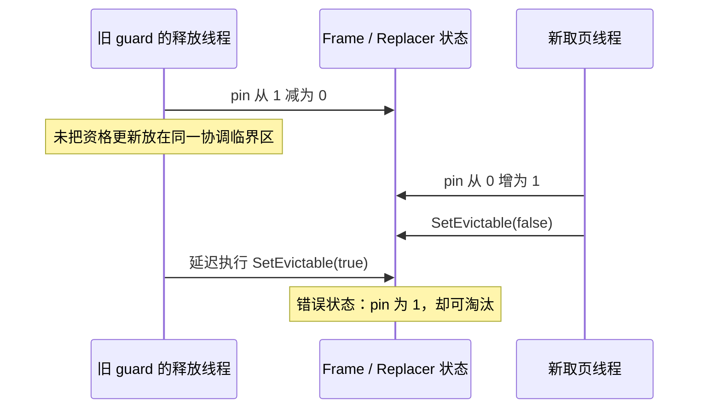

---
tags:
  - 高性能存储
  - 存储引擎
  - BusTub
  - 缓存替换
---
# Buffer Replacement：LRU-K、ARC 与并发淘汰策略

> [!abstract] 本篇的实验目标
> 面向 BusTub 的替换器实现：能手算 victim，能区分 resident、ghost 与 evictable，能解释 `RecordAccess`、`SetEvictable`、`Evict`、`Remove` 的状态变化，并把替换器与 Buffer Pool 的并发协议接起来。

先阅读 [[8.高性能存储/6. 存储引擎与索引/6.21 Buffer Pool Manager：Page、Frame、Pin、Dirty 与 Eviction|Buffer Pool Manager]]。替换器解决“**允许淘汰的页里面，选谁**”，而不是“某个页现在是否可以随意覆盖”。后者还受到 pin、I/O reservation、脏页回写与映射发布的限制。

## 1. 版本与责任边界

本文区分两个实验版本：**Spring 2025 P1 的 LRU-K**，与 **Fall 2026 P1 的 ARC 变体**。当前主线接口以公开快照 `c0a5431985287e258a6f25f53d822f0d0d2e63e8` 为核对基线，访问日期为 2026-09-06。[1][2][3]

Fall 2026 不要求额外实现 LRU、Clock 或 LRU-K；仓库里仍有相关文件或常量，并不意味着它们都属于本学期任务。保留 LRU-K 是为了理解策略差异和阅读旧实验资料，不混合两套评分语义。

| 层次 | 回答的问题 | 主要责任方 |
| --- | --- | --- |
| 淘汰资格 | 是否仍被用户或 I/O 使用？ | BPM 与使用权协议 |
| 访问历史 | 最近如何被访问？ | Replacer |
| 候选排序 | 合格者里优先移出谁？ | Replacer |
| 实际回收 | 脏页怎样保存，何时可重绑 frame？ | BPM、Scheduler、Disk Manager |

**更高命中率不能抵消错误淘汰。** 把 dirty 页先写回是 BPM 的工作；让标准 ARC 在所有情况下优先选 clean 页，则已经改变了算法，不能作为原本要求的“无害优化”。

## 2. 从 LRU 与 Clock 看见问题

### 2.1 LRU 只看最近一次访问

LRU 优先移出最后访问时间最早的页。Clock 则用引用标记与时钟扫描近似最近使用关系；引用标记不是 pin count，清除引用标记也不等于解除 pin。[4]

两者帮助理解缓存局部性，但不能只因为一页“刚访问过”，就判断它值得长期占据缓冲池。

### 2.2 顺序扫描为什么会污染热点缓存

设容量为 3，A、B 是频繁访问的热点；突然扫描 S1、S2、S3，每页只访问一次。LRU 会把这些刚出现的页逐步放在最近端，热点即使刚刚重复使用过，也可能被推出去。

问题不是扫描“错误”，而是**一次性访问与重复复用在一个最近时间戳里很难区分**。LRU-K 用第 K 次历史证据做区分；ARC 用首次/重复访问分类，以及被淘汰后又访问的反馈来调整资源分配。

这并不意味着先进策略对所有序列都更好。工作负载切换、pin 分布、元数据成本和容量都可能改变结果；算法名称不是性能保证。

## 3. LRU-K：第 K 次最近访问，不是最近 K 次的平均值

### 3.1 Backward K-distance

在当前逻辑时间 `t`，页的倒数第 K 次访问时间为 `t_k`。定义：[1]

$$
D_K = \begin{cases}
t - t_k, & \text{已记录至少 K 次访问} \\
+\infty, & \text{历史少于 K 次}
\end{cases}
$$

只在 **evictable** 的 frame 中，选择 `D_K` 最大的 victim。若多个 frame 的距离都是正无穷，Spring 2025 BusTub 要求比较它们**最早的一条已记录访问时间**，优先淘汰最早者。

这是课程的明确 tie-break，不应笼统写成“正无穷时再按普通 LRU”。当 K=2 时冷页只有一条历史，两种说法看不出区别；K=3 时就可能选出不同 victim。

### 3.2 用两张小表消除歧义

取 `K=2`、`t=12`，历史按从旧到新排列，三个 frame 都可淘汰：

| 页 | 保留的历史 | Backward 2-distance |
| --- | --- | --- |
| A | `[1, 10]` | 11 |
| B | `[7, 8]` | 5 |
| C | `[11]` | 正无穷 |

先选 C，而不是最后一次访问更早的 B。C 没有足够重复访问证据。之后仅在 A、B 中比较时会选 A，因为第 2 次最近访问比 B 更久远。

再取 `K=3`：

| 页 | 历史 | 状态 | 冷页 tie-break |
| --- | --- | --- | --- |
| X | `[1, 9]` | 少于 K 次 | 最早记录为 1 |
| Y | `[2, 3]` | 少于 K 次 | 最早记录为 2 |

应选 X。普通 LRU 会更倾向 Y，但这不是本例的课程规则。

### 3.3 无须真的计算正无穷，也不必每次做减法

把所有候选按二元类别排序即可：历史不足者先于历史充分者；同一类别比较历史队首时间，时间更小者先淘汰。成熟候选只保留最近 K 次访问时，队首恰好是 `t_k`；所有候选共享同一个当前时间，所以比较 `t - t_k` 的大小等价于反向比较 `t_k`。

这一变换还避免了拿浮点正无穷表示整数时间，以及不必要的无符号时间差溢出。逻辑时钟的递增与历史更新仍需要同步；“用逻辑时间”不等于可以多线程无锁自增普通整数。

## 4. LRU-K 的状态与接口契约

一个教学上容易理解的记录包含：frame ID、至多 K 条访问时间、evictable 标记。`Size()` 统计可淘汰记录，不是历史记录总数。[1]

| 操作 | 历史 | 淘汰资格 / 计数 |
| --- | --- | --- |
| `RecordAccess(F)` | 追加本次访问；超 K 时移除最旧记录 | 不能凭“被记录”就把 pinned frame 变成可淘汰 |
| `SetEvictable(F, true)` | 保留 | 只有 false→true 才增加 Size |
| `SetEvictable(F, false)` | 保留 | 只有 true→false 才减少 Size |
| `Evict()` | 移除被选 frame 的记录 | 仅从可淘汰者中选择，无候选返回空 |
| `Remove(F)` | 删除该 frame 的历史 | 用于页删除；不可淘汰者不能被强行移除 |

**Pin 不应清空访问历史，Unpin 也不应伪造新访问。** 在已知页被取用后记录一次访问，而不是每读取一个字段就记录一次。Flush、调试打印、查询 Size 也不是用户访问。

frame 被重新绑定时，旧页历史不能继续算到新页头上。本实验接口按 frame 追踪驻留记录，不能擅自保留旧记录，假装实现了论文中可能更复杂的跨淘汰历史维护。理论算法、工程变体、课程简化需要分别说明。

## 5. 一个可运行的 victim 比较器

下面是**独立 C++17 计算示例**，不是完整 `LRUKReplacer`。它接收一致的候选快照，只验证比较规则，不包含并发访问、BPM、历史记录器或磁盘 I/O。把三段依次放入 `lruk_order_demo.cpp`。

首先定义输入。约定 frame ID 非负且互不重复，历史按从旧到新排列，快照在函数调用期间不被其他线程修改。

```cpp
#include <cassert>
#include <cstddef>
#include <cstdint>
#include <optional>
#include <stdexcept>
#include <tuple>
#include <vector>

struct Candidate {
  int frame_id;
  bool evictable;
  std::vector<std::uint64_t> history;  // 最多 K 条，队首先被访问。
};
```

接着把比较键写清楚：冷页类别为 0，成熟页为 1；最小键对应最优先的 victim。frame ID 只用于本示例中完全同分时的确定性输出，不新增课程要求。

```cpp
std::optional<int> ChooseVictim(const std::vector<Candidate> &items,
                                std::size_t k) {
  if (k == 0) throw std::invalid_argument("K must be positive");
  using Key = std::tuple<int, std::uint64_t, int>;
  std::optional<Key> best;
  for (const auto &item : items) {
    if (!item.evictable) continue;
    if (item.frame_id < 0 || item.history.empty() ||
        item.history.size() > k) {
      throw std::invalid_argument("invalid candidate snapshot");
    }
    const int category = item.history.size() < k ? 0 : 1;
    const Key key{category, item.history.front(), item.frame_id};
    if (!best || key < *best) best = key;
  }
  if (!best) return std::nullopt;
  return std::get<2>(*best);
}
```

最后用 K=3 的冷页反例和全 pinned 场景验证。函数不修改历史，因此可以直接观察开关资格对结果的影响。

```cpp
int main() {
  std::vector<Candidate> items{
      {0, true, {1, 9}}, {1, true, {2, 3}}, {2, true, {4, 5, 7}}};
  assert(ChooseVictim(items, 3) == 0);  // 冷页最早记录：1 < 2。
  items[0].evictable = false;
  assert(ChooseVictim(items, 3) == 1);  // pinned 者即使最冷也跳过。
  items[1].evictable = false;
  assert(ChooseVictim(items, 3) == 2);  // 冷页都被固定后选择成熟页。
  items[2].evictable = false;
  assert(!ChooseVictim(items, 3));
  const std::vector<Candidate> mature{
      {3, true, {1, 10}}, {4, true, {7, 8}}};
  assert(ChooseVictim(mature, 2) == 3);
  bool rejected = false;
  try { (void)ChooseVictim(items, 0); }
  catch (const std::invalid_argument &) { rejected = true; }
  assert(rejected);
}
```

验证命令：`g++ -std=c++17 -Wall -Wextra -Werror lruk_order_demo.cpp -o lruk_order_demo`，再执行 `./lruk_order_demo`。不要加 `-DNDEBUG` 来运行这组基于 assert 的演示测试。

这个比较器对候选数 N 做一次扫描，为 O(N)，附加状态 O(1)。真实替换器还需要维护历史、同步和对象管理；这些成本没有被这个纯计算函数测试覆盖。

## 6. ARC：驻留数据与被淘汰的历史分开保存

### 6.1 四个列表，不是四份页缓存

ARC 原论文用 T1、T2、B1、B2 表达驻留与历史分区；BusTub 对应命名为 `mru_`、`mfu_`、`mru_ghost_`、`mfu_ghost_`。[3][5]

| 列表 | 含义 | 本快照用什么身份记录 |
| --- | --- | --- |
| T1 / MRU | 最近只见过一次的驻留页 | frame ID，关联 page ID |
| T2 / MFU | 最近出现了重复访问证据的驻留页 | frame ID，关联 page ID |
| B1 / MRU ghost | 从 T1 淘汰后保留的页身份 | page ID |
| B2 / MFU ghost | 从 T2 淘汰后保留的页身份 | page ID |

每个列表都把最近端放在 front，最旧端放在 back。**T2 不是按累计访问次数排序的 LFU 堆**；一页访问一万次后很久不再访问，并不会因此永久豁免淘汰。

![[图片/SVG/8_6_6_22_1.svg|900]]

图中只有左侧 T1、T2 占用数据 frame。右侧 B1、B2 是已经不驻留的页号历史，命中 ghost 仍然需要读取页内容。p 是偏向 T1 的目标值，不是“为 T1 预先划死的物理内存边界”。

### 6.2 为什么 ghost 必须跟踪 page，而不是旧 frame

假设 P 被淘汰时在 F0，随后 F0 被 Q 复用。若 ghost 只记 F0，那么后来访问 Q 可能被错误解释为 P 再次出现；P 被载入 F1 时反而找不到自己的历史。

因此驻留记录可以按 frame 管理，ghost 身份必须按逻辑 page 管理。公开骨架用 `alive_map_` 与 `ghost_map_` 表达这一区别；即使 ghost 的辅助结构仍携带旧 frame ID，该值也不能作为有效 frame 所有权或当前页定位。[3]

### 6.3 五个“大小”，不能都叫缓存大小

设容量为 c，稳定状态下需要检查：

$$
|T_1|+|T_2|\leq c,\quad |T_1|+|B_1|\leq c,
$$
$$
|T_1|+|T_2|+|B_1|+|B_2|\leq 2c,\quad 0\leq p\leq c.
$$

此外 `Size()` 等于 resident 记录中 evictable 为 true 的数量，通常不等于 `|T1|+|T2|`。ghost 不占数据 frame，却仍消耗元数据内存；“最多 2c 个目录条目”不是“最多缓存 2c 个数据页”。[2][3][5]

每个逻辑页在这四个列表中至多属于一个；把页从 ghost 移入 T2 时，必须移除旧 ghost 索引，不能留下双重身份。

## 7. ARC 的自适应反馈：p 为什么这样变化

首次出现在四个列表之外的页，进入 T1；已在 T1/T2 的页再次访问，移到 T2 最近端。这把“最近出现一次”与“近期存在复用证据”区分开。[3][5]

ghost 命中则提供一种反事实反馈：**刚刚淘汰的这类页又被用到了，可能给这一类的驻留空间太少。**

### 7.1 命中 B1：提高 T1 的目标

在本学期整数目标值的表达下：[2][5]

$$
p\leftarrow \min\left(c,\ p+\max\left(1,\left\lfloor\frac{|B_2|}{|B_1|}\right\rfloor\right)\right).
$$

再从 B1 移除该页，把它放入 T2 最近端。增大 p 是对以后 victim 侧选择的反馈，不是马上凭空增加 frame，也不是把这次重访重新当作第一次访问。

### 7.2 命中 B2：降低 T1 的目标

$$
p\leftarrow \max\left(0,\ p-\max\left(1,\left\lfloor\frac{|B_1|}{|B_2|}\right\rfloor\right)\right).
$$

再从 B2 移除该页，放入 T2 最近端。降低 p 相当于把更多目标份额让给 T2。

分母在对应 ghost 命中时必定非零；**比值应在删除命中项之前计算**。p 常用无符号类型，不能先发生下溢，再试图用 `max(0, p-delta)` 修复；应使用先比较再减等饱和算术。增长也应先检查剩余空间。

## 8. 不要把原论文 REPLACE 直接抄进 BusTub

原论文图 4 将请求处理、p 调整、REPLACE 与加载放在同一算法里。BusTub 把“选择并移出驻留 victim”放进 `Evict()`，其余访问分类与目录维护放进 `RecordAccess()`。[3][5]

**接口拆分改变了你组织操作的时机。** 在本文的基础 BPM 集成中，先通过 free frame 或 `Evict()` 获得槽位，再为新绑定调用 `RecordAccess()`；同一次 miss 不应在 `RecordAccess()` 里又淘汰一次。

### 8.1 本学期 victim 侧的选择

用当前 T1 实际大小与 p 比较：T1 不小于 p 时先尝试 T1，否则先尝试 T2。选定侧从最旧端向最近端寻找 evictable 记录；找不到便尝试另一侧。两边都没有可淘汰记录时返回空，不能硬删 pinned 页。[2][3]

选中 T1 的页移入 B1 最近端；选中 T2 的页移入 B2 最近端。移入 ghost 的是页身份，原 frame 可由 BPM 进入后续回收流程，但脏页回写尚未自动完成。

两个与原论文尤其容易混淆的点：**T1 大小等于 p 时，本学期不根据当前请求是否命中 B2 再分支；需要跳过 pinned 候选，并在目标侧无可淘汰者时换侧。** 原论文关于恒定操作成本的结论也不能不加条件套到这种带跳过扫描的实现。[3][5]

### 8.2 `RecordAccess` 的完全新页与 ghost 裁剪

在已经取得新 frame、准备记录该页的阶段，如果该页不属于任何列表，就进入 T1。为控制历史目录大小，按本学期规则优先检查 T1 与 B1 的合计是否达到 c；达到时丢弃 B1 最旧历史。否则，在四列表合计达到 2c 时丢弃 B2 最旧历史。之后添加新页。[2]

这不是从 ghost 取回数据，只是删除一条历史身份。`list` 与对应 map/迭代器必须一起更新。

为什么这里通常应该存在可裁剪 ghost？在容量已满且所有 resident 都在 T1 的极端情况，**先做的 Evict 已把其中一个移入 B1**。若绕过正常集成顺序，在没有可用 frame 的情况下直接记录一个新 resident，可能出现空 ghost 上调用 `back()`，并使容量不变量崩溃。

有 free frame 时不应为了“套流程”再做一次 Evict；仍要按页是否命中 ghost 完成相应分类。删除页后出现 free frame 的情况尤其能暴露“每次 miss 都必须 Evict”的错误假设。

### 8.3 `Remove` 不是定向 `Evict`

`Evict()` 依据策略移出一个候选，并保留相应 ghost 反馈；`Remove(F)` 面向显式页删除，不是“把这个页当作一次缓存容量淘汰”。本快照规定：不可淘汰的已存在 frame 被 Remove 时应报错或终止；不存在则不改变状态。[3]

不要把删除当作 ghost 反馈，也不要把被 ghost 淘汰的旧 frame ID 当作 Remove 的有效对象。BPM 还需要按逻辑页删除语义清理自己的映射与后端空间。

## 9. 手推一次 ARC：两个 frame 就够看到双向调整

设 c=2、p 初始为 0。每次访问结束都归还用户 pin，因此下一次请求开始时所有 resident 均可淘汰。每列从左到右为最近端到最旧端。按本文的 **Evict 先于新绑定 RecordAccess** 集成顺序处理：

| 步骤 | 访问 | victim | p | T1 | T2 | B1 | B2 |
| --- | --- | --- | --- | --- | --- | --- | --- |
| 1 | A | 无 | 0 | A | — | — | — |
| 2 | B | 无 | 0 | B,A | — | — | — |
| 3 | A | 无，驻留命中 | 0 | B | A | — | — |
| 4 | C | B | 0 | C | A | B | — |
| 5 | B | C | 1 | — | B,A | C | — |
| 6 | A | 无，驻留命中 | 1 | — | A,B | C | — |
| 7 | D | B | 1 | D | A | C | B |
| 8 | B | D | 0 | — | B,A | D,C | — |

第 5 步先把 C 淘汰到 B1，随后访问 B 命中 B1，p 从 0 增到 1。B 回到 T2，但仍然发生真实缓存 miss。

第 7 步 T1 为空，小于 p，所以从 T2 淘汰最旧的 B，形成 B2 反馈。

第 8 步 T1 大小等于 p，按本学期规则优先从 T1 淘汰 D。随后 B 命中 B2；此时 B1 有 D、C 两项，B2 有 B 一项，下降步长为 2，p 饱和降到 0。

这张表同时检查列表方向、先后时机、ghost 命中仍需 I/O、等于 p 的边界和无符号减法。不要只看最终 T2，必须逐步核对四个列表。

## 10. Pin 参与之后，ARC 不能只看列表尾部

回到 c=2、T1=[B]、T2=[A]、p=0。若 B pinned 而 A 可淘汰，请求 C 时优先侧虽然是 T1，却不能淘汰 B；应尝试 T2，选择 A 并将 A 放进 B2。[3]

如果 A、B 都 pinned，应返回空并保持原有列表、p 和计数不变。**失败的淘汰不应伪造一次访问或 ghost 记录。**

扫描时，跳过 pinned 条目不代表访问了它，也不应把它移到最近端。否则系统越缺 frame，扫描越频繁，某些页就越会被错误地“加热”。

选择侧时比较的是 **T1 的驻留条目总数**与 p，而不是只比较 T1 的 evictable 条目数。候选资格与类别目标是两个不同维度。

## 11. 并发：替换器自己线程安全，只是第一步

### 11.1 列表、索引、p 与 Size 必须一起维护

一次 T1→T2 移动不仅是链表操作，还涉及辅助索引、迭代器或状态字段。一次 Evict 则可能同时改变 resident map、ghost map、两个列表与可淘汰计数。[3]

基础实现可以用一把 replacer mutex 保持单次方法内的整体一致性。内部 helper 应明确“调用时已持锁”，不能在普通非递归 mutex 下反复调用会再次加锁的 public 方法。`Size()` 是读取，也必须与写入同样遵守同步协议。

Replacer 锁内不做磁盘 I/O，不等待页 latch，也不回调 BPM。给出固定锁层次，例如 BPM 元数据锁 → Replacer 锁，并避免反向调用。

### 11.2 atomic pin 与独立 SetEvictable 的竞态

以下是**错误时序示例**，不是推荐流程：



每一次 pin 加减都可以是原子的，每一次替换器方法也可以有 mutex，这个交错仍然成立。需要在同一个 BPM 协调临界区或其他可证明的状态协议内，完成 pin 转换与资格同步，而不是给每个字段分别加 atomic 就结束。

### 11.3 victim 被选中到真正复用，是一个跨对象过程

BPM 接受 victim 后，应保证没有新使用者重新 pin 该旧页并继续使用它。可以在统一元数据锁内完成认领，或者引入 eviction reservation 与重试校验。

只让 `Evict()` 原子地从 list 中删除，不会自动让 page table、pin 和 I/O 生命周期也成为一个原子操作。优化成多个并发 in-flight miss 时，尤其需要重新检查这些跨对象不变量。

## 12. 数据结构与复杂度：优化最热的路径，但不改变规则

### 12.1 LRU-K 的简单实现与优化方向

为每个 frame 保存最多 K 条历史，空间通常为 O(cK)。使用固定容量环形历史时，追加可为 O(1)；选择 victim 可以先用 O(c) 扫描得到正确基线。

进一步维护冷/热候选有序集合，可以降低淘汰时搜索成本，但访问时可能要更新有序键。不要因为只看 Evict 的耗时，就忽略 `RecordAccess` 在缓存命中路径上的频繁调用。

### 12.2 ARC 的哈希索引与链表迭代器

使用哈希表定位记录、保存链表迭代器，再用 `std::list::splice` 移动节点，可以避免每次访问都在线性链表中搜索。仅有 `std::list` 而使用 `remove(value)`，仍要扫描查找。

在正常哈希行为假设下，访问定位与节点移动可以做到平均 O(1)。但本学期 Evict 可能跳过多个 pinned 条目，因此最坏仍可能扫描 O(c) 个 resident。还要计算哈希退化、锁竞争和内存分配的实际成本，而不是只抄一句“ARC 是 O(1)”。[3][5]

### 12.3 分片与异步维护属于后续策略变更

把一个全局替换器拆成多个 shard，可能减少锁竞争，却把“全局最合适 victim”改成“分片内 victim”。延迟处理访问日志，也可能让淘汰使用尚未更新的历史。

这些方向可以单独评测，但应先保存与指定算法严格一致的基线，不能为了跑分无说明地改变语义。[[8.高性能存储/6. 存储引擎/6.13 Bloom Filter 与 Block Cache|Block Cache]] 中针对不可变数据块的优化经验，也应先检查能否满足可修改页的生命周期条件。

## 13. 测试矩阵：不只验证“返回了一个 frame”

| 类别 | 场景 | 应验证的内容 |
| --- | --- | --- |
| 基本资格 | 记录但未设置 evictable；重复 true/false | Size 不重复增减；不可淘汰者不被返回 |
| LRU-K 距离 | K=1；K=2 冷热混合；成熟页比较 | 符合第 K 次历史，而不是最近一次时间 |
| LRU-K 冷页边界 | K=3，历史 `[1,9]` 与 `[2,3]` | 正无穷 tie-break 选择前者 |
| frame 复用 | 淘汰旧页后，同 frame 载入新页 | 新页不继承旧页访问历史 |
| ARC resident 命中 | T1→T2、T2 内刷新 | 列表方向正确，没有重复条目 |
| ARC ghost 命中 | B1、B2 各自命中；步长超过 p | 调整方向、取整、钳位、身份转换正确 |
| ARC 目录上界 | 新页流填满容量，触发两种 ghost 裁剪 | 四列表边界与索引同步 |
| ARC 等号边界 | `|T1| == p` | 使用本学期的选择侧规则 |
| pinned fallback | 目标侧全部 pinned，另一侧可淘汰 | 换侧且进入对应 ghost，不篡改跳过者位置 |
| 无候选 | 所有 resident pinned | 返回空，全部元数据不变 |
| Remove | 不存在、可淘汰、不可淘汰 | 分别遵守无操作、删除、报错的契约 |
| 并发集成 | 最后一次 unpin 与新 pin；并发 miss 与回收 | 不出现 pin>0 仍可淘汰、不出现双重绑定 |

本文第 9 节的逐步表可用简单的单线程 page-level 模型重放。模型应在每次转移后检查不变量，而不是只把最后的命中率当作正确性判断。

性能评测至少区分热点随机访问、单次扫描、重复扫描、热点切换与不同 pin 比例。除真实 cache hit ratio 外，记录 ghost hit ratio、元数据锁等待、候选扫描长度，以及 miss 的读盘/脏页写回成本。**ghost hit 不能算进真实数据命中率。**

*Systems Performance* 第 2 版 §8.4.5 用 ZFS ARC 解释近期/频繁访问与 ghost 元数据反馈，是理解机制的补充；它不是 BusTub 具体边界规则的来源，也不能替代本文版本对应的测试。[6]

## 14. 完成本篇后的验收问题

能在纸上解释 K=3 冷页 tie-break，并按第 9 节逐步维护四个列表，说明已经掌握算法层。能再解释为什么 atomic pin 不够、为什么 `Size` 不是容量、为什么 ghost 不能记旧 frame 所有权，才算接上 BusTub 工程层。

把两个层次分开验收：**先保证候选顺序正确，再保证只有真正允许回收的候选能进入 BPM 的复用路径。** 本篇不提供完整数据库事务隔离、MVCC 或 B+Tree latch 协议；它们将依赖本篇与配套 BPM 笔记建立的基础。

## 15. 参考资料与验证口径

**资料分工：**教材提供 LRU/Clock 和 ARC 的背景；原论文解释 ARC 的四列表与学习反馈；课程、固定源码给出 BusTub 变体和接口。小表、比较器、并发反例、测试矩阵与复杂度分解为独立教学推导，不是官方参考解答。

[1] CMU 15-445/645，Spring 2025，Project #1 — Buffer Pool Manager，Task #1 LRU-K Replacement Policy；尤其 backward K-distance 与正无穷 tie-break。访问 2026-09-06。https://15445.courses.cs.cmu.edu/spring2025/project1/

[2] CMU 15-445/645，Fall 2026，Project #1 — Buffer Pool Manager，Task #1 ARC Replacement Policy。页面更新 2026-09-03；访问 2026-09-06。https://15445.courses.cs.cmu.edu/fall2026/project1/

[3] CMU Database Group，BusTub，提交 `c0a5431985287e258a6f25f53d822f0d0d2e63e8`：`src/include/buffer/arc_replacer.h` 与 `src/buffer/arc_replacer.cpp`。后者明确说明与原论文不同的等号分支、pinned 跳过和换侧，以及 RecordAccess 不执行 REPLACE。https://github.com/cmu-db/bustub/blob/c0a5431985287e258a6f25f53d822f0d0d2e63e8/src/buffer/arc_replacer.cpp

[4] Andrew S. Tanenbaum、Herbert Bos，*Modern Operating Systems*，第 4 版，2015，§3.4.5–3.4.6，印刷页 212–214：Clock 与 LRU。这里讨论基础算法，不把该书旧版 OS 实现当作当前内核规则。

[5] Nimrod Megiddo、Dharmendra S. Modha，*ARC: A Self-Tuning, Low Overhead Replacement Cache*，FAST 2003，§IV 与 Figure 4（所读 PDF 第 8–9 页）。本文单独标注 BusTub 的变体差异。https://www.cs.cmu.edu/~natassa/courses/15-721/papers/arcfast.pdf

[6] Brendan Gregg，*Systems Performance: Enterprise and the Cloud*，第 2 版，2020，§8.4.5，ZFS / Adaptive Replacement Cache：近期与频繁列表、ghost 元数据与动态平衡。

**验证范围：**独立 C++17 比较器进行了本地编译和断言测试；ARC 教学序列用独立 page-level 模型重放，并检查了随机状态转移和 pinned 换侧。模型不含真实 frame、锁、I/O 或 guard，不能据此声称完整 BusTub P1 已通过测试。
