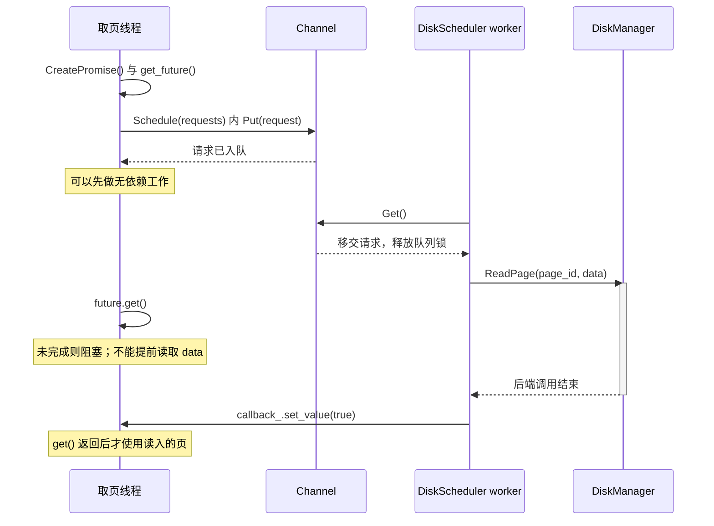
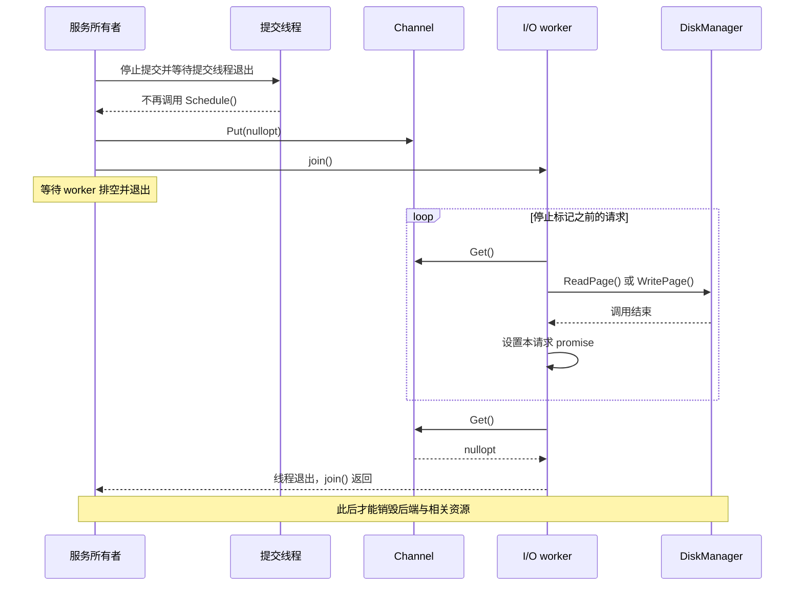
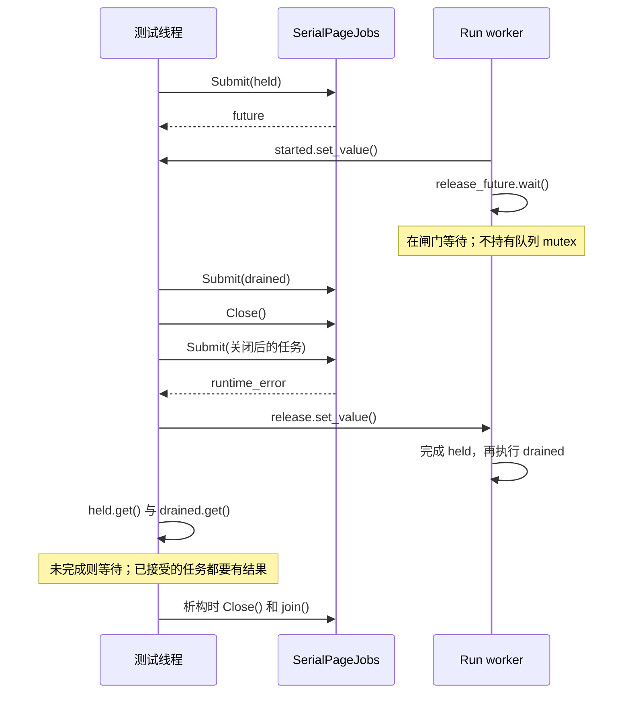

---
tags:
  - 高性能存储
  - 存储引擎
  - BusTub
  - 异步IO
aliases:
  - "6.23 Disk Scheduler 与异步 Page I/O"
---
# Disk Scheduler 与异步 Page I/O

> [!abstract] 实验目标
> 把“把读写扔给后台线程”扩展成一个完整的生命周期协议：谁拥有请求，谁保证页缓冲区有效，何时可以读取或覆盖它，谁报告失败，关闭时谁负责排空。目标是能够调试 BusTub P1 的 I/O 路径，并理解它如何影响后续 B+Tree 的页访问与并发。

前置是 **6.21 Buffer Pool Manager：Page、Frame、Pin、Dirty 与 Eviction** 与 **6.22 Buffer Replacement：LRU-K、ARC 与并发淘汰策略**（前批笔记已预览，待入库；此处暂不建立未落地的链接）。本篇不重复替换算法，而是展开“选中 frame 之后，如何安全完成 I/O”。B+Tree 如何使用返回的页，接到 [[8.高性能存储/6. 存储引擎与索引/6.24 B+Tree 工程实现：Page Layout、Search、Split、Merge 与 Iterator|6.24 的页内操作]]；页 latch 与等待之间的关系，接到 [[8.高性能存储/6. 存储引擎与索引/6.25 并发 B+Tree：Latch Coupling、Latch Crabbing 与锁顺序|6.25 的跨层锁顺序]]。

## 1. 版本、术语与阅读边界

**接口基线：Fall 2026 Project 1；源码快照：`c0a5431985287e258a6f25f53d822f0d0d2e63e8`；核对日期：2026-09-07。** 这是资料基线，不表示学习者的工作树已经切换到这个提交。[1][2]

该快照的页大小为 `BUSTUB_PAGE_SIZE = 8192`。`Schedule` 接收 `std::vector<DiskRequest> &`，不是旧教程中的单请求签名。页访问采用 `ReadPageGuard` / `WritePageGuard`。以下称“Page I/O”，均指数据库逻辑页的读写，不把它直接等同于一个文件系统块或一条 NVMe 命令。

本篇用三种口径：**教材原理**解释条件变量、future 和缓冲；**官方接口**给出请求字段与项目义务；**工程推导**给出状态机、失败策略与测试设计。文末的独立 C++17 模型不替代 `disk_scheduler.cpp` 的个人实现，不是官方参考解答。

## 2. “异步”必须说清楚是对谁而言

### 2.1 三层职责

| 层 | 核心问题 | 典型对象 |
| --- | --- | --- |
| 页驻留与缓存 | P 当前在哪个 frame？可否回收？是否 dirty？ | BufferPoolManager、Replacer、PageGuard |
| 用户态调度 | 请求何时被后台执行？如何交付完成状态？ | DiskScheduler、Channel、DiskRequest |
| 后端读写 | 如何把页字节读入/写出指定存储位置？ | DiskManager、文件或内存模拟后端 |

BusTub 的 DiskScheduler 是**数据库用户态的工作分派层**，不是 Linux 的块设备 I/O scheduler，更不是 NVMe 控制器的硬件队列。[2][3]

在单 worker 的基础实现中，前台把请求入队便可以继续做别的工作；worker 调用的 `ReadPage` / `WritePage` 仍可以阻塞。若前台立即调用 `future.get()`，前台依然要等页读好。正确说法是：**调度接口把发起与完成分离，并不保证调用者全程不阻塞，也不保证设备并行执行。**

### 2.2 四种完成边界，不能合成一个“成功”

| 事件 | 能推出什么 | 不能推出什么 |
| --- | --- | --- |
| `Schedule()` 返回 | 在实现契约下请求已经被接受或分派 | 页已读好、旧 buffer 可复用 |
| worker 调用后端返回 | 一次后端方法执行结束 | 后端没有隐藏 I/O 错误 |
| future 成为 ready 并被观察 | 本次完成通知已到达；读取结果或异常 | 自动满足数据库崩溃一致性 |
| 满足持久化协议 | 在规定故障模型下修改已达到持久性要求 | 单靠 promise 就能获得这个保证 |

当前文件后端通过 `std::fstream` 读写，写后调用流的 `flush()`；这不是 `fsync`、设备持久化屏障、WAL 恢复等协议的替代品。[3][5] 想把“完成通知”升级为“事务可提交”，需要衔接已有 [[8.高性能存储/6. 存储引擎/6.1 WAL 与 Crash Consistency|WAL 与 Crash Consistency]]，不能在调度器中把一个布尔值改名就解决。

## 3. 一个 DiskRequest 有两套互不替代的生命周期

### 3.1 字段与所有权

| 字段 | 意义 | 所有权与约束 |
| --- | --- | --- |
| `is_write_` | true 为写，false 为读 | 请求的值字段 |
| `page_id_` | 逻辑页号 | 不代表 frame ID；也不应越层算文件偏移 |
| `data_` | 页数据起始地址 | **借用指针**，不拥有数据，不自动复制数据 |
| `callback_` | `std::promise<bool>` | 请求持有完成状态的生产端，通过移动交接 |

`callback_` 这个名字容易误导：它不是用户注册的 `std::function`，而是 promise。调用者取得 future，worker 最终使对应共享状态就绪。[2]

移动一个 `DiskRequest`，会移动其中的 promise；**不会移动或复制 `data_` 指向的 8192 字节**。即使保存请求的 vector 已可销毁，页缓冲区仍必须活到 I/O 不再访问它为止。也不要用要求复制元素的 `initializer_list` 方式强行构造含 promise 的请求集合。

### 3.2 读请求与写请求的约束不同

**读请求**：从入队开始到读取完成，目标内存必须仍然存在、仍属于这个请求；其他线程不能同时写它，也不能把尚未完成的内容视作有效页读取。

**写请求**：从入队开始到后端不再读取源数据，源内存不仅要存在，内容还必须稳定。仅仅保持 `shared_ptr` 不析构，不能防止别人在同一对象里写入新页。

因此需要分别回答：

- 谁保持 buffer 的对象生命期？
- 谁保持 `page_id -> frame` 的绑定？
- 谁防止 byte buffer 与其他读写发生竞争？

这些答案可能分别是所有权对象、pin/I/O reservation、页 latch 或独立快照。它们不是一个 `shared_ptr` 能一并解决的问题。

### 3.3 `get()` 之后的可见性，不是给无锁并发写开绿灯

promise/future 共享状态用于把结果从生产者交给消费者。生产者完成数据写入后再发布完成，消费者等待并观察完成之后才使用结果，是一次性通知的适用模式。[4]

但如果完成发布后生产者又继续改同一 buffer，或者第三个线程同时改 buffer，future 不会为这些后续操作提供互斥。**发布先前结果与保护以后访问是两件事。**

## 4. Channel：锁保护队列，条件变量负责等待

当前 `Channel<T>` 的 `Put(T)` 在 mutex 内 `push(std::move(element))`，解锁后通知；`Get()` 使用谓词等待 `!q_.empty()`，移动队首并弹出后返回。[2]

这正好对应 *The Linux Programming Interface* §30.2 与《Linux 多线程服务端编程》§2.2 的条件变量用法：共享条件在同一把锁内检查和修改，wait 临时释放锁并在返回前重新获得锁，唤醒之后重新检查谓词。[5][6]

**不要把通知本身当成待处理请求。** 请求是队列里的状态；通知只是“可能有工作了”。生产者先入队再通知，即使通知发生在消费者开始等待之前，只要消费者重新检查队列，也不应丢失工作。

**不要拿着队列锁执行磁盘 I/O。** worker 应先从队列中移出自己的请求并释放队列锁，再调用后端。否则一次慢 I/O 会阻止所有生产者入队，把队列锁变成磁盘延迟的放大器。

该 Channel 虽然支持多生产者、多消费者，但它没有自动提供业务关闭协议、容量背压或同页完成顺序。容器线程安全，不等于整个调度策略已经正确。

## 5. 正常路径：从接受请求到交付完成

下面的时序描述基础单 worker 方案；等待标记指出谁在等待，而不是声称每一次 `get()` 都必然睡眠。



图揭示的关键不是“有两个线程”，而是**请求接受与 buffer 可使用之间还隔着后端执行和完成发布**。

### 5.1 成功只发布一次，错误也必须终结请求

每个被接受的请求应有且仅有一个终态。正常完成时发布 true；若设计允许后端抛异常，则捕获后把异常送入对应 future，或者转换为明确错误结果。不能只打印日志后忘记通知等待者，也不能在成功之后再发布异常。[4]

promise 被销毁而未设置值时，等待者可能收到 `broken_promise`，这与永远卡住不同，但仍不代表请求成功。等待方应消费结果，不能只调用 `wait()` 然后不检查值或异常。

### 5.2 先看后端是否真的提供错误信号

当前 `DiskManager::ReadPage` / `WritePage` 返回 `void`；源码中的某些文件错误路径记录日志后直接返回。**调度器在外面加一个 try/catch，并不能捕获后端没有抛出来、也没有返回出来的错误。**[3]

所以本篇区分：

| 层次 | 应如何描述 |
| --- | --- |
| P1 正常路径 | 按项目契约处理请求并设置完成状态 |
| 本篇错误注入模型 | 后端任务显式抛异常，future 显式传播 |
| 生产级可靠 I/O | 需要后端提供错误码/异常、短读短写处理和持久化语义，再由调度器传递 |

不应把课堂后端“方法返回了”无提示地解释为完整可靠存储系统的成功证明。更深入的错误传播可接到 [[8.高性能存储/6. 存储引擎/6.3 fsyncgate 与 EIO 处理|fsyncgate 与 EIO 处理]]。

### 5.3 批量提交不自动是原子批次

一个 vector 内有多个请求，不代表底层只发起一次系统调用，也不代表所有请求一起成功或一起失败。若实现逐项调用 `Put()`，其他生产者可以在两项之间插入请求；这仍可以保留各生产者自身的顺序，却不是“整批在队列中连续”的保证。

若入队中途失败，还要定义前面已经接受了多少请求，以及各 promise 由谁收尾。更强的批次原子接受或整批失败策略属于额外设计，不能从函数参数是 vector 推出来。

## 6. 关闭协议：排空比发一个停止标记更重要

### 6.1 当前骨架的停止方式

源码析构函数把 `std::nullopt` 放入队列，然后 join 后台线程。单 worker 把它解释为停止消息时，FIFO 队列中此前接受的请求可以先执行完。[2]

完整外部顺序应是：**停止新的提交者 → 确认不会再并发调用调度器 → 发停止消息 → worker 处理此前的请求 → worker 退出 → join 返回 → 销毁队列、buffer 与后端。**



停止标记是**队列内的顺序协议**；它不能阻止另一个线程在标记后继续提交，也不能使“析构与成员函数并发执行”变得安全。

### 6.2 三个关闭陷阱

**把 stopped 标志一设就直接退出**：可能遗留已接受请求，buffer 仍被调用者等待，或 promise 以非预期方式被破坏。

**detach worker**：owner 退出后，worker 还可能使用已销毁的队列、`this` 或 DiskManager。*Effective Modern C++* Item 37 强调线程在所有路径上的生命周期管理，正适用于这个问题。[4]

**扩展为多个 worker，却仍只投一个停止消息**：某个 worker 消费了消息，其他 worker 仍在空队列上等待。应重新设计关闭广播/closeable queue 或足够的停止消息，而不是只把线程字段改成 vector。

即使协议正确，如果后端 I/O 永不返回，drain-and-join 也可能无限等待。超时、取消、进程级隔离是另一个层次，不能宣称析构函数已经解决“所有故障都能退出”。

## 7. 与 BPM 集成：四条不能打破的依赖

### 7.1 脏页写回完成，才可以覆盖原 buffer

若 frame F 原来存 P，接下来要读 Q 到 F：

`WritePage(P, F.data)` 完成 → F 的旧内容不再被读取 → `ReadPage(Q, F.data)` 才可开始。

把两项塞进一个 batch 可以，但基础正确性依赖真实执行顺序；把它们分派给两个 worker 同时执行，会让 Q 的数据污染 P 的写入。这不是内存释放错误，而是**有效内存上的语义覆盖**。

### 7.2 正在读取的页，不是一个可以直接返回的缓存命中

BPM 若在解锁前发布了 `P -> F`，却还没读完 P，第二个线程不能只凭映射存在就返回 guard。需要区分 `Loading` 与 `Ready`，并让后续请求等待同一次加载结果；失败时也要让所有等待者结束。

这里的 `Loading`、`Ready` 是工程状态名称，不是声称骨架已有对应 enum。把等待移出 BPM 锁时必须补齐状态机，而不是只在 `future.get()` 前解锁。

### 7.3 清 dirty 时不能抹掉更晚的修改

一种保守实现是在稳定页绑定和合适的内容保护下完成写出，完成后再清 dirty。若使用快照并在 I/O 期间允许新修改，需要额外版本或等价协议：

- 开始写出的是版本 v；
- 完成时只有确认“仍然没有比 v 更新的修改”，才允许把当前页标为 clean；
- 同一页多次写出还要防止旧版本最后落到后端，覆盖更新版本。

**版本号校验可以避免清错 dirty，却不会自动解决后端 WAW 乱序。** 这两个问题需要分别处理。版本字段本身也必须线程安全，且有复用/回绕边界。

### 7.4 超时不是 buffer 可回收的证明

`future.wait_for()` 超时，仅表示这次等待没有观察到完成；请求可能仍排队，也可能正在把数据写进内存。立即归还 pin、复用 buffer 或销毁请求关联状态，仍然会产生错误。

取消需要额外证明：请求未开始并成功撤回，或者后端已经确认不再触碰 buffer。没有取消协议时，应把超时当诊断/上层策略信号，不当作完成。

## 8. 从一个 worker 到并行 I/O：先定义顺序，再增加线程

### 8.1 FIFO 出队不保证 FIFO 完成

两个 worker 可以先后拿到 `W(P, v1)`、`W(P, v2)`，却以相反顺序完成。一个保护队列的 mutex 只解决“不会两次弹出同一项”，不解决同页写入顺序。

| 同一逻辑页的依赖 | 错误重排的后果 |
| --- | --- |
| W → R | 后续读看不到应该先完成的写 |
| W(v1) → W(v2) | 旧版本最后完成，覆盖新版本 |
| R → W | 读可能看到本不应越过它的更新 |
| R → R | 在只读且目标 buffer 独立时可考虑并行；仍要验证后端线程安全 |

Fall 2026 的可选并行 I/O 要求强调同页操作的顺序效果与单线程 read-after-write 一致性。[1] 跨线程同时提交的请求还需要定义一个可解释的接受顺序，不能声称知道两个没有同步关系的调用“本来谁先”。

### 8.2 可选择的工程方案

**按 page ID 分片到固定 worker**：同页始终进入同一串行通道，实现简单；不同页哈希碰撞会被额外串行化。分片数量固定，元数据不会随数据库历史页数无限增长。

**维护活动页依赖链**：为同页操作维护有序队列，仅调度每条链的头部，不同页可并发。更灵活，但终态、取消、错误和活动记录删除需要一并证明；不能永久保存所有曾访问页的状态。

**原生异步后端**：使用明确的 completion 与 buffer lifetime，把依赖交给自己的调度层或后端提供的机制。仅替换系统调用不够，BPM 的 in-flight 协调仍必须正确。

以上是工程扩展，不是骨架已经存在的模块。更重要的是，当前文件 DiskManager 自己使用 `db_io_latch_` 串行保护文件读写；在它外面多开 worker 不保证获得实际 I/O 并行。[3]

### 8.3 后端换成 pread/pwrite 也不等于顺序问题消失

TLPI §5.6 说明 `pread` / `pwrite` 使用显式 offset，不修改共享文件偏移，因此能避免 `lseek + read/write` 的偏移竞争。[5] 但同一位置的并发覆盖、短 I/O、错误传播、页写原子性与持久化约束仍需处理。这里仅解释后端设计方向，不假称当前 BusTub 已使用这些系统调用。

## 9. 独立 C++17 模型：可关闭、会排空、能传播异常的串行页任务队列

这个模型故意采用 **64 字节 Page 值**和 `packaged_task<Page()>`，不使用 BusTub 的类名、页格式或借用式提交接口。它检验三件事：任务出队后解锁执行，用户任务异常由 future 传播，关闭后已接受的任务仍排空。

**限制先说明**：队列无界；只有一个 worker；不实现 pin、dirty、I/O 取消和持久化；析构前必须停止其他线程使用对象；任务不能在 worker 上销毁所属队列或等待依赖于本 worker 后续任务的 future。下面各段代码按顺序拼成一个 `.cpp`，不要各自当成完整程序。

### 9.1 类型与资源的构造顺序

先放齐头文件，显式把教学 Page 与数据库页区分开。

```cpp
#include <array>
#include <cassert>
#include <condition_variable>
#include <cstddef>
#include <future>
#include <iostream>
#include <mutex>
#include <queue>
#include <stdexcept>
#include <thread>
#include <utility>

// 独立的 64 字节教学页，不是 BusTub 的页格式或提交接口。
using Page = std::array<std::byte, 64>;
```

队列、mutex、条件变量先构造，worker 最后启动；析构体中先关闭并 join，成员才会随后销毁。声明上的所有权顺序和线程退出协议共同保证资源有效。

```cpp
class SerialPageJobs {
 public:
  using Job = std::packaged_task<Page()>;
  SerialPageJobs() : worker_([this] { Run(); }) {}
  SerialPageJobs(const SerialPageJobs &) = delete;
  SerialPageJobs &operator=(const SerialPageJobs &) = delete;
  ~SerialPageJobs() {
    Close();                 // 先唤醒空队列上的 worker。
    worker_.join();           // 等待已接受的任务排空，之后才能销毁队列。
  }
  std::future<Page> Submit(Job job);
  void Close();
 private:
  void Run();
  std::mutex mutex_;
  std::condition_variable ready_;
  std::queue<Job> queue_;
  bool closed_{false};        // 与队列受同一把 mutex 保护。
  std::thread worker_;        // 最后构造；线程启动前其他成员已就绪。
};
```

### 9.2 接受与关闭使用同一个临界区

一次 Submit 成功 push 才算接受。Close 与 Submit 竞争时，二者由同一把锁决定先后：关闭前接受则排空，关闭后提交则拒绝。若分配导致 push 抛异常，Submit 没有返回 future，也不能把它算成成功接受的请求。

```cpp
std::future<Page> SerialPageJobs::Submit(Job job) {
  if (!job.valid()) throw std::invalid_argument("empty job");
  auto result = job.get_future(); // 每个 packaged_task 只取一次 future。
  {
    std::lock_guard<std::mutex> lock(mutex_);
    if (closed_) throw std::runtime_error("queue closed");
    queue_.push(std::move(job)); // 成功入队是本例的接受点。
  }
  ready_.notify_one();
  return result;                // 不等待任务的页操作完成。
}
void SerialPageJobs::Close() {
  {
    std::lock_guard<std::mutex> lock(mutex_);
    closed_ = true;             // 重复 Close 无害；不取消已经接受的任务。
  }
  ready_.notify_all();
}
```

### 9.3 worker 在锁外执行

`closed_ || !queue_.empty()` 使空闲 worker 能被关闭唤醒；关闭但仍有任务时继续处理。`packaged_task` 会捕获其包装的用户函数异常并保存到共享状态；这不意味着资源耗尽、无效 task 或线程库使用错误也都被自动恢复。

```cpp
void SerialPageJobs::Run() {
  for (;;) {
    Job job;
    {
      std::unique_lock<std::mutex> lock(mutex_);
      ready_.wait(lock, [this] { return closed_ || !queue_.empty(); });
      if (queue_.empty()) return; // 此时 closed_ 必为 true，排空后退出。
      job = std::move(queue_.front());
      queue_.pop();
    }                            // 页操作开始前释放队列锁。
    job();                       // 用户任务的异常进入 future，不逃出此调用。
  }
}
```

### 9.4 写后读与异常注入

模拟后端 `disk` 只由 worker 访问。写入数据按值捕获，展示一种不同于 BusTub 借用 buffer 的安全输入方案；它有一次数据复制的成本，不能冒称零拷贝。

```cpp
int main() {
  Page disk{}, payload{};         // disk 只由一个 worker 访问。
  payload[0] = std::byte{42};
  std::promise<void> started, release;
  auto started_future = started.get_future();
  auto release_future = release.get_future().share();
  SerialPageJobs jobs;            // 被借用对象先构造，故比 jobs 更晚析构。
  auto written = jobs.Submit(SerialPageJobs::Job([&disk, payload] {
    disk = payload;               // payload 按值捕获：提交后源对象可另行修改。
    return disk;
  }));
  auto read = jobs.Submit(SerialPageJobs::Job([&disk] { return disk; }));
  payload[0] = std::byte{99};
  assert(written.get()[0] == std::byte{42});
  assert(read.get()[0] == std::byte{42}); // 同一提交线程的 write -> read 顺序。
  auto failed = jobs.Submit(SerialPageJobs::Job([]() -> Page {
    throw std::runtime_error("injected I/O error");
  }));
  bool propagated = false;
  try { (void)failed.get(); }
  catch (const std::runtime_error &) { propagated = true; }
  assert(propagated);
```

用两个 promise 把 worker 停在确定位置，确认 Close 时确实存在未完成和未开始的任务，再验证排空。无需用 `sleep()` 猜线程是否到了某一步。

```cpp
  auto held = jobs.Submit(SerialPageJobs::Job([&] {
    started.set_value();
    release_future.wait();        // 确定性闸门，不靠 sleep 猜执行顺序。
    return disk;
  }));
  started_future.get();           // 证明异常之后 worker 仍然能够处理任务。
  auto drained = jobs.Submit(SerialPageJobs::Job([&disk] { return disk; }));
  jobs.Close();                   // 关闭发生时有一个在执行、一个仍在排队。
  bool rejected = false;
  try { (void)jobs.Submit(SerialPageJobs::Job([] { return Page{}; })); }
  catch (const std::runtime_error &) { rejected = true; }
  assert(rejected);
  release.set_value();            // 放行后，关闭前接受的任务仍应完成。
  assert(held.get()[0] == std::byte{42});
  assert(drained.get()[0] == std::byte{42});
  jobs.Close();                   // 再关闭一次也不改变语义。
  std::cout << "serial_jobs: PASS\n";
}
```



这张图验证的是**关闭的接受边界**，不是用一个成功的退出证明真实硬盘、并发 BPM 或完整 BusTub 已正确。

编译运行：

```bash
g++ -std=c++17 -Wall -Wextra -Werror -pthread serial_jobs.cpp -o serial_jobs
./serial_jobs
```

成功输出为 `serial_jobs: PASS`。测试使用 assert，不要加 `-DNDEBUG`。本例在本地实际编译运行过；完整 BusTub 项目的测试不包含在这个结论里。

## 10. 实验测试矩阵与排障方式

| 测试 | 施加的方法 | 必查结果 |
| --- | --- | --- |
| 后台执行 | 记录提交线程与后端线程 ID | 后端不是偷跑在 Schedule 调用栈里 |
| 写后读 | 单线程依次提交 W(P)、R(P) | 返回最后应可见的完整页 |
| 缓冲区有效期 | 故意延迟后端开始，使用有保护的测试 buffer | 完成之前不释放、不复用、不并发访问 |
| 一次性终态 | 计数每个 request 的接受、开始、完成 | 不漏通知，不二次 set_value |
| 错误传播 | 可抛异常的假后端 | 对应 future 失败；后续独立请求按策略继续 |
| 空队列关闭 | worker 阻塞在 Get/wait 时关闭 | worker 能退出，join 不挂住 |
| 有积压关闭 | 闸门控制在执行请求，队列再放请求 | 关闭前接受的请求全部终结 |
| 多生产者 | 每个请求带可识别序号 | 不丢、不重；明确每个生产者和全局接受顺序 |
| 并行同页依赖 | 延迟第一个写，制造后发先完成机会 | 策略仍保持规定的同页效果 |
| BPM 回收集成 | 脏 victim 写出与新页读入共用 frame | 新读不得早于旧写不再使用 buffer |

基线官方测试见 `test/storage/disk_scheduler_test.cpp`。[1] 建议在已经完成个人实现并正确配置 CMake 后运行相应目标；要查看 GTest 是否报告了实际执行数量。名称带 `DISABLED_` 的测试默认不运行，“进程返回 0”不等于执行了它们。

```bash
# 在自己的 BusTub 工作树中；先保留所选学期与 commit 记录。
cmake -S . -B build -DCMAKE_BUILD_TYPE=Debug
cmake --build build --target disk_scheduler_test -j2
./build/test/disk_scheduler_test --gtest_also_run_disabled_tests
```

等待超时时，先打印或在调试器中检查：**已接受但未执行数、worker 当前后端调用、队列深度、未完成 promise、BPM/页锁的持有与等待关系**。不要先把超时统一归因于“机器慢”。

## 11. 性能：把排队、执行和唤醒分开测

一次请求的可观测延迟可以分解为：

`T_total = T_submit + T_queue + T_backend + T_publish_and_resume`。

这是测量分解，不是各部分固定常数。缓存命中时根本不进入此路径；文件后端和内存模拟后端也不能混在一个“磁盘延迟”指标里。

吞吐不增长而队列不断增加，可能是单 worker、后端内部锁或存储吞吐瓶颈；增加 worker 不一定改善。队列无界时，调度请求元数据和被保留的页可能持续占内存；有界队列可以施加背压，但提交线程若拿着 worker 需要的锁等待队列空间，又会形成新的锁环。

**性能优化不能以破坏数据依赖来换取数字。** 先证明关闭、所有权、顺序与错误终态，再测并行和批处理收益。

## 12. 实现前的六个验收问题

一条请求入队后，能否指出其 promise 和 buffer 分别由谁持有？一次 get 超时后，能否证明 buffer 仍不会被复用？worker 执行慢 I/O 时，生产者是否还能入队？停止消息后是否绝无新提交？同页两个写是否可能乱序覆盖？后端的失败究竟如何传到等待线程？

这六个问题比“用了线程池还是 io_uring”更先决定调度器正确性。它们也会直接影响 B+Tree：一次页访问可能因 I/O 等待延长 latch 持有时间；一次 frame 过早复用则会表现为随机的键序错误，而不一定报出明显的内存异常。

## 13. 参考资料与来源边界

[1] CMU 15-445/645，**Fall 2026**，Project #1 — Buffer Pool Manager，Task #2 Disk Scheduler、Parallel I/O Optimization；页面更新 2026-09-03，访问 2026-09-07。https://15445.courses.cs.cmu.edu/fall2026/project1/

[2] CMU Database Group，BusTub，提交 **`c0a5431985287e258a6f25f53d822f0d0d2e63e8`**：`src/include/storage/disk/disk_scheduler.h`、`src/storage/disk/disk_scheduler.cpp`、`src/include/common/channel.h`、`src/include/common/config.h`。这些是接口、停止标记与队列实现的依据。https://github.com/cmu-db/bustub/tree/c0a5431985287e258a6f25f53d822f0d0d2e63e8/src

[3] 同一提交，`src/storage/disk/disk_manager.cpp`：实际文件读写、`db_io_latch_`、日志后返回的错误分支、流 flush。https://github.com/cmu-db/bustub/blob/c0a5431985287e258a6f25f53d822f0d0d2e63e8/src/storage/disk/disk_manager.cpp

[4] Scott Meyers，*Effective Modern C++*，第 1 版，2014，Items 37–39，印刷页 250–270：线程退出、future 共享状态与一次性事件通信。教材示例讲 C++11/14；本文独立代码采用 C++17。

[5] Michael Kerrisk，*The Linux Programming Interface*，2010，§5.6（印刷页 98–99）、第 13 章 File I/O Buffering、§30.2（印刷页 643–650）：定位 I/O、缓冲/同步以及条件变量谓词。没有据此声称教材涵盖当前 BusTub 或 io_uring。

[6] 陈硕，《Linux 多线程服务端编程：使用 muduo C++ 网络库》，2013，第 1 章对象生命期、§2.2 条件变量。用于解释外部生命周期约束与生产者/消费者等待，不作为 BusTub 文件后端的实现来源。

**工程推导范围**：接受点、状态和失败矩阵、同页依赖分析、并行扩展方案、独立代码与测试均为围绕上述契约组织的教学材料。本文没有交付完整 P1 解答，也没有验证真实磁盘故障或数据库崩溃恢复。
