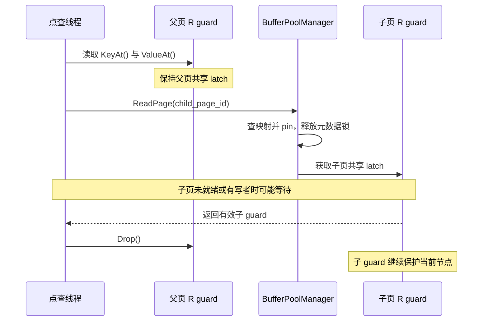
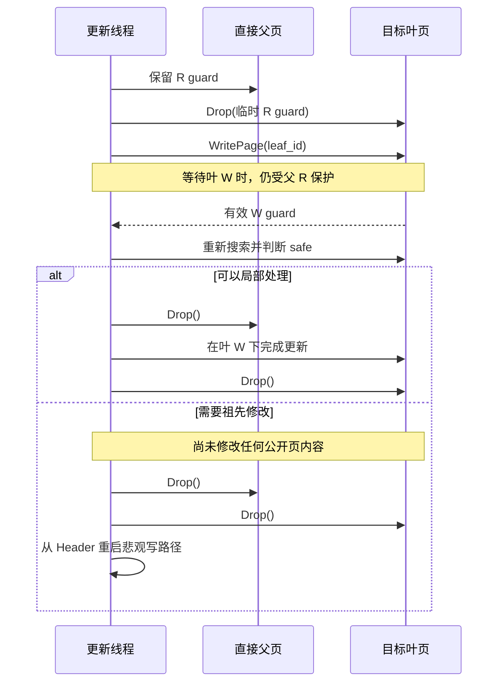
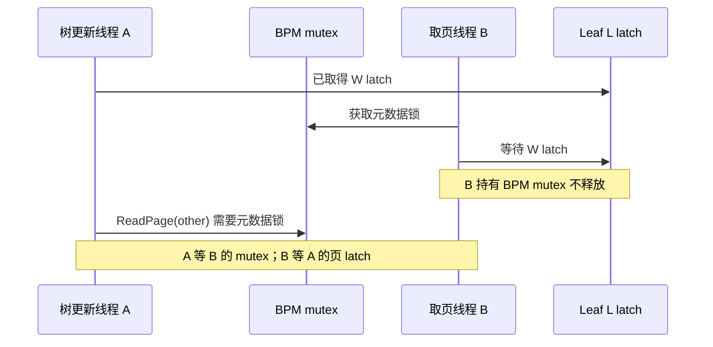
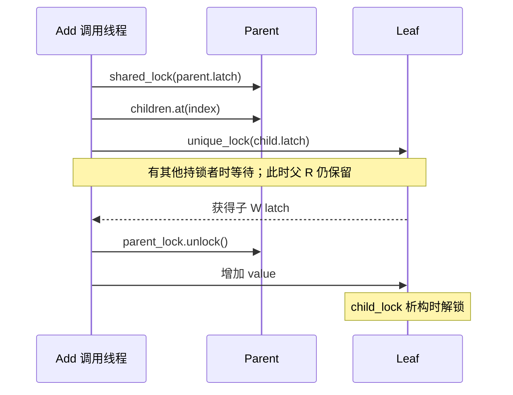

---
tags:
  - 高性能存储
  - 存储引擎
  - BusTub
  - BPlusTree
  - 并发编程
---
# 并发 B+Tree：Latch Coupling、Latch Crabbing 与锁顺序

> [!abstract] 实验目标
> 从“每个页加一把读写锁”走到可审查的并发协议：下降时为何必须重叠持有父子 latch，哪些祖先可以释放，发现叶页不安全时如何重启，如何保护 root page ID，以及 sibling、BPM 和 I/O 为什么会让一棵本来单线程正确的树死锁。

[[8.高性能存储/6. 存储引擎与索引/6.24 B+Tree 工程实现：Page Layout、Search、Split、Merge 与 Iterator|6.24]] 已经展开页布局与 split/merge。本篇给这些结构变化加上并发条件；它不重复所有数组平移。I/O 的请求/完成生命周期见 [[8.高性能存储/6. 存储引擎与索引/6.23 Disk Scheduler 与异步 Page IO|6.23]]。前批 **6.21 Buffer Pool Manager**、**6.22 Buffer Replacement** 仍待入库，此处保留前置名称而不制造未落地的 wiki-link。

## 1. 范围与命名：Coupling 和 Crabbing 不是两套互斥算法

本篇以 **Spring 2026 Project 2 Task 4**、Lecture 10 讲义为课程依据，并核对 BusTub 快照 **`c0a5431985287e258a6f25f53d822f0d0d2e63e8`**，核对日期 **2026-09-07**。本次没有取得可读的 Fall 2026 P2 正文，不能把旧学期说明改名当作其正式要求。[1][2][3]

课程直接使用 **latch coupling/crabbing** 这一组合称谓。共同思想是：**先取得父页保护，再取得子页保护，满足条件后释放已经不需要的祖先保护**。读路径通常只需父子之间的交接；写路径还要判断结构变化是否可能向上传播。[2]

本篇为教学先讲悲观写下降，再讲乐观下降和回退。**只做完悲观基线，不等于已经完成该学期明确要求的 optimistic latch coupling/crabbing。** 使用一把全树锁锁到操作结束也不能作为 P2 的最终并发实现。[1]

教材层面，*Modern Operating Systems* 的资源有序获取解释了为何要避免循环等待；DDIA 的 B-tree 一节解释了为什么原地页更新需要 latch。但具体到 BusTub 的 header guard、Context 和安全阈值，必须看课程与接口，不能只套通用锁排序口诀。[4][5]

## 2. 三种保护与两类正确性

### 2.1 Pin、页 latch、事务锁各自保护什么

| 机制 | 保护对象 | 不自动提供的性质 |
| --- | --- | --- |
| pin / I/O reservation | page 与 frame 的绑定、正在使用的内存 | 页内容不会被其他线程修改 |
| 页 latch / guard | 当前页的内存表示与短临界区 | 整个事务隔离、快照可见性、崩溃原子性 |
| 事务锁、范围锁、MVCC | 更高层的数据可见性与冲突规则 | 页内数组本身无需物理同步 |

Lecture 10 区分 physical correctness 与 logical correctness，重点讨论前者：不能读到失效指针或半完成的数据结构。[2] 但是一个实用索引仍需要正确实现查找/修改语义；不能因为“指针都有效”就接受更新丢失。

**没有数据竞争只是必要条件，不是完整语义证明。** 一棵使用 mutex 的树，也可能因 separator 错误而查错；一条不发生死锁的扫描，也不自动拥有事务一致快照。MVCC 是后续主题，不把本篇叫作“事务并发控制全部实现”。

### 2.2 “短期 latch”不意味着耗时永远很短

一次 `ReadPage()` 可能等待 frame、页 latch 或 I/O；某次结构变换又可能等待兄弟页。因此不能仅根据 latch 这个名称，假定临界区只有几十条 CPU 指令。

本篇不把某一种标准库 mutex 的具体实现时延当作固定常数。锁策略正确以后，应实际测量 latch 持有时间、等待时间以及其中的 I/O 成分。

## 3. 锁保护什么：先写一张责任表

以下是一种便于审查的**设计约定**，不是宣称 skeleton 已实现这些同步。

| 锁或使用权 | 主要保护 | 允许的典型动作 |
| --- | --- | --- |
| Header Page R/W guard | root page ID 及根入口的稳定性 | R 读取入口并与根页交接；W 发布新根/空树 |
| Internal Page R guard | 当前 keys 与 child IDs 的稳定读视图 | 在仍受保护的 child 关系上下降 |
| Internal Page W guard | child 数组、separator、size | split、merge、redistribution 的父层修改 |
| Leaf Page R guard | key/RID、tombstone、next 的稳定读视图 | 点查或当前页内扫描 |
| Leaf Page W guard | 当前叶页的全部修改 | 本地插入删除、与兄弟共同结构变化 |
| BPM 元数据锁 | page table、frame 认领、pin/evictable 协调 | 短时间保护驻留关系，不长期等待树页 latch |
| Replacer 锁 | 淘汰元数据 | 不反向调用树操作，也不做 I/O |

父 R latch 保证的是父页中的子关系不被需要父 W latch 的结构变更改掉；它**不意味着所有后代内容都被冻结**。子页仍可能有独立的局部更新，因此取得子 W latch 后必须重新搜索目标并判断 safe。

当前 `Context.write_set_` 是一组 guard，`header_page_` 是 optional 写 guard，`root_page_id_` 可用于本次操作的根判断。[3] 它不是全局锁表，也不是自动回滚管理器。

## 4. 点查：为什么“读出 child ID 就释放父锁”还不够

考虑线程 A 在父页中读出 child=P，释放父 guard，再去获取 P。间隙里线程 B 可能在父 W latch 下合并 P、删除父指针，并最终回收 P。A 保留的只是一个历史页号，不是继续访问旧结构的权利。

标准交接是：**持父 R → 读取 child ID → 固定并取得子 R → 释放父 R**。子 guard 成功之前，父保护不能随便消失。[2]



图里重叠持有两个 guard 的区间，是把父页指向的 child 关系安全转移为子页访问权的过程。pin 保持身份，latch 保持内容；只拿到其中一个都不能包办整件事。

对于长路径，逐层做这样的交接，不需要为了只读点查把整条祖先链一直 pin 到叶页。

## 5. 根入口也需要一次交接

### 5.1 普通点查从 Header 开始

一个可行协议是：取 Header Page 的 R guard，读取 root page ID；非空时，在仍持 Header R 的条件下取得根页 R guard，然后释放 Header R，再执行普通下降。

这样需要 Header W 的根替换不能插入到“读旧根号”与“固定旧根”之间。**只读一个 atomic root ID 再去锁旧根，仍存在旧根已经失去入口地位或被回收的问题。**

若采用不锁 Header 的入口读取，需要别的版本校验/重试和回收机制来证明正确性；那是另一套协议，不是免费省掉一次锁。

### 5.2 空树首次插入必须重新检查

两个线程可以同时看到空树。真正安装第一张叶页之前，要在具有修改 root 权限的条件下重新检查入口：只有一个线程能把自己的新叶页作为首根发布；另一个应使用已经建立的树，或释放未使用的新资源。

根分裂、根收缩、空树切换都修改 Header。不能拿到叶/旧根 W latch 之后，才临时反向申请 Header W；这会与 Header→Root 的正常下降形成锁环。

### 5.3 不要在已持锁路径上盲目调用 GetRootPageId()

一个便利 getter 可能内部再次取 Header 的 R guard。当前线程若已经持有该页的 guard，重复加锁可能死锁；若只持有根页后又回头取 Header，则可能逆序。

可以在入口得到并验证根号后放进本次 Context，在仍满足相应保护的条件下使用。Context 里的缓存是本次协议的状态，不是允许长期不加保护地缓存全局 root。

## 6. 悲观写下降：保留真正可能需要修改的祖先

### 6.1 基本过程

在可能修改根的路径上先取得合适的 Header 保护，向下取得节点 W latch。取得 child W 后，判断这次操作对 child 是否 safe：**如果 child 能独立消化本次更新或来自下一层的结构影响，就释放其全部已不需要的祖先，继续保留 child。** 否则保留祖先，继续下降。[2]

最后到达叶页，做本地更新；需要 split/merge 时沿仍持有的祖先向上传播。对已持有的父 W guard 直接修改，不是上行重新获取它。

### 6.2 Safe 的定义比 `size` 更重要

真正的判据是：**在当前保护下完成这次操作，不需要再修改已经准备释放的祖先。** 容量条件只是推导出的实现判据，还依赖是否会更新 parent separator、根入口、tombstone 和资源状态。

设 n 是当前物理 size，M 是配置 max_size，m 是自己实现的 min_size：

| 场景 | 常见充分条件 | 不能省略的前提 |
| --- | --- | --- |
| 查找 | 无写入，不触发结构变化 | 父子交接正确 |
| 采用“超过稳定容量 M 才 split”的叶插入 | `n < M` | 物理容量/分发策略支持；不是无条件允许写 C+1 |
| 采用课程推荐“叶插入后达到 M 即 split” | 对实际增加一项的操作：`n + 1 < M` | 不能把 `n < M` 当作不分裂保证 |
| 内部页消化一个新 child | 常见为 `n < M` | 内部 size 数 child slots；阈值与所选 split 策略一致 |
| 立即物理删除一个条目 | 常见为 `n > m` | 使用合法边界 separator，或已证明不需上改 |
| 新 tombstone 不触发物理清除 | 物理 n 不变，可有更宽松条件 | 检查队列容量、实际语义与根例外 |
| 重复插入/删除不存在记录 | 实际没有修改 | 在 W latch 下重新确认结果 |

上表不是统一可复制的 `IsSafe()` 实现。根只剩一个 child、叶根删除到空、tombstone 触发最旧物理删除，均需要专门判断。`GetMinSize()` 当前仍是待实现接口，取整与阈值必须和 6.24 中选择的结构规则对应。[1][3]

### 6.3 最小 key 变化：safe 条件的隐蔽例外

若父 separator 必须始终等于右子树最小 key，删除右叶页第一个 key 后，即使 n 仍超过 m，也可能需要修改父页，甚至继续把最小值变化传到更高层。

6.24 采用的**合法边界模型**允许 separator 不再出现在叶页中，只要范围关系仍正确；这种模型下，某些普通删除不必上改。两种不变量不能混用：一边检查 exact-min，一边用只看占用的 safe 释放父锁，会把矛盾写进实现。

### 6.4 为什么遇到一个 safe child 就能释放更高祖先

假设插入路径为 Root→A→B→Leaf：B 可能因 Leaf 分裂而增加一个 child；若 B 已被证明能吸收这一项而不需要父 A 变化，那么 A 和更高祖先不再属于本次结构变更的影响范围。**Safe 检查是在界定传播到哪一层停止，而不是判断这页是否“暂时没人用”。**

![[图片/SVG/8_6_6_25_1.svg|900]]

在图示路径上，Root、A 都未通过 safe 检查。图中三帧展示持锁集合的变化：A 不安全时保留 Header、Root、A；B 安全后释放它上方的祖先；随后 Leaf 分裂，只需要修改仍持有的 B。图里的 W 是本次操作持有的写 latch，不是节点的永久状态，也不代表该节点已持久化。

### 6.5 容器维护必须和逻辑路径一致

`write_set_` 应按已保护的路径管理，不能弹掉父 guard 之后还保存父页裸指针继续写。释放 safe child 之前的祖先时，应明确释放哪些 guard、Context 的 header optional 是否也需要 reset。

项目提示采用从 Header 向下释放；Lecture 10 则说明，在已经满足协议的条件下，释放顺序不是一般正确性的核心，但尽早释放高层更有利于并行。[1][2] **本笔记按项目的高层优先约定操作，不把通用 RAII 的逆序析构误称为课程要求。** 更关键的是“只释放已经不需要的页”，而不是任何情况下都先释放 Header。

## 7. 乐观写路径：读下降，叶写入，不安全则完整回退

### 7.1 为什么值得做

大多数更新未必都需要 split/merge。若每次写都从根开始拿 W latch，即使最终只修改一个叶页，也会增加根路径的独占竞争。乐观路径尝试用 R latch 下降，只在目标叶页取得 W latch；确认局部可处理才更新，否则重启悲观路径。[2]

这里的“乐观”不是不加锁读数组，也不是 C++ 数据竞争下的先读后校验。它仍然使用实际 R/W latch。

### 7.2 shared_mutex 没有自动的 R→W 原子升级

不能保持同页 ReadPageGuard，再调用 `WritePage(same_page_id)` 等待独占锁；自己的共享锁也在阻止独占锁被授予。课程还明确禁止同一线程重复获取同一个 read latch。[1]

一种易于证明的工程方案是：

1. 按读路径下降，在判断 child 为叶页时**保留直接父页 R guard**。
2. 放弃该叶页的临时 R guard，再获取该叶页 W guard；不要同时持同页 R 与 W。
3. 取得 W 后重新搜索 key、检查删除状态与 safe；R→W 的间隙可能有局部内容变化。
4. Safe 则释放父 R，只做已经证明不需要祖先修改的操作。
5. Unsafe 则不修改页，释放当前所有 guard，从 Header 重新按 W 路径下降。

保留父 R，使需要父 W 的结构变化无法在叶页 latch 转换间隙把该 child 关系移除。若根本身是叶页，可把 Header 视为这次入口交接的父层，保留其 R 权限；发现需要根变化则释放后重新以 Header W 开始。

这是结合标准 guard 接口的一种实现推导，课程没有替你写好“原子升级”函数。其他方案可以用页代际/范围验证后重试，但必须说明如何处理结构变化和回收。

### 7.3 回退之前不能留下部分修改



回退释放的是本次操作仍然持有的全部保护，而不是只释放一个叶 latch 就拿旧 Context 继续走。**不能先删了 entry，发现要 merge 时再“无痕重试”**；没有 undo 机制，第一次的半成品不会自动消失。

## 8. Sibling：从树形依赖进入横向依赖

### 8.1 父 W 锁不够解决扫描与合并的相互等待

设扫描线程 A 持有左叶 L 的 R latch，准备向右取得 R 的 R latch；删除线程 B 已持有 parent W 和右叶 R 的 W latch，准备合并，等待左叶 L 的 W latch：

`A：持 L，等 R`；`B：持 R，等 L`。

这就是锁环。B 已经独占 parent，也只能阻止新的父层结构竞争，无法让 A 已经持有的叶 latch 自动消失。

### 8.2 “统一从左到右”需要真的做到

一个线程已经沿搜索路径持有右页时，再规定“现在从左到右获取”并不会消除它已经拿着的右锁。需要在安全条件下释放/重试，重新取得符合顺序的保护，或采用明确的 no-wait 方案。

按 page ID 大小排序也不是树上的顺序。根分裂会分配一个较新的父页，它的 ID 可能比所有旧 child 都大；内存或磁盘分配先后不定义树的父子关系。

### 8.3 No-wait/restart 的适用边界

Lecture 10 对横向 leaf scans 给出 no-wait 思路：尝试取得 sibling latch，失败就迅速释放已有保护并重启，避免在持当前叶页时阻塞等待另一个叶页。[2]

这要求实现者能够表达“尝试加锁失败”，并且**在失败点之前没有无法回滚的公开修改**。若已经部分移动 entry 或更新 next，再直接丢锁重试，会把结构暴露为半完成状态。保守做法是在变换前完成相关 guard/资源的获取。

Spring 2026 P2 说明没有测试并发 leaf scan；它同时提示完整并发扫描需要处理 sibling latch 获取失败。[1] 本篇据此划分测试范围，不把“不测”当成“线程安全已自动成立”。

### 8.4 CheckedReadPage 不是 TryReadPage

`CheckedReadPage` / `CheckedWritePage` 的 optional 失败用于无法把页带入内存等资源条件，不代表页 latch 采用 try-lock。它们仍可能等待锁。[3]

因此不能把 `if (auto g = CheckedReadPage(next))` 当成已经实现 no-wait 扫描。要支持真正的 try acquisition，需要额外设计：先固定页身份，在正确的锁层次下尝试页 latch，失败时归还 pin、恢复资格并交付失败；还要区分“页在加载”与“锁被占用”。这不是当前公开 guard API 的现成功能。

### 8.5 重启扫描不自动给出快照

一个扫描释放所有保护后从上次 key 继续，必须定义重复与漏读语义。即使保存最后返回的 key 并从其后恢复，也只能避免某些重复；并发插入/删除与事务可见性仍需更高层规定。

不要把一次点查的受锁保护与一个跨多页长扫描的一致快照画等号。后者应与 [[8.高性能存储/6. 存储引擎/6.15 Snapshot 与 Sequence Number|Snapshot 与 Sequence Number]] 中的版本边界区分理解。

## 9. 跨层死锁：树页锁与 BPM mutex 的 ABBA

### 9.1 一个真实会遇到的等待环

树线程 A 已持有 Leaf L 的 W guard，因为分裂需要读/新建另一页，于是调用 BPM；另一个线程 B 已拿 BPM 元数据锁，又在取 L 时拿着它等待 L 的 W latch：



这个反例解释了为什么“树始终自顶向下加锁”仍不够：BPM mutex 不在树拓扑里，却参与了同一张等待图。

### 9.2 pin 后释放 BPM 锁，再等待内容 latch

一种基本解法是：在 BPM 锁内完成映射查找/准备、为本次访问建立 pin 或 reservation、更新 evictable；释放 BPM 锁以后才去等待页 latch。等待失败或异常时，按协议回退本次 reservation。[3]

与此同时，树页 guard 释放 pin/资格时也要遵循统一锁层次。Replacer 不应反向调用持有树页锁的用户逻辑；DiskScheduler 的完成路径不应无说明地回调需要当前等待线程所持锁的代码。

这里不是说“任何时候都不能同时拿两把锁”。要求是**把可能阻塞的边、资源生命期和反向调用一起画进等待图，证明不存在循环**。

### 9.3 I/O 等待与 buffer-pool 耗尽也要算进去

持祖先 guard 时取 child 可能发生 I/O，前提是完成路径不依赖这些 guard 才不会自锁；即使无死锁，长时间占住高层锁也会影响并发性能。

多个线程各 pin 一条长路径，还可能耗尽固定 buffer pool。对 Checked 失败，应在尚未公开修改或具备回滚能力的条件下安全退出/重试；无限等待自己持有的 pin 被别人释放没有意义。

不应靠无限扩容或绕过 pin 规则“解决”资源不足。记录每次操作的峰值 pin 数，确认错误路径和 Context 释放能够回收使用权。

## 10. 页回收：解除树上链接，不等于可以立刻复用页号

merge 时 R 被移出 parent 和叶链，并不代表当前没有线程或 I/O 仍使用它。一个完整协议要让旧访问结束，然后才能归还物理资源；否则旧读者可能访问到同一页号或同一 frame 的新用途。

标准耦合路径通过持有父保护再取得子使用权，限制“拿旧 ID 的未保护窗口”；更复杂的乐观读、并发扫描或延迟访问仍可能需要额外的代际验证与延迟回收。[2][3]

`shared_ptr<FrameHeader>` 只保证对象不析构，不保证里面仍是原页。BPM 的 DeletePage 返回失败时，应有明确的错误/延迟回收处理，不能假定“树里不引用它了，强制删一定安全”。

本篇并不引入一套已经实现的 epoch/hazard-pointer 子系统。需要这些机制的优化应单独设计，不要混入基础课程协议却省略回收证明。

## 11. 独立 C++17 模型：看见父子 latch 的交接窗口

以下模型只有 Parent→Leaf 两层固定拓扑，**不支持 split、merge、淘汰或 page ID 回收**。它用于验证读/写线程通过共享父锁取得子对象，再取得子 latch，最后释放父锁；不是完整并发 B+Tree，更不是可直接替换 BusTub 的代码。

### 11.1 页外对象与生命期

这些是普通堆对象，智能指针只管理模型中的对象生命期。BusTub 的磁盘页不应该存放这种 mutex/shared_ptr 结构。

```cpp
#include <array>
#include <cassert>
#include <cstddef>
#include <future>
#include <iostream>
#include <memory>
#include <mutex>
#include <shared_mutex>
#include <stdexcept>

// 只有固定两层拓扑，没有页淘汰、分裂、合并；仅验证锁交接。
struct Leaf {
  std::shared_mutex latch;
  int value{0};
};
struct Parent {
  std::shared_mutex latch;
  std::array<std::shared_ptr<Leaf>, 2> children{
      std::make_shared<Leaf>(), std::make_shared<Leaf>()};
};
```

### 11.2 先拿子锁，再放父锁

Add 在父 R 下读取子对象，再获取子 W；因为本模型没有结构变化，已知只需局部修改。Read 用 R→R 交接并返回数据副本，避免把引用暴露到 latch 之外。

```cpp
void Add(Parent &parent, std::size_t index) {
  std::shared_lock<std::shared_mutex> parent_lock(parent.latch);
  auto child = parent.children.at(index);    // 在父锁内读取并取得对象所有权。
  if (!child) throw std::logic_error("missing child");
  std::unique_lock<std::shared_mutex> child_lock(child->latch);
  parent_lock.unlock();                     // 子锁已拿到，才释放父锁。
  ++child->value;                            // 本例已知无需修改父节点。
}                                           // RAII 释放子节点的独占锁。
int Read(Parent &parent, std::size_t index) {
  std::shared_lock<std::shared_mutex> parent_lock(parent.latch);
  auto child = parent.children.at(index);
  if (!child) throw std::logic_error("missing child");
  std::shared_lock<std::shared_mutex> child_lock(child->latch);
  parent_lock.unlock();
  return child->value;                       // 返回值副本，不暴露锁外引用。
}
```



图中父共享锁与子独占锁可以重叠，因为它们是**两个不同的对象**；这不是在同一个 shared_mutex 上同时取得 R 和 W。

### 11.3 并发测试

两个任务共完成 20,000 次更新，同时执行读取。`std::launch::async` 明确要求异步执行；future 用来等待和传播任务异常。Parent 比 future 更早构造，因此在这些任务结束前保持存在。[6]

```cpp
int main() {
  Parent parent;                             // 比下面的异步任务活得更久。
  constexpr int iterations = 10000;
  auto write = [&parent] {
    for (int i = 0; i < iterations; ++i) Add(parent, 0);
  };
  // 显式 async：不接受 deferred 执行；future 负责等待和传播异常。
  auto first = std::async(std::launch::async, write);
  auto second = std::async(std::launch::async, write);
  for (int i = 0; i < iterations; ++i) {
    const int value = Read(parent, 0);
    assert(value >= 0 && value <= 2 * iterations);
  }
  first.get();
  second.get();
  assert(Read(parent, 0) == 2 * iterations);
  assert(Read(parent, 1) == 0);
  std::cout << "latch_handoff: PASS (20000 updates)\n";
}
```

编译运行：

```bash
g++ -std=c++17 -Wall -Wextra -Werror -pthread latch_handoff.cpp -o latch_handoff
./latch_handoff
```

输出 `latch_handoff: PASS (20000 updates)`。这个测试可以验证示例的无丢失更新与锁交接，不验证真正树的重构、扫描恢复或完整线性一致性；运行一次通过更不能证明不存在所有可能的并发交错。

## 12. 把并发测试从“循环跑很多次”升级为确定的交错

### 12.1 应当刻意制造哪些窗口

| 场景 | 控制点 | 重点检查 |
| --- | --- | --- |
| 两线程首次插入空树 | 同时观察空入口，然后争取 Header W | 不产生两个可见根；失败分配不泄漏 |
| 点查与叶 split | 点查已读父 child ID，但尚未完成子交接 | 父保护没有提前消失 |
| 乐观到悲观回退 | 叶 R 释放、叶 W 尚未取得 | 重新搜索；unsafe 不带半完成修改回退 |
| 同 key 并发插入 | 两线程都尝试插同一 key | 唯一性与返回值一致，不产生两个 live entry |
| 两方向删除/借位 | 一个线程持左页，另一个持右页 | sibling 协议无循环等待 |
| 根 split/collapse 与新点查 | root ID 即将发布 | reader 不从已失效入口开始 |
| 页锁与 BPM mutex | 树线程持页锁，另线程取同页 | BPM 不持元数据锁等待该 latch |
| 小 buffer pool | 多条路径同时被 pin | Checked 失败正确收尾，pin 不泄漏 |
| 扫描遇到全 tombstone 叶页 | iterator 跨连续无有效记录页 | 不漏后续页、不无限循环；另查并发边界 |

使用测试专用 barrier、condition variable 或 promise 控制顺序，不用 sleep 充当同步。不要为了触发错误而在同一线程重复锁一个非递归锁，然后把程序永久卡死；可用 watchdog 记录线程栈、持锁关系和当前页号，超时后终止该测试进程。

### 12.2 race detector、sanitizer 与参考模型各自的边界

AddressSanitizer 能帮助发现越界和释放后使用，但不能普遍发现“frame 对象还活着、却已换成别的页”的语义错误。ThreadSanitizer 用于检测其覆盖执行中的数据竞争；不保证检测所有锁环，也不保证索引逻辑正确。

参考 `std::map` 可以对比最终逻辑结果，但对完全并发的混合操作，需要定义操作历史的合法顺序；只把最终集合排个序，不能检查中间返回值是否符合线性化要求。

若要验证更强语义，可记录每次调用/返回区间及返回结果，对小历史做合法串行化检查。**本篇没有把普通多线程压测结果称为形式化证明。**

### 12.3 官方测试入口与最终验收

```bash
# 在自己已实现的 BusTub 工作树中；不表示本文已运行完整项目。
cmake -S . -B build -DCMAKE_BUILD_TYPE=Debug
cmake --build build --target b_plus_tree_concurrent_test -j2
./build/test/b_plus_tree_concurrent_test --gtest_list_tests
./build/test/b_plus_tree_concurrent_test --gtest_also_run_disabled_tests
```

先把全部单线程页操作与 tombstone 测试过完，再排查并发；否则一个稳定的 split 算法错误也会在压测中表现得像 race。P2 的公开测试只是覆盖子集，特别是并发 leaf scan 的限制需要单独记在实验报告里。[1]

## 13. 性能优化不能靠省略协议条件

在正确基线之上，观察乐观路径成功率、回退次数、各层 W latch 持有时间、sibling try-lock 失败率、峰值 pin 数和 I/O 等待。热点都集中在一个叶页时，根锁优化未必解决真正瓶颈。

无死锁不等于无饥饿。高竞争下不停失败重试可能成为 livelock；读写锁的公平性也不能仅根据类名推断。*Modern Operating Systems* 对 deadlock、livelock、starvation 分开讨论，代码和监控也应分开。[4]

不要为提高吞吐，在没有同步的情况下读写普通页数组后声称“稍后版本号校验能补救”；C++ 数据竞争不是可用算法步骤。真正的乐观无锁读需要合法的数据访问与回收协议，不是把 latch 删除而已。

## 14. 完成后应能解释的五句话

**第一，父子 latch 重叠是访问权的交接。第二，safe 是祖先不再需要修改，不只是一个 size 判断。第三，向上修改已持有的祖先，不等于向上重新加锁。第四，横向 sibling 与 BPM mutex 必须进入同一张等待图。第五，页的结构正确、并发操作正确和事务/崩溃正确属于不同的验收层次。**

这五条能从具体执行路径讲清楚，才算掌握了 BusTub 并发 B+Tree 的基础，而不只是记住“读锁、写锁、从上往下”。

## 15. 参考资料与验证口径

[1] CMU 15-445/645，**Spring 2026**，Project #2 — B+Tree，Task #4、Requirements and Hints、Common Pitfalls；访问 2026-09-07。包括 optimistic crabbing 要求、禁止全树锁、重复 read latch 警告、leaf scan 测试范围。https://15445.courses.cs.cmu.edu/spring2026/project2/

[2] Andy Pavlo，CMU 15-445/645 Spring 2026，Lecture 10 — Index Concurrency Control，讲义 §1–2、§5，PDF 第 1、4–5 页：locks/latches、physical correctness、safe、basic/optimistic coupling 与 no-wait 扫描。https://15445.courses.cs.cmu.edu/spring2026/notes/10-indexconcurrency.pdf

[3] CMU Database Group，BusTub，提交 **`c0a5431985287e258a6f25f53d822f0d0d2e63e8`**：`src/include/storage/index/b_plus_tree.h` 中 Context，`src/include/storage/page/page_guard.h`，`src/include/buffer/buffer_pool_manager.h`，以及 `src/storage/page/b_plus_tree_page.cpp` 中尚待实现的 min_size。https://github.com/cmu-db/bustub/tree/c0a5431985287e258a6f25f53d822f0d0d2e63e8/src

[4] Andrew S. Tanenbaum、Herbert Bos，*Modern Operating Systems*，第 4 版，2015，§6.1.2、§6.6.4（印刷页 457–458）、§6.7.3–6.7.4：资源获取、消除循环等待、livelock 与 starvation。用于一般同步原理，不冒充 BusTub 的具体树协议。

[5] Martin Kleppmann，*Designing Data-Intensive Applications*，第 1 版，2017，第 3 章，印刷页 82–83：原地 B-tree 更新的 latch 与结构一致性背景。书中没有给出本篇的 Header/Context 完整锁顺序。

[6] Scott Meyers，*Effective Modern C++*，第 1 版，2014，Items 36–39：异步启动策略、线程/future 生命周期与一次性通信；第 11 节是独立 C++17 演示，不是教材代码的复制。

**工程推导范围**：入口交接、保留父 R 的叶 latch 转换方案、safe 判据细化、BPM 交叉锁环与测试窗口，是根据课程协议及接口建立的设计分析。独立两层模型已编译运行；没有验证完整 BusTub 并发树、并发扫描或全部可能的执行历史。
