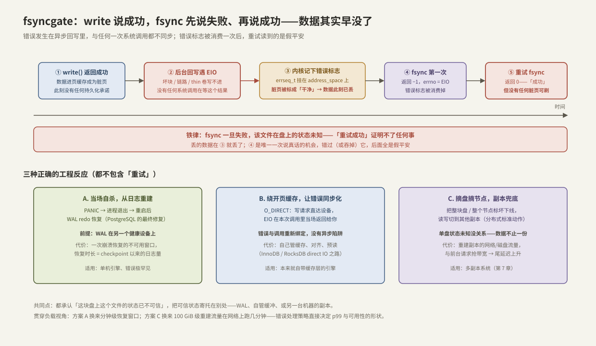

# fsyncgate 与 EIO 处理

> [[6.1 WAL 与 Crash Consistency]] 和 [[6.2 Group Commit]] 把提交点全部押在一次 `fdatasync` 上，默认它要么成功、要么诚实地失败。2018 年 PostgreSQL 社区发现这个默认错了：**fsync 失败一次之后，重试会「成功」，而数据已经丢了**——这就是 fsyncgate。它不是 PostgreSQL 的 bug，而是 Linux 页缓存错误上报机制与几乎所有数据库的假设之间的裂缝，MySQL、MongoDB 当年同样中招【事实/历史】。本篇从操作系统机制讲起：错误为什么和调用解耦、内核如何记账、事故如何发生，然后给出三种正确的工程反应，并用错误注入亲手复现一次「假成功」。
>
> **贯穿负载**（本章 6.3–6.5 共用）：推理平台的元数据 KV——1 亿键、值 ~1 KiB（全量 ~100 GiB）、读写 9:1（峰值 9 万读/s + 1 万写/s）、p99 < 1 ms、单盘 NVMe、异步复制到一台备机。本篇的问题是：这台机器的盘开始报 EIO 时，怎样的反应不丢数据、少伤 p99。

前置：[[1.2 Page Cache 命中与未命中]]（脏页与后台回写——错误就发生在回写里）、[[1.4 fsync fdatasync 与持久化语义]]（fsync 的承诺范围与 §5 的铁律，本篇是它的完整展开）。

---

## 1. 错误从哪来：写入与失败在时间上是解耦的

先复习 buffered write 的时序【事实】：`write()` 把数据抄进页缓存、标脏、立刻返回成功——**此刻设备还没参与**。真正的写盘发生在几秒后的后台回写（writeback）线程里，或者你调用 fsync 时。

于是 EIO（介质坏块、链路故障、RAID 降级、thin-provisioned 卷底层没空间了【实现】）有一个别扭的属性：**它发生的那一刻，没有任何一次系统调用在等待结果**。回写是内核自己发起的异步 IO，bio 完成回调里拿到错误时，当初那个 `write()` 早就带着「成功」返回好几秒了。错误只能被**记下来，等下一个来问的人**。

这与网络编程里熟悉的模式同构：`send()` 返回成功只代表数据进了内核发送缓冲区，对端 RST 会在之后的某次调用里以 `EPIPE` 冒出来——**缓冲层把「提交」与「结果」拆成了两个时刻**。存储比网络更隐蔽的地方在于：问的人（fsync）可能很久才来一次，而且——如下节所见——答案只说一遍。

---

## 2. 内核怎么记账：错误说一遍，脏页变「干净」

回写失败时，内核做两件事【事实】：

1. **在文件的 `address_space` 上记一个错误标志**（4.13 起用 `errseq_t` 序列号机制【实现】），等 fsync/fdatasync 来取；
2. **把写失败的脏页标记为干净**——内核不会无限重试回写（坏设备会让脏页堆积、拖垮内存回收），标干净意味着这些页随时可被回收。**数据在这一刻已经丢了**，比任何人知道这件事都早。

然后是错误的交付规则，fsyncgate 的全部机关都在这里【事实】：

| 内核版本 | 交付语义 | 坑 |
| --- | --- | --- |
| 4.13 之前 | 错误标志是一次性的：第一个调 fsync 的进程拿到 EIO，标志清除 | 错误可能被**无关进程**领走；你的 fsync 返回 0 |
| 4.13+（errseq_t） | 每个**打开着的 fd** 都能看到一次错误 | 错误发生**之后**才 open 的 fd，看不到它【事实】 |

把两条规则拼起来，「假成功」的完整时序就是（对照下图上半）：



fsync 第一次返回 EIO 时，可刷的脏页已经没了（被标干净）、错误标志被这次调用消费；重试 fsync 面对的是一个「没有脏页、没有未交付错误」的文件——返回 0 是内核视角的诚实描述，却是应用视角的弥天大谎。

**推论【事实】**：`fsync` 返回 EIO 之后，该文件在盘上的内容处于未知状态——哪些页写成了、哪些没写成、页缓存里对应内容还在不在，一概不可知。**「重试直到成功」这个在网络编程里的美德，在这里是数据丢失的帮凶。**

---

## 3. 事故还原：PostgreSQL 为什么中招

PostgreSQL 的 checkpoint 逻辑（简化）【事实/历史】：后台进程周期性地把共享缓冲区的脏页 `write()` 出去，然后逐文件 fsync；**如果 fsync 失败，报个错，下轮 checkpoint 重试**——重试成功，就认为这些页已持久化，于是**截断 WAL**（[[6.1 WAL 与 Crash Consistency]] 的 checkpoint 规则：日志已应用的部分可以回收）。

三连击就此成型：

1. 回写失败，数据页丢在半路，脏页被标干净；
2. 下轮 checkpoint 的 fsync「成功」（假平安），PostgreSQL 判定数据已落盘；
3. WAL 被截断——**兜底的日志也没了**。此后崩溃恢复无从谈起，损坏静默扩散。

雪上加霜的细节【事实】：checkpointer 与真正执行 `write()` 的后端是不同进程，各自持有各自的 fd，甚至在错误发生后才 open 文件——在老内核语义下可能**从头到尾没人收到过那个 EIO**。触发场景多为 NFS/thin 卷的空间耗尽与多路径抖动，2018 年被逐步梳理清楚后，PostgreSQL 的最终修复干脆利落：**fsync 失败一律 PANIC**——进程自杀，用 WAL 从上一个确定安全的点重放恢复【事实/历史】。这也是 [[1.4 fsync fdatasync 与持久化语义]] §5 那条铁律的出处。

---

## 4. 三种正确的工程反应：都不含「重试」

对照上图下半。三种策略的共同点：**承认这块盘上这个文件已不可信，把可信状态寄托在别处**。

| 策略 | 可信状态在哪 | 代价（贯穿负载视角） | 采用者 |
| --- | --- | --- | --- |
| A. PANIC + 日志重建 | 另一设备上的 WAL | 一次崩溃恢复的不可用窗口：恢复时长 ≈ 上个 checkpoint 以来的日志量【量级】 | PostgreSQL |
| B. O_DIRECT 同步化 | 自管缓冲区 + 当场拿到的错误 | 自己实现缓存/对齐/预读（[[1.3 Buffered IO 与 O_DIRECT]]）；错误处理逻辑简单了，IO 栈复杂了【取舍】 | InnoDB、RocksDB（direct IO 模式） |
| C. 摘盘/摘节点 | 其他机器上的副本 | 重建流量：备机接管 + 100 GiB 级数据在网络上重灌【量级】 | 分布式存储（[[7.1 副本 vs EC]]） |

**B 的机制值得单独讲透**【事实】：O_DIRECT 写绕过页缓存，IO 完成状态在**本次调用内**返回——错误与调用重新绑定，第 1 节的「解耦」根源被消除。这是数据库偏爱 direct IO 的一个常被忽略的理由：不只是为了绕缓存拷贝，更是为了**错误语义的同步性**。但注意边界：文件元数据仍走日志/页缓存，fsync 仍不可省，其失败仍要按本篇处理【事实】。

**因果链算账（贯穿负载）**：策略选择直接塑造尾延迟与网络的形状——

- 选 A：错误极罕见时最划算；但恢复窗口内服务不可用，需要上游重试兜底。恢复时长受 checkpoint 间隔控制——间隔越短窗口越小，运行时刷脏页 IO 越重（[[6.1 WAL 与 Crash Consistency]] 的取舍再现）；
- 选 C：可用性最好（切备机秒级），代价转移到网络——100 GiB 重建在 25 GbE 上理论几十秒，实际必须限速，否则重建流抢走前台带宽，**活着的副本 p99 先被打穿**【实践】。「摘除比故障更伤」的雪崩模式见 [[10.6 健康检查与故障摘除]]；
- 任何策略下，**EIO 都应触发告警并视为盘的死刑预告**：一次介质错误后该盘的错误率通常只升不降【实践】。

---

## 5. Modern C++：把铁律写进类型

错误处理策略必须在代码层不可绕过。两个要点：同步失败即终止（或进入只读态）；`close` 也要查——它可能交付最后一批回写错误【事实】。

先看反面教材，这就是 fsyncgate 的用户态复刻：

```cpp
// ❌ 网络编程的好习惯,存储里的数据粉碎机
bool try_sync(int fd) {
    for (int i = 0; i < 3; ++i) {
        if (::fdatasync(fd) == 0) return true;   // 第二次循环拿到的 0 是假平安
    }
    return false;
}
```

正确形态——失败路径不给调用方任何「继续」的选项：

```cpp
#include <unistd.h>

#include <cerrno>
#include <cstdio>
#include <cstdlib>
#include <cstring>

// EIO 后进程状态不可信:打日志后立即终止,交给重启 + WAL 恢复(策略 A)
[[noreturn]] void storage_panic(const char* what, int err) noexcept {
    std::fprintf(stderr, "FATAL: %s: %s — file state unknown, aborting\n",
                 what, std::strerror(err));
    std::abort();          // 不抛异常:不给任何 catch(...) 吞掉它的机会
}

void commit_or_panic(int fd) {
    if (::fdatasync(fd) != 0) storage_panic("fdatasync", errno);
}

// close 是最后一个可能交付回写错误的出口——RAII 析构里也不能默默忽略
class SyncedFile {
public:
    explicit SyncedFile(UniqueFd fd) : fd_{std::move(fd)} {}
    void commit() { commit_or_panic(fd_.get()); }
    ~SyncedFile() {
        if (fd_.valid() && ::close(fd_.release()) != 0) {
            storage_panic("close", errno);
        }
    }
private:
    UniqueFd fd_;
};
```

**关键点**：

- 用 `std::abort` 而非异常【取舍】：异常可能被上层「兜底 catch」吞掉——fsyncgate 教的第一课就是错误信号会被中间层消化掉；对必须终止的场景，把「不可继续」编码成控制流上的死路；
- 分布式场景（策略 C）把 `storage_panic` 换成「本盘标坏 + 上报控制面 + 拒绝后续写」的只读降级即可，原则不变：**该错误之后的任何本地「成功」都不再作数**；
- `sync_file_range` 不在此列【事实】：它只发起回写、不与错误上报机制集成，也不刷元数据、不发设备 FLUSH——它是回写节流工具，不是 fsync 的轻量替身。

---

## 6. 动手验证：亲手制造一次「假成功」

用 device-mapper 的 `error` 目标做确定性错误注入（root、专用测试机；这正是 [[6.10 崩溃注入测试]] 的最小雏形）：

```bash
# 底座:1 GiB 镜像文件 → loop 设备 → dm-linear
truncate -s 1G /var/tmp/disk.img
DEV=$(losetup -f --show /var/tmp/disk.img)
SIZE=$(blockdev --getsz "$DEV")
dmsetup create victim --table "0 $SIZE linear $DEV 0"
mkfs.ext4 /dev/mapper/victim && mkdir -p /mnt/victim
mount /dev/mapper/victim /mnt/victim

# 写入数据(进页缓存即返回)
dd if=/dev/urandom of=/mnt/victim/data bs=1M count=64

# 注错:把整个设备换成 error 目标——之后所有 IO 都失败
dmsetup suspend victim
dmsetup load victim --table "0 $SIZE error"
dmsetup resume victim

# 连续两次 fsync,观察返回值(-yy 显示 fd 对应路径)
strace -yy -e trace=fsync -f sh -c \
  'python3 - <<PY
import os
f = os.open("/mnt/victim/data", os.O_RDONLY)
for i in (1, 2):
    try: os.fsync(f); print(i, "fsync -> 0")
    except OSError as e: print(i, "fsync ->", e.errno, e.strerror)
PY'

# 复原并收尾
dmsetup suspend victim
dmsetup load victim --table "0 $SIZE linear $DEV 0"
dmsetup resume victim
umount /mnt/victim; dmsetup remove victim; losetup -d "$DEV"
```

判读【实践】：

- 典型输出：第一次 fsync 报 EIO（唯一一次真话），第二次返回 0（第 2 节的假平安）。复原后读 `data`，内容与写入不一致——数据确实丢了；
- 具体表现随文件系统与挂载选项变化【前提】：ext4 遇元数据错误可能直接 remount 成只读（`errors=remount-ro`），此时第二次报 EROFS 而不是 0——这是文件系统在替你兜底，别把它当成「内核修好了」；
- 想复现「后 open 的 fd 看不到错误」：注错触发回写失败之后再另开一个 fd，对比两个 fd 的 fsync 返回值。

---

## 7. 陷阱与误区

> [!warning] 常见错误
> 1. **fsync 失败后重试**：重试面对的是「脏页已标干净 + 错误已消费」的文件，返回 0 不代表任何东西——本篇全部内容浓缩成这一条。
> 2. **把错误处理写成 `if (ret != 0) log_warn(...)` 然后继续**：日志一打，控制流照旧，等价于没处理。EIO 之后唯一合法的去向是终止、只读降级或摘盘。
> 3. **忽略 close 的返回值**：close 可能交付最后的回写错误；RAII 析构里静默 close 是最常见的漏点。
> 4. **认为 O_DIRECT 免疫本篇问题**：数据路径的错误确实同步了，但元数据与日志仍经文件系统，fsync 依旧必要、其失败依旧致命。
> 5. **用 `sync_file_range` 当轻量 fsync**：它不与错误上报集成——只是回写节流工具。
> 6. **「企业盘有电容就不会有 fsyncgate」**：电容消除的是「掉电丢写缓存」（[[1.4 fsync fdatasync 与持久化语义]] 闸门三），EIO 是介质/链路层错误——两个不同层的故障，互不豁免。
> 7. **测试环境从不注错**：EIO 路径是典型的「一年走一次、一次定生死」的代码——不用 dm-error/dm-flakey 逼它执行，它第一次执行就在生产。

---

## 8. 关键结论

| 结论 | 性质 |
| --- | --- |
| buffered write 把提交与结果拆成两个时刻：EIO 发生在异步回写里，只能被记账等人来取 | 事实 |
| 回写失败时脏页被标干净——数据在任何人察觉之前已经丢了 | 事实 |
| 错误标志一次性交付（4.13+ 按 fd 各一次；错误后新开的 fd 看不到）：重试 fsync 的 0 是假平安 | 事实 |
| fsyncgate = 假平安 + 「fsync 成功即可截断 WAL」的合理推理 → 兜底日志被销毁 | 事实/历史 |
| 三种正确反应：PANIC+WAL 重建、O_DIRECT 错误同步化、摘盘副本兜底——共同点是不信任本地「成功」 | 实践结论 |
| O_DIRECT 的隐藏价值是错误语义同步；但元数据路径不豁免 | 事实 |
| 策略选择塑造系统形状：A 用恢复窗口换简单，C 用网络重建流量换可用性——重建必须限速否则打穿存活副本 p99 | 取舍 |
| EIO 路径必须用错误注入测试；close 返回值必须检查 | 实践结论 |

---

## 关联知识

- [[1.4 fsync fdatasync 与持久化语义]] - 铁律的第一次出场；本篇是它的机制展开
- [[1.2 Page Cache 命中与未命中]] - 脏页与异步回写：错误藏身的地方
- [[1.3 Buffered IO 与 O_DIRECT]] - 策略 B 的机制基础
- [[6.1 WAL 与 Crash Consistency]] - PANIC 之后靠什么活过来；checkpoint 截断为何危险
- [[7.1 副本 vs EC]] - 策略 C 的冗余从哪来
- [[10.6 健康检查与故障摘除]] - 摘盘摘节点的控制面视角：摘除风暴比故障本身更伤
- [[6.10 崩溃注入测试]] - dm-error/dm-flakey 的系统性用法
