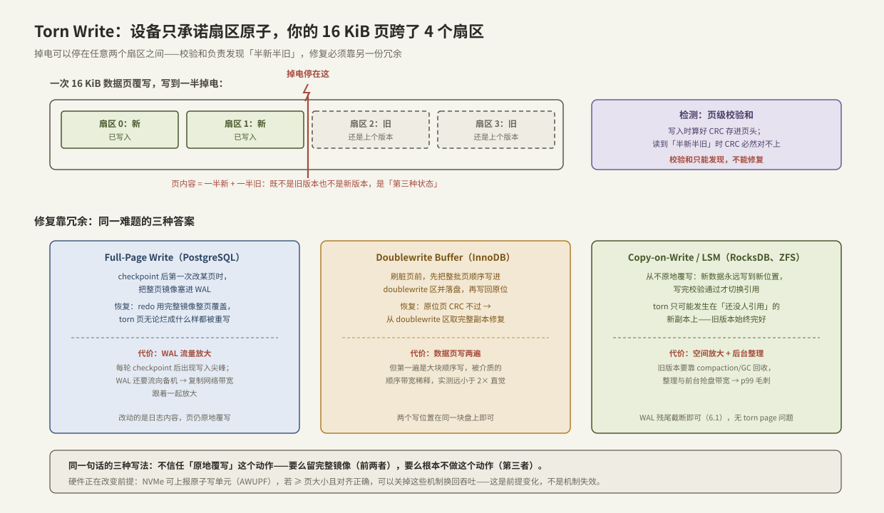

# Torn Write 与 Checksum

> [[6.1 WAL 与 Crash Consistency]] 留了两个「写半截」的窗口：日志残尾（W2）与数据页半新半旧（W5）。前者截断即可，后者才是硬骨头——**已提交数据所在的页被撕裂了，丢弃不合法，必须修复**。本篇把问题追到根上：设备到底承诺多大单位的原子写？一次 16 KiB 的页覆写在 OS 与设备层被拆成了什么？然后按「检测靠校验和、修复靠冗余」的框架，对比工业界三种答案（full-page write、doublewrite、copy-on-write），并算清它们各自向 CPU、WAL 流量与复制网络转嫁了什么成本。
>
> **贯穿负载**（承接 [[6.3 fsyncgate 与 EIO 处理]]）：1 亿键 × 1 KiB 的元数据 KV，读写 9:1，NVMe 单盘 + 异步复制备机。本篇的问题是：9 万读/s 下每次读都验校验和要花多少 CPU？选哪种 torn 防护，复制到备机的流量会差多少？

前置：[[6.1 WAL 与 Crash Consistency]]（崩溃窗口 W2/W5 的来历）、[[1.7 块层与 blk-mq]]（一次写怎么被拆成多个 bio/命令）、[[3.4 SSD FTL 与地址映射]]（设备内部还要再拆）。

---

## 1. 原子性的真实单位：比你的页小得多

**事实层**：存储设备的写原子性以**扇区**为单位——传统 512 B，现代盘 4 KiB（物理扇区）。「扇区写要么全成要么全不成」是全行业的工作假设【事实/前提】（严格说这也是「掉电安全覆写」假设，极端硬件故障下连它都可能破，那一层交给端到端校验和兜底）。

**你的写单位比这大**。存储引擎的页典型 8 KiB（PostgreSQL）/ 16 KiB（InnoDB），一次逻辑页写在到达介质前经过多级拆分【事实】：

1. **OS 层**：页缓存按 4 KiB 管理，一次 16 KiB 覆写是 4 个页缓存页；块层可能把它们打包成一个 bio，也可能拆开、与别的 IO 交错调度（[[1.7 块层与 blk-mq]]）；
2. **设备层**：NVMe 命令到了盘上，FTL 还要按内部条带/通道再拆（[[3.4 SSD FTL 与地址映射]]），多通道并行写入意味着**完成顺序与提交顺序无关**；
3. **掉电可以停在任何两个扇区之间**。

结果就是 **torn write（撕裂写）**：重启后那 16 KiB 里，扇区 0–1 是新版本、扇区 2–3 是旧版本——**既不是旧页也不是新页，是逻辑上不存在的第三种状态**。



与 W2（日志残尾）的本质区别【事实】：残尾属于**未提交**数据，截断 = 正确语义；torn page 属于**已提交**数据（提交点早已过去，页是后台刷盘时撕裂的），截断/丢弃都等于丢已承诺的数据——只能修复。

**fsync 在这里帮不上忙**【事实】：fsync 保证的是「完成的写不会因掉电消失」（持久性），不保证「这次写要么全做要么不做」（原子性）——[[6.1 WAL 与 Crash Consistency]] §1 的持久性/原子性二分再次生效。掉电发生在 fsync 进行中时，撕裂照样发生。

---

## 2. 检测：校验和是页的「完整性证词」

修复的前提是知道哪页被撕了。方法只有一个【事实】：**写入时对整页内容算校验和存进页头；读取时重算比对**。半新半旧的页，校验和必然对不上（碰撞概率由算法宽度决定，CRC-32 为 2^-32 量级）。

工程上的三个定点：

| 决策 | 常见选择 | 理由 |
| --- | --- | --- |
| 算法 | **CRC32C**（Castagnoli） | SSE4.2 起有硬件指令，单核吞吐 GB/s 到十 GB/s 级【量级】；对突发位错误的检测性质好 |
| 粒度 | 每页 / 每块（SST block） | 粒度越细，定位越准、读放大越小；页头开销 4–8 B，可忽略 |
| 覆盖 | 页内容 + 页号 | 把**页号**编进校验（或单独存）能抓住「盘把数据写到错误位置」的 misdirected write【实践】 |

**CPU 账（贯穿负载）**：9 万读/s × 1 KiB record 校验 ≈ 90 MB/s 的哈希吞吐，硬件 CRC32C 下不足单核的几个百分点【量级】——**读路径验校验和在现代 CPU 上近乎免费**，这是「默认开启页校验」成为工业共识的物质基础（PostgreSQL `data_checksums`、InnoDB `innodb_checksum_algorithm=crc32`、RocksDB 每 block 校验【实现】）。真正贵的从来不是检测，是下一节的修复冗余。

校验和的能力边界【事实】：它是**检测器不是纠错码**——能说「这页坏了」，说不出正确内容是什么。修复必须另有一份冗余。

---

## 3. 修复：三种冗余，三张账单

对照上图下半。三者解决同一难题：**崩溃后发现 torn 页时，去哪找一份完整的正确内容**。

### 3.1 Full-Page Write（PostgreSQL）：镜像藏在 WAL 里

机制【事实】：每轮 checkpoint 后，任何页的**第一次修改**不只记逻辑变更，而是把**修改后的整页镜像**写进 WAL；同一页在本轮内的后续修改仍记增量。恢复时 redo 从整页镜像起步，torn 页无论烂成什么样都被完整覆盖——它甚至不需要检测这页是否 torn，反正整页重写【设计】。

账单（贯穿负载）：**WAL 流量放大**。每轮 checkpoint 后的「首触页」集中期，WAL 写入出现尖峰——1 KiB 的逻辑修改带出 8 KiB 的页镜像，放大 8 倍【量级】。因果链继续向网络传导：**WAL 就是复制流**（备机靠回放 WAL 同步），checkpoint 周期性地把复制带宽顶到峰值，备机回放延迟随之起伏——`full_page_writes` 是「主库磁盘问题把备机网络账单一起改了」的典型样本。checkpoint 间隔越长，尖峰越稀但恢复越慢——同一个旋钮拧三个变量【取舍】。

### 3.2 Doublewrite Buffer（InnoDB）：先抄一份再覆写

机制【事实】：刷脏页时，先把这一批页**顺序写**进数据文件里一块固定的 doublewrite 区并 fsync，再把各页写回原位。恢复时扫描：原位页校验和不过 → 从 doublewrite 区取完整副本修复。两次写之间崩溃：原位还是完整旧页；第二次写撕裂：doublewrite 区有完整新页——任何时刻至少一份完整【设计】。

账单：数据页物理写两遍，但第一遍是大块顺序追加，被介质顺序带宽稀释，实测开销远小于 2× 的直觉值【量级/实践】。与 3.1 的关键区别：冗余不进 WAL，**复制流量不放大**——代价留在本地盘的写带宽里。写密集负载下这仍是可观的一笔，所以 MySQL 提供开关：底层能承诺 ≥ 页大小的原子写时可关闭（见 §4）【实现】。

### 3.3 Copy-on-Write / LSM：根本不做「原地覆写」

机制【事实】：新数据永远写到**新位置**，写完、校验通过后才原子地切换引用（更新元数据/manifest）。撕裂只可能发生在「还没有任何人引用」的新副本上——旧版本从头到尾完好，重启后当无事发生。RocksDB 的 SST 文件一旦写成永不修改（[[6.6 LSM-tree 三种放大]]），ZFS/Btrfs 在文件系统层做同一件事；WAL 自身天然如此——追加流的撕裂就是残尾，截断即可（[[6.1 WAL 与 Crash Consistency]] W2）。

账单：torn 防护本身免费，成本转移成**空间放大与后台整理**——旧版本占着空间等 compaction/GC 回收，整理任务与前台抢盘带宽，p99 毛刺周期性出现（[[6.7 Compaction 策略]]；与 SSD 内部 GC [[3.5 GC 写放大与 Over-Provisioning]] 是同一形状的问题在不同层的重演）。

**选型逻辑**：原地更新引擎（B+ 树系）必须在 3.1/3.2 里选一个——冗余放 WAL（顺带放大复制流）还是放本地盘（顺带放大本地写）；日志结构引擎（LSM/Bitcask 系）用架构消灭了问题本身，把钱付给 compaction。没有免费选项，只有「把账单寄给谁」的区别【取舍】。

---

## 4. 前提在变化：设备开始承诺更大的原子单位

NVMe 规范允许盘上报原子写能力：AWUN（正常）与 **AWUPF（掉电时的原子写单位）**【事实】。若设备承诺 AWUPF ≥ 16 KiB，且写入按页对齐、单命令下发（中间路径不拆分不合并——这条链路上每一层都要确认【前提】），那么 16 KiB 页写就是原子的，doublewrite/full-page write 可以关闭换回吞吐：

```bash
# 查询盘的原子写参数(NAWUPF 按 namespace,单位为逻辑块数-1)
nvme id-ctrl /dev/nvme0 | grep -iE 'awun|awupf'
nvme id-ns /dev/nvme0n1 | grep -iE 'nawun|nawupf'
```

这是「机制被前提变化削弱」的标准样本【前提/取舍】：机制没错，它防的物理现象被硬件承诺覆盖了。但链条上任何一环失守（换盘、文件系统重排、LVM/RAID 中间层拆分），保护就静默消失——生产开关此项前要用 [[6.10 崩溃注入测试]] 级别的手段验证整条链路，而不是只读手册。

---

## 5. Modern C++：带校验和的页与撕裂检测

把 §2 落成代码：页 = 头（校验和 + 页号 + LSN）+ 载荷；写前盖章，读后验章。复用 [[6.1 WAL 与 Crash Consistency]] 的 `crc32` 与 1.4 的 `UniqueFd`。

### 5.1 页格式与验证

```cpp
#include <cstdint>
#include <span>
#include <stdexcept>

inline constexpr std::size_t kPageSize = 16 * 1024;

struct alignas(kPageSize) Page {
    struct Header {
        std::uint32_t crc;       // 覆盖 header.crc 之后的全部字节
        std::uint32_t page_no;   // 编进校验域:抓 misdirected write
        std::uint64_t lsn;       // 页最后一次被哪条日志修改(redo 幂等用)
    };
    Header hdr;
    std::array<std::byte, kPageSize - sizeof(Header)> payload;

    std::span<const std::byte> checked_bytes() const {
        auto* base = reinterpret_cast<const std::byte*>(this);
        return {base + sizeof(hdr.crc), kPageSize - sizeof(hdr.crc)};
    }
    void seal()   { hdr.crc = crc32(checked_bytes()); }          // 写前盖章
    bool verify() const { return hdr.crc == crc32(checked_bytes()); }
};
static_assert(sizeof(Page) == kPageSize);

struct TornPageError : std::runtime_error {
    explicit TornPageError(std::uint32_t page_no)
        : std::runtime_error{"torn/corrupt page " + std::to_string(page_no)} {}
};
```

**关键点**：`crc` 自身排除在校验域外（否则自指）；`page_no` 在域内——盘把页写到错位置时，读回的页校验和可能自洽，但页号对不上读取者的期望，同样判坏；`alignas(kPageSize)` 保证配合 O_DIRECT 时的对齐要求（[[1.3 Buffered IO 与 O_DIRECT]]）。

### 5.2 读路径：验证失败走修复，不走「凑合用」

```cpp
// 读一页:校验失败抛 TornPageError——调用方唯一合法的处理是走修复路径
inline void read_page(int fd, std::uint32_t page_no, Page& out) {
    const off_t off = static_cast<off_t>(page_no) * kPageSize;
    if (::pread(fd, &out, kPageSize, off) != static_cast<ssize_t>(kPageSize)) {
        throw std::system_error{errno, std::generic_category(), "pread"};
    }
    if (!out.verify() || out.hdr.page_no != page_no) {
        throw TornPageError{page_no};
        // 修复路径按引擎而定:WAL 里的整页镜像 / doublewrite 区 / 备机副本
    }
}
```

**关键点**：验证失败被建模成异常而不是返回值【取舍】——与 [[6.3 fsyncgate 与 EIO 处理]] 同一哲学：损坏数据的「继续使用」路径在类型上就不该存在。单机无冗余时，修复路径退化为「从备机拉取该页/该分片」——校验和在这里成了**触发网络流量的开关**：损坏率 × 页大小 = 后台修复带宽，这是端到端校验（scrub）系统的成本模型【实践】。

---

## 6. 动手验证：模拟一次撕裂

真实掉电撕裂难以按需复现（需要 [[6.10 崩溃注入测试]] 的块层注入或断电台架），但**语义上等价的模拟**很简单：只写页的前半部分，看校验和能否抓住。

```bash
# 准备:用上面的 Page 写一个完整页到测试文件(seal 后 pwrite)
./page_demo write /var/tmp/pages.db 7      # 写第 7 页并 seal

# 模拟撕裂:只覆写该页的前 8 KiB(新内容),后 8 KiB 保持旧内容
./page_demo tear  /var/tmp/pages.db 7

# 读取:预期抛 TornPageError,而不是返回混合内容
./page_demo read  /var/tmp/pages.db 7
# 输出:torn/corrupt page 7
```

再往真实一步的两个阶梯【实践】：

1. **dm-flakey 随机丢写**：挂载在 flakey 设备上跑写负载并随机切断，重启后全库扫描校验和，统计坏页——这就是崩溃注入测试的骨架（[[6.10 崩溃注入测试]]）；
2. **对照实验**：同一负载分别开/关 `full_page_writes`（或 doublewrite），比较 WAL 字节数（`pg_stat_wal`）/写带宽（`iostat -x`，[[9.2 iostat 指标解读]]）——把 §3 的账单变成自己机器上的数字。

---

## 7. 陷阱与误区

> [!warning] 常见错误
> 1. **「我每次写完都 fsync，不会 torn」**：fsync 买的是持久性，torn 是原子性问题——掉电停在 fsync 进行中，撕裂照样发生。
> 2. **把日志残尾与 torn page 混为一谈**：残尾是未提交数据，截断即正确；torn page 是已提交数据，必须修复——处理方式完全相反。
> 3. **以为校验和能修数据**：它只能检测；没有冗余（WAL 镜像/doublewrite/副本）的校验和只会把「静默损坏」升级成「显式报错」——有价值，但别指望它救回数据。
> 4. **校验域不含页号**：misdirected write（写到错误位置）会产生「校验自洽但位置错误」的页，只验内容抓不住。
> 5. **读手册看到盘支持原子写就关 doublewrite**：AWUPF 只是链条一环——文件系统、LVM、对齐、单命令下发都得逐环确认，且换盘即失效；关闭前用故障注入验证整条链路。
> 6. **担心校验和拖慢读路径**：硬件 CRC32C 下 90 MB/s 的校验吞吐占不到单核几个百分点——检测近乎免费，别为省它冒静默损坏的险。
> 7. **只在崩溃恢复时验校验和**：介质位衰减（bit rot）平时也在发生——后台周期 scrub 才能在副本还健康时发现并修复（分布式场景，[[7.1 副本 vs EC]]）。

---

## 8. 关键结论

| 结论 | 性质 |
| --- | --- |
| 设备只承诺扇区级（512 B/4 KiB）写原子性；引擎页跨多扇区，掉电可停在任意扇区间 → torn write | 事实/前提 |
| torn page 是已提交数据的损坏，不能截断只能修复——与日志残尾语义相反 | 事实 |
| fsync 管持久性不管原子性：撕裂与是否 fsync 无关 | 事实 |
| 检测统一靠页级校验和（CRC32C 硬件加速，CPU 成本近乎免费）；校验域应含页号 | 事实/实践 |
| 修复靠冗余，三选一：整页镜像进 WAL（放大 WAL 与复制流量）、doublewrite（放大本地写）、COW/LSM（付给空间与 compaction） | 取舍 |
| full-page write 让 checkpoint 周期性顶高复制网络带宽——磁盘机制改写网络账单的因果样本 | 事实/因果 |
| NVMe AWUPF ≥ 页大小时可关闭防护换吞吐——前提变化而非机制失效，整条链路需注错验证 | 前提/取舍 |
| 模拟撕裂（半页覆写）即可单测检测路径；真实语义靠 dm-flakey 级注入 | 实践结论 |

---

## 关联知识

- [[6.1 WAL 与 Crash Consistency]] - W2/W5 两个撕裂窗口的来历；redo 幂等与页 LSN
- [[1.7 块层与 blk-mq]] - 一次页写在 OS 层被拆分与重排的机制
- [[3.4 SSD FTL 与地址映射]] - 设备内部的第二轮拆分
- [[6.6 LSM-tree 三种放大]] / [[6.7 Compaction 策略]] - COW 路线把账单付到哪里去了
- [[3.5 GC 写放大与 Over-Provisioning]] - 同构问题在 SSD 内部的版本
- [[6.3 fsyncgate 与 EIO 处理]] - 同一哲学：损坏后不给「继续用」留路径
- [[6.10 崩溃注入测试]] - 撕裂与丢写的系统性注入方法
- [[9.2 iostat 指标解读]] - 对照实验里读写带宽账单的观测工具
