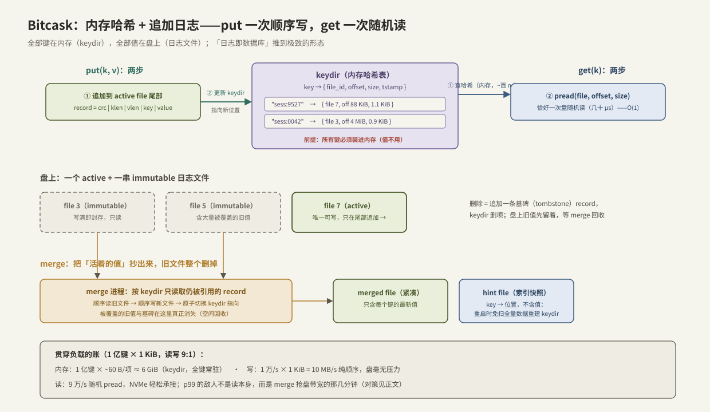

---
tags:
  - 高性能存储
  - 存储引擎
---
# Bitcask 模型

> [[6.1 WAL 与 Crash Consistency]] 结尾埋了一句：日志加一张内存表，就是一个能扛崩溃的 KV——把这个雏形认真做完，就是 **Bitcask**（Riak 的默认存储引擎，2010 年论文《Bitcask: A Log-Structured Hash Table for Fast Key/Value Data》【事实/历史】）。它是第 6 章里结构最简单的完整引擎：**全部键放内存哈希（keydir），全部值放盘上追加日志**——put 一次顺序写，get 恰好一次随机读。简单到可以在一篇笔记里从机制、恢复、空间回收讲到完整实现；也简单到每一条设计取舍都露在明面上，是检验「吞吐、尾延迟、CPU、内存、网络怎么互相牵制」的最好教具。
>
> **贯穿负载**（承接 [[6.3 fsyncgate 与 EIO 处理]]、[[6.4 Torn Write 与 Checksum]]）：1 亿键 × 1 KiB 元数据 KV，读写 9:1（9 万读/s + 1 万写/s），p99 < 1 ms，NVMe 单盘 + 异步复制备机。本篇要回答：Bitcask 接得住这个负载吗？账算在哪里？

前置：[[6.1 WAL 与 Crash Consistency]]（record 格式、fdatasync 提交点、残尾截断——本篇的持久化底座）、[[1.2 Page Cache 命中与未命中]]（读路径命中与否决定 get 延迟的量级）。

---

## 1. 结构：两个部件，四条规则



部件一：**盘上的日志文件序列**。任意时刻只有一个 active 文件可写、且只在尾部追加；写满（如 2 GiB）就封存为 immutable，换新文件继续。record 格式与 [[6.1 WAL 与 Crash Consistency]] 完全同款：`crc | klen | vlen | key | value`。

部件二：**内存里的 keydir**。一张哈希表：`key → {file_id, offset, size, tstamp}`——只存**位置**，不存值。

四条规则【事实】：

1. **`put(k, v)`**：record 追加到 active 文件（+ fdatasync，或 [[6.2 Group Commit]] 攒批），然后 keydir 更新指向新位置。旧值躺在原地不动——它只是失去了指针；
2. **`get(k)`**：查 keydir（内存，~百 ns）→ 按位置 `pread` 一次（盘随机读，几十 μs；页缓存命中则 μs 级）。**恰好一次盘 IO，O(1)**——没有树的多层下探，没有 LSM 的多层查找；
3. **`delete(k)`**：追加一条墓碑（tombstone）record + 从 keydir 删项。删除也是追加——盘上没有任何「原地改」；
4. **覆盖即遗弃**：同 key 再写，keydir 指针一挪，旧 record 成为垃圾，等 merge 回收。

一句话审美【设计】：Bitcask 把 [[6.1 WAL 与 Crash Consistency]] 里「日志 + 内存表」的恢复机制**直接当成了引擎本体**——没有「数据本体」要另行维护，日志就是数据库，keydir 就是索引。

---

## 2. 崩溃恢复与启动：完全复用 WAL 机制

崩溃语义直接继承 [[6.1 WAL 与 Crash Consistency]]【事实】：

- **提交点** = record fdatasync 完成；掉电后残尾由 CRC 检测并截断（W2 窗口）；
- **torn 问题天然消解**：文件只追加、从不覆写，不存在「已提交页被撕裂」的 W5 窗口——这正是 [[6.4 Torn Write 与 Checksum]] §3.3 COW 路线的最简形态，防撕裂零成本【设计】；
- **恢复 = 重建 keydir**：顺序扫描所有文件，每读到一条合法 record 就更新 keydir（后写覆盖先写，天然幂等）。

扫描 100 GiB 重建 keydir，按盘顺序读带宽算要几十秒到分钟级【量级】——每次重启都付一遍不可接受。Bitcask 的解法是 **hint file**【实现】：merge 时顺手为每个数据文件生成一份「只含 `key → 位置`、不含值」的索引快照。启动时读 hint（尺寸只有键的量级，GiB 内）+ 只扫尾部未 merge 的活跃段——启动时间从「正比于数据量」降到「正比于键量 + 增量」。这是用一点后台写换启动时间的经典取舍【取舍】。

---

## 3. merge：空间回收与它制造的毛刺

追加不回收，垃圾（被覆盖的旧值 + 墓碑）持续累积——**空间放大**没有上限，必须有后台 **merge**【事实】：

1. 遍历 immutable 文件，**只把 keydir 仍指向的 record**（活值）抄进新文件；
2. 原子切换 keydir 指针 → 新文件；
3. 整个旧文件 unlink——回收以文件为单位，粗暴而高效；顺带产出 hint file。

merge 的 IO 形态：大块顺序读 + 大块顺序写，量级 = 存量数据的活值部分。它与前台请求**抢同一块盘**——这是 Bitcask 版的 compaction 问题（[[6.7 Compaction 策略]]），也与 SSD 内部 GC（[[3.5 GC 写放大与 Over-Provisioning]]）同构：**任何「先欠账后清理」的设计，清理时都要还 IO 债，还债期间尾延迟遭殃**。对策同样通用【实践】：merge 限速（token bucket）、错峰调度、按文件垃圾率排优先级（垃圾率高的文件先 merge，单位 IO 回收最多空间）。

---

## 4. 五笔账：贯穿负载下的因果链

这是本篇的核心一节——每笔账都标出「谁决定它、它又压到谁」。

| 账目 | 数字（贯穿负载） | 因果链 |
| --- | --- | --- |
| **内存** | keydir：1 亿键 × ~60 B/项（键 + 定位 + 哈希开销）≈ **6 GiB 常驻**【量级】 | 键数决定内存下限，与值大小、数据总量**无关**——这是 Bitcask 的硬前提：键集装不进内存，模型直接不成立【前提】 |
| **写吞吐** | 1 万写/s × 1 KiB = 10 MB/s 纯顺序 | 追加写把随机负载变成顺序流，离 NVMe 顺序带宽差两个数量级——写侧余量巨大；真正的写上限来自 fdatasync 次数，由 [[6.2 Group Commit]] 决定 |
| **读延迟** | 9 万读/s 随机 pread；热键走页缓存 μs 级，冷键走盘几十 μs | p99 主要由**冷读比例 × 盘延迟**决定；keydir 保证绝无多次 IO 的读放大——对比 LSM 冷读可能下探多层（[[6.6 LSM-tree 三种放大]]） |
| **CPU** | 每 record 一次 CRC32C（读写各一）+ 哈希查找 | 硬件 CRC 下 <5% 单核（[[6.4 Torn Write 与 Checksum]] §2 的账）；无压缩、无排序、无布隆过滤——CPU 几乎全程旁观【量级】 |
| **网络** | 复制 = 把 active 文件的追加流原样发给备机，10 MB/s 稳定小水管 | 顺序日志天然适合流式复制，**无 checkpoint 尖峰**（对比 [[6.4 Torn Write 与 Checksum]] §3.1 full-page write 的周期性峰值）；备机回放 = 顺序追加 + keydir 更新，永远追得上 |

三条交叉因果，负载一变形就会浮现【实践】：

- **merge ↔ 读 p99**：merge 全速跑时占据盘带宽与设备队列，冷读排在大块顺序 IO 后面，p99 从几十 μs 恶化到 ms 级——限速是拿「空间回收速度」换「尾延迟平稳」，两头都不能饿死；
- **键数 ↔ 内存 ↔ 换引擎**：键涨到 10 亿，keydir 要 60 GiB——先是挤占页缓存（冷读比例上升 → p99 恶化），最后内存装不下（前提崩塌）。出路：分片（多实例各管一段键空间）或换有盘上索引的引擎（[[6.8 B+ tree vs LSM]]）；
- **值大小 ↔ 模型优势**：值越大，「值只写一遍、索引全内存」的优势越明显；值小到几十字节时，record 头 + keydir 项的固定开销占比飙升，LSM 的块压缩反而更省【取舍】。

---

## 5. 最小可运行实现：Mini-Bitcask

在 [[6.1 WAL 与 Crash Consistency]] 的 `Wal` 上补两样东西：`append` 返回 record 起始偏移（keydir 要记它）、`recover` 回调携带偏移。改动各一行，此处直接使用。

### 5.1 keydir 与编码

```cpp
#include <cstdint>
#include <optional>
#include <string>
#include <string_view>
#include <unordered_map>
#include <vector>

struct ValueLoc {
    std::uint64_t offset;   // record 在日志文件中的起始位置
    std::uint32_t size;     // 整条 record 的长度(读时一次取整)
};

// payload 编码:[u8 op][u32 klen][key][value]  op: 'P'=put 'D'=delete
inline std::vector<std::byte> encode(char op, std::string_view k,
                                     std::string_view v = {}) {
    std::vector<std::byte> buf;
    buf.reserve(1 + 4 + k.size() + v.size());
    auto put_bytes = [&buf](const void* p, std::size_t n) {
        auto* b = static_cast<const std::byte*>(p);
        buf.insert(buf.end(), b, b + n);
    };
    const auto klen = static_cast<std::uint32_t>(k.size());
    put_bytes(&op, 1);
    put_bytes(&klen, 4);
    put_bytes(k.data(), k.size());
    put_bytes(v.data(), v.size());
    return buf;
}
```

**关键点**：墓碑用 1 字节操作码表达而不是「空值」——空字符串是合法的值，语义位必须独立；`ValueLoc::size` 记整条 record 而非裸值长度，读取时一次 `pread` 拿全、顺带用 CRC 验完整性（[[6.4 Torn Write 与 Checksum]] 的读路径纪律）。

### 5.2 引擎本体

```cpp
class Bitcask {
public:
    explicit Bitcask(const std::filesystem::path& p) : log_{p} {
        // 启动 = 扫日志重建 keydir:后写天然覆盖先写,残尾被截断
        log_.recover([this](std::span<const std::byte> rec, std::uint64_t off,
                            std::uint32_t len) { apply(rec, {off, len}); });
    }

    void put(std::string_view k, std::string_view v) {
        auto rec = encode('P', k, v);
        const ValueLoc loc{log_.append(rec),
                           static_cast<std::uint32_t>(rec.size() + kHeader)};
        log_.commit();                      // 提交点(生产:换 GroupCommitWal)
        keydir_.insert_or_assign(std::string{k}, loc);   // 先落盘后改指针
    }

    void erase(std::string_view k) {
        auto rec = encode('D', k);
        log_.append(rec);
        log_.commit();
        keydir_.erase(std::string{k});
    }

    std::optional<std::string> get(std::string_view k) const {
        const auto it = keydir_.find(std::string{k});
        if (it == keydir_.end()) return std::nullopt;        // 纯内存判否
        return log_.read_value(it->second.offset, it->second.size);
        // read_value:pread 整条 record + CRC 校验 + 解码出 value
    }

private:
    static constexpr std::size_t kHeader = 8;   // 6.1 的 len+crc 头
    void apply(std::span<const std::byte> rec, ValueLoc loc) {
        const char op = static_cast<char>(rec[0]);
        std::uint32_t klen;
        std::memcpy(&klen, rec.data() + 1, 4);
        std::string key{reinterpret_cast<const char*>(rec.data() + 5), klen};
        if (op == 'P') keydir_.insert_or_assign(std::move(key), loc);
        else           keydir_.erase(key);
    }

    Wal log_;                                            // 6.1 的追加日志
    std::unordered_map<std::string, ValueLoc> keydir_;   // 全部键常驻内存
};
```

**逐段讲解**：

- **恢复即构造**：构造函数里的 `recover` 就是第 2 节的启动扫描——`apply` 同时被「正常写路径之后的内存更新」与「恢复重放」复用，保证两条路径对 keydir 的效果逐字节一致（崩溃一致性代码的黄金习惯【实践】）；
- **先落盘、后改指针**：`put` 里 `commit()` 在 `insert_or_assign` 之前——顺序反了的话，崩溃窗口里会出现「keydir 指向一条没持久化的 record」，重启后 get 到旧值尚可接受，但若已对外确认新值就违反了提交语义（[[6.1 WAL 与 Crash Consistency]] 规则 2）；
- **get 是 const 的**：读路径不碰任何共享可变状态——单写多读场景下，把 keydir 换成读写锁或 RCU 风格快照即可扩展并发，而日志追加天然单点串行，正好交给 [[6.2 Group Commit]] 的 Leader；
- 未实现的三件套（多文件轮转、merge、hint file）都是第 1–3 节机制的直译，不改变任何语义边界——单文件版已具备完整的崩溃安全。

---

## 6. 动手验证：把四笔账测出来

```bash
# ① 写吞吐上限对照:Bitcask 写 = 顺序追加,应逼近盘的顺序写(或受 fsync 限制)
fio --name=seq --filename=/data/bcask/ref --rw=write --bs=64k --size=4G \
    --ioengine=io_uring --direct=1
./bitcask_bench --load --keys 10000000 --value 1024      # 对比 MB/s

# ② 点查延迟对照:get 冷读 = 一次 4 KiB 随机读
fio --name=rand --filename=/dev/nvme0n1 --rw=randread --bs=4k --iodepth=1 \
    --runtime=60 --ioengine=io_uring --direct=1          # 参照系(9.1)
./bitcask_bench --get --hot 0.9                          # 90% 热键场景

# ③ merge 毛刺:后台大块顺序 IO 模拟 merge,观察前台 get 的 p99
fio --name=merge_sim --filename=/data/bcask/junk --rw=rw --bs=1m --size=20G &
./bitcask_bench --get --report-percentiles               # p50 稳、p99 起飞
iostat -x 1        # 看 aqu-sz 与 r_await 同步抬升(9.2)

# ④ 启动时间:对比全量扫描与 hint file
time ./bitcask_bench --open-scan   /data/bcask
time ./bitcask_bench --open-hints  /data/bcask
```

预期判读：① 两个数字接近说明写路径没有额外浪费，差距大先查 fdatasync 频率（[[6.2 Group Commit]] 的 strace 对账法）；② get 的 p50 应落在页缓存命中（μs）与盘随机读（几十 μs）的加权之间；③ 是第 4 节「merge ↔ p99」因果链的直接可视化——给 fio 加 `--rate` 限速再看 p99 回落，就是 merge 限速的模拟【实践】。

---

## 7. 边界：它不做什么，什么时候别用它

Bitcask 的简单来自明确的「不做」清单【事实/取舍】：

| 不支持 | 原因 | 需要时找谁 |
| --- | --- | --- |
| 范围查询 / 有序遍历 | keydir 是哈希，键无序 | LSM 的有序 SST（[[6.6 LSM-tree 三种放大]]）或 B+ 树（[[6.8 B+ tree vs LSM]]） |
| 键多于内存 | keydir 必须全内存 | 分片，或盘上索引的引擎 |
| 值级压缩/列存 | record 独立存放 | LSM 块压缩、列式格式 |

选型口诀【实践】：**点查为主、键集可控、值中等偏大、要求写路径简单可审计**——Bitcask 形态（及其现代变体）几乎无敌；需要 range scan 或键规模不可控——它一票否决。作为参照系，[[6.9 RocksDB 关键路径]] 里 LSM 为了「有序 + 键不设上限」付出的 memtable、多层查找、布隆过滤、compaction 全家桶，正是 Bitcask 用「键全内存 + 无序」两个前提**买断**掉的复杂度。

---

## 8. 陷阱与误区

> [!warning] 常见错误
> 1. **「索引在内存，所以读是内存速度」**：keydir 只免掉查找 IO，值还在盘上——冷读就是一次真实的盘随机读，p99 按盘算，不按哈希表算。
> 2. **拿它存不可控增长的键集**：键数决定常驻内存，涨穿内存时没有优雅降级——上线前算 `键数 × (键长 + ~40 B)` 这笔账，并留分片预案。
> 3. **「追加写没有写放大」**：写路径确实无放大，但 merge 要把活值整体重抄——放大转移到了后台，总量 = 活数据量 ÷ 垃圾率，不付就还空间债。
> 4. **merge 不限速**：全速 merge 抢走盘带宽，前台 p99 直接起飞——第 4 节因果链的第一条，也是最常在生产里踩的一条。
> 5. **先更新 keydir 再 fdatasync**：崩溃窗口里指针指向未持久化数据，违反提交点定义——顺序必须是「盘上先有，内存才认」。
> 6. **墓碑用空值表示**：空字符串是合法值——语义位必须独立编码，否则 delete 与 `put("")` 无法区分。
> 7. **忘了墓碑也要挺过 merge**：若某键的墓碑被提前回收而旧值 record 还在别的文件里，恢复扫描会让删掉的键复活——墓碑的回收条件是「所有更旧的同键 record 都已消失」【实现】。

---

## 9. 关键结论

| 结论 | 性质 |
| --- | --- |
| Bitcask = keydir（全键内存哈希）+ 追加日志（值在盘上）：put 一次顺序写，get 恰好一次随机读，O(1) | 事实 |
| 崩溃安全完全继承 WAL 机制：CRC + 残尾截断；只追加不覆写，torn page 问题天然不存在 | 事实 |
| 硬前提：键集必须装进内存（~60 B/键）；内存账与值大小、数据总量无关 | 前提 |
| 空间回收靠 merge 整文件重写；hint file 把启动从「扫数据量」降到「扫键量」 | 事实/实现 |
| 五笔账：写吞吐受 fsync 次数而非带宽限制；读 p99 = 冷读比例 × 盘延迟；CPU 近乎旁观；复制是无尖峰的顺序流 | 事实/量级 |
| 核心因果链：merge 与前台抢盘带宽 → p99 毛刺；限速 = 拿回收速度换尾延迟平稳 | 取舍 |
| 「先落盘、后改指针」是写路径唯一的顺序纪律；恢复与正常路径共用同一个 apply | 实践结论 |
| 无范围查询、键规模受限——与 LSM 的复杂度互为镜像：两个前提买断全家桶 | 取舍 |

---

## 关联知识

- [[6.1 WAL 与 Crash Consistency]] - 本篇的持久化底座：record 格式、提交点、残尾截断
- [[6.2 Group Commit]] - 写吞吐的真正上限在 fsync 次数；Leader 模式直接适用于日志追加
- [[6.4 Torn Write 与 Checksum]] - 只追加不覆写 = COW 路线的最简形态；读路径 CRC 纪律
- [[6.6 LSM-tree 三种放大]] / [[6.8 B+ tree vs LSM]] - 放弃「键全内存」前提后世界的样子
- [[6.7 Compaction 策略]] - merge 限速与调度的系统化版本
- [[3.5 GC 写放大与 Over-Provisioning]] - 「先欠账后清理」在 SSD 内部的同构问题
- [[1.2 Page Cache 命中与未命中]] - 热键 μs、冷键几十 μs 的分界线
- [[6.9 RocksDB 关键路径]] - 工业 LSM 引擎：Bitcask 用两个前提买断掉的那些复杂度
