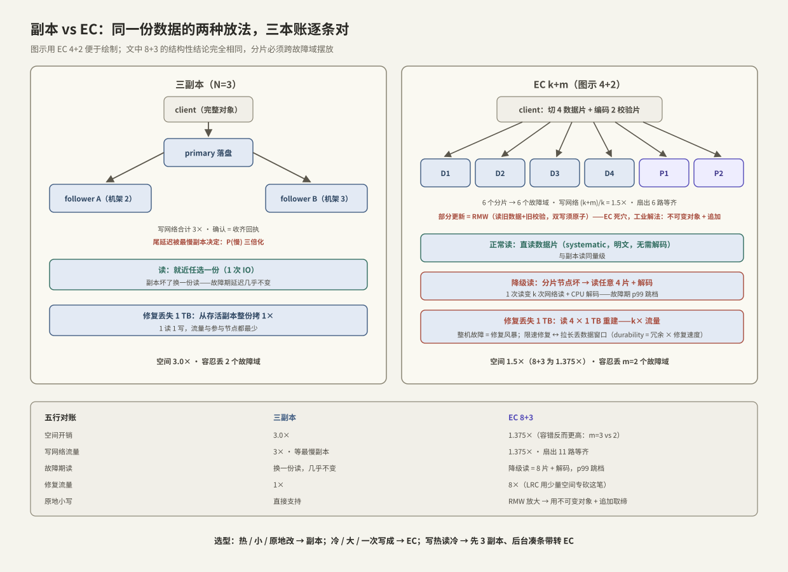

---
tags:
  - 高性能存储/分布式存储
---
# 副本 vs EC

> 第 7 章换一个失败模型：前六章假设「盘慢但还在」，现在盘会整块坏、机器会整台消失、机架会整排断电。单机引擎写得再对，数据只有一份就只有一份的命。分布式存储的第一决策是**冗余怎么放**，答案只有两条路线：**复制（replication）**——同一份数据存 N 份完整拷贝；**纠删码（EC，Erasure Coding）**——把数据切成 k 块、算出 m 块校验，任意 k 块能恢复全部。两条路线的差异不止「省不省盘」：它们的**写路径网络形状、读路径降级行为、修复流量**完全不同，而这三件事都长在网络和故障域上——这正是本篇按端到端路径展开的原因。

前置：[[6.6 LSM-tree 三种放大]]（「不可变 + 追加」的思想在这里再次出现）、[[4.1 RDMA 为什么快]] §2（网络流量账的算法）、[[00. 总纲]]（延迟量级坐标系）。

---

## 1. 前提：故障模型与故障域

一切冗余设计建立在两条前提上【前提】：

1. **部件持续在坏**：数据盘年故障率（AFR）百分之一二量级【量级】——一万块盘的集群，平均每两三天坏一块；这不是异常，是常态运行的一部分；
2. **故障是相关的**：同一台机器的盘一起消失（主机故障），同一机架一起断电（PDU/交换机故障）。因此冗余分片必须**跨故障域（failure domain）摆放**——3 副本放在同一台机器上，容灾能力等于 1 份。

由此定义两条路线的容错语义【事实】：

| | 副本 N=3 | EC k+m（如 8+3） |
| --- | --- | --- |
| 存储开销 | 3.0× | (k+m)/k = 1.375× |
| 容忍同时丢失 | 2 个故障域 | m = 3 个故障域 |
| 恢复一个丢失块需要读 | 1 份完整拷贝 | **任意 k = 8 个分片** |

EC 的原理给 C++ 工程师一句话【事实】：Reed-Solomon 编码把每个校验字节算成 k 个数据字节的**线性组合**（在 GF(2⁸) 有限域上，可理解为「带系数的广义 XOR」）；m 个校验块 = m 个线性无关的方程组，丢任意 ≤ m 块，剩下的方程仍可解出全部未知数。m=1 时退化成纯 XOR——§6 的代码用它演示全部结构性结论。

表格已经暴露第一组取舍【取舍】：EC 用 **1.375× 的空间买到比 3 副本更高的容错**（3 vs 2），代价藏在「恢复要读 k 份」里——下面三节按写、读、修复逐条兑现这笔账。

---

## 2. 写路径：网络形状完全不同



### 2.1 副本写

典型形状（主从式）【事实】：client 把完整数据发给 **primary** → primary 并行转发给 2 个 follower → 收齐足够确认（通常要求全部或多数）→ 回 client。

- **网络账**：client 出口 1×，集群内部再传 2×，合计 3× 字节流量；
- **延迟账**：确认延迟 = max(各副本的网络 + 落盘)——**尾延迟被最慢的副本决定**【事实】：单副本 p99 慢的概率是 p，三副本等齐则 1−(1−p)³ ≈ 3p——**复制天然放大尾部**，这是 fan-out 系统的通病（缓解手段如对冲请求属 7.2 之后的话题）；
- 链式复制（chain replication）变体把并行改成串行传递：带宽占用更均匀，延迟叠加两跳【取舍】。

### 2.2 EC 写：只喜欢一种写法

**整条带写（full-stripe write）**【事实】：把对象切成 k 个数据分片 → 本地算出 m 个校验分片 → k+m 个分片**一次性扇出**到 k+m 个故障域。网络账 (k+m)/k ≈ 1.375×，比副本省一半多；延迟 = max over k+m 个节点——扇出更宽，等齐更慢的概率更高。

**部分更新是 EC 的死穴**【事实】：改条带中间的一小段，校验块必须跟着改，于是一次小写变成 **RMW（读-改-写）**：读旧数据片 + 旧校验片 → 计算新校验 → 写回数据片与全部校验片——一次逻辑小写 = 多次网络往返 + 多倍读写 IO，还要处理「数据片与校验片必须原子一致」的分布式一致性问题【事实】。

工业解法不是优化 RMW，而是**取缔它**【实现/取舍】：对象存储把对象定为**不可变**——只支持整对象写入与追加，修改 = 写新版本 + 回收旧版本。这与 [[6.6 LSM-tree 三种放大]] 的「更新即追加、compaction 回收」是同一个思想在分布式层的复刻：**把随机改写变成顺序追加，代价转成后台回收**。热的、小的、要原地改的数据（元数据、KV）则留在副本路线上。

---

## 3. 读路径：正常态几乎打平，降级态天差地别

- **副本读**【事实】：任选一份（就近/负载均衡），1 次网络 + 1 次盘 IO；一个副本坏了，换一份读，**延迟几乎不变**；
- **EC 正常读**【事实】：常用编码是 systematic 的——k 个数据分片就是明文本体。读某个范围只需访问它落在的那（几）个数据分片，**不需要解码**，与副本读同量级；
- **EC 降级读（degraded read）**【事实】：想读的分片所在节点坏了/慢了 → 必须读**任意 k 个分片 + 解码**——1 次读变 k 次网络读加一段 CPU 解码，p99 在故障期间整体抬升数倍【量级】。副本没有「降级读」这个概念——这是两条路线在读路径上的本质区别：**副本的故障期读性能 ≈ 正常期，EC 的故障期读性能是另一档**。

---

## 4. 修复账：EC 最贵的一笔隐藏成本

盘坏了要把冗余度补回来（re-replication / reconstruction）【事实】：

| | 副本 | EC k+m |
| --- | --- | --- |
| 修复 1 TB 丢失数据 | 从存活副本拷 1 TB | 读 **k × 1 TB** + 解码后写 1 TB |
| 网络流量 | 1× | **k×**（8+3 就是 8×） |
| 参与节点 | 1 读 1 写 | k 读 1 写，扇入集中 |

两个工程后果【实践】：

1. **修复风暴**：一台 12 盘 × 8 TB 的存储节点整机故障，EC 8+3 下要在集群里搬 ~8 × 96 TB 的读流量；修复流量与前台流量抢同一张网——必须限速，而限速拉长修复窗口；
2. **durability 是冗余度 × 修复速度的乘积**【事实】：丢数据的条件是「修复完成前，同条带再坏 m 个」；大盘时代单盘重建以小时计，**修复窗口越长，看似更高的容错反而兑现不出更高的可靠性**。只看「容 m 个」不看 MTTR（平均修复时间）的可靠性估算都是错的。局部修复码（LRC）用少量额外空间换「单盘修复只读局部几个分片」，就是专门砍这笔账的【实现】。

条带/对象的健康状态机【事实】：

```text
健康(k+m 齐) → 降级(缺 ≤ m：可读写，降级读 + 后台修复中) → 丢失(缺 > m：不可恢复)
      ↑______________修复完成_______________|
```

---

## 5. 选型与混合【取舍】

| 负载特征 | 选择 | 原因 |
| --- | --- | --- |
| 热数据、小对象、低延迟点读写、元数据/KV | 3 副本 | 无 RMW、无降级读、修复便宜、尾延迟可控 |
| 冷数据、大对象、一次写成、成本敏感 | EC | 空间省一半以上，顺序大读与 full-stripe 写完美契合 |
| 写入热、随后变冷 | **先副本后 EC**：写入落 3 副本，后台凑满条带转 EC 再删副本【实现】 | 写路径享受副本的简单，存量享受 EC 的成本 |

AI 存储场景对号入座（第 8 章的伏笔）：训练数据集（大文件、只读、顺序读）与 checkpoint（大块一次写成）都是 EC 的理想负载；训练元数据、样本索引、KV Cache 类走副本——这也是 [[7.6 AI 存储 vs 传统 NAS]] 里分层设计的地基之一。

---

## 6. Modern C++：用 XOR（m=1）亲手摸到两条结论

XOR 是 m=1 的纠删码；40 行就能演示**全条带写便宜、部分更新贵**这两个结构性结论：

```cpp
#include <cstddef>
#include <span>
#include <vector>

// 一个条带：k 个数据分片 + 1 个校验分片（m=1 的最小 EC）
struct Stripe {
    std::vector<std::vector<std::byte>> data;   // k 片
    std::vector<std::byte> parity;              // 1 片：所有数据片的逐字节 XOR
};

// 全条带编码：k 片各读一遍 → 一遍 XOR 产出校验。成本 O(k)，一次完成
void encode_full(Stripe& s) {
    s.parity.assign(s.data[0].size(), std::byte{0});
    for (const auto& shard : s.data)
        for (std::size_t i = 0; i < shard.size(); ++i)
            s.parity[i] ^= shard[i];
}

// 部分更新（RMW）：改一片，须先读旧数据与旧校验，再写两处
//   new_parity = old_parity XOR old_data XOR new_data
// 分布式场景下这是 2 次远程读 + 2 次远程写，且两个写必须原子一致
void update_one(Stripe& s, std::size_t k_idx, std::span<const std::byte> new_data) {
    auto& old_data = s.data[k_idx];
    for (std::size_t i = 0; i < new_data.size(); ++i) {
        s.parity[i] ^= old_data[i] ^ new_data[i];   // 读旧改校验
        old_data[i] = new_data[i];                  // 写新数据
    }
}

// 修复：丢了第 lost 片 → 必须读齐其余 k-1 片数据 + 校验片才能重建
std::vector<std::byte> rebuild(const Stripe& s, std::size_t lost) {
    std::vector<std::byte> out = s.parity;          // 从校验片出发
    for (std::size_t k_idx = 0; k_idx < s.data.size(); ++k_idx)
        if (k_idx != lost)
            for (std::size_t i = 0; i < out.size(); ++i)
                out[i] ^= s.data[k_idx][i];         // 读全部存活片——k× 修复放大在此
    return out;
}
```

**关键点**：

- `encode_full` 一遍扫完——对应 full-stripe 写的「网络 (k+m)/k×、无往返」；
- `update_one` 必须先**读**旧数据与旧校验才能算新校验——单机只是多两次内存访问，分布式就是多两次远程读加一致性协议，这就是「EC 讨厌小写」的机械根源；
- `rebuild` 遍历全部存活分片——k× 修复流量不是实现不好，是信息论要求：丢的信息必须从 k 份等量信息里重新算出来。真实系统用 Reed-Solomon 把 m 推广到任意值，结构性结论与此完全相同【事实】。

---

## 7. 陷阱与误区

> [!warning] 常见错误
> 1. **只按空间开销选 EC**：修复 k× 流量、降级读抬升 p99、小写 RMW——三笔账不算，成本优势会在第一次整机故障时连本带利还回去。
> 2. **给热的小写负载上 EC**：每笔小写触发 RMW 或强制攒条带（引入延迟与复杂度）；小而热的数据属于副本。
> 3. **冗余不跨故障域**：3 副本同机架 = 一次断电全灭；摆放策略（机器/机架/电力域感知）与冗余系数同等重要。
> 4. **算 durability 不算 MTTR**：容 m 个故障 ≠ 高可靠；修复窗口内的二次故障才是丢数据的主通道，大盘 + 限速修复会把窗口拉到危险的长度。
> 5. **忽略降级态的容量规划**：EC 集群的网络与 CPU 要按「故障期 + 修复风暴 + 前台不降级」做预算，不是按晴天负载。
> 6. **拿 RAID 直觉套分布式 EC**：RAID 在一台机器里，无网络账、无故障域；分布式 EC 的每一笔读写修复都过网络，账目完全不同。

---

## 8. 关键结论

| 结论 | 性质 |
| --- | --- |
| 冗余两条路线：副本 = N 份完整拷贝；EC = k 数据 + m 校验（GF 上的线性组合），任意 k 片可恢复 | 事实 |
| 分片必须跨故障域；故障是常态且相关的——这是所有摆放策略的前提 | 前提 |
| 空间：3 副本 3.0× vs EC 8+3 1.375×；容错反而 EC 更高（3 vs 2）——省下的钱从修复与降级读里扣 | 事实 / 取舍 |
| 写路径：副本 3× 网络、尾延迟取决于最慢副本；EC full-stripe (k+m)/k×、扇出更宽 | 事实 |
| EC 部分更新 = RMW（读旧数据旧校验 + 双写原子）；工业解法是不可变对象 + 追加——LSM 思想的分布式复刻 | 事实 / 实现 |
| 读路径分水岭：副本故障期读几乎不变；EC 降级读 = k 次读 + 解码，p99 跳档 | 事实 |
| 修复：副本 1×、EC k× 流量——durability = 冗余度 × 修复速度，修复窗口才是丢数据主通道 | 事实 |
| 选型：热/小/原地改 → 副本；冷/大/一次写成 → EC；写热读冷用「先副本后转 EC」分层 | 实践结论 |

---

## 关联知识

- [[6.6 LSM-tree 三种放大]] - 「不可变 + 追加 + 后台回收」思想的单机原型
- [[7.2 元数据路径瓶颈]] - 分片摆在哪、条带元数据谁来记——下一个瓶颈
- [[7.5 Ceph RADOS 与 CRUSH]] - 摆放策略（跨故障域）的工业实现
- [[7.6 AI 存储 vs 传统 NAS]] - 本篇选型表在 AI 场景的展开
- [[7.7 对象存储路径]] - 「不可变对象」这一前提的来源系统
- [[4.1 RDMA 为什么快]] - 网络流量账的算法与内存带宽视角
- [[9.6 故障注入矩阵]] - 降级读与修复风暴的演练方法
