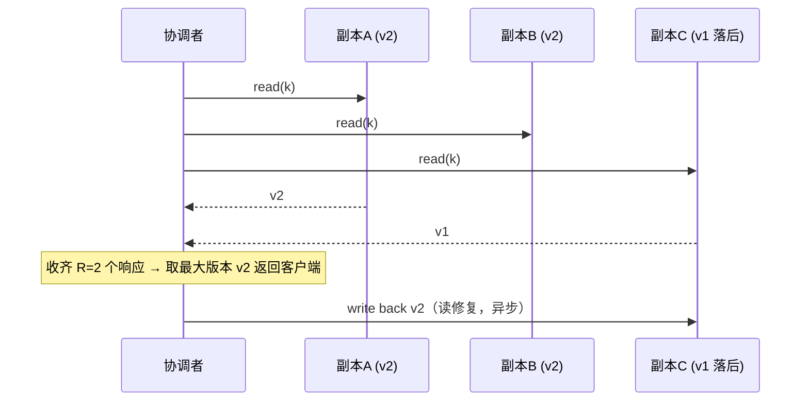

---
tags:
  - 高性能存储/分布式存储
status: 已完成
---

# Quorum 读写

> [[7.9 一致性模型]] 把"读能看到什么"分了级，这一篇给出第一个能落地的机制。写到所有副本才确认太脆（一台慢机拖死全局），写到一个就确认太弱（读到什么凭运气）——折中方案：写 W 份、读 R 份，只要 R + W > N，读写集合必然交叠，读到的 R 份响应里一定有最新确认值。一条小学的抽屉原理，撑起了 Dynamo 一系的所有存储。但它也是被高估最狠的机制：**交叠保证"新值在场"，不保证"系统像单副本"**——部分写失败照样让读者看到时间倒流。本篇给出证明、反例、参数拨盘、一个 40 行的 C++ 模拟，以及"为什么它不是线性一致"的完整推理。

前置：[[7.9 一致性模型]]（"保证"的语义坐标系）、[[7.1 副本 vs EC]]（N 份副本从哪来）。

---

## 1. 名词与基本规则

三个参数，都是每次操作可选的（不是集群固定属性）：

- **N**：每条数据保存的副本数（复制因子），常见 N=3；
- **W**：写操作收到多少个副本的确认（ack）才向客户端报成功；
- **R**：读操作收到多少个副本的响应才汇总返回。

流程【实现】：写请求由协调者**并发发给全部 N 个副本**，收齐 W 个 ack 即确认，剩下的副本继续在后台补齐（不是只发 W 份）。读请求同样发出去，收齐 R 个响应后，**取版本号最大的那个值返回**。

版本号是隐含前提【前提】：交叠定理只保证"读集合里有新值"，**认出**哪个是新值靠版本号——它必须可比较、且新写严格更大。来源三种：协调者单调计数、逻辑时钟、墙上时钟（LWW，Last-Writer-Wins——有著名深坑，见第 8 节）。

---

## 2. 交叠证明与两条不等式

写集合 S_W（收到 ack 的 W 个副本）和读集合 S_R（返回响应的 R 个副本）都从同样 N 个副本里选。抽屉原理：

$$
|S_R \cap S_W| \ge R + W - N \ge 1
$$

白话版：写碰过 W 个抽屉，读打开 R 个抽屉，抽屉一共 N 个；只要 R + W > N，打开的抽屉里必有被碰过的。于是读集合里**至少一个副本持有最新已确认版本**，取最大版本号即得新值。

![[图片/SVG/8_7_10_1.svg|900]]

第二条常被一起要求的不等式：

$$
W > \frac{N}{2}
$$

作用不同：它保证**任意两次写的集合也交叠**——两笔并发写至少共享一个见证副本，版本仲裁有共同依据，不会出现两笔写各拿一半副本"各自成功"的写脑裂雏形（完整故事在 [[7.14 Split Brain]]）。N=3、W=2 同时满足两条，这是它成为默认配置的原因。

容错账本【事实】：写可用需要 W 台在线 → 容忍 N−W 台失联；读容忍 N−R 台。注意"失联时不可写"是**可用性牺牲**，不是数据错误——这正是 CAP 里牺牲 A 保 C 的具体形态。

---

## 3. 读修复与反熵：交叠救的是读，谁去救副本？

交叠让读总能"越过"落后副本，但落后副本自己不会好——需要三件套把 N 份最终补齐【实现】：

- **读修复（read repair）**：读时发现某副本版本旧，顺手把新值写回去。修的是**被读到的热数据**；
- **反熵（anti-entropy）**：后台用 Merkle 树对账，慢慢修**没人读的冷数据**；
- **提示移交（hinted handoff）**：目标副本失联时，把写暂存在别的节点（带"这是替 X 保管的"提示），等它回来再转交。



**这里埋着一个关键取舍**【事实/取舍】：Dynamo/Riak 的 **sloppy quorum**——故障时允许把 W 凑给"编外"节点（本不负责这条数据的节点先代管）。可用性上去了，但**交叠定理的前提被抽掉了**：写集合可能根本不在原来的 N 个副本里，R + W > N 从"保证"降级为"大概率"。用它换可用之前，必须知道换掉的是什么。

---

## 4. 为什么 R + W > N 仍然不是线性一致

这是本篇最重要的一节，也是最大的常见误读。三个洞：

**洞一：部分写失败没有回滚**。写只落到 w < W 个副本，客户端收到超时/失败——但已落下的值**留在副本上**，不会撤销。此后的读，读集合撞上它就返回这个"从未成功"的值，没撞上就返回旧值：不同读者、甚至同一读者先后两次，读到的值来回横跳。SVG 的 Panel C 就是这个时序：读者乙时间上晚于读者甲，却读到更旧的值——**非单调读，线性一致明确排除的异常**。

**洞二：读与正常写并发**。写正在铺开（已落 1 份、还差 1 份 ack），读者甲的读集合含新副本 → 读到新值；随后读者乙的读集合不含 → 读到旧值。同样是"先见新、后见旧"。

**洞三：并发写的版本冲突**。两个客户端同时写同一键，各自从不同来源拿版本号——若不可比或相等，需要冲突解决：向量时钟保留"兄弟版本"交给应用合并（Dynamo 的做法），或 LWW 按时间戳丢掉一个（危险，第 8 节）。

**封洞的代价**【事实】：经典结果是 ABD 算法（Attiya, Bar-Noy, Dolev 1995）——读到最大版本后，**先把它同步写回至少 W 个副本，再返回给客户端**（把读修复从"异步顺手"提升为"返回前必须完成"），单个寄存器就能做到线性一致。代价：读路径多一跳写。另一条路是干脆用共识协议把顺序定死（Raft，[[7.11 Primary-Backup 与 Multi-Raft]]）。所以工程事实是：**Cassandra 的 QUORUM 写 + QUORUM 读不是线性一致，要线性得用 LWT（内部跑 Paxos，延迟数倍）**【事实】。

一句总结：Quorum 是**可用性优先的复制原语**，交叠给的是"读集合里有新值"这一条数学保证；把它当强一致用，等于把第 2 节的定理外推到了它没证明的地方。

---

## 5. 延迟视角：等第 k 快的副本

Quorum 还有一个常被忽略的红利。写等 W 个 ack、读等 R 个响应，意味着延迟由**响应时间的第 W（或第 R）顺序统计量**决定：N=3、W=2 时只等第 2 快的副本——**最慢那台的抖动被天然屏蔽**。对比 W=N=3：p99 由最慢副本决定，任何一台 GC、一次盘抖，全体买单【量级】。

反过来读第 8 节的一个定位技巧：quorum 只屏蔽 N−W 台慢机，**第 W 快的那台就是你的写延迟 p99**——p99 突增而 p50 不动时，按副本分解延迟找那台"第 W 快"的机器。

---

## 6. Modern C++：四十万次采样验证交叠定理

模拟 N=3：每轮写随机挑 W 个副本落新版本（模拟"哪 W 个先 ack 不可控"），再随机挑 R 个副本读、取最大版本，统计读到旧值的比例：

```cpp
#include <algorithm>
#include <cstdint>
#include <print>
#include <random>
#include <utility>
#include <vector>

struct Replica { uint64_t version = 0; };

int main() {
    constexpr int N = 3, kTrials = 100'000;
    std::mt19937 rng{42};                        // 固定种子，结果可复现

    for (auto [W, R] : {std::pair{2, 2}, {3, 1}, {2, 1}, {1, 1}}) {
        std::vector<Replica> rep(N);
        std::vector<int> idx{0, 1, 2};
        int stale = 0;

        for (uint64_t t = 1; t <= kTrials; ++t) {
            std::ranges::shuffle(idx, rng);      // 随机 W 个副本收到写（版本 = t）
            for (int i = 0; i < W; ++i) rep[idx[i]].version = t;
            // 此刻版本 t 已确认（收齐 W 个 ack）

            std::ranges::shuffle(idx, rng);      // 随机 R 个副本响应读
            uint64_t seen = 0;
            for (int i = 0; i < R; ++i) seen = std::max(seen, rep[idx[i]].version);
            if (seen < t) ++stale;               // 读到的最大版本 < 已确认版本 = 旧值读
        }
        std::println("W={} R={}  R+W{}N  旧值读比例 = {:5.2f}%",
                     W, R, (W + R > N ? '>' : '=') , 100.0 * stale / kTrials);
    }
}
```

```bash
g++ -std=c++23 -O2 -Wall -Wextra -o quorum_sim quorum_sim.cpp && ./quorum_sim
# W=2 R=2  R+W>N  旧值读比例 =  0.00%
# W=3 R=1  R+W>N  旧值读比例 =  0.00%
# W=2 R=1  R+W=N  旧值读比例 ≈ 33.3%
# W=1 R=1  R+W<N  旧值读比例 ≈ 66.7%
```

怎么读这个结果：前两行的 0 是**结构性的零**（定理保证，跑多少轮都是 0），不是采样巧合；后两行就是读写集合"错开概率"（1/3 与 2/3，可手算验证：读集合完全避开写集合的组合数比例）。两组对照正好把"数学保证"和"概率行为"的分界演示出来。**留一个三行改动的练习**：让写以 10% 概率只落 w=1 份就中断（模拟部分写失败），再统计"同一轮先读到新值、后读到旧值"的次数——你会亲手复现第 4 节的非单调读。

---

## 7. 真实系统实验设计（Cassandra）

三节点集群，把 CL（Consistency Level，就是每请求的 W/R）当变量：

```bash
docker network create cassnet
docker run -d --name cass1 --network cassnet -e CASSANDRA_CLUSTER_NAME=lab cassandra:4.1
# 等 cass1 起来后（docker logs cass1 看到 "Startup complete"），再加两台：
docker run -d --name cass2 --network cassnet -e CASSANDRA_SEEDS=cass1 cassandra:4.1
docker run -d --name cass3 --network cassnet -e CASSANDRA_SEEDS=cass1 cassandra:4.1
docker exec -it cass1 cqlsh
```

```sql
CREATE KEYSPACE lab WITH replication = {'class':'SimpleStrategy', 'replication_factor': 3};
CREATE TABLE lab.kv (k text PRIMARY KEY, v text);
CONSISTENCY ONE;     -- W=1
INSERT INTO lab.kv (k, v) VALUES ('a', 'v1');
CONSISTENCY QUORUM;  -- R=2
SELECT * FROM lab.kv WHERE k = 'a';
```

三组对照实验：

1. **CL=ONE 写 + CL=ONE 读**（R+W=2≤N）：`docker pause cass3` 制造落后副本，反复读——观察旧值/新值横跳；
2. **CL=QUORUM 写 + CL=QUORUM 读**（R+W=4>N）：pause 一台照常工作（容忍 N−W=1）；pause 两台后写报 `UnavailableException`——注意这是**拒绝服务保语义**，不是数据错误，正是牺牲 A 保 C 的样子；
3. **恢复观察**：`docker unpause` 后用 `nodetool netstats` 看 hint 投递、读一次触发读修复。

指标与含义：

| 指标 | 含义 | 常见误读 |
| --- | --- | --- |
| ReadRepair 相关计数 | 读时发现并修复的副本发散次数 | 少量属正常（异步复制天然有窗口）；**持续升高的趋势**才是信号：查反熵与 hint 投递是否断了 |
| Hinted handoff 积压 | 替失联副本暂存的写量 | 积压不清零 = 副本长期缺份，交叠在"缺员"状态下运行 |
| ClientRequest p99（按 CL 分桶） | 各档位的真实延迟代价 | "QUORUM 一定比 ONE 慢"——p50 是，p99 未必：等第 2 快 vs 被唯一那台的抖动绑架（第 5 节） |
| UnavailableException 计数 | W/R 凑不齐的次数 | 当成数据丢失去恢复数据——其实是可用性信号，该扩容或调 CL |

---

## 8. 故障定位

现象 → 疑点（按概率排序）：

- **用户偶见数据回跳，集中在节点重启后**：hint 回放期间读集合撞到未修复副本 → 查 hint 队列长度与投递速率；临时缓解：读升 QUORUM 或加会话粘性。
- **"已确认的写丢了"**：LWW + 时钟问题的招牌现象【事实】——时钟回拨/漂移让后写的时间戳反而小，被"更旧"的值静默覆盖。查 NTP 偏移监控与写路径是否用墙钟做版本。教训：**版本号来源必须单调，墙上时钟不单调**。
- **写 p99 突增、p50 不变**：W 集合里第 W 快的副本变慢（慢盘/GC）→ 按副本分解延迟定位那台机器（第 5 节的顺序统计量直觉）。
- **调参后开始读到旧值**：有人把 R 从 QUORUM 降到 ONE"换性能"——语义从"有交集"掉到"随缘"。**R/W/N 是一致性参数，不是性能旋钮**，改动要过语义评审。
- **跨机房部署后交叠"失效"**：启用了 sloppy quorum 或本地 DC quorum（LOCAL_QUORUM），写读集合不在同一个副本域里——确认拓扑感知配置与 CL 的作用域。

---

## 9. 陷阱与误区

> [!warning] 常见错误
> 1. **把 R+W>N 当线性一致**：最大误读。部分写失败无回滚、读写并发两个洞，都会漏出非单调读；要线性需 ABD 式同步写回或共识（LWT）。
> 2. **不知情启用 sloppy quorum**：故障时交叠从定理降级为概率——高可用换语义，必须是显式决策。
> 3. **用墙上时钟做版本号（LWW）**：时钟回拨 = 静默丢已确认写；版本源必须单调。
> 4. **只看 p50 评估 CL 代价**：QUORUM 的 p99 常好于想象（屏蔽最慢者），ONE 的 p99 常差于想象（被单台绑架）。
> 5. **把 UnavailableException 当数据错误**：它是"凑不齐 W/R、拒绝服务保语义"的保护动作，处置方向是容量与拓扑，不是数据修复。
> 6. **把 R/W 当性能旋钮随手调**：每次调整都是一致性语义变更，要按语义评审流程走。

---

## 10. 关键结论

| 结论 | 性质 |
| --- | --- |
| R+W>N → 读集合必含最新已确认版本（抽屉原理）；W>N/2 → 任意两写交叠、版本可仲裁 | 事实 |
| 交叠保证"新值在场"，认出新值靠版本号——版本源必须单调可比，墙钟不合格 | 事实 / 前提 |
| 部分写失败无回滚 + 读写并发 → 非单调读；Quorum 本身不是线性一致 | 事实 |
| 线性化补丁：读后同步写回 W 份（ABD/前置读修复）或共识（LWT/Raft）——都拿读延迟换 | 取舍 |
| 写/读延迟 = 第 W/R 顺序统计量：屏蔽 N−W 台慢机是尾延迟红利；第 W 快那台就是 p99 | 量级 |
| sloppy quorum 把定理降级为概率，是显式的可用性换语义 | 取舍 |
| 容错：写容忍 N−W 台失联，读容忍 N−R 台；凑不齐时拒绝服务是保护不是故障 | 事实 |
| 读修复管热数据、反熵管冷数据、hinted handoff 管失联窗口——三件套负责最终补齐 N 份 | 实现 |

---

## 关联知识

- [[7.9 一致性模型]] - 交叠"保证了什么"的语义坐标系
- [[7.1 副本 vs EC]] - N 份副本的来源与成本
- [[7.11 Primary-Backup 与 Multi-Raft]] - 要真线性一致时的共识路线
- [[7.12 Lease 与 Fencing]] - 线性读的另一条路：租约及其时钟前提
- [[7.14 Split Brain]] - W>N/2 防的就是它的雏形
- [[7.13 幂等 重试 与请求去重]] - 写超时后的重试语义（部分写失败的客户端侧应对）
- [[7.19 副本落后与日志截断]] - 落后副本的服务端视角
- [[7.5 Ceph RADOS 与 CRUSH]] - 对照：主副本定序路线，不用 quorum 读

## 参考

- DeCandia et al., "Dynamo: Amazon's Highly Available Key-value Store" (SOSP 2007) —— N/R/W、sloppy quorum、hinted handoff 的出处
- Attiya, Bar-Noy, Dolev, "Sharing Memory Robustly in Message-Passing Systems" (1995) —— ABD 算法
- 《Designing Data-Intensive Applications》第 5 章（复制）
- Cassandra 文档: Consistency Levels、Read Repair、Lightweight Transactions
- Jepsen 分析报告: Cassandra / Riak（LWW 丢写与 quorum 语义的实测案例）
