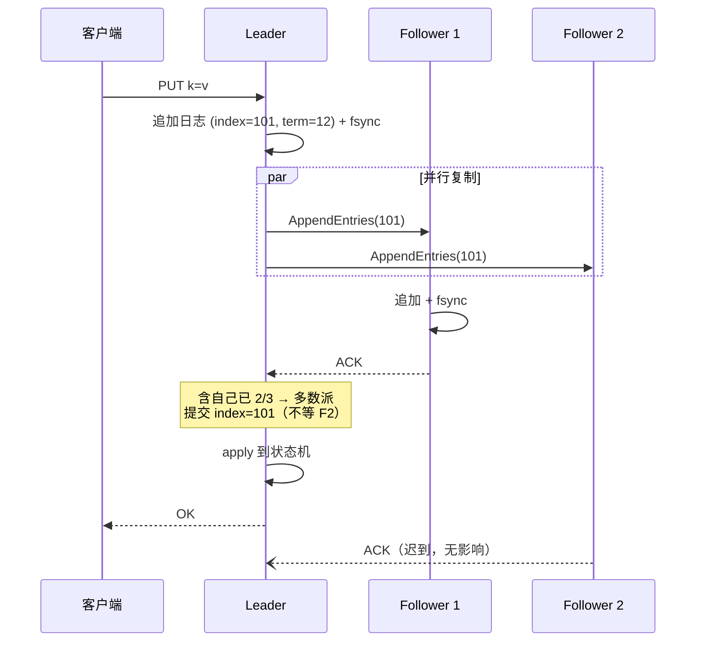

---
tags:
  - 高性能存储
  - 分布式存储
status: 已完成
---

# Primary-Backup 与 Multi-Raft

> 一台机器会宕机、一块盘会坏，所以数据要存多份（副本）。但复制的难点从来不是"多存几份"，而是**让所有副本以同一个顺序执行同一批写**——这就是"复制日志"要解决的问题。本篇讲两种主流骨架：**Primary-Backup**（主备：一个主定序，全部备副本确认，主由外部裁判任命）和 **Raft/Multi-Raft**（组内多数派投票自选主，多数派确认即提交，再把数据切成分片、每片一个 Raft 组横向扩展）。两者不是竞争关系：真实系统里**大块数据走 Primary-Backup、小而关键的元数据走 Multi-Raft** 是常见分工。全篇用一个 AI 训练平台的 checkpoint 工作负载，把吞吐、尾延迟、CPU、内存、网络的因果账算清楚。

前置：[[7.9 一致性模型]]（线性一致是本篇协议的目标语义）、[[7.10 Quorum 读写]]（多数派的数学工具，本篇解释它为什么还不够）。

---

## 1. 名词与背景：问题不是"复制"，是"顺序"

先给定义【事实】：

- **副本（replica）**：同一份数据在不同故障域（不同机器/机架/机房）的多份拷贝。副本数 N=3 是最常见配置：任挂一台不丢数据、不停服务；
- **故障模型**：本章协议假设**宕机故障（crash-stop）**——节点要么正常，要么停止响应，不会说谎。注意"没收到回复"有三种可能：请求丢了、对方死了、对方只是慢——**发起方无法区分**，这个不可区分性是后面 [[7.12 Lease 与 Fencing]] 和 [[7.13 幂等 重试 与请求去重]] 全部复杂性的根源；
- **复制状态机（replicated state machine）**：一个思维模型——如果每个副本都是**确定性**状态机（同样的输入序列必产生同样的状态），那么只要让所有副本按**同一顺序**执行同一批命令，它们的状态就永远一致。于是"复制数据"被归约成"复制一个有序日志"；
- **复制日志（replicated log）**：一个只追加的命令序列，每条有编号（index）。协议的全部工作就是保证：所有副本的日志在已提交的前缀上完全相同。

为什么顺序是核心【类比】：两个客户端同时写 `set x=1` 和 `set x=2`。如果副本 A 按 1→2 执行、副本 B 按 2→1 执行，两边从此永久分歧——没有任何后续手段能发现"谁对"。裸 [[7.10 Quorum 读写]] 的 `R + W > N` 只保证"读集合与写集合有交集"（读能看见最新完成的写），**并不保证多个并发写在各副本上的执行顺序一致**，也不保证一个写"要么全成要么全不成"。所以生产系统的写路径几乎总要引入一个**定序者**——这就是"主"（primary / leader）的本质：不是地位高，而是**全组唯一的定序入口**。

两种骨架的分野就在一个问题上【事实】：**谁来任命主、谁来判主已死？**

- Primary-Backup：外部裁判（协调者/配置服务）任命，判死靠租约超时；
- Raft：组内成员自己投票，多数派同意即为主，不需要外部裁判。

---

## 2. Primary-Backup：最直觉的骨架

**流程**【事实】：写请求只发给主；主给请求编号定序，转发给全部备副本；**所有副本**（含自己）持久化并确认后，主才向客户端返回成功——即 [[7.10 Quorum 读写]] 记号下的 `W = N`。读可以打任何副本，因为成功的写保证在每个副本上都有。

变体【实现】：转发拓扑可以是星形（主并行发给所有备）或**链式复制（chain replication）**——写沿链头到链尾逐个传递，链尾确认即全链持久化，读打链尾。链式把主的出口网络带宽压力（星形下主要发 N−1 份）摊到链上，代价是延迟变成链长之和。

三个结构性特点，全部源自 `W = N`【取舍】：

1. **最慢副本坐在关键路径上**。任何一个备副本的盘抖一下（比如后台 compaction 抢 IO，[[6.14 Write Stall]]）、网络重传一次，这次写的延迟就是它——**尾延迟直接由最差副本决定**；
2. **副本挂了必须先"换名单"才能继续写**。等不到确认时，主不能自作主张跳过它（否则那个副本落后了却还在接读请求）。必须由外部裁判把它从副本组踢出、给副本组升版本号（version/epoch），新名单生效后写才恢复——期间写全部卡住；
3. **主挂了必须由裁判判死再任命新主**。判死不能靠"连不上就算死"（可能只是分区），生产做法是租约超时——具体机制、以及为什么还需要 fencing token，见 [[7.12 Lease 与 Fencing]]；判错了就是双主，见 [[7.14 Split Brain]]。

换来的好处同样直接【取舍】：**数据不经过共识日志**。主把字节流直接转发给备副本落盘，没有"先写日志再 apply"的双写；协议消息极简，适合大块、吞吐敏感的数据体。GFS 的 chunk 复制、HDFS 的 block pipeline、很多分布式文件系统的数据面（如 [[7.4 3FS 架构]]）都是这个骨架。

---

## 3. Raft 单组：把裁判内化成多数派

Raft 把"任命主"和"判死"都变成组内投票，不再依赖外部裁判。先给最小概念集【事实】：

- **term（任期）**：单调递增的整数，全组的逻辑时钟。每次选举 term +1；每个 term 至多一个 leader。**旧 leader 的消息因 term 过期而被拒绝**——这是协议内置的 fencing（[[7.12 Lease 与 Fencing]] 会把这个思想推广到协议之外）；
- **日志条目**：`(index, term, command)` 三元组。index 是全序位置，term 记录"这条是哪任 leader 写的"，用于冲突检测与截断（[[7.19 副本落后与日志截断]]）；
- **两条 RPC**：`AppendEntries`（leader → follower：复制日志，空载荷时兼作心跳）、`RequestVote`（候选人拉票）；
- **提交规则**：一条日志被**多数派持久化**（3 副本中 2 个落盘）即为已提交（committed），leader 推进 commit index，随后各副本把已提交条目**apply** 到本地状态机；
- **选举**：follower 在 election timeout 内没收到心跳就转为候选人、term+1、拉票；拿到多数派选票即成为新 leader。超时时间在一个区间内**随机化**（论文建议 150–300 ms 量级），避免所有节点同时发起选举撞车（活锁）。

一次写入的完整时序（3 副本）：



把这条时序落到操作系统和网络层【实现】：

- **一次写的延迟下限 ≈ 1 个网络 RTT + 1 次 fsync**（leader 与最快 follower 的 fsync 并行发生）。"确认"必须以 `fsync` 返回为准——数据只进 Page Cache 不算数，否则掉电即失多数派承诺（[[6.1 WAL 与 Crash Consistency]]）；
- **fsync 是稀缺资源**：单盘每秒 fsync 次数有限，所以 leader 必然攒批——多条日志共享一次 fsync（[[6.2 Group Commit]]），这是吞吐的第一来源；
- **多数派的好处**：3 副本只等最快的 1 个 follower——**最慢副本被移出关键路径**。这与 Primary-Backup 的 `W=N` 形成尾延迟上的本质差异；慢副本只是落后，由 leader 持续补日志追赶（追不上就发快照，[[7.19 副本落后与日志截断]]）。

与裸 Quorum 的关系一句话说清【事实】：Raft 相当于"写 W=多数派、读走 leader"的 Quorum，**再加两层裸 Quorum 给不了的东西**——所有写经过唯一 leader 获得全序；term 机制保证旧 leader 无法继续提交。[[7.10 Quorum 读写]] 的反例（并发写乱序、部分成功）在 Raft 里被结构性消灭。

---

## 4. Multi-Raft：一个组不够用之后

单个 Raft 组的天花板【事实】：所有写都过同一个 leader——它的网卡出口（每写 1 字节要发出 N−1 字节）、它的日志盘 fsync、它的单线程 apply 循环，三者谁先饱和谁就是全组吞吐上限。加机器没用：follower 再多也不分担写。

**Multi-Raft** 的做法：按 key 区间把数据切成**分片**（TiKV 叫 Region，其他系统叫 shard/tablet），**每个分片是一个独立的 Raft 组**，每台机器承载成百上千个分片的副本。写负载随分片数横向扩展，单组协议逻辑不变。

![[图片/SVG/8_7_11_1.svg|900]]

分片一多，三个新的工程问题出现，每个都直接对应一种资源【实现】：

1. **Leader 打散（对应网络与盘）**：leader 在哪，写流量就在哪。若某节点碰巧攒了过多 leader，它的网卡出口和 fsync 队列先饱和，成为全集群尾延迟来源。因此需要一个调度器（TiKV 的 PD、或元数据服务自身）持续统计每节点 leader 数与流量，用 **leader transfer**（协议内的一条轻量指令，不搬数据）再均衡；
2. **心跳合并（对应 CPU 与包数）**：每组独立发心跳的话，1 万个组 × 每 100 ms 一轮 = 每秒 10 万条小消息——大量 CPU 烧在序列化、系统调用和软中断上（每个小包一次协议栈遍历）。解法是**按节点合并**：同一对节点间只维护一条 TCP/gRPC 连接，所有组发往同一对端的心跳与日志攒进一条消息批量发送；更进一步，长期安静的组可以停掉心跳（hibernate/lazy region），只在有写或选举时唤醒。合并后，消息数随**节点数**增长而不是随**组数**增长——这是万级分片可行的前提；
3. **共享 WAL（对应盘）**：每组一个独立日志文件意味着每组独立 fsync——1 万个组把盘的 fsync 预算瞬间耗尽。生产实现让**同节点所有组共用一个物理 WAL**，跨组合并 fsync（把 [[6.2 Group Commit]] 从"组内攒批"升级成"跨组攒批"），apply 后各组状态再分开存。

分片本身还要能**分裂/合并**（split/merge）：热点区间切细、冷区间合并，由调度器驱动。分裂只改元数据（同一批副本、劈开 key 区间），不搬数据，所以代价低——这是"按区间分片"相对"按 hash 分片"的一大工程优势。

---

## 5. 真实工作负载：checkpoint 风暴下的因果账

**场景**：AI 训练平台，3000 个 GPU worker，每 30 分钟同时做一次 checkpoint。每个 worker 写约 2 GB 模型分片（大块数据），并向元数据服务发几十条小操作（建文件、记 chunk 位置、最后原子 commit manifest）。于是每半小时：数据面瞬时涌入约 6 TB 写入，元数据面涌入约 10^5 量级的小写。

**为什么数据面选 Primary-Backup、元数据面选 Multi-Raft**【取舍】：

- 2 GB 的数据块若走 Raft，每字节都要先进复制日志、再 apply 落盘——**日志与数据双写**，写放大 ×2，还占用日志盘的顺序写带宽。Primary-Backup 让主直接把字节流转发给备副本落最终位置，没有双写；大块传输的每字节协议开销也摊得极薄；
- 元数据小（每条几十到几百字节）、关键（丢一条 manifest，2 GB 数据变垃圾）、要求强一致和秒级自愈。双写放大对小 KV 无所谓，Raft 的多数派提交 + 自动选举正好补上 Primary-Backup 的两个短板（慢副本拖尾、切主慢）。

五种资源的因果链【实践】：

| 资源 | 因果链 |
| --- | --- |
| 吞吐 | 数据面：客户端每写 1 字节，主发出 2 字节（3 副本）→ **集群写吞吐上限 ≈ 全部节点出口带宽 ÷ 3**（1 份进 + 2 份出摊在不同节点）。元数据面：吞吐 = 分片数 × 单组吞吐，前提是 leader 打散；单组内吞吐靠日志攒批（一次 RTT/fsync 摊多条命令） |
| 尾延迟 | 数据面 `W=N`：p99 由 3 个副本中最差的那次 fsync/重传决定，checkpoint 风暴期间盘队列变长，p99 首先劣化。元数据面多数派：单次慢盘不影响，p99 毛刺主要来自选举窗口（百 ms 级不可写）与 fsync 攒批的排队 |
| CPU | 元数据面的大头是每消息成本：序列化、系统调用、软中断。心跳合并把这项从 O(组数) 压回 O(节点数)；数据面 CPU 很少（大块拷贝可用 sendfile/零拷贝路径） |
| 内存 | leader 为每个 follower 维护"已发送未确认"的在途日志窗口 + 未 apply 的已提交日志。慢 follower 会让窗口膨胀 → 必须设上限并触发背压（[[7.18 Backpressure 与过载保护]]），否则 checkpoint 风暴叠加一个慢节点 = leader OOM |
| 网络 | 复制放大 ×(N−1) 是刚性的；跨机房部署时 RTT 直接加进每次写的多数派确认。3000 worker 同时提交产生 incast（多打一）：交换机缓冲被打爆 → 丢包 → 重传 → 尾延迟雪崩，需要在客户端错峰/限速 |

一个对照实验思路【实践】：固定 3 副本，同一批小写负载分别打（a）单 Raft 组、（b）100 分片 Multi-Raft、（c）Primary-Backup。预期：(b) 吞吐 ≈ (a) × 节点数量级提升且 p99 平稳；(c) 吞吐与 (b) 接近但 p99 随任一副本注入 200 ms 盘延迟立刻整体抬升——用故障注入验证"最慢副本是否在关键路径上"这一条结构性差异。

---

## 6. 故障切换时序对照

| 阶段 | Primary-Backup | Raft |
| --- | --- | --- |
| 检测主死 | 裁判等租约超时（秒级，取决于 TTL，[[7.12 Lease 与 Fencing]]） | follower 等 election timeout（百 ms 级随机值） |
| 决策新主 | 裁判任命，升 epoch | 组内投票，term+1；日志最全者才可当选（选举限制） |
| 数据完整性 | 裁判需确认新主数据完整（或先补齐） | 协议保证：新 leader 必含全部已提交日志 |
| 恢复写入前 | 新主接管 + 副本名单升版本 | 新 leader 提交一条本任期 no-op 后即可服务 |
| 期间表现 | 该副本组不可写，读可能读到旧主（需 fencing 防其写） | 该分片不可写百 ms 级；其余分片不受影响 |

Multi-Raft 还把爆炸半径切小了【事实】：单节点宕机只影响"leader 恰好在该节点上"的那部分分片，其余分片无感；而 Primary-Backup 集群里一个裁判（协调者）故障会冻结所有副本组的成员变更——所以裁判本身要用 Raft 做高可用（[[7.20 元数据服务高可用]]），两种骨架就此套娃。

---

## 7. Modern C++：复制流水线的在途窗口

Leader 对每个 follower 的复制本质是一个**有界在途窗口**：批量发送、按确认推进、窗口满则背压。把这个约束做成类型——窗口上限是构造参数，越界在提交入口就被挡住，而不是等 OOM：

```cpp
#include <cstdint>
#include <deque>
#include <optional>
#include <span>
#include <vector>

struct LogEntry {
    std::uint64_t index;
    std::uint64_t term;
    std::vector<std::byte> command;  // 状态机命令（已序列化）
};

// 单个 follower 的复制进度：Raft 论文中的 nextIndex / matchIndex
class FollowerProgress {
public:
    explicit FollowerProgress(std::size_t max_inflight_bytes)
        : max_inflight_bytes_{max_inflight_bytes} {}

    // 取下一批待发日志；窗口满则返回空 —— 背压点：
    // 慢 follower 只会让自己的窗口停住，不阻塞其他副本、不无限吃内存
    std::optional<std::span<const LogEntry>>
    next_batch(std::span<const LogEntry> log) {
        if (inflight_bytes_ >= max_inflight_bytes_) return std::nullopt;
        // ... 从 next_index_ 起切一批，累加 inflight_bytes_
        return log.subspan(/*offset=*/0, /*count=*/0);  // 示意
    }

    // 收到 ACK：推进 match_index_，释放窗口配额
    void on_ack(std::uint64_t match_index, std::size_t acked_bytes) {
        match_index_ = match_index;
        next_index_  = match_index + 1;
        inflight_bytes_ -= acked_bytes;
    }

    std::uint64_t match_index() const noexcept { return match_index_; }

private:
    std::uint64_t next_index_{1};
    std::uint64_t match_index_{0};
    std::size_t   inflight_bytes_{0};
    const std::size_t max_inflight_bytes_;  // 内存上限 = 窗口 × follower 数
};
```

要点【实践】：commit index = 所有 follower `match_index()` 加上 leader 自身的**中位数**（多数派下界）；apply 线程只消费 commit index 之前的条目，且 apply 必须确定性——这是 [[7.13 幂等 重试 与请求去重]] 里去重表能随状态机复制的前提。

---

## 8. 排障清单：症状 → 原因 → 检查

| 症状 | 常见原因 | 检查动作 |
| --- | --- | --- |
| 写 p99 整体抬升（PB 集群） | 某个备副本盘慢/网络重传，`W=N` 使其进关键路径 | 逐副本看盘延迟与 TCP 重传计数；确认是否该踢出重建 |
| 某节点网卡出口先饱和 | leader 扎堆该节点 | 统计每节点 leader 数与写流量；触发 leader transfer 再均衡 |
| 集群 CPU 随分片数线性上涨 | 心跳/消息未按节点合并，每组独立发包 | 抓包看小包速率；确认连接复用与批量心跳、静默组休眠是否开启 |
| 周期性百 ms 级写空洞 | 频繁选举：网络毛刺或 GC 停顿把心跳挤掉 | 看 term 增长速率；election timeout 是否过小、心跳线程是否被阻塞 |
| leader 内存持续上涨 | 慢 follower 的在途窗口无上限 | 检查 inflight 限制与背压；落后过多应转为发快照 |
| fsync 次数爆炸（Multi-Raft） | 每组独立 WAL 独立 fsync | 确认共享 WAL 与跨组 group commit |
| checkpoint 时段丢包重传激增 | 3000 客户端同时提交造成 incast | 客户端错峰/限速；核对交换机缓冲与 ECN 配置 |

---

## 9. 陷阱与误区

> [!warning] 常见错误
> 1. **把 Quorum 当共识**："R+W>N 就强一致了"——裸 Quorum 不保证并发写的全序与原子性，没有定序者的多写系统需要额外机制收敛冲突（[[7.10 Quorum 读写]]）。
> 2. **确认不落盘**：follower 收到日志进 Page Cache 就 ACK。掉电后"多数派"承诺蒸发，已提交数据丢失——确认必须以 fsync 返回为准（[[6.1 WAL 与 Crash Consistency]]）。
> 3. **大块数据硬走 Raft**：日志+数据双写、日志盘带宽被占满。大数据体走 Primary-Backup/EC，Raft 管它们的元数据。
> 4. **忽略 leader 分布**：Multi-Raft 部署完不管调度，leader 自然漂移扎堆，单节点先饱和、全集群尾延迟被它定义。
> 5. **connected ≠ alive**：TCP 连接在不代表对方进程还在正常推进（可能 GC 停顿/夯死）。判活要靠协议层心跳+超时，且要接受误判存在（[[7.15 Membership 与故障检测]]）。
> 6. **旧主未被 fence 就切换**：PB 骨架下裁判任命新主时，旧主可能还活着还在写——没有 [[7.12 Lease 与 Fencing]] 的 token 校验就是 [[7.14 Split Brain]]。

---

## 10. 关键结论

| 结论 | 性质 |
| --- | --- |
| 复制的核心是顺序：复制状态机把"复制数据"归约为"复制有序日志"，主/leader 的本质是唯一定序入口 | 事实 |
| Primary-Backup：外部裁判任命主、W=N、数据不过共识日志——吞吐友好，但最慢副本在关键路径、切换依赖裁判 | 事实 / 取舍 |
| Raft：多数派投票自选主、多数派落盘即提交、term 内置 fencing——慢副本出关键路径，切换百 ms 级自动完成 | 事实 |
| 一次 Raft 写延迟下限 ≈ 1 RTT + 1 fsync（并行）；吞吐靠日志攒批摊薄 RTT 与 fsync | 事实 / 实现 |
| Multi-Raft = 分片 × Raft：吞吐随分片数扩展；可行性依赖 leader 打散、心跳按节点合并、共享 WAL 三件工程 | 实现 |
| 3 副本复制放大 ×2 出流量：集群写吞吐上限由节点出口带宽决定，leader 分布 = 写负载分布 | 事实 / 实践 |
| 大数据体走 Primary-Backup（无双写）、小关键元数据走 Multi-Raft（强一致+快自愈），同一系统内分工并存 | 取舍 |
| 裁判自身需要高可用 → 用 Raft 实现协调者：两种骨架是套娃关系而非竞争关系 | 实践结论 |

---

## 关联知识

- [[7.9 一致性模型]] - 本篇协议提供的目标语义（线性一致）
- [[7.10 Quorum 读写]] - 多数派工具；本篇说明它缺"全序 + 领导权"两层
- [[7.12 Lease 与 Fencing]] - PB 骨架判死与防旧主的机制
- [[7.14 Split Brain]] - 任命/判死出错的后果
- [[7.19 副本落后与日志截断]] - 慢 follower 追赶与日志冲突处理
- [[7.20 元数据服务高可用]] - 裁判/协调者自身的 Raft 化
- [[6.1 WAL 与 Crash Consistency]] / [[6.2 Group Commit]] - "确认=fsync"与攒批的单机根基
- [[7.18 Backpressure 与过载保护]] - 在途窗口上限触发的背压
- [[7.4 3FS 架构]] - 数据面 PB + 元数据面共识分工的实例

## 参考

- Diego Ongaro, John Ousterhout. *In Search of an Understandable Consensus Algorithm (Raft)*, USENIX ATC 2014
- Diego Ongaro. *Consensus: Bridging Theory and Practice*（Raft 博士论文，Multi-Raft 与客户端会话章节）
- Ghemawat et al. *The Google File System*, SOSP 2003（Primary-Backup 数据面 + lease）
- van Renesse, Schneider. *Chain Replication for Supporting High Throughput and Availability*, OSDI 2004
- TiKV 源码与文档：Region、PD 调度、Raftstore 心跳合并与共享 RocksDB WAL
