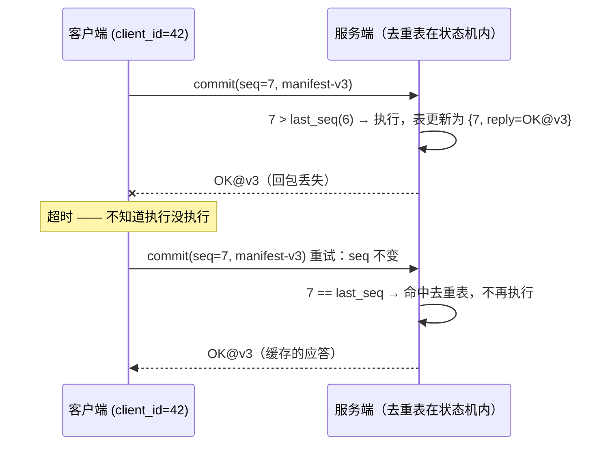

---
tags:
  - 高性能存储
  - 分布式存储
status: 已完成
---

# 幂等、重试与请求去重

> [[7.12 Lease 与 Fencing]] 管住了服务端的"旧主复活"；本篇管客户端侧的孪生问题：**请求超时了，怎么办？** 超时的唯一含义是"不知道"——请求可能没送到、可能执行了但回包丢了、也可能还在队列里排队。客户端唯一可用的手段是重试，但盲目重试会**把一次转账变成两次转账**。工程答案是一条等式：**"恰好一次"的效果 = 至少一次的投递 + 服务端去重的执行**。去重靠"请求 ID + 会话 + 去重表"，而且去重表必须作为复制状态机的一部分随日志复制、随快照持久——否则主一切换，重试就穿透了。本篇从投递语义讲到去重表的实现与成本，再用 checkpoint 提交的重试风暴把吞吐、尾延迟、CPU、内存、网络的因果链算一遍。

前置：[[7.12 Lease 与 Fencing]]（epoch/token 思想在本篇继续使用）、[[7.11 Primary-Backup 与 Multi-Raft]]（去重表为什么必须进复制状态机）。

---

## 1. 名词与背景：超时的三义性与三种投递语义

**超时意味着什么**【事实】：客户端发出写请求，等了 2 秒没有回复。此刻有且只有三种可能，且客户端**无法区分**：

1. 请求在网络里丢了，服务端从没见过它（重发无害）；
2. 服务端执行成功，但**回包**丢了（重发 = 执行两次）；
3. 请求还活着——在服务端队列里排队、或正在执行（重发 = 可能并发执行两次）。

这与 [[7.12 Lease 与 Fencing]] 开头"没回复无法区分死/慢/断"是同一个不可区分性，只是站在客户端视角。

**三种投递语义**（先给定义）【事实】：

- **至多一次（at-most-once）**：不重试。丢了就丢了——请求可能执行 0 次或 1 次。适合可容忍丢失的数据（监控打点）；
- **至少一次（at-least-once）**：超时就重试直到确认。请求执行 ≥ 1 次——不丢，但可能重复。这是所有可靠传输的基础形态；
- **恰好一次（exactly-once）**：严格说**投递层做不到**（这是分布式系统的经典结论：确认本身也会丢）。工程上做到的是**效果恰好一次（exactly-once effect / effectively-once）**：投递按至少一次做，执行端把重复请求识别出来、只生效一次。

**为什么 TCP 不能替你解决**【事实/OS 网络层】：TCP 在传输层早就做了这套事——每个字节有序列号，接收端丢弃重复段、按序交付，所以**单条连接内**字节流是恰好一次的。但 TCP 的序列号和确认状态都活在两端内核的连接控制块里：**连接一断（超时、RST、进程重启），这些状态全部消失**。重连之后，"上一条连接里最后那个请求到底执行没执行"这个信息在传输层已无处可查——应用层重发只是"新连接里的新字节流"，TCP 照单全收。结论：**跨连接、跨进程重启的恰好一次，必须由应用层自己维护状态**。RDMA 同理且更尖锐：重连后在途 WQE 的命运不可知（[[4.19 RDMA 故障恢复与连接重建]]）。

---

## 2. 幂等：让"执行两次"无害

**定义**【事实】：操作 f 幂等，指执行一次和执行多次的最终效果相同：f(f(x)) = f(x)。幂等操作天然免疫重复——重试随便发。

| 操作 | 幂等？ | 原因 |
| --- | --- | --- |
| `set k = v`（全量覆盖写） | 是 | 写两遍结果一样 |
| `delete k` | 是（按效果） | 第二次删是 no-op（但返回值可能不同：见 §7） |
| 指定 ID 的 `create(id, ...)` | 是 | 第二次报"已存在"，可判定 |
| `increment k`（计数器 +1） | **否** | 执行两次 = +2 |
| `append(data)`（尾部追加） | **否** | 追加两次 = 数据翻倍 |
| 不带 ID 的 `create(...)`（服务端生成 ID） | **否** | 建出两个对象 |
| `CAS(k, expect, new)`（条件写） | 是 | 第二次 expect 不匹配而失败，可判定 |

**改造思路**【实践】：把非幂等操作改写成"带唯一标识的条件操作"。`increment` 改成"记账式"：`apply_delta(op_id, +1)`，服务端记住见过的 `op_id`；`append` 改成"写到指定偏移"（offset 由客户端持有）；`create` 让客户端生成 ID（UUID / 雪花号）。共同点：**让第二次执行变得可识别**——识别的通用机制就是下一节的请求 ID 去重。

---

## 3. 请求 ID 去重：机制与它必须缓存应答的原因

**机制**【实现】：客户端注册一个**会话（session）**拿到 `client_id`；此后每个请求带 `(client_id, seq)`，`seq` 在会话内单调递增；**重试时 `(client_id, seq)` 保持不变**（这是全机制的命门——换了 ID 的重试等于新请求）。服务端维护**去重表**：

```text
dedup_table: client_id → { last_seq, cached_reply }
```

收到请求时：`seq > last_seq` → 正常执行并更新表；`seq == last_seq` → **不执行**，直接返回 `cached_reply`；`seq < last_seq` → 过期的迟到重试，丢弃或报错。



**为什么必须缓存应答，而不是只记 seq**【事实】：假设操作是 `CAS(version=3→4)`，首次执行成功。若服务端只记"7 见过"而不存结果，重试到达时它只能重新读当前状态（version 已是 4）再回答——会误报"CAS 失败"。客户端收到的答案必须**与首次执行的答案完全一致**，所以表里存的是完整应答（或足以重构应答的结果摘要）。

---

## 4. 去重表必须活在复制状态机里

单机版去重表放内存 hash 就行；分布式下有两个致命穿透点【事实】：

1. **主切换穿透**：去重表只在旧主内存里 → 新主上任后表是空的 → 客户端把超时请求重试到新主 → 重复执行。而这恰恰是最容易超时的时刻（切换期间请求大面积超时）——**去重最被需要的时刻正是裸内存表失效的时刻**；
2. **重启穿透**：单副本重启后失忆，同理。

解法【实现】：把去重判定放进**状态机的 apply 路径**——`(client_id, seq)` 跟随命令一起写进 Raft 日志，apply 时先查表再执行，表的更新与命令效果在同一次 apply 里原子完成。于是去重表随日志复制到全部副本、随快照持久化：换主、重启都不失忆。这也解释了为什么 [[7.11 Primary-Backup 与 Multi-Raft]] 强调 apply 必须确定性——去重判定是状态机逻辑的一部分。

与单机世界的同构【事实】：[[6.18 WAL 回放幂等性]] 处理的是同一个问题在时间轴上的投影——崩溃恢复时 WAL 从上个检查点重放，每条记录可能被 apply 第二次，靠 LSN/applied_index 判"这条已经生效过"。**网络重试是空间上的重放，崩溃恢复是时间上的重放**，答案都是"执行端记住进度，重复到达则跳过"。

**与 fencing/epoch 的配合**【实现】：请求跨越主切换时，客户端可能拿着旧 term 时代发出的请求重试到新主。由于去重表是复制状态的一部分，新主照样能正确判定"这条在旧主任内已提交过"。反过来，服务端响应里带上当前 epoch，客户端发现 epoch 前进即可刷新路由缓存。注意分工：**fencing 挡的是旧主的写，去重挡的是旧请求的重复**——一个管服务端身份，一个管请求身份，正交且都需要。

---

## 5. 会话生命周期：去重表不能无限大

去重表的内存成本 = 活跃会话数 × （表项 + 缓存应答）【事实】。10 万客户端 × 每会话 1 KB ≈ 100 MB——可控，但前提是**会话有限期**：

- **每会话只记最近窗口**：最简单的形态是每客户端一个 `last_seq`（要求该客户端串行发请求）；允许流水线并发则记一个滑动窗口（如最近 64 个 seq 的位图 + 应答环）——内存与并发度线性；
- **会话过期（TTL/LRU 淘汰）**：长期沉默的会话被回收。此后它的迟到重试到达时，服务端**无法判定**是否重复——正确做法是返回明确错误 `SESSION_EXPIRED` 让上层人工/逻辑介入，**而不是默默重新执行**（Raft 博士论文 6.3 节同一结论）。把"不知道"暴露出去，永远好过赌一把；
- **淘汰参数是正确性参数**【取舍】：会话 TTL 必须显著大于"客户端最长可能的重试跨度"（含其自身 GC/重启时间），否则正常客户端也会撞上 `SESSION_EXPIRED`。这不是性能调参，是语义边界。

---

## 6. 真实工作负载：checkpoint 提交与重试风暴

沿用前两篇的场景：3000 GPU worker 每 30 分钟 checkpoint。数据 chunk 写完后，每个 worker 向元数据服务发**commit**：把 manifest 从临时版提升为正式版。这一步是典型的"必须恰好一次"——commit 两次可能把并发下一轮的 manifest 覆盖，commit 零次则 2 GB 数据成为孤儿。

**第一层防线：把 commit 本身设计成幂等**【实践】：commit 实现为 `CAS(manifest_version: v3 → v4)` 并带 `(client_id, seq)`。于是同一 worker 的重试被去重表吸收；即便去重表淘汰后穿透，CAS 的 expect 不匹配也会失败而非覆盖——幂等 API 与去重表互为纵深。

**重试风暴的正反馈**【事实】：checkpoint 是同步屏障，3000 个 worker 几乎同时提交。若元数据服务瞬时过载、延迟越过客户端超时：客户端集体重试 → 负载翻倍 → 队列更长 → 更多超时 → 再重试——**过载自我放大**，最终崩塌（congestive collapse）。这与 TCP 拥塞崩溃是同一形态，对策也同构：

| 对策 | 机制 | 对应 TCP 概念 |
| --- | --- | --- |
| 指数退避 | 重试间隔 ×2 递增，给服务端排空队列的时间 | RTO 指数退避 |
| 抖动（jitter） | 退避时间加随机量，打散 3000 个客户端的重试相位 | —（防同步化） |
| 重试预算（retry budget） | 全客户端重试量 ≤ 正常流量的固定比例（如 10%），超了直接放弃 | 拥塞窗口 |
| 服务端限流/快速拒绝 | 过载时立刻回 `RETRY_LATER` 而不是排队到超时 | RED/ECN 主动通知 |

服务端侧的配套是 [[7.18 Backpressure 与过载保护]]：**快速拒绝一个请求的成本是微秒，排队到超时的成本是"占着内存和队列位却注定白干"**。

**五种资源的因果链**【实践】：

| 资源 | 因果链 |
| --- | --- |
| 吞吐 | 重试是纯放大器：有效吞吐 = 总处理量 ÷ (1+重试率)。风暴期重试率可达数倍——服务端在满负荷跑，有效吞吐反而趋零。retry budget 把放大系数钉死 |
| 尾延迟 | 超时值设定 = 尾延迟契约：设太紧（贴 p99）→ 1% 请求天然超时，凭空制造 1% 重试；设太松 → 真故障时用户等满全额超时。基线：超时 > p99.9 + 一次退避 |
| CPU | 去重查表 O(1)、微秒级，可忽略；真正烧 CPU 的是重复请求的完整解析/鉴权/路由——去重命中越早（apply 前先查一次只读快照可作优化），浪费越少 |
| 内存 | 去重表 = 会话数 × 表项（可控）；失控的是过载时的排队内存：每个排队请求连带 buffer 与上下文。快速拒绝本质是用"放弃"换内存上限 |
| 网络 | 重试 ×k 放大请求流量；hedged request（对冲请求：p99 迟迟不回时向另一副本再发一份，取先回者）只可用于**读或严格幂等写**，且它主动制造重复——是"用流量买尾延迟"的显式交易 |

---

## 7. API 设计建议

1. **所有写接口显式接收幂等键**（idempotency key / `(client_id, seq)`）：把"支持安全重试"做成 API 契约而不是客户端的祈祷。对象存储的条件写（If-Match / If-None-Match、S3 conditional write）就是这个思想的 HTTP 形态；
2. **错误码三分**：明确成功 / 明确失败（如参数错——**不该重试**）/ **不确定**（超时、连接断——可以重试）。SDK 对"明确失败"重试是纯浪费，对"不确定"不重试是丢数据；
3. **重试只放一层**：应用层、RPC 框架、SDK 各自默认重试 3 次 = 最多 27 次放大。约定重试归属（通常最外层业务层，因为只有它知道语义是否幂等），其余层关掉；
4. **传播 deadline 而不是各层各设超时**：请求带绝对截止时刻，每层用剩余量决定还试不试——避免"外层已放弃，内层还在勤恳重试"的无效功；
5. **返回值幂等化**：`delete` 第二次返回"已不存在"时，对携带相同幂等键的重试应返回与首次一致的"删除成功"（靠缓存应答），避免上层把重试命中当业务错误。

---

## 8. Modern C++：客户端重试骨架与服务端去重表

客户端：同一 `(client_id, seq)` 贯穿所有重试；指数退避 + 抖动；deadline 用完即止：

```cpp
#include <chrono>
#include <cstdint>
#include <expected>
#include <random>
#include <thread>

using Clock = std::chrono::steady_clock;

struct Reply { /* ... */ };
enum class RpcError { timeout, connection_lost, definite_failure, retry_later };

class RetryingClient {
public:
    RetryingClient(std::uint64_t client_id) : client_id_{client_id} {}

    std::expected<Reply, RpcError>
    commit(const Manifest& m, Clock::time_point deadline) {
        const std::uint64_t seq = next_seq_++;   // 重试期间恒定
        auto backoff = std::chrono::milliseconds{50};
        while (true) {
            auto r = send_once(client_id_, seq, m, deadline);
            if (r || r.error() == RpcError::definite_failure)
                return r;                        // 成功，或明确失败：都不重试
            if (Clock::now() + backoff >= deadline)
                return std::unexpected{RpcError::timeout};  // 结果不确定，如实上报
            std::this_thread::sleep_for(backoff + jitter(backoff));
            backoff *= 2;                        // 指数退避
        }
    }

private:
    std::chrono::milliseconds jitter(std::chrono::milliseconds base) {
        std::uniform_int_distribution<long> d{0, base.count()};
        return std::chrono::milliseconds{d(rng_)};  // 打散重试相位，防风暴同步化
    }
    std::expected<Reply, RpcError>
    send_once(std::uint64_t, std::uint64_t, const Manifest&, Clock::time_point);

    std::uint64_t client_id_;
    std::uint64_t next_seq_{1};
    std::mt19937 rng_{std::random_device{}()};
};
```

服务端：去重判定在状态机 apply 路径内，与命令效果同批持久化：

```cpp
#include <cstdint>
#include <optional>
#include <unordered_map>

struct SessionState {
    std::uint64_t last_seq{0};
    Reply cached_reply;          // 必须缓存应答：重试要拿到与首次一致的结果
};

class DedupTable {                // 本表是复制状态机的一部分：随日志 apply、随快照持久
public:
    // apply 路径调用：返回 nullopt 表示新请求，应执行；否则直接回缓存应答
    std::optional<Reply> check(std::uint64_t client_id, std::uint64_t seq) const {
        if (auto it = sessions_.find(client_id); it != sessions_.end()) {
            if (seq == it->second.last_seq) return it->second.cached_reply;
            // seq < last_seq：过期迟到重试，由调用方丢弃
        }
        return std::nullopt;
    }
    void record(std::uint64_t client_id, std::uint64_t seq, Reply r) {
        sessions_[client_id] = SessionState{seq, std::move(r)};
    }
    // 会话 TTL 淘汰：淘汰后该客户端的迟到重试返回 SESSION_EXPIRED，绝不重执行

private:
    std::unordered_map<std::uint64_t, SessionState> sessions_;
};
```

要点【实践】：`check/record` 必须在同一次 apply 内完成（同一条日志的效果），不能"先查内存表、执行后异步补记"——那会在两步之间留下重复执行窗口。

---

## 9. 排障清单：症状 → 原因 → 检查

| 症状 | 常见原因 | 检查动作 |
| --- | --- | --- |
| 计数器偏大 / 数据出现重复条目 | 非幂等操作 + 至少一次重试，无去重 | 核对写接口是否带幂等键；服务端是否有去重表 |
| 只在主切换后出现重复执行 | 去重表在旧主内存里，未随状态机复制 | 确认去重判定在 apply 路径内、表进快照 |
| 重试后收到与首次不一致的结果 | 只记 seq 未缓存应答，重试触发重新求值 | 检查表项是否含 cached_reply |
| 过载时流量不降反升直至崩塌 | 无退避/无抖动/无重试预算的正反馈 | 统计重试率；核对退避曲线与 budget 配置 |
| 恒定 ~1% 请求超时重试 | 超时值贴着 p99 设定 | 对比超时配置与延迟分布，抬到 p99.9 之上 |
| 同一操作偶发执行 9+ 次 | 多层重试叠乘（SDK×RPC×应用） | 逐层清点重试配置，只留一层 |
| 老客户端偶发 SESSION_EXPIRED | 会话 TTL 小于客户端最长重试跨度 | 拉长会话 TTL 或让客户端异常后重建会话重发 |
| 写路径 hedged request 后数据错乱 | 对非幂等写做了对冲 | 对冲仅限读/严格幂等写 |

---

## 10. 陷阱与误区

> [!warning] 常见错误
> 1. **重试时更换请求 ID**：每次重试生成新 UUID——去重表形同虚设。幂等键必须在整个重试序列中恒定。
> 2. **以为 TCP 已经保证了恰好一次**：TCP 的去重止于单连接生命周期；跨连接/重启的请求身份必须应用层自己记。
> 3. **去重表只放主内存**：最需要去重的时刻（切换、崩溃）恰是内存表失效的时刻。表必须是复制状态的一部分。
> 4. **只记 seq 不存应答**：重试拿到"重新求值"的答案（如 CAS 误报失败）。缓存首次应答是语义要求不是优化。
> 5. **会话淘汰后默默重执行**：无法判定就明确报 `SESSION_EXPIRED`，把"不知道"暴露给上层，不赌。
> 6. **对明确失败重试**：参数错、权限错重试一万次也不会变对，只放大负载。错误必须三分：成功/明确失败/不确定。
> 7. **无抖动的指数退避**：所有客户端同步退避又同步返场，风暴变成脉冲风暴。退避必须加随机抖动。
> 8. **把去重当 fencing、或反之**：去重挡"同一请求重复"，fencing 挡"旧主的新请求"（[[7.12 Lease 与 Fencing]]）——两个正交防线，谁也替不了谁。

---

## 11. 关键结论

| 结论 | 性质 |
| --- | --- |
| 超时 = 不知道：请求可能执行了 0 次、1 次，或正在执行——客户端无法区分 | 事实 |
| 投递层做不到恰好一次；工程目标是"效果恰好一次" = 至少一次投递 + 执行端去重 | 事实 |
| TCP 的恰好一次止于单连接：跨连接/重启的请求身份必须应用层维护 | 事实 |
| 幂等改造的通法：把操作变成"带唯一标识的条件操作"（CAS/指定 ID/指定偏移） | 实践结论 |
| 去重机制 = 会话 + 单调 seq + {last_seq, cached_reply} 表；重试必须复用同一 (client_id, seq) | 实现 |
| 去重表必须随复制状态机走（日志 + 快照），否则主切换即穿透——网络重试与 WAL 回放是同一问题的空间/时间投影 | 事实 / 实现 |
| 会话必须有限期；淘汰后无法判定的重试报明确错误，不重执行 | 实现 / 取舍 |
| 重试是过载放大器：指数退避 + 抖动 + 重试预算 + 服务端快速拒绝，四件套缺一不可 | 实践结论 |
| 超时值是尾延迟契约：以 p99.9 为下界；hedged request 是"用流量买尾延迟"，仅限幂等操作 | 取舍 |
| 去重与 fencing 正交：一个验请求身份，一个验服务端身份 | 事实 |

---

## 关联知识

- [[7.12 Lease 与 Fencing]] - 服务端身份防线；epoch 与去重的分工
- [[7.11 Primary-Backup 与 Multi-Raft]] - 去重表寄生的复制状态机与确定性 apply
- [[7.18 Backpressure 与过载保护]] - 重试风暴的服务端侧对策
- [[6.18 WAL 回放幂等性]] - 同一问题的单机/时间轴形态（LSN 判重）
- [[4.19 RDMA 故障恢复与连接重建]] - 重连后在途操作不确定性的传输层实例
- [[7.9 一致性模型]] - "效果恰好一次"与线性一致的关系

## 参考

- Diego Ongaro. *Consensus: Bridging Theory and Practice* 第 6.3 节（client session 与去重表进状态机/快照）
- Kleppmann. *Designing Data-Intensive Applications* 第 8 章（超时不可区分性）、第 11 章（exactly-once effect）
- gRPC Retry Design（`service config` 中的退避、重试上限与 retry throttling/budget）
- Dean, Barroso. *The Tail at Scale*, CACM 2013（hedged request）
- Amazon Builders' Library: *Timeouts, retries, and backoff with jitter*
- RFC 9293 (TCP)：序列号去重的范围与生命周期
